# API Reference

<cite>
**Referenced Files in This Document**
- [AgentsExecutionEnvironment.java](file://api/src/main/java/org/apache/flink/agents/api/AgentsExecutionEnvironment.java)
- [AgentBuilder.java](file://api/src/main/java/org/apache/flink/agents/api/AgentBuilder.java)
- [Agent.java](file://api/src/main/java/org/apache/flink/agents/api/agents/Agent.java)
- [OutputSchema.java](file://api/src/main/java/org/apache/flink/agents/api/agents/OutputSchema.java)
- [ReActAgent.java](file://api/src/main/java/org/apache/flink/agents/api/agents/ReActAgent.java)
- [Configuration.java](file://api/src/main/java/org/apache/flink/agents/api/configuration/Configuration.java)
- [ConfigOption.java](file://api/src/main/java/org/apache/flink/agents/api/configuration/ConfigOption.java)
- [ResourceDescriptor.java](file://api/src/main/java/org/apache/flink/agents/api/resource/ResourceDescriptor.java)
- [MemoryObject.java](file://api/src/main/java/org/apache/flink/agents/api/context/MemoryObject.java)
- [ChatRequestEvent.java](file://api/src/main/java/org/apache/flink/agents/api/event/ChatRequestEvent.java)
- [Tool.java](file://api/src/main/java/org/apache/flink/agents/api/tools/Tool.java)
- [MemorySet.java](file://api/src/main/java/org/apache/flink/agents/api/memory/MemorySet.java)
- [VectorStoreQuery.java](file://api/src/main/java/org/apache/flink/agents/api/vectorstores/VectorStoreQuery.java)
- [Action.java](file://api/src/main/java/org/apache/flink/agents/api/annotation/Action.java)
- [ReActAgentExample.java](file://examples/src/main/java/org/apache/flink/agents/examples/ReActAgentExample.java)
</cite>

## Table of Contents
1. [Introduction](#introduction)
2. [Project Structure](#project-structure)
3. [Core Components](#core-components)
4. [Architecture Overview](#architecture-overview)
5. [Detailed Component Analysis](#detailed-component-analysis)
6. [Dependency Analysis](#dependency-analysis)
7. [Performance Considerations](#performance-considerations)
8. [Troubleshooting Guide](#troubleshooting-guide)
9. [Conclusion](#conclusion)
10. [Appendices](#appendices)

## Introduction
This API Reference documents the Flink Agents public interfaces and core APIs for building intelligent streaming agents on Apache Flink. It covers execution environments, agent builders, built-in agents, configuration, resource descriptors, memory objects, tool registration, and event systems. The guide organizes APIs by functional areas, provides method-level documentation, cross-references related APIs, and includes usage patterns and examples.

## Project Structure
Flink Agents exposes a clean separation of concerns across:
- Execution Environment: orchestration of agent pipelines on Flink
- Agent Builder: fluent API to configure inputs and outputs
- Agent Core: base agent and built-in ReAct agent
- Configuration: typed configuration options and runtime configuration
- Resources: resource descriptors and serializable resources
- Events: typed event model for agent interactions
- Tools: tool base class and function-based tool creation
- Memory: short-term memory abstraction and long-term memory sets
- Vector Stores: query model for vector-backed retrieval

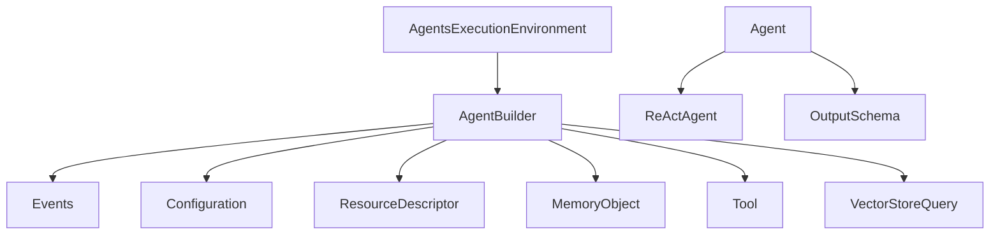

**Diagram sources**
- [AgentsExecutionEnvironment.java](file://api/src/main/java/org/apache/flink/agents/api/AgentsExecutionEnvironment.java#L43-L222)
- [AgentBuilder.java](file://api/src/main/java/org/apache/flink/agents/api/AgentBuilder.java#L35-L76)
- [Agent.java](file://api/src/main/java/org/apache/flink/agents/api/agents/Agent.java#L34-L130)
- [ReActAgent.java](file://api/src/main/java/org/apache/flink/agents/api/agents/ReActAgent.java#L51-L182)
- [OutputSchema.java](file://api/src/main/java/org/apache/flink/agents/api/agents/OutputSchema.java#L50-L134)
- [Configuration.java](file://api/src/main/java/org/apache/flink/agents/api/configuration/Configuration.java#L20-L24)
- [ResourceDescriptor.java](file://api/src/main/java/org/apache/flink/agents/api/resource/ResourceDescriptor.java#L29-L143)
- [MemoryObject.java](file://api/src/main/java/org/apache/flink/agents/api/context/MemoryObject.java#L29-L131)
- [Tool.java](file://api/src/main/java/org/apache/flink/agents/api/tools/Tool.java#L30-L69)
- [VectorStoreQuery.java](file://api/src/main/java/org/apache/flink/agents/api/vectorstores/VectorStoreQuery.java#L33-L109)

**Section sources**
- [AgentsExecutionEnvironment.java](file://api/src/main/java/org/apache/flink/agents/api/AgentsExecutionEnvironment.java#L43-L222)
- [AgentBuilder.java](file://api/src/main/java/org/apache/flink/agents/api/AgentBuilder.java#L35-L76)

## Core Components
This section documents the primary public APIs for building and running agents.

### AgentsExecutionEnvironment
- Purpose: Entry point to create and configure agent pipelines in local or remote Flink environments.
- Key methods:
  - getExecutionEnvironment(StreamExecutionEnvironment, StreamTableEnvironment): Factory returning local or remote environment.
  - getExecutionEnvironment(StreamExecutionEnvironment): Convenience overload.
  - getExecutionEnvironment(): Convenience overload for local-only.
  - getConfig(): Returns a writable configuration object.
  - fromList(List<Object>): Configure agent pipeline from a local list.
  - fromDataStream(DataStream<T>, KeySelector<T,K>): Configure from a keyed DataStream.
  - fromDataStream(DataStream<T>): Convenience overload without keying.
  - fromTable(Table, KeySelector<K>): Configure from a keyed Table.
  - fromTable(Table): Convenience overload without keying.
  - execute(): Execute the configured pipeline.
  - addResource(String, ResourceType, Object): Register a serializable resource or resource descriptor.
- Exceptions:
  - IllegalArgumentException when adding duplicate resources or unsupported resource types.
  - RuntimeException when environment instantiation fails.
- Notes:
  - Remote environments require a StreamExecutionEnvironment; otherwise a local environment is created.

**Section sources**
- [AgentsExecutionEnvironment.java](file://api/src/main/java/org/apache/flink/agents/api/AgentsExecutionEnvironment.java#L68-L221)

### AgentBuilder
- Purpose: Fluent builder to connect agents to inputs and define outputs.
- Key methods:
  - apply(Agent): Attach an agent to the pipeline.
  - toList(): Collect outputs as a list of maps for local execution.
  - toDataStream(): Convert outputs to a Flink DataStream.
  - toTable(Schema): Convert outputs to a Flink Table.
- Usage pattern:
  - Chain fromDataStream(...).apply(agent).toDataStream() for streaming pipelines.
  - Chain fromList(...).apply(agent).toList() for local execution.

**Section sources**
- [AgentBuilder.java](file://api/src/main/java/org/apache/flink/agents/api/AgentBuilder.java#L35-L76)

### Agent
- Purpose: Base class for defining agent logic with actions and resources.
- Key methods:
  - addAction(Class<? extends Event>[], Method, Map<String,Object>): Register a static action listening to specified events.
  - addAction(Class<? extends Event>[], Method): Overload without config.
  - addResource(String, ResourceType, Object): Add a serializable resource or resource descriptor.
  - addResourcesIfAbsent(Map<ResourceType, Map<String,Object>>): Merge resources if absent.
  - getActions(), getResources(): Accessors for internal state.
- Error handling:
  - Throws IllegalArgumentException if an action or resource name is duplicated.
- Constants:
  - STRUCTURED_OUTPUT: Name of the structured output key in events.

**Section sources**
- [Agent.java](file://api/src/main/java/org/apache/flink/agents/api/agents/Agent.java#L34-L130)

### ReActAgent
- Purpose: Built-in ReAct-style agent leveraging chat models and optional output schema enforcement.
- Constructor parameters:
  - ResourceDescriptor descriptor: Chat model connection descriptor.
  - Prompt prompt: Optional user prompt to format inputs.
  - Object outputSchema: Optional RowTypeInfo or POJO class for JSON schema enforcement.
- Behavior:
  - Automatically registers a default chat model resource and optional schema/user prompts.
  - Defines a startAction that formats input into ChatMessage(s) and emits a ChatRequestEvent with optional output schema.
  - Provides a stopAction annotated to listen to ChatResponseEvent and emits an OutputEvent with structured or plain content.
- Exceptions:
  - IllegalArgumentException for invalid output schema types.
  - RuntimeException for missing user prompt when input is not primitive and cannot be converted to messages.

**Section sources**
- [ReActAgent.java](file://api/src/main/java/org/apache/flink/agents/api/agents/ReActAgent.java#L59-L182)

### OutputSchema
- Purpose: Encapsulates RowTypeInfo for output schema serialization/deserialization.
- Constraints:
  - Only supports basic types per field; non-basic types are rejected.
- Serialization:
  - JSON includes field names and types arrays.
- Methods:
  - getSchema(): Retrieve the RowTypeInfo.
  - Nested serializers/deserializers for Jackson.

**Section sources**
- [OutputSchema.java](file://api/src/main/java/org/apache/flink/agents/api/agents/OutputSchema.java#L50-L134)

### Configuration and ConfigOption
- Configuration: Combined readable/writable configuration interface.
- ConfigOption<T>: Describes a typed configuration key with default value and type name.
- Typical usage:
  - Read/write via AgentsExecutionEnvironment.getConfig().
  - Define options and defaults in agent configuration classes.

**Section sources**
- [Configuration.java](file://api/src/main/java/org/apache/flink/agents/api/configuration/Configuration.java#L20-L24)
- [ConfigOption.java](file://api/src/main/java/org/apache/flink/agents/api/configuration/ConfigOption.java#L23-L102)

### ResourceDescriptor
- Purpose: Describes a resource for cross-language compatibility (Java/Python).
- Fields:
  - clazz: Fully qualified Java class name or simple Python class name.
  - module: Python module path (empty for Java).
  - initialArguments: Initialization arguments map.
- Builder:
  - newBuilder(clazz).addInitialArgument(name, value).build().

**Section sources**
- [ResourceDescriptor.java](file://api/src/main/java/org/apache/flink/agents/api/resource/ResourceDescriptor.java#L29-L143)

### MemoryObject
- Purpose: Abstraction for accessing/manipulating fields in short-term memory.
- Operations:
  - get(String path), get(MemoryRef ref): Resolve a field.
  - set(String path, Object value): Set a direct field; auto-create missing intermediate objects.
  - newObject(String path, boolean overwrite): Create nested object.
  - isExist(String path), getFieldNames(), getFields(), getValue(), isNestedObject(): Inspect state.
- Exceptions:
  - Throws on invalid overwrite attempts or state-backend failures.

**Section sources**
- [MemoryObject.java](file://api/src/main/java/org/apache/flink/agents/api/context/MemoryObject.java#L29-L131)

### Tool
- Purpose: Base class for tools with metadata, resource type, and call semantics.
- Methods:
  - getMetadata(), getResourceType(), getToolType(), call(ToolParameters), getName(), getDescription(), fromMethod(Method).

**Section sources**
- [Tool.java](file://api/src/main/java/org/apache/flink/agents/api/tools/Tool.java#L30-L69)

### MemorySet
- Purpose: Long-term memory set abstraction with capacity, compaction, and CRUD-like operations.
- Methods:
  - add(List, List<String>, List<Map>): Add items with optional IDs and metadata.
  - get(List<String>): Retrieve items by ID.
  - search(String, int, Map<String,Object>): Semantic search with extra args.
  - size(): Current number of items.
  - Accessors: getName(), getItemType(), getCapacity(), getCompactionConfig().

**Section sources**
- [MemorySet.java](file://api/src/main/java/org/apache/flink/agents/api/memory/MemorySet.java#L32-L159)

### VectorStoreQuery
- Purpose: Encapsulates a vector store query with mode, text, limit, collection, and extra arguments.
- Modes: SEMANTIC, KEYWORD, HYBRID (via VectorStoreQueryMode).
- Constructors:
  - Default semantic query with limit.
  - Collection-aware semantic query.
  - Explicit mode and extra args.

**Section sources**
- [VectorStoreQuery.java](file://api/src/main/java/org/apache/flink/agents/api/vectorstores/VectorStoreQuery.java#L33-L109)

### Events
- ChatRequestEvent: Represents a chat model request with model, messages, and optional output schema.
- Other events: ToolRequestEvent, ToolResponseEvent, ContextRetrievalRequestEvent, ContextRetrievalResponseEvent, ChatResponseEvent, InputEvent, OutputEvent, Event, EventContext, EventFilter.

**Section sources**
- [ChatRequestEvent.java](file://api/src/main/java/org/apache/flink/agents/api/event/ChatRequestEvent.java#L29-L57)

### Annotations
- Action: Marks a static method as an agent action listening to specified event types.

**Section sources**
- [Action.java](file://api/src/main/java/org/apache/flink/agents/api/annotation/Action.java#L28-L53)

## Architecture Overview
The execution flow connects an execution environment to a builder, then to agents and tools, emitting events and producing outputs.

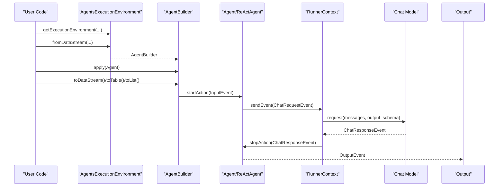

**Diagram sources**
- [AgentsExecutionEnvironment.java](file://api/src/main/java/org/apache/flink/agents/api/AgentsExecutionEnvironment.java#L139-L198)
- [AgentBuilder.java](file://api/src/main/java/org/apache/flink/agents/api/AgentBuilder.java#L35-L76)
- [Agent.java](file://api/src/main/java/org/apache/flink/agents/api/agents/Agent.java#L34-L130)
- [ReActAgent.java](file://api/src/main/java/org/apache/flink/agents/api/agents/ReActAgent.java#L59-L182)
- [ChatRequestEvent.java](file://api/src/main/java/org/apache/flink/agents/api/event/ChatRequestEvent.java#L29-L57)

## Detailed Component Analysis

### AgentsExecutionEnvironment
- Responsibilities:
  - Environment selection (local vs remote).
  - Input binding (list, DataStream, Table).
  - Resource registration.
  - Pipeline execution.
- Complexity:
  - addResource: O(1) average map insert; duplicates guarded.
  - from* methods: delegate to environment-specific implementations.

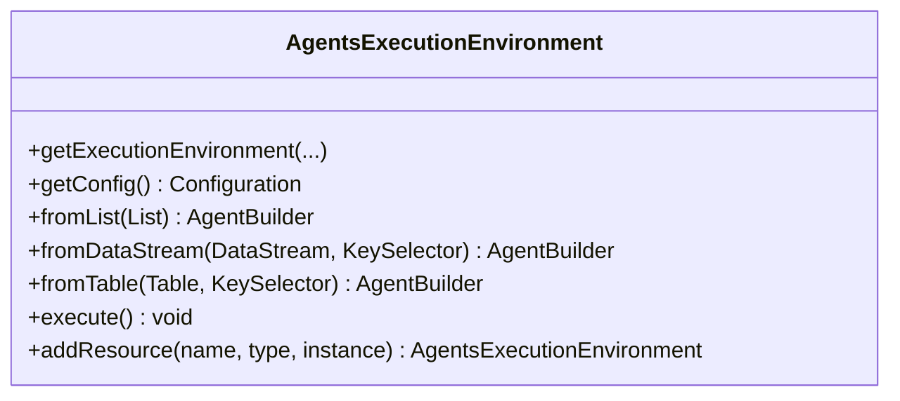

**Diagram sources**
- [AgentsExecutionEnvironment.java](file://api/src/main/java/org/apache/flink/agents/api/AgentsExecutionEnvironment.java#L43-L222)

**Section sources**
- [AgentsExecutionEnvironment.java](file://api/src/main/java/org/apache/flink/agents/api/AgentsExecutionEnvironment.java#L68-L221)

### AgentBuilder
- Responsibilities:
  - Fluent configuration of agent pipelines.
  - Output conversion to list, DataStream, or Table.
- Complexity:
  - toList/toDataStream/toTable are terminal operations; cost depends on downstream Flink operators.

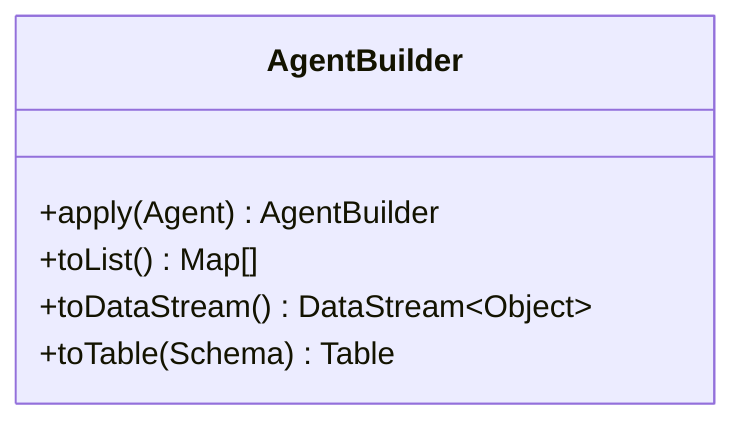

**Diagram sources**
- [AgentBuilder.java](file://api/src/main/java/org/apache/flink/agents/api/AgentBuilder.java#L35-L76)

**Section sources**
- [AgentBuilder.java](file://api/src/main/java/org/apache/flink/agents/api/AgentBuilder.java#L35-L76)

### Agent and ReActAgent
- Agent:
  - Manages actions (static methods) and resources.
  - Enforces uniqueness of action/resource names.
- ReActAgent:
  - Registers default resources and actions.
  - Converts inputs to ChatMessage(s) and emits ChatRequestEvent.
  - Emits OutputEvent with structured or plain content.

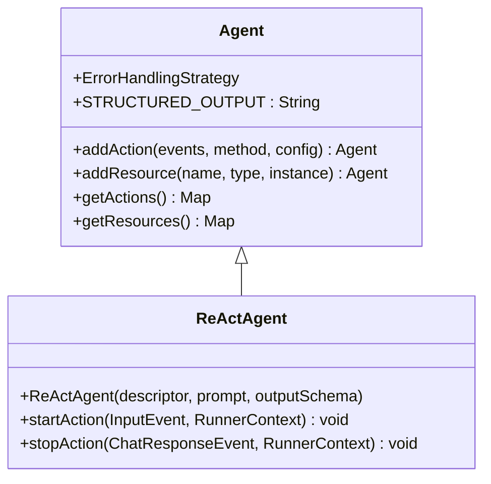

**Diagram sources**
- [Agent.java](file://api/src/main/java/org/apache/flink/agents/api/agents/Agent.java#L34-L130)
- [ReActAgent.java](file://api/src/main/java/org/apache/flink/agents/api/agents/ReActAgent.java#L51-L182)

**Section sources**
- [Agent.java](file://api/src/main/java/org/apache/flink/agents/api/agents/Agent.java#L34-L130)
- [ReActAgent.java](file://api/src/main/java/org/apache/flink/agents/api/agents/ReActAgent.java#L59-L182)

### OutputSchema
- Serialization/deserialization ensures schema portability across languages.
- Validation restricts supported types to basic types.

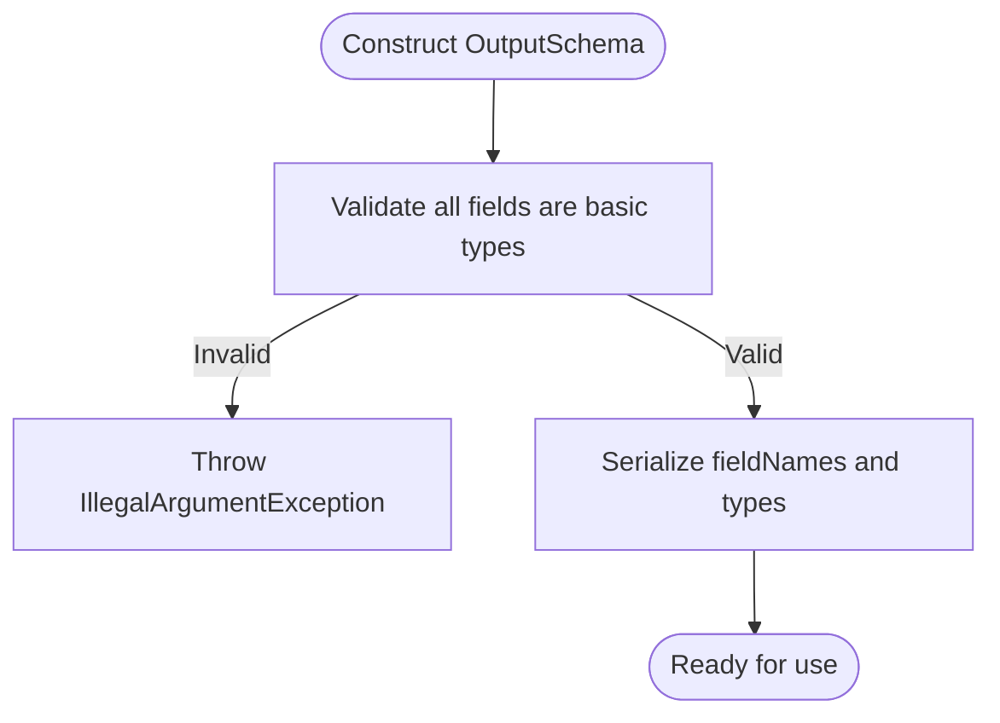

**Diagram sources**
- [OutputSchema.java](file://api/src/main/java/org/apache/flink/agents/api/agents/OutputSchema.java#L53-L61)

**Section sources**
- [OutputSchema.java](file://api/src/main/java/org/apache/flink/agents/api/agents/OutputSchema.java#L50-L134)

### Configuration and ConfigOption
- ConfigOption<T> defines a typed configuration key with default value and type name.
- Configuration combines readable and writable capabilities.

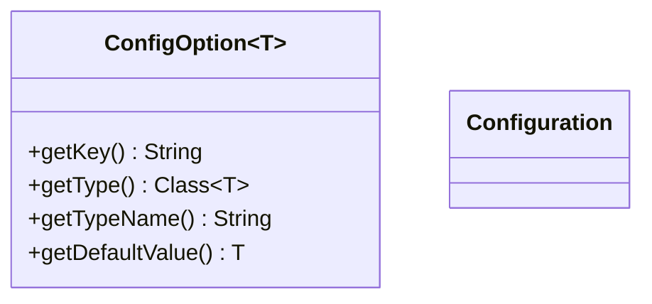

**Diagram sources**
- [ConfigOption.java](file://api/src/main/java/org/apache/flink/agents/api/configuration/ConfigOption.java#L23-L102)
- [Configuration.java](file://api/src/main/java/org/apache/flink/agents/api/configuration/Configuration.java#L20-L24)

**Section sources**
- [ConfigOption.java](file://api/src/main/java/org/apache/flink/agents/api/configuration/ConfigOption.java#L23-L102)
- [Configuration.java](file://api/src/main/java/org/apache/flink/agents/api/configuration/Configuration.java#L20-L24)

### ResourceDescriptor
- Supports Java and Python resource declarations with module/class and initial arguments.
- Builder pattern simplifies construction.

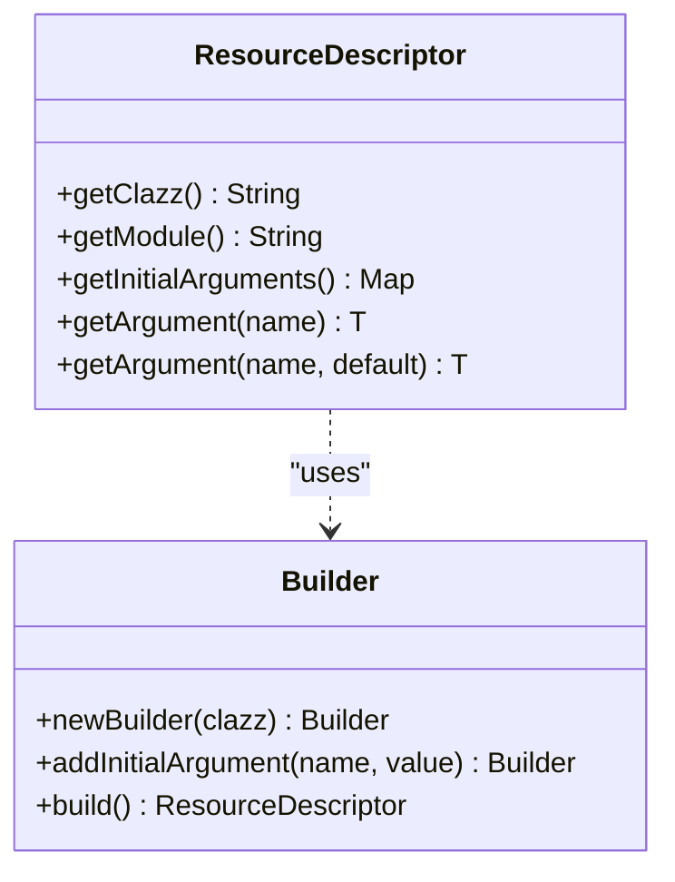

**Diagram sources**
- [ResourceDescriptor.java](file://api/src/main/java/org/apache/flink/agents/api/resource/ResourceDescriptor.java#L29-L143)

**Section sources**
- [ResourceDescriptor.java](file://api/src/main/java/org/apache/flink/agents/api/resource/ResourceDescriptor.java#L29-L143)

### MemoryObject
- Provides path-based access to memory fields, supporting direct values and nested objects.

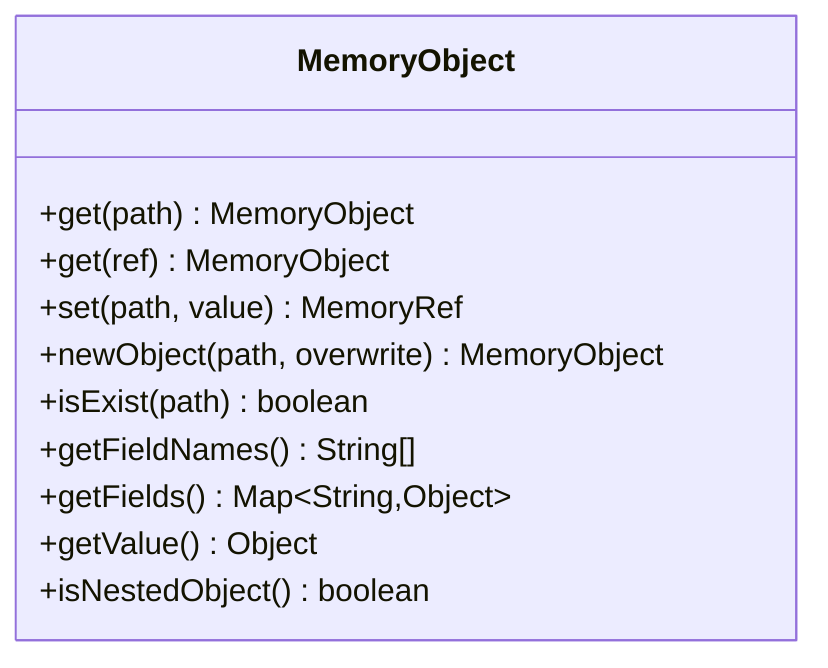

**Diagram sources**
- [MemoryObject.java](file://api/src/main/java/org/apache/flink/agents/api/context/MemoryObject.java#L29-L131)

**Section sources**
- [MemoryObject.java](file://api/src/main/java/org/apache/flink/agents/api/context/MemoryObject.java#L29-L131)

### Tool
- Base class for tools with metadata and call semantics.

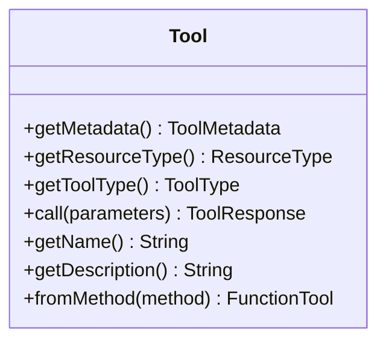

**Diagram sources**
- [Tool.java](file://api/src/main/java/org/apache/flink/agents/api/tools/Tool.java#L30-L69)

**Section sources**
- [Tool.java](file://api/src/main/java/org/apache/flink/agents/api/tools/Tool.java#L30-L69)

### MemorySet
- Long-term memory set with capacity and compaction configuration.

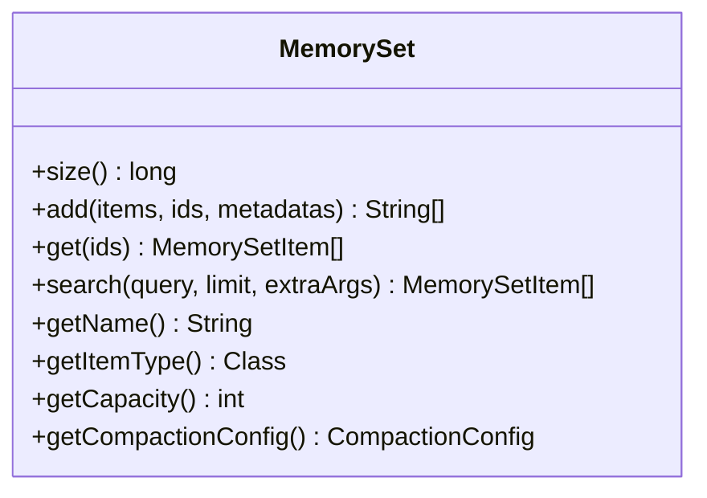

**Diagram sources**
- [MemorySet.java](file://api/src/main/java/org/apache/flink/agents/api/memory/MemorySet.java#L32-L159)

**Section sources**
- [MemorySet.java](file://api/src/main/java/org/apache/flink/agents/api/memory/MemorySet.java#L32-L159)

### VectorStoreQuery
- Encapsulates query parameters for vector store retrieval.

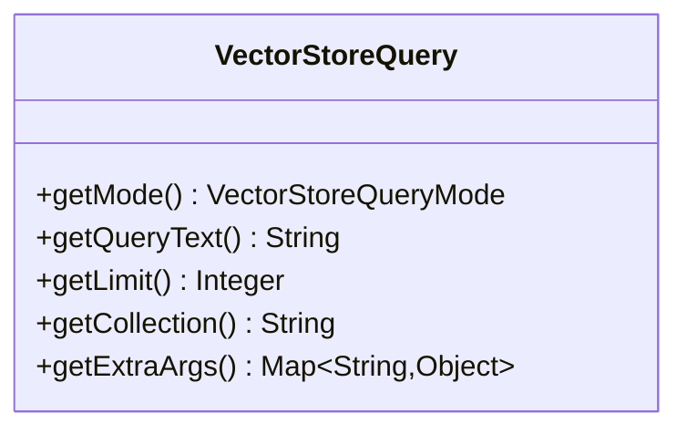

**Diagram sources**
- [VectorStoreQuery.java](file://api/src/main/java/org/apache/flink/agents/api/vectorstores/VectorStoreQuery.java#L33-L109)

**Section sources**
- [VectorStoreQuery.java](file://api/src/main/java/org/apache/flink/agents/api/vectorstores/VectorStoreQuery.java#L33-L109)

### Example: ReActAgent usage
- Demonstrates registering a chat model connection and a tool, constructing a ReAct agent with a schema, and streaming input through the agent.

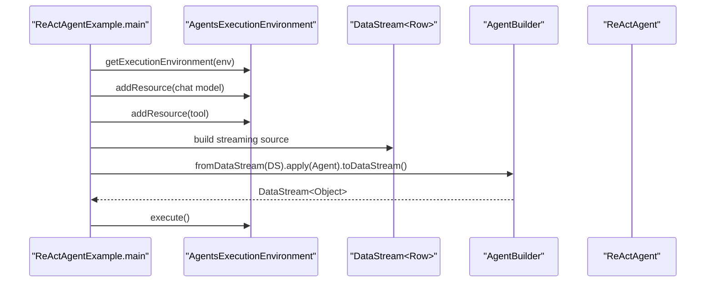

**Diagram sources**
- [ReActAgentExample.java](file://examples/src/main/java/org/apache/flink/agents/examples/ReActAgentExample.java#L81-L145)

**Section sources**
- [ReActAgentExample.java](file://examples/src/main/java/org/apache/flink/agents/examples/ReActAgentExample.java#L81-L159)

## Dependency Analysis
- Coupling:
  - AgentsExecutionEnvironment couples to Flink’s StreamExecutionEnvironment and StreamTableEnvironment.
  - AgentBuilder depends on Agent and Flink output abstractions.
  - ReActAgent depends on ResourceDescriptor, Prompt, OutputSchema, and RunnerContext.
  - Tool depends on ToolMetadata and ToolParameters.
  - MemoryObject is a pure interface; implementations are provided by runtime.
- Cohesion:
  - Each class/module focuses on a single responsibility (execution, building, agent logic, configuration, resources, memory, tools, vectors).

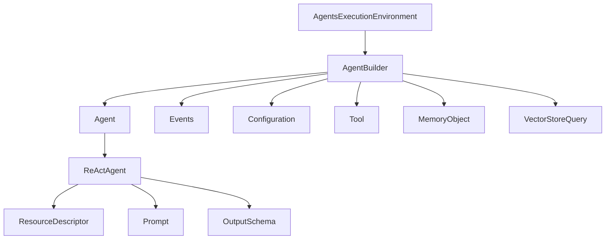

**Diagram sources**
- [AgentsExecutionEnvironment.java](file://api/src/main/java/org/apache/flink/agents/api/AgentsExecutionEnvironment.java#L43-L222)
- [AgentBuilder.java](file://api/src/main/java/org/apache/flink/agents/api/AgentBuilder.java#L35-L76)
- [Agent.java](file://api/src/main/java/org/apache/flink/agents/api/agents/Agent.java#L34-L130)
- [ReActAgent.java](file://api/src/main/java/org/apache/flink/agents/api/agents/ReActAgent.java#L51-L182)
- [ResourceDescriptor.java](file://api/src/main/java/org/apache/flink/agents/api/resource/ResourceDescriptor.java#L29-L143)
- [OutputSchema.java](file://api/src/main/java/org/apache/flink/agents/api/agents/OutputSchema.java#L50-L134)
- [Configuration.java](file://api/src/main/java/org/apache/flink/agents/api/configuration/Configuration.java#L20-L24)
- [Tool.java](file://api/src/main/java/org/apache/flink/agents/api/tools/Tool.java#L30-L69)
- [MemoryObject.java](file://api/src/main/java/org/apache/flink/agents/api/context/MemoryObject.java#L29-L131)
- [VectorStoreQuery.java](file://api/src/main/java/org/apache/flink/agents/api/vectorstores/VectorStoreQuery.java#L33-L109)

**Section sources**
- [AgentsExecutionEnvironment.java](file://api/src/main/java/org/apache/flink/agents/api/AgentsExecutionEnvironment.java#L43-L222)
- [AgentBuilder.java](file://api/src/main/java/org/apache/flink/agents/api/AgentBuilder.java#L35-L76)
- [Agent.java](file://api/src/main/java/org/apache/flink/agents/api/agents/Agent.java#L34-L130)
- [ReActAgent.java](file://api/src/main/java/org/apache/flink/agents/api/agents/ReActAgent.java#L51-L182)
- [ResourceDescriptor.java](file://api/src/main/java/org/apache/flink/agents/api/resource/ResourceDescriptor.java#L29-L143)
- [OutputSchema.java](file://api/src/main/java/org/apache/flink/agents/api/agents/OutputSchema.java#L50-L134)
- [Configuration.java](file://api/src/main/java/org/apache/flink/agents/api/configuration/Configuration.java#L20-L24)
- [Tool.java](file://api/src/main/java/org/apache/flink/agents/api/tools/Tool.java#L30-L69)
- [MemoryObject.java](file://api/src/main/java/org/apache/flink/agents/api/context/MemoryObject.java#L29-L131)
- [VectorStoreQuery.java](file://api/src/main/java/org/apache/flink/agents/api/vectorstores/VectorStoreQuery.java#L33-L109)

## Performance Considerations
- Asynchronous execution:
  - Control concurrency via configuration options (e.g., NUM_ASYNC_THREADS) to avoid overwhelming external services.
- Output schema:
  - Restrict to basic types for efficient serialization and downstream processing.
- Memory sets:
  - Choose appropriate capacity and compaction configuration to balance retrieval quality and storage overhead.
- Vector store queries:
  - Limit results (limit) and use appropriate modes to reduce payload sizes.

[No sources needed since this section provides general guidance]

## Troubleshooting Guide
- Unsupported resource type:
  - Adding a resource that is neither a SerializableResource nor a ResourceDescriptor triggers an IllegalArgumentException.
- Duplicate action/resource name:
  - Attempting to register an action or resource with an existing name raises an IllegalArgumentException.
- Missing user prompt for complex inputs:
  - ReActAgent requires a user prompt when input is not primitive and cannot be converted to ChatMessage.
- Environment instantiation failure:
  - getExecutionEnvironment may throw RuntimeException if environment classes cannot be loaded.

**Section sources**
- [AgentsExecutionEnvironment.java](file://api/src/main/java/org/apache/flink/agents/api/AgentsExecutionEnvironment.java#L207-L221)
- [Agent.java](file://api/src/main/java/org/apache/flink/agents/api/agents/Agent.java#L97-L111)
- [ReActAgent.java](file://api/src/main/java/org/apache/flink/agents/api/agents/ReActAgent.java#L124-L129)

## Conclusion
Flink Agents provides a cohesive API surface for building intelligent streaming agents on Flink. The execution environment, builder, agent core, configuration, resources, memory, tools, and vector store query APIs work together to enable flexible, extensible agent pipelines. Use the provided examples and annotations to compose agents efficiently, and leverage configuration and resource descriptors for robust deployments.

[No sources needed since this section summarizes without analyzing specific files]

## Appendices

### API Quick Reference Index
- Execution and Inputs:
  - AgentsExecutionEnvironment: getExecutionEnvironment, fromList, fromDataStream, fromTable, execute, addResource
  - AgentBuilder: apply, toList, toDataStream, toTable
- Agent Logic:
  - Agent: addAction, addResource, getActions, getResources
  - ReActAgent: constructor, startAction, stopAction
  - OutputSchema: getSchema, serializers
- Configuration:
  - Configuration, ConfigOption
- Resources:
  - ResourceDescriptor: builder, getters
- Memory:
  - MemoryObject: get, set, newObject, isExist, getFields, getValue, isNestedObject
- Tools:
  - Tool: getMetadata, getResourceType, getToolType, call, fromMethod
- Long-Term Memory:
  - MemorySet: add, get, search, size, accessors
- Vector Stores:
  - VectorStoreQuery: constructors, getters

**Section sources**
- [AgentsExecutionEnvironment.java](file://api/src/main/java/org/apache/flink/agents/api/AgentsExecutionEnvironment.java#L68-L221)
- [AgentBuilder.java](file://api/src/main/java/org/apache/flink/agents/api/AgentBuilder.java#L35-L76)
- [Agent.java](file://api/src/main/java/org/apache/flink/agents/api/agents/Agent.java#L34-L130)
- [ReActAgent.java](file://api/src/main/java/org/apache/flink/agents/api/agents/ReActAgent.java#L59-L182)
- [OutputSchema.java](file://api/src/main/java/org/apache/flink/agents/api/agents/OutputSchema.java#L50-L134)
- [Configuration.java](file://api/src/main/java/org/apache/flink/agents/api/configuration/Configuration.java#L20-L24)
- [ConfigOption.java](file://api/src/main/java/org/apache/flink/agents/api/configuration/ConfigOption.java#L23-L102)
- [ResourceDescriptor.java](file://api/src/main/java/org/apache/flink/agents/api/resource/ResourceDescriptor.java#L29-L143)
- [MemoryObject.java](file://api/src/main/java/org/apache/flink/agents/api/context/MemoryObject.java#L29-L131)
- [Tool.java](file://api/src/main/java/org/apache/flink/agents/api/tools/Tool.java#L30-L69)
- [MemorySet.java](file://api/src/main/java/org/apache/flink/agents/api/memory/MemorySet.java#L32-L159)
- [VectorStoreQuery.java](file://api/src/main/java/org/apache/flink/agents/api/vectorstores/VectorStoreQuery.java#L33-L109)