# Annotation API

<cite>
**Referenced Files in This Document**
- [Action.java](file://api/src/main/java/org/apache/flink/agents/api/annotation/Action.java)
- [Tool.java](file://api/src/main/java/org/apache/flink/agents/api/annotation/Tool.java)
- [Prompt.java](file://api/src/main/java/org/apache/flink/agents/api/annotation/Prompt.java)
- [VectorStore.java](file://api/src/main/java/org/apache/flink/agents/api/annotation/VectorStore.java)
- [ToolParam.java](file://api/src/main/java/org/apache/flink/agents/api/annotation/ToolParam.java)
- [ChatModelConnection.java](file://api/src/main/java/org/apache/flink/agents/api/annotation/ChatModelConnection.java)
- [ChatModelSetup.java](file://api/src/main/java/org/apache/flink/agents/api/annotation/ChatModelSetup.java)
- [EmbeddingModelConnection.java](file://api/src/main/java/org/apache/flink/agents/api/annotation/EmbeddingModelConnection.java)
- [EmbeddingModelSetup.java](file://api/src/main/java/org/apache/flink/agents/api/annotation/EmbeddingModelSetup.java)
- [MCPServer.java](file://api/src/main/java/org/apache/flink/agents/api/annotation/MCPServer.java)
- [AgentPlan.java](file://plan/src/main/java/org/apache/flink/agents/plan/AgentPlan.java)
- [ResourceProvider.java](file://plan/src/main/java/org/apache/flink/agents/plan/resourceprovider/ResourceProvider.java)
- [JavaResourceProvider.java](file://plan/src/main/java/org/apache/flink/agents/plan/resourceprovider/JavaResourceProvider.java)
- [PythonResourceProvider.java](file://plan/src/main/java/org/apache/flink/agents/plan/resourceprovider/PythonResourceProvider.java)
</cite>

## Table of Contents
1. [Introduction](#introduction)
2. [Project Structure](#project-structure)
3. [Core Components](#core-components)
4. [Architecture Overview](#architecture-overview)
5. [Detailed Component Analysis](#detailed-component-analysis)
6. [Dependency Analysis](#dependency-analysis)
7. [Performance Considerations](#performance-considerations)
8. [Troubleshooting Guide](#troubleshooting-guide)
9. [Conclusion](#conclusion)
10. [Appendices](#appendices)

## Introduction
This document provides detailed API documentation for the Flink Agents annotation system. It covers the Action, Tool, Prompt, VectorStore, and related resource-related annotations, along with ToolParam for parameter specification and validation. It explains how annotations are discovered and processed at runtime, how resources are registered and resolved, and how annotation inheritance, composition, and conflict resolution are handled. Practical examples, best practices, and common pitfalls are included to guide developers building agents and tools using annotations.

## Project Structure
The annotation APIs live in the API module, while the runtime processing and resource provisioning logic reside in the Plan module. The AgentPlan class orchestrates discovery and registration of annotated members and resources.

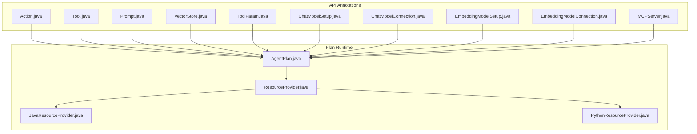

**Diagram sources**
- [Action.java](file://api/src/main/java/org/apache/flink/agents/api/annotation/Action.java#L28-L53)
- [Tool.java](file://api/src/main/java/org/apache/flink/agents/api/annotation/Tool.java#L26-L42)
- [Prompt.java](file://api/src/main/java/org/apache/flink/agents/api/annotation/Prompt.java#L26-L34)
- [VectorStore.java](file://api/src/main/java/org/apache/flink/agents/api/annotation/VectorStore.java#L26-L36)
- [ToolParam.java](file://api/src/main/java/org/apache/flink/agents/api/annotation/ToolParam.java#L29-L62)
- [ChatModelSetup.java](file://api/src/main/java/org/apache/flink/agents/api/annotation/ChatModelSetup.java#L26-L34)
- [ChatModelConnection.java](file://api/src/main/java/org/apache/flink/agents/api/annotation/ChatModelConnection.java#L26-L34)
- [EmbeddingModelSetup.java](file://api/src/main/java/org/apache/flink/agents/api/annotation/EmbeddingModelSetup.java#L26-L35)
- [EmbeddingModelConnection.java](file://api/src/main/java/org/apache/flink/agents/api/annotation/EmbeddingModelConnection.java#L26-L35)
- [MCPServer.java](file://api/src/main/java/org/apache/flink/agents/api/annotation/MCPServer.java#L26-L83)
- [AgentPlan.java](file://plan/src/main/java/org/apache/flink/agents/plan/AgentPlan.java#L125-L141)
- [ResourceProvider.java](file://plan/src/main/java/org/apache/flink/agents/plan/resourceprovider/ResourceProvider.java#L30-L75)
- [JavaResourceProvider.java](file://plan/src/main/java/org/apache/flink/agents/plan/resourceprovider/JavaResourceProvider.java#L28-L56)
- [PythonResourceProvider.java](file://plan/src/main/java/org/apache/flink/agents/plan/resourceprovider/PythonResourceProvider.java#L39-L148)

**Section sources**
- [Action.java](file://api/src/main/java/org/apache/flink/agents/api/annotation/Action.java#L28-L53)
- [Tool.java](file://api/src/main/java/org/apache/flink/agents/api/annotation/Tool.java#L26-L42)
- [Prompt.java](file://api/src/main/java/org/apache/flink/agents/api/annotation/Prompt.java#L26-L34)
- [VectorStore.java](file://api/src/main/java/org/apache/flink/agents/api/annotation/VectorStore.java#L26-L36)
- [ToolParam.java](file://api/src/main/java/org/apache/flink/agents/api/annotation/ToolParam.java#L29-L62)
- [ChatModelSetup.java](file://api/src/main/java/org/apache/flink/agents/api/annotation/ChatModelSetup.java#L26-L34)
- [ChatModelConnection.java](file://api/src/main/java/org/apache/flink/agents/api/annotation/ChatModelConnection.java#L26-L34)
- [EmbeddingModelSetup.java](file://api/src/main/java/org/apache/flink/agents/api/annotation/EmbeddingModelSetup.java#L26-L35)
- [EmbeddingModelConnection.java](file://api/src/main/java/org/apache/flink/agents/api/annotation/EmbeddingModelConnection.java#L26-L35)
- [MCPServer.java](file://api/src/main/java/org/apache/flink/agents/api/annotation/MCPServer.java#L26-L83)
- [AgentPlan.java](file://plan/src/main/java/org/apache/flink/agents/plan/AgentPlan.java#L125-L141)
- [ResourceProvider.java](file://plan/src/main/java/org/apache/flink/agents/plan/resourceprovider/ResourceProvider.java#L30-L75)
- [JavaResourceProvider.java](file://plan/src/main/java/org/apache/flink/agents/plan/resourceprovider/JavaResourceProvider.java#L28-L56)
- [PythonResourceProvider.java](file://plan/src/main/java/org/apache/flink/agents/plan/resourceprovider/PythonResourceProvider.java#L39-L148)

## Core Components
- Action: Marks a method as an agent action and binds it to one or more event types.
- Tool: Declares a field or static method as a tool resource; fields must be serializable resources; static methods are wrapped as FunctionTool.
- Prompt: Declares a field or static method as a prompt resource; static methods must return a serializable prompt.
- VectorStore: Declares a field or static method as a vector store resource; static methods are wrapped as vector store resources.
- ToolParam: Specifies parameter-level metadata (required, name, description, default value) for tool parameters and fields.
- ChatModelSetup/ChatModelConnection: Resource annotations for chat model setup and connections.
- EmbeddingModelSetup/EmbeddingModelConnection: Resource annotations for embedding model setup and connections.
- MCPServer: Declares a static factory method returning an MCP server descriptor; supports automatic discovery of tools and prompts.

These annotations are processed at runtime by AgentPlan to discover actions and resource providers, and to register them into the agent plan.

**Section sources**
- [Action.java](file://api/src/main/java/org/apache/flink/agents/api/annotation/Action.java#L28-L53)
- [Tool.java](file://api/src/main/java/org/apache/flink/agents/api/annotation/Tool.java#L26-L42)
- [Prompt.java](file://api/src/main/java/org/apache/flink/agents/api/annotation/Prompt.java#L26-L34)
- [VectorStore.java](file://api/src/main/java/org/apache/flink/agents/api/annotation/VectorStore.java#L26-L36)
- [ToolParam.java](file://api/src/main/java/org/apache/flink/agents/api/annotation/ToolParam.java#L29-L62)
- [ChatModelSetup.java](file://api/src/main/java/org/apache/flink/agents/api/annotation/ChatModelSetup.java#L26-L34)
- [ChatModelConnection.java](file://api/src/main/java/org/apache/flink/agents/api/annotation/ChatModelConnection.java#L26-L34)
- [EmbeddingModelSetup.java](file://api/src/main/java/org/apache/flink/agents/api/annotation/EmbeddingModelSetup.java#L26-L35)
- [EmbeddingModelConnection.java](file://api/src/main/java/org/apache/flink/agents/api/annotation/EmbeddingModelConnection.java#L26-L35)
- [MCPServer.java](file://api/src/main/java/org/apache/flink/agents/api/annotation/MCPServer.java#L26-L83)

## Architecture Overview
The annotation-driven agent lifecycle consists of:
- Reflection-based discovery of annotated methods and fields on the Agent subclass.
- Compilation of actions and resource providers into an AgentPlan.
- Runtime instantiation of resources via ResourceProvider implementations (Java vs Python).
- Caching and retrieval of resources during execution.

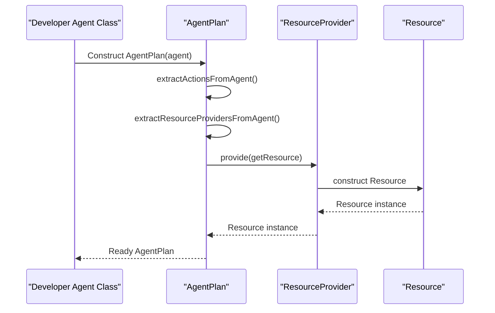

**Diagram sources**
- [AgentPlan.java](file://plan/src/main/java/org/apache/flink/agents/plan/AgentPlan.java#L125-L141)
- [AgentPlan.java](file://plan/src/main/java/org/apache/flink/agents/plan/AgentPlan.java#L334-L360)
- [AgentPlan.java](file://plan/src/main/java/org/apache/flink/agents/plan/AgentPlan.java#L454-L598)
- [ResourceProvider.java](file://plan/src/main/java/org/apache/flink/agents/plan/resourceprovider/ResourceProvider.java#L66-L74)
- [JavaResourceProvider.java](file://plan/src/main/java/org/apache/flink/agents/plan/resourceprovider/JavaResourceProvider.java#L37-L51)
- [PythonResourceProvider.java](file://plan/src/main/java/org/apache/flink/agents/plan/resourceprovider/PythonResourceProvider.java#L76-L126)

## Detailed Component Analysis

### Action Annotation
Purpose:
- Mark a method as an agent action.
- Bind the action to one or more event types via listenEvents.

Processing:
- AgentPlan scans for methods annotated with Action and registers them with their event types.
- Actions are stored by name and indexed by event type for dispatch.

Usage pattern:
- Annotate a method with Action(listenEvents = ...) to respond to specific event classes.

Validation:
- At least one event type must be provided.

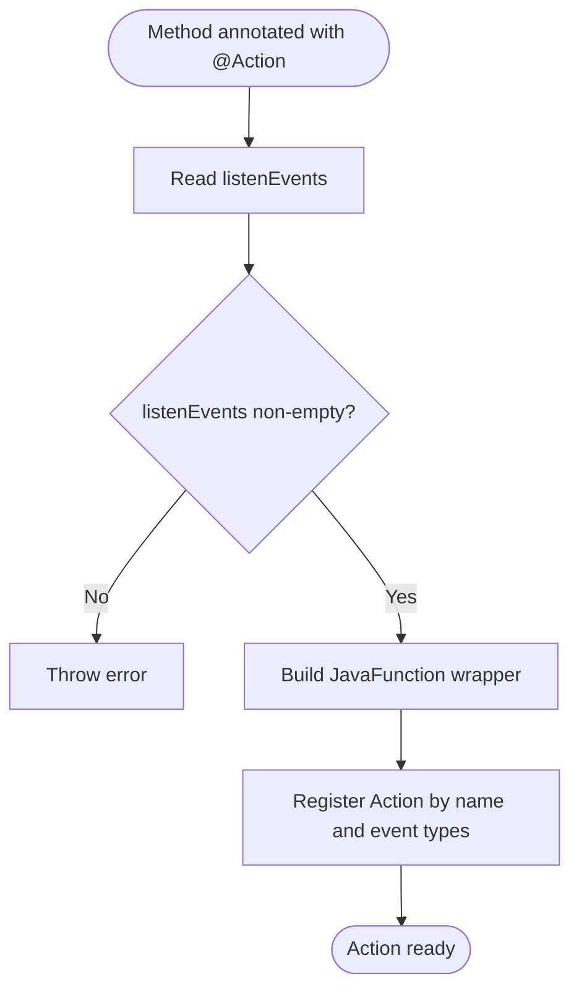

**Diagram sources**
- [Action.java](file://api/src/main/java/org/apache/flink/agents/api/annotation/Action.java#L43-L52)
- [AgentPlan.java](file://plan/src/main/java/org/apache/flink/agents/plan/AgentPlan.java#L298-L322)
- [AgentPlan.java](file://plan/src/main/java/org/apache/flink/agents/plan/AgentPlan.java#L334-L360)

**Section sources**
- [Action.java](file://api/src/main/java/org/apache/flink/agents/api/annotation/Action.java#L28-L53)
- [AgentPlan.java](file://plan/src/main/java/org/apache/flink/agents/plan/AgentPlan.java#L298-L322)
- [AgentPlan.java](file://plan/src/main/java/org/apache/flink/agents/plan/AgentPlan.java#L334-L360)

### Tool Annotation
Purpose:
- Declare a tool resource.
- Fields: must be serializable resources; their values are wrapped as tool providers.
- Static methods: must be static; they are wrapped as FunctionTool resources.

Processing:
- Field scanning: reads the field value and wraps it as a JavaSerializableResourceProvider.
- Static method scanning: builds ToolMetadata and JavaFunction, then wraps as FunctionTool provider.

Validation:
- Only serializable resources are supported for field-based tools.
- Static methods must be static.

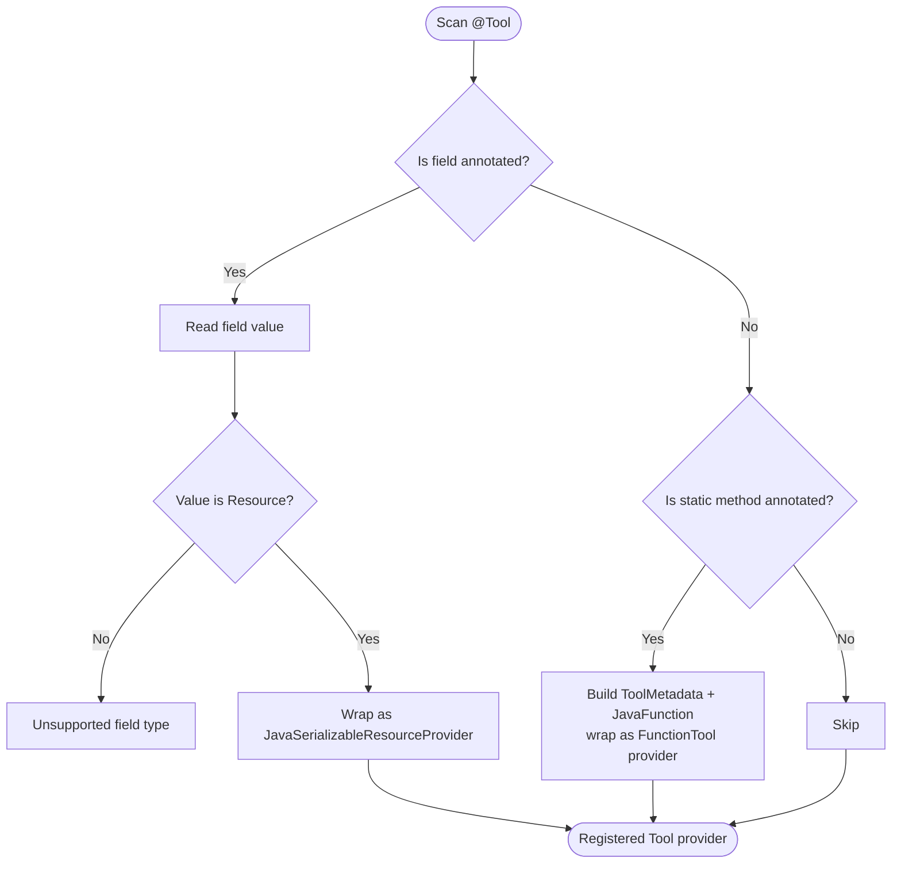

**Diagram sources**
- [Tool.java](file://api/src/main/java/org/apache/flink/agents/api/annotation/Tool.java#L33-L42)
- [AgentPlan.java](file://plan/src/main/java/org/apache/flink/agents/plan/AgentPlan.java#L457-L505)
- [AgentPlan.java](file://plan/src/main/java/org/apache/flink/agents/plan/AgentPlan.java#L390-L405)

**Section sources**
- [Tool.java](file://api/src/main/java/org/apache/flink/agents/api/annotation/Tool.java#L26-L42)
- [AgentPlan.java](file://plan/src/main/java/org/apache/flink/agents/plan/AgentPlan.java#L457-L505)
- [AgentPlan.java](file://plan/src/main/java/org/apache/flink/agents/plan/AgentPlan.java#L390-L405)

### Prompt Annotation
Purpose:
- Declare a prompt resource.
- Static methods must return a serializable prompt.

Processing:
- Static method invocation yields a SerializableResource, wrapped as a JavaSerializableResourceProvider.

Validation:
- Only static methods are supported for Prompt.

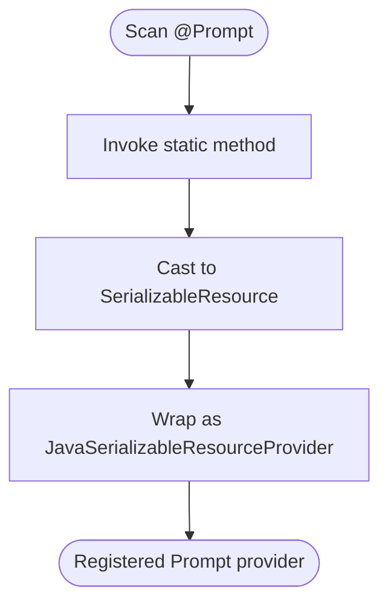

**Diagram sources**
- [Prompt.java](file://api/src/main/java/org/apache/flink/agents/api/annotation/Prompt.java#L32-L34)
- [AgentPlan.java](file://plan/src/main/java/org/apache/flink/agents/plan/AgentPlan.java#L512-L521)

**Section sources**
- [Prompt.java](file://api/src/main/java/org/apache/flink/agents/api/annotation/Prompt.java#L26-L34)
- [AgentPlan.java](file://plan/src/main/java/org/apache/flink/agents/plan/AgentPlan.java#L512-L521)

### VectorStore Annotation
Purpose:
- Declare a vector store resource.
- Static methods are supported; they are wrapped as vector store providers.

Processing:
- Static method invocation yields a ResourceDescriptor; provider is selected based on whether the target class is a Python wrapper.

Validation:
- Static methods are expected for VectorStore.

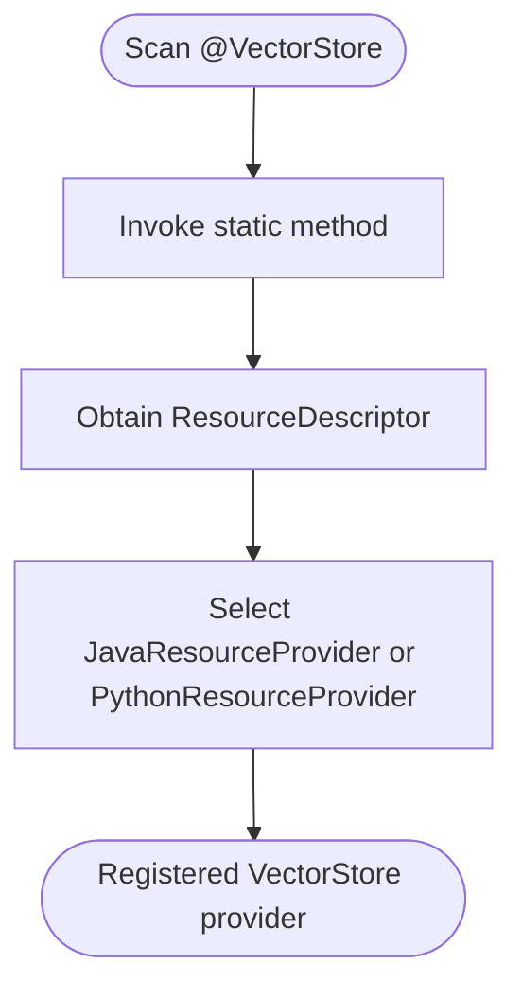

**Diagram sources**
- [VectorStore.java](file://api/src/main/java/org/apache/flink/agents/api/annotation/VectorStore.java#L34-L36)
- [AgentPlan.java](file://plan/src/main/java/org/apache/flink/agents/plan/AgentPlan.java#L529-L531)
- [AgentPlan.java](file://plan/src/main/java/org/apache/flink/agents/plan/AgentPlan.java#L366-L388)

**Section sources**
- [VectorStore.java](file://api/src/main/java/org/apache/flink/agents/api/annotation/VectorStore.java#L26-L36)
- [AgentPlan.java](file://plan/src/main/java/org/apache/flink/agents/plan/AgentPlan.java#L529-L531)
- [AgentPlan.java](file://plan/src/main/java/org/apache/flink/agents/plan/AgentPlan.java#L366-L388)

### ToolParam Annotation
Purpose:
- Specify parameter-level metadata for tool parameters and fields.
- Supports required flag, explicit name, description, and default value.

Processing:
- Used by ToolMetadataFactory to derive parameter metadata from static tool methods and their parameters.

Usage pattern:
- Apply to method parameters or fields to influence tool metadata and validation.

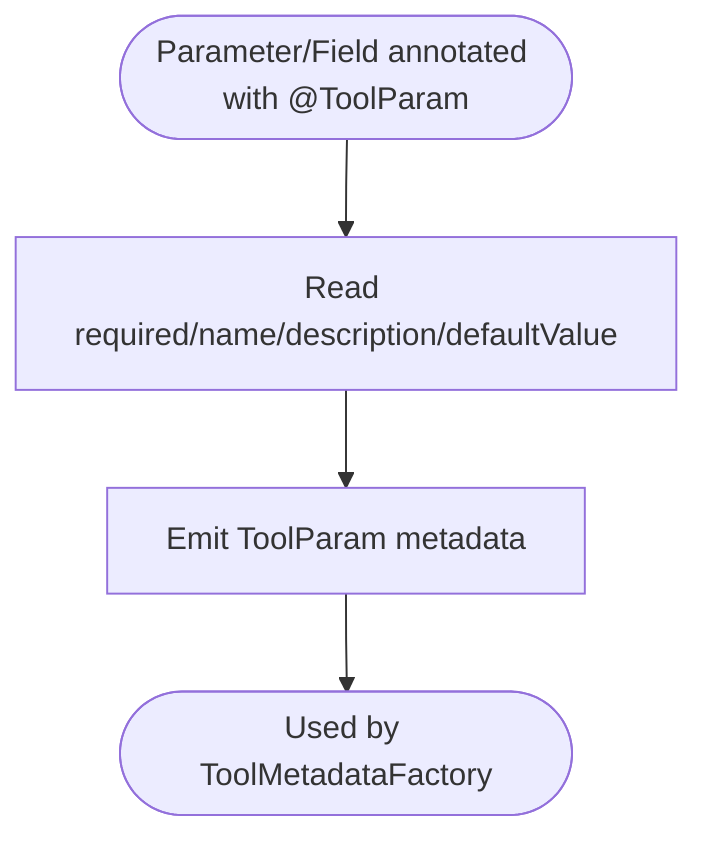

**Diagram sources**
- [ToolParam.java](file://api/src/main/java/org/apache/flink/agents/api/annotation/ToolParam.java#L29-L62)

**Section sources**
- [ToolParam.java](file://api/src/main/java/org/apache/flink/agents/api/annotation/ToolParam.java#L29-L62)

### Resource Annotations: ChatModelSetup, ChatModelConnection, EmbeddingModelSetup, EmbeddingModelConnection
Purpose:
- Declare chat model and embedding model setup/connection resources.
- Static methods returning ResourceDescriptor are supported.

Processing:
- Static method invocation yields a ResourceDescriptor; provider is selected based on wrapper type.

Validation:
- Static methods are expected for these annotations.

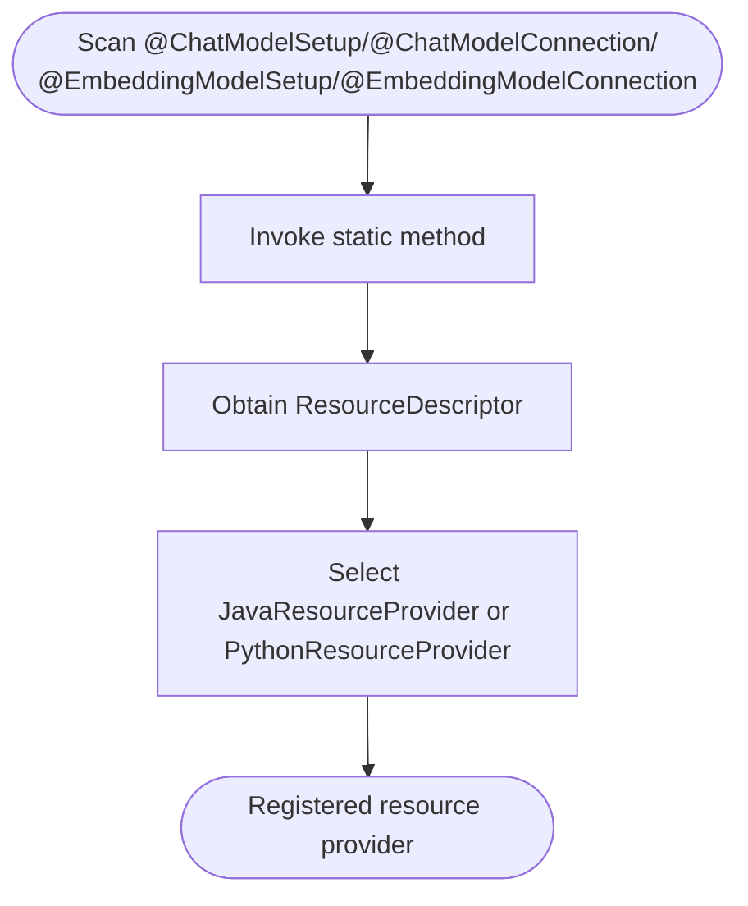

**Diagram sources**
- [ChatModelSetup.java](file://api/src/main/java/org/apache/flink/agents/api/annotation/ChatModelSetup.java#L32-L34)
- [ChatModelConnection.java](file://api/src/main/java/org/apache/flink/agents/api/annotation/ChatModelConnection.java#L32-L34)
- [EmbeddingModelSetup.java](file://api/src/main/java/org/apache/flink/agents/api/annotation/EmbeddingModelSetup.java#L33-L35)
- [EmbeddingModelConnection.java](file://api/src/main/java/org/apache/flink/agents/api/annotation/EmbeddingModelConnection.java#L33-L35)
- [AgentPlan.java](file://plan/src/main/java/org/apache/flink/agents/plan/AgentPlan.java#L521-L529)
- [AgentPlan.java](file://plan/src/main/java/org/apache/flink/agents/plan/AgentPlan.java#L366-L388)

**Section sources**
- [ChatModelSetup.java](file://api/src/main/java/org/apache/flink/agents/api/annotation/ChatModelSetup.java#L26-L34)
- [ChatModelConnection.java](file://api/src/main/java/org/apache/flink/agents/api/annotation/ChatModelConnection.java#L26-L34)
- [EmbeddingModelSetup.java](file://api/src/main/java/org/apache/flink/agents/api/annotation/EmbeddingModelSetup.java#L26-L35)
- [EmbeddingModelConnection.java](file://api/src/main/java/org/apache/flink/agents/api/annotation/EmbeddingModelConnection.java#L26-L35)
- [AgentPlan.java](file://plan/src/main/java/org/apache/flink/agents/plan/AgentPlan.java#L521-L529)
- [AgentPlan.java](file://plan/src/main/java/org/apache/flink/agents/plan/AgentPlan.java#L366-L388)

### MCPServer Annotation
Purpose:
- Declare an MCP server resource via a static factory method.
- Supports automatic discovery of tools and prompts from the server.
- Supports language selection: auto, python, or java.

Processing:
- Static method invocation yields a ResourceDescriptor.
- If lang is "java", AgentPlan constructs a Java MCP server and reflectsively discovers tools/prompts.
- If lang is "python" or "auto" with JDK < 17, AgentPlan wraps the provider for Python execution and later enriches caches.

Validation:
- Throws if Java version is insufficient for "java" language choice.

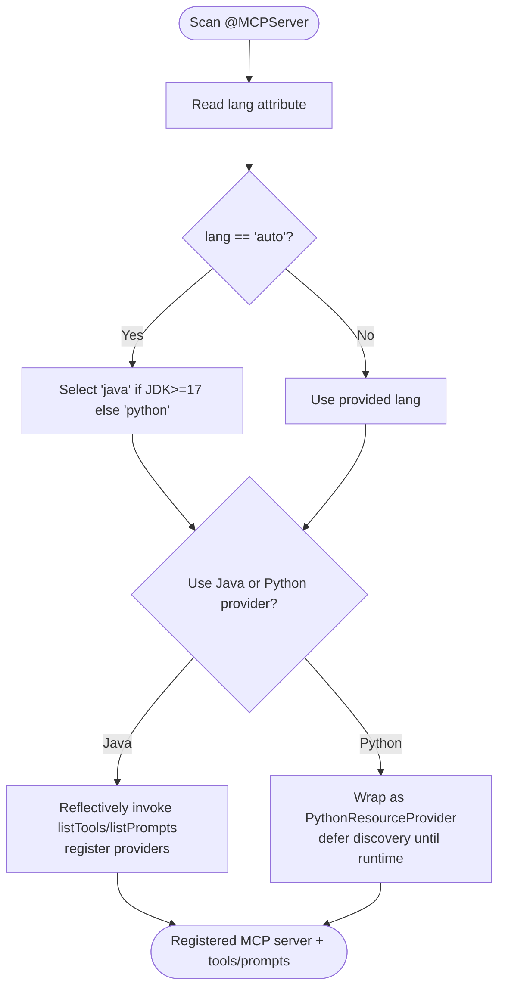

**Diagram sources**
- [MCPServer.java](file://api/src/main/java/org/apache/flink/agents/api/annotation/MCPServer.java#L62-L83)
- [AgentPlan.java](file://plan/src/main/java/org/apache/flink/agents/plan/AgentPlan.java#L531-L559)
- [AgentPlan.java](file://plan/src/main/java/org/apache/flink/agents/plan/AgentPlan.java#L407-L452)

**Section sources**
- [MCPServer.java](file://api/src/main/java/org/apache/flink/agents/api/annotation/MCPServer.java#L26-L83)
- [AgentPlan.java](file://plan/src/main/java/org/apache/flink/agents/plan/AgentPlan.java#L531-L559)
- [AgentPlan.java](file://plan/src/main/java/org/apache/flink/agents/plan/AgentPlan.java#L407-L452)

### Annotation Processing, Reflection-Based Discovery, and Registration
Key steps:
- Actions: scan methods for @Action and register by event types.
- Tools: scan fields and static methods for @Tool; wrap as providers.
- Prompts: scan static methods for @Prompt; wrap as providers.
- Resources: scan static methods for chat/embedding/vector store/MCP annotations; select Java or Python providers.
- Registration: ResourceProvider instances are stored by type and name; caching avoids repeated instantiation.

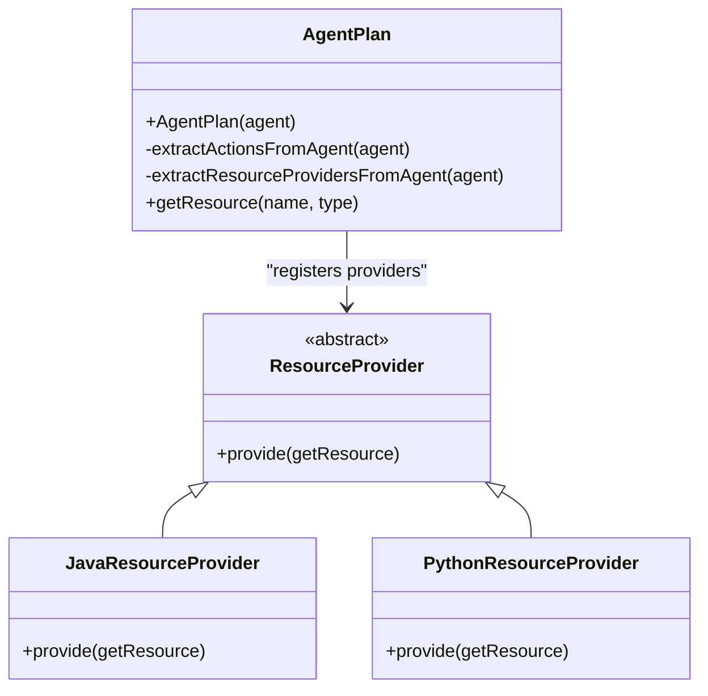

**Diagram sources**
- [AgentPlan.java](file://plan/src/main/java/org/apache/flink/agents/plan/AgentPlan.java#L125-L141)
- [AgentPlan.java](file://plan/src/main/java/org/apache/flink/agents/plan/AgentPlan.java#L454-L598)
- [ResourceProvider.java](file://plan/src/main/java/org/apache/flink/agents/plan/resourceprovider/ResourceProvider.java#L30-L75)
- [JavaResourceProvider.java](file://plan/src/main/java/org/apache/flink/agents/plan/resourceprovider/JavaResourceProvider.java#L28-L56)
- [PythonResourceProvider.java](file://plan/src/main/java/org/apache/flink/agents/plan/resourceprovider/PythonResourceProvider.java#L39-L148)

**Section sources**
- [AgentPlan.java](file://plan/src/main/java/org/apache/flink/agents/plan/AgentPlan.java#L125-L141)
- [AgentPlan.java](file://plan/src/main/java/org/apache/flink/agents/plan/AgentPlan.java#L334-L360)
- [AgentPlan.java](file://plan/src/main/java/org/apache/flink/agents/plan/AgentPlan.java#L454-L598)
- [ResourceProvider.java](file://plan/src/main/java/org/apache/flink/agents/plan/resourceprovider/ResourceProvider.java#L30-L75)
- [JavaResourceProvider.java](file://plan/src/main/java/org/apache/flink/agents/plan/resourceprovider/JavaResourceProvider.java#L28-L56)
- [PythonResourceProvider.java](file://plan/src/main/java/org/apache/flink/agents/plan/resourceprovider/PythonResourceProvider.java#L39-L148)

### Annotation Inheritance, Composition, and Conflict Resolution
- Inheritance: Annotations are not inherited from superclasses; only the immediate class is scanned.
- Composition: Multiple annotations can be applied to the same element (e.g., a static method can be annotated with both @Tool and @Prompt if desired by future extensions).
- Conflict resolution:
  - Field vs static method: Field-based resources must be serializable; static methods are preferred for resource factories.
  - MCP language selection: If lang="java", the Java MCP server is used; otherwise Python provider is used. An exception is thrown if "java" is requested on unsupported JDK versions.
  - Duplicate names: Providers are keyed by (type, name); conflicts are not explicitly handled and should be avoided by unique names.

Best practices:
- Keep resource names unique per type.
- Prefer static methods for resource factories to leverage ResourceDescriptor-based provisioning.
- Use ToolParam consistently for parameter metadata to improve tool usability.

**Section sources**
- [AgentPlan.java](file://plan/src/main/java/org/apache/flink/agents/plan/AgentPlan.java#L531-L559)
- [AgentPlan.java](file://plan/src/main/java/org/apache/flink/agents/plan/AgentPlan.java#L604-L616)

### Annotation-Based Configuration for Agents, Tools, and Resources
- Agent-level actions: define behavior in response to events using @Action.
- Tool-level configuration: specify parameter metadata with @ToolParam; describe tools with @Tool.
- Prompt-level configuration: expose prompts via @Prompt.
- Resource-level configuration: declare chat/embedding/vector store/MCP resources via dedicated annotations; provide ResourceDescriptor from static methods.

Examples of usage patterns:
- Define an action responding to InputEvent and CustomEvent using @Action.
- Expose a tool via a static method annotated with @Tool; optionally annotate parameters with @ToolParam.
- Expose a prompt via a static method annotated with @Prompt.
- Configure a vector store via a static method annotated with @VectorStore.
- Configure a chat model via @ChatModelSetup or @ChatModelConnection.
- Configure an embedding model via @EmbeddingModelSetup or @EmbeddingModelConnection.
- Configure an MCP server via @MCPServer with language selection.

**Section sources**
- [Action.java](file://api/src/main/java/org/apache/flink/agents/api/annotation/Action.java#L28-L53)
- [Tool.java](file://api/src/main/java/org/apache/flink/agents/api/annotation/Tool.java#L26-L42)
- [Prompt.java](file://api/src/main/java/org/apache/flink/agents/api/annotation/Prompt.java#L26-L34)
- [VectorStore.java](file://api/src/main/java/org/apache/flink/agents/api/annotation/VectorStore.java#L26-L36)
- [ToolParam.java](file://api/src/main/java/org/apache/flink/agents/api/annotation/ToolParam.java#L29-L62)
- [ChatModelSetup.java](file://api/src/main/java/org/apache/flink/agents/api/annotation/ChatModelSetup.java#L26-L34)
- [ChatModelConnection.java](file://api/src/main/java/org/apache/flink/agents/api/annotation/ChatModelConnection.java#L26-L34)
- [EmbeddingModelSetup.java](file://api/src/main/java/org/apache/flink/agents/api/annotation/EmbeddingModelSetup.java#L26-L35)
- [EmbeddingModelConnection.java](file://api/src/main/java/org/apache/flink/agents/api/annotation/EmbeddingModelConnection.java#L26-L35)
- [MCPServer.java](file://api/src/main/java/org/apache/flink/agents/api/annotation/MCPServer.java#L26-L83)

### Examples of Custom Annotation Usage, Parameter Validation, and Metadata Extraction
- Custom tool with parameter validation:
  - Annotate a static tool method with @Tool.
  - Annotate parameters with @ToolParam(required, name, description, defaultValue) to drive metadata and validation.
  - AgentPlan will wrap the method as a FunctionTool and register it as a provider.
- Custom prompt:
  - Annotate a static method with @Prompt returning a serializable prompt; AgentPlan will register it as a provider.
- Custom vector store:
  - Annotate a static method with @VectorStore returning a ResourceDescriptor; AgentPlan will choose Java or Python provider accordingly.
- Parameter validation:
  - ToolParam.required controls whether a parameter is mandatory.
  - ToolParam.defaultValue provides a default when absent.
  - ToolParam.name and ToolParam.description improve tool documentation and UX.

**Section sources**
- [Tool.java](file://api/src/main/java/org/apache/flink/agents/api/annotation/Tool.java#L26-L42)
- [ToolParam.java](file://api/src/main/java/org/apache/flink/agents/api/annotation/ToolParam.java#L29-L62)
- [Prompt.java](file://api/src/main/java/org/apache/flink/agents/api/annotation/Prompt.java#L26-L34)
- [VectorStore.java](file://api/src/main/java/org/apache/flink/agents/api/annotation/VectorStore.java#L26-L36)
- [AgentPlan.java](file://plan/src/main/java/org/apache/flink/agents/plan/AgentPlan.java#L390-L405)
- [AgentPlan.java](file://plan/src/main/java/org/apache/flink/agents/plan/AgentPlan.java#L512-L521)
- [AgentPlan.java](file://plan/src/main/java/org/apache/flink/agents/plan/AgentPlan.java#L529-L531)

## Dependency Analysis
The runtime depends on:
- Reflection to discover annotations on methods and fields.
- ResourceProvider implementations to construct resources at runtime.
- PythonResourceAdapter for cross-language MCP support.

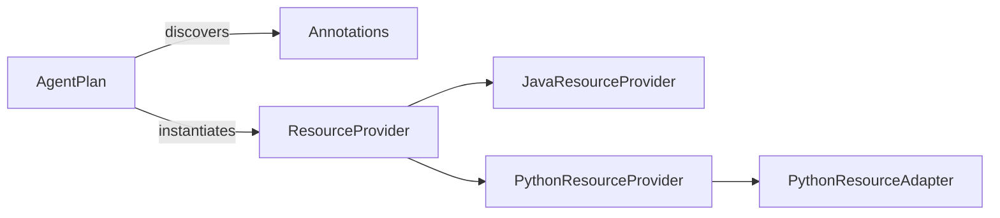

**Diagram sources**
- [AgentPlan.java](file://plan/src/main/java/org/apache/flink/agents/plan/AgentPlan.java#L125-L141)
- [AgentPlan.java](file://plan/src/main/java/org/apache/flink/agents/plan/AgentPlan.java#L454-L598)
- [ResourceProvider.java](file://plan/src/main/java/org/apache/flink/agents/plan/resourceprovider/ResourceProvider.java#L30-L75)
- [JavaResourceProvider.java](file://plan/src/main/java/org/apache/flink/agents/plan/resourceprovider/JavaResourceProvider.java#L28-L56)
- [PythonResourceProvider.java](file://plan/src/main/java/org/apache/flink/agents/plan/resourceprovider/PythonResourceProvider.java#L39-L148)

**Section sources**
- [AgentPlan.java](file://plan/src/main/java/org/apache/flink/agents/plan/AgentPlan.java#L125-L141)
- [AgentPlan.java](file://plan/src/main/java/org/apache/flink/agents/plan/AgentPlan.java#L454-L598)
- [ResourceProvider.java](file://plan/src/main/java/org/apache/flink/agents/plan/resourceprovider/ResourceProvider.java#L30-L75)
- [JavaResourceProvider.java](file://plan/src/main/java/org/apache/flink/agents/plan/resourceprovider/JavaResourceProvider.java#L28-L56)
- [PythonResourceProvider.java](file://plan/src/main/java/org/apache/flink/agents/plan/resourceprovider/PythonResourceProvider.java#L39-L148)

## Performance Considerations
- Reflection overhead: Scanning methods and fields occurs once during AgentPlan construction; subsequent lookups are fast via cached maps.
- Resource caching: AgentPlan caches resources by type and name to avoid repeated instantiation.
- Python bridge: Using PythonResourceAdapter introduces inter-process overhead; minimize repeated Python calls and reuse resources when possible.
- MCP discovery: Java MCP server discovery uses reflection; ensure minimal reflection calls after initial setup.

[No sources needed since this section provides general guidance]

## Troubleshooting Guide
Common issues and resolutions:
- Unsupported field type for @Tool: Only serializable resources are supported for field-based tools. Wrap your tool as a serializable resource or use a static method.
- Java version mismatch for @MCPServer(lang="java"): If the JDK is below 17, switch to lang="python" or upgrade the JDK.
- Missing resource: If getResource(name, type) fails, verify the resource name/type and that the provider was registered.
- Python MCP server not initialized: Ensure PythonResourceAdapter is set before retrieving Python resources.

**Section sources**
- [AgentPlan.java](file://plan/src/main/java/org/apache/flink/agents/plan/AgentPlan.java#L604-L616)
- [AgentPlan.java](file://plan/src/main/java/org/apache/flink/agents/plan/AgentPlan.java#L531-L559)
- [AgentPlan.java](file://plan/src/main/java/org/apache/flink/agents/plan/AgentPlan.java#L231-L264)
- [PythonResourceProvider.java](file://plan/src/main/java/org/apache/flink/agents/plan/resourceprovider/PythonResourceProvider.java#L76-L126)

## Conclusion
The Flink Agents annotation system enables concise, declarative configuration of agents, actions, tools, prompts, and resources. Through reflection-based discovery and provider-based instantiation, AgentPlan compiles annotated components into a robust runtime plan. By following the usage patterns and best practices outlined here, developers can build maintainable and extensible agent applications with clear separation of concerns.

[No sources needed since this section summarizes without analyzing specific files]

## Appendices

### Best Practices
- Use @ToolParam consistently to document and validate tool parameters.
- Prefer static methods for resource factories to leverage ResourceDescriptor-based provisioning.
- Keep resource names unique per type to avoid ambiguity.
- Use @MCPServer with appropriate language selection based on your runtime environment.
- Cache and reuse resources where feasible to reduce overhead.

[No sources needed since this section provides general guidance]