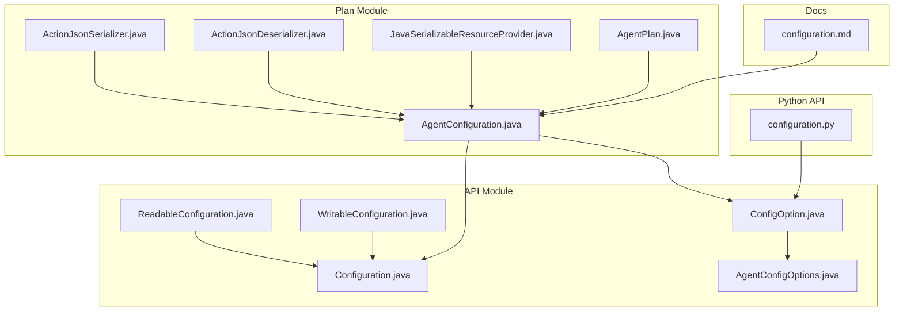
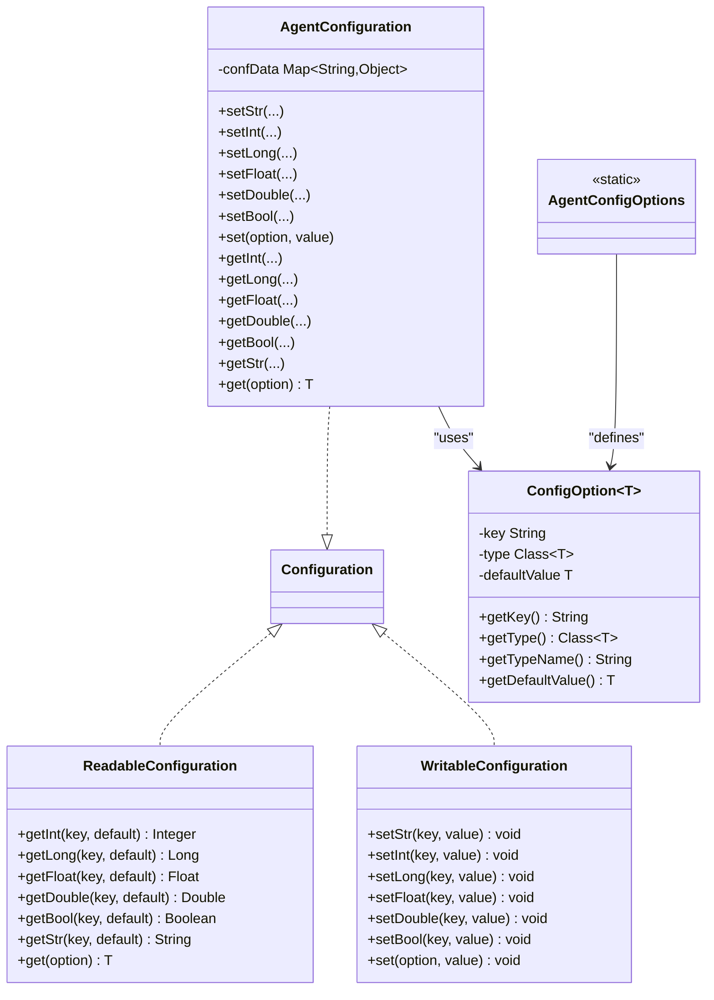
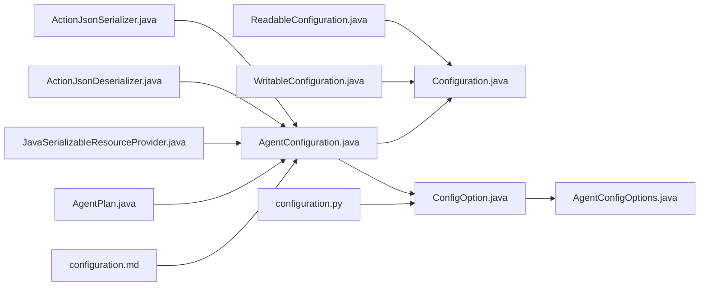
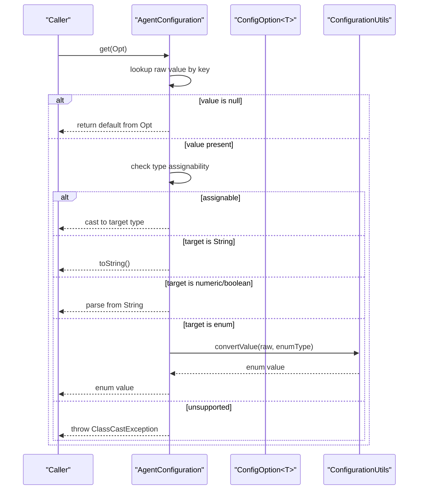

# Configuration API

<cite>
**Referenced Files in This Document**
- [Configuration.java](file://api/src/main/java/org/apache/flink/agents/api/configuration/Configuration.java)
- [ReadableConfiguration.java](file://api/src/main/java/org/apache/flink/agents/api/configuration/ReadableConfiguration.java)
- [WritableConfiguration.java](file://api/src/main/java/org/apache/flink/agents/api/configuration/WritableConfiguration.java)
- [ConfigOption.java](file://api/src/main/java/org/apache/flink/agents/api/configuration/ConfigOption.java)
- [AgentConfigOptions.java](file://api/src/main/java/org/apache/flink/agents/api/configuration/AgentConfigOptions.java)
- [AgentConfiguration.java](file://plan/src/main/java/org/apache/flink/agents/plan/AgentConfiguration.java)
- [AgentConfigurationTest.java](file://plan/src/test/java/org/apache/flink/agents/plan/AgentConfigurationTest.java)
- [configuration.md](file://docs/content/docs/operations/configuration.md)
- [ActionJsonSerializer.java](file://plan/src/main/java/org/apache/flink/agents/plan/serializer/ActionJsonSerializer.java)
- [ActionJsonDeserializer.java](file://plan/src/main/java/org/apache/flink/agents/plan/serializer/ActionJsonDeserializer.java)
- [JavaSerializableResourceProvider.java](file://plan/src/main/java/org/apache/flink/agents/plan/resourceprovider/JavaSerializableResourceProvider.java)
- [AgentPlan.java](file://plan/src/main/java/org/apache/flink/agents/plan/AgentPlan.java)
- [configuration.py](file://python/flink_agents/api/configuration.py)
</cite>

## Table of Contents
1. [Introduction](#introduction)
2. [Project Structure](#project-structure)
3. [Core Components](#core-components)
4. [Architecture Overview](#architecture-overview)
5. [Detailed Component Analysis](#detailed-component-analysis)
6. [Dependency Analysis](#dependency-analysis)
7. [Performance Considerations](#performance-considerations)
8. [Troubleshooting Guide](#troubleshooting-guide)
9. [Conclusion](#conclusion)
10. [Appendices](#appendices)

## Introduction
This document provides comprehensive API documentation for the Flink Agents configuration system. It covers the Configuration interface and its readable/writable variants, the strongly typed ConfigOption class, configuration loading and merging behavior, validation and type-safety mechanisms, serialization and persistence APIs, and practical examples for custom configuration options, environment-specific settings, and best practices. It also documents migration and compatibility handling for configuration changes.

## Project Structure
The configuration system spans the API module (interfaces and options), the plan module (runtime implementation and serializers), and documentation that explains loading and YAML configuration behavior.

**Diagram sources**
- [Configuration.java](file://api/src/main/java/org/apache/flink/agents/api/configuration/Configuration.java#L20-L24)
- [ReadableConfiguration.java](file://api/src/main/java/org/apache/flink/agents/api/configuration/ReadableConfiguration.java#L21-L84)
- [WritableConfiguration.java](file://api/src/main/java/org/apache/flink/agents/api/configuration/WritableConfiguration.java#L21-L77)
- [ConfigOption.java](file://api/src/main/java/org/apache/flink/agents/api/configuration/ConfigOption.java#L23-L102)
- [AgentConfigOptions.java](file://api/src/main/java/org/apache/flink/agents/api/configuration/AgentConfigOptions.java#L21-L50)
- [AgentConfiguration.java](file://plan/src/main/java/org/apache/flink/agents/plan/AgentConfiguration.java#L29-L179)
- [ActionJsonSerializer.java](file://plan/src/main/java/org/apache/flink/agents/plan/serializer/ActionJsonSerializer.java#L73-L98)
- [ActionJsonDeserializer.java](file://plan/src/main/java/org/apache/flink/agents/plan/serializer/ActionJsonDeserializer.java#L131-L159)
- [JavaSerializableResourceProvider.java](file://plan/src/main/java/org/apache/flink/agents/plan/resourceprovider/JavaSerializableResourceProvider.java#L64-L95)
- [AgentPlan.java](file://plan/src/main/java/org/apache/flink/agents/plan/AgentPlan.java#L266-L286)
- [configuration.md](file://docs/content/docs/operations/configuration.md#L25-L151)
- [configuration.py](file://python/flink_agents/api/configuration.py#L22-L170)

**Section sources**
- [Configuration.java](file://api/src/main/java/org/apache/flink/agents/api/configuration/Configuration.java#L20-L24)
- [ReadableConfiguration.java](file://api/src/main/java/org/apache/flink/agents/api/configuration/ReadableConfiguration.java#L21-L84)
- [WritableConfiguration.java](file://api/src/main/java/org/apache/flink/agents/api/configuration/WritableConfiguration.java#L21-L77)
- [ConfigOption.java](file://api/src/main/java/org/apache/flink/agents/api/configuration/ConfigOption.java#L23-L102)
- [AgentConfigOptions.java](file://api/src/main/java/org/apache/flink/agents/api/configuration/AgentConfigOptions.java#L21-L50)
- [AgentConfiguration.java](file://plan/src/main/java/org/apache/flink/agents/plan/AgentConfiguration.java#L29-L179)
- [configuration.md](file://docs/content/docs/operations/configuration.md#L25-L151)
- [configuration.py](file://python/flink_agents/api/configuration.py#L22-L170)

## Core Components
- Configuration: Combined interface providing both read and write access.
- ReadableConfiguration: Typed getters for primitives and strings, plus a generic getter using ConfigOption.
- WritableConfiguration: Typed setters for primitives and strings, plus a generic setter using ConfigOption.
- ConfigOption: Strongly typed configuration option with key, type, and default value.
- AgentConfigOptions: Predefined configuration options for agents (e.g., Kafka settings, job identifier).
- AgentConfiguration: Runtime implementation storing key/value pairs, performing type conversions, and honoring defaults.

Key responsibilities:
- Type safety: ConfigOption enforces type and default semantics; AgentConfiguration performs conversions and casts.
- Read/write separation: Clear division between read and write concerns.
- Defaults: ConfigOption provides defaults; AgentConfiguration falls back to defaults when keys are missing.
- Serialization: JSON serializers handle Java configuration objects and typed values.

**Section sources**
- [Configuration.java](file://api/src/main/java/org/apache/flink/agents/api/configuration/Configuration.java#L20-L24)
- [ReadableConfiguration.java](file://api/src/main/java/org/apache/flink/agents/api/configuration/ReadableConfiguration.java#L21-L84)
- [WritableConfiguration.java](file://api/src/main/java/org/apache/flink/agents/api/configuration/WritableConfiguration.java#L21-L77)
- [ConfigOption.java](file://api/src/main/java/org/apache/flink/agents/api/configuration/ConfigOption.java#L23-L102)
- [AgentConfigOptions.java](file://api/src/main/java/org/apache/flink/agents/api/configuration/AgentConfigOptions.java#L21-L50)
- [AgentConfiguration.java](file://plan/src/main/java/org/apache/flink/agents/plan/AgentConfiguration.java#L29-L179)

## Architecture Overview
The configuration system separates concerns between API interfaces and a concrete implementation. Users interact with Configuration via ConfigOption for type-safe reads/writes. AgentConfiguration stores values in a flat Map and converts types on demand. YAML loading and environment-based overrides are documented in the operations guide.

**Diagram sources**
- [ReadableConfiguration.java](file://api/src/main/java/org/apache/flink/agents/api/configuration/ReadableConfiguration.java#L21-L84)
- [WritableConfiguration.java](file://api/src/main/java/org/apache/flink/agents/api/configuration/WritableConfiguration.java#L21-L77)
- [Configuration.java](file://api/src/main/java/org/apache/flink/agents/api/configuration/Configuration.java#L20-L24)
- [ConfigOption.java](file://api/src/main/java/org/apache/flink/agents/api/configuration/ConfigOption.java#L23-L102)
- [AgentConfiguration.java](file://plan/src/main/java/org/apache/flink/agents/plan/AgentConfiguration.java#L29-L179)
- [AgentConfigOptions.java](file://api/src/main/java/org/apache/flink/agents/api/configuration/AgentConfigOptions.java#L21-L50)

## Detailed Component Analysis

### Configuration Interfaces
- ReadableConfiguration: Provides typed getters for integers, longs, floats, doubles, booleans, and strings, plus a generic get(ConfigOption<T>) method returning the appropriate type.
- WritableConfiguration: Provides typed setters for the same primitive types and a generic set(ConfigOption<T>, T) method.
- Configuration: Combines both interfaces for full access.

Usage patterns:
- Prefer ConfigOption-based getters/setters for type safety and default handling.
- Use direct key-based methods for ad-hoc or non-standardized settings.

**Section sources**
- [ReadableConfiguration.java](file://api/src/main/java/org/apache/flink/agents/api/configuration/ReadableConfiguration.java#L21-L84)
- [WritableConfiguration.java](file://api/src/main/java/org/apache/flink/agents/api/configuration/WritableConfiguration.java#L21-L77)
- [Configuration.java](file://api/src/main/java/org/apache/flink/agents/api/configuration/Configuration.java#L20-L24)

### ConfigOption: Strongly-Typed Configuration Options
ConfigOption encapsulates:
- Key: Unique configuration key.
- Type: Expected type of the value.
- Default value: Fallback used when the key is absent.

Behavior highlights:
- Equality and hashing based on key.
- toString for diagnostics.
- Used by AgentConfiguration.get(option) to return defaults when missing.

Best practices:
- Define all framework options as static ConfigOption instances in a central options class.
- Always specify a default value when applicable to avoid null handling downstream.

**Section sources**
- [ConfigOption.java](file://api/src/main/java/org/apache/flink/agents/api/configuration/ConfigOption.java#L23-L102)
- [AgentConfigOptions.java](file://api/src/main/java/org/apache/flink/agents/api/configuration/AgentConfigOptions.java#L21-L50)

### AgentConfiguration: Implementation and Type Conversion
AgentConfiguration implements Configuration and provides:
- Storage: A flat Map<String, Object> holding configuration values.
- Setters: Store values directly; set(ConfigOption<T>, T) skips null values when a non-null default exists.
- Getters: Convert raw values to requested types using safe parsing or casting; fall back to defaults.
- Flattening: Accepts hierarchical maps and flattens them into dot-delimited keys.

Type conversion logic:
- Numeric types: Parse from String when needed.
- Boolean: Parse from String.
- Enum: Converted via a utility supporting textual forms.
- String: Coerced from any object.
- Other types: Cast if assignable; otherwise throw ClassCastException.

Validation and error handling:
- Missing keys: Return provided default or null if not supplied.
- Invalid numeric strings: Throw NumberFormatException during parsing (verified by tests).
- Unsupported conversions: Throw ClassCastException.

**Section sources**
- [AgentConfiguration.java](file://plan/src/main/java/org/apache/flink/agents/plan/AgentConfiguration.java#L29-L179)
- [AgentConfigurationTest.java](file://plan/src/test/java/org/apache/flink/agents/plan/AgentConfigurationTest.java#L33-L191)

### Configuration Loading, Merging, and Inheritance
Loading behavior:
- YAML configuration is supported and loaded from a standard location, with agent-specific settings nested under the agent key.
- Priority order (highest to lowest): AgentsExecutionEnvironment, then Flink YAML configuration file.
- Duplicate keys: Higher-priority values override lower-priority ones.

Environment-specific settings:
- MiniCluster requires explicit configuration directory via an environment variable.
- Local mode can load a specific YAML file via an API.

Merging and inheritance:
- The runtime implementation stores configuration in a Map and honors defaults from ConfigOption.
- YAML values are merged into the configuration map, overriding environment-provided values when present.

**Section sources**
- [configuration.md](file://docs/content/docs/operations/configuration.md#L25-L151)
- [AgentConfiguration.java](file://plan/src/main/java/org/apache/flink/agents/plan/AgentConfiguration.java#L29-L179)

### Serialization and Persistence APIs
Serialization pathways:
- Action JSON serialization writes configuration as a typed map, including a type discriminator and per-value class metadata.
- Deserialization reconstructs typed values using class names embedded in the JSON.
- Resource providers support serializing and deserializing Java resources for cross-language persistence.

Persistence:
- AgentPlan exposes configuration data for serialization and caching resources.
- JavaSerializableResourceProvider persists resources as JSON strings and reconstructs them at runtime.

**Section sources**
- [ActionJsonSerializer.java](file://plan/src/main/java/org/apache/flink/agents/plan/serializer/ActionJsonSerializer.java#L73-L98)
- [ActionJsonDeserializer.java](file://plan/src/main/java/org/apache/flink/agents/plan/serializer/ActionJsonDeserializer.java#L131-L159)
- [JavaSerializableResourceProvider.java](file://plan/src/main/java/org/apache/flink/agents/plan/resourceprovider/JavaSerializableResourceProvider.java#L64-L95)
- [AgentPlan.java](file://plan/src/main/java/org/apache/flink/agents/plan/AgentPlan.java#L266-L286)

### Examples and Best Practices
Custom configuration options:
- Define new options as static ConfigOption instances with meaningful keys, types, and defaults.
- Use ConfigOption-based getters/setters to ensure type safety and consistent fallback behavior.

Environment-specific settings:
- For MiniCluster, set the configuration directory via the documented environment variable.
- For local runs without a cluster, explicitly pass the YAML file path to the configuration API.

Configuration best practices:
- Prefer ConfigOption-based APIs for framework-level settings.
- Keep defaults explicit and documented.
- Flatten nested YAML under the agent key as described in the operations guide.

Migration and compatibility:
- When renaming or removing keys, maintain backward compatibility by mapping old keys to new ones during loading.
- Use defaults to avoid breaking changes when adding new options.
- Validate type conversions and provide clear error messages for unsupported formats.

**Section sources**
- [AgentConfigOptions.java](file://api/src/main/java/org/apache/flink/agents/api/configuration/AgentConfigOptions.java#L21-L50)
- [configuration.md](file://docs/content/docs/operations/configuration.md#L25-L151)
- [AgentConfiguration.java](file://plan/src/main/java/org/apache/flink/agents/plan/AgentConfiguration.java#L29-L179)

## Dependency Analysis
The configuration system exhibits clear layering:
- API module defines interfaces and options.
- Plan module implements Configuration and integrates with serializers.
- Docs define loading behavior and YAML format.
- Python API mirrors the Java interfaces for cross-language support.

**Diagram sources**
- [Configuration.java](file://api/src/main/java/org/apache/flink/agents/api/configuration/Configuration.java#L20-L24)
- [ReadableConfiguration.java](file://api/src/main/java/org/apache/flink/agents/api/configuration/ReadableConfiguration.java#L21-L84)
- [WritableConfiguration.java](file://api/src/main/java/org/apache/flink/agents/api/configuration/WritableConfiguration.java#L21-L77)
- [ConfigOption.java](file://api/src/main/java/org/apache/flink/agents/api/configuration/ConfigOption.java#L23-L102)
- [AgentConfigOptions.java](file://api/src/main/java/org/apache/flink/agents/api/configuration/AgentConfigOptions.java#L21-L50)
- [AgentConfiguration.java](file://plan/src/main/java/org/apache/flink/agents/plan/AgentConfiguration.java#L29-L179)
- [ActionJsonSerializer.java](file://plan/src/main/java/org/apache/flink/agents/plan/serializer/ActionJsonSerializer.java#L73-L98)
- [ActionJsonDeserializer.java](file://plan/src/main/java/org/apache/flink/agents/plan/serializer/ActionJsonDeserializer.java#L131-L159)
- [JavaSerializableResourceProvider.java](file://plan/src/main/java/org/apache/flink/agents/plan/resourceprovider/JavaSerializableResourceProvider.java#L64-L95)
- [AgentPlan.java](file://plan/src/main/java/org/apache/flink/agents/plan/AgentPlan.java#L266-L286)
- [configuration.md](file://docs/content/docs/operations/configuration.md#L25-L151)
- [configuration.py](file://python/flink_agents/api/configuration.py#L22-L170)

**Section sources**
- [AgentConfiguration.java](file://plan/src/main/java/org/apache/flink/agents/plan/AgentConfiguration.java#L29-L179)
- [configuration.md](file://docs/content/docs/operations/configuration.md#L25-L151)

## Performance Considerations
- Type conversion cost: Converting strings to numeric types and booleans occurs on demand; cache results where repeated reads are performed.
- Map lookups: Flat Map storage provides O(1) average-case access; consider minimizing redundant reads.
- Serialization overhead: JSON serialization/deserialization adds CPU and memory overhead; batch operations when possible.
- Defaults: Using ConfigOption defaults avoids expensive validation and reduces branching.

## Troubleshooting Guide
Common issues and resolutions:
- Missing keys: Ensure defaults are defined in ConfigOption; verify YAML loading paths and environment variables for MiniCluster/local mode.
- Type conversion errors: Validate YAML values match expected types; numeric strings must conform to standard formats.
- Unsupported conversions: Confirm target types are supported; enums are converted via a utility supporting textual forms.
- Serialization mismatches: Verify @class metadata matches actual types during deserialization.

**Section sources**
- [AgentConfigurationTest.java](file://plan/src/test/java/org/apache/flink/agents/plan/AgentConfigurationTest.java#L33-L191)
- [configuration.md](file://docs/content/docs/operations/configuration.md#L25-L151)
- [ActionJsonDeserializer.java](file://plan/src/main/java/org/apache/flink/agents/plan/serializer/ActionJsonDeserializer.java#L131-L159)

## Conclusion
The Flink Agents configuration system balances type safety, flexibility, and operational simplicity. The ConfigOption-based API ensures strong typing and defaults, while AgentConfiguration provides robust conversion and persistence. YAML loading and environment overrides enable flexible deployments, and serializers support cross-language configuration exchange. Following the documented best practices and migration strategies helps maintain compatibility and reliability across environments.

## Appendices

### API Definitions: Configuration Interfaces
- ReadableConfiguration
  - getInt(key, default): Integer
  - getLong(key, default): Long
  - getFloat(key, default): Float
  - getDouble(key, default): Double
  - getBool(key, default): Boolean
  - getStr(key, default): String
  - get(option): T
- WritableConfiguration
  - setStr(key, value): void
  - setInt(key, value): void
  - setLong(key, value): void
  - setFloat(key, value): void
  - setDouble(key, value): void
  - setBool(key, value): void
  - set(option, value): void
- Configuration: Combines ReadableConfiguration and WritableConfiguration

**Section sources**
- [ReadableConfiguration.java](file://api/src/main/java/org/apache/flink/agents/api/configuration/ReadableConfiguration.java#L21-L84)
- [WritableConfiguration.java](file://api/src/main/java/org/apache/flink/agents/api/configuration/WritableConfiguration.java#L21-L77)
- [Configuration.java](file://api/src/main/java/org/apache/flink/agents/api/configuration/Configuration.java#L20-L24)

### YAML Configuration Format and Loading
- Nested under agent key.
- Automatic loading from a standard location; environment-specific overrides apply.
- MiniCluster and local mode require explicit configuration paths.

**Section sources**
- [configuration.md](file://docs/content/docs/operations/configuration.md#L82-L121)

### Sequence: Configuration Retrieval and Type Conversion

**Diagram sources**
- [AgentConfiguration.java](file://plan/src/main/java/org/apache/flink/agents/plan/AgentConfiguration.java#L128-L159)