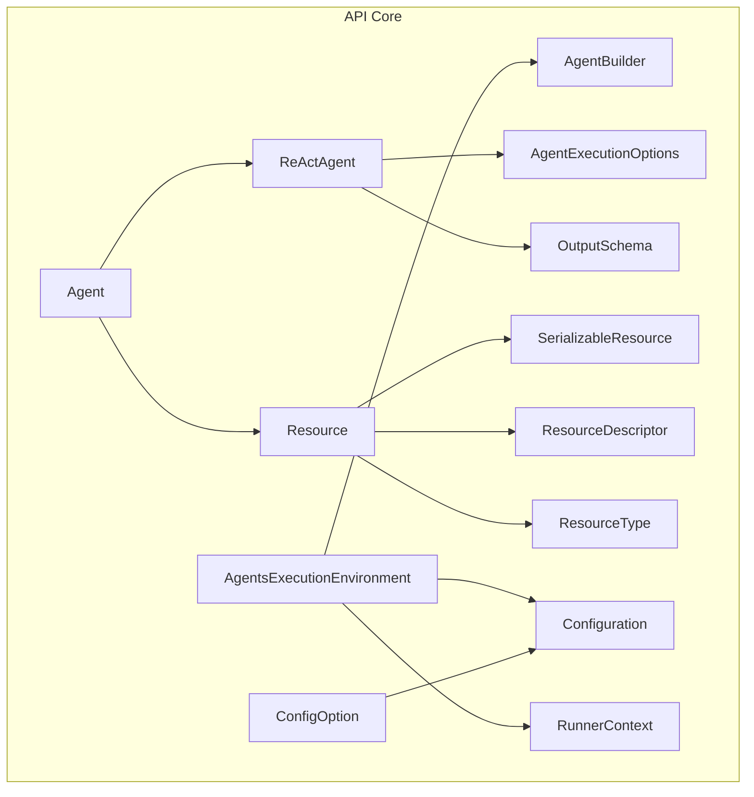
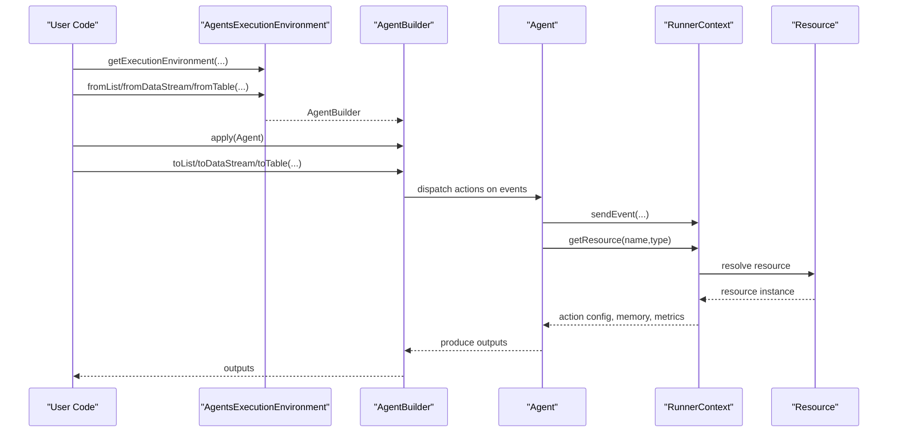
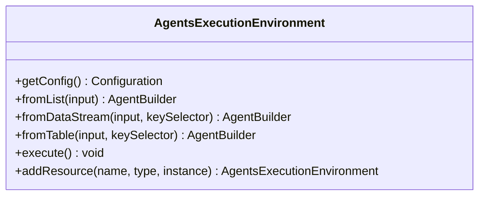
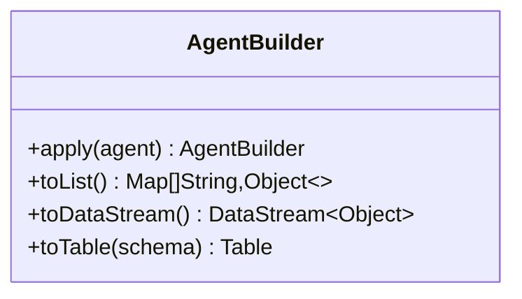
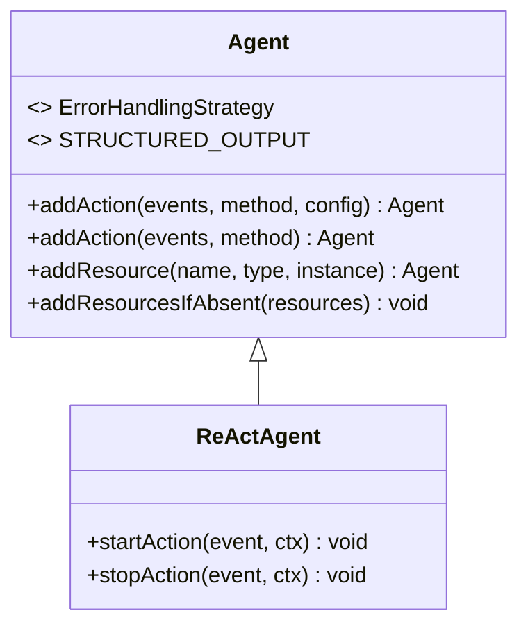
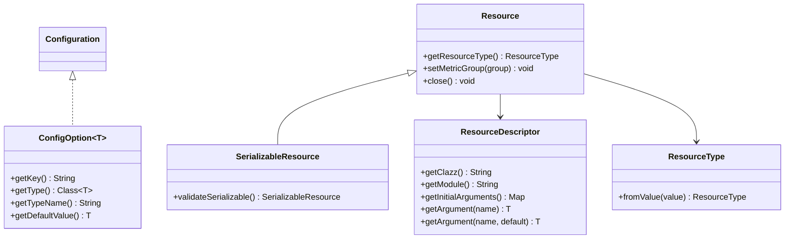
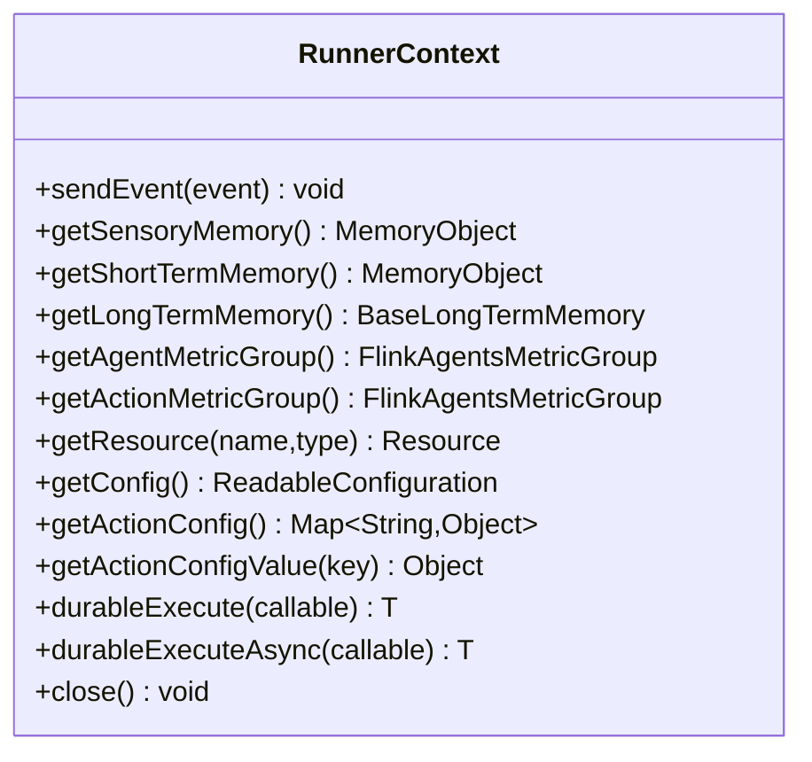
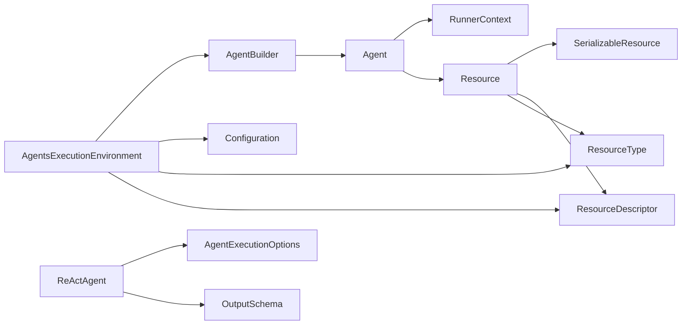

# Core APIs

<cite>
**Referenced Files in This Document**
- [AgentsExecutionEnvironment.java](file://api/src/main/java/org/apache/flink/agents/api/AgentsExecutionEnvironment.java)
- [AgentBuilder.java](file://api/src/main/java/org/apache/flink/agents/api/AgentBuilder.java)
- [Agent.java](file://api/src/main/java/org/apache/flink/agents/api/agents/Agent.java)
- [ReActAgent.java](file://api/src/main/java/org/apache/flink/agents/api/agents/ReActAgent.java)
- [AgentExecutionOptions.java](file://api/src/main/java/org/apache/flink/agents/api/agents/AgentExecutionOptions.java)
- [OutputSchema.java](file://api/src/main/java/org/apache/flink/agents/api/agents/OutputSchema.java)
- [Configuration.java](file://api/src/main/java/org/apache/flink/agents/api/configuration/Configuration.java)
- [ConfigOption.java](file://api/src/main/java/org/apache/flink/agents/api/configuration/ConfigOption.java)
- [Resource.java](file://api/src/main/java/org/apache/flink/agents/api/resource/Resource.java)
- [ResourceType.java](file://api/src/main/java/org/apache/flink/agents/api/resource/ResourceType.java)
- [SerializableResource.java](file://api/src/main/java/org/apache/flink/agents/api/resource/SerializableResource.java)
- [ResourceDescriptor.java](file://api/src/main/java/org/apache/flink/agents/api/resource/ResourceDescriptor.java)
- [RunnerContext.java](file://api/src/main/java/org/apache/flink/agents/api/context/RunnerContext.java)
- [ProductSuggestionAgent.java](file://examples/src/main/java/org/apache/flink/agents/examples/agents/ProductSuggestionAgent.java)
</cite>

## Table of Contents
1. [Introduction](#introduction)
2. [Project Structure](#project-structure)
3. [Core Components](#core-components)
4. [Architecture Overview](#architecture-overview)
5. [Detailed Component Analysis](#detailed-component-analysis)
6. [Dependency Analysis](#dependency-analysis)
7. [Performance Considerations](#performance-considerations)
8. [Troubleshooting Guide](#troubleshooting-guide)
9. [Conclusion](#conclusion)

## Introduction
This document provides comprehensive API documentation for the Flink Agents core interfaces. It focuses on:
- AgentsExecutionEnvironment: factory methods, input configuration methods, and resource management APIs
- AgentBuilder: fluent interface for agent configuration and pipeline construction
- Agent and ReActAgent: method signatures, parameters, return types, configuration, execution, and error handling patterns
- Configuration and resource management APIs
- Usage examples for local and remote execution contexts
- Thread-safety considerations and lifecycle management

## Project Structure
The core APIs reside in the api module under org.apache.flink.agents.api. They are organized by domain:
- Execution environment and builder: AgentsExecutionEnvironment, AgentBuilder
- Agent base and built-in implementations: Agent, ReActAgent, AgentExecutionOptions, OutputSchema
- Configuration: Configuration, ConfigOption
- Resource model: Resource, SerializableResource, ResourceDescriptor, ResourceType
- Runtime context: RunnerContext

**Diagram sources**
- [AgentsExecutionEnvironment.java](file://api/src/main/java/org/apache/flink/agents/api/AgentsExecutionEnvironment.java#L43-L222)
- [AgentBuilder.java](file://api/src/main/java/org/apache/flink/agents/api/AgentBuilder.java#L35-L76)
- [Agent.java](file://api/src/main/java/org/apache/flink/agents/api/agents/Agent.java#L34-L130)
- [ReActAgent.java](file://api/src/main/java/org/apache/flink/agents/api/agents/ReActAgent.java#L51-L182)
- [AgentExecutionOptions.java](file://api/src/main/java/org/apache/flink/agents/api/agents/AgentExecutionOptions.java#L23-L47)
- [OutputSchema.java](file://api/src/main/java/org/apache/flink/agents/api/agents/OutputSchema.java#L50-L134)
- [Configuration.java](file://api/src/main/java/org/apache/flink/agents/api/configuration/Configuration.java#L20-L24)
- [ConfigOption.java](file://api/src/main/java/org/apache/flink/agents/api/configuration/ConfigOption.java#L22-L102)
- [Resource.java](file://api/src/main/java/org/apache/flink/agents/api/resource/Resource.java#L30-L70)
- [SerializableResource.java](file://api/src/main/java/org/apache/flink/agents/api/resource/SerializableResource.java#L30-L49)
- [ResourceDescriptor.java](file://api/src/main/java/org/apache/flink/agents/api/resource/ResourceDescriptor.java#L29-L143)
- [ResourceType.java](file://api/src/main/java/org/apache/flink/agents/api/resource/ResourceType.java#L26-L61)
- [RunnerContext.java](file://api/src/main/java/org/apache/flink/agents/api/context/RunnerContext.java#L33-L137)

**Section sources**
- [AgentsExecutionEnvironment.java](file://api/src/main/java/org/apache/flink/agents/api/AgentsExecutionEnvironment.java#L37-L222)
- [AgentBuilder.java](file://api/src/main/java/org/apache/flink/agents/api/AgentBuilder.java#L29-L76)
- [Agent.java](file://api/src/main/java/org/apache/flink/agents/api/agents/Agent.java#L33-L130)
- [ReActAgent.java](file://api/src/main/java/org/apache/flink/agents/api/agents/ReActAgent.java#L50-L182)
- [AgentExecutionOptions.java](file://api/src/main/java/org/apache/flink/agents/api/agents/AgentExecutionOptions.java#L23-L47)
- [OutputSchema.java](file://api/src/main/java/org/apache/flink/agents/api/agents/OutputSchema.java#L42-L134)
- [Configuration.java](file://api/src/main/java/org/apache/flink/agents/api/configuration/Configuration.java#L20-L24)
- [ConfigOption.java](file://api/src/main/java/org/apache/flink/agents/api/configuration/ConfigOption.java#L22-L102)
- [Resource.java](file://api/src/main/java/org/apache/flink/agents/api/resource/Resource.java#L25-L70)
- [SerializableResource.java](file://api/src/main/java/org/apache/flink/agents/api/resource/SerializableResource.java#L25-L49)
- [ResourceDescriptor.java](file://api/src/main/java/org/apache/flink/agents/api/resource/ResourceDescriptor.java#L28-L143)
- [ResourceType.java](file://api/src/main/java/org/apache/flink/agents/api/resource/ResourceType.java#L21-L61)
- [RunnerContext.java](file://api/src/main/java/org/apache/flink/agents/api/context/RunnerContext.java#L29-L137)

## Core Components
This section documents the primary APIs and their responsibilities.

- AgentsExecutionEnvironment
  - Purpose: Entry point for agent execution in local or remote contexts
  - Factory methods:
    - getExecutionEnvironment(StreamExecutionEnvironment, StreamTableEnvironment)
    - getExecutionEnvironment(StreamExecutionEnvironment)
    - getExecutionEnvironment()
  - Input configuration methods:
    - fromList(List<Object>)
    - fromDataStream(DataStream<T>, KeySelector<T,K>)
    - fromDataStream(DataStream<T>)
    - fromTable(Table, KeySelector<Object,K>)
    - fromTable(Table)
  - Execution:
    - execute() throws Exception
  - Resource management:
    - addResource(String name, ResourceType type, Object instance)

- AgentBuilder
  - Purpose: Fluent interface to configure agents and define outputs
  - Methods:
    - apply(Agent) -> AgentBuilder
    - toList() -> List<Map<String,Object>>
    - toDataStream() -> DataStream<Object>
    - toTable(Schema) -> Table

- Agent
  - Purpose: Base class for defining agent logic and managing resources/actions
  - Actions:
    - addAction(Class<? extends Event>[], Method, Map<String,Object>)
    - addAction(Class<? extends Event>[], Method)
  - Resources:
    - addResource(String, ResourceType, Object)
    - addResourcesIfAbsent(Map<ResourceType,Map<String,Object>>)
  - Error handling strategy enum:
    - ErrorHandlingStrategy: FAIL, RETRY, IGNORE
  - Constants:
    - STRUCTURED_OUTPUT

- ReActAgent
  - Purpose: Built-in ReAct-style agent leveraging chat models and structured outputs
  - Constructor parameters:
    - ResourceDescriptor descriptor
    - Prompt prompt (nullable)
    - Object outputSchema (RowTypeInfo or POJO class; nullable)
  - Actions:
    - startAction(InputEvent, RunnerContext)
    - stopAction(ChatResponseEvent, RunnerContext) annotated with @Action(listenEvents={ChatResponseEvent})

- AgentExecutionOptions
  - Purpose: Provides ConfigOption constants for agent execution tuning
  - Options:
    - ERROR_HANDLING_STRATEGY
    - MAX_RETRIES
    - NUM_ASYNC_THREADS
    - CHAT_ASYNC
    - TOOL_CALL_ASYNC
    - RAG_ASYNC

- OutputSchema
  - Purpose: Helper for serializing RowTypeInfo-based output schemas
  - Constructor validates basic types only
  - JSON serializer/deserializer for RowTypeInfo metadata

- Configuration and ConfigOption
  - Configuration: Combined readable/writable configuration interface
  - ConfigOption: Typed configuration option with key, type, and default value

- Resource Model
  - Resource: Base for all resources with metric group binding and close lifecycle
  - SerializableResource: Ensures JSON serializability via validation
  - ResourceDescriptor: Cross-language resource descriptor with module/class and initial args
  - ResourceType: Enumerates supported resource types

- RunnerContext
  - Purpose: Runtime context for actions, exposing event sending, memory, metrics, resource retrieval, configuration, durable execution, and lifecycle

**Section sources**
- [AgentsExecutionEnvironment.java](file://api/src/main/java/org/apache/flink/agents/api/AgentsExecutionEnvironment.java#L53-L221)
- [AgentBuilder.java](file://api/src/main/java/org/apache/flink/agents/api/AgentBuilder.java#L35-L76)
- [Agent.java](file://api/src/main/java/org/apache/flink/agents/api/agents/Agent.java#L34-L130)
- [ReActAgent.java](file://api/src/main/java/org/apache/flink/agents/api/agents/ReActAgent.java#L59-L181)
- [AgentExecutionOptions.java](file://api/src/main/java/org/apache/flink/agents/api/agents/AgentExecutionOptions.java#L23-L47)
- [OutputSchema.java](file://api/src/main/java/org/apache/flink/agents/api/agents/OutputSchema.java#L50-L134)
- [Configuration.java](file://api/src/main/java/org/apache/flink/agents/api/configuration/Configuration.java#L20-L24)
- [ConfigOption.java](file://api/src/main/java/org/apache/flink/agents/api/configuration/ConfigOption.java#L22-L102)
- [Resource.java](file://api/src/main/java/org/apache/flink/agents/api/resource/Resource.java#L30-L70)
- [SerializableResource.java](file://api/src/main/java/org/apache/flink/agents/api/resource/SerializableResource.java#L30-L49)
- [ResourceDescriptor.java](file://api/src/main/java/org/apache/flink/agents/api/resource/ResourceDescriptor.java#L29-L143)
- [ResourceType.java](file://api/src/main/java/org/apache/flink/agents/api/resource/ResourceType.java#L26-L61)
- [RunnerContext.java](file://api/src/main/java/org/apache/flink/agents/api/context/RunnerContext.java#L33-L137)

## Architecture Overview
The execution flow integrates Flink’s DataStream/Table APIs with agent pipelines. Agents receive events, interact with resources (e.g., chat models), and emit outputs.

**Diagram sources**
- [AgentsExecutionEnvironment.java](file://api/src/main/java/org/apache/flink/agents/api/AgentsExecutionEnvironment.java#L68-L198)
- [AgentBuilder.java](file://api/src/main/java/org/apache/flink/agents/api/AgentBuilder.java#L35-L76)
- [Agent.java](file://api/src/main/java/org/apache/flink/agents/api/agents/Agent.java#L63-L111)
- [RunnerContext.java](file://api/src/main/java/org/apache/flink/agents/api/context/RunnerContext.java#L33-L137)
- [Resource.java](file://api/src/main/java/org/apache/flink/agents/api/resource/Resource.java#L30-L70)

## Detailed Component Analysis

### AgentsExecutionEnvironment
- Responsibilities
  - Factory selection between local and remote execution environments
  - Input configuration for list, DataStream, and Table
  - Execution delegation and resource registration
- Key methods
  - getExecutionEnvironment variants
  - fromList, fromDataStream, fromTable
  - execute
  - addResource
- Behavior
  - Local mode: constructs LocalExecutionEnvironment via reflection
  - Remote mode: constructs RemoteExecutionEnvironment with StreamExecutionEnvironment and optional StreamTableEnvironment
  - Resource registration validates SerializableResource or ResourceDescriptor and prevents duplicates

**Diagram sources**
- [AgentsExecutionEnvironment.java](file://api/src/main/java/org/apache/flink/agents/api/AgentsExecutionEnvironment.java#L43-L221)

**Section sources**
- [AgentsExecutionEnvironment.java](file://api/src/main/java/org/apache/flink/agents/api/AgentsExecutionEnvironment.java#L53-L221)

### AgentBuilder
- Responsibilities
  - Fluent configuration of agents
  - Output materialization to list, DataStream, or Table
- Methods
  - apply(Agent)
  - toList
  - toDataStream
  - toTable(Schema)

**Diagram sources**
- [AgentBuilder.java](file://api/src/main/java/org/apache/flink/agents/api/AgentBuilder.java#L35-L76)

**Section sources**
- [AgentBuilder.java](file://api/src/main/java/org/apache/flink/agents/api/AgentBuilder.java#L35-L76)

### Agent and ReActAgent
- Agent
  - Manages actions (event listeners and static handler methods) and resources
  - addAction overloads for static handlers and optional configs
  - addResource/addResourcesIfAbsent with validation for SerializableResource or ResourceDescriptor
  - ErrorHandlingStrategy enum and STRUCTURED_OUTPUT constant
- ReActAgent
  - Constructor wires a default chat model and optional schema/prompt resources
  - startAction: builds user/system messages from input and emits ChatRequestEvent
  - stopAction: parses structured output or content and emits OutputEvent

**Diagram sources**
- [Agent.java](file://api/src/main/java/org/apache/flink/agents/api/agents/Agent.java#L34-L130)
- [ReActAgent.java](file://api/src/main/java/org/apache/flink/agents/api/agents/ReActAgent.java#L51-L182)

**Section sources**
- [Agent.java](file://api/src/main/java/org/apache/flink/agents/api/agents/Agent.java#L34-L130)
- [ReActAgent.java](file://api/src/main/java/org/apache/flink/agents/api/agents/ReActAgent.java#L59-L181)

### Configuration and Resource Management
- Configuration and ConfigOption
  - Configuration combines readable and writable access
  - ConfigOption encapsulates key/type/default for typed configuration
- Resource Model
  - Resource base class supports metric group binding and lifecycle close
  - SerializableResource validates JSON serializability
  - ResourceDescriptor enables cross-language resource declaration with module/class and initial arguments
  - ResourceType enumerates supported resource categories

**Diagram sources**
- [Configuration.java](file://api/src/main/java/org/apache/flink/agents/api/configuration/Configuration.java#L20-L24)
- [ConfigOption.java](file://api/src/main/java/org/apache/flink/agents/api/configuration/ConfigOption.java#L22-L102)
- [Resource.java](file://api/src/main/java/org/apache/flink/agents/api/resource/Resource.java#L30-L70)
- [SerializableResource.java](file://api/src/main/java/org/apache/flink/agents/api/resource/SerializableResource.java#L30-L49)
- [ResourceDescriptor.java](file://api/src/main/java/org/apache/flink/agents/api/resource/ResourceDescriptor.java#L29-L143)
- [ResourceType.java](file://api/src/main/java/org/apache/flink/agents/api/resource/ResourceType.java#L26-L61)

**Section sources**
- [Configuration.java](file://api/src/main/java/org/apache/flink/agents/api/configuration/Configuration.java#L20-L24)
- [ConfigOption.java](file://api/src/main/java/org/apache/flink/agents/api/configuration/ConfigOption.java#L22-L102)
- [Resource.java](file://api/src/main/java/org/apache/flink/agents/api/resource/Resource.java#L30-L70)
- [SerializableResource.java](file://api/src/main/java/org/apache/flink/agents/api/resource/SerializableResource.java#L30-L49)
- [ResourceDescriptor.java](file://api/src/main/java/org/apache/flink/agents/api/resource/ResourceDescriptor.java#L29-L143)
- [ResourceType.java](file://api/src/main/java/org/apache/flink/agents/api/resource/ResourceType.java#L26-L61)

### RunnerContext
- Responsibilities
  - Event emission, memory access (sensory, short-term, long-term), metrics, resource retrieval, configuration, durable execution, and lifecycle
- Key methods
  - sendEvent(Event)
  - getSensoryMemory/getShortTermMemory/getLongTermMemory
  - getAgentMetricGroup/getActionMetricGroup
  - getResource(name,type)
  - getConfig/getActionConfig/getActionConfigValue
  - durableExecute/durableExecuteAsync
  - close()

**Diagram sources**
- [RunnerContext.java](file://api/src/main/java/org/apache/flink/agents/api/context/RunnerContext.java#L33-L137)

**Section sources**
- [RunnerContext.java](file://api/src/main/java/org/apache/flink/agents/api/context/RunnerContext.java#L33-L137)

### Usage Examples and Patterns
- Local execution
  - Use AgentsExecutionEnvironment.getExecutionEnvironment() to obtain a local environment
  - Configure input via fromList and outputs via toList
- Remote execution
  - Pass a StreamExecutionEnvironment to getExecutionEnvironment to enable Flink integration
  - Configure input via fromDataStream or fromTable and outputs via toDataStream or toTable
- ReActAgent usage
  - Construct with a ResourceDescriptor for the chat model, optional Prompt, and optional output schema
  - Actions handle InputEvent and ChatResponseEvent to orchestrate reasoning and structured output
- Custom agent example
  - Demonstrates adding resources, building prompts, emitting ChatRequestEvent, and parsing responses to produce OutputEvent

**Section sources**
- [AgentsExecutionEnvironment.java](file://api/src/main/java/org/apache/flink/agents/api/AgentsExecutionEnvironment.java#L68-L121)
- [AgentBuilder.java](file://api/src/main/java/org/apache/flink/agents/api/AgentBuilder.java#L54-L75)
- [ReActAgent.java](file://api/src/main/java/org/apache/flink/agents/api/agents/ReActAgent.java#L59-L181)
- [ProductSuggestionAgent.java](file://examples/src/main/java/org/apache/flink/agents/examples/agents/ProductSuggestionAgent.java#L52-L113)

## Dependency Analysis
- AgentsExecutionEnvironment depends on:
  - Flink DataStream/Table abstractions
  - Configuration and resource types
  - Runtime environment classes (LocalExecutionEnvironment, RemoteExecutionEnvironment) loaded via reflection
- AgentBuilder depends on:
  - Agent and Flink output types (DataStream, Table)
- Agent and ReActAgent depend on:
  - Event types, RunnerContext, Prompt, Resource model, OutputSchema
- Configuration and Resource model form a cohesive subsystem for typed configuration and resource lifecycle

**Diagram sources**
- [AgentsExecutionEnvironment.java](file://api/src/main/java/org/apache/flink/agents/api/AgentsExecutionEnvironment.java#L21-L35)
- [AgentBuilder.java](file://api/src/main/java/org/apache/flink/agents/api/AgentBuilder.java#L21-L27)
- [Agent.java](file://api/src/main/java/org/apache/flink/agents/api/agents/Agent.java#L21-L31)
- [ReActAgent.java](file://api/src/main/java/org/apache/flink/agents/api/agents/ReActAgent.java#L25-L48)
- [AgentExecutionOptions.java](file://api/src/main/java/org/apache/flink/agents/api/agents/AgentExecutionOptions.java#L21-L46)
- [OutputSchema.java](file://api/src/main/java/org/apache/flink/agents/api/agents/OutputSchema.java#L34-L36)
- [Resource.java](file://api/src/main/java/org/apache/flink/agents/api/resource/Resource.java#L21-L23)
- [SerializableResource.java](file://api/src/main/java/org/apache/flink/agents/api/resource/SerializableResource.java#L21-L23)
- [ResourceDescriptor.java](file://api/src/main/java/org/apache/flink/agents/api/resource/ResourceDescriptor.java#L21-L26)
- [ResourceType.java](file://api/src/main/java/org/apache/flink/agents/api/resource/ResourceType.java#L21-L24)

**Section sources**
- [AgentsExecutionEnvironment.java](file://api/src/main/java/org/apache/flink/agents/api/AgentsExecutionEnvironment.java#L21-L35)
- [AgentBuilder.java](file://api/src/main/java/org/apache/flink/agents/api/AgentBuilder.java#L21-L27)
- [Agent.java](file://api/src/main/java/org/apache/flink/agents/api/agents/Agent.java#L21-L31)
- [ReActAgent.java](file://api/src/main/java/org/apache/flink/agents/api/agents/ReActAgent.java#L25-L48)
- [AgentExecutionOptions.java](file://api/src/main/java/org/apache/flink/agents/api/agents/AgentExecutionOptions.java#L21-L46)
- [OutputSchema.java](file://api/src/main/java/org/apache/flink/agents/api/agents/OutputSchema.java#L34-L36)
- [Resource.java](file://api/src/main/java/org/apache/flink/agents/api/resource/Resource.java#L21-L23)
- [SerializableResource.java](file://api/src/main/java/org/apache/flink/agents/api/resource/SerializableResource.java#L21-L23)
- [ResourceDescriptor.java](file://api/src/main/java/org/apache/flink/agents/api/resource/ResourceDescriptor.java#L21-L26)
- [ResourceType.java](file://api/src/main/java/org/apache/flink/agents/api/resource/ResourceType.java#L21-L24)

## Performance Considerations
- Asynchronous execution
  - AgentExecutionOptions exposes async toggles for chat, tool calls, and RAG to optimize throughput
  - NUM_ASYNC_THREADS controls concurrency level
- Durable execution
  - RunnerContext durableExecute and durableExecuteAsync provide cached results during job recovery
- Serialization
  - SerializableResource.validateSerializable ensures resources are JSON serializable for cross-language and distributed execution
- Output schema
  - OutputSchema restricts to basic types for efficient serialization and schema enforcement

[No sources needed since this section provides general guidance]

## Troubleshooting Guide
- Resource registration errors
  - Adding a resource with duplicate name/type leads to IllegalArgumentException
  - Unsupported resource instance types cause IllegalArgumentException; use SerializableResource or ResourceDescriptor
- Action definition errors
  - Duplicate action names trigger IllegalArgumentException in Agent.addAction
- Execution failures
  - AgentsExecutionEnvironment factory methods throw RuntimeException if runtime environment classes cannot be instantiated
  - ReActAgent.startAction throws exceptions for unsupported input types or missing prompts for non-primitive inputs
- Configuration
  - ConfigOption equality and hashing rely on key; ensure consistent keys across deployments

**Section sources**
- [AgentsExecutionEnvironment.java](file://api/src/main/java/org/apache/flink/agents/api/AgentsExecutionEnvironment.java#L207-L221)
- [Agent.java](file://api/src/main/java/org/apache/flink/agents/api/agents/Agent.java#L63-L81)
- [ReActAgent.java](file://api/src/main/java/org/apache/flink/agents/api/agents/ReActAgent.java#L124-L128)

## Conclusion
Flink Agents provides a cohesive API surface for building agent-driven streaming pipelines:
- AgentsExecutionEnvironment offers flexible local/remote execution and input configuration
- AgentBuilder enables fluent pipeline construction with multiple output targets
- Agent and ReActAgent define robust action/event models with resource and configuration support
- Configuration and resource management APIs ensure type safety, serializability, and cross-language compatibility
- RunnerContext centralizes runtime capabilities for memory, metrics, and durable execution