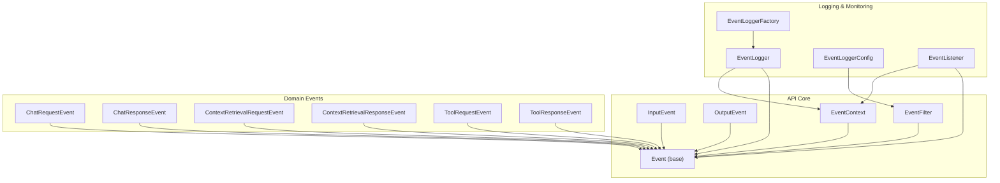
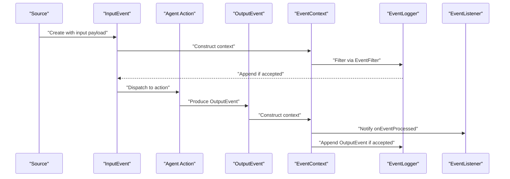
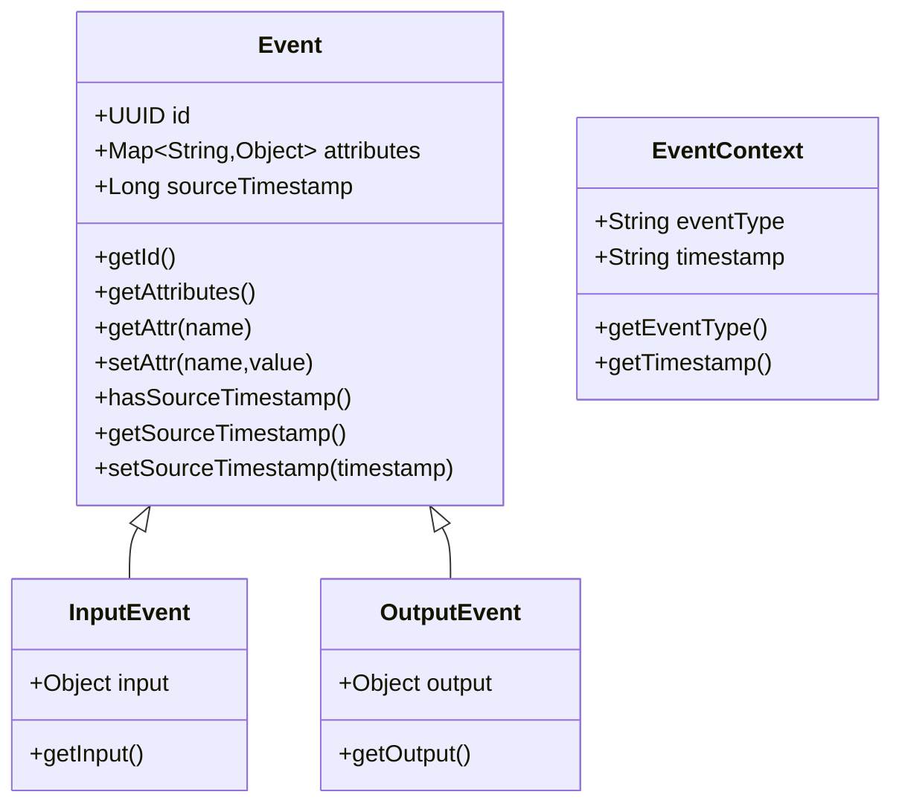
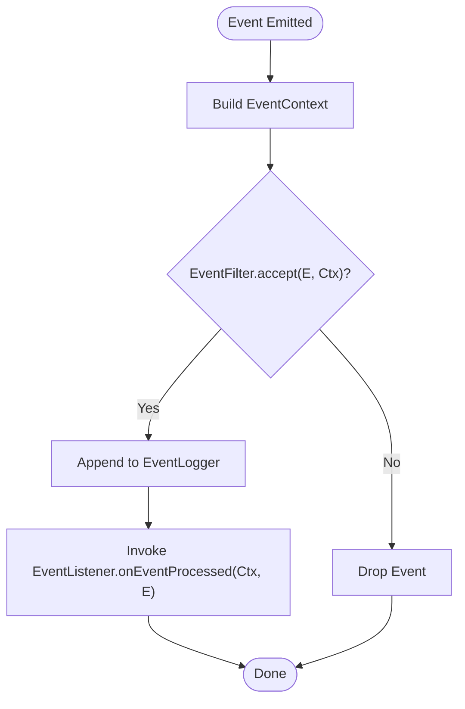
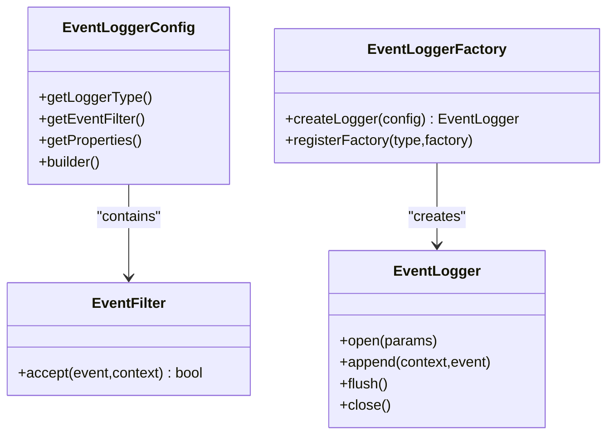
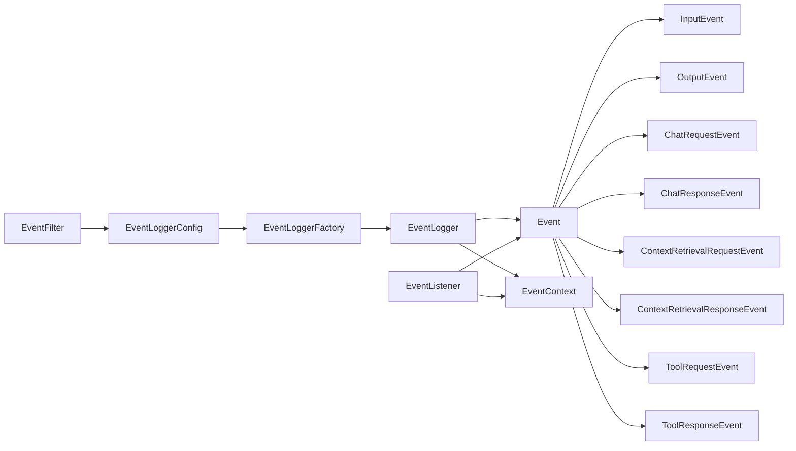

# Event System API

<cite>
**Referenced Files in This Document**
- [Event.java](file://api/src/main/java/org/apache/flink/agents/api/Event.java)
- [InputEvent.java](file://api/src/main/java/org/apache/flink/agents/api/InputEvent.java)
- [OutputEvent.java](file://api/src/main/java/org/apache/flink/agents/api/OutputEvent.java)
- [EventContext.java](file://api/src/main/java/org/apache/flink/agents/api/EventContext.java)
- [EventFilter.java](file://api/src/main/java/org/apache/flink/agents/api/EventFilter.java)
- [ChatRequestEvent.java](file://api/src/main/java/org/apache/flink/agents/api/event/ChatRequestEvent.java)
- [ChatResponseEvent.java](file://api/src/main/java/org/apache/flink/agents/api/event/ChatResponseEvent.java)
- [ContextRetrievalRequestEvent.java](file://api/src/main/java/org/apache/flink/agents/api/event/ContextRetrievalRequestEvent.java)
- [ContextRetrievalResponseEvent.java](file://api/src/main/java/org/apache/flink/agents/api/event/ContextRetrievalResponseEvent.java)
- [ToolRequestEvent.java](file://api/src/main/java/org/apache/flink/agents/api/event/ToolRequestEvent.java)
- [ToolResponseEvent.java](file://api/src/main/java/org/apache/flink/agents/api/event/ToolResponseEvent.java)
- [EventLogger.java](file://api/src/main/java/org/apache/flink/agents/api/logger/EventLogger.java)
- [EventLoggerConfig.java](file://api/src/main/java/org/apache/flink/agents/api/logger/EventLoggerConfig.java)
- [EventLoggerFactory.java](file://api/src/main/java/org/apache/flink/agents/api/logger/EventLoggerFactory.java)
- [EventListener.java](file://api/src/main/java/org/apache/flink/agents/api/listener/EventListener.java)
</cite>

## Table of Contents
1. [Introduction](#introduction)
2. [Project Structure](#project-structure)
3. [Core Components](#core-components)
4. [Architecture Overview](#architecture-overview)
5. [Detailed Component Analysis](#detailed-component-analysis)
6. [Dependency Analysis](#dependency-analysis)
7. [Performance Considerations](#performance-considerations)
8. [Troubleshooting Guide](#troubleshooting-guide)
9. [Conclusion](#conclusion)

## Introduction
This document describes the Flink Agents event processing system API. It focuses on the event model, payload handling, type safety, lifecycle, serialization/deserialization, filtering, routing, transformation, logging, monitoring, and error handling. It also provides examples of building custom events, processing pipelines, and event-driven agent patterns.

## Project Structure
The event system resides primarily under the API module, with supporting logger, filter, and listener abstractions. Event subclasses represent domain-specific signals (chat, context retrieval, tool use), while the base classes provide common metadata and payload handling.

**Diagram sources**
- [Event.java](file://api/src/main/java/org/apache/flink/agents/api/Event.java#L29-L89)
- [InputEvent.java](file://api/src/main/java/org/apache/flink/agents/api/InputEvent.java#L27-L48)
- [OutputEvent.java](file://api/src/main/java/org/apache/flink/agents/api/OutputEvent.java#L27-L51)
- [EventContext.java](file://api/src/main/java/org/apache/flink/agents/api/EventContext.java#L26-L51)
- [EventFilter.java](file://api/src/main/java/org/apache/flink/agents/api/EventFilter.java#L21-L61)
- [ChatRequestEvent.java](file://api/src/main/java/org/apache/flink/agents/api/event/ChatRequestEvent.java#L28-L57)
- [ChatResponseEvent.java](file://api/src/main/java/org/apache/flink/agents/api/event/ChatResponseEvent.java#L26-L42)
- [ContextRetrievalRequestEvent.java](file://api/src/main/java/org/apache/flink/agents/api/event/ContextRetrievalRequestEvent.java#L23-L54)
- [ContextRetrievalResponseEvent.java](file://api/src/main/java/org/apache/flink/agents/api/event/ContextRetrievalResponseEvent.java#L27-L50)
- [ToolRequestEvent.java](file://api/src/main/java/org/apache/flink/agents/api/event/ToolRequestEvent.java#L26-L48)
- [ToolResponseEvent.java](file://api/src/main/java/org/apache/flink/agents/api/event/ToolResponseEvent.java#L27-L79)
- [EventLogger.java](file://api/src/main/java/org/apache/flink/agents/api/logger/EventLogger.java#L24-L78)
- [EventLoggerConfig.java](file://api/src/main/java/org/apache/flink/agents/api/logger/EventLoggerConfig.java#L28-L136)
- [EventLoggerFactory.java](file://api/src/main/java/org/apache/flink/agents/api/logger/EventLoggerFactory.java#L26-L184)
- [EventListener.java](file://api/src/main/java/org/apache/flink/agents/api/listener/EventListener.java#L24-L51)

**Section sources**
- [Event.java](file://api/src/main/java/org/apache/flink/agents/api/Event.java#L29-L89)
- [InputEvent.java](file://api/src/main/java/org/apache/flink/agents/api/InputEvent.java#L27-L48)
- [OutputEvent.java](file://api/src/main/java/org/apache/flink/agents/api/OutputEvent.java#L27-L51)
- [EventContext.java](file://api/src/main/java/org/apache/flink/agents/api/EventContext.java#L26-L51)
- [EventFilter.java](file://api/src/main/java/org/apache/flink/agents/api/EventFilter.java#L21-L61)
- [ChatRequestEvent.java](file://api/src/main/java/org/apache/flink/agents/api/event/ChatRequestEvent.java#L28-L57)
- [ChatResponseEvent.java](file://api/src/main/java/org/apache/flink/agents/api/event/ChatResponseEvent.java#L26-L42)
- [ContextRetrievalRequestEvent.java](file://api/src/main/java/org/apache/flink/agents/api/event/ContextRetrievalRequestEvent.java#L23-L54)
- [ContextRetrievalResponseEvent.java](file://api/src/main/java/org/apache/flink/agents/api/event/ContextRetrievalResponseEvent.java#L27-L50)
- [ToolRequestEvent.java](file://api/src/main/java/org/apache/flink/agents/api/event/ToolRequestEvent.java#L26-L48)
- [ToolResponseEvent.java](file://api/src/main/java/org/apache/flink/agents/api/event/ToolResponseEvent.java#L27-L79)
- [EventLogger.java](file://api/src/main/java/org/apache/flink/agents/api/logger/EventLogger.java#L24-L78)
- [EventLoggerConfig.java](file://api/src/main/java/org/apache/flink/agents/api/logger/EventLoggerConfig.java#L28-L136)
- [EventLoggerFactory.java](file://api/src/main/java/org/apache/flink/agents/api/logger/EventLoggerFactory.java#L26-L184)
- [EventListener.java](file://api/src/main/java/org/apache/flink/agents/api/listener/EventListener.java#L24-L51)

## Core Components
- Event: Base class for all events with a unique ID, extensible attributes map, and optional source timestamp.
- InputEvent: Carries inbound input payload from the framework into the agent.
- OutputEvent: Carries outbound result payload produced by agent actions.
- EventContext: Metadata wrapper containing event type and processing timestamp.
- EventFilter: Functional interface for filtering events by type or custom logic.
- Domain Events: Specialized events for chat, context retrieval, and tool interactions.

Key characteristics:
- Payload handling: Generic Object payloads via InputEvent and OutputEvent enable flexible data transport.
- Type safety: Subclasses define typed fields (e.g., model, messages, toolCalls) for strong typing per domain.
- Attributes: Extensible Map<String, Object> supports arbitrary metadata and cross-cutting concerns.
- Serialization: Jackson annotations on base and concrete event classes support JSON round-trips.

**Section sources**
- [Event.java](file://api/src/main/java/org/apache/flink/agents/api/Event.java#L29-L89)
- [InputEvent.java](file://api/src/main/java/org/apache/flink/agents/api/InputEvent.java#L27-L48)
- [OutputEvent.java](file://api/src/main/java/org/apache/flink/agents/api/OutputEvent.java#L27-L51)
- [EventContext.java](file://api/src/main/java/org/apache/flink/agents/api/EventContext.java#L26-L51)
- [EventFilter.java](file://api/src/main/java/org/apache/flink/agents/api/EventFilter.java#L21-L61)

## Architecture Overview
The event system centers on a base Event class extended by specialized domain events. InputEvent and OutputEvent bridge framework ingestion and agent emission. EventContext provides processing metadata. EventFilter controls logging and listener delivery. EventLogger persists filtered events, and EventListener receives callbacks after processing.

**Diagram sources**
- [InputEvent.java](file://api/src/main/java/org/apache/flink/agents/api/InputEvent.java#L27-L48)
- [OutputEvent.java](file://api/src/main/java/org/apache/flink/agents/api/OutputEvent.java#L27-L51)
- [EventContext.java](file://api/src/main/java/org/apache/flink/agents/api/EventContext.java#L26-L51)
- [EventFilter.java](file://api/src/main/java/org/apache/flink/agents/api/EventFilter.java#L21-L61)
- [EventLogger.java](file://api/src/main/java/org/apache/flink/agents/api/logger/EventLogger.java#L24-L78)
- [EventListener.java](file://api/src/main/java/org/apache/flink/agents/api/listener/EventListener.java#L24-L51)

## Detailed Component Analysis

### Event Model and Lifecycle
- Creation: Events are constructed with IDs and attributes; InputEvent and OutputEvent embed generic payloads.
- Dispatch: Actions receive InputEvent and produce OutputEvent.
- Context: EventContext captures event type and timestamp for logging and monitoring.
- Persistence: EventLogger filters and appends events; flush/close ensure durability.
- Notification: EventListener receives post-processing callbacks.

**Diagram sources**
- [Event.java](file://api/src/main/java/org/apache/flink/agents/api/Event.java#L29-L89)
- [InputEvent.java](file://api/src/main/java/org/apache/flink/agents/api/InputEvent.java#L27-L48)
- [OutputEvent.java](file://api/src/main/java/org/apache/flink/agents/api/OutputEvent.java#L27-L51)
- [EventContext.java](file://api/src/main/java/org/apache/flink/agents/api/EventContext.java#L26-L51)

**Section sources**
- [Event.java](file://api/src/main/java/org/apache/flink/agents/api/Event.java#L29-L89)
- [InputEvent.java](file://api/src/main/java/org/apache/flink/agents/api/InputEvent.java#L27-L48)
- [OutputEvent.java](file://api/src/main/java/org/apache/flink/agents/api/OutputEvent.java#L27-L51)
- [EventContext.java](file://api/src/main/java/org/apache/flink/agents/api/EventContext.java#L26-L51)

### Payload Handling and Type Safety
- Generic payloads: InputEvent and OutputEvent carry Object payloads enabling flexible data transport.
- Typed domain events: Subclasses define strongly-typed fields (e.g., ChatRequestEvent messages, ToolRequestEvent toolCalls) for compile-time safety within domains.
- Attributes map: Arbitrary metadata stored as Map<String, Object> supports cross-cutting concerns without schema changes.

Serialization and deserialization:
- Jackson annotations on constructors and fields enable JSON serialization/deserialization for all event types.

**Section sources**
- [InputEvent.java](file://api/src/main/java/org/apache/flink/agents/api/InputEvent.java#L27-L48)
- [OutputEvent.java](file://api/src/main/java/org/apache/flink/agents/api/OutputEvent.java#L27-L51)
- [ChatRequestEvent.java](file://api/src/main/java/org/apache/flink/agents/api/event/ChatRequestEvent.java#L28-L57)
- [ToolRequestEvent.java](file://api/src/main/java/org/apache/flink/agents/api/event/ToolRequestEvent.java#L26-L48)
- [Event.java](file://api/src/main/java/org/apache/flink/agents/api/Event.java#L29-L89)

### Event Filtering, Routing, and Transformation
- EventFilter: Functional interface with accept(Event, EventContext) and convenience helpers byEventType(Class<?>...), ACCEPT_ALL, REJECT_ALL.
- Routing: EventLoggerConfig associates an EventFilter with a logger type; only accepted events are persisted.
- Transformation: Listeners can transform or enrich events via EventContext metadata and event inspection.

**Diagram sources**
- [EventFilter.java](file://api/src/main/java/org/apache/flink/agents/api/EventFilter.java#L21-L61)
- [EventLoggerConfig.java](file://api/src/main/java/org/apache/flink/agents/api/logger/EventLoggerConfig.java#L28-L136)
- [EventLogger.java](file://api/src/main/java/org/apache/flink/agents/api/logger/EventLogger.java#L24-L78)
- [EventListener.java](file://api/src/main/java/org/apache/flink/agents/api/listener/EventListener.java#L24-L51)

**Section sources**
- [EventFilter.java](file://api/src/main/java/org/apache/flink/agents/api/EventFilter.java#L21-L61)
- [EventLoggerConfig.java](file://api/src/main/java/org/apache/flink/agents/api/logger/EventLoggerConfig.java#L28-L136)
- [EventLogger.java](file://api/src/main/java/org/apache/flink/agents/api/logger/EventLogger.java#L24-L78)
- [EventListener.java](file://api/src/main/java/org/apache/flink/agents/api/listener/EventListener.java#L24-L51)

### Logging Integration and Monitoring
- EventLogger: Interface with open(params), append(context, event), flush(), close().
- EventLoggerConfig: Fluent builder for loggerType, EventFilter, and properties.
- EventLoggerFactory: Registry-based factory for creating loggers by type; registers built-in "file" logger if runtime classes are present.
- EventListener: Callback hook for post-processing notifications.

**Diagram sources**
- [EventLogger.java](file://api/src/main/java/org/apache/flink/agents/api/logger/EventLogger.java#L24-L78)
- [EventLoggerConfig.java](file://api/src/main/java/org/apache/flink/agents/api/logger/EventLoggerConfig.java#L28-L136)
- [EventLoggerFactory.java](file://api/src/main/java/org/apache/flink/agents/api/logger/EventLoggerFactory.java#L26-L184)
- [EventFilter.java](file://api/src/main/java/org/apache/flink/agents/api/EventFilter.java#L21-L61)

**Section sources**
- [EventLogger.java](file://api/src/main/java/org/apache/flink/agents/api/logger/EventLogger.java#L24-L78)
- [EventLoggerConfig.java](file://api/src/main/java/org/apache/flink/agents/api/logger/EventLoggerConfig.java#L28-L136)
- [EventLoggerFactory.java](file://api/src/main/java/org/apache/flink/agents/api/logger/EventLoggerFactory.java#L26-L184)
- [EventListener.java](file://api/src/main/java/org/apache/flink/agents/api/listener/EventListener.java#L24-L51)

### Domain Events: Chat, Context Retrieval, Tools
- ChatRequestEvent: Encapsulates model, messages, and optional output schema.
- ChatResponseEvent: Links response to a request by ID.
- ContextRetrievalRequestEvent: Query, vector store, and max results with defaults.
- ContextRetrievalResponseEvent: Returns documents for a request.
- ToolRequestEvent: Lists tool calls with timestamps.
- ToolResponseEvent: Aggregates per-tool responses, success flags, errors, and external IDs.

These events integrate seamlessly with InputEvent/OutputEvent and EventContext for logging and monitoring.

**Section sources**
- [ChatRequestEvent.java](file://api/src/main/java/org/apache/flink/agents/api/event/ChatRequestEvent.java#L28-L57)
- [ChatResponseEvent.java](file://api/src/main/java/org/apache/flink/agents/api/event/ChatResponseEvent.java#L26-L42)
- [ContextRetrievalRequestEvent.java](file://api/src/main/java/org/apache/flink/agents/api/event/ContextRetrievalRequestEvent.java#L23-L54)
- [ContextRetrievalResponseEvent.java](file://api/src/main/java/org/apache/flink/agents/api/event/ContextRetrievalResponseEvent.java#L27-L50)
- [ToolRequestEvent.java](file://api/src/main/java/org/apache/flink/agents/api/event/ToolRequestEvent.java#L26-L48)
- [ToolResponseEvent.java](file://api/src/main/java/org/apache/flink/agents/api/event/ToolResponseEvent.java#L27-L79)

### Custom Event Creation and Processing Pipelines
- Create a custom event by extending Event and adding typed fields for domain semantics.
- Emit OutputEvent from actions to propagate results downstream.
- Use EventFilter to route specific event types to dedicated loggers.
- Attach EventListener to capture post-processing insights.

Example patterns:
- Custom domain event: Extend Event and populate attributes for cross-cutting concerns.
- Pipeline stage: InputEvent → action processing → OutputEvent → logging and notification.

**Section sources**
- [Event.java](file://api/src/main/java/org/apache/flink/agents/api/Event.java#L29-L89)
- [OutputEvent.java](file://api/src/main/java/org/apache/flink/agents/api/OutputEvent.java#L27-L51)
- [EventFilter.java](file://api/src/main/java/org/apache/flink/agents/api/EventFilter.java#L21-L61)
- [EventListener.java](file://api/src/main/java/org/apache/flink/agents/api/listener/EventListener.java#L24-L51)

## Dependency Analysis
The event system exhibits low coupling and high cohesion:
- Base Event encapsulates shared identity and metadata.
- Domain events depend only on Event, preserving modularity.
- EventLoggerConfig composes EventFilter, decoupling filtering from persistence.
- EventLoggerFactory centralizes creation, enabling extension without changing client code.

**Diagram sources**
- [Event.java](file://api/src/main/java/org/apache/flink/agents/api/Event.java#L29-L89)
- [InputEvent.java](file://api/src/main/java/org/apache/flink/agents/api/InputEvent.java#L27-L48)
- [OutputEvent.java](file://api/src/main/java/org/apache/flink/agents/api/OutputEvent.java#L27-L51)
- [ChatRequestEvent.java](file://api/src/main/java/org/apache/flink/agents/api/event/ChatRequestEvent.java#L28-L57)
- [ChatResponseEvent.java](file://api/src/main/java/org/apache/flink/agents/api/event/ChatResponseEvent.java#L26-L42)
- [ContextRetrievalRequestEvent.java](file://api/src/main/java/org/apache/flink/agents/api/event/ContextRetrievalRequestEvent.java#L23-L54)
- [ContextRetrievalResponseEvent.java](file://api/src/main/java/org/apache/flink/agents/api/event/ContextRetrievalResponseEvent.java#L27-L50)
- [ToolRequestEvent.java](file://api/src/main/java/org/apache/flink/agents/api/event/ToolRequestEvent.java#L26-L48)
- [ToolResponseEvent.java](file://api/src/main/java/org/apache/flink/agents/api/event/ToolResponseEvent.java#L27-L79)
- [EventFilter.java](file://api/src/main/java/org/apache/flink/agents/api/EventFilter.java#L21-L61)
- [EventLoggerConfig.java](file://api/src/main/java/org/apache/flink/agents/api/logger/EventLoggerConfig.java#L28-L136)
- [EventLoggerFactory.java](file://api/src/main/java/org/apache/flink/agents/api/logger/EventLoggerFactory.java#L26-L184)
- [EventLogger.java](file://api/src/main/java/org/apache/flink/agents/api/logger/EventLogger.java#L24-L78)
- [EventListener.java](file://api/src/main/java/org/apache/flink/agents/api/listener/EventListener.java#L24-L51)

**Section sources**
- [Event.java](file://api/src/main/java/org/apache/flink/agents/api/Event.java#L29-L89)
- [EventFilter.java](file://api/src/main/java/org/apache/flink/agents/api/EventFilter.java#L21-L61)
- [EventLoggerConfig.java](file://api/src/main/java/org/apache/flink/agents/api/logger/EventLoggerConfig.java#L28-L136)
- [EventLoggerFactory.java](file://api/src/main/java/org/apache/flink/agents/api/logger/EventLoggerFactory.java#L26-L184)
- [EventLogger.java](file://api/src/main/java/org/apache/flink/agents/api/logger/EventLogger.java#L24-L78)
- [EventListener.java](file://api/src/main/java/org/apache/flink/agents/api/listener/EventListener.java#L24-L51)

## Performance Considerations
- Keep payloads minimal in InputEvent/OutputEvent to reduce serialization overhead.
- Use EventFilter to reduce logging volume and improve throughput.
- Avoid heavy computation in EventListener to prevent backpressure.
- Prefer immutable attributes and reuse EventContext where possible.

## Troubleshooting Guide
Common issues and resolutions:
- Malformed events: Validate InputEvent payload shape before dispatch; use EventFilter to drop invalid events early.
- Serialization failures: Ensure Jackson annotations are present on all serializable fields; test round-trip serialization for custom events.
- Logging bottlenecks: Tune EventLoggerConfig batch sizes and flush intervals; consider ACCEPT_ALL vs. targeted filters.
- Listener errors: EventListener exceptions are caught and logged; ensure robust error handling within listeners.

**Section sources**
- [EventFilter.java](file://api/src/main/java/org/apache/flink/agents/api/EventFilter.java#L21-L61)
- [EventLoggerConfig.java](file://api/src/main/java/org/apache/flink/agents/api/logger/EventLoggerConfig.java#L28-L136)
- [EventLogger.java](file://api/src/main/java/org/apache/flink/agents/api/logger/EventLogger.java#L24-L78)
- [EventListener.java](file://api/src/main/java/org/apache/flink/agents/api/listener/EventListener.java#L24-L51)

## Conclusion
The Flink Agents event system provides a robust, extensible foundation for event-driven processing. Its base Event model, typed domain events, flexible payload handling, and integrated logging and monitoring capabilities enable scalable pipelines. By leveraging EventFilter, EventLogger, and EventListener, developers can implement efficient, observable, and maintainable event-driven agents.