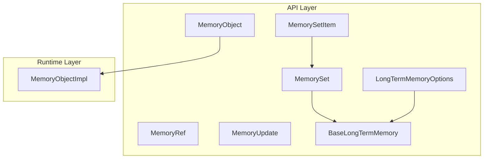
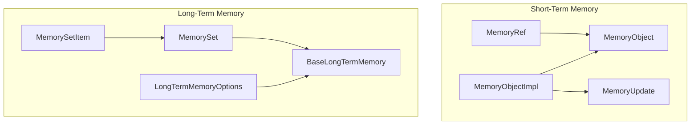
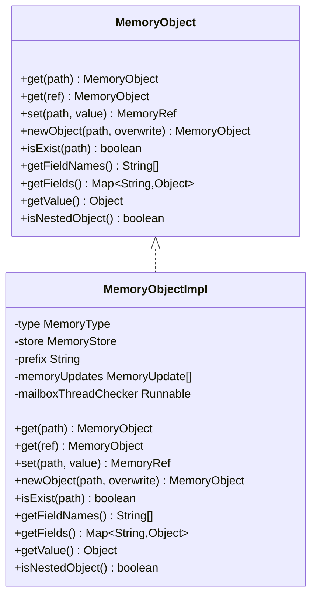
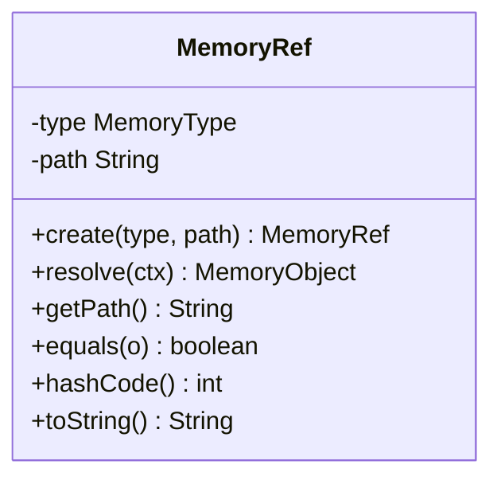
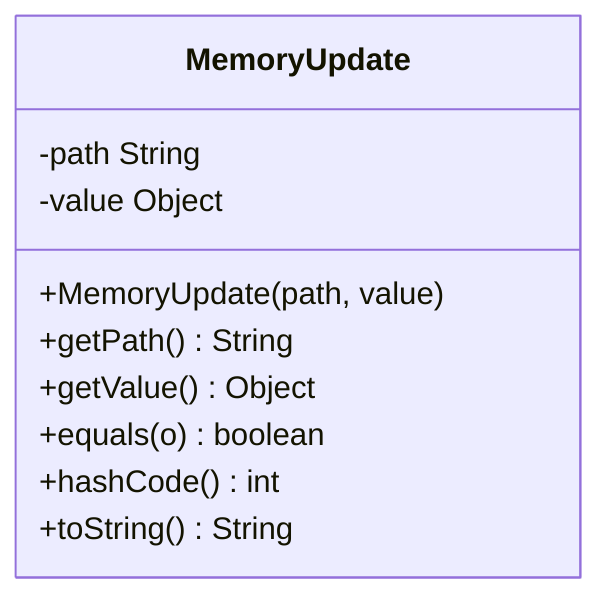
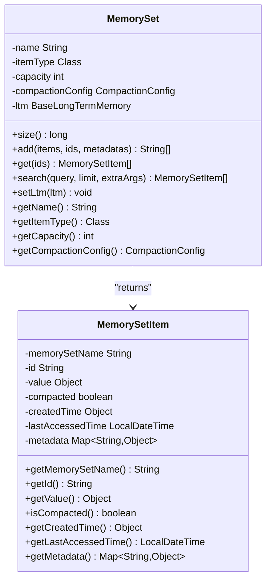
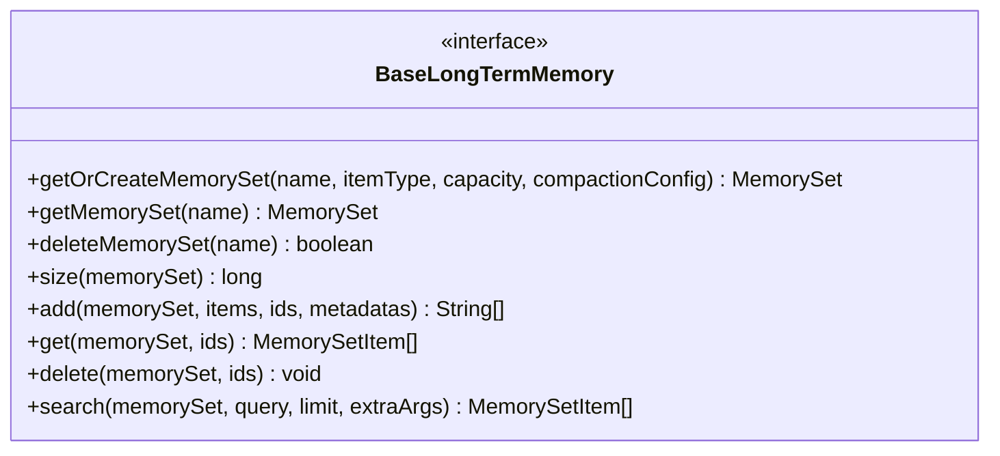
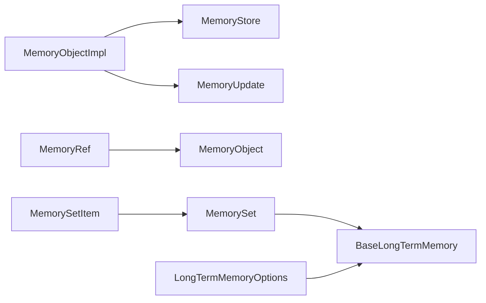
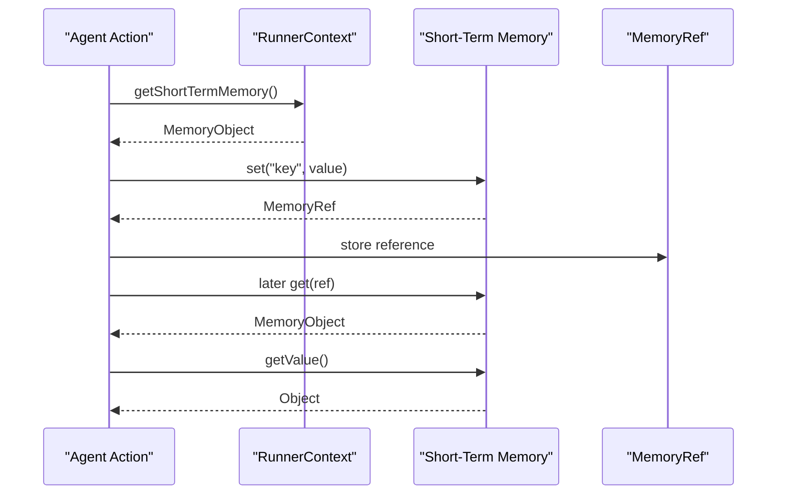
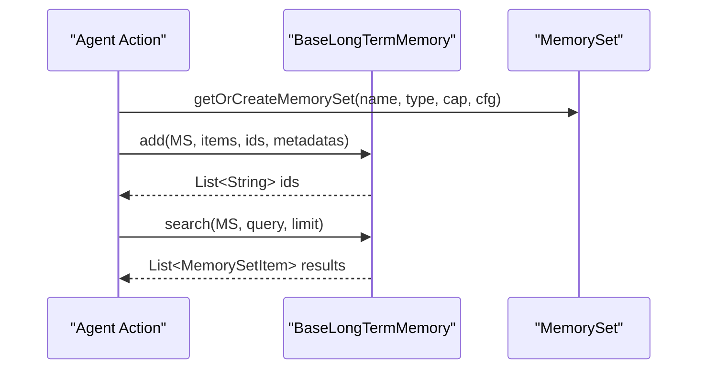

# Memory System API

<cite>
**Referenced Files in This Document**
- [MemoryObject.java](file://api/src/main/java/org/apache/flink/agents/api/context/MemoryObject.java)
- [MemoryRef.java](file://api/src/main/java/org/apache/flink/agents/api/context/MemoryRef.java)
- [MemoryUpdate.java](file://api/src/main/java/org/apache/flink/agents/api/context/MemoryUpdate.java)
- [MemorySet.java](file://api/src/main/java/org/apache/flink/agents/api/memory/MemorySet.java)
- [MemorySetItem.java](file://api/src/main/java/org/apache/flink/agents/api/memory/MemorySetItem.java)
- [BaseLongTermMemory.java](file://api/src/main/java/org/apache/flink/agents/api/memory/BaseLongTermMemory.java)
- [LongTermMemoryOptions.java](file://api/src/main/java/org/apache/flink/agents/api/memory/LongTermMemoryOptions.java)
- [MemoryObjectImpl.java](file://runtime/src/main/java/org/apache/flink/agents/runtime/memory/MemoryObjectImpl.java)
- [MemoryObjectTest.java](file://runtime/src/test/java/org/apache/flink/agents/runtime/memory/MemoryObjectTest.java)
- [MemoryRefTest.java](file://runtime/src/test/java/org/apache/flink/agents/runtime/memory/MemoryRefTest.java)
- [MemorySetTest.java](file://api/src/test/java/org/apache/flink/agents/api/memory/MemorySetTest.java)
- [MemoryObjectAgent.java](file://e2e-test/flink-agents-end-to-end-tests-integration/src/test/java/org/apache/flink/agents/integration/test/MemoryObjectAgent.java)
- [MemoryObjectTest.java](file://e2e-test/flink-agents-end-to-end-tests-integration/src/test/java/org/apache/flink/agents/integration/test/MemoryObjectTest.java)
</cite>

## Table of Contents
1. [Introduction](#introduction)
2. [Project Structure](#project-structure)
3. [Core Components](#core-components)
4. [Architecture Overview](#architecture-overview)
5. [Detailed Component Analysis](#detailed-component-analysis)
6. [Dependency Analysis](#dependency-analysis)
7. [Performance Considerations](#performance-considerations)
8. [Troubleshooting Guide](#troubleshooting-guide)
9. [Conclusion](#conclusion)
10. [Appendices](#appendices)

## Introduction
This document provides comprehensive API documentation for the Flink Agents memory system. It focuses on the in-memory interfaces for hierarchical key-value storage and long-term memory collections, including:
- MemoryObject for CRUD operations and type-safe access
- MemoryRef for lightweight, serializable references
- MemoryUpdate for atomic, serialized updates
- MemorySet for managing collections of memory items with persistence and search
- Long-term memory abstraction and configuration

It also covers memory persistence, retrieval, cleanup, serialization, scope management, lifecycle methods, and thread-safety considerations for concurrent access.

## Project Structure
The memory system spans API interfaces and runtime implementations:
- API layer defines contracts for short-term memory (MemoryObject, MemoryRef, MemoryUpdate) and long-term memory collections (MemorySet, MemorySetItem, BaseLongTermMemory, LongTermMemoryOptions)
- Runtime layer implements MemoryObject and integrates with Flink state backends
- Tests demonstrate usage patterns and verify correctness

**Diagram sources**
- [MemoryObject.java](file://api/src/main/java/org/apache/flink/agents/api/context/MemoryObject.java#L29-L131)
- [MemoryRef.java](file://api/src/main/java/org/apache/flink/agents/api/context/MemoryRef.java#L28-L87)
- [MemoryUpdate.java](file://api/src/main/java/org/apache/flink/agents/api/context/MemoryUpdate.java#L30-L83)
- [MemorySet.java](file://api/src/main/java/org/apache/flink/agents/api/memory/MemorySet.java#L32-L159)
- [MemorySetItem.java](file://api/src/main/java/org/apache/flink/agents/api/memory/MemorySetItem.java#L23-L94)
- [BaseLongTermMemory.java](file://api/src/main/java/org/apache/flink/agents/api/memory/BaseLongTermMemory.java#L33-L133)
- [LongTermMemoryOptions.java](file://api/src/main/java/org/apache/flink/agents/api/memory/LongTermMemoryOptions.java#L22-L52)
- [MemoryObjectImpl.java](file://runtime/src/main/java/org/apache/flink/agents/runtime/memory/MemoryObjectImpl.java#L33-L200)

**Section sources**
- [MemoryObject.java](file://api/src/main/java/org/apache/flink/agents/api/context/MemoryObject.java#L1-L132)
- [MemoryRef.java](file://api/src/main/java/org/apache/flink/agents/api/context/MemoryRef.java#L1-L88)
- [MemoryUpdate.java](file://api/src/main/java/org/apache/flink/agents/api/context/MemoryUpdate.java#L1-L84)
- [MemorySet.java](file://api/src/main/java/org/apache/flink/agents/api/memory/MemorySet.java#L1-L160)
- [MemorySetItem.java](file://api/src/main/java/org/apache/flink/agents/api/memory/MemorySetItem.java#L1-L95)
- [BaseLongTermMemory.java](file://api/src/main/java/org/apache/flink/agents/api/memory/BaseLongTermMemory.java#L1-L134)
- [LongTermMemoryOptions.java](file://api/src/main/java/org/apache/flink/agents/api/memory/LongTermMemoryOptions.java#L1-L53)
- [MemoryObjectImpl.java](file://runtime/src/main/java/org/apache/flink/agents/runtime/memory/MemoryObjectImpl.java#L1-L260)

## Core Components
- MemoryObject: Hierarchical key-value storage with CRUD operations, existence checks, field enumeration, and value/nested-object queries. Supports relative/absolute paths and type safety for primitives vs nested objects.
- MemoryRef: Serializable reference to a specific path in short-term memory, enabling efficient passing of large objects between actions.
- MemoryUpdate: Immutable, JSON-serializable update descriptor carrying an absolute path and a new value for atomic updates.
- MemorySet: Typed collection container with capacity, compaction configuration, and operations for adding, retrieving, searching, and deleting items.
- MemorySetItem: Item wrapper with identity, value, compaction flag, timestamps, and metadata.
- BaseLongTermMemory: Long-term memory backend contract for creating/retrieving/deleting memory sets and performing semantic search.
- LongTermMemoryOptions: Configuration for long-term memory backend selection, external vector store name, async compaction, and thread pool size.

**Section sources**
- [MemoryObject.java](file://api/src/main/java/org/apache/flink/agents/api/context/MemoryObject.java#L29-L131)
- [MemoryRef.java](file://api/src/main/java/org/apache/flink/agents/api/context/MemoryRef.java#L28-L87)
- [MemoryUpdate.java](file://api/src/main/java/org/apache/flink/agents/api/context/MemoryUpdate.java#L30-L83)
- [MemorySet.java](file://api/src/main/java/org/apache/flink/agents/api/memory/MemorySet.java#L32-L159)
- [MemorySetItem.java](file://api/src/main/java/org/apache/flink/agents/api/memory/MemorySetItem.java#L23-L94)
- [BaseLongTermMemory.java](file://api/src/main/java/org/apache/flink/agents/api/memory/BaseLongTermMemory.java#L33-L133)
- [LongTermMemoryOptions.java](file://api/src/main/java/org/apache/flink/agents/api/memory/LongTermMemoryOptions.java#L22-L52)

## Architecture Overview
The memory system separates concerns between short-term in-memory operations and long-term persistence/search:
- Short-term memory: Managed via MemoryObject and MemoryRef, backed by a store and tracked via MemoryUpdate lists for atomicity and replay.
- Long-term memory: Managed via MemorySet and BaseLongTermMemory, with optional compaction and semantic search.

**Diagram sources**
- [MemoryObject.java](file://api/src/main/java/org/apache/flink/agents/api/context/MemoryObject.java#L29-L131)
- [MemoryRef.java](file://api/src/main/java/org/apache/flink/agents/api/context/MemoryRef.java#L28-L87)
- [MemoryUpdate.java](file://api/src/main/java/org/apache/flink/agents/api/context/MemoryUpdate.java#L30-L83)
- [MemoryObjectImpl.java](file://runtime/src/main/java/org/apache/flink/agents/runtime/memory/MemoryObjectImpl.java#L33-L200)
- [MemorySet.java](file://api/src/main/java/org/apache/flink/agents/api/memory/MemorySet.java#L32-L159)
- [MemorySetItem.java](file://api/src/main/java/org/apache/flink/agents/api/memory/MemorySetItem.java#L23-L94)
- [BaseLongTermMemory.java](file://api/src/main/java/org/apache/flink/agents/api/memory/BaseLongTermMemory.java#L33-L133)
- [LongTermMemoryOptions.java](file://api/src/main/java/org/apache/flink/agents/api/memory/LongTermMemoryOptions.java#L22-L52)

## Detailed Component Analysis

### MemoryObject: Hierarchical Key-Value Storage
- Purpose: Access and manipulate nested key-value structures with support for direct primitives and nested objects.
- Key capabilities:
  - Path-based navigation: get(String path), get(MemoryRef)
  - Creation and mutation: set(String path, Object), newObject(String path[, overwrite])
  - Existence and introspection: isExist(String), getFieldNames(), getFields()
  - Type inspection: getValue(), isNestedObject()
- Design notes:
  - Paths are relative to the current MemoryObject; absolute paths are derived internally.
  - Overwriting nested objects with primitives is prevented; overwrite semantics apply to indirect fields.
  - Field names are tracked to enumerate top-level fields efficiently.

**Diagram sources**
- [MemoryObject.java](file://api/src/main/java/org/apache/flink/agents/api/context/MemoryObject.java#L29-L131)
- [MemoryObjectImpl.java](file://runtime/src/main/java/org/apache/flink/agents/runtime/memory/MemoryObjectImpl.java#L33-L200)

**Section sources**
- [MemoryObject.java](file://api/src/main/java/org/apache/flink/agents/api/context/MemoryObject.java#L29-L131)
- [MemoryObjectImpl.java](file://runtime/src/main/java/org/apache/flink/agents/runtime/memory/MemoryObjectImpl.java#L74-L200)
- [MemoryObjectTest.java](file://runtime/src/test/java/org/apache/flink/agents/runtime/memory/MemoryObjectTest.java#L72-L186)

### MemoryRef: Lightweight Memory References
- Purpose: Serializable reference to a specific path in short-term memory, enabling safe cross-action passing without duplicating large objects.
- Key capabilities:
  - Creation: MemoryRef.create(MemoryType, String path)
  - Resolution: resolve(RunnerContext) returns the actual MemoryObject
  - Equality and hashing based on path
- Thread-safety: Immutable reference; resolution delegates to RunnerContext-provided memory instances.

**Diagram sources**
- [MemoryRef.java](file://api/src/main/java/org/apache/flink/agents/api/context/MemoryRef.java#L28-L87)

**Section sources**
- [MemoryRef.java](file://api/src/main/java/org/apache/flink/agents/api/context/MemoryRef.java#L28-L87)
- [MemoryRefTest.java](file://runtime/src/test/java/org/apache/flink/agents/runtime/memory/MemoryRefTest.java#L146-L167)

### MemoryUpdate: Atomic Updates
- Purpose: Encapsulates a single atomic update with an absolute path and value for serialization and replay.
- Key capabilities:
  - Constructor with path and value
  - Getters for path and value
  - Equality and hashing based on both fields
- Serialization: Annotated for Jackson serialization/deserialization.

**Diagram sources**
- [MemoryUpdate.java](file://api/src/main/java/org/apache/flink/agents/api/context/MemoryUpdate.java#L30-L83)

**Section sources**
- [MemoryUpdate.java](file://api/src/main/java/org/apache/flink/agents/api/context/MemoryUpdate.java#L30-L83)
- [MemoryObjectTest.java](file://runtime/src/test/java/org/apache/flink/agents/runtime/memory/MemoryObjectTest.java#L169-L185)

### MemorySet: Managing Collections of Memory Objects
- Purpose: Typed collection container for long-term memory with capacity limits and compaction.
- Key capabilities:
  - Creation and retrieval: getOrCreateMemorySet(name, itemType, capacity, compactionConfig), getMemorySet(name)
  - Management: size(), add(items[, ids][, metadatas]), get([ids]), delete([ids])
  - Search: search(query, limit[, extraArgs])
  - Configuration: name, itemType, capacity, compactionConfig
- Long-term memory integration: Delegates persistence and search to BaseLongTermMemory.

**Diagram sources**
- [MemorySet.java](file://api/src/main/java/org/apache/flink/agents/api/memory/MemorySet.java#L32-L159)
- [MemorySetItem.java](file://api/src/main/java/org/apache/flink/agents/api/memory/MemorySetItem.java#L23-L94)

**Section sources**
- [MemorySet.java](file://api/src/main/java/org/apache/flink/agents/api/memory/MemorySet.java#L32-L159)
- [MemorySetItem.java](file://api/src/main/java/org/apache/flink/agents/api/memory/MemorySetItem.java#L23-L94)
- [MemorySetTest.java](file://api/src/test/java/org/apache/flink/agents/api/memory/MemorySetTest.java#L27-L42)

### BaseLongTermMemory: Long-Term Memory Backend Contract
- Purpose: Abstraction for persistent storage of MemorySet collections with search and compaction.
- Key capabilities:
  - Memory set lifecycle: getOrCreateMemorySet, getMemorySet, deleteMemorySet
  - Item operations: size, add, get, delete, search
- Implementation note: Backends (e.g., vector stores) implement this interface to provide storage and retrieval.

**Diagram sources**
- [BaseLongTermMemory.java](file://api/src/main/java/org/apache/flink/agents/api/memory/BaseLongTermMemory.java#L33-L133)

**Section sources**
- [BaseLongTermMemory.java](file://api/src/main/java/org/apache/flink/agents/api/memory/BaseLongTermMemory.java#L33-L133)

### LongTermMemoryOptions: Configuration
- Purpose: Configure long-term memory backend and async compaction behavior.
- Options:
  - Backend selection
  - External vector store name
  - Async compaction enablement
  - Thread count for async compaction

**Section sources**
- [LongTermMemoryOptions.java](file://api/src/main/java/org/apache/flink/agents/api/memory/LongTermMemoryOptions.java#L22-L52)

## Dependency Analysis
- MemoryObjectImpl depends on MemoryStore for persistence and tracks MemoryUpdate entries for atomicity.
- MemoryRef resolves against RunnerContext-provided memory instances (sensory or short-term).
- MemorySet delegates persistence and search to BaseLongTermMemory.
- Long-term memory backends implement BaseLongTermMemory to support MemorySet operations.

**Diagram sources**
- [MemoryObjectImpl.java](file://runtime/src/main/java/org/apache/flink/agents/runtime/memory/MemoryObjectImpl.java#L33-L200)
- [MemoryRef.java](file://api/src/main/java/org/apache/flink/agents/api/context/MemoryRef.java#L28-L87)
- [MemorySet.java](file://api/src/main/java/org/apache/flink/agents/api/memory/MemorySet.java#L32-L159)
- [BaseLongTermMemory.java](file://api/src/main/java/org/apache/flink/agents/api/memory/BaseLongTermMemory.java#L33-L133)
- [LongTermMemoryOptions.java](file://api/src/main/java/org/apache/flink/agents/api/memory/LongTermMemoryOptions.java#L22-L52)

**Section sources**
- [MemoryObjectImpl.java](file://runtime/src/main/java/org/apache/flink/agents/runtime/memory/MemoryObjectImpl.java#L33-L200)
- [MemoryRef.java](file://api/src/main/java/org/apache/flink/agents/api/context/MemoryRef.java#L28-L87)
- [MemorySet.java](file://api/src/main/java/org/apache/flink/agents/api/memory/MemorySet.java#L32-L159)
- [BaseLongTermMemory.java](file://api/src/main/java/org/apache/flink/agents/api/memory/BaseLongTermMemory.java#L33-L133)
- [LongTermMemoryOptions.java](file://api/src/main/java/org/apache/flink/agents/api/memory/LongTermMemoryOptions.java#L22-L52)

## Performance Considerations
- Short-term memory operations:
  - Path traversal and field enumeration are O(depth) and O(n_fields) respectively.
  - MemoryUpdate batching supports atomic, serialized updates for replay.
- Long-term memory:
  - Capacity-driven compaction reduces storage overhead; async compaction can improve throughput.
  - Semantic search cost scales with collection size and backend indexing.
- Serialization:
  - MemoryRef and MemoryUpdate are designed for efficient serialization; avoid unnecessary deep copies.

[No sources needed since this section provides general guidance]

## Troubleshooting Guide
- Overwrite conflicts:
  - Attempting to set a primitive over an existing nested object raises an error; use newObject with overwrite semantics when appropriate.
- Non-existent paths:
  - get(String path) returns null for missing paths; use isExist(String path) to guard access.
- Reference resolution:
  - Ensure the correct MemoryType is used when creating MemoryRef; mismatched types cause resolution failures.
- Long-term memory:
  - Verify BaseLongTermMemory backend availability and configuration; confirm compaction settings align with workload.

**Section sources**
- [MemoryObjectImpl.java](file://runtime/src/main/java/org/apache/flink/agents/runtime/memory/MemoryObjectImpl.java#L104-L106)
- [MemoryRef.java](file://api/src/main/java/org/apache/flink/agents/api/context/MemoryRef.java#L56-L64)
- [MemorySet.java](file://api/src/main/java/org/apache/flink/agents/api/memory/MemorySet.java#L73-L92)

## Conclusion
The Flink Agents memory system provides a robust, type-safe, and serializable foundation for both short-term and long-term memory. MemoryObject enables hierarchical CRUD operations with strong typing, MemoryRef offers lightweight references, and MemoryUpdate ensures atomic updates. MemorySet and BaseLongTermMemory deliver scalable persistence, search, and compaction for long-term collections. Together, these components support reliable, concurrent, and efficient memory management across Flink streaming agents.

[No sources needed since this section summarizes without analyzing specific files]

## Appendices

### API Workflows

#### Creating and Updating Memory Objects

**Diagram sources**
- [MemoryObject.java](file://api/src/main/java/org/apache/flink/agents/api/context/MemoryObject.java#L44-L66)
- [MemoryRef.java](file://api/src/main/java/org/apache/flink/agents/api/context/MemoryRef.java#L56-L64)
- [MemoryObjectImpl.java](file://runtime/src/main/java/org/apache/flink/agents/runtime/memory/MemoryObjectImpl.java#L89-L113)

#### Adding Items to a MemorySet

**Diagram sources**
- [BaseLongTermMemory.java](file://api/src/main/java/org/apache/flink/agents/api/memory/BaseLongTermMemory.java#L45-L94)
- [MemorySet.java](file://api/src/main/java/org/apache/flink/agents/api/memory/MemorySet.java#L73-L108)

### Examples and Usage Patterns
- End-to-end test demonstrates storing and retrieving complex structures in a keyed Flink stream, validating memory isolation per key.
- Runtime tests illustrate MemoryObject CRUD, existence checks, and MemoryUpdate capture sequences.
- MemoryRef tests show reference creation and resolution for primitives, lists, and maps.

**Section sources**
- [MemoryObjectAgent.java](file://e2e-test/flink-agents-end-to-end-tests-integration/src/test/java/org/apache/flink/agents/integration/test/MemoryObjectAgent.java)
- [MemoryObjectTest.java](file://e2e-test/flink-agents-end-to-end-tests-integration/src/test/java/org/apache/flink/agents/integration/test/MemoryObjectTest.java#L34-L70)
- [MemoryObjectTest.java](file://runtime/src/test/java/org/apache/flink/agents/runtime/memory/MemoryObjectTest.java#L72-L186)
- [MemoryRefTest.java](file://runtime/src/test/java/org/apache/flink/agents/runtime/memory/MemoryRefTest.java#L146-L167)