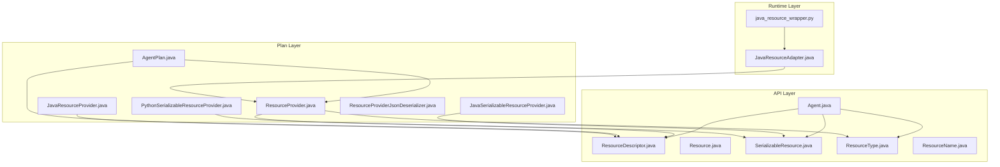
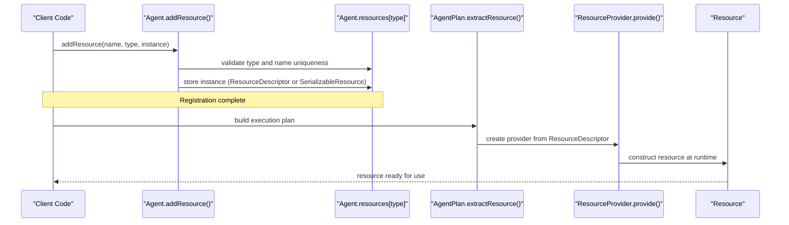
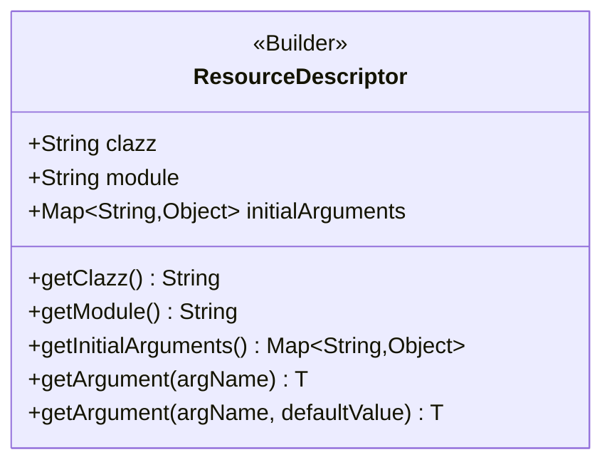
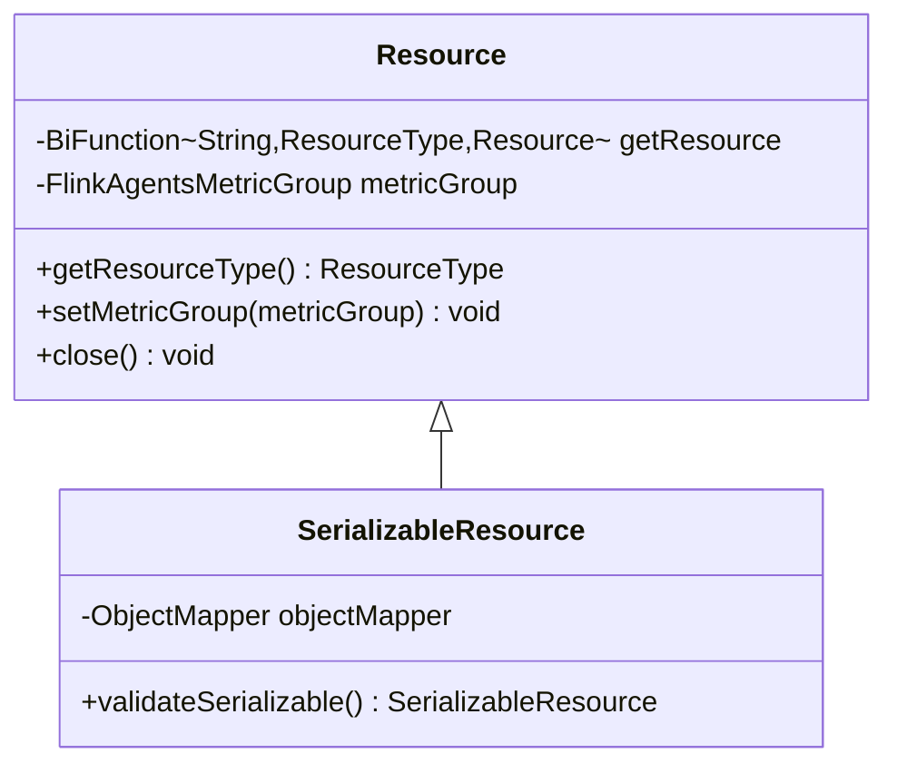
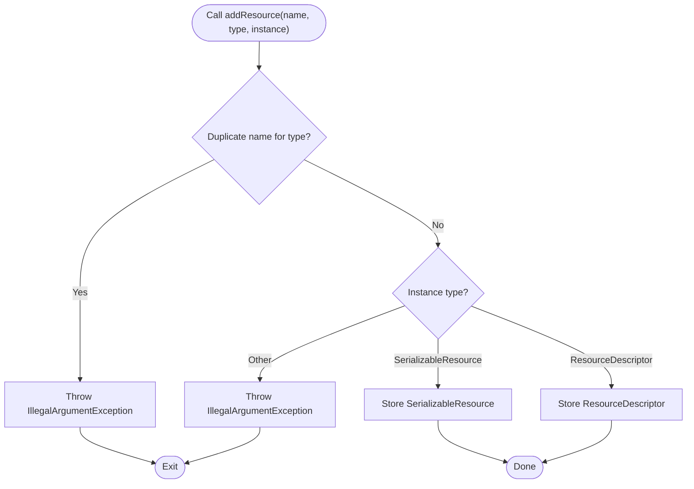
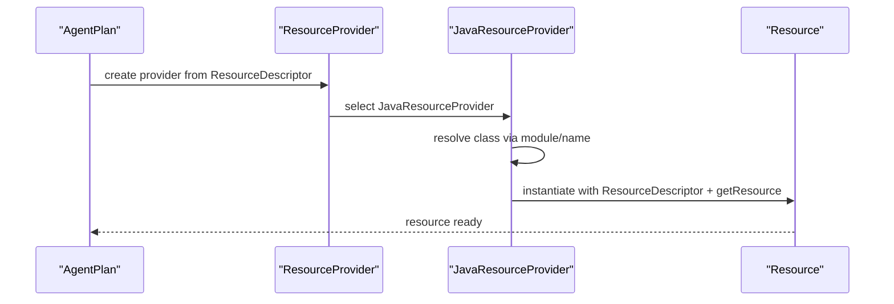
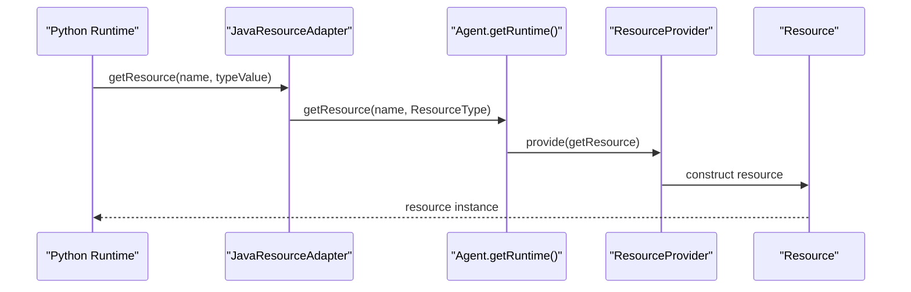
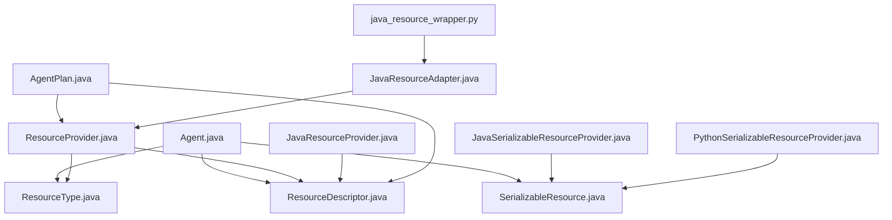

# Resource Management API

<cite>
**Referenced Files in This Document**
- [ResourceDescriptor.java](file://api/src/main/java/org/apache/flink/agents/api/resource/ResourceDescriptor.java)
- [Resource.java](file://api/src/main/java/org/apache/flink/agents/api/resource/Resource.java)
- [SerializableResource.java](file://api/src/main/java/org/apache/flink/agents/api/resource/SerializableResource.java)
- [ResourceType.java](file://api/src/main/java/org/apache/flink/agents/api/resource/ResourceType.java)
- [ResourceName.java](file://api/src/main/java/org/apache/flink/agents/api/resource/ResourceName.java)
- [Agent.java](file://api/src/main/java/org/apache/flink/agents/api/agents/Agent.java)
- [ResourceProvider.java](file://plan/src/main/java/org/apache/flink/agents/plan/resourceprovider/ResourceProvider.java)
- [JavaResourceProvider.java](file://plan/src/main/java/org/apache/flink/agents/plan/resourceprovider/JavaResourceProvider.java)
- [JavaSerializableResourceProvider.java](file://plan/src/main/java/org/apache/flink/agents/plan/resourceprovider/JavaSerializableResourceProvider.java)
- [PythonSerializableResourceProvider.java](file://plan/src/main/java/org/apache/flink/agents/plan/resourceprovider/PythonSerializableResourceProvider.java)
- [ResourceProviderJsonDeserializer.java](file://plan/src/main/java/org/apache/flink/agents/plan/serializer/ResourceProviderJsonDeserializer.java)
- [AgentPlan.java](file://plan/src/main/java/org/apache/flink/agents/plan/AgentPlan.java)
- [ResourceDescriptorTest.java](file://api/src/test/java/org/apache/flink/agents/api/resource/ResourceDescriptorTest.java)
- [CustomTypesAndResources.java](file://examples/src/main/java/org/apache/flink/agents/examples/agents/CustomTypesAndResources.java)
- [JavaResourceAdapter.java](file://runtime/src/main/java/org/apache/flink/agents/runtime/python/utils/JavaResourceAdapter.java)
- [java_resource_wrapper.py](file://python/flink_agents/runtime/java/java_resource_wrapper.py)
</cite>

## Table of Contents
1. [Introduction](#introduction)
2. [Project Structure](#project-structure)
3. [Core Components](#core-components)
4. [Architecture Overview](#architecture-overview)
5. [Detailed Component Analysis](#detailed-component-analysis)
6. [Dependency Analysis](#dependency-analysis)
7. [Performance Considerations](#performance-considerations)
8. [Troubleshooting Guide](#troubleshooting-guide)
9. [Conclusion](#conclusion)
10. [Appendices](#appendices)

## Introduction
This document provides detailed API documentation for the Flink Agents resource management system. It focuses on how resources are configured, described, registered, and resolved across Java and Python environments. Covered topics include:
- ResourceDescriptor for resource configuration and metadata
- Resource and SerializableResource for resource abstraction and serialization
- ResourceType enumeration and resource registration mechanisms
- addResource() method with parameter validation and type checking
- Examples of registering different resource types (chat models, tools, vector stores)
- Resource lifecycle, dependency resolution, and cross-language resource sharing patterns
- Error handling for unsupported resource types and duplicate resource names

## Project Structure
The resource management system spans several modules:
- api: Public API for resource definitions and agent registration
- plan: Serialization/deserialization and runtime resource provisioning
- runtime: Interoperability between Java and Python
- examples: Practical examples of resource registration and usage
- python: Python-side bindings and wrappers

**Diagram sources**
- [Agent.java](file://api/src/main/java/org/apache/flink/agents/api/agents/Agent.java#L33-L131)
- [ResourceDescriptor.java](file://api/src/main/java/org/apache/flink/agents/api/resource/ResourceDescriptor.java#L28-L144)
- [Resource.java](file://api/src/main/java/org/apache/flink/agents/api/resource/Resource.java#L25-L71)
- [SerializableResource.java](file://api/src/main/java/org/apache/flink/agents/api/resource/SerializableResource.java#L25-L50)
- [ResourceType.java](file://api/src/main/java/org/apache/flink/agents/api/resource/ResourceType.java#L21-L62)
- [ResourceName.java](file://api/src/main/java/org/apache/flink/agents/api/resource/ResourceName.java#L21-L185)
- [ResourceProvider.java](file://plan/src/main/java/org/apache/flink/agents/plan/resourceprovider/ResourceProvider.java#L30-L76)
- [JavaResourceProvider.java](file://plan/src/main/java/org/apache/flink/agents/plan/resourceprovider/JavaResourceProvider.java#L28-L56)
- [JavaSerializableResourceProvider.java](file://plan/src/main/java/org/apache/flink/agents/plan/resourceprovider/JavaSerializableResourceProvider.java#L30-L95)
- [PythonSerializableResourceProvider.java](file://plan/src/main/java/org/apache/flink/agents/plan/resourceprovider/PythonSerializableResourceProvider.java#L31-L68)
- [ResourceProviderJsonDeserializer.java](file://plan/src/main/java/org/apache/flink/agents/plan/serializer/ResourceProviderJsonDeserializer.java#L102-L124)
- [AgentPlan.java](file://plan/src/main/java/org/apache/flink/agents/plan/AgentPlan.java#L362-L559)
- [JavaResourceAdapter.java](file://runtime/src/main/java/org/apache/flink/agents/runtime/python/utils/JavaResourceAdapter.java#L33-L56)
- [java_resource_wrapper.py](file://python/flink_agents/runtime/java/java_resource_wrapper.py#L69-L79)

**Section sources**
- [Agent.java](file://api/src/main/java/org/apache/flink/agents/api/agents/Agent.java#L33-L131)
- [ResourceDescriptor.java](file://api/src/main/java/org/apache/flink/agents/api/resource/ResourceDescriptor.java#L28-L144)
- [ResourceProvider.java](file://plan/src/main/java/org/apache/flink/agents/plan/resourceprovider/ResourceProvider.java#L30-L76)

## Core Components
- ResourceDescriptor: Encapsulates resource class/module and initial arguments for cross-language compatibility.
- Resource: Base abstract class for all resources with lifecycle and metrics support.
- SerializableResource: Extends Resource to ensure JSON serialization capability.
- ResourceType: Enumerates supported resource types.
- ResourceName: Provides hierarchical class names for Java/Python resource implementations.
- Agent.addResource(): Registers resources with validation and deduplication checks.

**Section sources**
- [ResourceDescriptor.java](file://api/src/main/java/org/apache/flink/agents/api/resource/ResourceDescriptor.java#L28-L144)
- [Resource.java](file://api/src/main/java/org/apache/flink/agents/api/resource/Resource.java#L25-L71)
- [SerializableResource.java](file://api/src/main/java/org/apache/flink/agents/api/resource/SerializableResource.java#L25-L50)
- [ResourceType.java](file://api/src/main/java/org/apache/flink/agents/api/resource/ResourceType.java#L21-L62)
- [ResourceName.java](file://api/src/main/java/org/apache/flink/agents/api/resource/ResourceName.java#L21-L185)
- [Agent.java](file://api/src/main/java/org/apache/flink/agents/api/agents/Agent.java#L90-L111)

## Architecture Overview
The resource management architecture separates concerns across layers:
- API layer defines resource abstractions and registration APIs
- Plan layer handles serialization/deserialization and runtime provisioning
- Runtime layer enables cross-language interoperability

**Diagram sources**
- [Agent.java](file://api/src/main/java/org/apache/flink/agents/api/agents/Agent.java#L90-L111)
- [AgentPlan.java](file://plan/src/main/java/org/apache/flink/agents/plan/AgentPlan.java#L362-L388)
- [JavaResourceProvider.java](file://plan/src/main/java/org/apache/flink/agents/plan/resourceprovider/JavaResourceProvider.java#L37-L51)
- [ResourceProvider.java](file://plan/src/main/java/org/apache/flink/agents/plan/resourceprovider/ResourceProvider.java#L66-L74)

## Detailed Component Analysis

### ResourceDescriptor
ResourceDescriptor describes a resource’s class identity and initial arguments. It supports:
- Cross-language compatibility: Java class names vs Python simple class names with module paths
- Initial arguments map for flexible configuration
- Builder pattern for fluent construction
- Jackson-annotated fields for JSON serialization/deserialization

Key behaviors:
- Constructors accept module/class and initial arguments
- Accessors for clazz, module, and initialArguments
- Utility methods to retrieve typed arguments with defaults
- Builder for constructing descriptors programmatically

**Diagram sources**
- [ResourceDescriptor.java](file://api/src/main/java/org/apache/flink/agents/api/resource/ResourceDescriptor.java#L28-L144)

**Section sources**
- [ResourceDescriptor.java](file://api/src/main/java/org/apache/flink/agents/api/resource/ResourceDescriptor.java#L43-L98)
- [ResourceDescriptorTest.java](file://api/src/test/java/org/apache/flink/agents/api/resource/ResourceDescriptorTest.java#L32-L53)

### Resource and SerializableResource
Resource defines the base contract for all resources:
- getResourceType(): identifies the resource type
- setMetricGroup()/getMetricGroup(): metrics binding
- close(): resource lifecycle hook

SerializableResource extends Resource and adds:
- validateSerializable(): ensures the resource is JSON serializable

**Diagram sources**
- [Resource.java](file://api/src/main/java/org/apache/flink/agents/api/resource/Resource.java#L25-L71)
- [SerializableResource.java](file://api/src/main/java/org/apache/flink/agents/api/resource/SerializableResource.java#L25-L50)

**Section sources**
- [Resource.java](file://api/src/main/java/org/apache/flink/agents/api/resource/Resource.java#L25-L71)
- [SerializableResource.java](file://api/src/main/java/org/apache/flink/agents/api/resource/SerializableResource.java#L25-L49)

### ResourceType
ResourceType enumerates supported resource categories:
- chat_model, chat_model_connection, embedding_model, embedding_model_connection
- vector_store, prompt, tool, mcp_server

Includes:
- getValue(): string representation
- fromValue(value): reverse lookup with IllegalArgumentException for unknown values

**Section sources**
- [ResourceType.java](file://api/src/main/java/org/apache/flink/agents/api/resource/ResourceType.java#L21-L62)

### ResourceName
ResourceName provides hierarchical class names for resource implementations:
- Java implementations use fully qualified class names
- Python implementations use Python module paths
- Nested classes organize by resource category (ChatModel, EmbeddingModel, VectorStore)
- MCP server uses a special marker for runtime resolution

**Section sources**
- [ResourceName.java](file://api/src/main/java/org/apache/flink/agents/api/resource/ResourceName.java#L21-L185)

### Resource Registration and Validation (Agent.addResource)
Agent.addResource validates and registers resources:
- Enforces uniqueness per ResourceType and name
- Accepts SerializableResource or ResourceDescriptor
- Throws IllegalArgumentException for unsupported types
- Stores resources in a type-indexed map

**Diagram sources**
- [Agent.java](file://api/src/main/java/org/apache/flink/agents/api/agents/Agent.java#L96-L111)

**Section sources**
- [Agent.java](file://api/src/main/java/org/apache/flink/agents/api/agents/Agent.java#L90-L111)

### Resource Lifecycle and Dependency Resolution
Lifecycle and resolution are orchestrated by AgentPlan and ResourceProvider:
- AgentPlan.extractResource builds ResourceProvider instances from ResourceDescriptor
- JavaResourceProvider constructs resources via reflection using ResourceDescriptor and a getResource helper
- JavaSerializableResourceProvider stores serialized forms for transport and deserializes at runtime
- PythonSerializableResourceProvider carries serialized Python objects for cross-language scenarios

**Diagram sources**
- [AgentPlan.java](file://plan/src/main/java/org/apache/flink/agents/plan/AgentPlan.java#L362-L388)
- [JavaResourceProvider.java](file://plan/src/main/java/org/apache/flink/agents/plan/resourceprovider/JavaResourceProvider.java#L37-L51)
- [ResourceProvider.java](file://plan/src/main/java/org/apache/flink/agents/plan/resourceprovider/ResourceProvider.java#L66-L74)

**Section sources**
- [AgentPlan.java](file://plan/src/main/java/org/apache/flink/agents/plan/AgentPlan.java#L362-L559)
- [JavaResourceProvider.java](file://plan/src/main/java/org/apache/flink/agents/plan/resourceprovider/JavaResourceProvider.java#L37-L51)
- [JavaSerializableResourceProvider.java](file://plan/src/main/java/org/apache/flink/agents/plan/resourceprovider/JavaSerializableResourceProvider.java#L64-L95)
- [PythonSerializableResourceProvider.java](file://plan/src/main/java/org/apache/flink/agents/plan/resourceprovider/PythonSerializableResourceProvider.java#L31-L68)

### Cross-Language Resource Sharing Patterns
Cross-language sharing leverages:
- ResourceDescriptor with module/class separation for Python resources
- JavaResourceAdapter and Python wrapper to bridge getResource calls
- ResourceProviderJsonDeserializer to reconstruct providers from serialized forms

**Diagram sources**
- [JavaResourceAdapter.java](file://runtime/src/main/java/org/apache/flink/agents/runtime/python/utils/JavaResourceAdapter.java#L45-L56)
- [java_resource_wrapper.py](file://python/flink_agents/runtime/java/java_resource_wrapper.py#L77-L79)
- [ResourceProviderJsonDeserializer.java](file://plan/src/main/java/org/apache/flink/agents/plan/serializer/ResourceProviderJsonDeserializer.java#L102-L124)

**Section sources**
- [JavaResourceAdapter.java](file://runtime/src/main/java/org/apache/flink/agents/runtime/python/utils/JavaResourceAdapter.java#L33-L56)
- [java_resource_wrapper.py](file://python/flink_agents/runtime/java/java_resource_wrapper.py#L69-L79)
- [ResourceProviderJsonDeserializer.java](file://plan/src/main/java/org/apache/flink/agents/plan/serializer/ResourceProviderJsonDeserializer.java#L102-L124)

### Examples: Registering Different Resource Types
Examples demonstrate registering chat models, tools, and vector stores:
- Chat model connection and setup using ResourceName constants and ResourceDescriptor.Builder
- Tools and prompts as SerializableResource instances
- Vector stores via ResourceDescriptor

See:
- [CustomTypesAndResources.java](file://examples/src/main/java/org/apache/flink/agents/examples/agents/CustomTypesAndResources.java#L112-L117)

**Section sources**
- [CustomTypesAndResources.java](file://examples/src/main/java/org/apache/flink/agents/examples/agents/CustomTypesAndResources.java#L112-L117)

## Dependency Analysis
Resource dependencies span API, plan, and runtime layers:
- Agent depends on ResourceType and ResourceDescriptor
- ResourceProvider depends on Resource and ResourceType
- JavaResourceProvider depends on ResourceDescriptor and reflection
- JavaSerializableResourceProvider depends on ObjectMapper and serialization
- Runtime adapters depend on cross-language bridges

**Diagram sources**
- [Agent.java](file://api/src/main/java/org/apache/flink/agents/api/agents/Agent.java#L21-L32)
- [ResourceProvider.java](file://plan/src/main/java/org/apache/flink/agents/plan/resourceprovider/ResourceProvider.java#L21-L28)
- [JavaResourceProvider.java](file://plan/src/main/java/org/apache/flink/agents/plan/resourceprovider/JavaResourceProvider.java#L21-L26)
- [JavaSerializableResourceProvider.java](file://plan/src/main/java/org/apache/flink/agents/plan/resourceprovider/JavaSerializableResourceProvider.java#L28-L40)
- [PythonSerializableResourceProvider.java](file://plan/src/main/java/org/apache/flink/agents/plan/resourceprovider/PythonSerializableResourceProvider.java#L27-L39)
- [AgentPlan.java](file://plan/src/main/java/org/apache/flink/agents/plan/AgentPlan.java#L362-L388)
- [JavaResourceAdapter.java](file://runtime/src/main/java/org/apache/flink/agents/runtime/python/utils/JavaResourceAdapter.java#L33-L43)
- [java_resource_wrapper.py](file://python/flink_agents/runtime/java/java_resource_wrapper.py#L69-L79)

**Section sources**
- [Agent.java](file://api/src/main/java/org/apache/flink/agents/api/agents/Agent.java#L21-L32)
- [ResourceProvider.java](file://plan/src/main/java/org/apache/flink/agents/plan/resourceprovider/ResourceProvider.java#L21-L28)
- [JavaResourceProvider.java](file://plan/src/main/java/org/apache/flink/agents/plan/resourceprovider/JavaResourceProvider.java#L21-L26)
- [JavaSerializableResourceProvider.java](file://plan/src/main/java/org/apache/flink/agents/plan/resourceprovider/JavaSerializableResourceProvider.java#L28-L40)
- [PythonSerializableResourceProvider.java](file://plan/src/main/java/org/apache/flink/agents/plan/resourceprovider/PythonSerializableResourceProvider.java#L27-L39)
- [AgentPlan.java](file://plan/src/main/java/org/apache/flink/agents/plan/AgentPlan.java#L362-L388)
- [JavaResourceAdapter.java](file://runtime/src/main/java/org/apache/flink/agents/runtime/python/utils/JavaResourceAdapter.java#L33-L43)
- [java_resource_wrapper.py](file://python/flink_agents/runtime/java/java_resource_wrapper.py#L69-L79)

## Performance Considerations
- Serialization overhead: JavaSerializableResourceProvider stores serialized forms; validateSerializable() ensures early failure if serialization is not feasible
- Reflection costs: JavaResourceProvider uses reflection to load classes; cache class references where appropriate
- Cross-language bridging: JavaResourceAdapter introduces overhead; minimize frequent getResource calls
- Argument maps: ResourceDescriptor initialArguments should avoid large or deeply nested structures to reduce serialization cost

[No sources needed since this section provides general guidance]

## Troubleshooting Guide
Common errors and resolutions:
- Duplicate resource name: addResource throws IllegalArgumentException when a name/type pair is duplicated
- Unsupported resource type: addResource rejects instances that are neither SerializableResource nor ResourceDescriptor
- Unknown ResourceType value: fromValue throws IllegalArgumentException for unrecognized string values
- Serialization failures: validateSerializable() throws IllegalArgumentException if the resource cannot be serialized
- Cross-language resolution: ensure module/class names are correct and accessible in the target runtime

**Section sources**
- [Agent.java](file://api/src/main/java/org/apache/flink/agents/api/agents/Agent.java#L96-L111)
- [ResourceType.java](file://api/src/main/java/org/apache/flink/agents/api/resource/ResourceType.java#L46-L60)
- [SerializableResource.java](file://api/src/main/java/org/apache/flink/agents/api/resource/SerializableResource.java#L34-L48)

## Conclusion
The Flink Agents resource management system provides a robust, extensible framework for defining, registering, and resolving resources across Java and Python environments. ResourceDescriptor encapsulates configuration and cross-language metadata, while Resource and SerializableResource define the abstraction and serialization guarantees. ResourceType and ResourceName standardize categorization and implementation discovery. Agent.addResource enforces validation and deduplication, and the plan/runtime layers orchestrate lifecycle and cross-language sharing.

## Appendices

### API Reference: addResource()
- Purpose: Register a resource with an agent
- Parameters:
  - name: Unique resource name within the agent and type
  - type: ResourceType indicating the category
  - instance: Either a SerializableResource or a ResourceDescriptor
- Validation:
  - Duplicate name/type pair: throws IllegalArgumentException
  - Unsupported instance type: throws IllegalArgumentException
- Returns: The agent instance for chaining

**Section sources**
- [Agent.java](file://api/src/main/java/org/apache/flink/agents/api/agents/Agent.java#L90-L111)