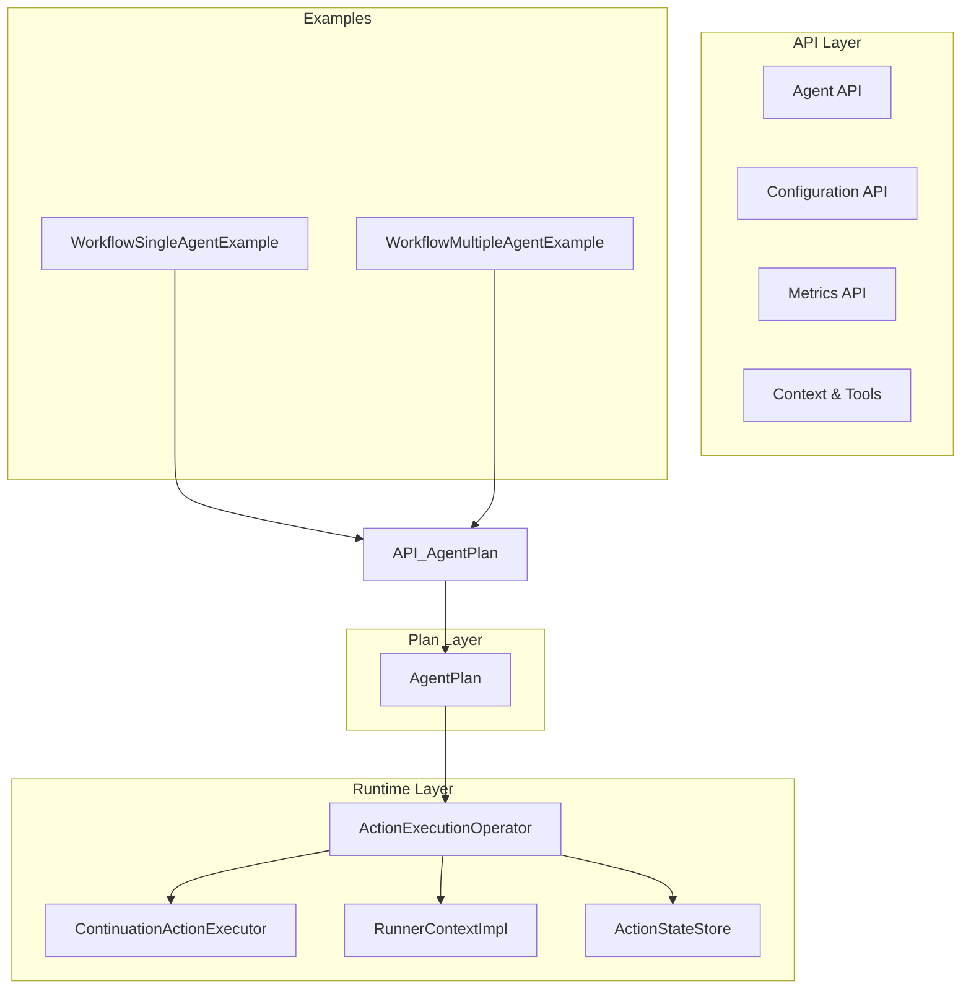
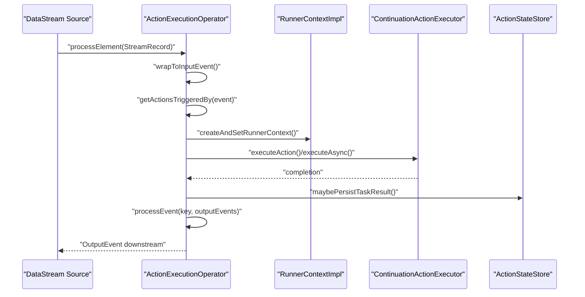
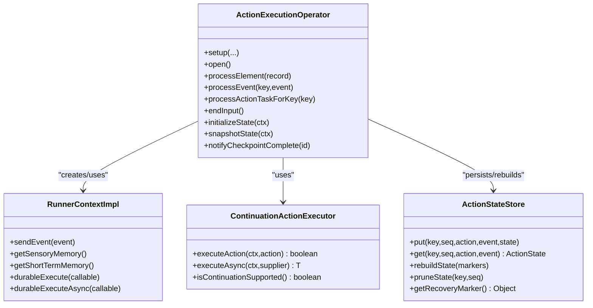
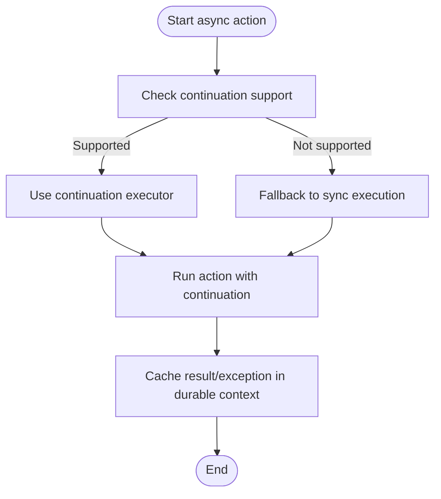
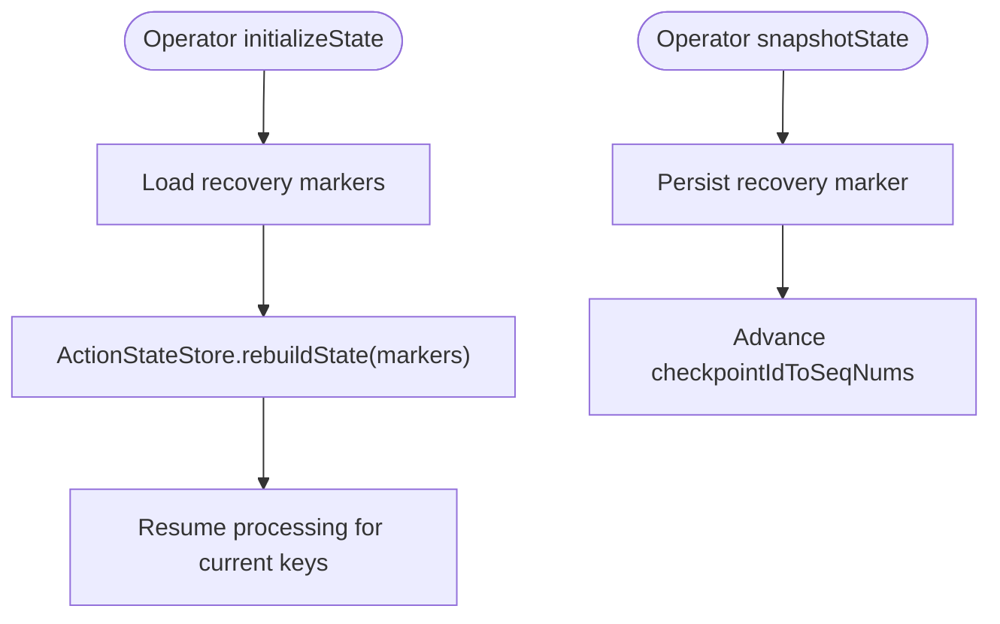
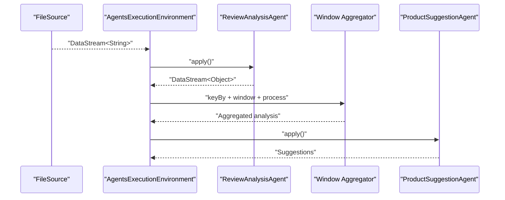
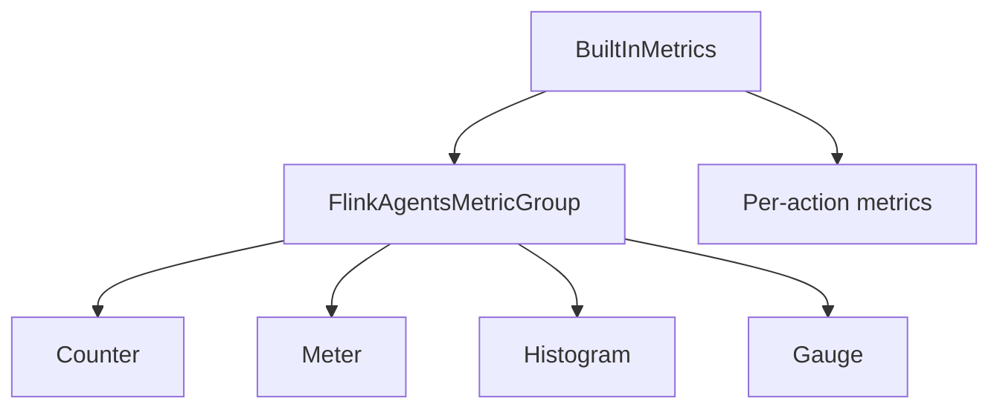
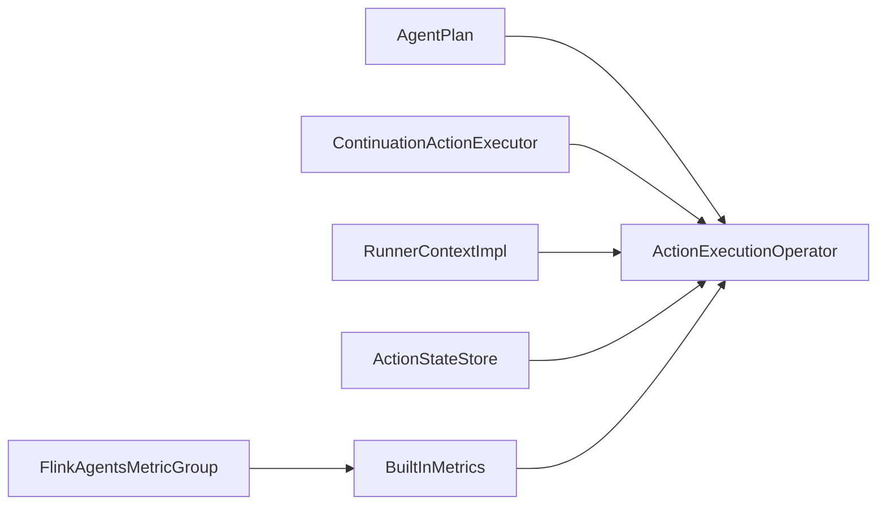

# Advanced Features

<cite>
**Referenced Files in This Document**
- [ActionExecutionOperator.java](file://runtime/src/main/java/org/apache/flink/agents/runtime/operator/ActionExecutionOperator.java)
- [ContinuationActionExecutor.java](file://runtime/src/main/java/org/apache/flink/agents/runtime/async/ContinuationActionExecutor.java)
- [DurableCallable.java](file://api/src/main/java/org/apache/flink/agents/api/context/DurableCallable.java)
- [RunnerContextImpl.java](file://runtime/src/main/java/org/apache/flink/agents/runtime/context/RunnerContextImpl.java)
- [AgentPlan.java](file://plan/src/main/java/org/apache/flink/agents/plan/AgentPlan.java)
- [ActionStateStore.java](file://runtime/src/main/java/org/apache/flink/agents/runtime/actionstate/ActionStateStore.java)
- [FlinkAgentsMetricGroup.java](file://api/src/main/java/org/apache/flink/agents/api/metrics/FlinkAgentsMetricGroup.java)
- [BuiltInMetrics.java](file://runtime/src/main/java/org/apache/flink/agents/runtime/metrics/BuiltInMetrics.java)
- [WorkflowMultipleAgentExample.java](file://examples/src/main/java/org/apache/flink/agents/examples/WorkflowMultipleAgentExample.java)
- [WorkflowSingleAgentExample.java](file://examples/src/main/java/org/apache/flink/agents/examples/WorkflowSingleAgentExample.java)
- [ActionExecutionOperatorTest.java](file://runtime/src/test/java/org/apache/flink/agents/runtime/operator/ActionExecutionOperatorTest.java)
</cite>

## Table of Contents
1. [Introduction](#introduction)
2. [Project Structure](#project-structure)
3. [Core Components](#core-components)
4. [Architecture Overview](#architecture-overview)
5. [Detailed Component Analysis](#detailed-component-analysis)
6. [Dependency Analysis](#dependency-analysis)
7. [Performance Considerations](#performance-considerations)
8. [Troubleshooting Guide](#troubleshooting-guide)
9. [Conclusion](#conclusion)
10. [Appendices](#appendices)

## Introduction
This document explains advanced features in Flink Agents with a focus on multi-agent workflow orchestration, asynchronous execution patterns, and fault tolerance mechanisms. It details the ActionExecutionOperator internals, continuation-based execution, and state management. It also covers performance optimization, scaling strategies, production deployment considerations, metrics and monitoring, advanced configuration, custom operator development, and integration with Flink’s advanced streaming features. Guidance is provided for debugging complex agent interactions, performance profiling, and troubleshooting production issues, alongside extending the framework with custom operators and components.

## Project Structure
Flink Agents is organized into layered modules:
- api: Public APIs for agents, configuration, memory, tools, and metrics.
- plan: Serialization and compilation of agent plans from annotated agents.
- runtime: Streaming operator implementation, async executors, context, and state management.
- examples: End-to-end workflow examples demonstrating multi-agent pipelines.
- integrations: Optional connectors for chat models, embeddings, vector stores, and MCP.
- python: Python bindings and runtime integration for cross-language resources and execution.

**Diagram sources**
- [ActionExecutionOperator.java](file://runtime/src/main/java/org/apache/flink/agents/runtime/operator/ActionExecutionOperator.java#L118-L236)
- [ContinuationActionExecutor.java](file://runtime/src/main/java/org/apache/flink/agents/runtime/async/ContinuationActionExecutor.java#L28-L68)
- [RunnerContextImpl.java](file://runtime/src/main/java/org/apache/flink/agents/runtime/context/RunnerContextImpl.java#L60-L133)
- [ActionStateStore.java](file://runtime/src/main/java/org/apache/flink/agents/runtime/actionstate/ActionStateStore.java#L27-L92)
- [AgentPlan.java](file://plan/src/main/java/org/apache/flink/agents/plan/AgentPlan.java#L73-L141)
- [WorkflowSingleAgentExample.java](file://examples/src/main/java/org/apache/flink/agents/examples/WorkflowSingleAgentExample.java#L52-L92)
- [WorkflowMultipleAgentExample.java](file://examples/src/main/java/org/apache/flink/agents/examples/WorkflowMultipleAgentExample.java#L126-L188)

**Section sources**
- [ActionExecutionOperator.java](file://runtime/src/main/java/org/apache/flink/agents/runtime/operator/ActionExecutionOperator.java#L118-L236)
- [AgentPlan.java](file://plan/src/main/java/org/apache/flink/agents/plan/AgentPlan.java#L73-L141)
- [WorkflowSingleAgentExample.java](file://examples/src/main/java/org/apache/flink/agents/examples/WorkflowSingleAgentExample.java#L52-L92)
- [WorkflowMultipleAgentExample.java](file://examples/src/main/java/org/apache/flink/agents/examples/WorkflowMultipleAgentExample.java#L126-L188)

## Core Components
- ActionExecutionOperator: The streaming operator orchestrating agent actions, event routing, async execution, and state persistence. It maintains keyed state for action tasks, pending input events, and sequence numbers, and coordinates durable execution and recovery.
- ContinuationActionExecutor: Provides asynchronous execution abstraction. On JDK 11, it falls back to synchronous execution; on JDK 21+, it leverages continuations for true async.
- RunnerContextImpl: Execution context for actions, exposing memory, resources, metrics, and durable execution helpers. Manages memory updates, event emission, and durable call caching/recovery.
- AgentPlan: Compiles agent annotations into executable plans, wiring actions, resources, and configuration.
- ActionStateStore: Backend-agnostic interface for persisting and retrieving action execution state for recovery and replay.
- Metrics: Built-in metrics for events and actions, plus extensible metric groups for custom instrumentation.

**Section sources**
- [ActionExecutionOperator.java](file://runtime/src/main/java/org/apache/flink/agents/runtime/operator/ActionExecutionOperator.java#L217-L329)
- [ContinuationActionExecutor.java](file://runtime/src/main/java/org/apache/flink/agents/runtime/async/ContinuationActionExecutor.java#L28-L68)
- [RunnerContextImpl.java](file://runtime/src/main/java/org/apache/flink/agents/runtime/context/RunnerContextImpl.java#L60-L133)
- [AgentPlan.java](file://plan/src/main/java/org/apache/flink/agents/plan/AgentPlan.java#L73-L141)
- [ActionStateStore.java](file://runtime/src/main/java/org/apache/flink/agents/runtime/actionstate/ActionStateStore.java#L27-L92)
- [FlinkAgentsMetricGroup.java](file://api/src/main/java/org/apache/flink/agents/api/metrics/FlinkAgentsMetricGroup.java#L30-L92)
- [BuiltInMetrics.java](file://runtime/src/main/java/org/apache/flink/agents/runtime/metrics/BuiltInMetrics.java#L34-L72)

## Architecture Overview
The operator-driven architecture integrates Flink’s streaming runtime with agent orchestration:
- Operators receive keyed input events, wrap them, and route to triggered actions.
- Actions may emit new events, leading to iterative processing until an OutputEvent is produced.
- Async actions are scheduled via a mailbox and optionally via continuation-based executors.
- State is maintained per key and snapshotted for fault tolerance.
- Metrics and logging provide observability.

**Diagram sources**
- [ActionExecutionOperator.java](file://runtime/src/main/java/org/apache/flink/agents/runtime/operator/ActionExecutionOperator.java#L344-L405)
- [ContinuationActionExecutor.java](file://runtime/src/main/java/org/apache/flink/agents/runtime/async/ContinuationActionExecutor.java#L40-L57)
- [RunnerContextImpl.java](file://runtime/src/main/java/org/apache/flink/agents/runtime/context/RunnerContextImpl.java#L284-L353)
- [ActionStateStore.java](file://runtime/src/main/java/org/apache/flink/agents/runtime/actionstate/ActionStateStore.java#L52-L67)

## Detailed Component Analysis

### ActionExecutionOperator Internals
Key responsibilities:
- Event lifecycle: wrap input, route to actions, enqueue pending events, and emit OutputEvent.
- Per-key state: action tasks, pending input events, current processing keys, and sequence numbers.
- Async coordination: mailbox scheduling, continuation contexts, and durable execution contexts.
- Recovery: keyed state snapshots, sequence number tracking, and action state store rebuild.
- Python integration: environment manager, resource adapters, and Python action executor.

**Diagram sources**
- [ActionExecutionOperator.java](file://runtime/src/main/java/org/apache/flink/agents/runtime/operator/ActionExecutionOperator.java#L217-L329)
- [RunnerContextImpl.java](file://runtime/src/main/java/org/apache/flink/agents/runtime/context/RunnerContextImpl.java#L60-L133)
- [ContinuationActionExecutor.java](file://runtime/src/main/java/org/apache/flink/agents/runtime/async/ContinuationActionExecutor.java#L28-L68)
- [ActionStateStore.java](file://runtime/src/main/java/org/apache/flink/agents/runtime/actionstate/ActionStateStore.java#L27-L92)

**Section sources**
- [ActionExecutionOperator.java](file://runtime/src/main/java/org/apache/flink/agents/runtime/operator/ActionExecutionOperator.java#L246-L329)
- [ActionExecutionOperator.java](file://runtime/src/main/java/org/apache/flink/agents/runtime/operator/ActionExecutionOperator.java#L426-L602)
- [ActionExecutionOperator.java](file://runtime/src/main/java/org/apache/flink/agents/runtime/operator/ActionExecutionOperator.java#L737-L794)

### Continuation-Based Execution
- ContinuationActionExecutor abstracts async execution. On JDK 11, execution is synchronous; on JDK 21+, continuation-based async is supported.
- RunnerContextImpl exposes durableExecute and durableExecuteAsync, which leverage a durable execution context to cache results and exceptions for recovery.

**Diagram sources**
- [ContinuationActionExecutor.java](file://runtime/src/main/java/org/apache/flink/agents/runtime/async/ContinuationActionExecutor.java#L28-L68)
- [RunnerContextImpl.java](file://runtime/src/main/java/org/apache/flink/agents/runtime/context/RunnerContextImpl.java#L284-L353)

**Section sources**
- [ContinuationActionExecutor.java](file://runtime/src/main/java/org/apache/flink/agents/runtime/async/ContinuationActionExecutor.java#L28-L68)
- [RunnerContextImpl.java](file://runtime/src/main/java/org/apache/flink/agents/runtime/context/RunnerContextImpl.java#L284-L353)

### Fault Tolerance and State Management
- Per-key state includes action tasks, pending input events, and sequence numbers. These are snapshotted and restored across checkpoints/savepoints.
- ActionStateStore persists and retrieves action execution state for replay and recovery.
- Recovery marker persistence ensures backend-specific recovery points are tracked.

**Diagram sources**
- [ActionExecutionOperator.java](file://runtime/src/main/java/org/apache/flink/agents/runtime/operator/ActionExecutionOperator.java#L737-L794)
- [ActionStateStore.java](file://runtime/src/main/java/org/apache/flink/agents/runtime/actionstate/ActionStateStore.java#L74-L91)

**Section sources**
- [ActionExecutionOperator.java](file://runtime/src/main/java/org/apache/flink/agents/runtime/operator/ActionExecutionOperator.java#L737-L794)
- [ActionStateStore.java](file://runtime/src/main/java/org/apache/flink/agents/runtime/actionstate/ActionStateStore.java#L74-L91)

### Multi-Agent Workflow Orchestration
- Single-agent example demonstrates reading from a file source, applying an agent, and printing results.
- Multi-agent example chains two agents: the first analyzes reviews, the second generates suggestions based on aggregated analysis in tumbling windows.

**Diagram sources**
- [WorkflowSingleAgentExample.java](file://examples/src/main/java/org/apache/flink/agents/examples/WorkflowSingleAgentExample.java#L52-L92)
- [WorkflowMultipleAgentExample.java](file://examples/src/main/java/org/apache/flink/agents/examples/WorkflowMultipleAgentExample.java#L126-L188)

**Section sources**
- [WorkflowSingleAgentExample.java](file://examples/src/main/java/org/apache/flink/agents/examples/WorkflowSingleAgentExample.java#L52-L92)
- [WorkflowMultipleAgentExample.java](file://examples/src/main/java/org/apache/flink/agents/examples/WorkflowMultipleAgentExample.java#L126-L188)

### Metrics, Monitoring, and Observability
- Built-in metrics track events processed and actions executed per second, with per-action metric groups.
- Extensible metric group interface supports counters, meters, histograms, and gauges.
- Logging integrates with event logging for auditability.

**Diagram sources**
- [FlinkAgentsMetricGroup.java](file://api/src/main/java/org/apache/flink/agents/api/metrics/FlinkAgentsMetricGroup.java#L30-L92)
- [BuiltInMetrics.java](file://runtime/src/main/java/org/apache/flink/agents/runtime/metrics/BuiltInMetrics.java#L34-L72)

**Section sources**
- [FlinkAgentsMetricGroup.java](file://api/src/main/java/org/apache/flink/agents/api/metrics/FlinkAgentsMetricGroup.java#L30-L92)
- [BuiltInMetrics.java](file://runtime/src/main/java/org/apache/flink/agents/runtime/metrics/BuiltInMetrics.java#L34-L72)

### Advanced Configuration Options
- Agent execution options include async thread pool sizing and error handling strategies.
- Job identifier is persisted to maintain long-term memory visibility across restarts.
- Resource providers and tool registration are compiled into AgentPlan.

**Section sources**
- [AgentPlan.java](file://plan/src/main/java/org/apache/flink/agents/plan/AgentPlan.java#L73-L141)
- [ActionExecutionOperator.java](file://runtime/src/main/java/org/apache/flink/agents/runtime/operator/ActionExecutionOperator.java#L764-L773)

### Custom Operator Development and Integration
- Extend RunnerContextImpl to add domain-specific helpers.
- Implement ActionStateStore backends (e.g., Kafka) for scalable state persistence.
- Integrate with Flink advanced streaming features via watermark handling, windowing, and custom sources/sinks.

**Section sources**
- [RunnerContextImpl.java](file://runtime/src/main/java/org/apache/flink/agents/runtime/context/RunnerContextImpl.java#L60-L133)
- [ActionStateStore.java](file://runtime/src/main/java/org/apache/flink/agents/runtime/actionstate/ActionStateStore.java#L27-L92)
- [ActionExecutionOperator.java](file://runtime/src/main/java/org/apache/flink/agents/runtime/operator/ActionExecutionOperator.java#L338-L342)

## Dependency Analysis
The operator depends on:
- AgentPlan for action/resource discovery and configuration.
- ContinuationActionExecutor for async execution.
- RunnerContextImpl for memory, resources, and durable execution.
- ActionStateStore for persistence and recovery.
- Metrics for observability.

**Diagram sources**
- [AgentPlan.java](file://plan/src/main/java/org/apache/flink/agents/plan/AgentPlan.java#L73-L141)
- [ActionExecutionOperator.java](file://runtime/src/main/java/org/apache/flink/agents/runtime/operator/ActionExecutionOperator.java#L217-L329)
- [ContinuationActionExecutor.java](file://runtime/src/main/java/org/apache/flink/agents/runtime/async/ContinuationActionExecutor.java#L28-L68)
- [RunnerContextImpl.java](file://runtime/src/main/java/org/apache/flink/agents/runtime/context/RunnerContextImpl.java#L60-L133)
- [ActionStateStore.java](file://runtime/src/main/java/org/apache/flink/agents/runtime/actionstate/ActionStateStore.java#L27-L92)
- [FlinkAgentsMetricGroup.java](file://api/src/main/java/org/apache/flink/agents/api/metrics/FlinkAgentsMetricGroup.java#L30-L92)
- [BuiltInMetrics.java](file://runtime/src/main/java/org/apache/flink/agents/runtime/metrics/BuiltInMetrics.java#L34-L72)

**Section sources**
- [ActionExecutionOperator.java](file://runtime/src/main/java/org/apache/flink/agents/runtime/operator/ActionExecutionOperator.java#L217-L329)
- [AgentPlan.java](file://plan/src/main/java/org/apache/flink/agents/plan/AgentPlan.java#L73-L141)

## Performance Considerations
- Async thread pool sizing: Tune NUM_ASYNC_THREADS to balance throughput and resource contention.
- Backpressure and watermarks: Use watermark handling and windowing to manage latency and throughput.
- State size: Minimize per-key state growth; prune old sequences and use compact memory updates.
- Python overhead: Isolate heavy Python actions and reuse environments via adapters.
- Metrics-driven tuning: Monitor per-action metrics to identify bottlenecks.

[No sources needed since this section provides general guidance]

## Troubleshooting Guide
Common scenarios and remedies:
- Async failures: durableExecute/durableExecuteAsync cache results and exceptions; verify cached results and clear mismatches during recovery.
- Uncaught exceptions: Exceptions are rethrown; ensure proper error handling strategies and retry policies.
- State inconsistencies: Validate sequence numbers and pruning logic; confirm recovery markers are persisted and rebuilt.
- Testing patterns: Use test harnesses to validate state replay and async exception handling.

**Section sources**
- [RunnerContextImpl.java](file://runtime/src/main/java/org/apache/flink/agents/runtime/context/RunnerContextImpl.java#L284-L353)
- [ActionExecutionOperatorTest.java](file://runtime/src/test/java/org/apache/flink/agents/runtime/operator/ActionExecutionOperatorTest.java#L1359-L1411)
- [ActionExecutionOperatorTest.java](file://runtime/src/test/java/org/apache/flink/agents/runtime/operator/ActionExecutionOperatorTest.java#L177-L338)

## Conclusion
Flink Agents provides a robust, operator-centric runtime for multi-agent workflows with strong fault tolerance, async execution abstractions, and comprehensive observability. By leveraging keyed state, durable execution, and extensible metrics, teams can build scalable, production-grade streaming pipelines powered by agents.

[No sources needed since this section summarizes without analyzing specific files]

## Appendices

### Appendix A: Durable Execution API
- DurableCallable defines stable identifiers and result classes for deterministic caching.
- RunnerContextImpl durableExecute/durableExecuteAsync record and replay results for recovery.

**Section sources**
- [DurableCallable.java](file://api/src/main/java/org/apache/flink/agents/api/context/DurableCallable.java#L29-L49)
- [RunnerContextImpl.java](file://runtime/src/main/java/org/apache/flink/agents/runtime/context/RunnerContextImpl.java#L284-L353)

### Appendix B: Example Workflows
- Single-agent workflow: file source → agent → print.
- Multi-agent workflow: file source → agent → window aggregation → agent → print.

**Section sources**
- [WorkflowSingleAgentExample.java](file://examples/src/main/java/org/apache/flink/agents/examples/WorkflowSingleAgentExample.java#L52-L92)
- [WorkflowMultipleAgentExample.java](file://examples/src/main/java/org/apache/flink/agents/examples/WorkflowMultipleAgentExample.java#L126-L188)