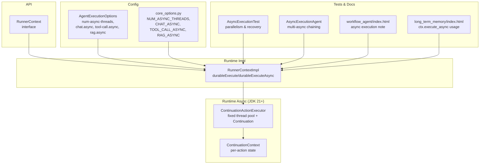
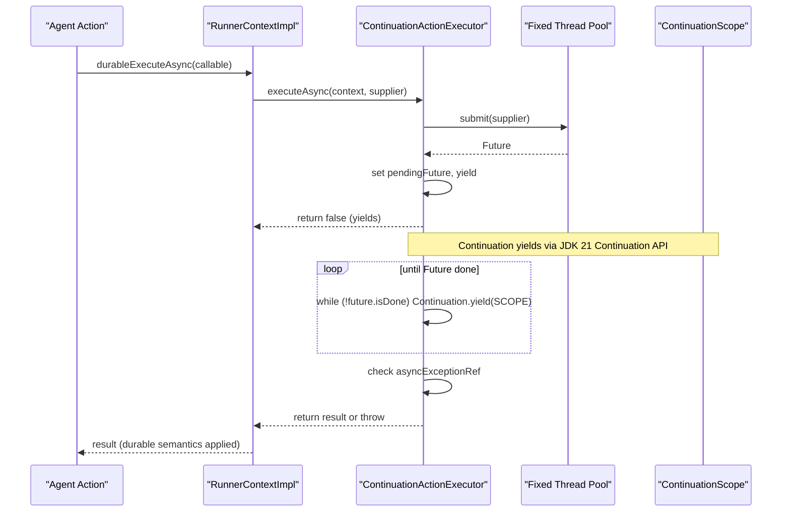
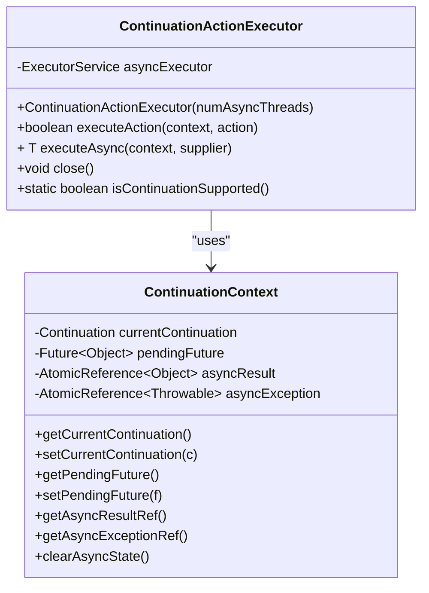
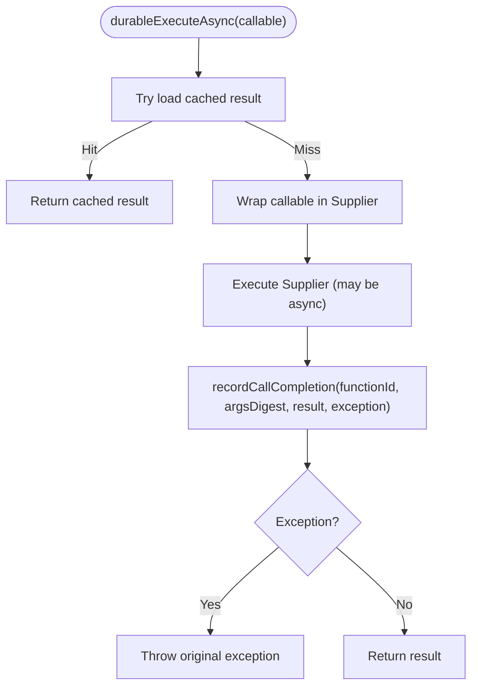
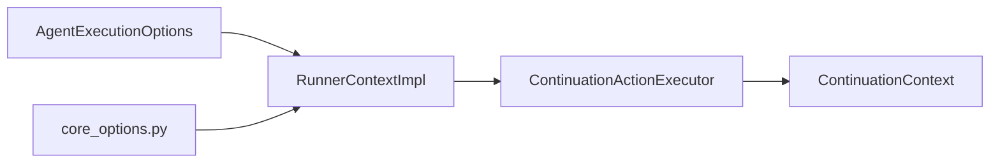

# Asynchronous Execution

<cite>
**Referenced Files in This Document**
- [ContinuationActionExecutor.java](file://runtime/src/main/java21/org/apache/flink/agents/runtime/async/ContinuationActionExecutor.java)
- [ContinuationContext.java](file://runtime/src/main/java21/org/apache/flink/agents/runtime/async/ContinuationContext.java)
- [RunnerContext.java](file://api/src/main/java/org/apache/flink/agents/api/context/RunnerContext.java)
- [RunnerContextImpl.java](file://runtime/src/main/java/org/apache/flink/agents/runtime/context/RunnerContextImpl.java)
- [AgentExecutionOptions.java](file://api/src/main/java/org/apache/flink/agents/api/agents/AgentExecutionOptions.java)
- [core_options.py](file://python/flink_agents/api/core_options.py)
- [AsyncExecutionTest.java](file://e2e-test/flink-agents-end-to-end-tests-integration/src/test/java/org/apache/flink/agents/integration/test/AsyncExecutionTest.java)
- [AsyncExecutionAgent.java](file://e2e-test/flink-agents-end-to-end-tests-integration/src/test/java/org/apache/flink/agents/integration/test/AsyncExecutionAgent.java)
- [ActionExecutionOperatorTest.java](file://runtime/src/test/java/org/apache/flink/agents/runtime/operator/ActionExecutionOperatorTest.java)
- [workflow_agent/index.html](file://docs/public/docs/development/workflow_agent/index.html)
- [long_term_memory/index.html](file://docs/public/docs/development/long_term_memory/index.html)
</cite>

## Table of Contents
1. [Introduction](#introduction)
2. [Project Structure](#project-structure)
3. [Core Components](#core-components)
4. [Architecture Overview](#architecture-overview)
5. [Detailed Component Analysis](#detailed-component-analysis)
6. [Dependency Analysis](#dependency-analysis)
7. [Performance Considerations](#performance-considerations)
8. [Troubleshooting Guide](#troubleshooting-guide)
9. [Conclusion](#conclusion)
10. [Appendices](#appendices)

## Introduction
This document explains asynchronous execution patterns in Flink Agents with a focus on the continuation-based model introduced in JDK 21+. It covers how ContinuationActionExecutor and ContinuationContext enable non-blocking, high-throughput execution of external service calls and I/O-bound operations. You will learn how to configure async thread pools, timeouts, and resource limits; how durable execution integrates with async flows; and how to debug and optimize async behavior for different use cases.

## Project Structure
Asynchronous execution spans several modules:
- Runtime async primitives for JDK 21+ (ContinuationActionExecutor, ContinuationContext)
- RunnerContext API and implementation for durable async execution
- Configuration options for async behavior
- End-to-end tests validating parallelism and recovery semantics
- Documentation pages demonstrating async usage

**Diagram sources**
- [ContinuationActionExecutor.java](file://runtime/src/main/java21/org/apache/flink/agents/runtime/async/ContinuationActionExecutor.java#L35-L163)
- [ContinuationContext.java](file://runtime/src/main/java21/org/apache/flink/agents/runtime/async/ContinuationContext.java#L26-L62)
- [RunnerContext.java](file://api/src/main/java/org/apache/flink/agents/api/context/RunnerContext.java#L122-L133)
- [RunnerContextImpl.java](file://runtime/src/main/java/org/apache/flink/agents/runtime/context/RunnerContextImpl.java#L311-L353)
- [AgentExecutionOptions.java](file://api/src/main/java/org/apache/flink/agents/api/agents/AgentExecutionOptions.java#L33-L46)
- [core_options.py](file://python/flink_agents/api/core_options.py#L110-L132)
- [AsyncExecutionTest.java](file://e2e-test/flink-agents-end-to-end-tests-integration/src/test/java/org/apache/flink/agents/integration/test/AsyncExecutionTest.java#L310-L331)
- [AsyncExecutionAgent.java](file://e2e-test/flink-agents-end-to-end-tests-integration/src/test/java/org/apache/flink/agents/integration/test/AsyncExecutionAgent.java#L220-L236)
- [workflow_agent/index.html](file://docs/public/docs/development/workflow_agent/index.html#L1055-L1059)
- [long_term_memory/index.html](file://docs/public/docs/development/long_term_memory/index.html#L1758-L1766)

**Section sources**
- [ContinuationActionExecutor.java](file://runtime/src/main/java21/org/apache/flink/agents/runtime/async/ContinuationActionExecutor.java#L35-L163)
- [ContinuationContext.java](file://runtime/src/main/java21/org/apache/flink/agents/runtime/async/ContinuationContext.java#L26-L62)
- [RunnerContext.java](file://api/src/main/java/org/apache/flink/agents/api/context/RunnerContext.java#L122-L133)
- [RunnerContextImpl.java](file://runtime/src/main/java/org/apache/flink/agents/runtime/context/RunnerContextImpl.java#L311-L353)
- [AgentExecutionOptions.java](file://api/src/main/java/org/apache/flink/agents/api/agents/AgentExecutionOptions.java#L33-L46)
- [core_options.py](file://python/flink_agents/api/core_options.py#L110-L132)
- [AsyncExecutionTest.java](file://e2e-test/flink-agents-end-to-end-tests-integration/src/test/java/org/apache/flink/agents/integration/test/AsyncExecutionTest.java#L310-L331)
- [AsyncExecutionAgent.java](file://e2e-test/flink-agents-end-to-end-tests-integration/src/test/java/org/apache/flink/agents/integration/test/AsyncExecutionAgent.java#L220-L236)
- [workflow_agent/index.html](file://docs/public/docs/development/workflow_agent/index.html#L1055-L1059)
- [long_term_memory/index.html](file://docs/public/docs/development/long_term_memory/index.html#L1758-L1766)

## Core Components
- ContinuationActionExecutor (JDK 21+): Manages a fixed-size thread pool and uses JDK continuations to yield and resume actions during async I/O. It stores pending futures in the continuation context and resumes execution when tasks complete.
- ContinuationContext: Holds per-action state including the current continuation, a pending Future, and atomic references for results and exceptions.
- RunnerContext API: Declares durableExecute and durableExecuteAsync methods. The implementation wraps callable execution, records durable results, and supports recovery semantics.
- Configuration Options: num-async-threads controls the async thread pool size; chat.async, tool-call.async, and rag.async toggle async behavior for specific action categories.

Key responsibilities:
- Non-blocking I/O: Offloads latency-heavy operations to a dedicated thread pool.
- Recovery: durableExecute/durableExecuteAsync preserve deterministic replay by caching results and exceptions.
- Throughput: Parallelism via thread pool and continuation yields reduce blocking on mailbox threads.

**Section sources**
- [ContinuationActionExecutor.java](file://runtime/src/main/java21/org/apache/flink/agents/runtime/async/ContinuationActionExecutor.java#L35-L163)
- [ContinuationContext.java](file://runtime/src/main/java21/org/apache/flink/agents/runtime/async/ContinuationContext.java#L26-L62)
- [RunnerContext.java](file://api/src/main/java/org/apache/flink/agents/api/context/RunnerContext.java#L122-L133)
- [RunnerContextImpl.java](file://runtime/src/main/java/org/apache/flink/agents/runtime/context/RunnerContextImpl.java#L311-L353)
- [AgentExecutionOptions.java](file://api/src/main/java/org/apache/flink/agents/api/agents/AgentExecutionOptions.java#L33-L46)
- [core_options.py](file://python/flink_agents/api/core_options.py#L110-L132)

## Architecture Overview
The async execution pipeline integrates runtime primitives with the action execution context and configuration.

**Diagram sources**
- [ContinuationActionExecutor.java](file://runtime/src/main/java21/org/apache/flink/agents/runtime/async/ContinuationActionExecutor.java#L111-L149)
- [RunnerContextImpl.java](file://runtime/src/main/java/org/apache/flink/agents/runtime/context/RunnerContextImpl.java#L311-L353)

## Detailed Component Analysis

### ContinuationActionExecutor (JDK 21+)
- Fixed thread pool: Created with a configurable number of async threads; logs initialization.
- executeAction: Checks for a pending Future from prior yield; if not done, returns false to keep yielding; if done, clears state and resumes continuation.
- executeAsync: Submits a Supplier to the pool, sets a pending Future, yields via Continuation.yield until done, then reads result or exception from atomic references.
- Lifecycle: Provides isContinuationSupported and close to shutdown the pool.

**Diagram sources**
- [ContinuationActionExecutor.java](file://runtime/src/main/java21/org/apache/flink/agents/runtime/async/ContinuationActionExecutor.java#L35-L163)
- [ContinuationContext.java](file://runtime/src/main/java21/org/apache/flink/agents/runtime/async/ContinuationContext.java#L26-L62)

**Section sources**
- [ContinuationActionExecutor.java](file://runtime/src/main/java21/org/apache/flink/agents/runtime/async/ContinuationActionExecutor.java#L35-L163)
- [ContinuationContext.java](file://runtime/src/main/java21/org/apache/flink/agents/runtime/async/ContinuationContext.java#L26-L62)

### ContinuationContext
- Stores the current continuation and a pending Future for async yields.
- Uses atomic references to safely pass results and exceptions from the async thread back to the continuation.
- Provides clearAsyncState to reset state between yields.

**Section sources**
- [ContinuationContext.java](file://runtime/src/main/java21/org/apache/flink/agents/runtime/async/ContinuationContext.java#L26-L62)

### RunnerContext API and Implementation
- RunnerContext declares durableExecute and durableExecuteAsync with durable semantics and recovery.
- RunnerContextImpl implements durableExecute and durableExecuteAsync:
  - Wraps the callable in a Supplier and executes it.
  - Captures exceptions and converts them into a runtime wrapper for propagation.
  - Records results and exceptions for recovery and returns the result or rethrows.

**Diagram sources**
- [RunnerContext.java](file://api/src/main/java/org/apache/flink/agents/api/context/RunnerContext.java#L122-L133)
- [RunnerContextImpl.java](file://runtime/src/main/java/org/apache/flink/agents/runtime/context/RunnerContextImpl.java#L311-L353)

**Section sources**
- [RunnerContext.java](file://api/src/main/java/org/apache/flink/agents/api/context/RunnerContext.java#L122-L133)
- [RunnerContextImpl.java](file://runtime/src/main/java/org/apache/flink/agents/runtime/context/RunnerContextImpl.java#L311-L353)

### Configuration Options
- num-async-threads: Controls the fixed thread pool size for async operations.
- chat.async, tool-call.async, rag.async: Flags to enable async behavior for specific action categories.
- Python counterpart: NUM_ASYNC_THREADS, CHAT_ASYNC, TOOL_CALL_ASYNC, RAG_ASYNC mirror JVM options.

Recommendations:
- Size the thread pool according to I/O characteristics: larger for many slow network calls; smaller for fewer CPU-bound tasks.
- Enable async flags selectively to avoid unnecessary overhead for fast operations.

**Section sources**
- [AgentExecutionOptions.java](file://api/src/main/java/org/apache/flink/agents/api/agents/AgentExecutionOptions.java#L33-L46)
- [core_options.py](file://python/flink_agents/api/core_options.py#L110-L132)

### Integration with Flink’s Async I/O and Non-blocking Operations
- Async execution yields control back to the runtime while waiting for Futures, preventing mailbox thread blocking.
- durableExecute/durableExecuteAsync preserve determinism by caching outcomes and skipping re-execution on recovery.
- External service calls (e.g., embeddings, chat models, vector stores) benefit from async to overlap latency with other work.

**Section sources**
- [workflow_agent/index.html](file://docs/public/docs/development/workflow_agent/index.html#L1055-L1059)
- [long_term_memory/index.html](file://docs/public/docs/development/long_term_memory/index.html#L1758-L1766)

### Examples and Patterns
- Implementing async actions:
  - Use durableExecuteAsync with a DurableCallable for I/O-bound work.
  - Chain multiple async calls to overlap execution and improve throughput.
- Handling concurrent execution:
  - The fixed thread pool allows multiple async tasks to run concurrently.
  - End-to-end tests validate parallelism on JDK 21+ and sequential fallback on older JDKs.
- Managing execution context across async boundaries:
  - ContinuationContext carries state across yields; RunnerContextImpl persists durable results.

**Section sources**
- [AsyncExecutionAgent.java](file://e2e-test/flink-agents-end-to-end-tests-integration/src/test/java/org/apache/flink/agents/integration/test/AsyncExecutionAgent.java#L220-L236)
- [AsyncExecutionTest.java](file://e2e-test/flink-agents-end-to-end-tests-integration/src/test/java/org/apache/flink/agents/integration/test/AsyncExecutionTest.java#L310-L331)
- [ActionExecutionOperatorTest.java](file://runtime/src/test/java/org/apache/flink/agents/runtime/operator/ActionExecutionOperatorTest.java#L1235-L1411)

## Dependency Analysis
- ContinuationActionExecutor depends on:
  - JDK 21 Continuation API for yielding/resuming.
  - A fixed thread pool for offloading async work.
  - ContinuationContext for per-action state.
- RunnerContextImpl depends on:
  - ContinuationActionExecutor for async execution on JDK 21+.
  - Durable execution infrastructure to record and replay results.
- Configuration flows through AgentExecutionOptions and Python core_options to tune async behavior.

**Diagram sources**
- [AgentExecutionOptions.java](file://api/src/main/java/org/apache/flink/agents/api/agents/AgentExecutionOptions.java#L33-L46)
- [core_options.py](file://python/flink_agents/api/core_options.py#L110-L132)
- [RunnerContextImpl.java](file://runtime/src/main/java/org/apache/flink/agents/runtime/context/RunnerContextImpl.java#L311-L353)
- [ContinuationActionExecutor.java](file://runtime/src/main/java21/org/apache/flink/agents/runtime/async/ContinuationActionExecutor.java#L35-L163)
- [ContinuationContext.java](file://runtime/src/main/java21/org/apache/flink/agents/runtime/async/ContinuationContext.java#L26-L62)

**Section sources**
- [AgentExecutionOptions.java](file://api/src/main/java/org/apache/flink/agents/api/agents/AgentExecutionOptions.java#L33-L46)
- [core_options.py](file://python/flink_agents/api/core_options.py#L110-L132)
- [RunnerContextImpl.java](file://runtime/src/main/java/org/apache/flink/agents/runtime/context/RunnerContextImpl.java#L311-L353)
- [ContinuationActionExecutor.java](file://runtime/src/main/java21/org/apache/flink/agents/runtime/async/ContinuationActionExecutor.java#L35-L163)
- [ContinuationContext.java](file://runtime/src/main/java21/org/apache/flink/agents/runtime/async/ContinuationContext.java#L26-L62)

## Performance Considerations
- Thread pool sizing:
  - Increase num-async-threads for I/O-bound tasks with high latency.
  - Match pool size to available cores and external service capacity.
- Throughput vs. latency:
  - Async reduces tail latency by overlapping I/O; ensure sufficient concurrency without saturating downstream systems.
- Memory management:
  - Async results are captured in atomic references; avoid retaining large objects beyond the async boundary.
  - Keep callable inputs small and serializable to minimize durable storage overhead.
- Determinism:
  - durableExecute/durableExecuteAsync cache results; avoid non-deterministic calls inside async blocks.

[No sources needed since this section provides general guidance]

## Troubleshooting Guide
- Async tasks appear sequential:
  - Verify JDK 21+ is used; ContinuationActionExecutor.isContinuationSupported must return true.
  - Confirm num-async-threads > 0 and async flags are enabled.
- Overlap detection in tests:
  - AsyncExecutionTest validates parallelism by checking execution interval overlaps on JDK 21+.
- Exceptions in async:
  - Durable exceptions are serialized and rethrown on recovery; ensure proper exception handling around durableExecuteAsync.
- Memory access restrictions:
  - Access to memory and sendEvent is prohibited within durable callables; perform I/O outside these constraints.

**Section sources**
- [AsyncExecutionTest.java](file://e2e-test/flink-agents-end-to-end-tests-integration/src/test/java/org/apache/flink/agents/integration/test/AsyncExecutionTest.java#L310-L331)
- [RunnerContextImpl.java](file://runtime/src/main/java/org/apache/flink/agents/runtime/context/RunnerContextImpl.java#L311-L353)
- [ActionExecutionOperatorTest.java](file://runtime/src/test/java/org/apache/flink/agents/runtime/operator/ActionExecutionOperatorTest.java#L1376-L1406)

## Conclusion
Flink Agents’ continuation-based async execution enables high-throughput, non-blocking I/O by leveraging JDK 21 Continuation API and a fixed thread pool. Combined with durable execution semantics, it provides deterministic recovery while maximizing throughput. Tune num-async-threads and async flags per workload, and rely on the provided tests and docs to validate behavior across JDK versions.

[No sources needed since this section summarizes without analyzing specific files]

## Appendices

### When to Use Async vs. Sync
- Use async for:
  - External service calls with high latency.
  - I/O-bound operations that benefit from overlap.
- Use sync for:
  - Very fast operations where async overhead outweighs benefits.
  - Deterministic, stateless computations that do not require yielding.

[No sources needed since this section provides general guidance]