# Fault Tolerance and Recovery

<cite>
**Referenced Files in This Document**
- [ActionStateStore.java](file://runtime/src/main/java/org/apache/flink/agents/runtime/actionstate/ActionStateStore.java)
- [KafkaActionStateStore.java](file://runtime/src/main/java/org/apache/flink/agents/runtime/actionstate/KafkaActionStateStore.java)
- [ActionState.java](file://runtime/src/main/java/org/apache/flink/agents/runtime/actionstate/ActionState.java)
- [CallResult.java](file://runtime/src/main/java/org/apache/flink/agents/runtime/actionstate/CallResult.java)
- [ActionStateUtil.java](file://runtime/src/main/java/org/apache/flink/agents/runtime/actionstate/ActionStateUtil.java)
- [RunnerContextImpl.java](file://runtime/src/main/java/org/apache/flink/agents/runtime/context/RunnerContextImpl.java)
- [EventLogRecord.java](file://runtime/src/main/java/org/apache/flink/agents/runtime/eventlog/EventLogRecord.java)
- [EventLogRecordJsonSerializer.java](file://runtime/src/main/java/org/apache/flink/agents/runtime/eventlog/EventLogRecordJsonSerializer.java)
- [EventLogRecordJsonDeserializer.java](file://runtime/src/main/java/org/apache/flink/agents/runtime/eventlog/EventLogRecordJsonDeserializer.java)
- [FeedbackChannel.java](file://runtime/src/main/java/org/apache/flink/agents/runtime/feedback/FeedbackChannel.java)
- [FeedbackChannelBroker.java](file://runtime/src/main/java/org/apache/flink/agents/runtime/feedback/FeedbackChannelBroker.java)
- [LockFreeBatchFeedbackQueue.java](file://runtime/src/main/java/org/apache/flink/agents/runtime/feedback/LockFreeBatchFeedbackQueue.java)
- [AgentExecutionOptions.java](file://api/src/main/java/org/apache/flink/agents/api/agents/AgentExecutionOptions.java)
- [RescalingTest.java](file://runtime/src/test/java/org/apache/flink/agents/runtime/RescalingTest.java)
- [ActionStateTest.java](file://runtime/src/test/java/org/apache/flink/agents/runtime/actionstate/ActionStateTest.java)
- [KafkaActionStateStoreTest.java](file://runtime/src/test/java/org/apache/flink/agents/runtime/actionstate/KafkaActionStateStoreTest.java)
- [ActionExecutionOperatorTest.java](file://runtime/src/test/java/org/apache/flink/agents/runtime/operator/ActionExecutionOperatorTest.java)
</cite>

## Table of Contents
1. [Introduction](#introduction)
2. [Project Structure](#project-structure)
3. [Core Components](#core-components)
4. [Architecture Overview](#architecture-overview)
5. [Detailed Component Analysis](#detailed-component-analysis)
6. [Dependency Analysis](#dependency-analysis)
7. [Performance Considerations](#performance-considerations)
8. [Troubleshooting Guide](#troubleshooting-guide)
9. [Conclusion](#conclusion)
10. [Appendices](#appendices)

## Introduction
This document explains the fault tolerance and recovery mechanisms in Flink Agents. It focuses on durable execution guarantees, action state persistence, checkpoint and recovery procedures, event logging for audit and debugging, and the feedback channel system for reliable message delivery and state consistency. It also covers configuration options for checkpoint intervals, state backends, and recovery timeouts, and provides guidance for designing resilient agent workflows, implementing idempotent operations, handling partial failures, and conducting recovery testing and disaster recovery.

## Project Structure
Flink Agents implements fault tolerance primarily through:
- Action state persistence and recovery using a pluggable backend (Kafka-backed)
- Fine-grained durable execution with per-call result caching and replay
- Structured event logging with robust serialization/deserialization
- Reliable feedback channels for inter-task communication without network hops
- Configuration for retries, async execution, and Flink checkpointing/backends

**Diagram sources**
- [RunnerContextImpl.java](file://runtime/src/main/java/org/apache/flink/agents/runtime/context/RunnerContextImpl.java#L474-L588)
- [ActionState.java](file://runtime/src/main/java/org/apache/flink/agents/runtime/actionstate/ActionState.java#L28-L180)
- [CallResult.java](file://runtime/src/main/java/org/apache/flink/agents/runtime/actionstate/CallResult.java#L35-L136)
- [ActionStateUtil.java](file://runtime/src/main/java/org/apache/flink/agents/runtime/actionstate/ActionStateUtil.java#L35-L83)
- [ActionStateStore.java](file://runtime/src/main/java/org/apache/flink/agents/runtime/actionstate/ActionStateStore.java#L27-L92)
- [KafkaActionStateStore.java](file://runtime/src/main/java/org/apache/flink/agents/runtime/actionstate/KafkaActionStateStore.java#L71-L397)
- [EventLogRecord.java](file://runtime/src/main/java/org/apache/flink/agents/runtime/eventlog/EventLogRecord.java#L26-L53)
- [EventLogRecordJsonSerializer.java](file://runtime/src/main/java/org/apache/flink/agents/runtime/eventlog/EventLogRecordJsonSerializer.java#L34-L162)
- [EventLogRecordJsonDeserializer.java](file://runtime/src/main/java/org/apache/flink/agents/runtime/eventlog/EventLogRecordJsonDeserializer.java#L32-L121)
- [FeedbackChannel.java](file://runtime/src/main/java/org/apache/flink/agents/runtime/feedback/FeedbackChannel.java#L34-L143)
- [FeedbackChannelBroker.java](file://runtime/src/main/java/org/apache/flink/agents/runtime/feedback/FeedbackChannelBroker.java#L37-L66)
- [LockFreeBatchFeedbackQueue.java](file://runtime/src/main/java/org/apache/flink/agents/runtime/feedback/LockFreeBatchFeedbackQueue.java#L29-L44)

**Section sources**
- [RunnerContextImpl.java](file://runtime/src/main/java/org/apache/flink/agents/runtime/context/RunnerContextImpl.java#L1-L590)
- [ActionStateStore.java](file://runtime/src/main/java/org/apache/flink/agents/runtime/actionstate/ActionStateStore.java#L1-L93)
- [KafkaActionStateStore.java](file://runtime/src/main/java/org/apache/flink/agents/runtime/actionstate/KafkaActionStateStore.java#L1-L398)
- [ActionState.java](file://runtime/src/main/java/org/apache/flink/agents/runtime/actionstate/ActionState.java#L1-L234)
- [CallResult.java](file://runtime/src/main/java/org/apache/flink/agents/runtime/actionstate/CallResult.java#L1-L177)
- [ActionStateUtil.java](file://runtime/src/main/java/org/apache/flink/agents/runtime/actionstate/ActionStateUtil.java#L1-L84)
- [EventLogRecord.java](file://runtime/src/main/java/org/apache/flink/agents/runtime/eventlog/EventLogRecord.java#L1-L54)
- [EventLogRecordJsonSerializer.java](file://runtime/src/main/java/org/apache/flink/agents/runtime/eventlog/EventLogRecordJsonSerializer.java#L1-L163)
- [EventLogRecordJsonDeserializer.java](file://runtime/src/main/java/org/apache/flink/agents/runtime/eventlog/EventLogRecordJsonDeserializer.java#L1-L122)
- [FeedbackChannel.java](file://runtime/src/main/java/org/apache/flink/agents/runtime/feedback/FeedbackChannel.java#L1-L144)
- [FeedbackChannelBroker.java](file://runtime/src/main/java/org/apache/flink/agents/runtime/feedback/FeedbackChannelBroker.java#L1-L67)
- [LockFreeBatchFeedbackQueue.java](file://runtime/src/main/java/org/apache/flink/agents/runtime/feedback/LockFreeBatchFeedbackQueue.java#L1-L45)

## Core Components
- Action state persistence and recovery:
  - ActionState captures per-action state, including memory updates, output events, and per-call results.
  - CallResult stores serialized outcomes of durable_execute/durable_execute_async calls.
  - ActionStateStore defines the contract for backend storage; KafkaActionStateStore implements it with Kafka topic compaction and recovery markers.
  - ActionStateUtil generates stable keys for state entries across event/action combinations.
- Durable execution:
  - RunnerContextImpl maintains a DurableExecutionContext that replays prior call results and persists new ones.
- Event logging:
  - EventLogRecord encapsulates event context and event data with custom JSON serialization/deserialization supporting polymorphic event types.
- Feedback channels:
  - FeedbackChannel provides single-producer/single-consumer handoff queues with lock-free batching and a broker for co-located subtasks.

**Section sources**
- [ActionState.java](file://runtime/src/main/java/org/apache/flink/agents/runtime/actionstate/ActionState.java#L28-L180)
- [CallResult.java](file://runtime/src/main/java/org/apache/flink/agents/runtime/actionstate/CallResult.java#L35-L136)
- [ActionStateStore.java](file://runtime/src/main/java/org/apache/flink/agents/runtime/actionstate/ActionStateStore.java#L27-L92)
- [KafkaActionStateStore.java](file://runtime/src/main/java/org/apache/flink/agents/runtime/actionstate/KafkaActionStateStore.java#L71-L397)
- [ActionStateUtil.java](file://runtime/src/main/java/org/apache/flink/agents/runtime/actionstate/ActionStateUtil.java#L35-L83)
- [RunnerContextImpl.java](file://runtime/src/main/java/org/apache/flink/agents/runtime/context/RunnerContextImpl.java#L474-L588)
- [EventLogRecord.java](file://runtime/src/main/java/org/apache/flink/agents/runtime/eventlog/EventLogRecord.java#L26-L53)
- [EventLogRecordJsonSerializer.java](file://runtime/src/main/java/org/apache/flink/agents/runtime/eventlog/EventLogRecordJsonSerializer.java#L34-L162)
- [EventLogRecordJsonDeserializer.java](file://runtime/src/main/java/org/apache/flink/agents/runtime/eventlog/EventLogRecordJsonDeserializer.java#L32-L121)
- [FeedbackChannel.java](file://runtime/src/main/java/org/apache/flink/agents/runtime/feedback/FeedbackChannel.java#L34-L143)
- [FeedbackChannelBroker.java](file://runtime/src/main/java/org/apache/flink/agents/runtime/feedback/FeedbackChannelBroker.java#L37-L66)
- [LockFreeBatchFeedbackQueue.java](file://runtime/src/main/java/org/apache/flink/agents/runtime/feedback/LockFreeBatchFeedbackQueue.java#L29-L44)

## Architecture Overview
The system ensures durable execution and recovery by:
- Persisting per-call results and action state to a durable backend (Kafka).
- Using recovery markers to rebuild in-memory state deterministically.
- Replaying only the necessary portion of execution to maintain idempotency.
- Logging all events with structured serialization for auditability and debugging.
- Delivering feedback reliably within task locality via lock-free queues.

**Diagram sources**
- [RunnerContextImpl.java](file://runtime/src/main/java/org/apache/flink/agents/runtime/context/RunnerContextImpl.java#L474-L588)
- [ActionStateStore.java](file://runtime/src/main/java/org/apache/flink/agents/runtime/actionstate/ActionStateStore.java#L27-L92)
- [KafkaActionStateStore.java](file://runtime/src/main/java/org/apache/flink/agents/runtime/actionstate/KafkaActionStateStore.java#L201-L270)
- [EventLogRecordJsonSerializer.java](file://runtime/src/main/java/org/apache/flink/agents/runtime/eventlog/EventLogRecordJsonSerializer.java#L57-L80)
- [FeedbackChannel.java](file://runtime/src/main/java/org/apache/flink/agents/runtime/feedback/FeedbackChannel.java#L54-L72)

## Detailed Component Analysis

### Action State Persistence and Recovery
- ActionState holds:
  - Task event, memory updates, output events, and a list of CallResult entries.
  - A completed flag to skip replaying entire actions when finalized.
- CallResult stores function identity, argument digest, and serialized result or exception payload.
- ActionStateStore interface defines:
  - put/get for state persistence/retrieval
  - rebuildState to restore in-memory state from recovery markers
  - pruneState to clean older states for a key
  - getRecoveryMarker to capture current recovery position
- KafkaActionStateStore:
  - Uses Kafka topic compaction to deduplicate by key.
  - Generates stable keys via ActionStateUtil.
  - Supports divergence detection and cleanup of future-sequence states.
  - Provides recovery markers as end offsets per partition and rebuilds state by polling from markers.

```mermaid
classDiagram
class ActionState {
+Event taskEvent
+MemoryUpdate[] sensoryMemoryUpdates
+MemoryUpdate[] shortTermMemoryUpdates
+Event[] outputEvents
+CallResult[] callResults
+boolean completed
+markCompleted()
+clearCallResultsFrom(fromIndex)
+isCompleted()
}
class CallResult {
+String functionId
+String argsDigest
+byte[] resultPayload
+byte[] exceptionPayload
+matches(functionId,argsDigest) boolean
+isSuccess() boolean
}
class ActionStateStore {
<<interface>>
+put(key,seqNum,action,event,state)
+get(key,seqNum,action,event) ActionState
+rebuildState(markers)
+pruneState(key,seqNum)
+getRecoveryMarker() Object
}
class KafkaActionStateStore {
-Map~String,ActionState~ actionStates
-Map~String,Long~ latestKeySeqNum
-Producer producer
-Consumer consumer
-String topic
+put(...)
+get(...)
+rebuildState(...)
+pruneState(...)
+getRecoveryMarker() Map
}
class ActionStateUtil {
+generateKey(key,seqNum,action,event) String
+parseKey(key) String[]
}
ActionStateStore <|.. KafkaActionStateStore
KafkaActionStateStore --> ActionStateUtil : "generates keys"
ActionState --> CallResult : "contains"
```

**Diagram sources**
- [ActionState.java](file://runtime/src/main/java/org/apache/flink/agents/runtime/actionstate/ActionState.java#L28-L180)
- [CallResult.java](file://runtime/src/main/java/org/apache/flink/agents/runtime/actionstate/CallResult.java#L35-L136)
- [ActionStateStore.java](file://runtime/src/main/java/org/apache/flink/agents/runtime/actionstate/ActionStateStore.java#L27-L92)
- [KafkaActionStateStore.java](file://runtime/src/main/java/org/apache/flink/agents/runtime/actionstate/KafkaActionStateStore.java#L71-L397)
- [ActionStateUtil.java](file://runtime/src/main/java/org/apache/flink/agents/runtime/actionstate/ActionStateUtil.java#L35-L83)

**Section sources**
- [ActionState.java](file://runtime/src/main/java/org/apache/flink/agents/runtime/actionstate/ActionState.java#L28-L180)
- [CallResult.java](file://runtime/src/main/java/org/apache/flink/agents/runtime/actionstate/CallResult.java#L35-L136)
- [ActionStateStore.java](file://runtime/src/main/java/org/apache/flink/agents/runtime/actionstate/ActionStateStore.java#L27-L92)
- [KafkaActionStateStore.java](file://runtime/src/main/java/org/apache/flink/agents/runtime/actionstate/KafkaActionStateStore.java#L108-L327)
- [ActionStateUtil.java](file://runtime/src/main/java/org/apache/flink/agents/runtime/actionstate/ActionStateUtil.java#L40-L83)

### Durable Execution and Replay
- RunnerContextImpl’s DurableExecutionContext:
  - Loads persisted call results and advances a call index.
  - On replay, matches functionId and argsDigest to reuse cached results.
  - On mismatch, clears subsequent results to recover from non-determinism.
  - Persists new CallResult entries immediately upon completion.
- ActionState.markCompleted indicates the entire action is safe to skip during recovery.

**Diagram sources**
- [RunnerContextImpl.java](file://runtime/src/main/java/org/apache/flink/agents/runtime/context/RunnerContextImpl.java#L524-L587)
- [ActionState.java](file://runtime/src/main/java/org/apache/flink/agents/runtime/actionstate/ActionState.java#L156-L180)
- [CallResult.java](file://runtime/src/main/java/org/apache/flink/agents/runtime/actionstate/CallResult.java#L133-L136)

**Section sources**
- [RunnerContextImpl.java](file://runtime/src/main/java/org/apache/flink/agents/runtime/context/RunnerContextImpl.java#L474-L588)
- [ActionState.java](file://runtime/src/main/java/org/apache/flink/agents/runtime/actionstate/ActionState.java#L156-L180)
- [CallResult.java](file://runtime/src/main/java/org/apache/flink/agents/runtime/actionstate/CallResult.java#L133-L136)

### Event Logging and Recovery
- EventLogRecord encapsulates EventContext and Event with custom JSON serialization/deserialization.
- Serializer adds eventType and reorders fields for consistent logging.
- Deserializer reconstructs the concrete Event type using eventType from context.
- This enables audit trails and debugging across heterogeneous event types.

**Diagram sources**
- [EventLogRecord.java](file://runtime/src/main/java/org/apache/flink/agents/runtime/eventlog/EventLogRecord.java#L26-L53)
- [EventLogRecordJsonSerializer.java](file://runtime/src/main/java/org/apache/flink/agents/runtime/eventlog/EventLogRecordJsonSerializer.java#L57-L161)
- [EventLogRecordJsonDeserializer.java](file://runtime/src/main/java/org/apache/flink/agents/runtime/eventlog/EventLogRecordJsonDeserializer.java#L48-L121)

**Section sources**
- [EventLogRecord.java](file://runtime/src/main/java/org/apache/flink/agents/runtime/eventlog/EventLogRecord.java#L26-L53)
- [EventLogRecordJsonSerializer.java](file://runtime/src/main/java/org/apache/flink/agents/runtime/eventlog/EventLogRecordJsonSerializer.java#L57-L161)
- [EventLogRecordJsonDeserializer.java](file://runtime/src/main/java/org/apache/flink/agents/runtime/eventlog/EventLogRecordJsonDeserializer.java#L48-L121)

### Feedback Channel System
- FeedbackChannel provides single-producer/single-consumer semantics with a lock-free batch queue.
- FeedbackChannelBroker manages channels per subtask key and removes them on close.
- ConsumerTask drains queued items and invokes a user-provided consumer on an executor.

**Diagram sources**
- [FeedbackChannel.java](file://runtime/src/main/java/org/apache/flink/agents/runtime/feedback/FeedbackChannel.java#L34-L143)
- [FeedbackChannelBroker.java](file://runtime/src/main/java/org/apache/flink/agents/runtime/feedback/FeedbackChannelBroker.java#L37-L66)
- [LockFreeBatchFeedbackQueue.java](file://runtime/src/main/java/org/apache/flink/agents/runtime/feedback/LockFreeBatchFeedbackQueue.java#L29-L44)

**Section sources**
- [FeedbackChannel.java](file://runtime/src/main/java/org/apache/flink/agents/runtime/feedback/FeedbackChannel.java#L34-L143)
- [FeedbackChannelBroker.java](file://runtime/src/main/java/org/apache/flink/agents/runtime/feedback/FeedbackChannelBroker.java#L37-L66)
- [LockFreeBatchFeedbackQueue.java](file://runtime/src/main/java/org/apache/flink/agents/runtime/feedback/LockFreeBatchFeedbackQueue.java#L29-L44)

## Dependency Analysis
- RunnerContextImpl depends on ActionStateStore for durable execution persistence.
- KafkaActionStateStore depends on Kafka producer/consumer and compaction-enabled topic.
- EventLogRecord relies on Jackson annotations and custom serializer/deserializer.
- FeedbackChannel integrates with a broker and lock-free queue for throughput and low contention.

**Diagram sources**
- [RunnerContextImpl.java](file://runtime/src/main/java/org/apache/flink/agents/runtime/context/RunnerContextImpl.java#L474-L588)
- [ActionStateStore.java](file://runtime/src/main/java/org/apache/flink/agents/runtime/actionstate/ActionStateStore.java#L27-L92)
- [KafkaActionStateStore.java](file://runtime/src/main/java/org/apache/flink/agents/runtime/actionstate/KafkaActionStateStore.java#L71-L397)
- [EventLogRecord.java](file://runtime/src/main/java/org/apache/flink/agents/runtime/eventlog/EventLogRecord.java#L26-L53)
- [EventLogRecordJsonSerializer.java](file://runtime/src/main/java/org/apache/flink/agents/runtime/eventlog/EventLogRecordJsonSerializer.java#L34-L162)
- [EventLogRecordJsonDeserializer.java](file://runtime/src/main/java/org/apache/flink/agents/runtime/eventlog/EventLogRecordJsonDeserializer.java#L32-L121)
- [FeedbackChannel.java](file://runtime/src/main/java/org/apache/flink/agents/runtime/feedback/FeedbackChannel.java#L34-L143)
- [FeedbackChannelBroker.java](file://runtime/src/main/java/org/apache/flink/agents/runtime/feedback/FeedbackChannelBroker.java#L37-L66)
- [LockFreeBatchFeedbackQueue.java](file://runtime/src/main/java/org/apache/flink/agents/runtime/feedback/LockFreeBatchFeedbackQueue.java#L29-L44)

**Section sources**
- [RunnerContextImpl.java](file://runtime/src/main/java/org/apache/flink/agents/runtime/context/RunnerContextImpl.java#L1-L590)
- [ActionStateStore.java](file://runtime/src/main/java/org/apache/flink/agents/runtime/actionstate/ActionStateStore.java#L1-L93)
- [KafkaActionStateStore.java](file://runtime/src/main/java/org/apache/flink/agents/runtime/actionstate/KafkaActionStateStore.java#L1-L398)
- [EventLogRecord.java](file://runtime/src/main/java/org/apache/flink/agents/runtime/eventlog/EventLogRecord.java#L1-L54)
- [EventLogRecordJsonSerializer.java](file://runtime/src/main/java/org/apache/flink/agents/runtime/eventlog/EventLogRecordJsonSerializer.java#L1-L163)
- [EventLogRecordJsonDeserializer.java](file://runtime/src/main/java/org/apache/flink/agents/runtime/eventlog/EventLogRecordJsonDeserializer.java#L1-L122)
- [FeedbackChannel.java](file://runtime/src/main/java/org/apache/flink/agents/runtime/feedback/FeedbackChannel.java#L1-L144)
- [FeedbackChannelBroker.java](file://runtime/src/main/java/org/apache/flink/agents/runtime/feedback/FeedbackChannelBroker.java#L1-L67)
- [LockFreeBatchFeedbackQueue.java](file://runtime/src/main/java/org/apache/flink/agents/runtime/feedback/LockFreeBatchFeedbackQueue.java#L1-L45)

## Performance Considerations
- Kafka topic compaction reduces storage overhead for action state while preserving latest value per key.
- Lock-free batch feedback queue minimizes contention and improves throughput for intra-task feedback.
- Immediate persistence of CallResult entries ensures durability without blocking critical path excessively.
- Serialization overhead for events is minimized by consistent field ordering and eventType metadata.

[No sources needed since this section provides general guidance]

## Troubleshooting Guide
- Non-deterministic call order during recovery:
  - Detected when a CallResult does not match the expected functionId/argsDigest.
  - The system clears subsequent results from the mismatch index to reconcile.
- Action marked completed:
  - When ActionState.isCompleted is true, the entire action is skipped during recovery.
- Exception recovery:
  - Durable exceptions are serialized and re-thrown with original class and message during replay.
- Kafka topic verification and creation:
  - On initialization, the Kafka topic is verified or created with compaction enabled and configured partitions and replication.

**Section sources**
- [RunnerContextImpl.java](file://runtime/src/main/java/org/apache/flink/agents/runtime/context/RunnerContextImpl.java#L524-L587)
- [ActionState.java](file://runtime/src/main/java/org/apache/flink/agents/runtime/actionstate/ActionState.java#L156-L180)
- [ActionExecutionOperatorTest.java](file://runtime/src/test/java/org/apache/flink/agents/runtime/operator/ActionExecutionOperatorTest.java#L858-L1332)
- [KafkaActionStateStore.java](file://runtime/src/main/java/org/apache/flink/agents/runtime/actionstate/KafkaActionStateStore.java#L339-L363)

## Conclusion
Flink Agents achieves robust fault tolerance and recovery through:
- Fine-grained durable execution with per-call result caching and deterministic replay
- Persistent action state with Kafka-backed storage and compaction
- Structured event logging for auditability and debugging
- Reliable feedback channels for efficient intra-task communication
These mechanisms, combined with configurable retries and async execution, provide a solid foundation for resilient agent workflows in production environments.

[No sources needed since this section summarizes without analyzing specific files]

## Appendices

### Configuration Options
- Agent execution options:
  - max-retries: integer retry count for operations
  - num-async-threads: thread pool size for async execution
  - chat.async, tool-call.async, rag.async: toggles for asynchronous modes
- Flink checkpointing and state backend:
  - StateBackendOptions.STATE_BACKEND: selects backend (tested with multiple backends)
  - CheckpointingOptions.CHECKPOINTS_DIRECTORY: checkpoint directory
  - CheckpointingOptions.SAVEPOINT_DIRECTORY: savepoint directory

**Section sources**
- [AgentExecutionOptions.java](file://api/src/main/java/org/apache/flink/agents/api/agents/AgentExecutionOptions.java#L30-L47)
- [RescalingTest.java](file://runtime/src/test/java/org/apache/flink/agents/runtime/RescalingTest.java#L127-L135)

### Recovery Procedures
- Action-level recovery:
  - Use ActionStateStore.rebuildState with recovery markers to restore in-memory state.
  - Prune older states with pruneState to keep storage bounded.
- Event log recovery:
  - Use EventLogRecordJsonDeserializer to reconstruct events from logs.
- Feedback recovery:
  - Re-attach consumers after restart; the channel drains buffered items on registration.

**Section sources**
- [KafkaActionStateStore.java](file://runtime/src/main/java/org/apache/flink/agents/runtime/actionstate/KafkaActionStateStore.java#L201-L270)
- [EventLogRecordJsonDeserializer.java](file://runtime/src/main/java/org/apache/flink/agents/runtime/eventlog/EventLogRecordJsonDeserializer.java#L48-L121)
- [FeedbackChannel.java](file://runtime/src/main/java/org/apache/flink/agents/runtime/feedback/FeedbackChannel.java#L80-L96)

### Designing Resilient Workflows and Idempotency
- Prefer durable_execute/durable_execute_async for external calls.
- Keep call signatures and argument serialization stable to preserve argsDigest.
- Mark actions completed only after all side effects are applied.
- Implement idempotent operations where possible; rely on replay skipping for safety.

**Section sources**
- [RunnerContextImpl.java](file://runtime/src/main/java/org/apache/flink/agents/runtime/context/RunnerContextImpl.java#L284-L353)
- [ActionState.java](file://runtime/src/main/java/org/apache/flink/agents/runtime/actionstate/ActionState.java#L173-L180)

### Recovery Testing Strategies
- Unit tests:
  - Verify non-deterministic recovery behavior and pruning.
  - Validate round-trip serialization of events and durable exceptions.
- Integration tests:
  - Exercise checkpoint/savepoint with different state backends.
  - Simulate operator crashes and confirm recovery correctness.

**Section sources**
- [ActionStateTest.java](file://runtime/src/test/java/org/apache/flink/agents/runtime/actionstate/ActionStateTest.java#L265-L295)
- [KafkaActionStateStoreTest.java](file://runtime/src/test/java/org/apache/flink/agents/runtime/actionstate/KafkaActionStateStoreTest.java#L243-L276)
- [RescalingTest.java](file://runtime/src/test/java/org/apache/flink/agents/runtime/RescalingTest.java#L107-L145)