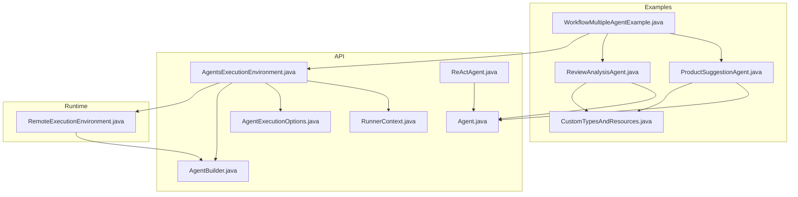
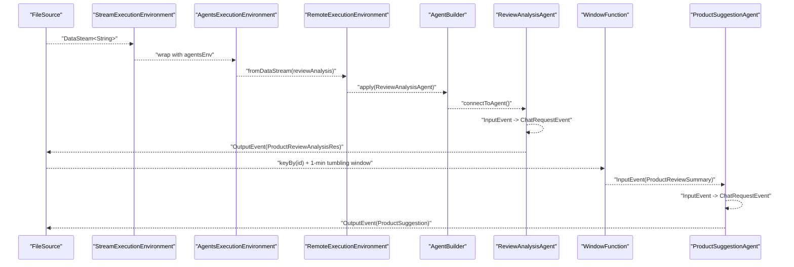
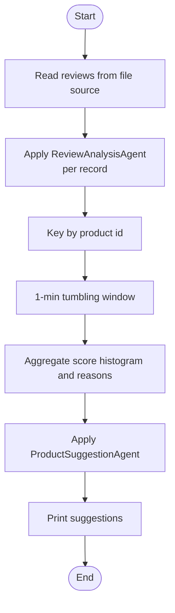
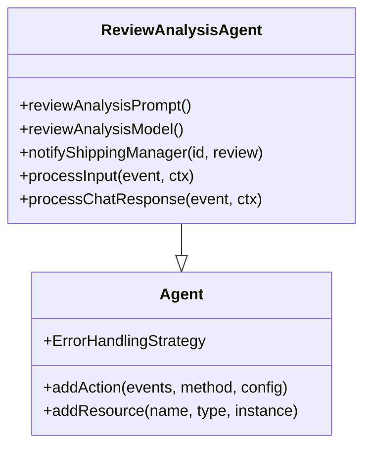
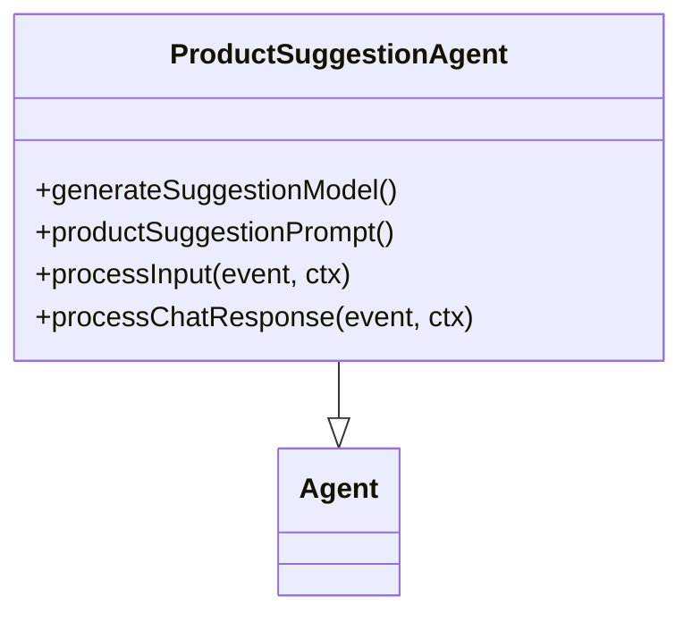
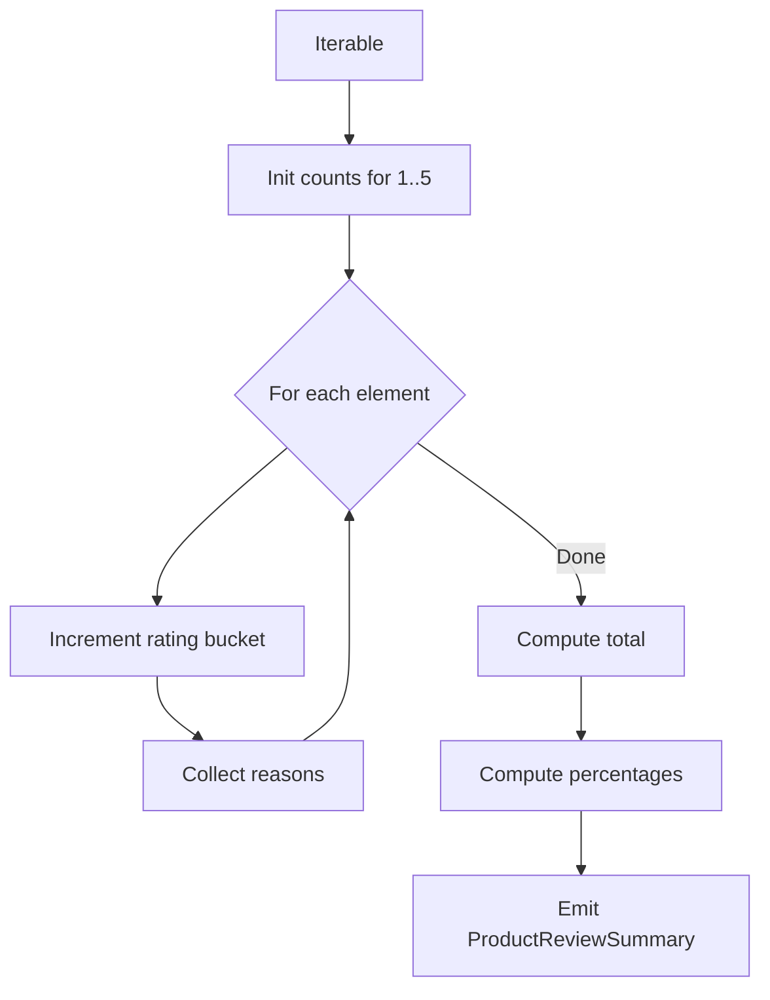
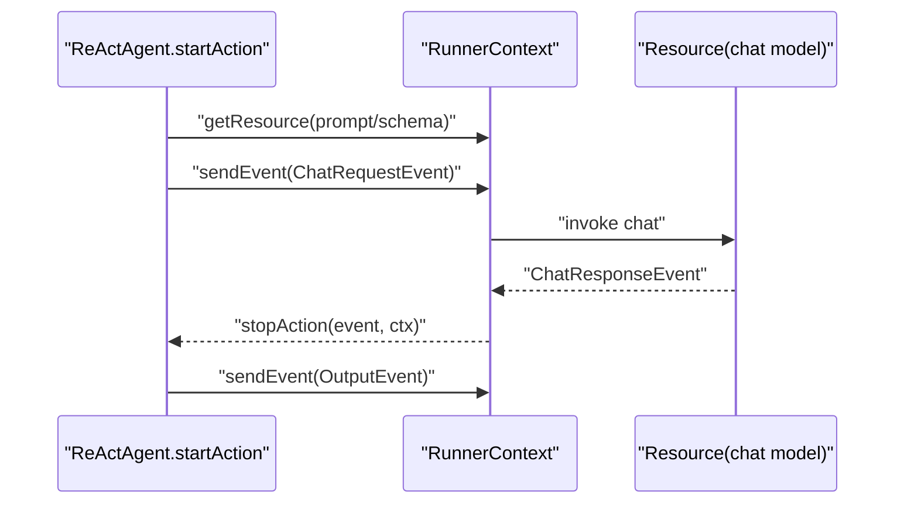
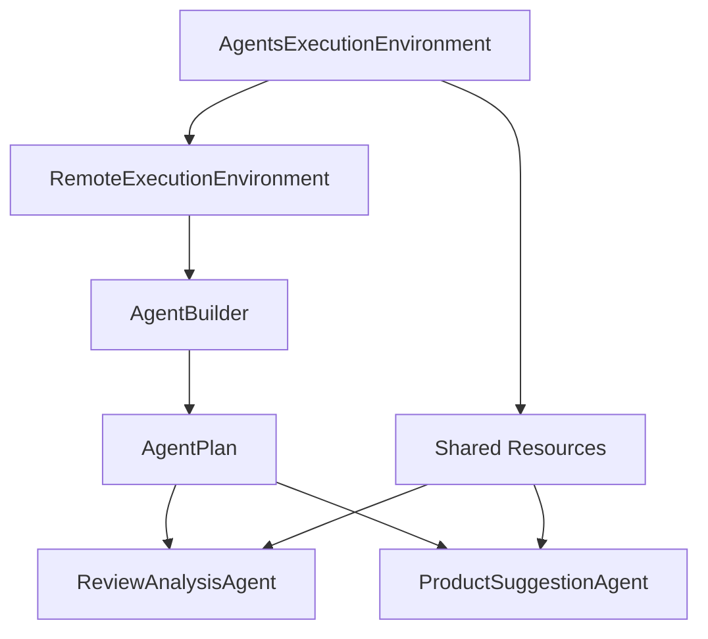

# Multi-Agent Workflows

<cite>
**Referenced Files in This Document**
- [WorkflowMultipleAgentExample.java](file://examples/src/main/java/org/apache/flink/agents/examples/WorkflowMultipleAgentExample.java)
- [ReviewAnalysisAgent.java](file://examples/src/main/java/org/apache/flink/agents/examples/agents/ReviewAnalysisAgent.java)
- [ProductSuggestionAgent.java](file://examples/src/main/java/org/apache/flink/agents/examples/agents/ProductSuggestionAgent.java)
- [CustomTypesAndResources.java](file://examples/src/main/java/org/apache/flink/agents/examples/agents/CustomTypesAndResources.java)
- [Agent.java](file://api/src/main/java/org/apache/flink/agents/api/agents/Agent.java)
- [ReActAgent.java](file://api/src/main/java/org/apache/flink/agents/api/agents/ReActAgent.java)
- [AgentsExecutionEnvironment.java](file://api/src/main/java/org/apache/flink/agents/api/AgentsExecutionEnvironment.java)
- [AgentBuilder.java](file://api/src/main/java/org/apache/flink/agents/api/AgentBuilder.java)
- [RemoteExecutionEnvironment.java](file://runtime/src/main/java/org/apache/flink/agents/runtime/env/RemoteExecutionEnvironment.java)
- [RunnerContext.java](file://api/src/main/java/org/apache/flink/agents/api/context/RunnerContext.java)
- [AgentExecutionOptions.java](file://api/src/main/java/org/apache/flink/agents/api/agents/AgentExecutionOptions.java)
- [workflow_agent.md](file://docs/content/docs/development/workflow_agent.md)
</cite>

## Table of Contents
1. [Introduction](#introduction)
2. [Project Structure](#project-structure)
3. [Core Components](#core-components)
4. [Architecture Overview](#architecture-overview)
5. [Detailed Component Analysis](#detailed-component-analysis)
6. [Dependency Analysis](#dependency-analysis)
7. [Performance Considerations](#performance-considerations)
8. [Troubleshooting Guide](#troubleshooting-guide)
9. [Conclusion](#conclusion)
10. [Appendices](#appendices)

## Introduction
This document explains how to design and implement multi-agent workflows in Flink Agents, focusing on orchestrating complex streaming pipelines with multiple cooperating agents. It documents the workflow pattern demonstrated by the example WorkflowMultipleAgentExample, covering agent composition, data flow across stages, and window-based aggregation. It also provides best practices for orchestrating different agent types (analysis, decision-making, synthesis) in streaming contexts, along with guidance on parallelism configuration, resource sharing, error handling, performance, state management, and debugging.

## Project Structure
Flink Agents exposes a streaming-first API for building agent pipelines integrated with Apache Flink. The example multi-agent workflow is implemented in the examples module, with reusable agent implementations and shared data models in the examples agents package. The core runtime and API reside in the api and runtime modules.



**Diagram sources**
- [WorkflowMultipleAgentExample.java](file://examples/src/main/java/org/apache/flink/agents/examples/WorkflowMultipleAgentExample.java#L125-L188)
- [ReviewAnalysisAgent.java](file://examples/src/main/java/org/apache/flink/agents/examples/agents/ReviewAnalysisAgent.java#L53-L132)
- [ProductSuggestionAgent.java](file://examples/src/main/java/org/apache/flink/agents/examples/agents/ProductSuggestionAgent.java#L52-L114)
- [CustomTypesAndResources.java](file://examples/src/main/java/org/apache/flink/agents/examples/agents/CustomTypesAndResources.java#L34-L265)
- [AgentsExecutionEnvironment.java](file://api/src/main/java/org/apache/flink/agents/api/AgentsExecutionEnvironment.java#L43-L223)
- [AgentBuilder.java](file://api/src/main/java/org/apache/flink/agents/api/AgentBuilder.java#L29-L77)
- [Agent.java](file://api/src/main/java/org/apache/flink/agents/api/agents/Agent.java#L34-L131)
- [ReActAgent.java](file://api/src/main/java/org/apache/flink/agents/api/agents/ReActAgent.java#L51-L183)
- [RemoteExecutionEnvironment.java](file://runtime/src/main/java/org/apache/flink/agents/runtime/env/RemoteExecutionEnvironment.java#L50-L217)
- [RunnerContext.java](file://api/src/main/java/org/apache/flink/agents/api/context/RunnerContext.java#L33-L138)
- [AgentExecutionOptions.java](file://api/src/main/java/org/apache/flink/agents/api/agents/AgentExecutionOptions.java#L23-L48)

**Section sources**
- [WorkflowMultipleAgentExample.java](file://examples/src/main/java/org/apache/flink/agents/examples/WorkflowMultipleAgentExample.java#L49-L63)
- [AgentsExecutionEnvironment.java](file://api/src/main/java/org/apache/flink/agents/api/AgentsExecutionEnvironment.java#L43-L97)

## Core Components
- AgentsExecutionEnvironment: Factory and integration bridge for Flink Streams/Tables and local execution. It manages shared resources and builds agent pipelines via AgentBuilder.
- AgentBuilder: Fluent builder to connect agents to DataStream/Table and materialize outputs.
- Agent: Base class for agents, managing actions and resources, plus error handling strategy constants.
- ReActAgent: Built-in agent implementing reasoning and tool-use patterns with structured output support.
- RunnerContext: Action-time context exposing memory, metrics, resource retrieval, and durable execution helpers.
- RemoteExecutionEnvironment: Remote execution implementation that compiles agent plans and connects them to Flink streams.

Key configuration options for orchestration:
- AgentExecutionOptions: Controls error handling strategy, retries, async threads, and async toggles for chat/tool/RAG.

**Section sources**
- [AgentsExecutionEnvironment.java](file://api/src/main/java/org/apache/flink/agents/api/AgentsExecutionEnvironment.java#L43-L223)
- [AgentBuilder.java](file://api/src/main/java/org/apache/flink/agents/api/AgentBuilder.java#L29-L77)
- [Agent.java](file://api/src/main/java/org/apache/flink/agents/api/agents/Agent.java#L34-L131)
- [ReActAgent.java](file://api/src/main/java/org/apache/flink/agents/api/agents/ReActAgent.java#L51-L183)
- [RunnerContext.java](file://api/src/main/java/org/apache/flink/agents/api/context/RunnerContext.java#L33-L138)
- [RemoteExecutionEnvironment.java](file://runtime/src/main/java/org/apache/flink/agents/runtime/env/RemoteExecutionEnvironment.java#L50-L217)
- [AgentExecutionOptions.java](file://api/src/main/java/org/apache/flink/agents/api/agents/AgentExecutionOptions.java#L23-L48)

## Architecture Overview
The multi-agent workflow integrates Flink’s streaming runtime with Flink Agents. The pipeline reads streaming input, applies an analysis agent per record, aggregates results in tumbling windows, and then applies a synthesis agent to produce actionable suggestions.



**Diagram sources**
- [WorkflowMultipleAgentExample.java](file://examples/src/main/java/org/apache/flink/agents/examples/WorkflowMultipleAgentExample.java#L125-L188)
- [RemoteExecutionEnvironment.java](file://runtime/src/main/java/org/apache/flink/agents/runtime/env/RemoteExecutionEnvironment.java#L85-L94)
- [AgentBuilder.java](file://api/src/main/java/org/apache/flink/agents/api/AgentBuilder.java#L43-L64)
- [ReviewAnalysisAgent.java](file://examples/src/main/java/org/apache/flink/agents/examples/agents/ReviewAnalysisAgent.java#L88-L131)
- [ProductSuggestionAgent.java](file://examples/src/main/java/org/apache/flink/agents/examples/agents/ProductSuggestionAgent.java#L74-L113)

## Detailed Component Analysis

### WorkflowMultipleAgentExample: Analysis → Window → Synthesis
This example demonstrates a classic analysis-aggregation-synthesis pipeline:
- Reads product reviews from a file source as a streaming DataStream.
- Applies ReviewAnalysisAgent to parse each review and extract a score and reasons.
- Windows the analysis results by product id in 1-minute tumbling windows and aggregates score distributions and reasons.
- Applies ProductSuggestionAgent to synthesize improvement suggestions based on the aggregated summary.



**Diagram sources**
- [WorkflowMultipleAgentExample.java](file://examples/src/main/java/org/apache/flink/agents/examples/WorkflowMultipleAgentExample.java#L125-L188)

**Section sources**
- [WorkflowMultipleAgentExample.java](file://examples/src/main/java/org/apache/flink/agents/examples/WorkflowMultipleAgentExample.java#L125-L188)

### ReviewAnalysisAgent: Analysis Agent
Responsibilities:
- Declares a prompt and a chat model setup for review analysis.
- Defines a tool to notify shipping managers for shipping-related issues.
- Converts InputEvent to a ChatRequestEvent and parses ChatResponseEvent into ProductReviewAnalysisRes.



**Diagram sources**
- [ReviewAnalysisAgent.java](file://examples/src/main/java/org/apache/flink/agents/examples/agents/ReviewAnalysisAgent.java#L53-L132)
- [Agent.java](file://api/src/main/java/org/apache/flink/agents/api/agents/Agent.java#L34-L131)

**Section sources**
- [ReviewAnalysisAgent.java](file://examples/src/main/java/org/apache/flink/agents/examples/agents/ReviewAnalysisAgent.java#L53-L132)

### ProductSuggestionAgent: Synthesis Agent
Responsibilities:
- Declares a prompt and a chat model setup for generating suggestions.
- Consumes ProductReviewSummary (aggregated window output) and emits ProductSuggestion.



**Diagram sources**
- [ProductSuggestionAgent.java](file://examples/src/main/java/org/apache/flink/agents/examples/agents/ProductSuggestionAgent.java#L52-L114)
- [Agent.java](file://api/src/main/java/org/apache/flink/agents/api/agents/Agent.java#L34-L131)

**Section sources**
- [ProductSuggestionAgent.java](file://examples/src/main/java/org/apache/flink/agents/examples/agents/ProductSuggestionAgent.java#L52-L114)

### Window-Based Aggregation: Score Distribution and Reasons
The example uses a ProcessWindowFunction to compute score histograms and collect reasons per product id within 1-minute windows.



**Diagram sources**
- [WorkflowMultipleAgentExample.java](file://examples/src/main/java/org/apache/flink/agents/examples/WorkflowMultipleAgentExample.java#L74-L123)

**Section sources**
- [WorkflowMultipleAgentExample.java](file://examples/src/main/java/org/apache/flink/agents/examples/WorkflowMultipleAgentExample.java#L74-L123)

### ReActAgent: Structured Reasoning and Tool Use
ReActAgent provides a ready-made pattern for structured reasoning with optional schema enforcement and tool invocation. It emits ChatRequestEvent and consumes ChatResponseEvent to produce OutputEvent.



**Diagram sources**
- [ReActAgent.java](file://api/src/main/java/org/apache/flink/agents/api/agents/ReActAgent.java#L103-L181)

**Section sources**
- [ReActAgent.java](file://api/src/main/java/org/apache/flink/agents/api/agents/ReActAgent.java#L51-L183)

### Agent Composition and Data Flow Across Stages
- Stage 1: Analysis agent consumes raw review strings and emits analysis results keyed by product id.
- Stage 2: Window aggregation computes score distributions and collects reasons per product id.
- Stage 3: Synthesis agent consumes aggregated summaries and emits improvement suggestions.

```mermaid
graph LR
A["ReviewAnalysisAgent"] --> B["Window Aggregation"]
B --> C["ProductSuggestionAgent"]
A --> |OutputEvent(ProductReviewAnalysisRes)| B
B --> |InputEvent(ProductReviewSummary)| C
C --> |OutputEvent(ProductSuggestion)| Out["Sink(Print)"]
```

**Diagram sources**
- [WorkflowMultipleAgentExample.java](file://examples/src/main/java/org/apache/flink/agents/examples/WorkflowMultipleAgentExample.java#L155-L184)
- [ReviewAnalysisAgent.java](file://examples/src/main/java/org/apache/flink/agents/examples/agents/ReviewAnalysisAgent.java#L88-L131)
- [ProductSuggestionAgent.java](file://examples/src/main/java/org/apache/flink/agents/examples/agents/ProductSuggestionAgent.java#L74-L113)

**Section sources**
- [WorkflowMultipleAgentExample.java](file://examples/src/main/java/org/apache/flink/agents/examples/WorkflowMultipleAgentExample.java#L155-L184)

### Best Practices for Orchestrating Different Agent Types
- Analysis agents: Focus on structured extraction and tool invocation; keep prompts precise and outputs parseable.
- Decision-making agents: Use short-term memory to maintain state across actions; leverage durable execution for idempotent decisions.
- Synthesis agents: Use aggregated inputs to inform higher-level recommendations; enforce output schemas for downstream compatibility.

Reference documentation on workflow agents and action patterns:
- [workflow_agent.md](file://docs/content/docs/development/workflow_agent.md#L25-L31)
- [workflow_agent.md](file://docs/content/docs/development/workflow_agent.md#L219-L282)

**Section sources**
- [workflow_agent.md](file://docs/content/docs/development/workflow_agent.md#L25-L31)
- [workflow_agent.md](file://docs/content/docs/development/workflow_agent.md#L219-L282)

### Parallelism Configuration and Resource Sharing
- Parallelism: The example sets the streaming environment parallelism to 1 for determinism; adjust based on throughput needs.
- Async threads: Limit concurrent async requests to avoid overwhelming external services (e.g., chat model servers).
- Shared resources: Register a single chat model connection resource and reuse it across agents.

Practical configuration points:
- [WorkflowMultipleAgentExample.java](file://examples/src/main/java/org/apache/flink/agents/examples/WorkflowMultipleAgentExample.java#L129-L141)
- [AgentExecutionOptions.java](file://api/src/main/java/org/apache/flink/agents/api/agents/AgentExecutionOptions.java#L33-L40)

**Section sources**
- [WorkflowMultipleAgentExample.java](file://examples/src/main/java/org/apache/flink/agents/examples/WorkflowMultipleAgentExample.java#L129-L141)
- [AgentExecutionOptions.java](file://api/src/main/java/org/apache/flink/agents/api/agents/AgentExecutionOptions.java#L33-L40)

### Error Handling in Multi-Agent Scenarios
- Error handling strategy: Choose fail/retry/ignore depending on the stage and tolerance.
- Retries: Configure max retries for robustness against transient failures.
- Async operations: Use durableExecute/durableExecuteAsync to ensure idempotent side effects and recovery.

References:
- [Agent.java](file://api/src/main/java/org/apache/flink/agents/api/agents/Agent.java#L113-L127)
- [AgentExecutionOptions.java](file://api/src/main/java/org/apache/flink/agents/api/agents/AgentExecutionOptions.java#L24-L31)
- [RunnerContext.java](file://api/src/main/java/org/apache/flink/agents/api/context/RunnerContext.java#L112-L133)

**Section sources**
- [Agent.java](file://api/src/main/java/org/apache/flink/agents/api/agents/Agent.java#L113-L127)
- [AgentExecutionOptions.java](file://api/src/main/java/org/apache/flink/agents/api/agents/AgentExecutionOptions.java#L24-L31)
- [RunnerContext.java](file://api/src/main/java/org/apache/flink/agents/api/context/RunnerContext.java#L112-L133)

### Common Workflow Patterns
- Analysis-aggregation-synthesis: Implemented in the example.
- Decision trees with multiple agents: Compose agents where outputs feed into conditional branches; use short-term memory to track decision state.
- Feedback loops: Use long-term memory to persist insights and feed them back into upstream agents for refinement.

Reference:
- [workflow_agent.md](file://docs/content/docs/development/workflow_agent.md#L25-L31)

**Section sources**
- [workflow_agent.md](file://docs/content/docs/development/workflow_agent.md#L25-L31)

### State Management Across Agent Boundaries
- Short-term memory: Per-record or per-key transient state for coordination between actions.
- Long-term memory: Persistent storage for cross-run state and feedback.
- Sensory memory: Auto-cleared temporary state.

References:
- [RunnerContext.java](file://api/src/main/java/org/apache/flink/agents/api/context/RunnerContext.java#L40-L65)

**Section sources**
- [RunnerContext.java](file://api/src/main/java/org/apache/flink/agents/api/context/RunnerContext.java#L40-L65)

### Debugging Multi-Agent Interactions
- Enable durable execution for side-effecting steps to simplify replay and debugging.
- Use structured output and strict schemas to surface parsing errors early.
- Monitor metrics via the agent metric groups exposed in RunnerContext.

References:
- [workflow_agent.md](file://docs/content/docs/development/workflow_agent.md#L284-L303)
- [RunnerContext.java](file://api/src/main/java/org/apache/flink/agents/api/context/RunnerContext.java#L67-L79)

**Section sources**
- [workflow_agent.md](file://docs/content/docs/development/workflow_agent.md#L284-L303)
- [RunnerContext.java](file://api/src/main/java/org/apache/flink/agents/api/context/RunnerContext.java#L67-L79)

## Dependency Analysis
The multi-agent pipeline depends on the execution environment to compile agent plans and connect them to Flink streams. Resources are shared across agents via the environment.



**Diagram sources**
- [AgentsExecutionEnvironment.java](file://api/src/main/java/org/apache/flink/agents/api/AgentsExecutionEnvironment.java#L68-L97)
- [RemoteExecutionEnvironment.java](file://runtime/src/main/java/org/apache/flink/agents/runtime/env/RemoteExecutionEnvironment.java#L172-L182)
- [AgentBuilder.java](file://api/src/main/java/org/apache/flink/agents/api/AgentBuilder.java#L43-L64)
- [Agent.java](file://api/src/main/java/org/apache/flink/agents/api/agents/Agent.java#L83-L111)

**Section sources**
- [AgentsExecutionEnvironment.java](file://api/src/main/java/org/apache/flink/agents/api/AgentsExecutionEnvironment.java#L68-L97)
- [RemoteExecutionEnvironment.java](file://runtime/src/main/java/org/apache/flink/agents/runtime/env/RemoteExecutionEnvironment.java#L172-L182)

## Performance Considerations
- Concurrency: Tune NUM_ASYNC_THREADS and async toggles to balance throughput and resource contention.
- Backpressure: Use windowing and keyed streams to bound state and control parallelism.
- Serialization: Keep event payloads compact and JSON-compatible for efficient serialization.
- External service limits: Cap async threads and rate-limit chat/tool calls to avoid overload.

References:
- [AgentExecutionOptions.java](file://api/src/main/java/org/apache/flink/agents/api/agents/AgentExecutionOptions.java#L33-L46)

**Section sources**
- [AgentExecutionOptions.java](file://api/src/main/java/org/apache/flink/agents/api/agents/AgentExecutionOptions.java#L33-L46)

## Troubleshooting Guide
- Missing or invalid structured output: Ensure prompts enforce schema and handle parsing errors gracefully.
- Transient failures: Increase retries and configure error handling strategy appropriately.
- Recovery correctness: Use durableExecute/durableExecuteAsync for non-idempotent operations; ensure deterministic call signatures.

References:
- [AgentExecutionOptions.java](file://api/src/main/java/org/apache/flink/agents/api/agents/AgentExecutionOptions.java#L24-L31)
- [RunnerContext.java](file://api/src/main/java/org/apache/flink/agents/api/context/RunnerContext.java#L112-L133)

**Section sources**
- [AgentExecutionOptions.java](file://api/src/main/java/org/apache/flink/agents/api/agents/AgentExecutionOptions.java#L24-L31)
- [RunnerContext.java](file://api/src/main/java/org/apache/flink/agents/api/context/RunnerContext.java#L112-L133)

## Conclusion
Flink Agents enables robust, streaming-first multi-agent workflows by composing specialized agents across analysis, aggregation, and synthesis stages. The example pipeline illustrates how to structure data flow, manage state, and orchestrate asynchronous operations while maintaining reliability through durable execution and configurable error handling.

## Appendices
- Example prompts and data models used in the workflow:
  - [CustomTypesAndResources.java](file://examples/src/main/java/org/apache/flink/agents/examples/agents/CustomTypesAndResources.java#L36-L94)
- Additional documentation on workflow agents and actions:
  - [workflow_agent.md](file://docs/content/docs/development/workflow_agent.md#L25-L31)