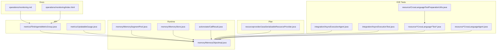
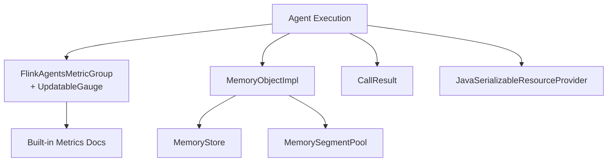
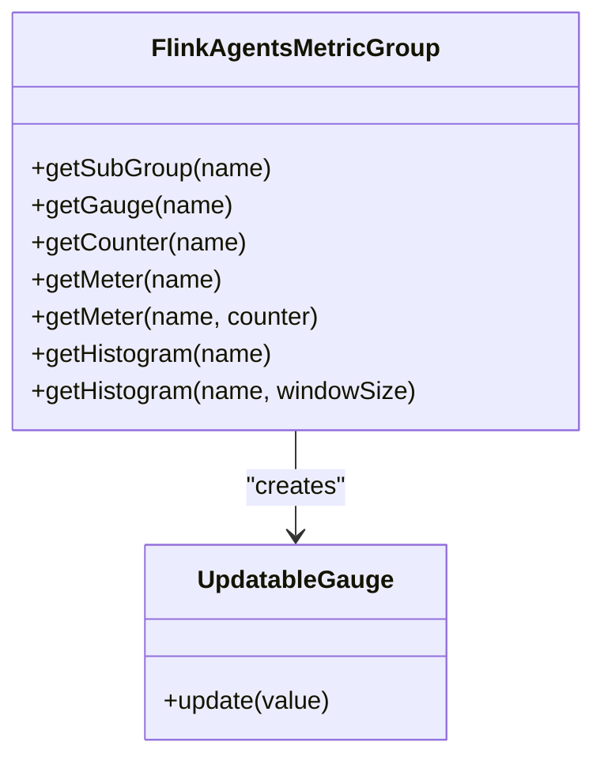
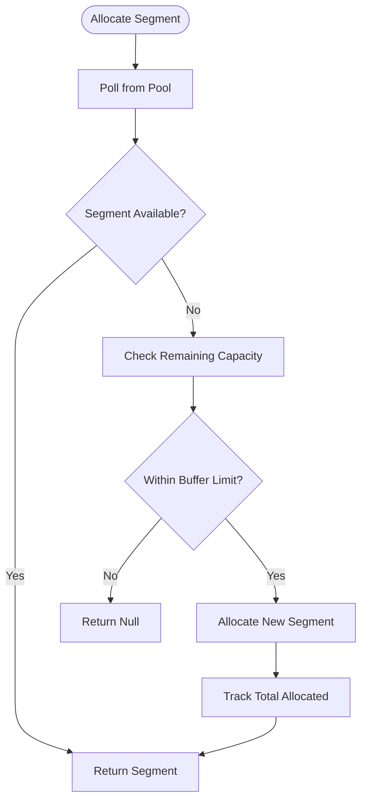
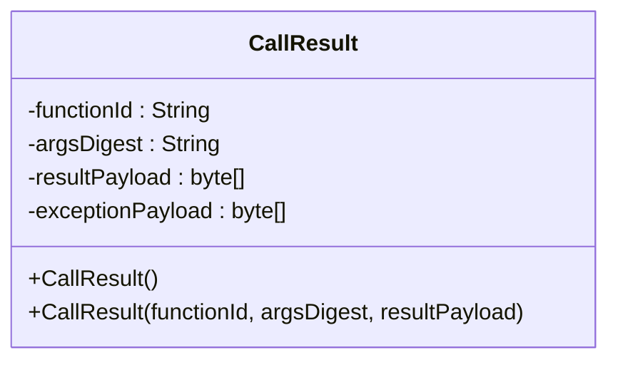
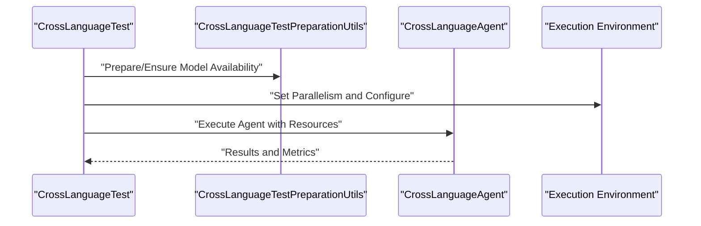
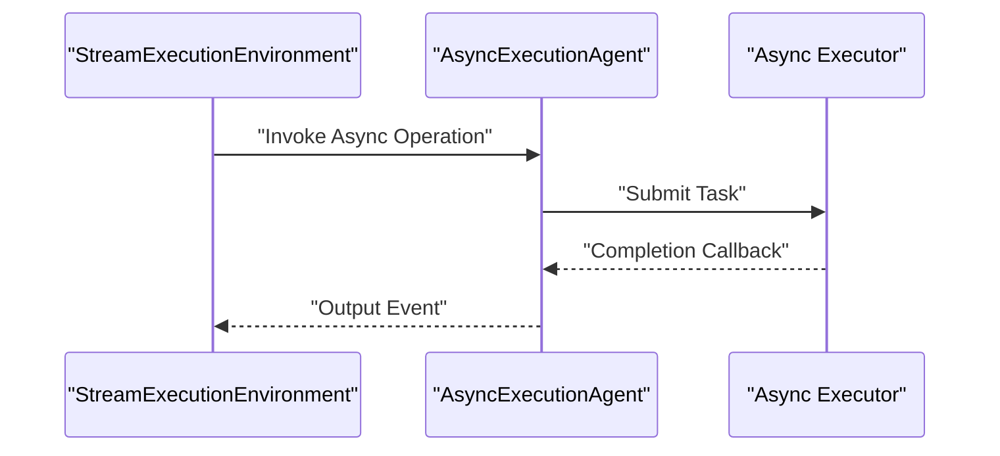
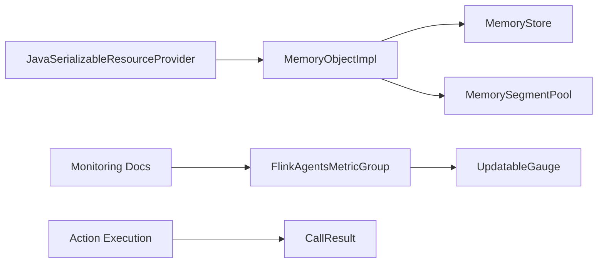

# Performance Optimization

<cite>
**Referenced Files in This Document**
- [FlinkAgentsMetricGroup.java](file://api/src/main/java/org/apache/flink/agents/api/metrics/FlinkAgentsMetricGroup.java)
- [UpdatableGauge.java](file://api/src/main/java/org/apache/flink/agents/api/metrics/UpdatableGauge.java)
- [MemorySegmentPool.java](file://runtime/src/main/java/org/apache/flink/agents/runtime/memory/MemorySegmentPool.java)
- [MemoryStore.java](file://runtime/src/main/java/org/apache/flink/agents/runtime/memory/MemoryStore.java)
- [MemoryObjectImpl.java](file://runtime/src/main/java/org/apache/flink/agents/runtime/memory/MemoryObjectImpl.java)
- [CallResult.java](file://runtime/src/main/java/org/apache/flink/agents/runtime/actionstate/CallResult.java)
- [monitoring.md](file://docs/content/docs/operations/monitoring.md)
- [monitoring.html](file://docs/public/docs/operations/monitoring/index.html)
- [AsyncExecutionAgent.java](file://e2e-test/flink-agents-end-to-end-tests-integration/src/test/java/org/apache/flink/agents/integration/test/AsyncExecutionAgent.java)
- [AsyncExecutionTest.java](file://e2e-test/flink-agents-end-to-end-tests-integration/src/test/java/org/apache/flink/agents/integration/test/AsyncExecutionTest.java)
- [EmbeddingCrossLanguageTest.java](file://e2e-test/flink-agents-end-to-end-tests-resource-cross-language/src/test/java/org/apache/flink/agents/resource/test/EmbeddingCrossLanguageTest.java)
- [CrossLanguageTestPreparationUtils.java](file://e2e-test/flink-agents-end-to-end-tests-resource-cross-language/src/test/java/org/apache/flink/agents/resource/test/CrossLanguageTestPreparationUtils.java)
- [MCPCrossLanguageAgent.java](file://e2e-test/flink-agents-end-to-end-tests-resource-cross-language/src/test/java/org/apache/flink/agents/resource/test/MCPCrossLanguageAgent.java)
- [JavaSerializableResourceProvider.java](file://plan/src/main/java/org/apache/flink/agents/plan/resourceprovider/JavaSerializableResourceProvider.java)
</cite>

## Table of Contents
1. [Introduction](#introduction)
2. [Project Structure](#project-structure)
3. [Core Components](#core-components)
4. [Architecture Overview](#architecture-overview)
5. [Detailed Component Analysis](#detailed-component-analysis)
6. [Dependency Analysis](#dependency-analysis)
7. [Performance Considerations](#performance-considerations)
8. [Troubleshooting Guide](#troubleshooting-guide)
9. [Conclusion](#conclusion)
10. [Appendices](#appendices)

## Introduction
This document focuses on performance optimization techniques for Flink Agents. It covers metrics collection and monitoring, profiling methodologies, memory management, parallelism and operator optimization, cross-language communication overhead, serialization/deserialization efficiency, network latency minimization, scaling and load balancing, capacity planning, benchmarking and continuous monitoring, and common anti-patterns with their solutions.

## Project Structure
Flink Agents separates concerns across API, Runtime, Plan, Integrations, Examples, and E2E tests. Performance-relevant areas include:
- Metrics API and runtime metric groups
- Memory subsystem (object model, storage, and pooling)
- Action state and call result serialization
- Cross-language resource providers and tests
- Monitoring documentation and built-in metrics

**Diagram sources**
- [FlinkAgentsMetricGroup.java](file://api/src/main/java/org/apache/flink/agents/api/metrics/FlinkAgentsMetricGroup.java#L30-L92)
- [UpdatableGauge.java](file://api/src/main/java/org/apache/flink/agents/api/metrics/UpdatableGauge.java#L24-L37)
- [MemorySegmentPool.java](file://runtime/src/main/java/org/apache/flink/agents/runtime/memory/MemorySegmentPool.java#L35-L106)
- [MemoryStore.java](file://runtime/src/main/java/org/apache/flink/agents/runtime/memory/MemoryStore.java#L22-L51)
- [MemoryObjectImpl.java](file://runtime/src/main/java/org/apache/flink/agents/runtime/memory/MemoryObjectImpl.java#L33-L260)
- [CallResult.java](file://runtime/src/main/java/org/apache/flink/agents/runtime/actionstate/CallResult.java#L37-L69)
- [JavaSerializableResourceProvider.java](file://plan/src/main/java/org/apache/flink/agents/plan/resourceprovider/JavaSerializableResourceProvider.java#L36-L62)
- [AsyncExecutionAgent.java](file://e2e-test/flink-agents-end-to-end-tests-integration/src/test/java/org/apache/flink/agents/integration/test/AsyncExecutionAgent.java#L279-L301)
- [AsyncExecutionTest.java](file://e2e-test/flink-agents-end-to-end-tests-integration/src/test/java/org/apache/flink/agents/integration/test/AsyncExecutionTest.java#L274-L308)
- [EmbeddingCrossLanguageTest.java](file://e2e-test/flink-agents-end-to-end-tests-resource-cross-language/src/test/java/org/apache/flink/agents/resource/test/EmbeddingCrossLanguageTest.java#L29-L51)
- [CrossLanguageTestPreparationUtils.java](file://e2e-test/flink-agents-end-to-end-tests-resource-cross-language/src/test/java/org/apache/flink/agents/resource/test/CrossLanguageTestPreparationUtils.java#L1-L29)
- [MCPCrossLanguageAgent.java](file://e2e-test/flink-agents-end-to-end-tests-resource-cross-language/src/test/java/org/apache/flink/agents/resource/test/MCPCrossLanguageAgent.java#L74-L84)
- [monitoring.md](file://docs/content/docs/operations/monitoring.md#L25-L40)
- [monitoring.html](file://docs/public/docs/operations/monitoring/index.html#L680-L716)

**Section sources**
- [FlinkAgentsMetricGroup.java](file://api/src/main/java/org/apache/flink/agents/api/metrics/FlinkAgentsMetricGroup.java#L26-L92)
- [UpdatableGauge.java](file://api/src/main/java/org/apache/flink/agents/api/metrics/UpdatableGauge.java#L24-L37)
- [MemorySegmentPool.java](file://runtime/src/main/java/org/apache/flink/agents/runtime/memory/MemorySegmentPool.java#L29-L106)
- [MemoryStore.java](file://runtime/src/main/java/org/apache/flink/agents/runtime/memory/MemoryStore.java#L22-L51)
- [MemoryObjectImpl.java](file://runtime/src/main/java/org/apache/flink/agents/runtime/memory/MemoryObjectImpl.java#L33-L260)
- [CallResult.java](file://runtime/src/main/java/org/apache/flink/agents/runtime/actionstate/CallResult.java#L37-L69)
- [JavaSerializableResourceProvider.java](file://plan/src/main/java/org/apache/flink/agents/plan/resourceprovider/JavaSerializableResourceProvider.java#L36-L62)
- [monitoring.md](file://docs/content/docs/operations/monitoring.md#L25-L40)
- [monitoring.html](file://docs/public/docs/operations/monitoring/index.html#L680-L716)

## Core Components
- Metrics API: Provides metric group creation for counters, meters, histograms, and gauges, including an updatable gauge abstraction for dynamic values.
- Memory Management: Pool-based memory segments with bounded buffer sizing, plus a structured memory object model with updates and persistence hooks.
- Serialization/Deserialization: CallResult encapsulates serialized outcomes and exceptions for deterministic recovery and validation.
- Cross-Language Resources: Serializable resource providers enable efficient sharing of Java resources across language boundaries.
- Monitoring: Built-in metrics for events, actions, and token usage are documented for operational visibility.

**Section sources**
- [FlinkAgentsMetricGroup.java](file://api/src/main/java/org/apache/flink/agents/api/metrics/FlinkAgentsMetricGroup.java#L30-L92)
- [UpdatableGauge.java](file://api/src/main/java/org/apache/flink/agents/api/metrics/UpdatableGauge.java#L24-L37)
- [MemorySegmentPool.java](file://runtime/src/main/java/org/apache/flink/agents/runtime/memory/MemorySegmentPool.java#L35-L106)
- [MemoryObjectImpl.java](file://runtime/src/main/java/org/apache/flink/agents/runtime/memory/MemoryObjectImpl.java#L33-L260)
- [CallResult.java](file://runtime/src/main/java/org/apache/flink/agents/runtime/actionstate/CallResult.java#L37-L69)
- [JavaSerializableResourceProvider.java](file://plan/src/main/java/org/apache/flink/agents/plan/resourceprovider/JavaSerializableResourceProvider.java#L36-L62)
- [monitoring.md](file://docs/content/docs/operations/monitoring.md#L25-L40)

## Architecture Overview
The performance-critical path involves:
- Metrics collection via FlinkAgentsMetricGroup and UpdatableGauge
- Memory operations through MemoryObjectImpl backed by MemoryStore and MemorySegmentPool
- Action execution and state via CallResult serialization
- Cross-language resource provisioning via JavaSerializableResourceProvider
- Built-in monitoring for throughput and token usage

**Diagram sources**
- [FlinkAgentsMetricGroup.java](file://api/src/main/java/org/apache/flink/agents/api/metrics/FlinkAgentsMetricGroup.java#L30-L92)
- [UpdatableGauge.java](file://api/src/main/java/org/apache/flink/agents/api/metrics/UpdatableGauge.java#L24-L37)
- [MemoryObjectImpl.java](file://runtime/src/main/java/org/apache/flink/agents/runtime/memory/MemoryObjectImpl.java#L33-L260)
- [MemoryStore.java](file://runtime/src/main/java/org/apache/flink/agents/runtime/memory/MemoryStore.java#L22-L51)
- [MemorySegmentPool.java](file://runtime/src/main/java/org/apache/flink/agents/runtime/memory/MemorySegmentPool.java#L35-L106)
- [CallResult.java](file://runtime/src/main/java/org/apache/flink/agents/runtime/actionstate/CallResult.java#L37-L69)
- [JavaSerializableResourceProvider.java](file://plan/src/main/java/org/apache/flink/agents/plan/resourceprovider/JavaSerializableResourceProvider.java#L36-L62)
- [monitoring.md](file://docs/content/docs/operations/monitoring.md#L25-L40)

## Detailed Component Analysis

### Metrics Collection and Built-in Action Metrics
- FlinkAgentsMetricGroup exposes subgroups, counters, meters, histograms, and gauges. The UpdatableGauge interface enables dynamic value updates, ensuring consistent string-based values for cross-language compatibility.
- Built-in metrics include counts and rates for events and actions, enabling operators to monitor throughput and action execution rates.

**Diagram sources**
- [FlinkAgentsMetricGroup.java](file://api/src/main/java/org/apache/flink/agents/api/metrics/FlinkAgentsMetricGroup.java#L30-L92)
- [UpdatableGauge.java](file://api/src/main/java/org/apache/flink/agents/api/metrics/UpdatableGauge.java#L24-L37)

**Section sources**
- [FlinkAgentsMetricGroup.java](file://api/src/main/java/org/apache/flink/agents/api/metrics/FlinkAgentsMetricGroup.java#L30-L92)
- [UpdatableGauge.java](file://api/src/main/java/org/apache/flink/agents/api/metrics/UpdatableGauge.java#L24-L37)
- [monitoring.md](file://docs/content/docs/operations/monitoring.md#L25-L40)
- [monitoring.html](file://docs/public/docs/operations/monitoring/index.html#L680-L716)

### Memory Management Optimization
- MemorySegmentPool provides pooled, fixed-size segments with a configurable in-memory buffer size. It ensures bounded memory growth by freeing excess segments when exceeding limits or returning segments to the pool otherwise.
- MemoryObjectImpl models nested objects and values, tracks updates, and supports thread-safety checks via a mailbox thread checker. It constructs parent nodes on demand and prevents overwriting objects with values.
- MemoryStore defines the contract for get/put/contains/clear operations, enabling caching layers and persistence strategies.

**Diagram sources**
- [MemorySegmentPool.java](file://runtime/src/main/java/org/apache/flink/agents/runtime/memory/MemorySegmentPool.java#L48-L105)

**Section sources**
- [MemorySegmentPool.java](file://runtime/src/main/java/org/apache/flink/agents/runtime/memory/MemorySegmentPool.java#L35-L106)
- [MemoryObjectImpl.java](file://runtime/src/main/java/org/apache/flink/agents/runtime/memory/MemoryObjectImpl.java#L33-L260)
- [MemoryStore.java](file://runtime/src/main/java/org/apache/flink/agents/runtime/memory/MemoryStore.java#L22-L51)

### Serialization and Action State
- CallResult encapsulates serialized return values and exceptions, along with a function identifier and argument digest for recovery validation. This reduces overhead by avoiding repeated computation and enables deterministic replay.

**Diagram sources**
- [CallResult.java](file://runtime/src/main/java/org/apache/flink/agents/runtime/actionstate/CallResult.java#L37-L69)

**Section sources**
- [CallResult.java](file://runtime/src/main/java/org/apache/flink/agents/runtime/actionstate/CallResult.java#L37-L69)

### Cross-Language Communication Overhead
- JavaSerializableResourceProvider serializes Java resources for cross-language execution, reducing repeated initialization costs and enabling efficient sharing of heavy resources.
- Cross-language tests demonstrate controlled parallelism and environment preparation to minimize cold starts and improve throughput.

**Diagram sources**
- [CrossLanguageTestPreparationUtils.java](file://e2e-test/flink-agents-end-to-end-tests-resource-cross-language/src/test/java/org/apache/flink/agents/resource/test/CrossLanguageTestPreparationUtils.java#L1-L29)
- [EmbeddingCrossLanguageTest.java](file://e2e-test/flink-agents-end-to-end-tests-resource-cross-language/src/test/java/org/apache/flink/agents/resource/test/EmbeddingCrossLanguageTest.java#L29-L51)
- [MCPCrossLanguageAgent.java](file://e2e-test/flink-agents-end-to-end-tests-resource-cross-language/src/test/java/org/apache/flink/agents/resource/test/MCPCrossLanguageAgent.java#L74-L84)
- [JavaSerializableResourceProvider.java](file://plan/src/main/java/org/apache/flink/agents/plan/resourceprovider/JavaSerializableResourceProvider.java#L36-L62)

**Section sources**
- [JavaSerializableResourceProvider.java](file://plan/src/main/java/org/apache/flink/agents/plan/resourceprovider/JavaSerializableResourceProvider.java#L36-L62)
- [EmbeddingCrossLanguageTest.java](file://e2e-test/flink-agents-end-to-end-tests-resource-cross-language/src/test/java/org/apache/flink/agents/resource/test/EmbeddingCrossLanguageTest.java#L29-L51)
- [CrossLanguageTestPreparationUtils.java](file://e2e-test/flink-agents-end-to-end-tests-resource-cross-language/src/test/java/org/apache/flink/agents/resource/test/CrossLanguageTestPreparationUtils.java#L1-L29)
- [MCPCrossLanguageAgent.java](file://e2e-test/flink-agents-end-to-end-tests-resource-cross-language/src/test/java/org/apache/flink/agents/resource/test/MCPCrossLanguageAgent.java#L74-L84)

### Parallelism, Operator Optimization, and Resource Allocation
- Asynchronous execution tests demonstrate overlapping execution windows and throughput gains with appropriate parallelism. Operators can leverage asynchronous patterns to reduce idle time.
- Cross-language tests set parallelism to 1 initially to stabilize environments; production deployments should tune parallelism based on CPU, memory, and I/O characteristics.

**Diagram sources**
- [AsyncExecutionAgent.java](file://e2e-test/flink-agents-end-to-end-tests-integration/src/test/java/org/apache/flink/agents/integration/test/AsyncExecutionAgent.java#L279-L301)
- [AsyncExecutionTest.java](file://e2e-test/flink-agents-end-to-end-tests-integration/src/test/java/org/apache/flink/agents/integration/test/AsyncExecutionTest.java#L274-L308)

**Section sources**
- [AsyncExecutionAgent.java](file://e2e-test/flink-agents-end-to-end-tests-integration/src/test/java/org/apache/flink/agents/integration/test/AsyncExecutionAgent.java#L279-L301)
- [AsyncExecutionTest.java](file://e2e-test/flink-agents-end-to-end-tests-integration/src/test/java/org/apache/flink/agents/integration/test/AsyncExecutionTest.java#L274-L308)
- [EmbeddingCrossLanguageTest.java](file://e2e-test/flink-agents-end-to-end-tests-resource-cross-language/src/test/java/org/apache/flink/agents/resource/test/EmbeddingCrossLanguageTest.java#L29-L51)

## Dependency Analysis
- Metrics depend on Flink’s metric abstractions and are exposed through FlinkAgentsMetricGroup and UpdatableGauge.
- Memory operations depend on MemoryStore and MemorySegmentPool; MemoryObjectImpl orchestrates updates and parent node construction.
- Action state depends on CallResult for deterministic serialization.
- Cross-language resource sharing depends on JavaSerializableResourceProvider.
- Monitoring documentation enumerates built-in metrics for operators and actions.

**Diagram sources**
- [FlinkAgentsMetricGroup.java](file://api/src/main/java/org/apache/flink/agents/api/metrics/FlinkAgentsMetricGroup.java#L30-L92)
- [UpdatableGauge.java](file://api/src/main/java/org/apache/flink/agents/api/metrics/UpdatableGauge.java#L24-L37)
- [MemoryObjectImpl.java](file://runtime/src/main/java/org/apache/flink/agents/runtime/memory/MemoryObjectImpl.java#L33-L260)
- [MemoryStore.java](file://runtime/src/main/java/org/apache/flink/agents/runtime/memory/MemoryStore.java#L22-L51)
- [MemorySegmentPool.java](file://runtime/src/main/java/org/apache/flink/agents/runtime/memory/MemorySegmentPool.java#L35-L106)
- [CallResult.java](file://runtime/src/main/java/org/apache/flink/agents/runtime/actionstate/CallResult.java#L37-L69)
- [JavaSerializableResourceProvider.java](file://plan/src/main/java/org/apache/flink/agents/plan/resourceprovider/JavaSerializableResourceProvider.java#L36-L62)
- [monitoring.md](file://docs/content/docs/operations/monitoring.md#L25-L40)

**Section sources**
- [FlinkAgentsMetricGroup.java](file://api/src/main/java/org/apache/flink/agents/api/metrics/FlinkAgentsMetricGroup.java#L30-L92)
- [UpdatableGauge.java](file://api/src/main/java/org/apache/flink/agents/api/metrics/UpdatableGauge.java#L24-L37)
- [MemoryObjectImpl.java](file://runtime/src/main/java/org/apache/flink/agents/runtime/memory/MemoryObjectImpl.java#L33-L260)
- [MemoryStore.java](file://runtime/src/main/java/org/apache/flink/agents/runtime/memory/MemoryStore.java#L22-L51)
- [MemorySegmentPool.java](file://runtime/src/main/java/org/apache/flink/agents/runtime/memory/MemorySegmentPool.java#L35-L106)
- [CallResult.java](file://runtime/src/main/java/org/apache/flink/agents/runtime/actionstate/CallResult.java#L37-L69)
- [JavaSerializableResourceProvider.java](file://plan/src/main/java/org/apache/flink/agents/plan/resourceprovider/JavaSerializableResourceProvider.java#L36-L62)
- [monitoring.md](file://docs/content/docs/operations/monitoring.md#L25-L40)

## Performance Considerations
- Metrics-driven observability: Track event and action counts/rates to identify saturation points and bottlenecks.
- Memory pooling: Tune in-memory buffer size to balance allocation overhead against GC pressure; ensure segments are returned promptly to avoid overdrafts.
- Serialization efficiency: Prefer CallResult reuse and compact payloads; avoid unnecessary deep copies.
- Cross-language overhead: Pre-warm resources and reuse providers; minimize inter-process handoffs.
- Parallelism tuning: Increase parallelism cautiously; monitor backpressure and resource contention; validate with async execution tests.
- Network latency: Batch requests where feasible; align parallelism with downstream throughput; leverage built-in metrics for SLA tracking.

[No sources needed since this section provides general guidance]

## Troubleshooting Guide
- Bottleneck identification: Use built-in metrics (events/actions per second) to detect slowdowns; correlate with memory pool exhaustion or serialization overhead.
- Memory leaks: Verify segments are released; ensure MemoryObjectImpl updates are persisted and parents are constructed only when needed.
- Cross-language failures: Confirm resource availability and environment setup; validate parallelism settings.
- Recovery validation: Ensure CallResult argument digests match expectations to prevent invalid state restoration.

**Section sources**
- [monitoring.md](file://docs/content/docs/operations/monitoring.md#L25-L40)
- [MemorySegmentPool.java](file://runtime/src/main/java/org/apache/flink/agents/runtime/memory/MemorySegmentPool.java#L66-L74)
- [MemoryObjectImpl.java](file://runtime/src/main/java/org/apache/flink/agents/runtime/memory/MemoryObjectImpl.java#L205-L225)
- [CallResult.java](file://runtime/src/main/java/org/apache/flink/agents/runtime/actionstate/CallResult.java#L37-L69)
- [CrossLanguageTestPreparationUtils.java](file://e2e-test/flink-agents-end-to-end-tests-resource-cross-language/src/test/java/org/apache/flink/agents/resource/test/CrossLanguageTestPreparationUtils.java#L1-L29)

## Conclusion
Optimizing Flink Agents performance hinges on robust metrics collection, disciplined memory management, efficient serialization, and tuned parallelism. By leveraging built-in metrics, memory pools, deterministic action state, and cross-language resource providers, teams can achieve scalable, low-latency agent execution while maintaining reliability and observability.

[No sources needed since this section summarizes without analyzing specific files]

## Appendices

### Benchmarking Methodologies and Continuous Monitoring
- Establish baselines using built-in metrics (counts and rates) and memory pool utilization.
- Run async execution tests to measure concurrency gains and identify contention.
- Monitor cross-language test throughput and resource reuse to quantify overhead reduction.
- Continuously track token usage and action latency to maintain SLAs.

**Section sources**
- [monitoring.md](file://docs/content/docs/operations/monitoring.md#L25-L40)
- [AsyncExecutionTest.java](file://e2e-test/flink-agents-end-to-end-tests-integration/src/test/java/org/apache/flink/agents/integration/test/AsyncExecutionTest.java#L274-L308)
- [EmbeddingCrossLanguageTest.java](file://e2e-test/flink-agents-end-to-end-tests-resource-cross-language/src/test/java/org/apache/flink/agents/resource/test/EmbeddingCrossLanguageTest.java#L29-L51)