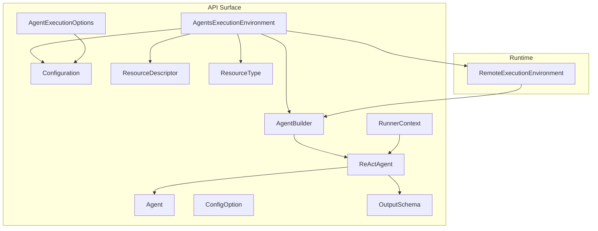
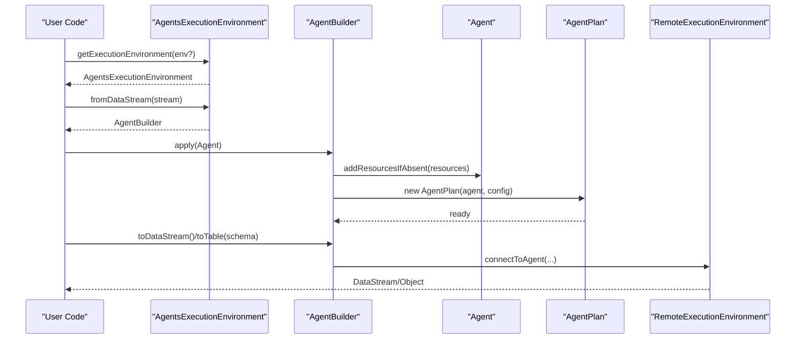
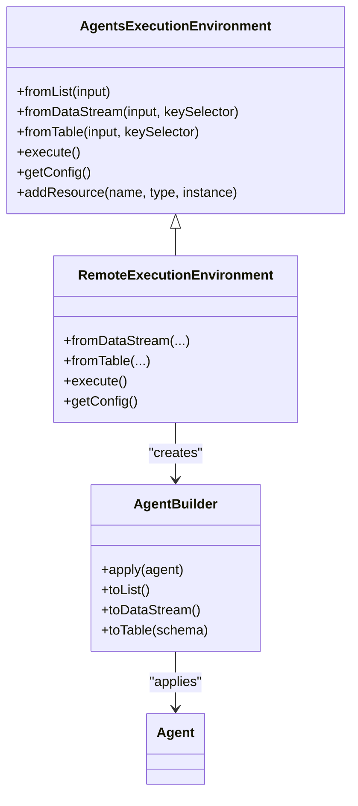
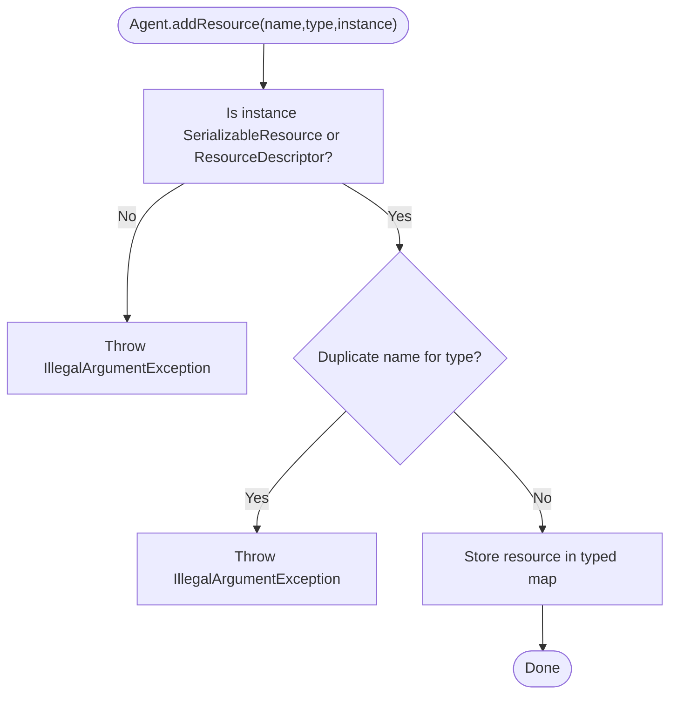
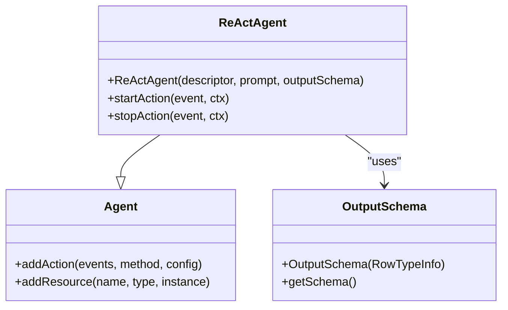
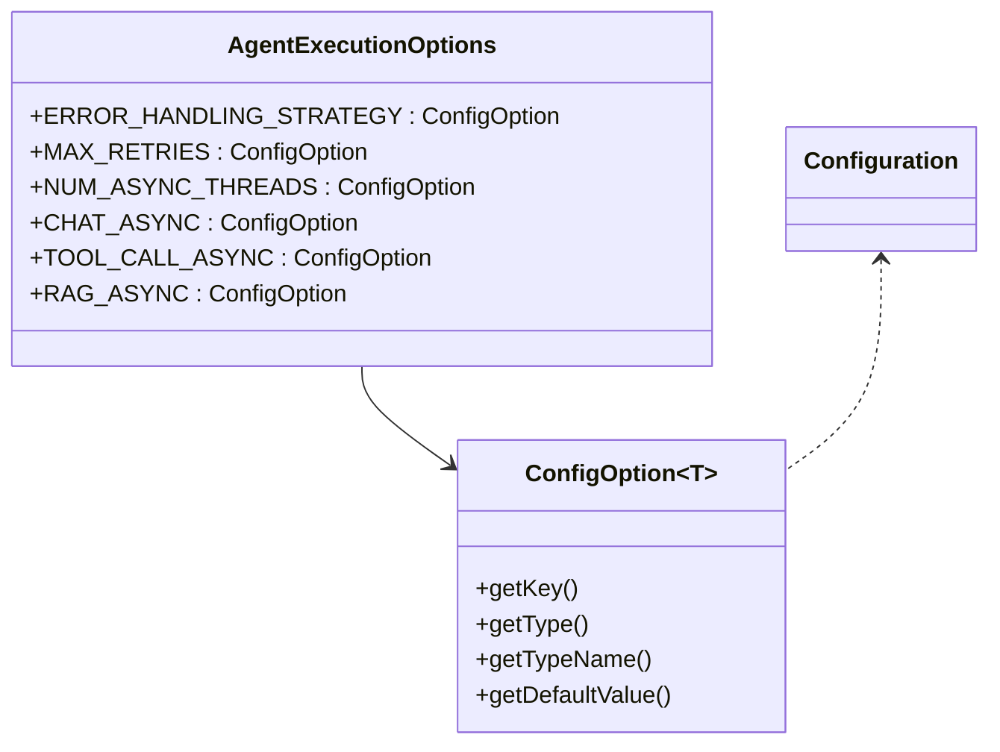
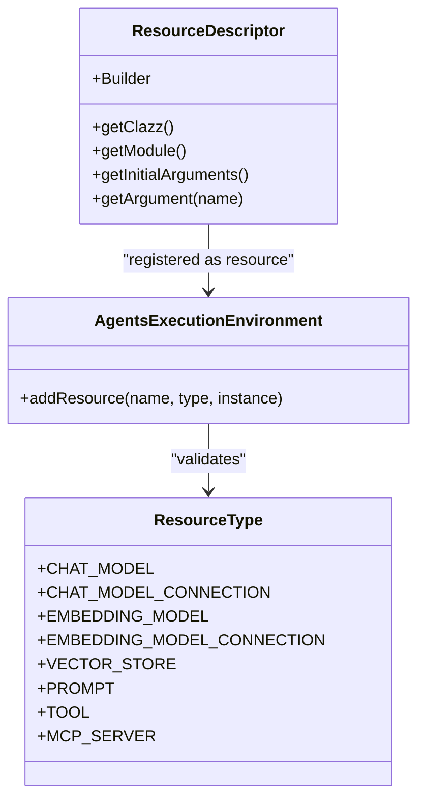
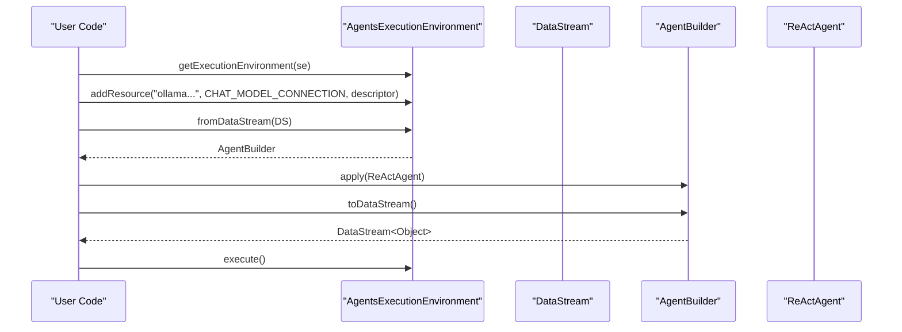
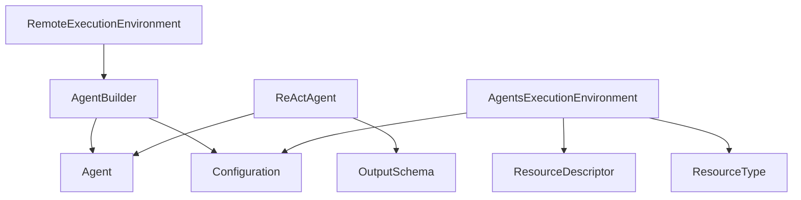

# Agent Builder and Configuration

<cite>
**Referenced Files in This Document**
- [AgentBuilder.java](file://api/src/main/java/org/apache/flink/agents/api/AgentBuilder.java)
- [AgentsExecutionEnvironment.java](file://api/src/main/java/org/apache/flink/agents/api/AgentsExecutionEnvironment.java)
- [Agent.java](file://api/src/main/java/org/apache/flink/agents/api/agents/Agent.java)
- [ReActAgent.java](file://api/src/main/java/org/apache/flink/agents/api/agents/ReActAgent.java)
- [AgentExecutionOptions.java](file://api/src/main/java/org/apache/flink/agents/api/agents/AgentExecutionOptions.java)
- [OutputSchema.java](file://api/src/main/java/org/apache/flink/agents/api/agents/OutputSchema.java)
- [Configuration.java](file://api/src/main/java/org/apache/flink/agents/api/configuration/Configuration.java)
- [ConfigOption.java](file://api/src/main/java/org/apache/flink/agents/api/configuration/ConfigOption.java)
- [ResourceDescriptor.java](file://api/src/main/java/org/apache/flink/agents/api/resource/ResourceDescriptor.java)
- [ResourceType.java](file://api/src/main/java/org/apache/flink/agents/api/resource/ResourceType.java)
- [RunnerContext.java](file://api/src/main/java/org/apache/flink/agents/api/context/RunnerContext.java)
- [RemoteExecutionEnvironment.java](file://runtime/src/main/java/org/apache/flink/agents/runtime/env/RemoteExecutionEnvironment.java)
- [ReActAgentExample.java](file://examples/src/main/java/org/apache/flink/agents/examples/ReActAgentExample.java)
- [WorkflowSingleAgentExample.java](file://examples/src/main/java/org/apache/flink/agents/examples/WorkflowSingleAgentExample.java)
</cite>

## Table of Contents
1. [Introduction](#introduction)
2. [Project Structure](#project-structure)
3. [Core Components](#core-components)
4. [Architecture Overview](#architecture-overview)
5. [Detailed Component Analysis](#detailed-component-analysis)
6. [Dependency Analysis](#dependency-analysis)
7. [Performance Considerations](#performance-considerations)
8. [Troubleshooting Guide](#troubleshooting-guide)
9. [Conclusion](#conclusion)

## Introduction
This document explains the AgentBuilder fluent API and agent configuration in Flink Agents. It focuses on how to construct agents using a fluent builder pattern, configure execution parameters, bind resources, specify output schemas, and validate parameters for type safety and error handling. Practical examples demonstrate builder configurations for different agent types, along with best practices for resource management and performance optimization.

## Project Structure
Flink Agents exposes a clean separation between the API surface (builder, agents, configuration, and resources) and the runtime implementation (local and remote environments). The API defines the contract for building and executing agents, while the runtime integrates with Flink’s DataStream/Table ecosystems.

**Diagram sources**
- [AgentsExecutionEnvironment.java](file://api/src/main/java/org/apache/flink/agents/api/AgentsExecutionEnvironment.java#L43-L222)
- [AgentBuilder.java](file://api/src/main/java/org/apache/flink/agents/api/AgentBuilder.java#L29-L76)
- [Agent.java](file://api/src/main/java/org/apache/flink/agents/api/agents/Agent.java#L34-L130)
- [ReActAgent.java](file://api/src/main/java/org/apache/flink/agents/api/agents/ReActAgent.java#L51-L182)
- [Configuration.java](file://api/src/main/java/org/apache/flink/agents/api/configuration/Configuration.java#L20-L24)
- [ConfigOption.java](file://api/src/main/java/org/apache/flink/agents/api/configuration/ConfigOption.java#L22-L102)
- [ResourceDescriptor.java](file://api/src/main/java/org/apache/flink/agents/api/resource/ResourceDescriptor.java#L28-L143)
- [ResourceType.java](file://api/src/main/java/org/apache/flink/agents/api/resource/ResourceType.java#L21-L61)
- [RunnerContext.java](file://api/src/main/java/org/apache/flink/agents/api/context/RunnerContext.java#L29-L137)
- [AgentExecutionOptions.java](file://api/src/main/java/org/apache/flink/agents/api/agents/AgentExecutionOptions.java#L23-L47)
- [OutputSchema.java](file://api/src/main/java/org/apache/flink/agents/api/agents/OutputSchema.java#L42-L134)
- [RemoteExecutionEnvironment.java](file://runtime/src/main/java/org/apache/flink/agents/runtime/env/RemoteExecutionEnvironment.java#L44-L216)

**Section sources**
- [AgentsExecutionEnvironment.java](file://api/src/main/java/org/apache/flink/agents/api/AgentsExecutionEnvironment.java#L43-L222)
- [AgentBuilder.java](file://api/src/main/java/org/apache/flink/agents/api/AgentBuilder.java#L29-L76)
- [RemoteExecutionEnvironment.java](file://runtime/src/main/java/org/apache/flink/agents/runtime/env/RemoteExecutionEnvironment.java#L44-L216)

## Core Components
- AgentBuilder: Fluent interface for configuring agent execution and selecting output formats (list, DataStream, Table).
- AgentsExecutionEnvironment: Factory and environment for building agent pipelines from DataStream/Table/list inputs.
- Agent: Base class for agent logic with action registration and resource binding.
- ReActAgent: Built-in agent implementing reasoning and acting via chat model calls and optional structured output schema.
- AgentExecutionOptions: Typed configuration options for execution behavior (error handling, retries, async toggles, thread pool sizing).
- OutputSchema: Helper for serializing Row-type schemas into JSON schema-compatible structures.
- Configuration and ConfigOption: Typed configuration abstraction and strongly-typed configuration parameters.
- ResourceDescriptor and ResourceType: Cross-language resource descriptors and supported resource categories.
- RunnerContext: Execution context passed to actions, exposing memory, metrics, resource access, and configuration.

**Section sources**
- [AgentBuilder.java](file://api/src/main/java/org/apache/flink/agents/api/AgentBuilder.java#L29-L76)
- [AgentsExecutionEnvironment.java](file://api/src/main/java/org/apache/flink/agents/api/AgentsExecutionEnvironment.java#L43-L222)
- [Agent.java](file://api/src/main/java/org/apache/flink/agents/api/agents/Agent.java#L34-L130)
- [ReActAgent.java](file://api/src/main/java/org/apache/flink/agents/api/agents/ReActAgent.java#L51-L182)
- [AgentExecutionOptions.java](file://api/src/main/java/org/apache/flink/agents/api/agents/AgentExecutionOptions.java#L23-L47)
- [OutputSchema.java](file://api/src/main/java/org/apache/flink/agents/api/agents/OutputSchema.java#L42-L134)
- [Configuration.java](file://api/src/main/java/org/apache/flink/agents/api/configuration/Configuration.java#L20-L24)
- [ConfigOption.java](file://api/src/main/java/org/apache/flink/agents/api/configuration/ConfigOption.java#L22-L102)
- [ResourceDescriptor.java](file://api/src/main/java/org/apache/flink/agents/api/resource/ResourceDescriptor.java#L28-L143)
- [ResourceType.java](file://api/src/main/java/org/apache/flink/agents/api/resource/ResourceType.java#L21-L61)
- [RunnerContext.java](file://api/src/main/java/org/apache/flink/agents/api/context/RunnerContext.java#L29-L137)

## Architecture Overview
The fluent builder pattern centers around AgentsExecutionEnvironment, which selects the appropriate AgentBuilder implementation depending on input type (list, DataStream, Table). RemoteExecutionEnvironment integrates with Flink’s runtime and constructs an AgentPlan from the Agent and configuration.

**Diagram sources**
- [AgentsExecutionEnvironment.java](file://api/src/main/java/org/apache/flink/agents/api/AgentsExecutionEnvironment.java#L68-L121)
- [RemoteExecutionEnvironment.java](file://runtime/src/main/java/org/apache/flink/agents/runtime/env/RemoteExecutionEnvironment.java#L85-L94)
- [RemoteExecutionEnvironment.java](file://runtime/src/main/java/org/apache/flink/agents/runtime/env/RemoteExecutionEnvironment.java#L172-L214)

## Detailed Component Analysis

### Fluent Builder Pattern and Outputs
- fromList/fromDataStream/fromTable: Entrypoints to build agent pipelines from different Flink sources.
- apply: Attaches an Agent to the builder and prepares the execution plan.
- toList/toDataStream/toTable: Finalization steps returning outputs in the desired format.

**Diagram sources**
- [AgentsExecutionEnvironment.java](file://api/src/main/java/org/apache/flink/agents/api/AgentsExecutionEnvironment.java#L139-L189)
- [AgentBuilder.java](file://api/src/main/java/org/apache/flink/agents/api/AgentBuilder.java#L35-L76)
- [RemoteExecutionEnvironment.java](file://runtime/src/main/java/org/apache/flink/agents/runtime/env/RemoteExecutionEnvironment.java#L85-L94)

**Section sources**
- [AgentBuilder.java](file://api/src/main/java/org/apache/flink/agents/api/AgentBuilder.java#L35-L76)
- [AgentsExecutionEnvironment.java](file://api/src/main/java/org/apache/flink/agents/api/AgentsExecutionEnvironment.java#L139-L189)
- [RemoteExecutionEnvironment.java](file://runtime/src/main/java/org/apache/flink/agents/runtime/env/RemoteExecutionEnvironment.java#L85-L94)

### Agent Construction and Validation
- addAction: Registers actions with event listeners and optional configs. Duplicate action names are rejected.
- addResource/addResourcesIfAbsent: Binds resources by name and type. Supports SerializableResource and ResourceDescriptor. Duplicate resource names per type are rejected.
- ErrorHandlingStrategy: Enumerated strategy for error handling in actions.

**Diagram sources**
- [Agent.java](file://api/src/main/java/org/apache/flink/agents/api/agents/Agent.java#L97-L111)

**Section sources**
- [Agent.java](file://api/src/main/java/org/apache/flink/agents/api/agents/Agent.java#L63-L111)

### ReAct Agent Configuration and Output Schema
- ReActAgent constructor binds a chat model resource and optional prompt and output schema.
- OutputSchema validates RowTypeInfo fields are basic types and serializes to JSON schema-compatible structures.
- Actions: startAction translates input to chat messages and emits a ChatRequestEvent; stopAction listens for ChatResponseEvent and emits OutputEvent with structured or plain content.

**Diagram sources**
- [ReActAgent.java](file://api/src/main/java/org/apache/flink/agents/api/agents/ReActAgent.java#L59-L101)
- [OutputSchema.java](file://api/src/main/java/org/apache/flink/agents/api/agents/OutputSchema.java#L53-L61)

**Section sources**
- [ReActAgent.java](file://api/src/main/java/org/apache/flink/agents/api/agents/ReActAgent.java#L59-L182)
- [OutputSchema.java](file://api/src/main/java/org/apache/flink/agents/api/agents/OutputSchema.java#L42-L134)

### Configuration Options and Execution Behavior
- AgentExecutionOptions defines strongly-typed configuration keys with defaults:
  - error-handling-strategy: fail/retry/ignore
  - max-retries: integer
  - num-async-threads: integer (default derived from CPU cores)
  - chat.async, tool-call.async, rag.async: booleans
- Configuration and ConfigOption provide a typed configuration abstraction and default values.

**Diagram sources**
- [AgentExecutionOptions.java](file://api/src/main/java/org/apache/flink/agents/api/agents/AgentExecutionOptions.java#L23-L47)
- [ConfigOption.java](file://api/src/main/java/org/apache/flink/agents/api/configuration/ConfigOption.java#L22-L102)
- [Configuration.java](file://api/src/main/java/org/apache/flink/agents/api/configuration/Configuration.java#L20-L24)

**Section sources**
- [AgentExecutionOptions.java](file://api/src/main/java/org/apache/flink/agents/api/agents/AgentExecutionOptions.java#L23-L47)
- [ConfigOption.java](file://api/src/main/java/org/apache/flink/agents/api/configuration/ConfigOption.java#L22-L102)
- [Configuration.java](file://api/src/main/java/org/apache/flink/agents/api/configuration/Configuration.java#L20-L24)

### Resource Binding and Cross-Language Compatibility
- ResourceDescriptor encapsulates target class/module and initial arguments, supporting cross-language resource declarations.
- ResourceType enumerates supported resource categories (chat model/connection, embedding model/connection, vector store, prompt, tool, mcp server).
- AgentsExecutionEnvironment.addResource validates and registers resources.

**Diagram sources**
- [ResourceDescriptor.java](file://api/src/main/java/org/apache/flink/agents/api/resource/ResourceDescriptor.java#L28-L143)
- [ResourceType.java](file://api/src/main/java/org/apache/flink/agents/api/resource/ResourceType.java#L21-L61)
- [AgentsExecutionEnvironment.java](file://api/src/main/java/org/apache/flink/agents/api/AgentsExecutionEnvironment.java#L207-L221)

**Section sources**
- [ResourceDescriptor.java](file://api/src/main/java/org/apache/flink/agents/api/resource/ResourceDescriptor.java#L28-L143)
- [ResourceType.java](file://api/src/main/java/org/apache/flink/agents/api/resource/ResourceType.java#L21-L61)
- [AgentsExecutionEnvironment.java](file://api/src/main/java/org/apache/flink/agents/api/AgentsExecutionEnvironment.java#L207-L221)

### Practical Examples and Builder Configurations
- ReActAgentExample: Demonstrates configuring a ReActAgent with a chat model connection, prompt, and POJO-based output schema, then streaming results from a file source.
- WorkflowSingleAgentExample: Shows a simpler single-agent workflow reading from a file source and printing results.

**Diagram sources**
- [ReActAgentExample.java](file://examples/src/main/java/org/apache/flink/agents/examples/ReActAgentExample.java#L80-L146)
- [WorkflowSingleAgentExample.java](file://examples/src/main/java/org/apache/flink/agents/examples/WorkflowSingleAgentExample.java#L51-L92)

**Section sources**
- [ReActAgentExample.java](file://examples/src/main/java/org/apache/flink/agents/examples/ReActAgentExample.java#L80-L161)
- [WorkflowSingleAgentExample.java](file://examples/src/main/java/org/apache/flink/agents/examples/WorkflowSingleAgentExample.java#L51-L123)

## Dependency Analysis
- Coupling: AgentBuilder depends on Agent and configuration; RemoteExecutionEnvironment composes AgentPlan and Flink runtime abstractions.
- Cohesion: AgentExecutionOptions and ConfigOption keep configuration cohesive and strongly typed.
- External dependencies: Flink DataStream/Table APIs, Jackson for JSON schema serialization/deserialization.

**Diagram sources**
- [AgentBuilder.java](file://api/src/main/java/org/apache/flink/agents/api/AgentBuilder.java#L35-L76)
- [RemoteExecutionEnvironment.java](file://runtime/src/main/java/org/apache/flink/agents/runtime/env/RemoteExecutionEnvironment.java#L172-L214)
- [ReActAgent.java](file://api/src/main/java/org/apache/flink/agents/api/agents/ReActAgent.java#L59-L101)
- [OutputSchema.java](file://api/src/main/java/org/apache/flink/agents/api/agents/OutputSchema.java#L53-L61)
- [AgentsExecutionEnvironment.java](file://api/src/main/java/org/apache/flink/agents/api/AgentsExecutionEnvironment.java#L207-L221)

**Section sources**
- [AgentBuilder.java](file://api/src/main/java/org/apache/flink/agents/api/AgentBuilder.java#L35-L76)
- [RemoteExecutionEnvironment.java](file://runtime/src/main/java/org/apache/flink/agents/runtime/env/RemoteExecutionEnvironment.java#L172-L214)
- [ReActAgent.java](file://api/src/main/java/org/apache/flink/agents/api/agents/ReActAgent.java#L59-L101)
- [OutputSchema.java](file://api/src/main/java/org/apache/flink/agents/api/agents/OutputSchema.java#L53-L61)
- [AgentsExecutionEnvironment.java](file://api/src/main/java/org/apache/flink/agents/api/AgentsExecutionEnvironment.java#L207-L221)

## Performance Considerations
- Async execution toggles: Enable/disable asynchronous chat, tool calls, and retrieval-augmented generation to balance throughput and latency.
- Thread pool sizing: Control concurrency via num-async-threads to avoid overwhelming external providers.
- Output schema constraints: Limit output schema to basic types for efficient serialization and downstream processing.
- Backpressure and keying: Use key selectors appropriately to scale stateful operations and manage parallelism.

[No sources needed since this section provides general guidance]

## Troubleshooting Guide
Common issues and resolutions:
- Unsupported resource type: Ensure resources are SerializableResource or ResourceDescriptor; otherwise, an exception is thrown.
- Duplicate resource or action name: Throws an exception; ensure unique names per type.
- Missing apply before toDataStream/toTable: RemoteAgentBuilder requires applying an agent before finalizing outputs.
- Output schema validation: OutputSchema rejects non-basic types; restrict to basic types or adjust schema accordingly.
- Async limits: Reduce num-async-threads to prevent overload on external services.

**Section sources**
- [Agent.java](file://api/src/main/java/org/apache/flink/agents/api/agents/Agent.java#L97-L111)
- [Agent.java](file://api/src/main/java/org/apache/flink/agents/api/agents/Agent.java#L63-L71)
- [RemoteExecutionEnvironment.java](file://runtime/src/main/java/org/apache/flink/agents/runtime/env/RemoteExecutionEnvironment.java#L192-L194)
- [OutputSchema.java](file://api/src/main/java/org/apache/flink/agents/api/agents/OutputSchema.java#L55-L60)

## Conclusion
The AgentBuilder fluent API enables type-safe, declarative agent construction integrated with Flink’s streaming and table APIs. Strong typing in configuration, robust resource binding, and validated output schemas ensure reliable execution. Following the best practices outlined here will help you configure agents efficiently, manage resources effectively, and optimize performance in production deployments.