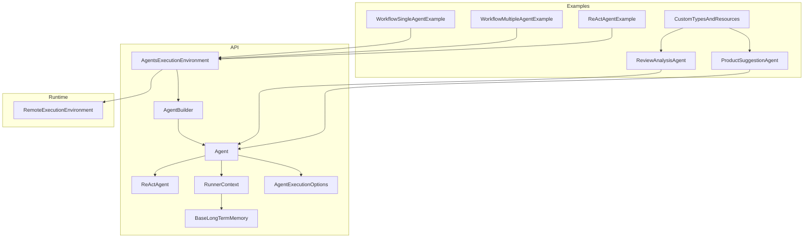
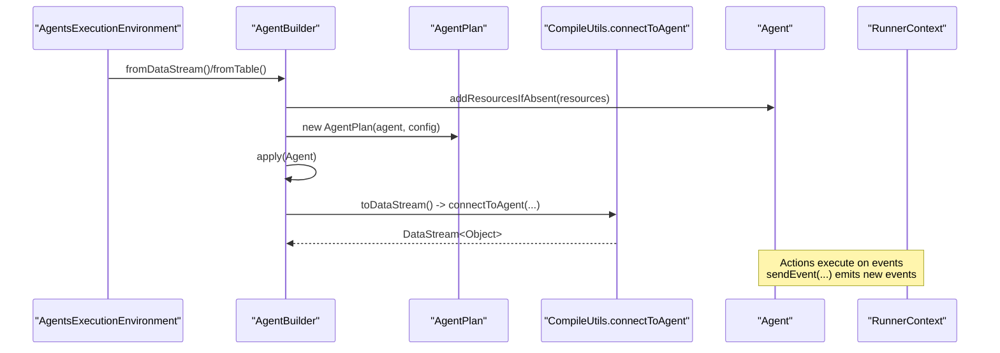
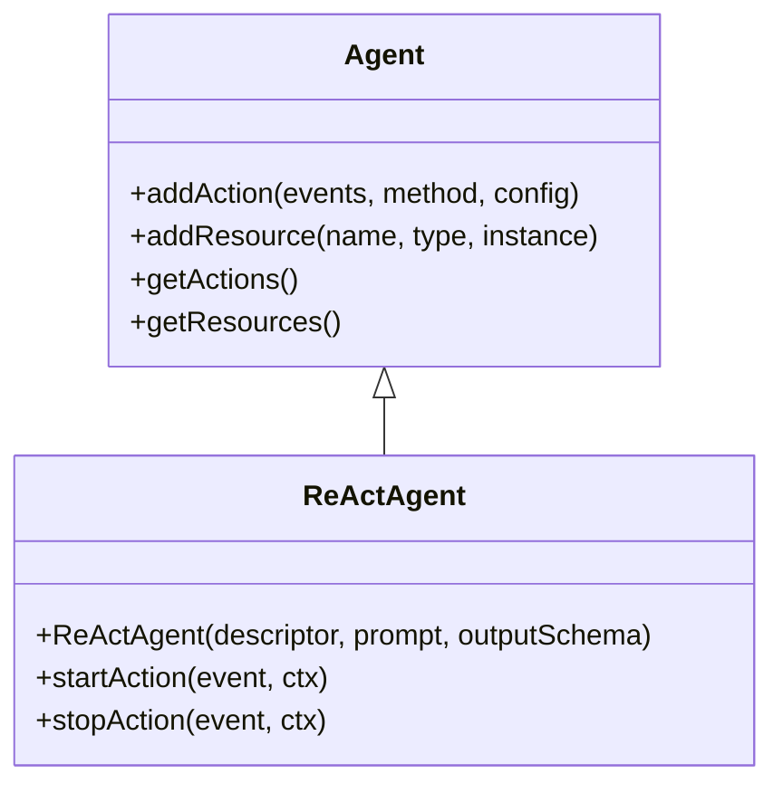
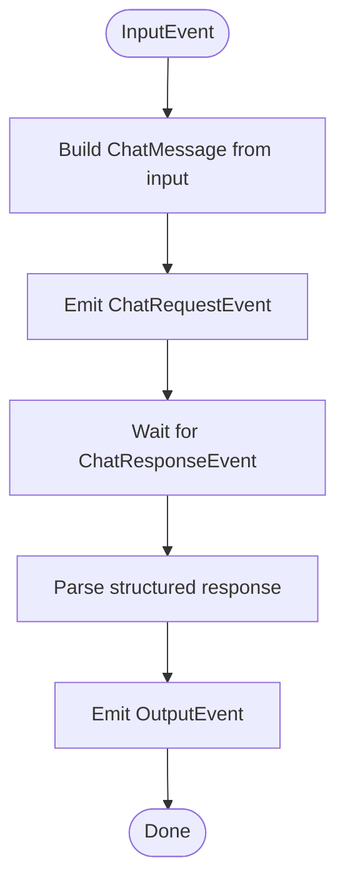
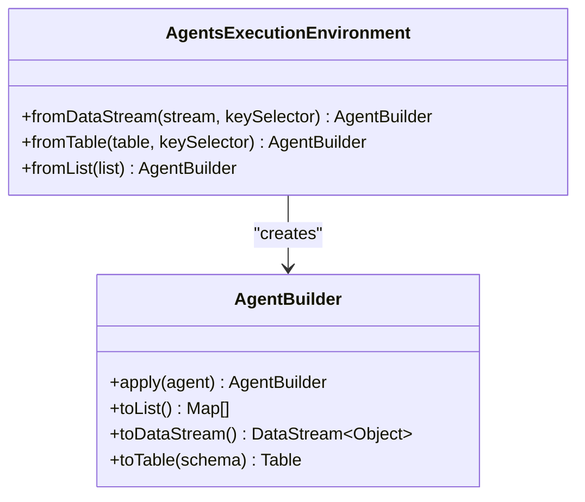
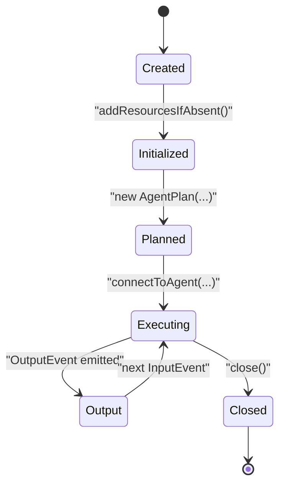
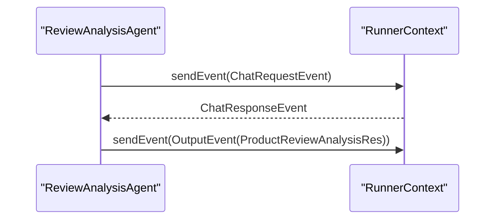
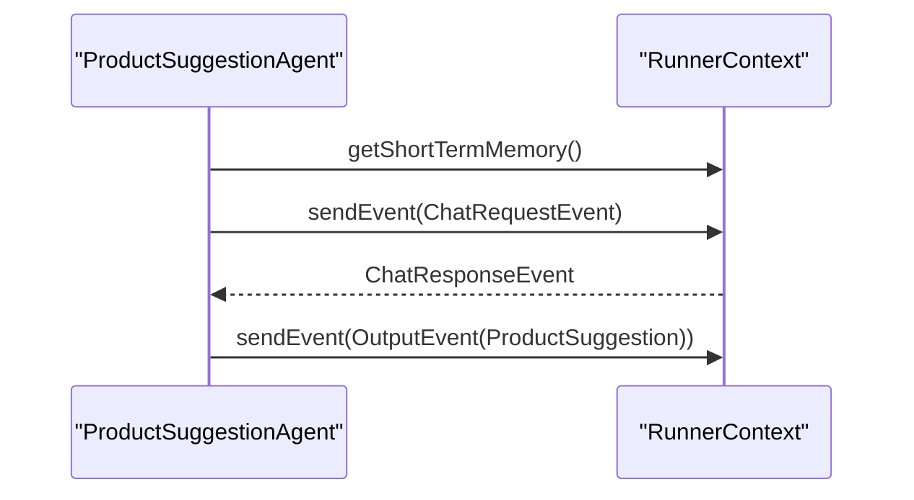
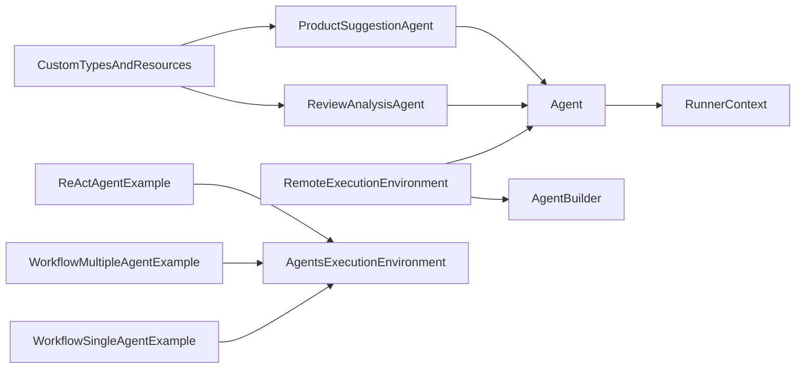

# Agent Development

<cite>
**Referenced Files in This Document**
- [Agent.java](file://api/src/main/java/org/apache/flink/agents/api/agents/Agent.java)
- [ReActAgent.java](file://api/src/main/java/org/apache/flink/agents/api/agents/ReActAgent.java)
- [AgentExecutionOptions.java](file://api/src/main/java/org/apache/flink/agents/api/agents/AgentExecutionOptions.java)
- [RunnerContext.java](file://api/src/main/java/org/apache/flink/agents/api/context/RunnerContext.java)
- [AgentBuilder.java](file://api/src/main/java/org/apache/flink/agents/api/AgentBuilder.java)
- [AgentsExecutionEnvironment.java](file://api/src/main/java/org/apache/flink/agents/api/AgentsExecutionEnvironment.java)
- [RemoteExecutionEnvironment.java](file://runtime/src/main/java/org/apache/flink/agents/runtime/env/RemoteExecutionEnvironment.java)
- [BaseLongTermMemory.java](file://api/src/main/java/org/apache/flink/agents/api/memory/BaseLongTermMemory.java)
- [ProductSuggestionAgent.java](file://examples/src/main/java/org/apache/flink/agents/examples/agents/ProductSuggestionAgent.java)
- [ReviewAnalysisAgent.java](file://examples/src/main/java/org/apache/flink/agents/examples/agents/ReviewAnalysisAgent.java)
- [WorkflowSingleAgentExample.java](file://examples/src/main/java/org/apache/flink/agents/examples/WorkflowSingleAgentExample.java)
- [WorkflowMultipleAgentExample.java](file://examples/src/main/java/org/apache/flink/agents/examples/WorkflowMultipleAgentExample.java)
- [ReActAgentExample.java](file://examples/src/main/java/org/apache/flink/agents/examples/ReActAgentExample.java)
- [CustomTypesAndResources.java](file://examples/src/main/java/org/apache/flink/agents/examples/agents/CustomTypesAndResources.java)
</cite>

## Table of Contents
1. [Introduction](#introduction)
2. [Project Structure](#project-structure)
3. [Core Components](#core-components)
4. [Architecture Overview](#architecture-overview)
5. [Detailed Component Analysis](#detailed-component-analysis)
6. [Dependency Analysis](#dependency-analysis)
7. [Performance Considerations](#performance-considerations)
8. [Troubleshooting Guide](#troubleshooting-guide)
9. [Conclusion](#conclusion)
10. [Appendices](#appendices)

## Introduction
This document explains how to develop agents in Flink Agents, covering built-in and custom agent types, the AgentBuilder fluent API, configuration and execution options, the agent lifecycle, composition and coordination patterns, error handling strategies, and practical examples. It targets developers who want to build robust, scalable, and maintainable agent-based streaming pipelines with Apache Flink.

## Project Structure
Flink Agents consists of:
- API surface for defining agents, building pipelines, and managing execution environments
- Runtime integration for remote Flink execution
- Examples demonstrating ReAct agents, workflow agents, and multi-agent pipelines
- Memory and resource abstractions supporting long-term memory and tool/prompt/chat model integration

**Diagram sources**
- [AgentsExecutionEnvironment.java](file://api/src/main/java/org/apache/flink/agents/api/AgentsExecutionEnvironment.java#L43-L223)
- [AgentBuilder.java](file://api/src/main/java/org/apache/flink/agents/api/AgentBuilder.java#L35-L77)
- [Agent.java](file://api/src/main/java/org/apache/flink/agents/api/agents/Agent.java#L34-L131)
- [ReActAgent.java](file://api/src/main/java/org/apache/flink/agents/api/agents/ReActAgent.java#L51-L183)
- [RunnerContext.java](file://api/src/main/java/org/apache/flink/agents/api/context/RunnerContext.java#L33-L138)
- [AgentExecutionOptions.java](file://api/src/main/java/org/apache/flink/agents/api/agents/AgentExecutionOptions.java#L23-L48)
- [BaseLongTermMemory.java](file://api/src/main/java/org/apache/flink/agents/api/memory/BaseLongTermMemory.java#L33-L134)
- [RemoteExecutionEnvironment.java](file://runtime/src/main/java/org/apache/flink/agents/runtime/env/RemoteExecutionEnvironment.java#L50-L217)
- [ReviewAnalysisAgent.java](file://examples/src/main/java/org/apache/flink/agents/examples/agents/ReviewAnalysisAgent.java#L53-L132)
- [ProductSuggestionAgent.java](file://examples/src/main/java/org/apache/flink/agents/examples/agents/ProductSuggestionAgent.java#L52-L114)
- [WorkflowSingleAgentExample.java](file://examples/src/main/java/org/apache/flink/agents/examples/WorkflowSingleAgentExample.java#L49-L123)
- [WorkflowMultipleAgentExample.java](file://examples/src/main/java/org/apache/flink/agents/examples/WorkflowMultipleAgentExample.java#L64-L190)
- [ReActAgentExample.java](file://examples/src/main/java/org/apache/flink/agents/examples/ReActAgentExample.java#L55-L161)
- [CustomTypesAndResources.java](file://examples/src/main/java/org/apache/flink/agents/examples/agents/CustomTypesAndResources.java#L34-L265)

**Section sources**
- [AgentsExecutionEnvironment.java](file://api/src/main/java/org/apache/flink/agents/api/AgentsExecutionEnvironment.java#L43-L223)
- [RemoteExecutionEnvironment.java](file://runtime/src/main/java/org/apache/flink/agents/runtime/env/RemoteExecutionEnvironment.java#L50-L217)

## Core Components
- Agent: Base class for defining actions and resources. Supports adding actions via reflection and registering resources.
- ReActAgent: Built-in agent implementing ReAct-style reasoning with structured output and tool invocation.
- RunnerContext: Provides event emission, memory access, metrics, resource retrieval, configuration, and durable execution helpers.
- AgentExecutionOptions: Centralized configuration for error handling, retries, and asynchronous behavior toggles.
- AgentBuilder and AgentsExecutionEnvironment: Fluent builder for integrating agents with DataStream/Table/list inputs; environment selection between local and remote execution.
- BaseLongTermMemory: Abstraction for persistent memory sets with compaction and semantic search.

Key responsibilities:
- Agent defines the agent’s behavior as a set of actions and resources.
- ReActAgent focuses on structured prompting and tool use.
- RunnerContext mediates between actions and the runtime.
- AgentExecutionOptions controls resilience and concurrency.
- AgentsExecutionEnvironment and RemoteExecutionEnvironment connect agents to Flink streams and tables.

**Section sources**
- [Agent.java](file://api/src/main/java/org/apache/flink/agents/api/agents/Agent.java#L34-L131)
- [ReActAgent.java](file://api/src/main/java/org/apache/flink/agents/api/agents/ReActAgent.java#L51-L183)
- [RunnerContext.java](file://api/src/main/java/org/apache/flink/agents/api/context/RunnerContext.java#L33-L138)
- [AgentExecutionOptions.java](file://api/src/main/java/org/apache/flink/agents/api/agents/AgentExecutionOptions.java#L23-L48)
- [AgentBuilder.java](file://api/src/main/java/org/apache/flink/agents/api/AgentBuilder.java#L35-L77)
- [AgentsExecutionEnvironment.java](file://api/src/main/java/org/apache/flink/agents/api/AgentsExecutionEnvironment.java#L43-L223)
- [RemoteExecutionEnvironment.java](file://runtime/src/main/java/org/apache/flink/agents/runtime/env/RemoteExecutionEnvironment.java#L50-L217)
- [BaseLongTermMemory.java](file://api/src/main/java/org/apache/flink/agents/api/memory/BaseLongTermMemory.java#L33-L134)

## Architecture Overview
The agent architecture is event-driven and streaming-first:
- Agents declare actions and listen to specific event types.
- Actions receive an InputEvent, optionally transform it, and emit new events (e.g., ChatRequestEvent).
- Downstream actions handle response events (e.g., ChatResponseEvent) and produce OutputEvent.
- AgentsExecutionEnvironment builds pipelines from DataStream/Table/list inputs.
- RemoteExecutionEnvironment compiles and connects agents into Flink operators.

**Diagram sources**
- [AgentsExecutionEnvironment.java](file://api/src/main/java/org/apache/flink/agents/api/AgentsExecutionEnvironment.java#L139-L199)
- [RemoteExecutionEnvironment.java](file://runtime/src/main/java/org/apache/flink/agents/runtime/env/RemoteExecutionEnvironment.java#L85-L94)
- [RemoteExecutionEnvironment.java](file://runtime/src/main/java/org/apache/flink/agents/runtime/env/RemoteExecutionEnvironment.java#L172-L182)
- [RemoteExecutionEnvironment.java](file://runtime/src/main/java/org/apache/flink/agents/runtime/env/RemoteExecutionEnvironment.java#L190-L208)
- [Agent.java](file://api/src/main/java/org/apache/flink/agents/api/agents/Agent.java#L34-L131)
- [RunnerContext.java](file://api/src/main/java/org/apache/flink/agents/api/context/RunnerContext.java#L33-L138)

## Detailed Component Analysis

### Agent Types

#### ReAct Agent
ReActAgent encapsulates a ReAct loop with:
- Structured prompting and optional schema enforcement
- Tool invocation capability
- Event-driven transitions from input to chat request and back to output

**Diagram sources**
- [Agent.java](file://api/src/main/java/org/apache/flink/agents/api/agents/Agent.java#L34-L131)
- [ReActAgent.java](file://api/src/main/java/org/apache/flink/agents/api/agents/ReActAgent.java#L51-L183)

Key behaviors:
- Construction registers a default chat model and optional schema/prompt resources
- startAction formats user input into ChatMessage(s) and emits ChatRequestEvent with optional output schema
- stopAction parses ChatResponseEvent and emits OutputEvent with structured or raw content

Validation and constraints:
- Output schema must be RowTypeInfo or POJO class; otherwise an exception is thrown
- Non-primitive input requires a user prompt to convert to ChatMessage

**Section sources**
- [ReActAgent.java](file://api/src/main/java/org/apache/flink/agents/api/agents/ReActAgent.java#L59-L101)
- [ReActAgent.java](file://api/src/main/java/org/apache/flink/agents/api/agents/ReActAgent.java#L103-L181)

#### Workflow Agent
A workflow agent is any Agent subclass whose logic is composed of actions triggered by events. It supports:
- Explicit orchestration across multiple steps
- Branching and multi-step reasoning
- Tool use and memory access

Patterns demonstrated:
- ReviewAnalysisAgent: consumes InputEvent, constructs a ChatMessage, emits ChatRequestEvent, and upon receiving ChatResponseEvent emits OutputEvent with structured analysis
- ProductSuggestionAgent: stores transient context in short-term memory, emits a ChatRequestEvent, and parses structured suggestions into a domain-specific output

**Diagram sources**
- [ReviewAnalysisAgent.java](file://examples/src/main/java/org/apache/flink/agents/examples/agents/ReviewAnalysisAgent.java#L88-L105)
- [ReviewAnalysisAgent.java](file://examples/src/main/java/org/apache/flink/agents/examples/agents/ReviewAnalysisAgent.java#L107-L130)
- [ProductSuggestionAgent.java](file://examples/src/main/java/org/apache/flink/agents/examples/agents/ProductSuggestionAgent.java#L73-L91)
- [ProductSuggestionAgent.java](file://examples/src/main/java/org/apache/flink/agents/examples/agents/ProductSuggestionAgent.java#L93-L112)

**Section sources**
- [ReviewAnalysisAgent.java](file://examples/src/main/java/org/apache/flink/agents/examples/agents/ReviewAnalysisAgent.java#L53-L132)
- [ProductSuggestionAgent.java](file://examples/src/main/java/org/apache/flink/agents/examples/agents/ProductSuggestionAgent.java#L52-L114)

#### Custom Agent Implementations
Custom agents extend Agent and define actions using annotations or addAction. They can:
- Register resources (chat models, prompts, tools)
- Access RunnerContext for memory, metrics, and durable execution
- Emit domain-specific events and respond to downstream events

Best practices:
- Keep actions small and focused
- Use RunnerContext short-term memory for lightweight state
- Prefer structured output and schema enforcement for reliability

**Section sources**
- [Agent.java](file://api/src/main/java/org/apache/flink/agents/api/agents/Agent.java#L34-L131)
- [RunnerContext.java](file://api/src/main/java/org/apache/flink/agents/api/context/RunnerContext.java#L33-L138)

### AgentBuilder Fluent API
AgentBuilder provides a fluent interface to configure agents and produce outputs:
- apply(Agent): registers the agent and prepares the execution plan
- toList(): returns a list of outputs (local execution)
- toDataStream(): returns a DataStream of outputs for Flink integration
- toTable(Schema): converts outputs to a Flink Table

**Diagram sources**
- [AgentBuilder.java](file://api/src/main/java/org/apache/flink/agents/api/AgentBuilder.java#L35-L77)
- [AgentsExecutionEnvironment.java](file://api/src/main/java/org/apache/flink/agents/api/AgentsExecutionEnvironment.java#L139-L199)

Usage patterns:
- Single-agent streaming: fromDataStream(...).apply(new Agent()).toDataStream()
- Multi-agent pipelines: compose multiple agents across windows and streams
- Table integration: fromTable(...).apply(agent).toTable(schema)

**Section sources**
- [AgentBuilder.java](file://api/src/main/java/org/apache/flink/agents/api/AgentBuilder.java#L35-L77)
- [AgentsExecutionEnvironment.java](file://api/src/main/java/org/apache/flink/agents/api/AgentsExecutionEnvironment.java#L139-L199)
- [RemoteExecutionEnvironment.java](file://runtime/src/main/java/org/apache/flink/agents/runtime/env/RemoteExecutionEnvironment.java#L85-L94)

### Execution Options and Parameter Validation
AgentExecutionOptions centralizes configuration:
- Error handling strategy (fail/retry/ignore)
- Max retries
- Async toggles for chat, tool calls, and RAG
- Async thread pool sizing

Validation:
- Resources must be SerializableResource or ResourceDescriptor; otherwise an exception is thrown
- Duplicate resource names per type are rejected
- Agent.addAction prevents duplicate action names

**Section sources**
- [AgentExecutionOptions.java](file://api/src/main/java/org/apache/flink/agents/api/agents/AgentExecutionOptions.java#L23-L48)
- [Agent.java](file://api/src/main/java/org/apache/flink/agents/api/agents/Agent.java#L97-L111)
- [Agent.java](file://api/src/main/java/org/apache/flink/agents/api/agents/Agent.java#L63-L71)

### Agent Lifecycle
Lifecycle phases:
- Creation: register resources and actions; optionally attach prompts/tools
- Initialization: environment resolves resources and builds AgentPlan
- Planning: compile agent into Flink operator graph
- Execution: actions react to events; emit new events; produce outputs
- Cleanup: close resources and release memory

**Diagram sources**
- [Agent.java](file://api/src/main/java/org/apache/flink/agents/api/agents/Agent.java#L34-L131)
- [RemoteExecutionEnvironment.java](file://runtime/src/main/java/org/apache/flink/agents/runtime/env/RemoteExecutionEnvironment.java#L172-L182)
- [RemoteExecutionEnvironment.java](file://runtime/src/main/java/org/apache/flink/agents/runtime/env/RemoteExecutionEnvironment.java#L190-L208)
- [RunnerContext.java](file://api/src/main/java/org/apache/flink/agents/api/context/RunnerContext.java#L135-L137)

### Best Practices for Agent Composition and Coordination
- Use separate agents for distinct stages (e.g., analysis, aggregation, suggestions)
- Pass structured outputs between agents to minimize ambiguity
- Leverage Flink windows and keyed streams to coordinate multi-stage workflows
- Limit concurrency via AgentExecutionOptions.NUM_ASYNC_THREADS to avoid saturating external services
- Use durableExecute/durableExecuteAsync for idempotent, recoverable side effects

Examples:
- Single-agent pipeline: ReviewAnalysisAgent over a DataStream
- Multi-agent pipeline: windowed aggregation followed by ProductSuggestionAgent

**Section sources**
- [WorkflowSingleAgentExample.java](file://examples/src/main/java/org/apache/flink/agents/examples/WorkflowSingleAgentExample.java#L52-L92)
- [WorkflowMultipleAgentExample.java](file://examples/src/main/java/org/apache/flink/agents/examples/WorkflowMultipleAgentExample.java#L126-L188)
- [AgentExecutionOptions.java](file://api/src/main/java/org/apache/flink/agents/api/agents/AgentExecutionOptions.java#L33-L37)

### Practical Examples

#### Review Analysis Agent
- Consumes InputEvent with a ProductReview
- Builds a ChatMessage and emits ChatRequestEvent
- Parses ChatResponseEvent into ProductReviewAnalysisRes and emits OutputEvent

**Diagram sources**
- [ReviewAnalysisAgent.java](file://examples/src/main/java/org/apache/flink/agents/examples/agents/ReviewAnalysisAgent.java#L88-L105)
- [ReviewAnalysisAgent.java](file://examples/src/main/java/org/apache/flink/agents/examples/agents/ReviewAnalysisAgent.java#L107-L130)

**Section sources**
- [ReviewAnalysisAgent.java](file://examples/src/main/java/org/apache/flink/agents/examples/agents/ReviewAnalysisAgent.java#L53-L132)
- [CustomTypesAndResources.java](file://examples/src/main/java/org/apache/flink/agents/examples/agents/CustomTypesAndResources.java#L119-L187)

#### Product Suggestion Agent
- Reads aggregated review summary from short-term memory
- Emits a ChatRequestEvent with structured input
- Parses structured suggestions and emits ProductSuggestion

**Diagram sources**
- [ProductSuggestionAgent.java](file://examples/src/main/java/org/apache/flink/agents/examples/agents/ProductSuggestionAgent.java#L73-L91)
- [ProductSuggestionAgent.java](file://examples/src/main/java/org/apache/flink/agents/examples/agents/ProductSuggestionAgent.java#L93-L112)

**Section sources**
- [ProductSuggestionAgent.java](file://examples/src/main/java/org/apache/flink/agents/examples/agents/ProductSuggestionAgent.java#L52-L114)
- [CustomTypesAndResources.java](file://examples/src/main/java/org/apache/flink/agents/examples/agents/CustomTypesAndResources.java#L189-L263)

#### ReAct Agent Example
- Demonstrates ReActAgent with a prompt and structured output schema
- Registers a tool for notifying shipping manager
- Streams Row inputs through a ReActAgent to produce outputs

**Section sources**
- [ReActAgentExample.java](file://examples/src/main/java/org/apache/flink/agents/examples/ReActAgentExample.java#L55-L161)
- [ReActAgent.java](file://api/src/main/java/org/apache/flink/agents/api/agents/ReActAgent.java#L51-L183)

## Dependency Analysis
- Agent depends on RunnerContext for event emission and resource access
- RemoteExecutionEnvironment composes AgentPlan and connects to Flink operators
- Examples depend on shared CustomTypesAndResources for prompts and data models

**Diagram sources**
- [Agent.java](file://api/src/main/java/org/apache/flink/agents/api/agents/Agent.java#L34-L131)
- [RunnerContext.java](file://api/src/main/java/org/apache/flink/agents/api/context/RunnerContext.java#L33-L138)
- [RemoteExecutionEnvironment.java](file://runtime/src/main/java/org/apache/flink/agents/runtime/env/RemoteExecutionEnvironment.java#L50-L217)
- [ReviewAnalysisAgent.java](file://examples/src/main/java/org/apache/flink/agents/examples/agents/ReviewAnalysisAgent.java#L53-L132)
- [ProductSuggestionAgent.java](file://examples/src/main/java/org/apache/flink/agents/examples/agents/ProductSuggestionAgent.java#L52-L114)
- [WorkflowSingleAgentExample.java](file://examples/src/main/java/org/apache/flink/agents/examples/WorkflowSingleAgentExample.java#L49-L123)
- [WorkflowMultipleAgentExample.java](file://examples/src/main/java/org/apache/flink/agents/examples/WorkflowMultipleAgentExample.java#L64-L190)
- [ReActAgentExample.java](file://examples/src/main/java/org/apache/flink/agents/examples/ReActAgentExample.java#L55-L161)
- [CustomTypesAndResources.java](file://examples/src/main/java/org/apache/flink/agents/examples/agents/CustomTypesAndResources.java#L34-L265)

**Section sources**
- [Agent.java](file://api/src/main/java/org/apache/flink/agents/api/agents/Agent.java#L34-L131)
- [RemoteExecutionEnvironment.java](file://runtime/src/main/java/org/apache/flink/agents/runtime/env/RemoteExecutionEnvironment.java#L50-L217)

## Performance Considerations
- Concurrency control: tune AgentExecutionOptions.NUM_ASYNC_THREADS to balance throughput and external service limits
- Async toggles: enable/disable async for chat, tool calls, and RAG based on workload characteristics
- Memory footprint: prefer compact input formats and avoid retaining large transient state in memory
- Windowing and batching: leverage Flink windows to aggregate and reduce per-event overhead
- Structured output: enforce schemas to reduce parsing errors and retries

[No sources needed since this section provides general guidance]

## Troubleshooting Guide
Common issues and strategies:
- Unsupported resource type: ensure resources are SerializableResource or ResourceDescriptor
- Duplicate resource registration: avoid reusing names per resource type
- Missing action configuration: verify action config keys and values
- Excessive retries: adjust AgentExecutionOptions.ERROR_HANDLING_STRATEGY and MAX_RETRIES
- Blocking operations inside actions: use durableExecuteAsync for non-blocking durable calls

Debugging techniques:
- Enable metrics via RunnerContext.getAgentMetricGroup()/getActionMetricGroup()
- Inspect short-term and long-term memory contents during execution
- Log structured outputs and intermediate events for traceability

**Section sources**
- [Agent.java](file://api/src/main/java/org/apache/flink/agents/api/agents/Agent.java#L97-L111)
- [AgentExecutionOptions.java](file://api/src/main/java/org/apache/flink/agents/api/agents/AgentExecutionOptions.java#L24-L31)
- [RunnerContext.java](file://api/src/main/java/org/apache/flink/agents/api/context/RunnerContext.java#L67-L110)

## Conclusion
Flink Agents offers a flexible, event-driven framework for building intelligent streaming pipelines. By composing agents with clear actions, enforcing structured outputs, and carefully tuning execution options, developers can implement robust solutions ranging from simple ReAct agents to complex multi-stage workflows. The provided examples demonstrate practical patterns for review analysis, aggregation, and product suggestions, while the runtime integration ensures seamless Flink compatibility.

## Appendices

### Memory Management
- Short-term memory: ephemeral during a run; useful for lightweight cross-action state
- Long-term memory: persistent storage with compaction and semantic search
- Sensory memory: auto-cleared after run; suitable for temporary artifacts

**Section sources**
- [RunnerContext.java](file://api/src/main/java/org/apache/flink/agents/api/context/RunnerContext.java#L42-L58)
- [BaseLongTermMemory.java](file://api/src/main/java/org/apache/flink/agents/api/memory/BaseLongTermMemory.java#L33-L134)