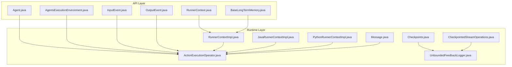
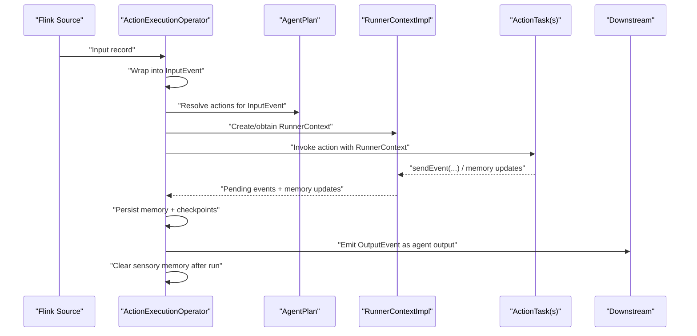
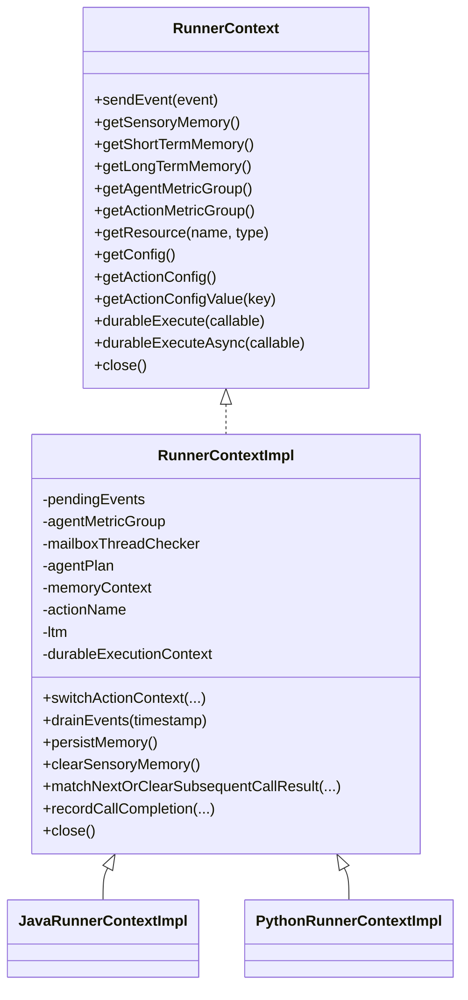
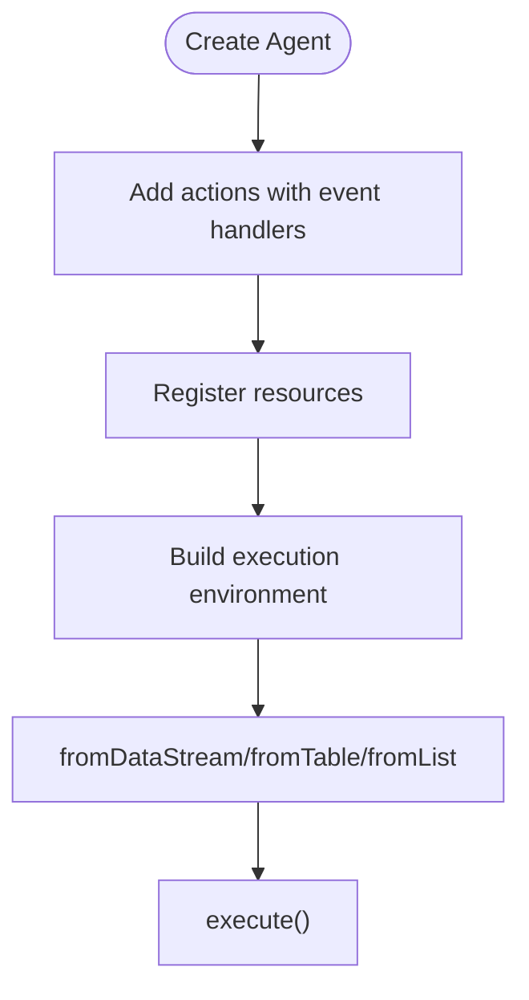
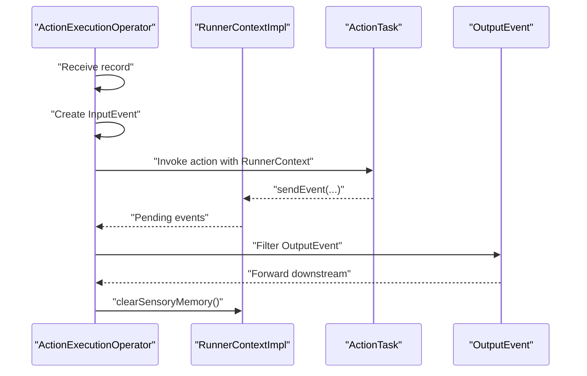
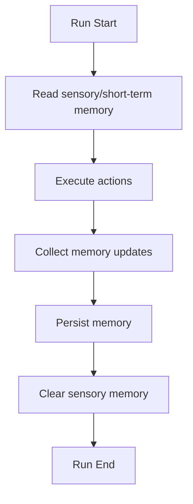
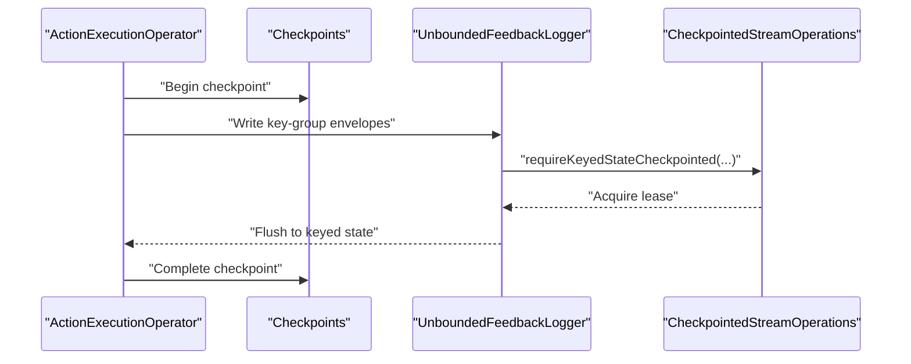
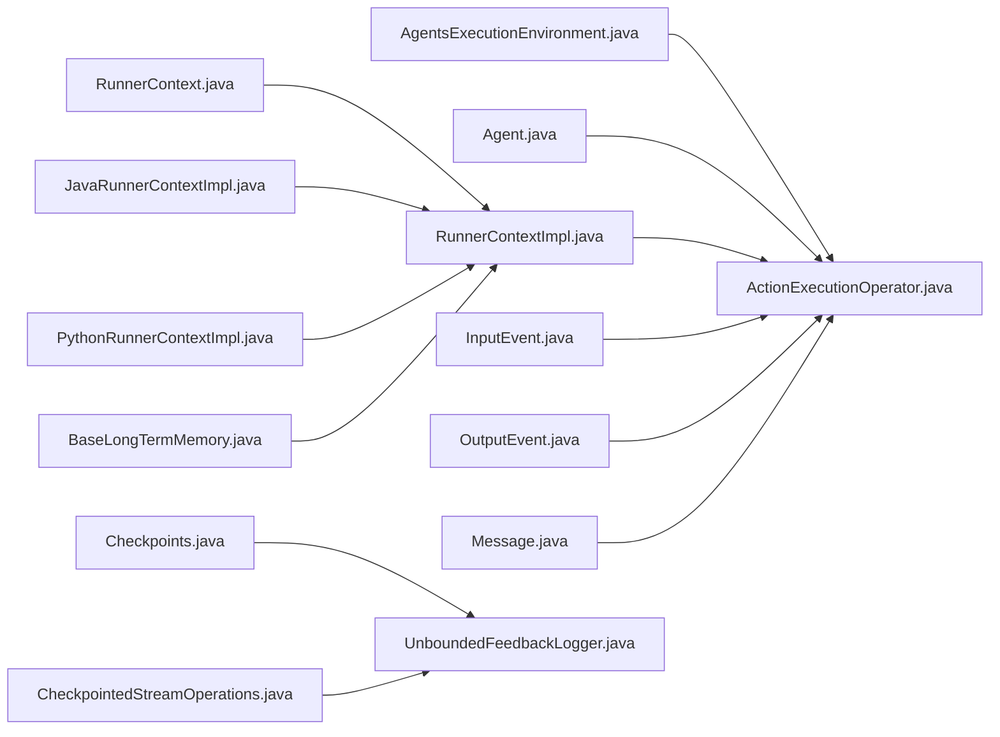

# Agent Lifecycle Management

<cite>
**Referenced Files in This Document**
- [RunnerContext.java](file://api/src/main/java/org/apache/flink/agents/api/context/RunnerContext.java)
- [RunnerContextImpl.java](file://runtime/src/main/java/org/apache/flink/agents/runtime/context/RunnerContextImpl.java)
- [JavaRunnerContextImpl.java](file://runtime/src/main/java/org/apache/flink/agents/runtime/context/JavaRunnerContextImpl.java)
- [PythonRunnerContextImpl.java](file://runtime/src/main/java/org/apache/flink/agents/runtime/python/context/PythonRunnerContextImpl.java)
- [ActionExecutionOperator.java](file://runtime/src/main/java/org/apache/flink/agents/runtime/operator/ActionExecutionOperator.java)
- [Agent.java](file://api/src/main/java/org/apache/flink/agents/api/agents/Agent.java)
- [AgentsExecutionEnvironment.java](file://api/src/main/java/org/apache/flink/agents/api/AgentsExecutionEnvironment.java)
- [InputEvent.java](file://api/src/main/java/org/apache/flink/agents/api/InputEvent.java)
- [OutputEvent.java](file://api/src/main/java/org/apache/flink/agents/api/OutputEvent.java)
- [BaseLongTermMemory.java](file://api/src/main/java/org/apache/flink/agents/api/memory/BaseLongTermMemory.java)
- [Message.java](file://runtime/src/main/java/org/apache/flink/agents/runtime/message/Message.java)
- [Checkpoints.java](file://runtime/src/main/java/org/apache/flink/agents/runtime/feedback/Checkpoints.java)
- [CheckpointedStreamOperations.java](file://runtime/src/main/java/org/apache/flink/agents/runtime/logger/CheckpointedStreamOperations.java)
- [UnboundedFeedbackLogger.java](file://runtime/src/main/java/org/apache/flink/agents/runtime/logger/UnboundedFeedbackLogger.java)
- [ActionExecutionOperatorTest.java](file://runtime/src/test/java/org/apache/flink/agents/runtime/operator/ActionExecutionOperatorTest.java)
</cite>

## Table of Contents
1. [Introduction](#introduction)
2. [Project Structure](#project-structure)
3. [Core Components](#core-components)
4. [Architecture Overview](#architecture-overview)
5. [Detailed Component Analysis](#detailed-component-analysis)
6. [Dependency Analysis](#dependency-analysis)
7. [Performance Considerations](#performance-considerations)
8. [Troubleshooting Guide](#troubleshooting-guide)
9. [Conclusion](#conclusion)

## Introduction
This document explains agent lifecycle management in Flink Agents, covering initialization, execution, and cleanup phases. It details the RunnerContext role in managing agent state and interactions with the execution environment, event-driven processing (input handling, action execution, output generation), and the relationship between agents and Flink operators, checkpointing, and fault tolerance. Practical examples illustrate lifecycle hooks, state management, and resource cleanup strategies, along with performance and debugging guidance.

## Project Structure
Flink Agents separates API contracts and user-facing abstractions from runtime operators and execution internals:
- api: Public interfaces for agents, events, configuration, memory, and execution environments
- runtime: Operators, context implementations, memory stores, checkpoints, and Python integration
- plan: Agent plan serialization and function descriptors
- python: Python-side bindings and runtime bridge
- integrations: Example integrations with chat models, embeddings, MCP, and vector stores
- examples: Usage examples for ReAct and workflow agents
- e2e-test: End-to-end tests validating agent lifecycle and cross-language behavior

**Diagram sources**
- [Agent.java](file://api/src/main/java/org/apache/flink/agents/api/agents/Agent.java#L34-L131)
- [AgentsExecutionEnvironment.java](file://api/src/main/java/org/apache/flink/agents/api/AgentsExecutionEnvironment.java#L43-L223)
- [RunnerContext.java](file://api/src/main/java/org/apache/flink/agents/api/context/RunnerContext.java#L29-L138)
- [InputEvent.java](file://api/src/main/java/org/apache/flink/agents/api/InputEvent.java#L27-L49)
- [OutputEvent.java](file://api/src/main/java/org/apache/flink/agents/api/OutputEvent.java#L27-L52)
- [BaseLongTermMemory.java](file://api/src/main/java/org/apache/flink/agents/api/memory/BaseLongTermMemory.java#L27-L134)
- [ActionExecutionOperator.java](file://runtime/src/main/java/org/apache/flink/agents/runtime/operator/ActionExecutionOperator.java#L108-L200)
- [RunnerContextImpl.java](file://runtime/src/main/java/org/apache/flink/agents/runtime/context/RunnerContextImpl.java#L56-L590)
- [JavaRunnerContextImpl.java](file://runtime/src/main/java/org/apache/flink/agents/runtime/context/JavaRunnerContextImpl.java#L28-L32)
- [PythonRunnerContextImpl.java](file://runtime/src/main/java/org/apache/flink/agents/runtime/python/context/PythonRunnerContextImpl.java)
- [Message.java](file://runtime/src/main/java/org/apache/flink/agents/runtime/message/Message.java#L23-L34)
- [Checkpoints.java](file://runtime/src/main/java/org/apache/flink/agents/runtime/feedback/Checkpoints.java#L30-L36)
- [CheckpointedStreamOperations.java](file://runtime/src/main/java/org/apache/flink/agents/runtime/logger/CheckpointedStreamOperations.java#L24-L37)
- [UnboundedFeedbackLogger.java](file://runtime/src/main/java/org/apache/flink/agents/runtime/logger/UnboundedFeedbackLogger.java#L93-L127)

**Section sources**
- [AgentsExecutionEnvironment.java](file://api/src/main/java/org/apache/flink/agents/api/AgentsExecutionEnvironment.java#L43-L223)
- [ActionExecutionOperator.java](file://runtime/src/main/java/org/apache/flink/agents/runtime/operator/ActionExecutionOperator.java#L108-L200)

## Core Components
- RunnerContext: Interface for action execution context, exposing event emission, memory access, metrics, resource retrieval, configuration, and durable execution helpers.
- RunnerContextImpl: Runtime implementation providing memory contexts, metrics grouping, resource binding, configuration access, and durable execution persistence.
- JavaRunnerContextImpl and PythonRunnerContextImpl: Language-specific context variants enabling async continuation and Python interop.
- ActionExecutionOperator: Flink operator orchestrating agent actions, input wrapping, event propagation, output emission, checkpointing, and recovery.
- Agent and AgentsExecutionEnvironment: User-facing building blocks for defining agents and integrating with Flink streams/tables.
- InputEvent and OutputEvent: Specialized events for framework-driven input and user-defined outputs.
- BaseLongTermMemory: Contract for persistent memory sets with search and compaction support.

**Section sources**
- [RunnerContext.java](file://api/src/main/java/org/apache/flink/agents/api/context/RunnerContext.java#L29-L138)
- [RunnerContextImpl.java](file://runtime/src/main/java/org/apache/flink/agents/runtime/context/RunnerContextImpl.java#L56-L590)
- [JavaRunnerContextImpl.java](file://runtime/src/main/java/org/apache/flink/agents/runtime/context/JavaRunnerContextImpl.java#L28-L32)
- [PythonRunnerContextImpl.java](file://runtime/src/main/java/org/apache/flink/agents/runtime/python/context/PythonRunnerContextImpl.java)
- [ActionExecutionOperator.java](file://runtime/src/main/java/org/apache/flink/agents/runtime/operator/ActionExecutionOperator.java#L108-L200)
- [Agent.java](file://api/src/main/java/org/apache/flink/agents/api/agents/Agent.java#L34-L131)
- [AgentsExecutionEnvironment.java](file://api/src/main/java/org/apache/flink/agents/api/AgentsExecutionEnvironment.java#L43-L223)
- [InputEvent.java](file://api/src/main/java/org/apache/flink/agents/api/InputEvent.java#L27-L49)
- [OutputEvent.java](file://api/src/main/java/org/apache/flink/agents/api/OutputEvent.java#L27-L52)
- [BaseLongTermMemory.java](file://api/src/main/java/org/apache/flink/agents/api/memory/BaseLongTermMemory.java#L27-L134)

## Architecture Overview
The agent lifecycle is orchestrated by the ActionExecutionOperator, which:
- Receives upstream records and wraps them into InputEvent
- Resolves actions via the AgentPlan and executes them with RunnerContext
- Emits events produced by actions; OutputEvent is forwarded as agent output
- Manages memory updates and persists them across checkpoints
- Supports durable execution and recovery via ActionState and checkpoints

**Diagram sources**
- [ActionExecutionOperator.java](file://runtime/src/main/java/org/apache/flink/agents/runtime/operator/ActionExecutionOperator.java#L108-L200)
- [RunnerContextImpl.java](file://runtime/src/main/java/org/apache/flink/agents/runtime/context/RunnerContextImpl.java#L127-L137)
- [InputEvent.java](file://api/src/main/java/org/apache/flink/agents/api/InputEvent.java#L27-L49)
- [OutputEvent.java](file://api/src/main/java/org/apache/flink/agents/api/OutputEvent.java#L27-L52)

## Detailed Component Analysis

### RunnerContext and Execution Context
RunnerContext defines the contract for action execution:
- Event emission and serialization checks
- Access to sensory, short-term, and long-term memory
- Metrics groups per agent and per action
- Resource lookup and configuration access
- Durable execution primitives for sync and async operations with caching and recovery

RunnerContextImpl augments the interface with:
- MemoryContext management for sensory and short-term memory
- Metric group scoping per action
- Long-term memory selection based on configuration
- Durable execution persistence via ActionState and CallResult
- Cleanup of long-term memory and agent plan resources

**Diagram sources**
- [RunnerContext.java](file://api/src/main/java/org/apache/flink/agents/api/context/RunnerContext.java#L29-L138)
- [RunnerContextImpl.java](file://runtime/src/main/java/org/apache/flink/agents/runtime/context/RunnerContextImpl.java#L56-L590)
- [JavaRunnerContextImpl.java](file://runtime/src/main/java/org/apache/flink/agents/runtime/context/JavaRunnerContextImpl.java#L28-L32)
- [PythonRunnerContextImpl.java](file://runtime/src/main/java/org/apache/flink/agents/runtime/python/context/PythonRunnerContextImpl.java)

**Section sources**
- [RunnerContext.java](file://api/src/main/java/org/apache/flink/agents/api/context/RunnerContext.java#L29-L138)
- [RunnerContextImpl.java](file://runtime/src/main/java/org/apache/flink/agents/runtime/context/RunnerContextImpl.java#L109-L137)
- [RunnerContextImpl.java](file://runtime/src/main/java/org/apache/flink/agents/runtime/context/RunnerContextImpl.java#L284-L353)
- [RunnerContextImpl.java](file://runtime/src/main/java/org/apache/flink/agents/runtime/context/RunnerContextImpl.java#L405-L426)

### Agent Initialization and Execution Environment
AgentsExecutionEnvironment provides factory methods to obtain an execution environment:
- Local vs remote execution
- Integration with DataStream and Table APIs
- Resource registration and configuration access

Agent defines actions and resources:
- addAction associates event listeners with static handler methods and optional configs
- addResource registers serializable or descriptor-backed resources

**Diagram sources**
- [AgentsExecutionEnvironment.java](file://api/src/main/java/org/apache/flink/agents/api/AgentsExecutionEnvironment.java#L68-L121)
- [AgentsExecutionEnvironment.java](file://api/src/main/java/org/apache/flink/agents/api/AgentsExecutionEnvironment.java#L154-L189)
- [Agent.java](file://api/src/main/java/org/apache/flink/agents/api/agents/Agent.java#L63-L81)

**Section sources**
- [AgentsExecutionEnvironment.java](file://api/src/main/java/org/apache/flink/agents/api/AgentsExecutionEnvironment.java#L68-L121)
- [AgentsExecutionEnvironment.java](file://api/src/main/java/org/apache/flink/agents/api/AgentsExecutionEnvironment.java#L154-L189)
- [Agent.java](file://api/src/main/java/org/apache/flink/agents/api/agents/Agent.java#L63-L81)

### Event-Driven Processing and Output Generation
ActionExecutionOperator drives event-driven processing:
- Wraps upstream records into InputEvent
- Resolves actions from AgentPlan and executes them with RunnerContext
- Collects pending events and drains them after action execution
- Emits OutputEvent as downstream output
- Clears sensory memory after a run completes

**Diagram sources**
- [ActionExecutionOperator.java](file://runtime/src/main/java/org/apache/flink/agents/runtime/operator/ActionExecutionOperator.java#L547-L577)
- [InputEvent.java](file://api/src/main/java/org/apache/flink/agents/api/InputEvent.java#L27-L49)
- [OutputEvent.java](file://api/src/main/java/org/apache/flink/agents/api/OutputEvent.java#L27-L52)

**Section sources**
- [ActionExecutionOperator.java](file://runtime/src/main/java/org/apache/flink/agents/runtime/operator/ActionExecutionOperator.java#L547-L577)
- [ActionExecutionOperatorTest.java](file://runtime/src/test/java/org/apache/flink/agents/runtime/operator/ActionExecutionOperatorTest.java#L307-L330)

### Memory Management and Cleanup
Memory is managed through RunnerContextImpl:
- Sensory memory: auto-cleared after a run
- Short-term memory: persisted via CachedMemoryStore
- Long-term memory: selectable backend via configuration; supports external vector store

Cleanup strategies:
- clearSensoryMemory after each run
- close on RunnerContextImpl disposes long-term memory and agent plan

**Diagram sources**
- [RunnerContextImpl.java](file://runtime/src/main/java/org/apache/flink/agents/runtime/context/RunnerContextImpl.java#L405-L426)
- [BaseLongTermMemory.java](file://api/src/main/java/org/apache/flink/agents/api/memory/BaseLongTermMemory.java#L27-L134)

**Section sources**
- [RunnerContextImpl.java](file://runtime/src/main/java/org/apache/flink/agents/runtime/context/RunnerContextImpl.java#L194-L221)
- [RunnerContextImpl.java](file://runtime/src/main/java/org/apache/flink/agents/runtime/context/RunnerContextImpl.java#L405-L426)
- [BaseLongTermMemory.java](file://api/src/main/java/org/apache/flink/agents/api/memory/BaseLongTermMemory.java#L45-L94)

### Checkpointing and Fault Tolerance
Checkpointing ensures fault tolerance and recovery continuity:
- Operator tracks sequence numbers and pending states
- Feedback logging writes per-keygroup data to keyed state streams
- Checkpoints maintains ordered completion of checkpoints
- Barrier messages propagate through the operator pipeline

**Diagram sources**
- [ActionExecutionOperator.java](file://runtime/src/main/java/org/apache/flink/agents/runtime/operator/ActionExecutionOperator.java#L108-L200)
- [Checkpoints.java](file://runtime/src/main/java/org/apache/flink/agents/runtime/feedback/Checkpoints.java#L30-L36)
- [UnboundedFeedbackLogger.java](file://runtime/src/main/java/org/apache/flink/agents/runtime/logger/UnboundedFeedbackLogger.java#L93-L127)
- [CheckpointedStreamOperations.java](file://runtime/src/main/java/org/apache/flink/agents/runtime/logger/CheckpointedStreamOperations.java#L24-L37)
- [Message.java](file://runtime/src/main/java/org/apache/flink/agents/runtime/message/Message.java#L23-L34)

**Section sources**
- [Checkpoints.java](file://runtime/src/main/java/org/apache/flink/agents/runtime/feedback/Checkpoints.java#L30-L36)
- [UnboundedFeedbackLogger.java](file://runtime/src/main/java/org/apache/flink/agents/runtime/logger/UnboundedFeedbackLogger.java#L93-L127)
- [CheckpointedStreamOperations.java](file://runtime/src/main/java/org/apache/flink/agents/runtime/logger/CheckpointedStreamOperations.java#L24-L37)
- [Message.java](file://runtime/src/main/java/org/apache/flink/agents/runtime/message/Message.java#L23-L34)

### Lifecycle Hooks and Practical Examples
Lifecycle hooks and patterns:
- Initialization: AgentsExecutionEnvironment builds the pipeline; RunnerContext is created per action invocation
- Execution: ActionExecutionOperator resolves actions and executes them with RunnerContext; actions may emit events and update memory
- Cleanup: Sensory memory cleared; long-term memory closed via RunnerContextImpl.close()

Practical examples:
- Event emission and output capture in tests demonstrate OutputEvent forwarding and memory updates
- Durable execution tests show exception handling and recovery via persisted call results

**Section sources**
- [ActionExecutionOperator.java](file://runtime/src/main/java/org/apache/flink/agents/runtime/operator/ActionExecutionOperator.java#L1075-L1105)
- [RunnerContextImpl.java](file://runtime/src/main/java/org/apache/flink/agents/runtime/context/RunnerContextImpl.java#L410-L426)
- [ActionExecutionOperatorTest.java](file://runtime/src/test/java/org/apache/flink/agents/runtime/operator/ActionExecutionOperatorTest.java#L307-L330)

## Dependency Analysis
The following diagram highlights key dependencies among core components:

**Diagram sources**
- [AgentsExecutionEnvironment.java](file://api/src/main/java/org/apache/flink/agents/api/AgentsExecutionEnvironment.java#L68-L121)
- [ActionExecutionOperator.java](file://runtime/src/main/java/org/apache/flink/agents/runtime/operator/ActionExecutionOperator.java#L108-L200)
- [Agent.java](file://api/src/main/java/org/apache/flink/agents/api/agents/Agent.java#L63-L81)
- [RunnerContext.java](file://api/src/main/java/org/apache/flink/agents/api/context/RunnerContext.java#L29-L138)
- [RunnerContextImpl.java](file://runtime/src/main/java/org/apache/flink/agents/runtime/context/RunnerContextImpl.java#L56-L590)
- [JavaRunnerContextImpl.java](file://runtime/src/main/java/org/apache/flink/agents/runtime/context/JavaRunnerContextImpl.java#L28-L32)
- [PythonRunnerContextImpl.java](file://runtime/src/main/java/org/apache/flink/agents/runtime/python/context/PythonRunnerContextImpl.java)
- [InputEvent.java](file://api/src/main/java/org/apache/flink/agents/api/InputEvent.java#L27-L49)
- [OutputEvent.java](file://api/src/main/java/org/apache/flink/agents/api/OutputEvent.java#L27-L52)
- [BaseLongTermMemory.java](file://api/src/main/java/org/apache/flink/agents/api/memory/BaseLongTermMemory.java#L27-L134)
- [Message.java](file://runtime/src/main/java/org/apache/flink/agents/runtime/message/Message.java#L23-L34)
- [Checkpoints.java](file://runtime/src/main/java/org/apache/flink/agents/runtime/feedback/Checkpoints.java#L30-L36)
- [UnboundedFeedbackLogger.java](file://runtime/src/main/java/org/apache/flink/agents/runtime/logger/UnboundedFeedbackLogger.java#L93-L127)
- [CheckpointedStreamOperations.java](file://runtime/src/main/java/org/apache/flink/agents/runtime/logger/CheckpointedStreamOperations.java#L24-L37)

**Section sources**
- [ActionExecutionOperator.java](file://runtime/src/main/java/org/apache/flink/agents/runtime/operator/ActionExecutionOperator.java#L108-L200)
- [RunnerContextImpl.java](file://runtime/src/main/java/org/apache/flink/agents/runtime/context/RunnerContextImpl.java#L56-L590)

## Performance Considerations
- Minimize memory churn: leverage short-term memory for intermediate results; rely on automatic sensory memory cleanup to reduce manual management overhead
- Use durable execution judiciously: cacheable, deterministic operations benefit from durableExecute/durableExecuteAsync to avoid recomputation during recovery
- Control checkpoint frequency and size: ensure feedback logging writes only required key groups and avoid unnecessary serialization overhead
- Monitor metrics: use agent and action metric groups to track latency and throughput; tune async threads and resource pools accordingly

[No sources needed since this section provides general guidance]

## Troubleshooting Guide
Common issues and remedies:
- Non-serializable events: RunnerContext.sendEvent validates JSON serializability; ensure event payloads are serializable
- Pending events accumulation: RunnerContextImpl.checkNoPendingEvents enforces empty pending events; investigate actions that fail to drain events
- Durable execution mismatches: DurableExecutionContext detects non-deterministic calls and clears subsequent results; ensure deterministic action sequences
- Cleanup leaks: Always call RunnerContextImpl.close to dispose long-term memory and agent plan resources

**Section sources**
- [RunnerContextImpl.java](file://runtime/src/main/java/org/apache/flink/agents/runtime/context/RunnerContextImpl.java#L150-L175)
- [RunnerContextImpl.java](file://runtime/src/main/java/org/apache/flink/agents/runtime/context/RunnerContextImpl.java#L524-L552)
- [RunnerContextImpl.java](file://runtime/src/main/java/org/apache/flink/agents/runtime/context/RunnerContextImpl.java#L391-L400)

## Conclusion
Flink Agents provides a robust, event-driven agent lifecycle built on Flink’s operator model. RunnerContext centralizes state and interactions, while ActionExecutionOperator coordinates execution, memory persistence, and fault tolerance. With durable execution, structured memory, and checkpointing, agents can reliably process streaming inputs and produce outputs with strong recovery guarantees.