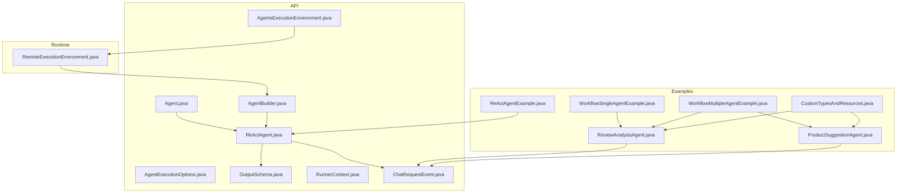
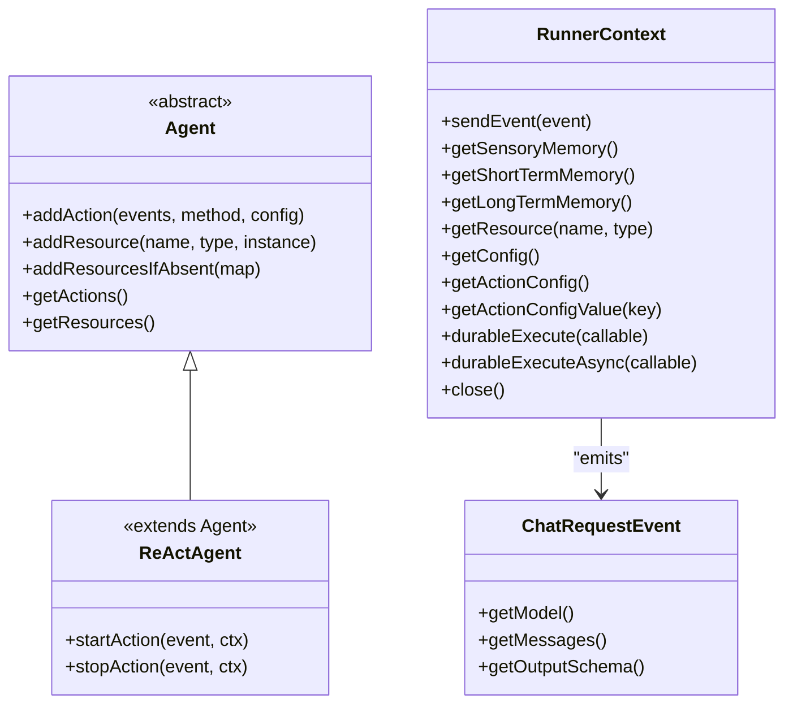
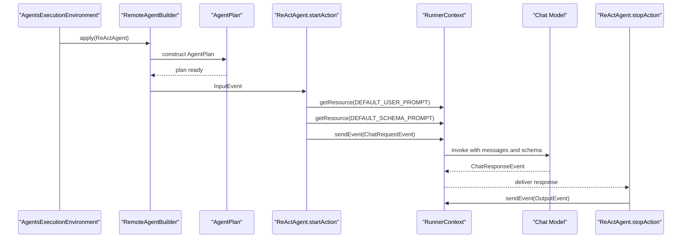
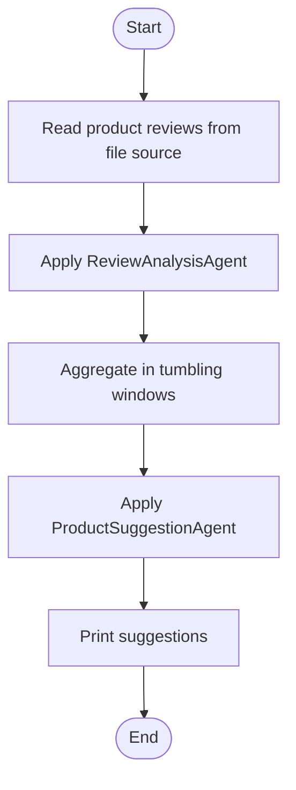
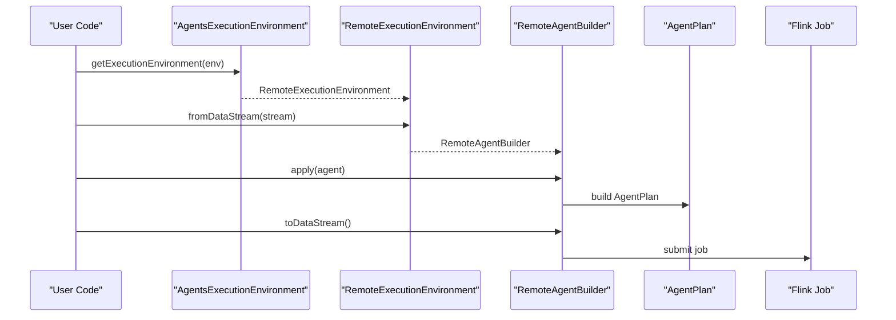
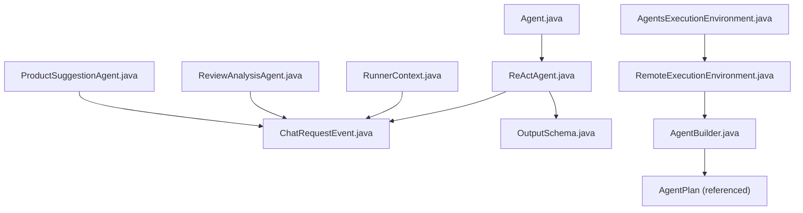

# Agent Types and Implementations

<cite>
**Referenced Files in This Document**
- [Agent.java](file://api/src/main/java/org/apache/flink/agents/api/agents/Agent.java)
- [ReActAgent.java](file://api/src/main/java/org/apache/flink/agents/api/agents/ReActAgent.java)
- [AgentExecutionOptions.java](file://api/src/main/java/org/apache/flink/agents/api/agents/AgentExecutionOptions.java)
- [OutputSchema.java](file://api/src/main/java/org/apache/flink/agents/api/agents/OutputSchema.java)
- [AgentBuilder.java](file://api/src/main/java/org/apache/flink/agents/api/AgentBuilder.java)
- [AgentsExecutionEnvironment.java](file://api/src/main/java/org/apache/flink/agents/api/AgentsExecutionEnvironment.java)
- [RunnerContext.java](file://api/src/main/java/org/apache/flink/agents/api/context/RunnerContext.java)
- [ChatRequestEvent.java](file://api/src/main/java/org/apache/flink/agents/api/event/ChatRequestEvent.java)
- [ReActAgentExample.java](file://examples/src/main/java/org/apache/flink/agents/examples/ReActAgentExample.java)
- [WorkflowSingleAgentExample.java](file://examples/src/main/java/org/apache/flink/agents/examples/WorkflowSingleAgentExample.java)
- [WorkflowMultipleAgentExample.java](file://examples/src/main/java/org/apache/flink/agents/examples/WorkflowMultipleAgentExample.java)
- [ReviewAnalysisAgent.java](file://examples/src/main/java/org/apache/flink/agents/examples/agents/ReviewAnalysisAgent.java)
- [ProductSuggestionAgent.java](file://examples/src/main/java/org/apache/flink/agents/examples/agents/ProductSuggestionAgent.java)
- [CustomTypesAndResources.java](file://examples/src/main/java/org/apache/flink/agents/examples/agents/CustomTypesAndResources.java)
- [RemoteExecutionEnvironment.java](file://runtime/src/main/java/org/apache/flink/agents/runtime/env/RemoteExecutionEnvironment.java)
</cite>

## Table of Contents
1. [Introduction](#introduction)
2. [Project Structure](#project-structure)
3. [Core Components](#core-components)
4. [Architecture Overview](#architecture-overview)
5. [Detailed Component Analysis](#detailed-component-analysis)
6. [Dependency Analysis](#dependency-analysis)
7. [Performance Considerations](#performance-considerations)
8. [Troubleshooting Guide](#troubleshooting-guide)
9. [Conclusion](#conclusion)
10. [Appendices](#appendices)

## Introduction
This document explains the agent types and implementations in Flink Agents, focusing on the built-in ReAct agent, the base Agent class architecture, and workflow agents for multi-agent coordination. It covers how agents reason and act via function/tool calling, how to configure execution options, and how to compose processing pipelines with streaming DataStreams. Practical examples from the codebase illustrate different agent patterns and use cases, along with lifecycle phases, initialization requirements, and resource dependencies.

## Project Structure
Flink Agents exposes a clean separation between the API surface (agents, builders, execution environments, events, and context), runtime integration (remote execution), and examples (single and multi-agent workflows). The API module defines the agent abstractions and built-in implementations, while the runtime module integrates with Flink’s streaming engine. Examples demonstrate real-world patterns for single-agent and multi-agent pipelines.

**Diagram sources**
- [Agent.java](file://api/src/main/java/org/apache/flink/agents/api/agents/Agent.java#L34-L131)
- [ReActAgent.java](file://api/src/main/java/org/apache/flink/agents/api/agents/ReActAgent.java#L51-L183)
- [AgentExecutionOptions.java](file://api/src/main/java/org/apache/flink/agents/api/agents/AgentExecutionOptions.java#L24-L47)
- [OutputSchema.java](file://api/src/main/java/org/apache/flink/agents/api/agents/OutputSchema.java#L50-L135)
- [AgentBuilder.java](file://api/src/main/java/org/apache/flink/agents/api/AgentBuilder.java#L35-L77)
- [AgentsExecutionEnvironment.java](file://api/src/main/java/org/apache/flink/agents/api/AgentsExecutionEnvironment.java#L43-L223)
- [RunnerContext.java](file://api/src/main/java/org/apache/flink/agents/api/context/RunnerContext.java#L33-L138)
- [ChatRequestEvent.java](file://api/src/main/java/org/apache/flink/agents/api/event/ChatRequestEvent.java#L29-L58)
- [RemoteExecutionEnvironment.java](file://runtime/src/main/java/org/apache/flink/agents/runtime/env/RemoteExecutionEnvironment.java#L50-L217)
- [ReActAgentExample.java](file://examples/src/main/java/org/apache/flink/agents/examples/ReActAgentExample.java#L55-L161)
- [WorkflowSingleAgentExample.java](file://examples/src/main/java/org/apache/flink/agents/examples/WorkflowSingleAgentExample.java#L49-L123)
- [WorkflowMultipleAgentExample.java](file://examples/src/main/java/org/apache/flink/agents/examples/WorkflowMultipleAgentExample.java#L64-L190)
- [ReviewAnalysisAgent.java](file://examples/src/main/java/org/apache/flink/agents/examples/agents/ReviewAnalysisAgent.java#L53-L132)
- [ProductSuggestionAgent.java](file://examples/src/main/java/org/apache/flink/agents/examples/agents/ProductSuggestionAgent.java#L52-L114)
- [CustomTypesAndResources.java](file://examples/src/main/java/org/apache/flink/agents/examples/agents/CustomTypesAndResources.java#L34-L265)

**Section sources**
- [Agent.java](file://api/src/main/java/org/apache/flink/agents/api/agents/Agent.java#L34-L131)
- [ReActAgent.java](file://api/src/main/java/org/apache/flink/agents/api/agents/ReActAgent.java#L51-L183)
- [AgentExecutionOptions.java](file://api/src/main/java/org/apache/flink/agents/api/agents/AgentExecutionOptions.java#L24-L47)
- [OutputSchema.java](file://api/src/main/java/org/apache/flink/agents/api/agents/OutputSchema.java#L50-L135)
- [AgentBuilder.java](file://api/src/main/java/org/apache/flink/agents/api/AgentBuilder.java#L35-L77)
- [AgentsExecutionEnvironment.java](file://api/src/main/java/org/apache/flink/agents/api/AgentsExecutionEnvironment.java#L43-L223)
- [RunnerContext.java](file://api/src/main/java/org/apache/flink/agents/api/context/RunnerContext.java#L33-L138)
- [ChatRequestEvent.java](file://api/src/main/java/org/apache/flink/agents/api/event/ChatRequestEvent.java#L29-L58)
- [RemoteExecutionEnvironment.java](file://runtime/src/main/java/org/apache/flink/agents/runtime/env/RemoteExecutionEnvironment.java#L50-L217)
- [ReActAgentExample.java](file://examples/src/main/java/org/apache/flink/agents/examples/ReActAgentExample.java#L55-L161)
- [WorkflowSingleAgentExample.java](file://examples/src/main/java/org/apache/flink/agents/examples/WorkflowSingleAgentExample.java#L49-L123)
- [WorkflowMultipleAgentExample.java](file://examples/src/main/java/org/apache/flink/agents/examples/WorkflowMultipleAgentExample.java#L64-L190)
- [ReviewAnalysisAgent.java](file://examples/src/main/java/org/apache/flink/agents/examples/agents/ReviewAnalysisAgent.java#L53-L132)
- [ProductSuggestionAgent.java](file://examples/src/main/java/org/apache/flink/agents/examples/agents/ProductSuggestionAgent.java#L52-L114)
- [CustomTypesAndResources.java](file://examples/src/main/java/org/apache/flink/agents/examples/agents/CustomTypesAndResources.java#L34-L265)

## Core Components
- Base Agent: Defines actions and resources, supports adding actions and resources, and provides error handling strategy constants and a structured output marker.
- ReActAgent: Built-in agent implementing reasoning (think) and acting (tool/function call) via chat model interactions and output schema enforcement.
- AgentExecutionOptions: Execution configuration knobs for error handling, retries, async behavior, and thread pool sizing.
- OutputSchema: Serialization helper for Row-based output schemas.
- AgentBuilder and AgentsExecutionEnvironment: Fluent integration with Flink DataStream/Table APIs and local execution.
- RunnerContext: Action execution context exposing memory, metrics, resource access, configuration, and event emission.
- ChatRequestEvent: Event carrying chat model requests with optional output schema.

**Section sources**
- [Agent.java](file://api/src/main/java/org/apache/flink/agents/api/agents/Agent.java#L34-L131)
- [ReActAgent.java](file://api/src/main/java/org/apache/flink/agents/api/agents/ReActAgent.java#L51-L183)
- [AgentExecutionOptions.java](file://api/src/main/java/org/apache/flink/agents/api/agents/AgentExecutionOptions.java#L24-L47)
- [OutputSchema.java](file://api/src/main/java/org/apache/flink/agents/api/agents/OutputSchema.java#L50-L135)
- [AgentBuilder.java](file://api/src/main/java/org/apache/flink/agents/api/AgentBuilder.java#L35-L77)
- [AgentsExecutionEnvironment.java](file://api/src/main/java/org/apache/flink/agents/api/AgentsExecutionEnvironment.java#L43-L223)
- [RunnerContext.java](file://api/src/main/java/org/apache/flink/agents/api/context/RunnerContext.java#L33-L138)
- [ChatRequestEvent.java](file://api/src/main/java/org/apache/flink/agents/api/event/ChatRequestEvent.java#L29-L58)

## Architecture Overview
The agent architecture centers around the Agent abstraction and action-driven processing. Agents register actions that listen to specific events and produce downstream events. The ReActAgent specializes in prompting, structured output, and tool/function calling through a chat model. Execution environments bridge agents to Flink streams and tables, while RunnerContext mediates memory, metrics, and resource access during action execution.

**Diagram sources**
- [Agent.java](file://api/src/main/java/org/apache/flink/agents/api/agents/Agent.java#L34-L131)
- [ReActAgent.java](file://api/src/main/java/org/apache/flink/agents/api/agents/ReActAgent.java#L51-L183)
- [RunnerContext.java](file://api/src/main/java/org/apache/flink/agents/api/context/RunnerContext.java#L33-L138)
- [ChatRequestEvent.java](file://api/src/main/java/org/apache/flink/agents/api/event/ChatRequestEvent.java#L29-L58)

## Detailed Component Analysis

### Base Agent Class and Abstract Methods
- Responsibilities:
  - Manage actions: registration with event listeners and optional per-action configuration.
  - Manage resources: typed resource registry supporting serializable resources and descriptors.
  - Provide error handling strategy constants and a structured output marker.
- Notable behaviors:
  - Prevents duplicate action names.
  - Validates resource types and prevents duplicates.
  - Exposes getters for actions and resources for plan generation and runtime wiring.

Implementation highlights:
- Action registration via reflection-based method binding.
- Resource registration with type safety and duplication checks.
- Error handling strategy enum for execution policies.

**Section sources**
- [Agent.java](file://api/src/main/java/org/apache/flink/agents/api/agents/Agent.java#L34-L131)

### ReAct Agent: Reasoning and Acting via Function Calling
- Purpose: Implements a ReAct-style loop using a chat model, structured output schema enforcement, and tool/function calling.
- Initialization:
  - Registers a default chat model resource.
  - Optionally registers a default schema prompt derived from an output schema (RowTypeInfo or POJO class).
  - Optionally registers a default user prompt resource.
  - Adds a start action bound to InputEvent and a stop action bound to ChatResponseEvent.
- Behavior:
  - startAction:
    - Converts input (primitive, Row, or POJO) to user messages using a prompt if provided.
    - Prepends a system schema prompt if configured.
    - Emits a ChatRequestEvent with the model, messages, and optional output schema.
  - stopAction:
    - Extracts structured output if present, otherwise uses raw content.
    - Emits an OutputEvent with the result.

**Diagram sources**
- [ReActAgent.java](file://api/src/main/java/org/apache/flink/agents/api/agents/ReActAgent.java#L59-L183)
- [ChatRequestEvent.java](file://api/src/main/java/org/apache/flink/agents/api/event/ChatRequestEvent.java#L29-L58)
- [RunnerContext.java](file://api/src/main/java/org/apache/flink/agents/api/context/RunnerContext.java#L33-L138)
- [RemoteExecutionEnvironment.java](file://runtime/src/main/java/org/apache/flink/agents/runtime/env/RemoteExecutionEnvironment.java#L173-L208)

Practical example references:
- Creating a ReActAgent with a chat model connection, prompt, and POJO output schema.
- Integrating tools via the chat model setup and emitting notifications.

**Section sources**
- [ReActAgent.java](file://api/src/main/java/org/apache/flink/agents/api/agents/ReActAgent.java#L59-L183)
- [OutputSchema.java](file://api/src/main/java/org/apache/flink/agents/api/agents/OutputSchema.java#L50-L135)
- [ReActAgentExample.java](file://examples/src/main/java/org/apache/flink/agents/examples/ReActAgentExample.java#L148-L161)

### Workflow Agents: Multi-Agent Coordination and Pipelines
- Single-agent workflow:
  - Reads a streaming source, applies a single agent, and prints results.
- Multi-agent workflow:
  - Stage 1: ReviewAnalysisAgent extracts scores and reasons.
  - Stage 2: Windowed aggregation computes score distributions and collects reasons.
  - Stage 3: ProductSuggestionAgent generates improvement suggestions from aggregated data.

**Diagram sources**
- [WorkflowSingleAgentExample.java](file://examples/src/main/java/org/apache/flink/agents/examples/WorkflowSingleAgentExample.java#L52-L92)
- [WorkflowMultipleAgentExample.java](file://examples/src/main/java/org/apache/flink/agents/examples/WorkflowMultipleAgentExample.java#L126-L190)
- [ReviewAnalysisAgent.java](file://examples/src/main/java/org/apache/flink/agents/examples/agents/ReviewAnalysisAgent.java#L88-L132)
- [ProductSuggestionAgent.java](file://examples/src/main/java/org/apache/flink/agents/examples/agents/ProductSuggestionAgent.java#L73-L114)

Agent implementations:
- ReviewAnalysisAgent:
  - Uses a chat model setup and a prompt to parse review content.
  - Emits structured analysis results and can call a shipping notification tool.
- ProductSuggestionAgent:
  - Receives aggregated summaries, stores identifiers in short-term memory, and queries a model to produce suggestions.

**Section sources**
- [WorkflowSingleAgentExample.java](file://examples/src/main/java/org/apache/flink/agents/examples/WorkflowSingleAgentExample.java#L52-L92)
- [WorkflowMultipleAgentExample.java](file://examples/src/main/java/org/apache/flink/agents/examples/WorkflowMultipleAgentExample.java#L126-L190)
- [ReviewAnalysisAgent.java](file://examples/src/main/java/org/apache/flink/agents/examples/agents/ReviewAnalysisAgent.java#L53-L132)
- [ProductSuggestionAgent.java](file://examples/src/main/java/org/apache/flink/agents/examples/agents/ProductSuggestionAgent.java#L52-L114)
- [CustomTypesAndResources.java](file://examples/src/main/java/org/apache/flink/agents/examples/agents/CustomTypesAndResources.java#L34-L265)

### Execution Environment and Builder Integration
- AgentsExecutionEnvironment:
  - Factory-based creation of local vs. remote environments.
  - Input sources: fromList (local), fromDataStream (remote), fromTable (remote).
  - Resource registration and configuration access.
- RemoteExecutionEnvironment:
  - Loads agent configuration from a YAML file.
  - Builds RemoteAgentBuilder to connect DataStream/Table inputs to AgentPlan.
- AgentBuilder:
  - apply(Agent): constructs AgentPlan and wires resources.
  - toDataStream/toTable: materializes the pipeline.

**Diagram sources**
- [AgentsExecutionEnvironment.java](file://api/src/main/java/org/apache/flink/agents/api/AgentsExecutionEnvironment.java#L68-L121)
- [RemoteExecutionEnvironment.java](file://runtime/src/main/java/org/apache/flink/agents/runtime/env/RemoteExecutionEnvironment.java#L50-L217)
- [AgentBuilder.java](file://api/src/main/java/org/apache/flink/agents/api/AgentBuilder.java#L35-L77)

**Section sources**
- [AgentsExecutionEnvironment.java](file://api/src/main/java/org/apache/flink/agents/api/AgentsExecutionEnvironment.java#L43-L223)
- [RemoteExecutionEnvironment.java](file://runtime/src/main/java/org/apache/flink/agents/runtime/env/RemoteExecutionEnvironment.java#L50-L217)
- [AgentBuilder.java](file://api/src/main/java/org/apache/flink/agents/api/AgentBuilder.java#L35-L77)

### Agent Lifecycle Phases and Resource Dependencies
- Initialization:
  - Register resources (chat model connections, prompts, tools) via AgentsExecutionEnvironment.
  - Construct agents (e.g., ReActAgent) with resource descriptors and optional output schema/prompt.
- Planning:
  - AgentPlan is built from the agent and configuration; actions and resources are extracted.
- Execution:
  - RemoteAgentBuilder connects the input DataStream/Table to the AgentPlan.
  - Actions are invoked in response to events; RunnerContext manages memory, metrics, and resource access.
- Shutdown:
  - RunnerContext.close() cleans up resources.

Resource dependencies:
- Chat model connections and setups.
- Prompts for input formatting and schema enforcement.
- Tools/functions for external actions.

**Section sources**
- [AgentsExecutionEnvironment.java](file://api/src/main/java/org/apache/flink/agents/api/AgentsExecutionEnvironment.java#L207-L221)
- [ReActAgent.java](file://api/src/main/java/org/apache/flink/agents/api/agents/ReActAgent.java#L59-L101)
- [RunnerContext.java](file://api/src/main/java/org/apache/flink/agents/api/context/RunnerContext.java#L33-L138)
- [RemoteExecutionEnvironment.java](file://runtime/src/main/java/org/apache/flink/agents/runtime/env/RemoteExecutionEnvironment.java#L173-L208)

### Agent Selection Criteria and Performance Characteristics
- Use ReActAgent when:
  - Structured output is required (Row or POJO).
  - Reasoning and acting via a chat model with optional tool/function calling are needed.
  - A prompt is available to guide input formatting.
- Use custom Agent subclasses when:
  - Fine-grained control over multi-step orchestration is needed.
  - Specialized memory/state management or domain-specific events are required.
- Performance considerations:
  - Tune async behavior and thread pools via AgentExecutionOptions.
  - Limit concurrency to avoid overwhelming external model servers.
  - Use windowing and keyed streams for stateful multi-agent pipelines.

**Section sources**
- [AgentExecutionOptions.java](file://api/src/main/java/org/apache/flink/agents/api/agents/AgentExecutionOptions.java#L24-L47)
- [WorkflowMultipleAgentExample.java](file://examples/src/main/java/org/apache/flink/agents/examples/WorkflowMultipleAgentExample.java#L126-L190)
- [ReActAgentExample.java](file://examples/src/main/java/org/apache/flink/agents/examples/ReActAgentExample.java#L80-L90)

## Dependency Analysis
The following diagram shows key dependencies among agent components and runtime integration.

**Diagram sources**
- [Agent.java](file://api/src/main/java/org/apache/flink/agents/api/agents/Agent.java#L34-L131)
- [ReActAgent.java](file://api/src/main/java/org/apache/flink/agents/api/agents/ReActAgent.java#L51-L183)
- [ChatRequestEvent.java](file://api/src/main/java/org/apache/flink/agents/api/event/ChatRequestEvent.java#L29-L58)
- [OutputSchema.java](file://api/src/main/java/org/apache/flink/agents/api/agents/OutputSchema.java#L50-L135)
- [AgentsExecutionEnvironment.java](file://api/src/main/java/org/apache/flink/agents/api/AgentsExecutionEnvironment.java#L43-L223)
- [RemoteExecutionEnvironment.java](file://runtime/src/main/java/org/apache/flink/agents/runtime/env/RemoteExecutionEnvironment.java#L50-L217)
- [AgentBuilder.java](file://api/src/main/java/org/apache/flink/agents/api/AgentBuilder.java#L35-L77)
- [RunnerContext.java](file://api/src/main/java/org/apache/flink/agents/api/context/RunnerContext.java#L33-L138)
- [ReviewAnalysisAgent.java](file://examples/src/main/java/org/apache/flink/agents/examples/agents/ReviewAnalysisAgent.java#L53-L132)
- [ProductSuggestionAgent.java](file://examples/src/main/java/org/apache/flink/agents/examples/agents/ProductSuggestionAgent.java#L52-L114)

**Section sources**
- [Agent.java](file://api/src/main/java/org/apache/flink/agents/api/agents/Agent.java#L34-L131)
- [ReActAgent.java](file://api/src/main/java/org/apache/flink/agents/api/agents/ReActAgent.java#L51-L183)
- [AgentsExecutionEnvironment.java](file://api/src/main/java/org/apache/flink/agents/api/AgentsExecutionEnvironment.java#L43-L223)
- [RemoteExecutionEnvironment.java](file://runtime/src/main/java/org/apache/flink/agents/runtime/env/RemoteExecutionEnvironment.java#L50-L217)
- [AgentBuilder.java](file://api/src/main/java/org/apache/flink/agents/api/AgentBuilder.java#L35-L77)
- [RunnerContext.java](file://api/src/main/java/org/apache/flink/agents/api/context/RunnerContext.java#L33-L138)
- [ChatRequestEvent.java](file://api/src/main/java/org/apache/flink/agents/api/event/ChatRequestEvent.java#L29-L58)
- [ReviewAnalysisAgent.java](file://examples/src/main/java/org/apache/flink/agents/examples/agents/ReviewAnalysisAgent.java#L53-L132)
- [ProductSuggestionAgent.java](file://examples/src/main/java/org/apache/flink/agents/examples/agents/ProductSuggestionAgent.java#L52-L114)

## Performance Considerations
- Concurrency and async:
  - Control async behavior for chat, tool calls, and RAG via AgentExecutionOptions.
  - Adjust NUM_ASYNC_THREADS to balance throughput and resource limits.
- Backpressure and batching:
  - Use windowing and keyed streams to manage state and throughput in multi-agent pipelines.
- Resource limits:
  - External model servers may throttle; tune async threads accordingly.

[No sources needed since this section provides general guidance]

## Troubleshooting Guide
Common issues and remedies:
- Unsupported resource type when registering:
  - Ensure the resource is a SerializableResource or ResourceDescriptor.
- Duplicate resource or action name:
  - Verify uniqueness of names and types when adding resources and actions.
- Missing prompt for non-primitive input:
  - Provide a prompt to convert complex inputs to chat messages.
- Invalid output schema:
  - Ensure RowTypeInfo contains only basic types or use a POJO class with a compatible schema.
- Execution errors:
  - Configure error handling strategy and retries via AgentExecutionOptions.

**Section sources**
- [Agent.java](file://api/src/main/java/org/apache/flink/agents/api/agents/Agent.java#L97-L111)
- [ReActAgent.java](file://api/src/main/java/org/apache/flink/agents/api/agents/ReActAgent.java#L124-L129)
- [OutputSchema.java](file://api/src/main/java/org/apache/flink/agents/api/agents/OutputSchema.java#L55-L60)
- [AgentExecutionOptions.java](file://api/src/main/java/org/apache/flink/agents/api/agents/AgentExecutionOptions.java#L24-L47)

## Conclusion
Flink Agents provides a flexible, event-driven agent framework with a strong focus on streaming integration and structured outputs. The ReActAgent exemplifies reasoning and acting via chat models and tool/function calling, while the base Agent class offers a foundation for custom implementations. Multi-agent workflows can be composed using Flink DataStreams and tables, with clear lifecycle phases from initialization to execution and shutdown. Proper configuration of execution options and resource management ensures robust and performant deployments.

[No sources needed since this section summarizes without analyzing specific files]

## Appendices

### Practical Examples Index
- ReActAgent with structured output and tool integration:
  - [ReActAgentExample.java](file://examples/src/main/java/org/apache/flink/agents/examples/ReActAgentExample.java#L80-L161)
- Single-agent streaming pipeline:
  - [WorkflowSingleAgentExample.java](file://examples/src/main/java/org/apache/flink/agents/examples/WorkflowSingleAgentExample.java#L52-L92)
- Multi-agent streaming pipeline:
  - [WorkflowMultipleAgentExample.java](file://examples/src/main/java/org/apache/flink/agents/examples/WorkflowMultipleAgentExample.java#L126-L190)
- Custom agent implementations:
  - [ReviewAnalysisAgent.java](file://examples/src/main/java/org/apache/flink/agents/examples/agents/ReviewAnalysisAgent.java#L53-L132)
  - [ProductSuggestionAgent.java](file://examples/src/main/java/org/apache/flink/agents/examples/agents/ProductSuggestionAgent.java#L52-L114)
- Shared types and prompts:
  - [CustomTypesAndResources.java](file://examples/src/main/java/org/apache/flink/agents/examples/agents/CustomTypesAndResources.java#L34-L265)

[No sources needed since this section indexes examples without analyzing specific files]