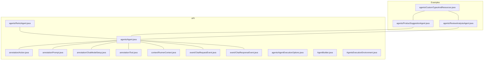
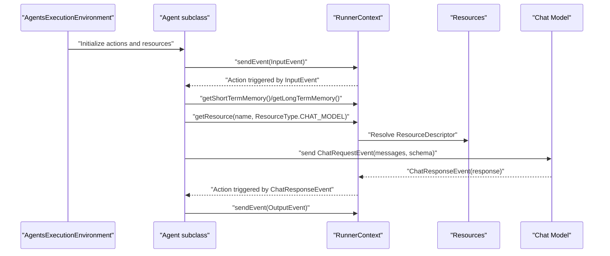
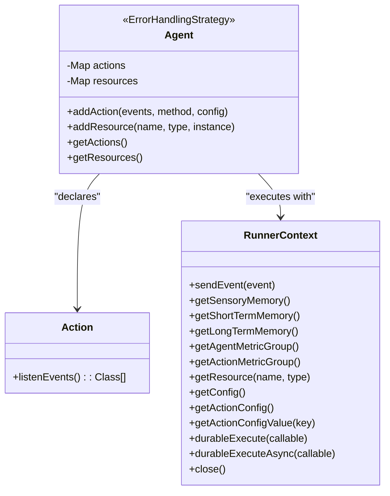
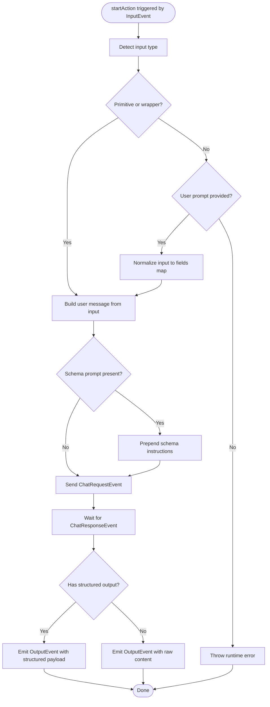
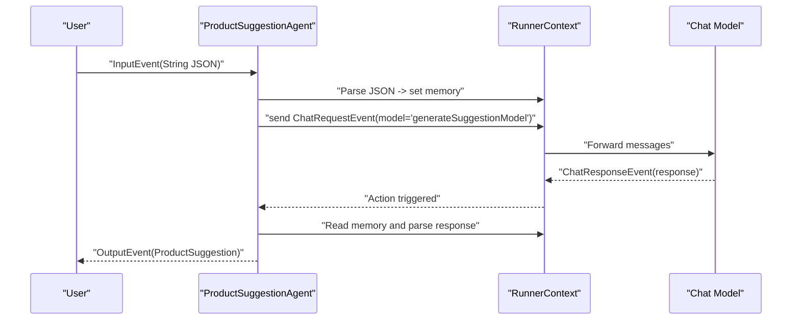
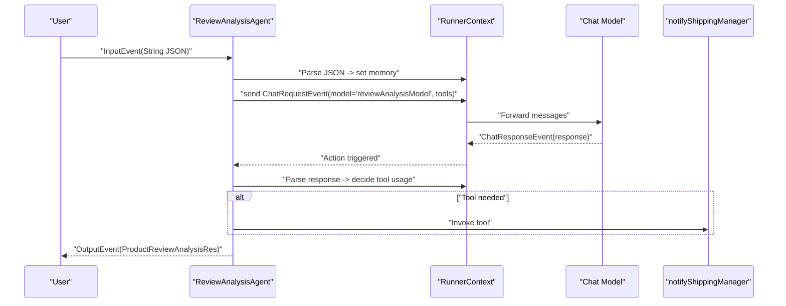
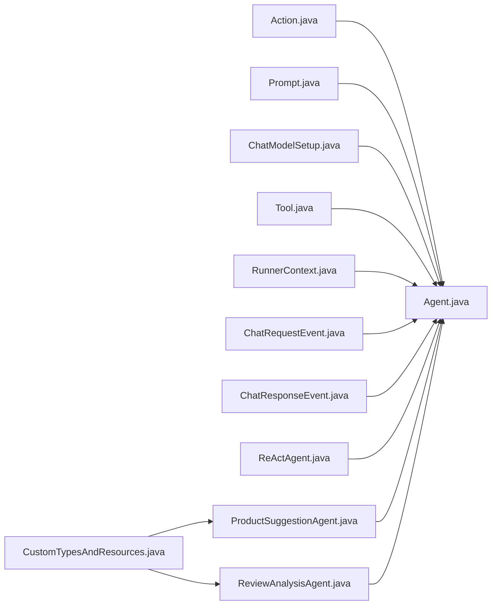

# Custom Agent Development

<cite>
**Referenced Files in This Document**
- [Agent.java](file://api/src/main/java/org/apache/flink/agents/api/agents/Agent.java)
- [Action.java](file://api/src/main/java/org/apache/flink/agents/api/annotation/Action.java)
- [Prompt.java](file://api/src/main/java/org/apache/flink/agents/api/annotation/Prompt.java)
- [ChatModelSetup.java](file://api/src/main/java/org/apache/flink/agents/api/annotation/ChatModelSetup.java)
- [Tool.java](file://api/src/main/java/org/apache/flink/agents/api/annotation/Tool.java)
- [RunnerContext.java](file://api/src/main/java/org/apache/flink/agents/api/context/RunnerContext.java)
- [ChatRequestEvent.java](file://api/src/main/java/org/apache/flink/agents/api/event/ChatRequestEvent.java)
- [ChatResponseEvent.java](file://api/src/main/java/org/apache/flink/agents/api/event/ChatResponseEvent.java)
- [AgentExecutionOptions.java](file://api/src/main/java/org/apache/flink/agents/api/agents/AgentExecutionOptions.java)
- [AgentBuilder.java](file://api/src/main/java/org/apache/flink/agents/api/AgentBuilder.java)
- [AgentsExecutionEnvironment.java](file://api/src/main/java/org/apache/flink/agents/api/AgentsExecutionEnvironment.java)
- [ReActAgent.java](file://api/src/main/java/org/apache/flink/agents/api/agents/ReActAgent.java)
- [ProductSuggestionAgent.java](file://examples/src/main/java/org/apache/flink/agents/examples/agents/ProductSuggestionAgent.java)
- [ReviewAnalysisAgent.java](file://examples/src/main/java/org/apache/flink/agents/examples/agents/ReviewAnalysisAgent.java)
- [CustomTypesAndResources.java](file://examples/src/main/java/org/apache/flink/agents/examples/agents/CustomTypesAndResources.java)
</cite>

## Table of Contents
1. [Introduction](#introduction)
2. [Project Structure](#project-structure)
3. [Core Components](#core-components)
4. [Architecture Overview](#architecture-overview)
5. [Detailed Component Analysis](#detailed-component-analysis)
6. [Dependency Analysis](#dependency-analysis)
7. [Performance Considerations](#performance-considerations)
8. [Troubleshooting Guide](#troubleshooting-guide)
9. [Conclusion](#conclusion)
10. [Appendices](#appendices)

## Introduction
This document explains how to develop custom agents for Flink Agents. It covers extending the base Agent class, using the Action annotation system to define behaviors and event handlers, and building domain-specific agents such as product suggestion and review analysis agents. It also provides best practices for separation of concerns, modularity, and reusability; step-by-step guides for implementing custom actions, handling different input types, and integrating with external resources; testing strategies, debugging techniques, and performance optimization; and reusable templates and patterns for common scenarios.

## Project Structure
Flink Agents is organized into several modules:
- api: Core agent framework, annotations, events, context, execution environment, and built-in agents
- examples: Example agents and custom types/resources demonstrating practical usage
- integrations: Chat models, embedding models, MCP, and vector stores integrations
- plan/runtime/python: Agent plan generation, serialization, and cross-language execution
- docs: Documentation site and content

**Diagram sources**
- [Agent.java](file://api/src/main/java/org/apache/flink/agents/api/agents/Agent.java#L34-L131)
- [ReActAgent.java](file://api/src/main/java/org/apache/flink/agents/api/agents/ReActAgent.java#L51-L183)
- [Action.java](file://api/src/main/java/org/apache/flink/agents/api/annotation/Action.java#L28-L54)
- [Prompt.java](file://api/src/main/java/org/apache/flink/agents/api/annotation/Prompt.java#L26-L35)
- [ChatModelSetup.java](file://api/src/main/java/org/apache/flink/agents/api/annotation/ChatModelSetup.java#L26-L35)
- [Tool.java](file://api/src/main/java/org/apache/flink/agents/api/annotation/Tool.java#L26-L43)
- [RunnerContext.java](file://api/src/main/java/org/apache/flink/agents/api/context/RunnerContext.java#L29-L138)
- [ChatRequestEvent.java](file://api/src/main/java/org/apache/flink/agents/api/event/ChatRequestEvent.java#L28-L58)
- [ChatResponseEvent.java](file://api/src/main/java/org/apache/flink/agents/api/event/ChatResponseEvent.java#L26-L43)
- [AgentExecutionOptions.java](file://api/src/main/java/org/apache/flink/agents/api/agents/AgentExecutionOptions.java#L23-L48)
- [AgentBuilder.java](file://api/src/main/java/org/apache/flink/agents/api/AgentBuilder.java#L29-L77)
- [AgentsExecutionEnvironment.java](file://api/src/main/java/org/apache/flink/agents/api/AgentsExecutionEnvironment.java#L37-L223)
- [ProductSuggestionAgent.java](file://examples/src/main/java/org/apache/flink/agents/examples/agents/ProductSuggestionAgent.java#L52-L114)
- [ReviewAnalysisAgent.java](file://examples/src/main/java/org/apache/flink/agents/examples/agents/ReviewAnalysisAgent.java#L53-L132)
- [CustomTypesAndResources.java](file://examples/src/main/java/org/apache/flink/agents/examples/agents/CustomTypesAndResources.java#L34-L265)

**Section sources**
- [Agent.java](file://api/src/main/java/org/apache/flink/agents/api/agents/Agent.java#L34-L131)
- [Action.java](file://api/src/main/java/org/apache/flink/agents/api/annotation/Action.java#L28-L54)
- [RunnerContext.java](file://api/src/main/java/org/apache/flink/agents/api/context/RunnerContext.java#L29-L138)
- [AgentsExecutionEnvironment.java](file://api/src/main/java/org/apache/flink/agents/api/AgentsExecutionEnvironment.java#L37-L223)

## Core Components
- Agent: Base class for defining agent logic, managing actions and resources, and exposing error handling strategies and structured output constants.
- Annotations:
  - Action: Marks methods as agent actions and declares the event types they listen to.
  - Prompt: Declares prompt resources.
  - ChatModelSetup: Declares chat model setup resources.
  - Tool: Declares tool resources (static methods are wrapped as FunctionTool).
- RunnerContext: Provides access to memory, metrics, resources, configuration, and event emission during action execution.
- Events:
  - ChatRequestEvent: Request to a chat model with messages and optional output schema.
  - ChatResponseEvent: Response from a chat model with request correlation and content.
- Execution Environment:
  - AgentsExecutionEnvironment: Factory and base for execution environments (local vs remote).
  - AgentBuilder: Fluent builder to configure agent inputs and outputs (list, DataStream, Table).
  - AgentExecutionOptions: Configurable options for error handling, retries, and async behavior.

**Section sources**
- [Agent.java](file://api/src/main/java/org/apache/flink/agents/api/agents/Agent.java#L34-L131)
- [Action.java](file://api/src/main/java/org/apache/flink/agents/api/annotation/Action.java#L28-L54)
- [Prompt.java](file://api/src/main/java/org/apache/flink/agents/api/annotation/Prompt.java#L26-L35)
- [ChatModelSetup.java](file://api/src/main/java/org/apache/flink/agents/api/annotation/ChatModelSetup.java#L26-L35)
- [Tool.java](file://api/src/main/java/org/apache/flink/agents/api/annotation/Tool.java#L26-L43)
- [RunnerContext.java](file://api/src/main/java/org/apache/flink/agents/api/context/RunnerContext.java#L29-L138)
- [ChatRequestEvent.java](file://api/src/main/java/org/apache/flink/agents/api/event/ChatRequestEvent.java#L28-L58)
- [ChatResponseEvent.java](file://api/src/main/java/org/apache/flink/agents/api/event/ChatResponseEvent.java#L26-L43)
- [AgentExecutionOptions.java](file://api/src/main/java/org/apache/flink/agents/api/agents/AgentExecutionOptions.java#L23-L48)
- [AgentBuilder.java](file://api/src/main/java/org/apache/flink/agents/api/AgentBuilder.java#L29-L77)
- [AgentsExecutionEnvironment.java](file://api/src/main/java/org/apache/flink/agents/api/AgentsExecutionEnvironment.java#L37-L223)

## Architecture Overview
The agent lifecycle revolves around actions responding to events, interacting with resources via RunnerContext, and emitting OutputEvent or other domain-specific events. Built-in ReActAgent demonstrates structured output and schema enforcement.

**Diagram sources**
- [AgentsExecutionEnvironment.java](file://api/src/main/java/org/apache/flink/agents/api/AgentsExecutionEnvironment.java#L68-L121)
- [Agent.java](file://api/src/main/java/org/apache/flink/agents/api/agents/Agent.java#L34-L131)
- [RunnerContext.java](file://api/src/main/java/org/apache/flink/agents/api/context/RunnerContext.java#L29-L138)
- [ChatRequestEvent.java](file://api/src/main/java/org/apache/flink/agents/api/event/ChatRequestEvent.java#L28-L58)
- [ChatResponseEvent.java](file://api/src/main/java/org/apache/flink/agents/api/event/ChatResponseEvent.java#L26-L43)
- [ReActAgent.java](file://api/src/main/java/org/apache/flink/agents/api/agents/ReActAgent.java#L103-L181)

## Detailed Component Analysis

### Base Agent and Action System
- Agent manages:
  - Actions: mapping of action names to event types, method, and optional config
  - Resources: typed registry of serializable resources or descriptors
  - Error handling strategy enum and structured output constant
- Action annotation:
  - Methods marked with @Action specify listenEvents to bind to one or more event types
  - Actions are registered statically and invoked by the runtime when matching events occur
- RunnerContext provides:
  - sendEvent to emit domain events
  - Memory accessors for sensory, short-term, and long-term memory
  - Metrics access and configuration retrieval
  - Resource lookup by name and type
  - Durable execution helpers for checkpoint-safe computation

**Diagram sources**
- [Agent.java](file://api/src/main/java/org/apache/flink/agents/api/agents/Agent.java#L34-L131)
- [Action.java](file://api/src/main/java/org/apache/flink/agents/api/annotation/Action.java#L28-L54)
- [RunnerContext.java](file://api/src/main/java/org/apache/flink/agents/api/context/RunnerContext.java#L29-L138)

**Section sources**
- [Agent.java](file://api/src/main/java/org/apache/flink/agents/api/agents/Agent.java#L34-L131)
- [Action.java](file://api/src/main/java/org/apache/flink/agents/api/annotation/Action.java#L28-L54)
- [RunnerContext.java](file://api/src/main/java/org/apache/flink/agents/api/context/RunnerContext.java#L29-L138)

### Built-in ReAct Agent Pattern
ReActAgent demonstrates:
- Automatic registration of default chat model and optional schema/system prompts
- Input normalization across primitives, Rows, and POJOs
- Structured output extraction and forwarding as OutputEvent

**Diagram sources**
- [ReActAgent.java](file://api/src/main/java/org/apache/flink/agents/api/agents/ReActAgent.java#L59-L181)
- [ChatRequestEvent.java](file://api/src/main/java/org/apache/flink/agents/api/event/ChatRequestEvent.java#L28-L58)
- [ChatResponseEvent.java](file://api/src/main/java/org/apache/flink/agents/api/event/ChatResponseEvent.java#L26-L43)

**Section sources**
- [ReActAgent.java](file://api/src/main/java/org/apache/flink/agents/api/agents/ReActAgent.java#L51-L183)

### Domain-Specific Agents: Product Suggestion and Review Analysis
These examples illustrate:
- Using @Prompt and @ChatModelSetup to declare resources
- Using @Action to handle InputEvent and ChatResponseEvent
- Using RunnerContext to set/get memory and send domain events
- Parsing structured LLM outputs and emitting OutputEvent with domain-specific types

**Diagram sources**
- [ProductSuggestionAgent.java](file://examples/src/main/java/org/apache/flink/agents/examples/agents/ProductSuggestionAgent.java#L74-L114)
- [CustomTypesAndResources.java](file://examples/src/main/java/org/apache/flink/agents/examples/agents/CustomTypesAndResources.java#L34-L265)
- [ChatRequestEvent.java](file://api/src/main/java/org/apache/flink/agents/api/event/ChatRequestEvent.java#L28-L58)
- [ChatResponseEvent.java](file://api/src/main/java/org/apache/flink/agents/api/event/ChatResponseEvent.java#L26-L43)

**Diagram sources**
- [ReviewAnalysisAgent.java](file://examples/src/main/java/org/apache/flink/agents/examples/agents/ReviewAnalysisAgent.java#L89-L132)
- [CustomTypesAndResources.java](file://examples/src/main/java/org/apache/flink/agents/examples/agents/CustomTypesAndResources.java#L34-L265)
- [ChatRequestEvent.java](file://api/src/main/java/org/apache/flink/agents/api/event/ChatRequestEvent.java#L28-L58)
- [ChatResponseEvent.java](file://api/src/main/java/org/apache/flink/agents/api/event/ChatResponseEvent.java#L26-L43)

**Section sources**
- [ProductSuggestionAgent.java](file://examples/src/main/java/org/apache/flink/agents/examples/agents/ProductSuggestionAgent.java#L52-L114)
- [ReviewAnalysisAgent.java](file://examples/src/main/java/org/apache/flink/agents/examples/agents/ReviewAnalysisAgent.java#L53-L132)
- [CustomTypesAndResources.java](file://examples/src/main/java/org/apache/flink/agents/examples/agents/CustomTypesAndResources.java#L34-L265)

### Best Practices for Agent Design
- Separation of concerns:
  - Keep actions small and focused on a single responsibility
  - Encapsulate prompt construction and resource setup in dedicated methods annotated with @Prompt and @ChatModelSetup
- Modularity:
  - Define domain DTOs and resources in a central place (e.g., CustomTypesAndResources) for reuse across agents
  - Use @Tool to declare reusable functions that can be invoked by LLMs
- Reusability:
  - Prefer generic patterns (e.g., ReActAgent) for common orchestration tasks
  - Centralize resource registration via addResource/addResourcesIfAbsent
- Error handling:
  - Configure error handling strategy and retries via AgentExecutionOptions
  - Validate LLM outputs and fail fast with clear exceptions when schemas are violated

**Section sources**
- [Agent.java](file://api/src/main/java/org/apache/flink/agents/api/agents/Agent.java#L34-L131)
- [AgentExecutionOptions.java](file://api/src/main/java/org/apache/flink/agents/api/agents/AgentExecutionOptions.java#L23-L48)
- [CustomTypesAndResources.java](file://examples/src/main/java/org/apache/flink/agents/examples/agents/CustomTypesAndResources.java#L34-L265)

### Step-by-Step Guides

#### Implementing a Custom Action
- Define a static method in your Agent subclass
- Annotate it with @Action and specify listenEvents
- Use RunnerContext to:
  - Access memory (short-term/sensory/long-term)
  - Retrieve resources (e.g., chat model)
  - Emit events (e.g., ChatRequestEvent)
- Ensure deterministic behavior and avoid side effects outside RunnerContext APIs

**Section sources**
- [Action.java](file://api/src/main/java/org/apache/flink/agents/api/annotation/Action.java#L28-L54)
- [RunnerContext.java](file://api/src/main/java/org/apache/flink/agents/api/context/RunnerContext.java#L29-L138)
- [ChatRequestEvent.java](file://api/src/main/java/org/apache/flink/agents/api/event/ChatRequestEvent.java#L28-L58)

#### Handling Different Input Types
- For primitives and wrappers: forward as-is or format via user prompt
- For Rows and POJOs: convert to a fields map and format using Prompt
- Enforce schema via ReActAgent’s schema prompt or custom validation

**Section sources**
- [ReActAgent.java](file://api/src/main/java/org/apache/flink/agents/api/agents/ReActAgent.java#L103-L181)

#### Integrating with External Resources
- Declare resources using @ChatModelSetup/@Prompt/@Tool
- Register resources via addResource or addResourcesIfAbsent
- Resolve resources in actions using RunnerContext.getResource

**Section sources**
- [ChatModelSetup.java](file://api/src/main/java/org/apache/flink/agents/api/annotation/ChatModelSetup.java#L26-L35)
- [Prompt.java](file://api/src/main/java/org/apache/flink/agents/api/annotation/Prompt.java#L26-L35)
- [Tool.java](file://api/src/main/java/org/apache/flink/agents/api/annotation/Tool.java#L26-L43)
- [Agent.java](file://api/src/main/java/org/apache/flink/agents/api/agents/Agent.java#L83-L111)
- [RunnerContext.java](file://api/src/main/java/org/apache/flink/agents/api/context/RunnerContext.java#L81-L96)

#### Testing Strategies and Debugging
- Local execution: use AgentsExecutionEnvironment.getExecutionEnvironment() and AgentBuilder.toList() to run and inspect outputs
- Remote execution: integrate with Flink DataStream/Table via fromDataStream/fromTable and execute
- Use RunnerContext metrics and logs to monitor performance and detect anomalies
- Validate structured outputs against expected schemas; raise explicit errors on mismatches

**Section sources**
- [AgentsExecutionEnvironment.java](file://api/src/main/java/org/apache/flink/agents/api/AgentsExecutionEnvironment.java#L68-L121)
- [AgentBuilder.java](file://api/src/main/java/org/apache/flink/agents/api/AgentBuilder.java#L29-L77)
- [RunnerContext.java](file://api/src/main/java/org/apache/flink/agents/api/context/RunnerContext.java#L67-L96)

## Dependency Analysis
The agent framework separates concerns across annotations, runtime context, events, and execution environment. Examples depend on shared custom types/resources while remaining decoupled from internal APIs.

**Diagram sources**
- [Action.java](file://api/src/main/java/org/apache/flink/agents/api/annotation/Action.java#L28-L54)
- [Prompt.java](file://api/src/main/java/org/apache/flink/agents/api/annotation/Prompt.java#L26-L35)
- [ChatModelSetup.java](file://api/src/main/java/org/apache/flink/agents/api/annotation/ChatModelSetup.java#L26-L35)
- [Tool.java](file://api/src/main/java/org/apache/flink/agents/api/annotation/Tool.java#L26-L43)
- [RunnerContext.java](file://api/src/main/java/org/apache/flink/agents/api/context/RunnerContext.java#L29-L138)
- [ChatRequestEvent.java](file://api/src/main/java/org/apache/flink/agents/api/event/ChatRequestEvent.java#L28-L58)
- [ChatResponseEvent.java](file://api/src/main/java/org/apache/flink/agents/api/event/ChatResponseEvent.java#L26-L43)
- [Agent.java](file://api/src/main/java/org/apache/flink/agents/api/agents/Agent.java#L34-L131)
- [ReActAgent.java](file://api/src/main/java/org/apache/flink/agents/api/agents/ReActAgent.java#L51-L183)
- [ProductSuggestionAgent.java](file://examples/src/main/java/org/apache/flink/agents/examples/agents/ProductSuggestionAgent.java#L52-L114)
- [ReviewAnalysisAgent.java](file://examples/src/main/java/org/apache/flink/agents/examples/agents/ReviewAnalysisAgent.java#L53-L132)
- [CustomTypesAndResources.java](file://examples/src/main/java/org/apache/flink/agents/examples/agents/CustomTypesAndResources.java#L34-L265)

**Section sources**
- [Agent.java](file://api/src/main/java/org/apache/flink/agents/api/agents/Agent.java#L34-L131)
- [ProductSuggestionAgent.java](file://examples/src/main/java/org/apache/flink/agents/examples/agents/ProductSuggestionAgent.java#L52-L114)
- [ReviewAnalysisAgent.java](file://examples/src/main/java/org/apache/flink/agents/examples/agents/ReviewAnalysisAgent.java#L53-L132)
- [CustomTypesAndResources.java](file://examples/src/main/java/org/apache/flink/agents/examples/agents/CustomTypesAndResources.java#L34-L265)

## Performance Considerations
- Asynchronous execution:
  - Enable async modes for chat, tool calls, and RAG via AgentExecutionOptions
  - Use durableExecute/durableExecuteAsync for checkpoint-safe async computations
- Concurrency:
  - Tune num-async-threads according to workload characteristics
- Resource locality:
  - Centralize resource registration to minimize resolution overhead
- Output shaping:
  - Use schema prompts to reduce retries caused by malformed outputs

**Section sources**
- [AgentExecutionOptions.java](file://api/src/main/java/org/apache/flink/agents/api/agents/AgentExecutionOptions.java#L23-L48)
- [RunnerContext.java](file://api/src/main/java/org/apache/flink/agents/api/context/RunnerContext.java#L112-L133)

## Troubleshooting Guide
- Duplicate resource or action names:
  - Agent.addResource and Agent.addAction enforce uniqueness; ensure distinct names
- Unsupported resource types:
  - Only SerializableResource or ResourceDescriptor are accepted
- Invalid LLM output schema:
  - Validate parsed JSON fields and throw explicit exceptions when missing
- Missing prompt for complex inputs:
  - ReActAgent requires a user prompt to convert non-primitive inputs to messages
- Event routing:
  - Ensure actions are annotated with correct listenEvents so they trigger on expected events

**Section sources**
- [Agent.java](file://api/src/main/java/org/apache/flink/agents/api/agents/Agent.java#L83-L111)
- [Action.java](file://api/src/main/java/org/apache/flink/agents/api/annotation/Action.java#L28-L54)
- [ReActAgent.java](file://api/src/main/java/org/apache/flink/agents/api/agents/ReActAgent.java#L122-L129)
- [ChatResponseEvent.java](file://api/src/main/java/org/apache/flink/agents/api/event/ChatResponseEvent.java#L26-L43)

## Conclusion
Flink Agents provides a robust, extensible framework for building domain-specific agents. By leveraging the Action annotation system, resource declarations, and RunnerContext, developers can compose agents that interact with LLMs, tools, and external systems while maintaining clean separation of concerns. The provided examples and patterns offer a solid foundation for building production-grade agents with strong testing, debugging, and performance characteristics.

## Appendices

### Templates and Patterns

- Minimal Agent Template
  - Extend Agent
  - Use @Action to declare event handlers
  - Use RunnerContext to access memory and resources
  - Emit OutputEvent or domain-specific events

- Structured Output Pattern (ReAct-style)
  - Provide a schema prompt via ReActAgent or custom prompt
  - Parse response and extract structured output
  - Emit OutputEvent with validated payload

- Tool Use Pattern
  - Declare tools with @Tool
  - Reference tools in chat model setup
  - Invoke tools from action handlers when needed

- Resource Declaration Pattern
  - Use @Prompt and @ChatModelSetup to declare resources
  - Register resources via addResource/addResourcesIfAbsent
  - Resolve resources in actions using RunnerContext.getResource

**Section sources**
- [Agent.java](file://api/src/main/java/org/apache/flink/agents/api/agents/Agent.java#L34-L131)
- [Action.java](file://api/src/main/java/org/apache/flink/agents/api/annotation/Action.java#L28-L54)
- [Prompt.java](file://api/src/main/java/org/apache/flink/agents/api/annotation/Prompt.java#L26-L35)
- [ChatModelSetup.java](file://api/src/main/java/org/apache/flink/agents/api/annotation/ChatModelSetup.java#L26-L35)
- [Tool.java](file://api/src/main/java/org/apache/flink/agents/api/annotation/Tool.java#L26-L43)
- [RunnerContext.java](file://api/src/main/java/org/apache/flink/agents/api/context/RunnerContext.java#L81-L96)
- [ReActAgent.java](file://api/src/main/java/org/apache/flink/agents/api/agents/ReActAgent.java#L59-L181)
- [ProductSuggestionAgent.java](file://examples/src/main/java/org/apache/flink/agents/examples/agents/ProductSuggestionAgent.java#L74-L114)
- [ReviewAnalysisAgent.java](file://examples/src/main/java/org/apache/flink/agents/examples/agents/ReviewAnalysisAgent.java#L89-L132)
- [CustomTypesAndResources.java](file://examples/src/main/java/org/apache/flink/agents/examples/agents/CustomTypesAndResources.java#L34-L265)