# Multi-Agent Workflows and Coordination

<cite>
**Referenced Files in This Document**
- [AgentsExecutionEnvironment.java](file://api/src/main/java/org/apache/flink/agents/api/AgentsExecutionEnvironment.java)
- [AgentBuilder.java](file://api/src/main/java/org/apache/flink/agents/api/AgentBuilder.java)
- [Agent.java](file://api/src/main/java/org/apache/flink/agents/api/agents/Agent.java)
- [ReActAgent.java](file://api/src/main/java/org/apache/flink/agents/api/agents/ReActAgent.java)
- [RunnerContext.java](file://api/src/main/java/org/apache/flink/agents/api/context/RunnerContext.java)
- [Event.java](file://api/src/main/java/org/apache/flink/agents/api/Event.java)
- [AgentExecutionOptions.java](file://api/src/main/java/org/apache/flink/agents/api/agents/AgentExecutionOptions.java)
- [AgentConfigOptions.java](file://api/src/main/java/org/apache/flink/agents/api/configuration/AgentConfigOptions.java)
- [WorkflowMultipleAgentExample.java](file://examples/src/main/java/org/apache/flink/agents/examples/WorkflowMultipleAgentExample.java)
- [WorkflowSingleAgentExample.java](file://examples/src/main/java/org/apache/flink/agents/examples/WorkflowSingleAgentExample.java)
- [AsyncExecutionTest.java](file://e2e-test/flink-agents-end-to-end-tests-integration/src/test/java/org/apache/flink/agents/integration/test/AsyncExecutionTest.java)
- [AsyncExecutionAgent.java](file://e2e-test/flink-agents-end-to-end-tests-integration/src/test/java/org/apache/flink/agents/integration/test/AsyncExecutionAgent.java)
- [FlinkAgentsMetricGroupImpl.java](file://runtime/src/main/java/org/apache/flink/agents/runtime/metrics/FlinkAgentsMetricGroupImpl.java)
- [ActionExecutionOperatorTest.java](file://runtime/src/test/java/org/apache/flink/agents/runtime/operator/ActionExecutionOperatorTest.java)
</cite>

## Table of Contents
1. [Introduction](#introduction)
2. [Project Structure](#project-structure)
3. [Core Components](#core-components)
4. [Architecture Overview](#architecture-overview)
5. [Detailed Component Analysis](#detailed-component-analysis)
6. [Dependency Analysis](#dependency-analysis)
7. [Performance Considerations](#performance-considerations)
8. [Troubleshooting Guide](#troubleshooting-guide)
9. [Conclusion](#conclusion)
10. [Appendices](#appendices)

## Introduction
This document explains multi-agent workflows and coordination patterns in Flink Agents. It covers how to orchestrate multiple agents in complex processing pipelines, how agents communicate via events, and how data flows between agents. It also documents the AgentsExecutionEnvironment for managing multi-agent deployments and resource sharing, and provides practical examples from the codebase for sequential processing, parallel execution, and conditional routing. Best practices for agent composition, error propagation, and failure recovery are included, along with performance optimization, resource allocation, and monitoring strategies.

## Project Structure
Flink Agents exposes a clean API for building agents and integrating them with Flink’s streaming/table abstractions. The key pieces are:
- AgentsExecutionEnvironment: entry point for local and remote execution, input sources, and resource registration
- AgentBuilder: fluent builder for applying agents and materializing outputs
- Agent: base class for agent logic with actions and resource binding
- ReActAgent: built-in agent implementing reasoning and tool-use patterns
- RunnerContext: action execution context with memory, metrics, and durable execution helpers
- Event: base class for all events flowing through the system
- Examples: end-to-end multi-agent pipelines demonstrating real-world patterns

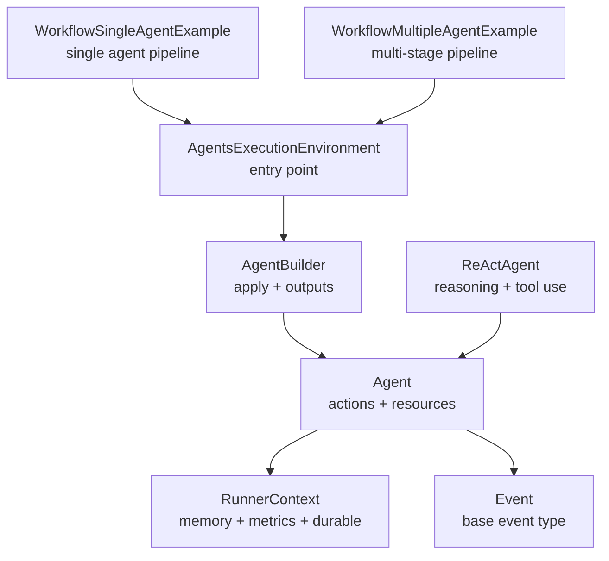

**Diagram sources**
- [AgentsExecutionEnvironment.java](file://api/src/main/java/org/apache/flink/agents/api/AgentsExecutionEnvironment.java#L43-L222)
- [AgentBuilder.java](file://api/src/main/java/org/apache/flink/agents/api/AgentBuilder.java#L35-L76)
- [Agent.java](file://api/src/main/java/org/apache/flink/agents/api/agents/Agent.java#L34-L130)
- [ReActAgent.java](file://api/src/main/java/org/apache/flink/agents/api/agents/ReActAgent.java#L51-L182)
- [RunnerContext.java](file://api/src/main/java/org/apache/flink/agents/api/context/RunnerContext.java#L33-L137)
- [Event.java](file://api/src/main/java/org/apache/flink/agents/api/Event.java#L30-L89)
- [WorkflowSingleAgentExample.java](file://examples/src/main/java/org/apache/flink/agents/examples/WorkflowSingleAgentExample.java#L52-L92)
- [WorkflowMultipleAgentExample.java](file://examples/src/main/java/org/apache/flink/agents/examples/WorkflowMultipleAgentExample.java#L126-L188)

**Section sources**
- [AgentsExecutionEnvironment.java](file://api/src/main/java/org/apache/flink/agents/api/AgentsExecutionEnvironment.java#L43-L222)
- [AgentBuilder.java](file://api/src/main/java/org/apache/flink/agents/api/AgentBuilder.java#L35-L76)
- [Agent.java](file://api/src/main/java/org/apache/flink/agents/api/agents/Agent.java#L34-L130)
- [ReActAgent.java](file://api/src/main/java/org/apache/flink/agents/api/agents/ReActAgent.java#L51-L182)
- [RunnerContext.java](file://api/src/main/java/org/apache/flink/agents/api/context/RunnerContext.java#L33-L137)
- [Event.java](file://api/src/main/java/org/apache/flink/agents/api/Event.java#L30-L89)
- [WorkflowSingleAgentExample.java](file://examples/src/main/java/org/apache/flink/agents/examples/WorkflowSingleAgentExample.java#L52-L92)
- [WorkflowMultipleAgentExample.java](file://examples/src/main/java/org/apache/flink/agents/examples/WorkflowMultipleAgentExample.java#L126-L188)

## Core Components
- AgentsExecutionEnvironment: Factory and facade for local vs remote execution, input sources (list, DataStream, Table), and resource registration. It selects the appropriate runtime environment and exposes configuration and execution hooks.
- AgentBuilder: Fluent interface to attach agents to inputs and produce outputs as lists, DataStreams, or Tables.
- Agent: Base class for defining actions (methods annotated with event listeners) and binding resources (e.g., chat models, prompts, tools).
- ReActAgent: Built-in agent that orchestrates reasoning and structured output via chat requests and emits OutputEvent.
- RunnerContext: Provides memory (sensory, short-term, long-term), metrics, resource access, and durable execution primitives for safe recovery.
- Event: Base class for all events; supports attributes and optional source timestamps.

Practical usage patterns:
- Single-agent streaming pipeline: read from a file source, apply a single agent, print results.
- Multi-agent streaming pipeline: read reviews, analyze each review, aggregate per window, then suggest improvements.

**Section sources**
- [AgentsExecutionEnvironment.java](file://api/src/main/java/org/apache/flink/agents/api/AgentsExecutionEnvironment.java#L68-L222)
- [AgentBuilder.java](file://api/src/main/java/org/apache/flink/agents/api/AgentBuilder.java#L35-L76)
- [Agent.java](file://api/src/main/java/org/apache/flink/agents/api/agents/Agent.java#L34-L130)
- [ReActAgent.java](file://api/src/main/java/org/apache/flink/agents/api/agents/ReActAgent.java#L51-L182)
- [RunnerContext.java](file://api/src/main/java/org/apache/flink/agents/api/context/RunnerContext.java#L33-L137)
- [Event.java](file://api/src/main/java/org/apache/flink/agents/api/Event.java#L30-L89)
- [WorkflowSingleAgentExample.java](file://examples/src/main/java/org/apache/flink/agents/examples/WorkflowSingleAgentExample.java#L52-L92)
- [WorkflowMultipleAgentExample.java](file://examples/src/main/java/org/apache/flink/agents/examples/WorkflowMultipleAgentExample.java#L126-L188)

## Architecture Overview
The multi-agent workflow architecture centers on event-driven actions and Flink’s streaming/table APIs. Agents declare actions that listen to specific events, perform reasoning/tool calls, and emit new events. The AgentsExecutionEnvironment integrates with Flink to run these pipelines at scale.

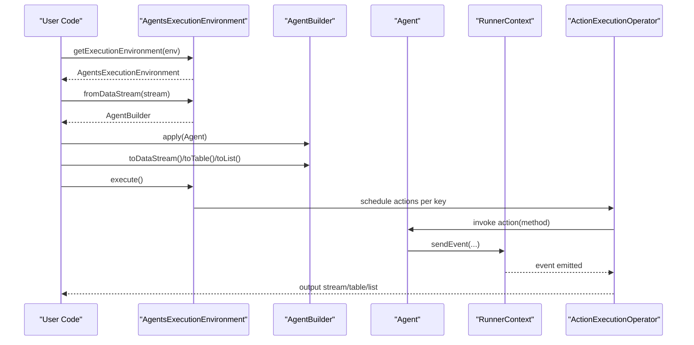

**Diagram sources**
- [AgentsExecutionEnvironment.java](file://api/src/main/java/org/apache/flink/agents/api/AgentsExecutionEnvironment.java#L68-L198)
- [AgentBuilder.java](file://api/src/main/java/org/apache/flink/agents/api/AgentBuilder.java#L35-L76)
- [Agent.java](file://api/src/main/java/org/apache/flink/agents/api/agents/Agent.java#L34-L130)
- [RunnerContext.java](file://api/src/main/java/org/apache/flink/agents/api/context/RunnerContext.java#L33-L137)
- [ActionExecutionOperatorTest.java](file://runtime/src/test/java/org/apache/flink/agents/runtime/operator/ActionExecutionOperatorTest.java#L1230-L1275)

## Detailed Component Analysis

### AgentsExecutionEnvironment
- Purpose: central entry point for multi-agent deployments. Supports local and remote environments, input sources, and resource registration.
- Key capabilities:
  - Environment selection: local vs remote via reflection-based factories
  - Inputs: fromList, fromDataStream, fromTable
  - Execution: execute delegating to underlying runtime
  - Resources: addResource for chat models, prompts, tools, and descriptors
- Configuration: getConfig for tuning execution options (e.g., async threads, retries)

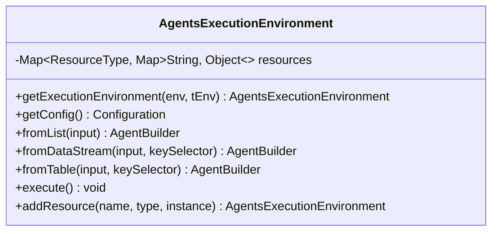

**Diagram sources**
- [AgentsExecutionEnvironment.java](file://api/src/main/java/org/apache/flink/agents/api/AgentsExecutionEnvironment.java#L43-L222)

**Section sources**
- [AgentsExecutionEnvironment.java](file://api/src/main/java/org/apache/flink/agents/api/AgentsExecutionEnvironment.java#L68-L222)

### AgentBuilder
- Purpose: fluent builder to attach agents to inputs and materialize outputs.
- Methods:
  - apply(Agent): attach an agent
  - toList(): collect outputs as list (local)
  - toDataStream(): convert outputs to Flink DataStream
  - toTable(schema): convert outputs to Flink Table

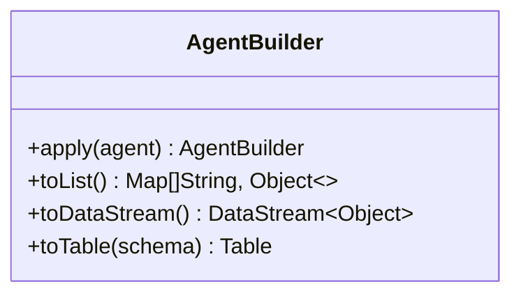

**Diagram sources**
- [AgentBuilder.java](file://api/src/main/java/org/apache/flink/agents/api/AgentBuilder.java#L35-L76)

**Section sources**
- [AgentBuilder.java](file://api/src/main/java/org/apache/flink/agents/api/AgentBuilder.java#L35-L76)

### Agent and Actions
- Purpose: define agent logic with actions that listen to specific events and execute methods.
- Features:
  - addAction with event types and method
  - addResource for sharing resources across actions
  - ErrorHandlingStrategy enum for fail/retry/ignore policies

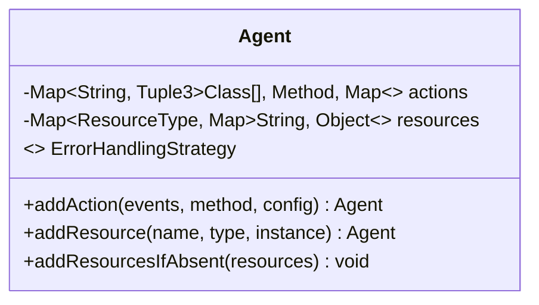

**Diagram sources**
- [Agent.java](file://api/src/main/java/org/apache/flink/agents/api/agents/Agent.java#L34-L130)

**Section sources**
- [Agent.java](file://api/src/main/java/org/apache/flink/agents/api/agents/Agent.java#L34-L130)

### ReActAgent
- Purpose: built-in agent implementing reasoning and structured output.
- Behavior:
  - startAction: builds chat messages from input and emits ChatRequestEvent with optional schema prompt
  - stopAction: parses response and emits OutputEvent

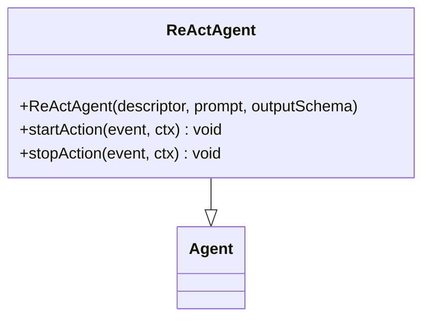

**Diagram sources**
- [ReActAgent.java](file://api/src/main/java/org/apache/flink/agents/api/agents/ReActAgent.java#L51-L182)
- [Agent.java](file://api/src/main/java/org/apache/flink/agents/api/agents/Agent.java#L34-L130)

**Section sources**
- [ReActAgent.java](file://api/src/main/java/org/apache/flink/agents/api/agents/ReActAgent.java#L51-L182)

### RunnerContext
- Purpose: provides action execution context with memory, metrics, resource access, and durable execution helpers.
- Capabilities:
  - sendEvent to emit downstream events
  - memory accessors (sensory, short-term, long-term)
  - metric groups for agent and action-level metrics
  - getResource to resolve resources by name/type
  - durableExecute/durableExecuteAsync for recoverable async work

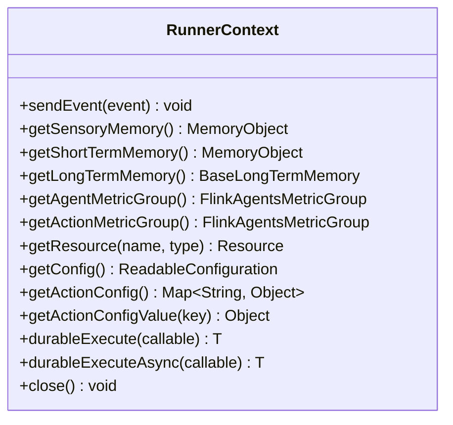

**Diagram sources**
- [RunnerContext.java](file://api/src/main/java/org/apache/flink/agents/api/context/RunnerContext.java#L33-L137)

**Section sources**
- [RunnerContext.java](file://api/src/main/java/org/apache/flink/agents/api/context/RunnerContext.java#L33-L137)

### Event Model
- Purpose: base class for all events with UUID, attributes, and optional source timestamp.
- Usage: agents emit events that trigger downstream actions; events carry state and metadata.

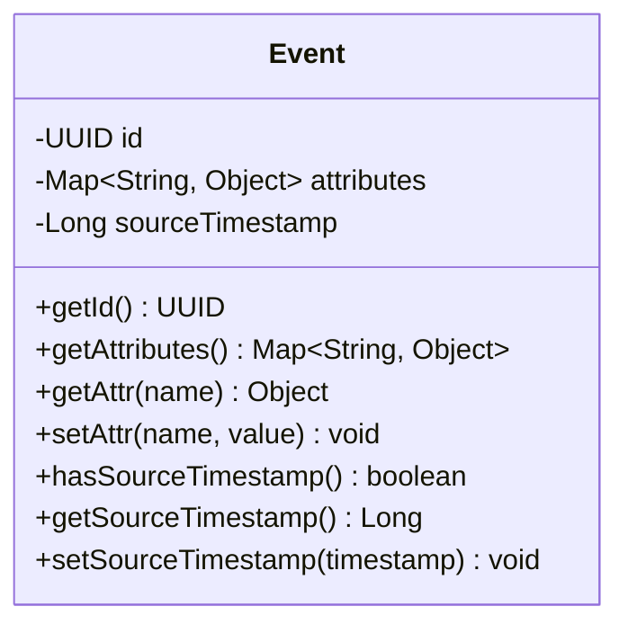

**Diagram sources**
- [Event.java](file://api/src/main/java/org/apache/flink/agents/api/Event.java#L30-L89)

**Section sources**
- [Event.java](file://api/src/main/java/org/apache/flink/agents/api/Event.java#L30-L89)

### Practical Workflow Patterns

#### Sequential Processing
- Pattern: single agent consumes input stream and emits outputs.
- Example: single-agent review analysis pipeline.

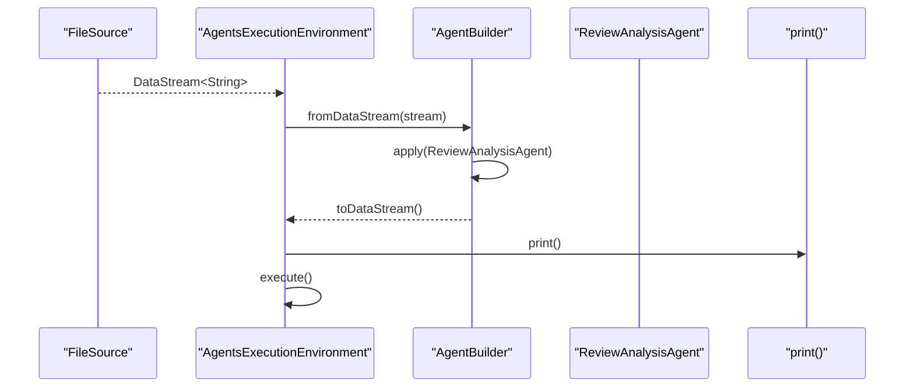

**Diagram sources**
- [WorkflowSingleAgentExample.java](file://examples/src/main/java/org/apache/flink/agents/examples/WorkflowSingleAgentExample.java#L52-L92)
- [AgentsExecutionEnvironment.java](file://api/src/main/java/org/apache/flink/agents/api/AgentsExecutionEnvironment.java#L154-L166)
- [AgentBuilder.java](file://api/src/main/java/org/apache/flink/agents/api/AgentBuilder.java#L64-L75)

**Section sources**
- [WorkflowSingleAgentExample.java](file://examples/src/main/java/org/apache/flink/agents/examples/WorkflowSingleAgentExample.java#L52-L92)

#### Parallel Execution and Conditional Routing
- Pattern: multi-stage pipeline with windowing and conditional routing based on aggregated results.
- Example: review analysis → window aggregation → improvement suggestion.

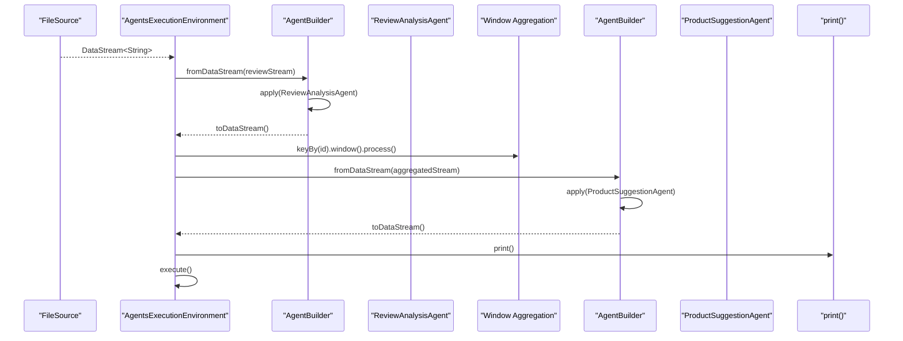

**Diagram sources**
- [WorkflowMultipleAgentExample.java](file://examples/src/main/java/org/apache/flink/agents/examples/WorkflowMultipleAgentExample.java#L126-L188)
- [AgentBuilder.java](file://api/src/main/java/org/apache/flink/agents/api/AgentBuilder.java#L64-L75)

**Section sources**
- [WorkflowMultipleAgentExample.java](file://examples/src/main/java/org/apache/flink/agents/examples/WorkflowMultipleAgentExample.java#L126-L188)

#### Async Execution and Durability
- Pattern: asynchronous durable execution to overlap workloads and survive job restarts.
- Evidence: end-to-end tests demonstrate parallel vs sequential behavior depending on JDK version and async configuration.

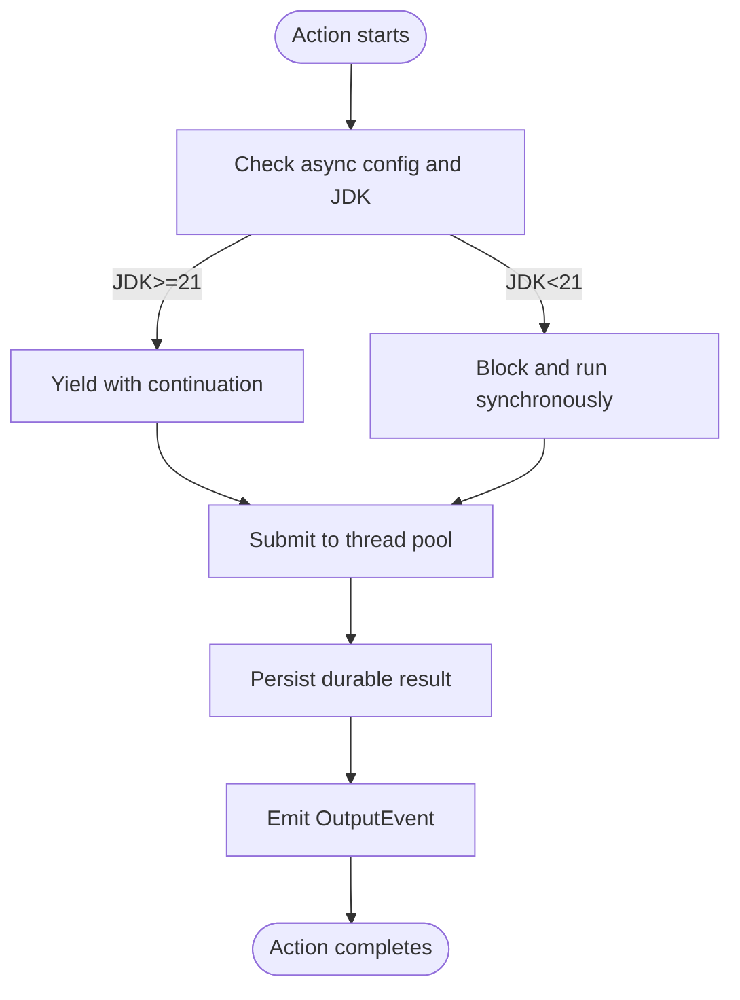

**Diagram sources**
- [RunnerContext.java](file://api/src/main/java/org/apache/flink/agents/api/context/RunnerContext.java#L113-L133)
- [AsyncExecutionTest.java](file://e2e-test/flink-agents-end-to-end-tests-integration/src/test/java/org/apache/flink/agents/integration/test/AsyncExecutionTest.java#L254-L334)
- [AsyncExecutionAgent.java](file://e2e-test/flink-agents-end-to-end-tests-integration/src/test/java/org/apache/flink/agents/integration/test/AsyncExecutionAgent.java#L239-L259)

**Section sources**
- [RunnerContext.java](file://api/src/main/java/org/apache/flink/agents/api/context/RunnerContext.java#L113-L133)
- [AsyncExecutionTest.java](file://e2e-test/flink-agents-end-to-end-tests-integration/src/test/java/org/apache/flink/agents/integration/test/AsyncExecutionTest.java#L254-L334)
- [AsyncExecutionAgent.java](file://e2e-test/flink-agents-end-to-end-tests-integration/src/test/java/org/apache/flink/agents/integration/test/AsyncExecutionAgent.java#L239-L259)

## Dependency Analysis
- Coupling:
  - AgentsExecutionEnvironment depends on runtime-specific implementations (local/remote) selected at runtime.
  - AgentBuilder depends on Agent and Flink’s DataStream/Table abstractions.
  - RunnerContext depends on memory, metrics, and resource subsystems.
- Cohesion:
  - Agent encapsulates actions and resources; ReActAgent specializes reasoning and structured output.
  - Event defines a common contract for inter-agent messaging.

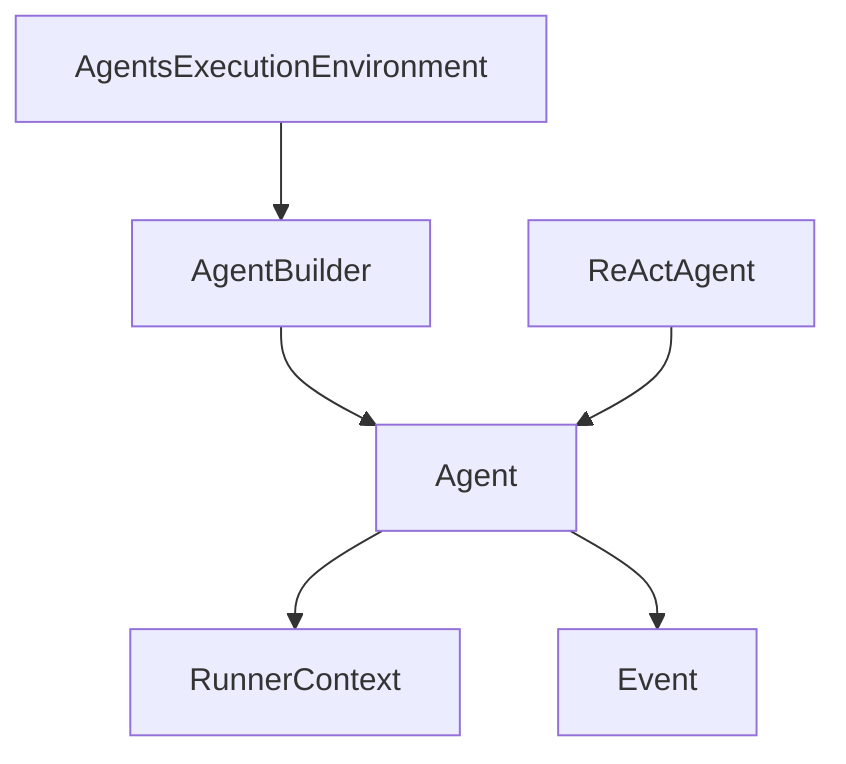

**Diagram sources**
- [AgentsExecutionEnvironment.java](file://api/src/main/java/org/apache/flink/agents/api/AgentsExecutionEnvironment.java#L43-L222)
- [AgentBuilder.java](file://api/src/main/java/org/apache/flink/agents/api/AgentBuilder.java#L35-L76)
- [Agent.java](file://api/src/main/java/org/apache/flink/agents/api/agents/Agent.java#L34-L130)
- [ReActAgent.java](file://api/src/main/java/org/apache/flink/agents/api/agents/ReActAgent.java#L51-L182)
- [RunnerContext.java](file://api/src/main/java/org/apache/flink/agents/api/context/RunnerContext.java#L33-L137)
- [Event.java](file://api/src/main/java/org/apache/flink/agents/api/Event.java#L30-L89)

**Section sources**
- [AgentsExecutionEnvironment.java](file://api/src/main/java/org/apache/flink/agents/api/AgentsExecutionEnvironment.java#L43-L222)
- [AgentBuilder.java](file://api/src/main/java/org/apache/flink/agents/api/AgentBuilder.java#L35-L76)
- [Agent.java](file://api/src/main/java/org/apache/flink/agents/api/agents/Agent.java#L34-L130)
- [ReActAgent.java](file://api/src/main/java/org/apache/flink/agents/api/agents/ReActAgent.java#L51-L182)
- [RunnerContext.java](file://api/src/main/java/org/apache/flink/agents/api/context/RunnerContext.java#L33-L137)
- [Event.java](file://api/src/main/java/org/apache/flink/agents/api/Event.java#L30-L89)

## Performance Considerations
- Concurrency and parallelism:
  - Tune AgentExecutionOptions.NUM_ASYNC_THREADS to balance throughput and resource contention.
  - Enable async for chat, tool calls, and RAG via AgentExecutionOptions.CHAT_ASYNC, TOOL_CALL_ASYNC, RAG_ASYNC.
- Throughput:
  - Use fromDataStream with keying for keyed state and windowing to aggregate efficiently.
  - Limit async concurrency to avoid overwhelming external services (e.g., chat servers).
- Memory:
  - Sensory and short-term memory are cleared per run; long-term memory persists across runs.
  - Use RunnerContext durableExecute/durableExecuteAsync to persist results and avoid recomputation.
- Metrics:
  - Monitor agent and action-level metrics for bottlenecks and latency.

[No sources needed since this section provides general guidance]

## Troubleshooting Guide
- Error handling:
  - Configure Agent.ErrorHandlingStrategy (FAIL, RETRY, IGNORE) and max retries via AgentExecutionOptions.
- Async behavior:
  - Verify JDK version and async flags; tests show parallel execution on JDK 21+ and sequential fallback otherwise.
- Resource conflicts:
  - Ensure unique resource names per ResourceType; addResource validates duplicates.
- Recovery:
  - Use durableExecute/durableExecuteAsync to ensure idempotent results during job restarts.

**Section sources**
- [Agent.java](file://api/src/main/java/org/apache/flink/agents/api/agents/Agent.java#L113-L127)
- [AgentExecutionOptions.java](file://api/src/main/java/org/apache/flink/agents/api/agents/AgentExecutionOptions.java#L24-L47)
- [RunnerContext.java](file://api/src/main/java/org/apache/flink/agents/api/context/RunnerContext.java#L113-L133)
- [AsyncExecutionTest.java](file://e2e-test/flink-agents-end-to-end-tests-integration/src/test/java/org/apache/flink/agents/integration/test/AsyncExecutionTest.java#L254-L334)

## Conclusion
Flink Agents provides a robust framework for orchestrating multi-agent workflows. By composing agents with event-driven actions, integrating with Flink’s streaming/table APIs, and leveraging durable execution and metrics, teams can build scalable, observable, and resilient AI-powered pipelines. The examples demonstrate practical patterns for sequential processing, parallel execution, and conditional routing, while configuration options and resource management enable efficient operation and reliable recovery.

[No sources needed since this section summarizes without analyzing specific files]

## Appendices

### Configuration Options
- AgentExecutionOptions:
  - error-handling-strategy: fail/retry/ignore
  - max-retries: integer
  - num-async-threads: integer
  - chat.async: boolean
  - tool-call.async: boolean
  - rag.async: boolean
- AgentConfigOptions:
  - baseLogDir: string
  - actionStateStoreBackend: string
  - kafkaBootstrapServers: string
  - kafkaActionStateTopic: string
  - kafkaActionStateTopicNumPartitions: integer
  - kafkaActionStateTopicReplicationFactor: integer
  - job-identifier: string

**Section sources**
- [AgentExecutionOptions.java](file://api/src/main/java/org/apache/flink/agents/api/agents/AgentExecutionOptions.java#L24-L47)
- [AgentConfigOptions.java](file://api/src/main/java/org/apache/flink/agents/api/configuration/AgentConfigOptions.java#L24-L49)

### Monitoring Metrics
- Agent-level:
  - numOfEventProcessed
  - numOfEventProcessedPerSec
  - numOfActionsExecuted
  - numOfActionsExecutedPerSec
- Action-level:
  - <action_name>.numOfActionsExecuted
  - <action_name>.numOfActionsExecutedPerSec

**Section sources**
- [FlinkAgentsMetricGroupImpl.java](file://runtime/src/main/java/org/apache/flink/agents/runtime/metrics/FlinkAgentsMetricGroupImpl.java#L69-L104)