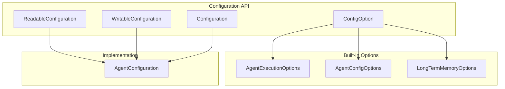
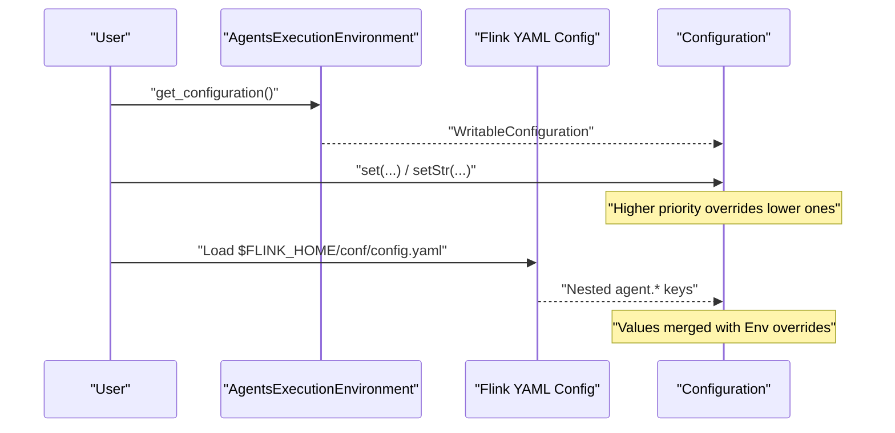
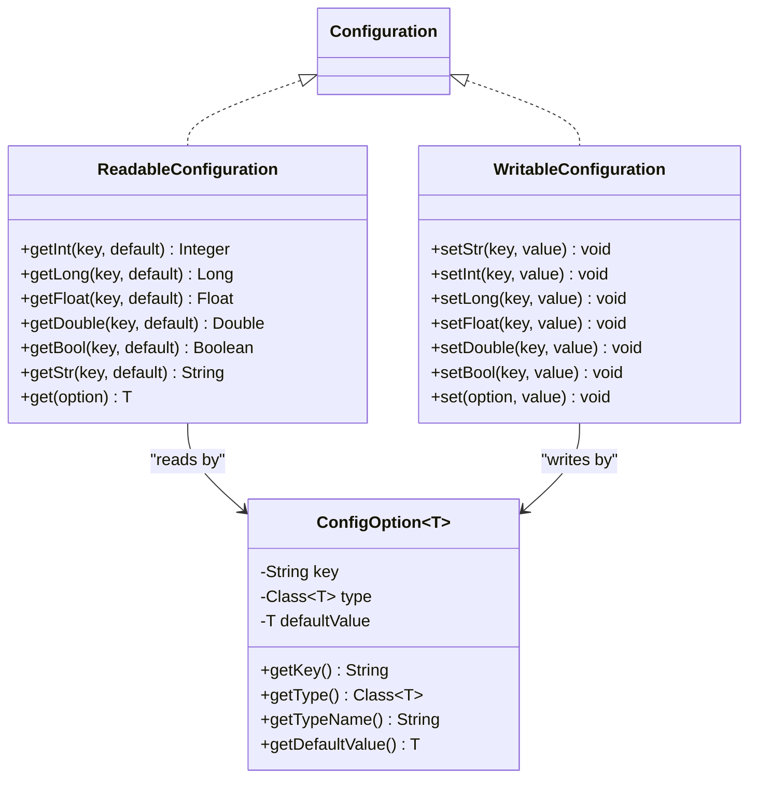
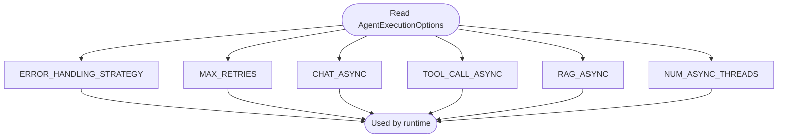
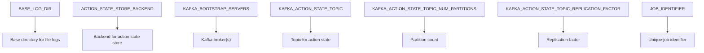
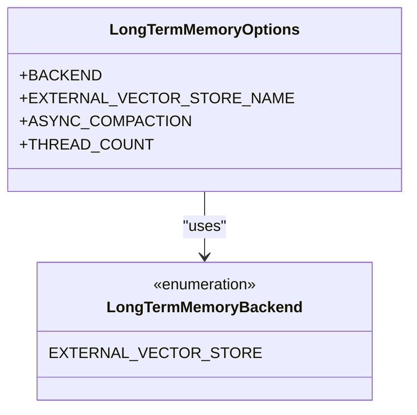
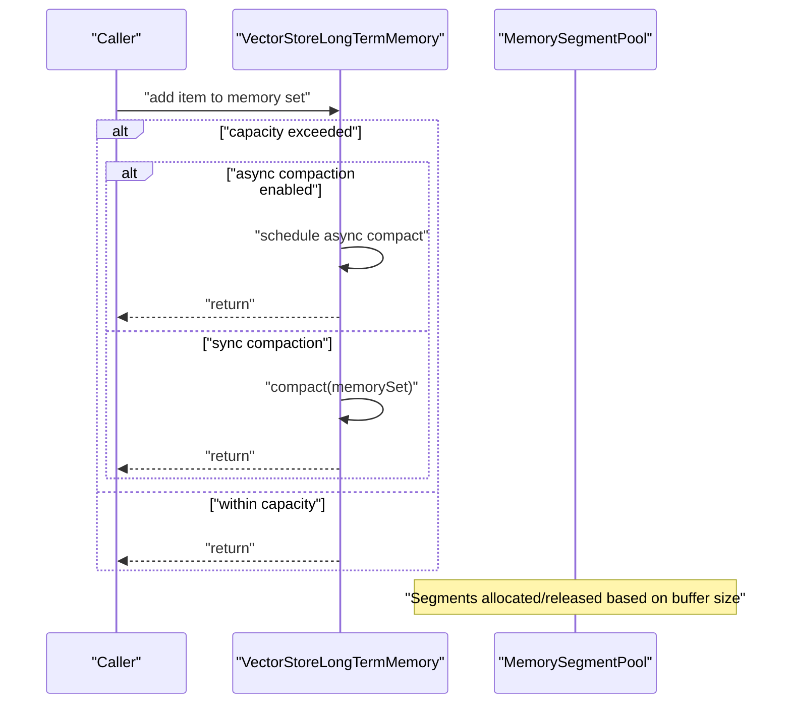
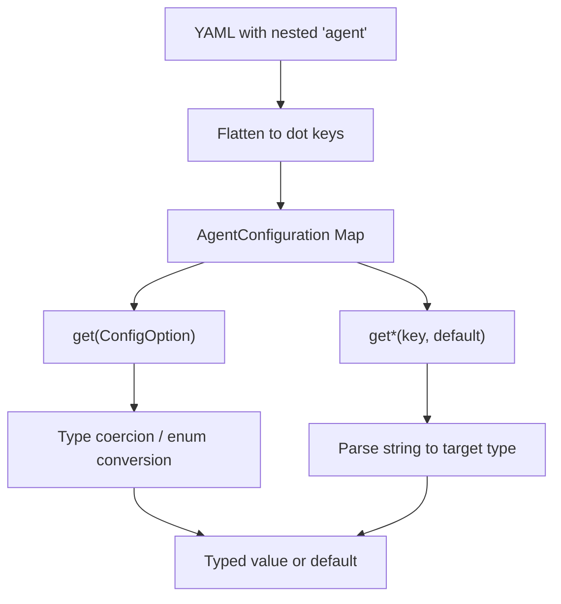
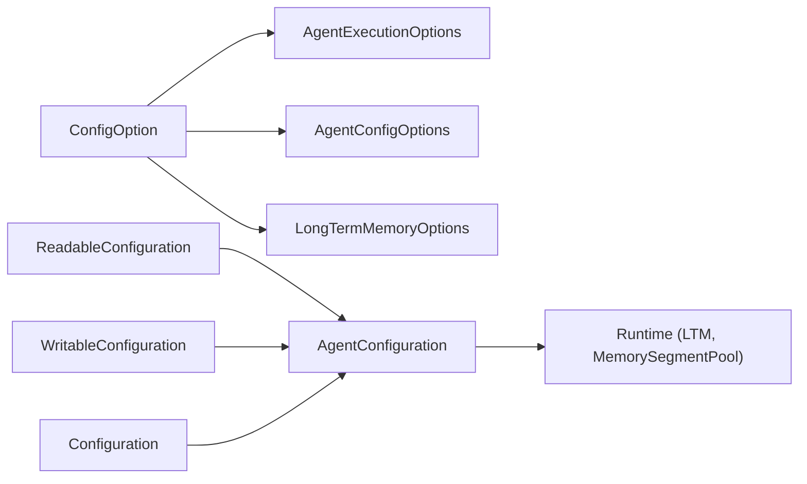

# Configuration Options

<cite>
**Referenced Files in This Document**
- [AgentConfigOptions.java](file://api/src/main/java/org/apache/flink/agents/api/configuration/AgentConfigOptions.java)
- [ConfigOption.java](file://api/src/main/java/org/apache/flink/agents/api/configuration/ConfigOption.java)
- [ReadableConfiguration.java](file://api/src/main/java/org/apache/flink/agents/api/configuration/ReadableConfiguration.java)
- [WritableConfiguration.java](file://api/src/main/java/org/apache/flink/agents/api/configuration/WritableConfiguration.java)
- [Configuration.java](file://api/src/main/java/org/apache/flink/agents/api/configuration/Configuration.java)
- [LongTermMemoryOptions.java](file://api/src/main/java/org/apache/flink/agents/api/memory/LongTermMemoryOptions.java)
- [AgentExecutionOptions.java](file://api/src/main/java/org/apache/flink/agents/api/agents/AgentExecutionOptions.java)
- [AgentConfiguration.java](file://plan/src/main/java/org/apache/flink/agents/plan/AgentConfiguration.java)
- [configuration.md](file://docs/content/docs/operations/configuration.md)
- [config_file.html](file://docs/layouts/shortcodes/config_file.html)
- [VectorStoreLongTermMemory.java](file://runtime/src/main/java/org/apache/flink/agents/runtime/memory/VectorStoreLongTermMemory.java)
- [MemorySegmentPool.java](file://runtime/src/main/java/org/apache/flink/agents/runtime/memory/MemorySegmentPool.java)
- [BaseLongTermMemory.java](file://api/src/main/java/org/apache/flink/agents/api/memory/BaseLongTermMemory.java)
- [AgentConfigurationTest.java](file://plan/src/test/java/org/apache/flink/agents/plan/AgentConfigurationTest.java)
- [test_configuration.py](file://python/flink_agents/plan/tests/test_configuration.py)
</cite>

## Table of Contents
1. [Introduction](#introduction)
2. [Project Structure](#project-structure)
3. [Core Components](#core-components)
4. [Architecture Overview](#architecture-overview)
5. [Detailed Component Analysis](#detailed-component-analysis)
6. [Dependency Analysis](#dependency-analysis)
7. [Performance Considerations](#performance-considerations)
8. [Troubleshooting Guide](#troubleshooting-guide)
9. [Conclusion](#conclusion)
10. [Appendices](#appendices)

## Introduction
This document provides comprehensive guidance on configuring Flink Agents. It covers:
- Agent execution parameters and resource allocation controls
- Memory management settings and long-term memory (LTM) configuration
- ConfigOption usage patterns and configuration inheritance hierarchy
- Practical configuration examples, environment-specific settings, and performance tuning
- Validation, error handling, and troubleshooting common configuration issues
- Configuration file formats, environment variable overrides, and dynamic configuration updates

## Project Structure
The configuration system is centered around a small set of core APIs and options:
- ConfigOption defines typed configuration keys with defaults
- ReadableConfiguration and WritableConfiguration define read/write access
- Configuration combines both interfaces
- AgentExecutionOptions and AgentConfigOptions enumerate built-in options
- LongTermMemoryOptions enumerates LTM-related options
- AgentConfiguration implements the Configuration interface and supports nested YAML flattening

**Diagram sources**
- [ConfigOption.java](file://api/src/main/java/org/apache/flink/agents/api/configuration/ConfigOption.java#L23-L101)
- [ReadableConfiguration.java](file://api/src/main/java/org/apache/flink/agents/api/configuration/ReadableConfiguration.java#L21-L84)
- [WritableConfiguration.java](file://api/src/main/java/org/apache/flink/agents/api/configuration/WritableConfiguration.java#L21-L77)
- [Configuration.java](file://api/src/main/java/org/apache/flink/agents/api/configuration/Configuration.java#L20-L24)
- [AgentExecutionOptions.java](file://api/src/main/java/org/apache/flink/agents/api/agents/AgentExecutionOptions.java#L23-L47)
- [AgentConfigOptions.java](file://api/src/main/java/org/apache/flink/agents/api/configuration/AgentConfigOptions.java#L21-L50)
- [LongTermMemoryOptions.java](file://api/src/main/java/org/apache/flink/agents/api/memory/LongTermMemoryOptions.java#L22-L52)
- [AgentConfiguration.java](file://plan/src/main/java/org/apache/flink/agents/plan/AgentConfiguration.java#L29-L179)

**Section sources**
- [AgentExecutionOptions.java](file://api/src/main/java/org/apache/flink/agents/api/agents/AgentExecutionOptions.java#L23-L47)
- [AgentConfigOptions.java](file://api/src/main/java/org/apache/flink/agents/api/configuration/AgentConfigOptions.java#L21-L50)
- [LongTermMemoryOptions.java](file://api/src/main/java/org/apache/flink/agents/api/memory/LongTermMemoryOptions.java#L22-L52)
- [ConfigOption.java](file://api/src/main/java/org/apache/flink/agents/api/configuration/ConfigOption.java#L23-L101)
- [ReadableConfiguration.java](file://api/src/main/java/org/apache/flink/agents/api/configuration/ReadableConfiguration.java#L21-L84)
- [WritableConfiguration.java](file://api/src/main/java/org/apache/flink/agents/api/configuration/WritableConfiguration.java#L21-L77)
- [Configuration.java](file://api/src/main/java/org/apache/flink/agents/api/configuration/Configuration.java#L20-L24)
- [AgentConfiguration.java](file://plan/src/main/java/org/apache/flink/agents/plan/AgentConfiguration.java#L29-L179)

## Core Components
- ConfigOption<T>
  - Encapsulates key, type, and default value
  - Used to declare strongly typed configuration options
- ReadableConfiguration
  - Provides typed getters by key and by ConfigOption
  - Supports primitive types, strings, and enums
- WritableConfiguration
  - Provides setters by key and by ConfigOption
- Configuration
  - Combines readable and writable capabilities
- AgentExecutionOptions
  - Execution parameters: error handling strategy, max retries, async toggles, thread pool size
- AgentConfigOptions
  - Agent-level parameters: base log directory, action state store backend, Kafka connection and topic settings
- LongTermMemoryOptions
  - LTM backend selection, external vector store name, compaction behavior, and async compaction thread count

**Section sources**
- [ConfigOption.java](file://api/src/main/java/org/apache/flink/agents/api/configuration/ConfigOption.java#L23-L101)
- [ReadableConfiguration.java](file://api/src/main/java/org/apache/flink/agents/api/configuration/ReadableConfiguration.java#L21-L84)
- [WritableConfiguration.java](file://api/src/main/java/org/apache/flink/agents/api/configuration/WritableConfiguration.java#L21-L77)
- [Configuration.java](file://api/src/main/java/org/apache/flink/agents/api/configuration/Configuration.java#L20-L24)
- [AgentExecutionOptions.java](file://api/src/main/java/org/apache/flink/agents/api/agents/AgentExecutionOptions.java#L23-L47)
- [AgentConfigOptions.java](file://api/src/main/java/org/apache/flink/agents/api/configuration/AgentConfigOptions.java#L21-L50)
- [LongTermMemoryOptions.java](file://api/src/main/java/org/apache/flink/agents/api/memory/LongTermMemoryOptions.java#L22-L52)

## Architecture Overview
Configuration resolution follows a priority order:
1. Environment-provided configuration (AgentsExecutionEnvironment)
2. YAML configuration file (Flink configuration file)

**Diagram sources**
- [configuration.md](file://docs/content/docs/operations/configuration.md#L27-L36)
- [configuration.md](file://docs/content/docs/operations/configuration.md#L38-L80)
- [configuration.md](file://docs/content/docs/operations/configuration.md#L82-L121)

**Section sources**
- [configuration.md](file://docs/content/docs/operations/configuration.md#L27-L36)
- [configuration.md](file://docs/content/docs/operations/configuration.md#L38-L80)
- [configuration.md](file://docs/content/docs/operations/configuration.md#L82-L121)

## Detailed Component Analysis

### ConfigOption Usage Patterns
- Define strongly typed options with defaults
- Retrieve values via ReadableConfiguration.get(ConfigOption<T>)
- Set values via WritableConfiguration.set(ConfigOption<T>, T)
- Null default handling: if a value is explicitly set to null, the option’s default is used

**Diagram sources**
- [ConfigOption.java](file://api/src/main/java/org/apache/flink/agents/api/configuration/ConfigOption.java#L23-L101)
- [ReadableConfiguration.java](file://api/src/main/java/org/apache/flink/agents/api/configuration/ReadableConfiguration.java#L21-L84)
- [WritableConfiguration.java](file://api/src/main/java/org/apache/flink/agents/api/configuration/WritableConfiguration.java#L21-L77)
- [Configuration.java](file://api/src/main/java/org/apache/flink/agents/api/configuration/Configuration.java#L20-L24)

**Section sources**
- [ConfigOption.java](file://api/src/main/java/org/apache/flink/agents/api/configuration/ConfigOption.java#L23-L101)
- [ReadableConfiguration.java](file://api/src/main/java/org/apache/flink/agents/api/configuration/ReadableConfiguration.java#L21-L84)
- [WritableConfiguration.java](file://api/src/main/java/org/apache/flink/agents/api/configuration/WritableConfiguration.java#L21-L77)
- [Configuration.java](file://api/src/main/java/org/apache/flink/agents/api/configuration/Configuration.java#L20-L24)

### Agent Execution Parameters and Resource Allocation
- Error handling strategy and max retries
- Async toggles for chat, tool call, and RAG
- Thread pool sizing for async operations

**Diagram sources**
- [AgentExecutionOptions.java](file://api/src/main/java/org/apache/flink/agents/api/agents/AgentExecutionOptions.java#L23-L47)

**Section sources**
- [AgentExecutionOptions.java](file://api/src/main/java/org/apache/flink/agents/api/agents/AgentExecutionOptions.java#L23-L47)
- [configuration.md](file://docs/content/docs/operations/configuration.md#L124-L136)

### Agent-Level Configuration Parameters
- Base log directory
- Action state store backend
- Kafka bootstrap servers and topic settings with partition and replication factors
- Job identifier

**Diagram sources**
- [AgentConfigOptions.java](file://api/src/main/java/org/apache/flink/agents/api/configuration/AgentConfigOptions.java#L21-L50)

**Section sources**
- [AgentConfigOptions.java](file://api/src/main/java/org/apache/flink/agents/api/configuration/AgentConfigOptions.java#L21-L50)
- [configuration.md](file://docs/content/docs/operations/configuration.md#L140-L151)

### Long-Term Memory (LTM) Configuration
- Backend selection and external vector store name
- Async compaction toggle and thread count for async compaction

**Diagram sources**
- [LongTermMemoryOptions.java](file://api/src/main/java/org/apache/flink/agents/api/memory/LongTermMemoryOptions.java#L22-L52)

**Section sources**
- [LongTermMemoryOptions.java](file://api/src/main/java/org/apache/flink/agents/api/memory/LongTermMemoryOptions.java#L22-L52)

### Memory Management and Compaction
- Memory sets and compaction configuration
- Async compaction scheduling and worker executor
- Memory segment pooling and buffer size limits

**Diagram sources**
- [VectorStoreLongTermMemory.java](file://runtime/src/main/java/org/apache/flink/agents/runtime/memory/VectorStoreLongTermMemory.java#L188-L218)
- [MemorySegmentPool.java](file://runtime/src/main/java/org/apache/flink/agents/runtime/memory/MemorySegmentPool.java#L39-L78)
- [BaseLongTermMemory.java](file://api/src/main/java/org/apache/flink/agents/api/memory/BaseLongTermMemory.java#L35-L65)

**Section sources**
- [VectorStoreLongTermMemory.java](file://runtime/src/main/java/org/apache/flink/agents/runtime/memory/VectorStoreLongTermMemory.java#L188-L218)
- [MemorySegmentPool.java](file://runtime/src/main/java/org/apache/flink/agents/runtime/memory/MemorySegmentPool.java#L39-L78)
- [BaseLongTermMemory.java](file://api/src/main/java/org/apache/flink/agents/api/memory/BaseLongTermMemory.java#L35-L65)

### Configuration Implementation and Validation
- AgentConfiguration supports nested YAML flattening and type-safe getters/setters
- Tests demonstrate:
  - Loading nested YAML and flattening to dot-separated keys
  - Using ConfigOption for typed reads with defaults
  - Handling null values and default fallbacks

**Diagram sources**
- [AgentConfiguration.java](file://plan/src/main/java/org/apache/flink/agents/plan/AgentConfiguration.java#L162-L178)
- [AgentConfiguration.java](file://plan/src/main/java/org/apache/flink/agents/plan/AgentConfiguration.java#L128-L159)
- [AgentConfiguration.java](file://plan/src/main/java/org/apache/flink/agents/plan/AgentConfiguration.java#L83-L125)

**Section sources**
- [AgentConfiguration.java](file://plan/src/main/java/org/apache/flink/agents/plan/AgentConfiguration.java#L29-L179)
- [AgentConfigurationTest.java](file://plan/src/test/java/org/apache/flink/agents/plan/AgentConfigurationTest.java#L141-L218)
- [test_configuration.py](file://python/flink_agents/plan/tests/test_configuration.py#L28-L228)

## Dependency Analysis
- ConfigOption is consumed by:
  - AgentExecutionOptions
  - AgentConfigOptions
  - LongTermMemoryOptions
- ReadableConfiguration and WritableConfiguration are implemented by AgentConfiguration
- AgentConfiguration is used by plan components and runtime components

**Diagram sources**
- [AgentExecutionOptions.java](file://api/src/main/java/org/apache/flink/agents/api/agents/AgentExecutionOptions.java#L23-L47)
- [AgentConfigOptions.java](file://api/src/main/java/org/apache/flink/agents/api/configuration/AgentConfigOptions.java#L21-L50)
- [LongTermMemoryOptions.java](file://api/src/main/java/org/apache/flink/agents/api/memory/LongTermMemoryOptions.java#L22-L52)
- [ReadableConfiguration.java](file://api/src/main/java/org/apache/flink/agents/api/configuration/ReadableConfiguration.java#L21-L84)
- [WritableConfiguration.java](file://api/src/main/java/org/apache/flink/agents/api/configuration/WritableConfiguration.java#L21-L77)
- [Configuration.java](file://api/src/main/java/org/apache/flink/agents/api/configuration/Configuration.java#L20-L24)
- [AgentConfiguration.java](file://plan/src/main/java/org/apache/flink/agents/plan/AgentConfiguration.java#L29-L179)

**Section sources**
- [AgentExecutionOptions.java](file://api/src/main/java/org/apache/flink/agents/api/agents/AgentExecutionOptions.java#L23-L47)
- [AgentConfigOptions.java](file://api/src/main/java/org/apache/flink/agents/api/configuration/AgentConfigOptions.java#L21-L50)
- [LongTermMemoryOptions.java](file://api/src/main/java/org/apache/flink/agents/api/memory/LongTermMemoryOptions.java#L22-L52)
- [ReadableConfiguration.java](file://api/src/main/java/org/apache/flink/agents/api/configuration/ReadableConfiguration.java#L21-L84)
- [WritableConfiguration.java](file://api/src/main/java/org/apache/flink/agents/api/configuration/WritableConfiguration.java#L21-L77)
- [Configuration.java](file://api/src/main/java/org/apache/flink/agents/api/configuration/Configuration.java#L20-L24)
- [AgentConfiguration.java](file://plan/src/main/java/org/apache/flink/agents/plan/AgentConfiguration.java#L29-L179)

## Performance Considerations
- Async toggles
  - Enable async for chat, tool-call, and RAG to improve throughput
  - Tune thread pool size via NUM_ASYNC_THREADS for workload characteristics
- Kafka topic sizing
  - Increase partitions for higher throughput action state topics
  - Adjust replication factor for durability vs. latency trade-offs
- LTM compaction
  - Prefer async compaction for continuous ingestion under capacity pressure
  - Tune thread count for async compaction to match CPU and I/O capacity
- Memory segment pool
  - Monitor total allocated memory and adjust buffer sizes to prevent excessive allocations

[No sources needed since this section provides general guidance]

## Troubleshooting Guide
- YAML loading pitfalls
  - Ensure the YAML is nested under the agent key and uses dot notation after flattening
  - For MiniCluster, set FLINK_CONF_DIR to point to the config file
  - For local runs without Flink, explicitly pass the YAML path to the configuration API
- Type coercion and defaults
  - If a ConfigOption has a default and a null value is set, the default is used
  - When reading unknown keys, defaults are returned; verify keys and casing
- Async compaction failures
  - Exceptions in async compaction are surfaced; inspect runtime logs for stack traces
  - Verify backend connectivity and credentials for external vector stores

**Section sources**
- [configuration.md](file://docs/content/docs/operations/configuration.md#L82-L121)
- [AgentConfiguration.java](file://plan/src/main/java/org/apache/flink/agents/plan/AgentConfiguration.java#L75-L80)
- [VectorStoreLongTermMemory.java](file://runtime/src/main/java/org/apache/flink/agents/runtime/memory/VectorStoreLongTermMemory.java#L194-L210)

## Conclusion
Flink Agents configuration centers on typed ConfigOption keys, a unified Configuration interface, and layered resolution from environment to YAML. Execution parameters, Kafka-backed action state, and LTM compaction are configurable through dedicated option sets. Proper YAML formatting, environment variable setup, and async tuning enable robust and performant deployments.

[No sources needed since this section summarizes without analyzing specific files]

## Appendices

### Configuration File Formats and Examples
- YAML format must nest agent-specific settings under the agent key
- Nested maps are flattened to dot-separated keys internally
- Example keys and types are defined in the built-in options

**Section sources**
- [configuration.md](file://docs/content/docs/operations/configuration.md#L86-L96)
- [config_file.html](file://docs/layouts/shortcodes/config_file.html#L20-L52)
- [AgentConfiguration.java](file://plan/src/main/java/org/apache/flink/agents/plan/AgentConfiguration.java#L162-L178)

### Environment Variable Overrides
- MiniCluster requires FLINK_CONF_DIR to locate the YAML configuration file
- Local mode allows passing a YAML path directly to the configuration API

**Section sources**
- [configuration.md](file://docs/content/docs/operations/configuration.md#L106-L119)

### Dynamic Configuration Updates
- Use AgentsExecutionEnvironment to set configuration programmatically
- For YAML-managed settings, reload the configuration file as appropriate for your deployment

**Section sources**
- [configuration.md](file://docs/content/docs/operations/configuration.md#L27-L36)
- [configuration.md](file://docs/content/docs/operations/configuration.md#L38-L80)