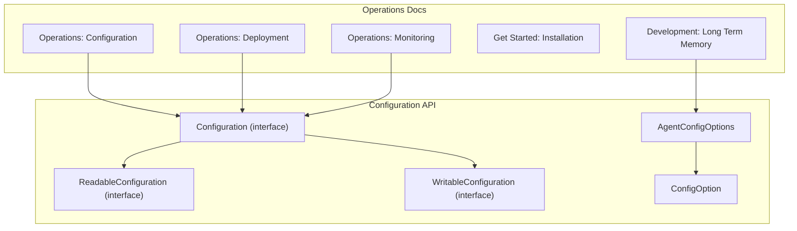
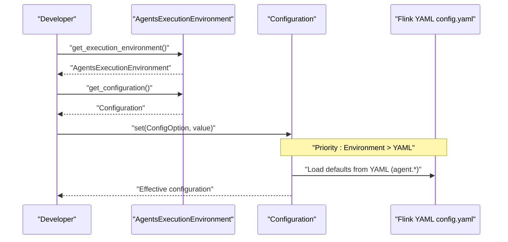
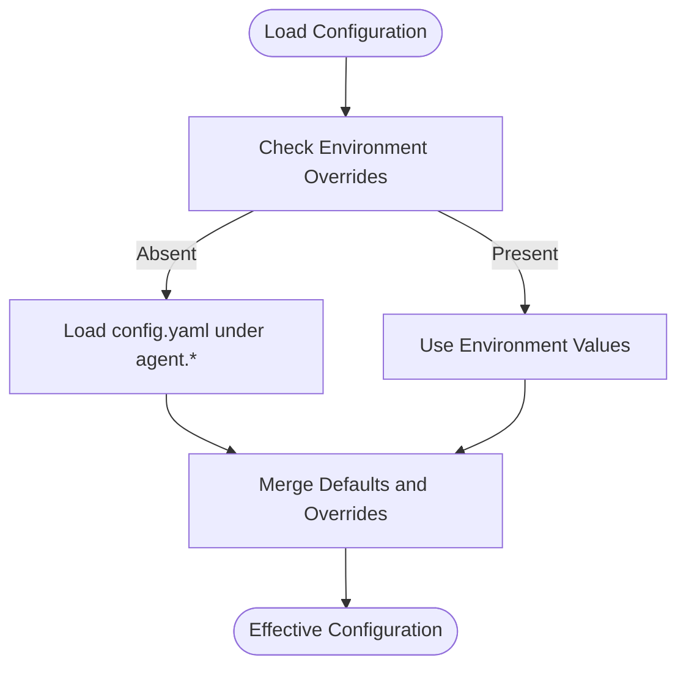
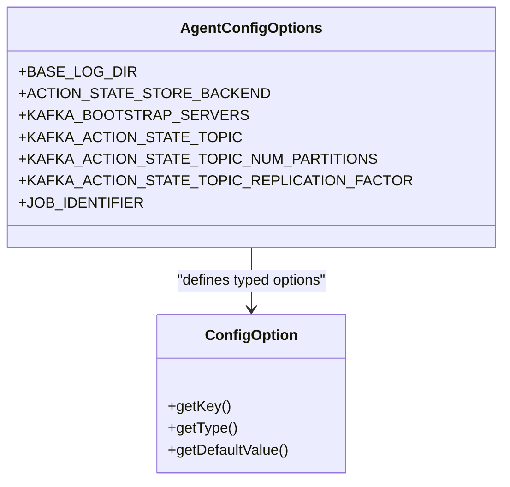
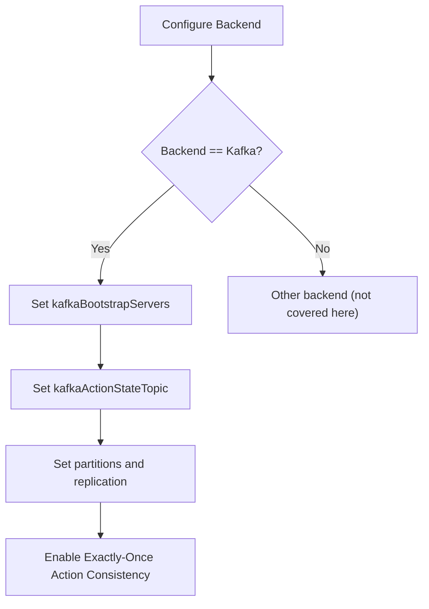
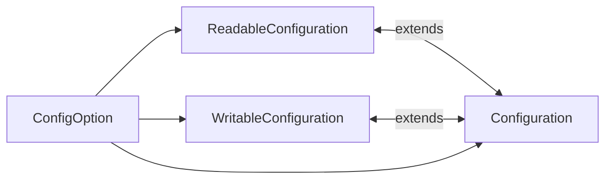

# Configuration and Deployment

<cite>
**Referenced Files in This Document**
- [AgentConfigOptions.java](file://api/src/main/java/org/apache/flink/agents/api/configuration/AgentConfigOptions.java)
- [ConfigOption.java](file://api/src/main/java/org/apache/flink/agents/api/configuration/ConfigOption.java)
- [ReadableConfiguration.java](file://api/src/main/java/org/apache/flink/agents/api/configuration/ReadableConfiguration.java)
- [WritableConfiguration.java](file://api/src/main/java/org/apache/flink/agents/api/configuration/WritableConfiguration.java)
- [Configuration.java](file://api/src/main/java/org/apache/flink/agents/api/configuration/Configuration.java)
- [configuration.md](file://docs/content/docs/operations/configuration.md)
- [deployment.md](file://docs/content/docs/operations/deployment.md)
- [installation.md](file://docs/content/docs/get-started/installation.md)
- [monitoring.md](file://docs/content/docs/operations/monitoring.md)
- [long_term_memory.md](file://docs/content/docs/development/memory/long_term_memory.md)
</cite>

## Table of Contents
1. [Introduction](#introduction)
2. [Project Structure](#project-structure)
3. [Core Components](#core-components)
4. [Architecture Overview](#architecture-overview)
5. [Detailed Component Analysis](#detailed-component-analysis)
6. [Dependency Analysis](#dependency-analysis)
7. [Performance Considerations](#performance-considerations)
8. [Troubleshooting Guide](#troubleshooting-guide)
9. [Conclusion](#conclusion)
10. [Appendices](#appendices)

## Introduction
This document provides comprehensive guidance for configuring and deploying Flink Agents across development, testing, and production environments. It covers configuration options, memory and resource management, deployment strategies, security and access control, performance tuning, scaling, backup and recovery, monitoring, troubleshooting, and zero-downtime updates. The content is grounded in the repository’s configuration APIs and official documentation.

## Project Structure
Flink Agents exposes a configuration framework and operational documentation that informs both local and cluster deployments. The configuration system centers around typed configuration options and a unified configuration interface. Operational guidance is provided in dedicated documentation pages for configuration, deployment, and monitoring.

**Diagram sources**
- [Configuration.java](file://api/src/main/java/org/apache/flink/agents/api/configuration/Configuration.java#L20-L25)
- [ReadableConfiguration.java](file://api/src/main/java/org/apache/flink/agents/api/configuration/ReadableConfiguration.java#L20-L85)
- [WritableConfiguration.java](file://api/src/main/java/org/apache/flink/agents/api/configuration/WritableConfiguration.java#L20-L78)
- [ConfigOption.java](file://api/src/main/java/org/apache/flink/agents/api/configuration/ConfigOption.java#L22-L103)
- [AgentConfigOptions.java](file://api/src/main/java/org/apache/flink/agents/api/configuration/AgentConfigOptions.java#L20-L51)
- [configuration.md](file://docs/content/docs/operations/configuration.md#L25-L151)
- [deployment.md](file://docs/content/docs/operations/deployment.md#L25-L179)
- [monitoring.md](file://docs/content/docs/operations/monitoring.md#L25-L162)
- [installation.md](file://docs/content/docs/get-started/installation.md#L25-L316)
- [long_term_memory.md](file://docs/content/docs/development/memory/long_term_memory.md#L296-L308)

**Section sources**
- [configuration.md](file://docs/content/docs/operations/configuration.md#L25-L151)
- [deployment.md](file://docs/content/docs/operations/deployment.md#L25-L179)
- [monitoring.md](file://docs/content/docs/operations/monitoring.md#L25-L162)
- [installation.md](file://docs/content/docs/get-started/installation.md#L25-L316)
- [long_term_memory.md](file://docs/content/docs/development/memory/long_term_memory.md#L296-L308)

## Core Components
- Typed configuration options: Centralized configuration keys and defaults are defined as strongly-typed options, enabling type-safe reads and writes.
- Configuration interfaces: A unified configuration interface combines readable and writable capabilities, supporting both string-based and option-based access.
- Built-in options: Includes core agent options (error handling, async behavior, thread pool sizing, job identifier) and action state store options (Kafka-backed).

Key configuration areas:
- Core agent options: error handling strategy, max retries, async toggles for chat/tool/RAG, async thread pool size, and job identifier.
- Action state store: backend selection and Kafka connection/topic/partition/replication settings.
- Event logging: base log directory for file-based event logs.

**Section sources**
- [AgentConfigOptions.java](file://api/src/main/java/org/apache/flink/agents/api/configuration/AgentConfigOptions.java#L20-L51)
- [ConfigOption.java](file://api/src/main/java/org/apache/flink/agents/api/configuration/ConfigOption.java#L22-L103)
- [ReadableConfiguration.java](file://api/src/main/java/org/apache/flink/agents/api/configuration/ReadableConfiguration.java#L20-L85)
- [WritableConfiguration.java](file://api/src/main/java/org/apache/flink/agents/api/configuration/WritableConfiguration.java#L20-L78)
- [Configuration.java](file://api/src/main/java/org/apache/flink/agents/api/configuration/Configuration.java#L20-L25)
- [configuration.md](file://docs/content/docs/operations/configuration.md#L122-L151)

## Architecture Overview
The configuration architecture separates concerns between:
- Option definition: Strongly typed keys with defaults.
- Configuration access: Unified interface for reading/writing.
- Priority-driven loading: Environment overrides YAML configuration, with explicit environment settings taking precedence.

**Diagram sources**
- [configuration.md](file://docs/content/docs/operations/configuration.md#L27-L80)
- [Configuration.java](file://api/src/main/java/org/apache/flink/agents/api/configuration/Configuration.java#L20-L25)

**Section sources**
- [configuration.md](file://docs/content/docs/operations/configuration.md#L27-L80)

## Detailed Component Analysis

### Configuration Options and Priority
- Priority order: Environment (AgentsExecutionEnvironment) > YAML configuration file.
- YAML nesting: Agent-specific settings are under the agent key.
- Special conditions: MiniCluster requires explicit FLINK_CONF_DIR; local mode can load YAML via API.

**Diagram sources**
- [configuration.md](file://docs/content/docs/operations/configuration.md#L27-L80)

**Section sources**
- [configuration.md](file://docs/content/docs/operations/configuration.md#L27-L121)

### Core Agent Options
- Error handling strategy and max retries: Control resilience for model requests.
- Async toggles: chat.async, tool-call.async, rag.async.
- num-async-threads: Thread pool size for async executor.
- job-identifier: Unique job identifier preserved across restore.

**Diagram sources**
- [AgentConfigOptions.java](file://api/src/main/java/org/apache/flink/agents/api/configuration/AgentConfigOptions.java#L20-L51)
- [ConfigOption.java](file://api/src/main/java/org/apache/flink/agents/api/configuration/ConfigOption.java#L22-L103)

**Section sources**
- [configuration.md](file://docs/content/docs/operations/configuration.md#L124-L136)

### Action State Store (Kafka)
- Backend selection and Kafka connectivity: bootstrap servers, topic, partition count, replication factor.
- Exactly-once action consistency: Requires external action state store; Kafka is supported.

**Diagram sources**
- [configuration.md](file://docs/content/docs/operations/configuration.md#L138-L151)
- [deployment.md](file://docs/content/docs/operations/deployment.md#L155-L174)

**Section sources**
- [configuration.md](file://docs/content/docs/operations/configuration.md#L138-L151)
- [deployment.md](file://docs/content/docs/operations/deployment.md#L155-L174)

### Event Logging (File-based)
- Base log directory: agent.baseLogDir; defaults to a temp directory subpath.
- File naming: events-{jobId}-{taskName}-{subtaskId}.log in flat directory.

**Section sources**
- [monitoring.md](file://docs/content/docs/operations/monitoring.md#L142-L162)

### Long-Term Memory Configuration
- Job identifier: Ensures continuity after restore.
- Backend and vector store: Backend selection and external vector store name.
- Compaction: Async compaction toggle.

**Section sources**
- [long_term_memory.md](file://docs/content/docs/development/memory/long_term_memory.md#L296-L308)

## Dependency Analysis
- Configuration API cohesion: Configuration interface aggregates readable and writable capabilities; ConfigOption encapsulates key, type, and default.
- Operational coupling: Deployment and monitoring depend on configuration availability and correctness; YAML loading behavior affects MiniCluster and local modes.

**Diagram sources**
- [Configuration.java](file://api/src/main/java/org/apache/flink/agents/api/configuration/Configuration.java#L20-L25)
- [ReadableConfiguration.java](file://api/src/main/java/org/apache/flink/agents/api/configuration/ReadableConfiguration.java#L20-L85)
- [WritableConfiguration.java](file://api/src/main/java/org/apache/flink/agents/api/configuration/WritableConfiguration.java#L20-L78)
- [ConfigOption.java](file://api/src/main/java/org/apache/flink/agents/api/configuration/ConfigOption.java#L22-L103)

**Section sources**
- [Configuration.java](file://api/src/main/java/org/apache/flink/agents/api/configuration/Configuration.java#L20-L25)
- [ReadableConfiguration.java](file://api/src/main/java/org/apache/flink/agents/api/configuration/ReadableConfiguration.java#L20-L85)
- [WritableConfiguration.java](file://api/src/main/java/org/apache/flink/agents/api/configuration/WritableConfiguration.java#L20-L78)
- [ConfigOption.java](file://api/src/main/java/org/apache/flink/agents/api/configuration/ConfigOption.java#L22-L103)

## Performance Considerations
- Async thread pool sizing: num-async-threads impacts throughput for chat, tool calls, and RAG actions.
- Kafka topic sizing: partitions and replication factor influence state store throughput and durability.
- Job identifier stability: Using a stable job-identifier improves restore behavior and reduces churn.

[No sources needed since this section provides general guidance]

## Troubleshooting Guide
- YAML loading in MiniCluster: Ensure FLINK_CONF_DIR points to the correct config.yaml.
- Local mode YAML: Use the environment API to load a specific YAML file when running without Flink.
- Exactly-once action consistency: Verify Kafka backend and topic configuration; ensure inputs maintain ordering after recovery.

**Section sources**
- [configuration.md](file://docs/content/docs/operations/configuration.md#L102-L121)
- [deployment.md](file://docs/content/docs/operations/deployment.md#L155-L174)

## Conclusion
Flink Agents provides a robust configuration framework with typed options and a unified configuration interface, enabling flexible deployment across environments. By understanding configuration priorities, core options, action state store settings, and operational guidelines, teams can deploy reliably, monitor effectively, and operate with confidence in development and production.

[No sources needed since this section summarizes without analyzing specific files]

## Appendices

### Deployment Strategies by Environment
- Development and local testing: Run without Flink using Python for rapid iteration; validate logic with small datasets.
- Production: Run in Flink with proper Python and Java dependencies; ensure PYTHONPATH and cluster deployment steps are followed.

**Section sources**
- [deployment.md](file://docs/content/docs/operations/deployment.md#L25-L179)
- [installation.md](file://docs/content/docs/get-started/installation.md#L25-L316)

### Security and Access Control
- Authentication and access control for integrations are handled by external providers (e.g., chat/embedding/vector store integrations). Configure credentials and network policies at the provider level and ensure secure transport and secret management outside the Flink Agents codebase.

[No sources needed since this section provides general guidance]

### Backup and Recovery Procedures
- Exactly-once output consistency: Achieved via Flink checkpointing.
- Exactly-once action consistency: Requires an external action state store (e.g., Kafka) to deduplicate side effects after recovery.

**Section sources**
- [deployment.md](file://docs/content/docs/operations/deployment.md#L155-L174)

### Maintenance Operations
- Metrics and logs: Use built-in metrics and file-based event logs; configure metric reporters and review WebUI dashboards.
- Long-term memory: Configure backend and vector store; tune compaction behavior.

**Section sources**
- [monitoring.md](file://docs/content/docs/operations/monitoring.md#L25-L162)
- [long_term_memory.md](file://docs/content/docs/development/memory/long_term_memory.md#L296-L308)

### Zero-Downtime Updates
- Leverage Flink’s native upgrade mechanisms (savepoint-based restarts) and keep the job identifier stable to preserve continuity.

**Section sources**
- [deployment.md](file://docs/content/docs/operations/deployment.md#L155-L174)
- [configuration.md](file://docs/content/docs/operations/configuration.md#L124-L136)