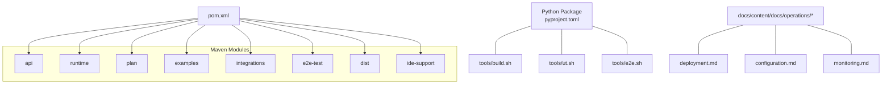
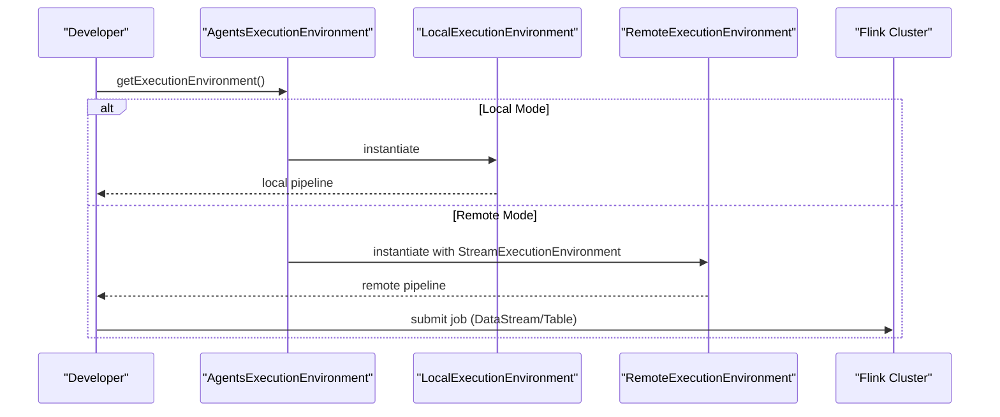
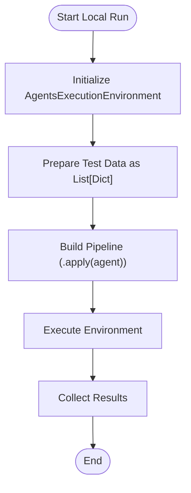
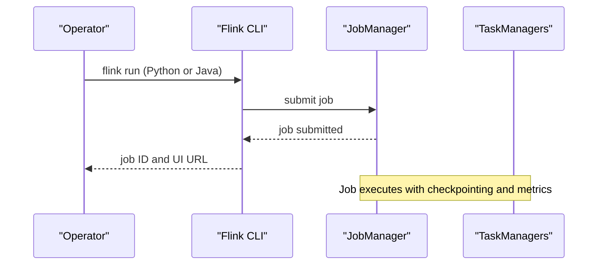
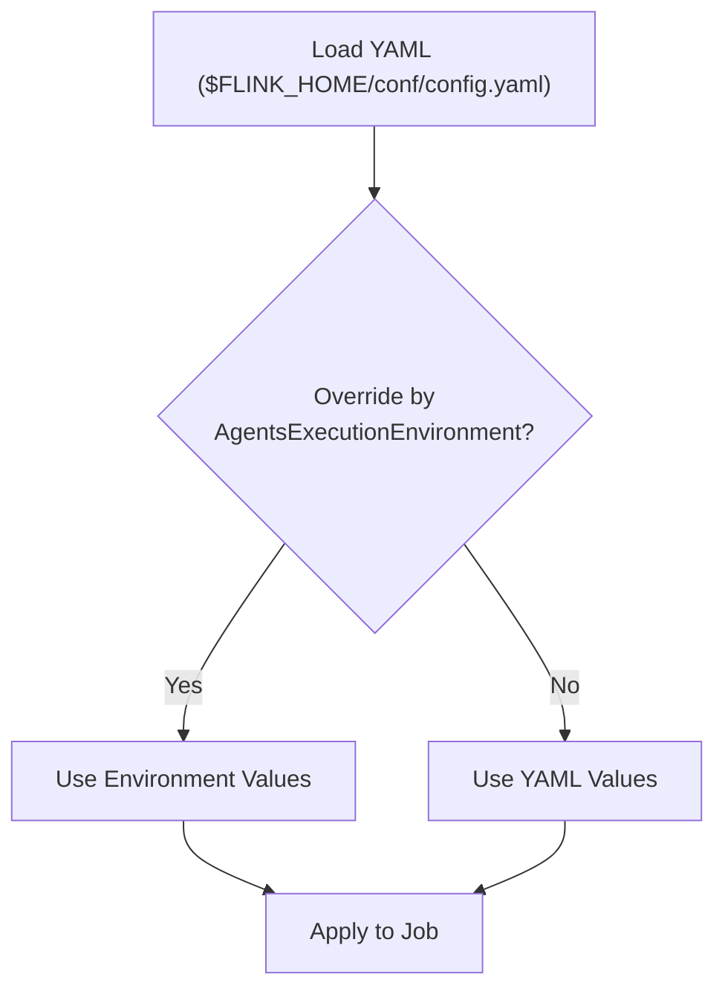
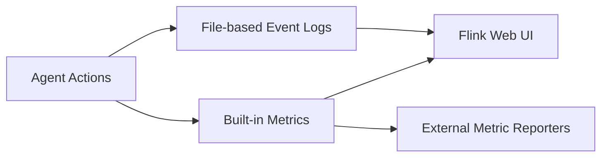
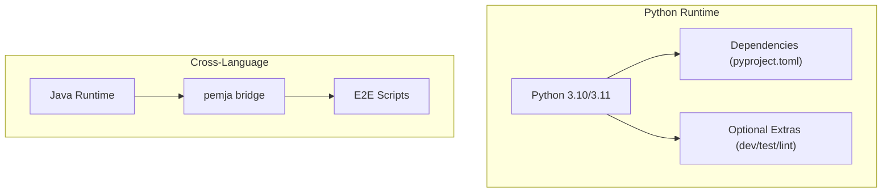
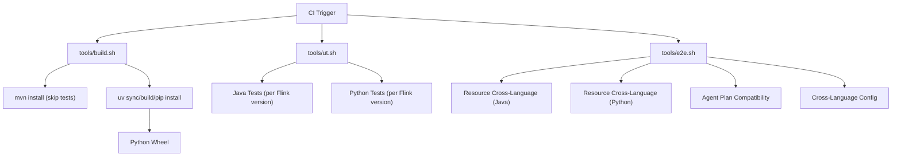
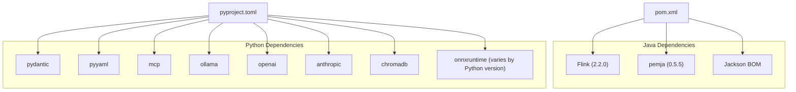

# Deployment Strategies

<cite>
**Referenced Files in This Document**
- [deployment.md](file://docs/content/docs/operations/deployment.md)
- [configuration.md](file://docs/content/docs/operations/configuration.md)
- [monitoring.md](file://docs/content/docs/operations/monitoring.md)
- [pyproject.toml](file://python/pyproject.toml)
- [pom.xml](file://pom.xml)
- [build.sh](file://tools/build.sh)
- [e2e.sh](file://tools/e2e.sh)
- [ut.sh](file://tools/ut.sh)
- [AgentsExecutionEnvironment.java](file://api/src/main/java/org/apache/flink/agents/api/AgentsExecutionEnvironment.java)
- [test_agent_plan_compatibility.sh](file://e2e-test/test-scripts/test_agent_plan_compatibility.sh)
- [test_resource_cross_language.sh](file://e2e-test/test-scripts/test_resource_cross_language.sh)
- [test_java_config_in_python.sh](file://e2e-test/test-scripts/test_java_config_in_python.sh)
</cite>

## Table of Contents
1. [Introduction](#introduction)
2. [Project Structure](#project-structure)
3. [Core Components](#core-components)
4. [Architecture Overview](#architecture-overview)
5. [Detailed Component Analysis](#detailed-component-analysis)
6. [Dependency Analysis](#dependency-analysis)
7. [Performance Considerations](#performance-considerations)
8. [Troubleshooting Guide](#troubleshooting-guide)
9. [Conclusion](#conclusion)
10. [Appendices](#appendices)

## Introduction
This document provides comprehensive deployment strategies for Flink Agents across development, staging, and production environments. It covers local development setups, containerized deployments, and cloud-native architectures. It also documents cluster configuration requirements, resource provisioning, scaling strategies, Python environment setup for cross-language execution, dependency management, runtime isolation, deployment automation scripts, CI/CD pipeline integration, infrastructure-as-code configurations, deployment validation, rollback procedures, and zero-downtime update strategies. Environment-specific configuration examples and troubleshooting guidance are included.

## Project Structure
Flink Agents is a multi-module Maven project with a Python package and extensive documentation. The deployment surface spans:
- Java modules for API, runtime, plan, examples, integrations, e2e tests, and distribution
- Python package with build and dependency management
- Documentation site with operational guides for deployment, configuration, and monitoring
- Automation scripts for building, testing, and end-to-end validation

**Diagram sources**
- [pom.xml](file://pom.xml#L58-L67)
- [pyproject.toml](file://python/pyproject.toml#L26-L70)
- [build.sh](file://tools/build.sh#L38-L86)
- [ut.sh](file://tools/ut.sh#L198-L284)
- [e2e.sh](file://tools/e2e.sh#L18-L166)
- [deployment.md](file://docs/content/docs/operations/deployment.md#L25-L39)
- [configuration.md](file://docs/content/docs/operations/configuration.md#L25-L80)
- [monitoring.md](file://docs/content/docs/operations/monitoring.md#L25-L53)

**Section sources**
- [pom.xml](file://pom.xml#L58-L67)
- [pyproject.toml](file://python/pyproject.toml#L26-L70)
- [deployment.md](file://docs/content/docs/operations/deployment.md#L25-L39)
- [configuration.md](file://docs/content/docs/operations/configuration.md#L25-L80)
- [monitoring.md](file://docs/content/docs/operations/monitoring.md#L25-L53)

## Core Components
- Execution environments and data formats:
  - Local run without Flink for Python-only testing and debugging
  - Flink run for production with Python and Java support and DataStream/Table processing
- Configuration mechanisms:
  - Priority: AgentsExecutionEnvironment > Flink YAML configuration file
  - Built-in options for error handling, async behavior, and action state store
- Monitoring and observability:
  - Built-in metrics for events/actions and token usage
  - Logging via Flink logging framework
  - File-based event logs with configurable base directory

**Section sources**
- [deployment.md](file://docs/content/docs/operations/deployment.md#L29-L39)
- [deployment.md](file://docs/content/docs/operations/deployment.md#L110-L152)
- [configuration.md](file://docs/content/docs/operations/configuration.md#L27-L80)
- [configuration.md](file://docs/content/docs/operations/configuration.md#L122-L151)
- [monitoring.md](file://docs/content/docs/operations/monitoring.md#L25-L53)
- [monitoring.md](file://docs/content/docs/operations/monitoring.md#L120-L162)

## Architecture Overview
The deployment architecture supports two primary modes:
- Local mode: Python-only execution using a local execution environment
- Remote mode: Integration with Flink clusters using DataStream/Table APIs

**Diagram sources**
- [AgentsExecutionEnvironment.java](file://api/src/main/java/org/apache/flink/agents/api/AgentsExecutionEnvironment.java#L68-L97)
- [deployment.md](file://docs/content/docs/operations/deployment.md#L110-L152)

**Section sources**
- [AgentsExecutionEnvironment.java](file://api/src/main/java/org/apache/flink/agents/api/AgentsExecutionEnvironment.java#L68-L97)
- [deployment.md](file://docs/content/docs/operations/deployment.md#L110-L152)

## Detailed Component Analysis

### Local Development Setup
- Purpose: Validate agent logic without a Flink cluster
- Language support: Python only
- Input/Output: Python list format
- Typical workflow:
  - Initialize environment
  - Prepare test data as a list of dictionaries
  - Build pipeline with apply(agent)
  - Execute and collect results

**Diagram sources**
- [deployment.md](file://docs/content/docs/operations/deployment.md#L41-L77)

**Section sources**
- [deployment.md](file://docs/content/docs/operations/deployment.md#L41-L77)

### Flink Cluster Deployment
- Prerequisites:
  - Unix-like OS, Python 3.10 or 3.11, Flink cluster version above 1.20.3
- Submission options:
  - Python jobs via Flink CLI
  - Java jobs via Flink CLI
- Observability:
  - Exactly-once output consistency via Flink checkpointing
  - Exactly-once action consistency via external action state store (e.g., Kafka)

**Diagram sources**
- [deployment.md](file://docs/content/docs/operations/deployment.md#L112-L152)

**Section sources**
- [deployment.md](file://docs/content/docs/operations/deployment.md#L112-L152)
- [deployment.md](file://docs/content/docs/operations/deployment.md#L155-L179)

### Configuration Management
- Priority and scope:
  - AgentsExecutionEnvironment overrides YAML configuration
  - YAML applies to all jobs sharing the same configuration file
- Built-in options:
  - Error handling strategy, retries, async toggles, thread pool size, job identifier
- Action state store:
  - Kafka-based configuration for exactly-once action consistency

**Diagram sources**
- [configuration.md](file://docs/content/docs/operations/configuration.md#L27-L80)
- [configuration.md](file://docs/content/docs/operations/configuration.md#L122-L151)

**Section sources**
- [configuration.md](file://docs/content/docs/operations/configuration.md#L27-L80)
- [configuration.md](file://docs/content/docs/operations/configuration.md#L122-L151)

### Monitoring and Observability
- Metrics:
  - Event/action counters and rates
  - Per-action histograms and meters
  - Token usage metrics for chat models
- Logs:
  - File-based event logs with JSONL format
  - Configurable base directory via configuration
- Access:
  - Metrics and logs via Flink Web UI and metric reporters

**Diagram sources**
- [monitoring.md](file://docs/content/docs/operations/monitoring.md#L25-L53)
- [monitoring.md](file://docs/content/docs/operations/monitoring.md#L120-L162)

**Section sources**
- [monitoring.md](file://docs/content/docs/operations/monitoring.md#L25-L53)
- [monitoring.md](file://docs/content/docs/operations/monitoring.md#L120-L162)

### Python Environment Setup and Cross-Language Execution
- Python environment:
  - Requires Python 3.10 or 3.11
  - Dependencies managed via pyproject.toml
  - Optional extras for dev, build, test, lint
- Cross-language execution:
  - Java/Python interoperability tested via end-to-end scripts
  - Resource registration and cross-language capability validated in tests

**Diagram sources**
- [pyproject.toml](file://python/pyproject.toml#L32-L59)
- [pyproject.toml](file://python/pyproject.toml#L71-L94)
- [pom.xml](file://pom.xml#L48-L48)

**Section sources**
- [pyproject.toml](file://python/pyproject.toml#L32-L59)
- [pyproject.toml](file://python/pyproject.toml#L71-L94)
- [pom.xml](file://pom.xml#L48-L48)

### Deployment Automation and CI/CD Integration
- Build:
  - Maven build for Java modules
  - Python packaging and distribution
- Unit and integration tests:
  - Java tests across Flink versions
  - Python tests with uv or pip
- End-to-end tests:
  - Shell orchestration with automatic jar discovery and Python environment setup
  - Cross-language and configuration validation scripts

**Diagram sources**
- [build.sh](file://tools/build.sh#L38-L86)
- [ut.sh](file://tools/ut.sh#L122-L284)
- [e2e.sh](file://tools/e2e.sh#L18-L166)
- [test_agent_plan_compatibility.sh](file://e2e-test/test-scripts/test_agent_plan_compatibility.sh)
- [test_resource_cross_language.sh](file://e2e-test/test-scripts/test_resource_cross_language.sh)
- [test_java_config_in_python.sh](file://e2e-test/test-scripts/test_java_config_in_python.sh)

**Section sources**
- [build.sh](file://tools/build.sh#L38-L86)
- [ut.sh](file://tools/ut.sh#L122-L284)
- [e2e.sh](file://tools/e2e.sh#L18-L166)

### Scaling and Resource Provisioning
- Async behavior:
  - Enable/disable async for chat, tool calls, and retrieval actions
  - Tune thread pool size for async executor
- Throughput and parallelism:
  - Increase parallelism in Flink DataStream/Table pipelines
  - Adjust JVM and TaskManager memory settings according to workload
- Exactly-once guarantees:
  - Rely on Flink checkpointing for output consistency
  - Use external action state store (e.g., Kafka) for action consistency

**Section sources**
- [configuration.md](file://docs/content/docs/operations/configuration.md#L124-L136)
- [deployment.md](file://docs/content/docs/operations/deployment.md#L155-L179)

### Zero-Downtime Updates and Rollbacks
- Savepoints and upgrades:
  - Use Flink savepoints to pause/resume jobs during updates
  - Restore from savepoints to roll back to previous versions
- Action state store:
  - Maintain action state in external store to prevent duplicate side effects after recovery
- Validation:
  - Run end-to-end tests to validate compatibility and cross-language behavior before promotion

**Section sources**
- [deployment.md](file://docs/content/docs/operations/deployment.md#L155-L179)
- [e2e.sh](file://tools/e2e.sh#L18-L166)

## Dependency Analysis
- Java dependencies:
  - Flink core and version-specific modules
  - pemja for Java/Python interoperability
  - Jackson BOM for unified versions
- Python dependencies:
  - pydantic, pyyaml, mcp, ollama, openai, anthropic, chromadb, onnxruntime variants
  - Optional dev/test/lint toolchains

**Diagram sources**
- [pom.xml](file://pom.xml#L44-L50)
- [pyproject.toml](file://python/pyproject.toml#L44-L59)

**Section sources**
- [pom.xml](file://pom.xml#L44-L50)
- [pyproject.toml](file://python/pyproject.toml#L44-L59)

## Performance Considerations
- Asynchronous processing:
  - Enable async for chat, tool calls, and retrieval to improve throughput
  - Tune thread pool size based on CPU cores and workload characteristics
- Resource isolation:
  - Use separate JVM options and environment variables for Python subprocesses
  - Manage Python virtual environments per job to avoid dependency conflicts
- Monitoring:
  - Track event/action rates and latency histograms
  - Monitor token usage to estimate cost and optimize prompts

[No sources needed since this section provides general guidance]

## Troubleshooting Guide
- Configuration not loading:
  - For MiniCluster, set FLINK_CONF_DIR before running
  - For local mode without Flink, explicitly load YAML via API
- Cross-language issues:
  - Ensure pemja is available and compatible with Java/Python versions
  - Validate resource registration and cross-language scripts
- Metrics and logs:
  - Confirm metric reporter configuration and Web UI access
  - Check file-based event logs location and permissions

**Section sources**
- [configuration.md](file://docs/content/docs/operations/configuration.md#L102-L121)
- [monitoring.md](file://docs/content/docs/operations/monitoring.md#L112-L162)
- [pom.xml](file://pom.xml#L48-L48)

## Conclusion
Flink Agents supports flexible deployment across environments, from local Python-only development to production-grade Flink clusters with cross-language capabilities. By leveraging configuration priorities, monitoring, and robust automation scripts, teams can achieve reliable, observable, and scalable deployments. Adopting savepoints, external action state stores, and rigorous end-to-end testing enables safe, zero-downtime updates and effective rollbacks.

[No sources needed since this section summarizes without analyzing specific files]

## Appendices

### Environment-Specific Configuration Examples
- Local development:
  - Use local execution environment and Python list input
  - Configure base log directory for event logs
- Flink cluster:
  - Set error handling strategy and async toggles
  - Configure Kafka-based action state store for exactly-once action consistency

**Section sources**
- [deployment.md](file://docs/content/docs/operations/deployment.md#L41-L77)
- [configuration.md](file://docs/content/docs/operations/configuration.md#L122-L151)