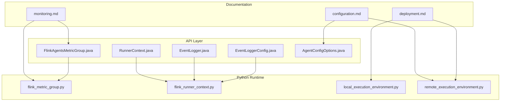
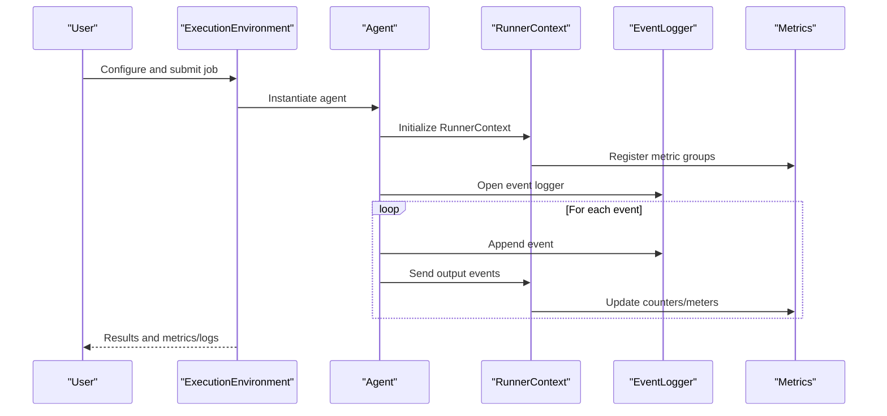
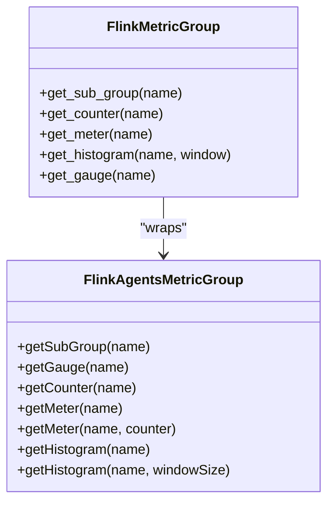
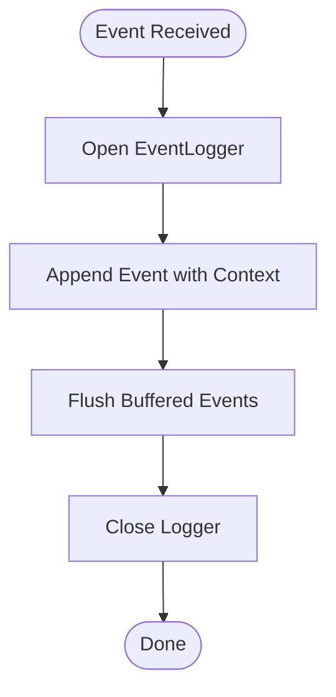
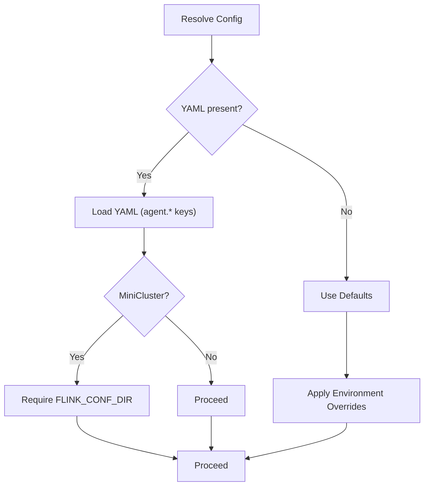
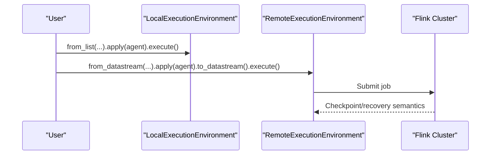
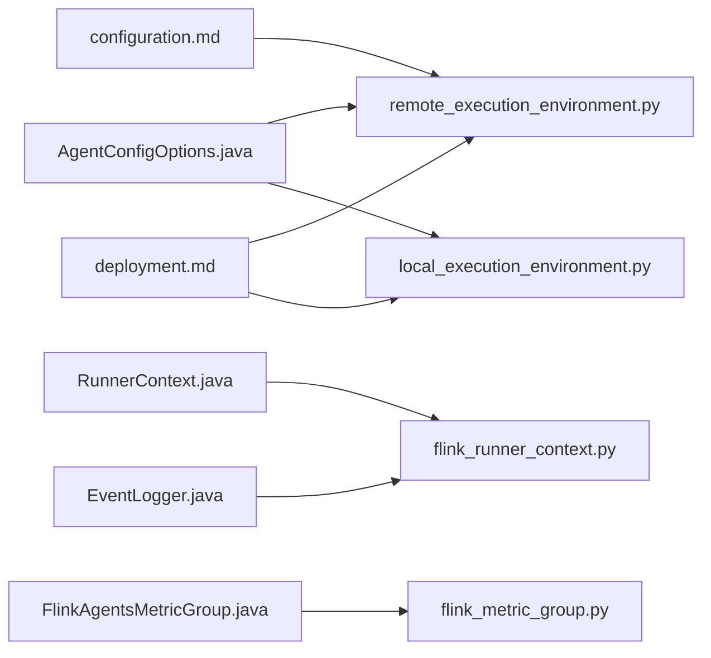

# Operations and Maintenance

<cite>
**Referenced Files in This Document**
- [monitoring.md](file://docs/content/docs/operations/monitoring.md)
- [configuration.md](file://docs/content/docs/operations/configuration.md)
- [deployment.md](file://docs/content/docs/operations/deployment.md)
- [FlinkAgentsMetricGroup.java](file://api/src/main/java/org/apache/flink/agents/api/metrics/FlinkAgentsMetricGroup.java)
- [EventLogger.java](file://api/src/main/java/org/apache/flink/agents/api/logger/EventLogger.java)
- [EventLoggerConfig.java](file://api/src/main/java/org/apache/flink/agents/api/logger/EventLoggerConfig.java)
- [RunnerContext.java](file://api/src/main/java/org/apache/flink/agents/api/context/RunnerContext.java)
- [AgentConfigOptions.java](file://api/src/main/java/org/apache/flink/agents/api/configuration/AgentConfigOptions.java)
- [flink_metric_group.py](file://python/flink_agents/runtime/flink_metric_group.py)
- [flink_runner_context.py](file://python/flink_agents/runtime/flink_runner_context.py)
- [local_execution_environment.py](file://python/flink_agents/runtime/local_execution_environment.py)
- [remote_execution_environment.py](file://python/flink_agents/runtime/remote_execution_environment.py)
</cite>

## Table of Contents
1. [Introduction](#introduction)
2. [Project Structure](#project-structure)
3. [Core Components](#core-components)
4. [Architecture Overview](#architecture-overview)
5. [Detailed Component Analysis](#detailed-component-analysis)
6. [Dependency Analysis](#dependency-analysis)
7. [Performance Considerations](#performance-considerations)
8. [Troubleshooting Guide](#troubleshooting-guide)
9. [Conclusion](#conclusion)
10. [Appendices](#appendices)

## Introduction
This document provides comprehensive operations and maintenance guidance for Flink Agents. It covers monitoring and observability (metrics, logs, event logs, health checks), configuration and deployment, maintenance procedures (backups, updates, performance tuning), troubleshooting methodologies, capacity planning, scaling decisions, incident response, and operational runbooks. The content is grounded in the repository’s official documentation and the implementation of metrics, logging, configuration, and execution environments.

## Project Structure
Flink Agents integrates a Java/Python runtime with Flink’s DataStream/Table APIs. Operational capabilities are exposed through:
- Metrics: Java interfaces and Python wrappers for counters, meters, histograms, gauges
- Logging: Flink-native logging and file-based event logging
- Configuration: YAML-driven settings and programmatic overrides
- Execution Environments: Local and remote (Flink cluster) environments

**Diagram sources**
- [monitoring.md](file://docs/content/docs/operations/monitoring.md#L25-L162)
- [configuration.md](file://docs/content/docs/operations/configuration.md#L25-L151)
- [deployment.md](file://docs/content/docs/operations/deployment.md#L25-L179)
- [FlinkAgentsMetricGroup.java](file://api/src/main/java/org/apache/flink/agents/api/metrics/FlinkAgentsMetricGroup.java#L30-L92)
- [EventLogger.java](file://api/src/main/java/org/apache/flink/agents/api/logger/EventLogger.java#L31-L78)
- [EventLoggerConfig.java](file://api/src/main/java/org/apache/flink/agents/api/logger/EventLoggerConfig.java#L45-L220)
- [RunnerContext.java](file://api/src/main/java/org/apache/flink/agents/api/context/RunnerContext.java#L33-L138)
- [AgentConfigOptions.java](file://api/src/main/java/org/apache/flink/agents/api/configuration/AgentConfigOptions.java#L21-L50)
- [flink_metric_group.py](file://python/flink_agents/runtime/flink_metric_group.py#L25-L170)
- [flink_runner_context.py](file://python/flink_agents/runtime/flink_runner_context.py#L181-L572)
- [local_execution_environment.py](file://python/flink_agents/runtime/local_execution_environment.py#L92-L179)
- [remote_execution_environment.py](file://python/flink_agents/runtime/remote_execution_environment.py#L160-L335)

**Section sources**
- [monitoring.md](file://docs/content/docs/operations/monitoring.md#L25-L162)
- [configuration.md](file://docs/content/docs/operations/configuration.md#L25-L151)
- [deployment.md](file://docs/content/docs/operations/deployment.md#L25-L179)

## Core Components
- Metrics: Built-in metrics for events/actions and token usage; extensible via RunnerContext metric groups and Python wrappers.
- Logging: Flink-native logging for application logs; file-based event logs for structured event persistence.
- Configuration: YAML-based settings with environment variable overrides; programmatic configuration via AgentsExecutionEnvironment.
- Execution Environments: Local (Python list) and remote (Flink cluster) environments for testing and production.

**Section sources**
- [monitoring.md](file://docs/content/docs/operations/monitoring.md#L25-L162)
- [configuration.md](file://docs/content/docs/operations/configuration.md#L25-L151)
- [deployment.md](file://docs/content/docs/operations/deployment.md#L25-L179)
- [FlinkAgentsMetricGroup.java](file://api/src/main/java/org/apache/flink/agents/api/metrics/FlinkAgentsMetricGroup.java#L30-L92)
- [flink_metric_group.py](file://python/flink_agents/runtime/flink_metric_group.py#L25-L170)
- [RunnerContext.java](file://api/src/main/java/org/apache/flink/agents/api/context/RunnerContext.java#L33-L138)
- [AgentConfigOptions.java](file://api/src/main/java/org/apache/flink/agents/api/configuration/AgentConfigOptions.java#L21-L50)

## Architecture Overview
The operational architecture connects user-defined agents to Flink’s execution engine, exposing metrics and logs, and persisting events to file-based storage. Configuration is resolved from YAML and environment variables, and execution occurs either locally or in a Flink cluster.

**Diagram sources**
- [deployment.md](file://docs/content/docs/operations/deployment.md#L110-L179)
- [RunnerContext.java](file://api/src/main/java/org/apache/flink/agents/api/context/RunnerContext.java#L33-L138)
- [EventLogger.java](file://api/src/main/java/org/apache/flink/agents/api/logger/EventLogger.java#L31-L78)
- [FlinkAgentsMetricGroup.java](file://api/src/main/java/org/apache/flink/agents/api/metrics/FlinkAgentsMetricGroup.java#L30-L92)
- [flink_runner_context.py](file://python/flink_agents/runtime/flink_runner_context.py#L181-L572)
- [flink_metric_group.py](file://python/flink_agents/runtime/flink_metric_group.py#L25-L170)

## Detailed Component Analysis

### Metrics and Observability
- Built-in metrics include counts and rates for events and actions, and token usage per model/action.
- Users can extend metrics via RunnerContext metric groups (agent-wide and per-action) and Python wrappers for Flink metric types.
- Metrics are reported to Flink’s metric reporters and can be viewed in the Flink WebUI.

**Diagram sources**
- [FlinkAgentsMetricGroup.java](file://api/src/main/java/org/apache/flink/agents/api/metrics/FlinkAgentsMetricGroup.java#L30-L92)
- [flink_metric_group.py](file://python/flink_agents/runtime/flink_metric_group.py#L25-L170)

**Section sources**
- [monitoring.md](file://docs/content/docs/operations/monitoring.md#L25-L119)
- [FlinkAgentsMetricGroup.java](file://api/src/main/java/org/apache/flink/agents/api/metrics/FlinkAgentsMetricGroup.java#L30-L92)
- [flink_metric_group.py](file://python/flink_agents/runtime/flink_metric_group.py#L25-L170)

### Logging and Event Logging
- Application logs use Flink’s logging framework; logs can be viewed in the Flink WebUI.
- Event logs are file-based by default, stored in JSON Lines format, with a naming convention and configurable base directory.
- EventLogger interface defines open/append/flush/close lifecycle; EventLoggerConfig provides a fluent builder for logger type and properties.

**Diagram sources**
- [EventLogger.java](file://api/src/main/java/org/apache/flink/agents/api/logger/EventLogger.java#L31-L78)
- [EventLoggerConfig.java](file://api/src/main/java/org/apache/flink/agents/api/logger/EventLoggerConfig.java#L45-L220)

**Section sources**
- [monitoring.md](file://docs/content/docs/operations/monitoring.md#L120-L162)
- [EventLogger.java](file://api/src/main/java/org/apache/flink/agents/api/logger/EventLogger.java#L31-L78)
- [EventLoggerConfig.java](file://api/src/main/java/org/apache/flink/agents/api/logger/EventLoggerConfig.java#L45-L220)

### Configuration Management
- Two configuration paths: AgentsExecutionEnvironment and Flink YAML configuration file.
- YAML loading behavior differs for MiniCluster vs. remote execution; environment variable FLINK_CONF_DIR is required for MiniCluster.
- Built-in configuration options include base log directory, error handling strategy, async toggles, thread pool size, and job identifier.

**Diagram sources**
- [configuration.md](file://docs/content/docs/operations/configuration.md#L82-L121)
- [remote_execution_environment.py](file://python/flink_agents/runtime/remote_execution_environment.py#L272-L313)

**Section sources**
- [configuration.md](file://docs/content/docs/operations/configuration.md#L25-L151)
- [AgentConfigOptions.java](file://api/src/main/java/org/apache/flink/agents/api/configuration/AgentConfigOptions.java#L21-L50)
- [remote_execution_environment.py](file://python/flink_agents/runtime/remote_execution_environment.py#L272-L313)

### Execution Environments and Exactly-Once Guarantees
- Local environment for testing with Python lists; remote environment for Flink clusters with DataStream/Table integration.
- Exactly-once output consistency via Flink checkpointing; optional exactly-once action consistency via external action state store (e.g., Kafka).

**Diagram sources**
- [deployment.md](file://docs/content/docs/operations/deployment.md#L110-L179)
- [local_execution_environment.py](file://python/flink_agents/runtime/local_execution_environment.py#L92-L179)
- [remote_execution_environment.py](file://python/flink_agents/runtime/remote_execution_environment.py#L160-L335)

**Section sources**
- [deployment.md](file://docs/content/docs/operations/deployment.md#L25-L179)
- [local_execution_environment.py](file://python/flink_agents/runtime/local_execution_environment.py#L92-L179)
- [remote_execution_environment.py](file://python/flink_agents/runtime/remote_execution_environment.py#L160-L335)

## Dependency Analysis
Operational dependencies span configuration resolution, metric registration, event logging, and execution orchestration.

**Diagram sources**
- [AgentConfigOptions.java](file://api/src/main/java/org/apache/flink/agents/api/configuration/AgentConfigOptions.java#L21-L50)
- [remote_execution_environment.py](file://python/flink_agents/runtime/remote_execution_environment.py#L160-L335)
- [local_execution_environment.py](file://python/flink_agents/runtime/local_execution_environment.py#L92-L179)
- [RunnerContext.java](file://api/src/main/java/org/apache/flink/agents/api/context/RunnerContext.java#L33-L138)
- [flink_runner_context.py](file://python/flink_agents/runtime/flink_runner_context.py#L181-L572)
- [FlinkAgentsMetricGroup.java](file://api/src/main/java/org/apache/flink/agents/api/metrics/FlinkAgentsMetricGroup.java#L30-L92)
- [flink_metric_group.py](file://python/flink_agents/runtime/flink_metric_group.py#L25-L170)
- [EventLogger.java](file://api/src/main/java/org/apache/flink/agents/api/logger/EventLogger.java#L31-L78)
- [configuration.md](file://docs/content/docs/operations/configuration.md#L25-L151)
- [deployment.md](file://docs/content/docs/operations/deployment.md#L25-L179)

**Section sources**
- [AgentConfigOptions.java](file://api/src/main/java/org/apache/flink/agents/api/configuration/AgentConfigOptions.java#L21-L50)
- [RunnerContext.java](file://api/src/main/java/org/apache/flink/agents/api/context/RunnerContext.java#L33-L138)
- [EventLogger.java](file://api/src/main/java/org/apache/flink/agents/api/logger/EventLogger.java#L31-L78)
- [FlinkAgentsMetricGroup.java](file://api/src/main/java/org/apache/flink/agents/api/metrics/FlinkAgentsMetricGroup.java#L30-L92)
- [remote_execution_environment.py](file://python/flink_agents/runtime/remote_execution_environment.py#L160-L335)
- [local_execution_environment.py](file://python/flink_agents/runtime/local_execution_environment.py#L92-L179)
- [flink_runner_context.py](file://python/flink_agents/runtime/flink_runner_context.py#L181-L572)
- [flink_metric_group.py](file://python/flink_agents/runtime/flink_metric_group.py#L25-L170)
- [configuration.md](file://docs/content/docs/operations/configuration.md#L25-L151)
- [deployment.md](file://docs/content/docs/operations/deployment.md#L25-L179)

## Performance Considerations
- Asynchronous execution: Use async toggles and thread pools to improve throughput for chat/tool/RAG actions.
- Metrics-driven tuning: Monitor event/action rates, latency histograms, and token usage to identify bottlenecks.
- Resource sizing: Adjust thread pool size and partition counts for Kafka-backed action state store to match workload.
- Exactly-once action consistency: Configure external action state store to avoid redundant side effects during recovery.

[No sources needed since this section provides general guidance]

## Troubleshooting Guide
Common operational issues and resolutions:
- Missing YAML configuration in MiniCluster: Set FLINK_CONF_DIR before running.
- Local run limitations: Local environment does not support DataStream/Table; use from_list for Python list testing.
- Event logging path: Verify base log directory and file naming convention; ensure write permissions.
- Metrics visibility: Confirm metric reporter configuration and WebUI metric prefix usage.
- Recovery anomalies: Validate exactly-once action consistency configuration and input ordering after checkpoint.

**Section sources**
- [configuration.md](file://docs/content/docs/operations/configuration.md#L102-L121)
- [deployment.md](file://docs/content/docs/operations/deployment.md#L41-L109)
- [monitoring.md](file://docs/content/docs/operations/monitoring.md#L120-L162)

## Conclusion
Flink Agents provides robust operational capabilities through integrated metrics, logging, and event persistence, with flexible configuration and execution environments. By leveraging built-in metrics, structured event logs, and YAML-based configuration, operators can monitor, troubleshoot, and scale Flink Agents effectively. Adhering to exactly-once guarantees and maintaining clear operational runbooks ensures reliability and business continuity.

[No sources needed since this section summarizes without analyzing specific files]

## Appendices

### Operational Runbook Checklist
- Pre-deployment
  - Validate YAML configuration and environment variables
  - Confirm base log directory and permissions
  - Verify Flink cluster readiness and metric reporter setup
- Daily Operations
  - Monitor event/action rates and latency histograms
  - Review file-based event logs for errors and anomalies
  - Track token usage for cost control
- Incident Response
  - Inspect recovery behavior and exactly-once action consistency
  - Check Kafka topic/partition configuration if used as action state store
  - Review logs and metrics around failure points
- Capacity Planning and Scaling
  - Observe throughput and latency trends
  - Scale async thread pools and partitions based on observed load
  - Plan for checkpoint frequency and recovery windows

[No sources needed since this section provides general guidance]