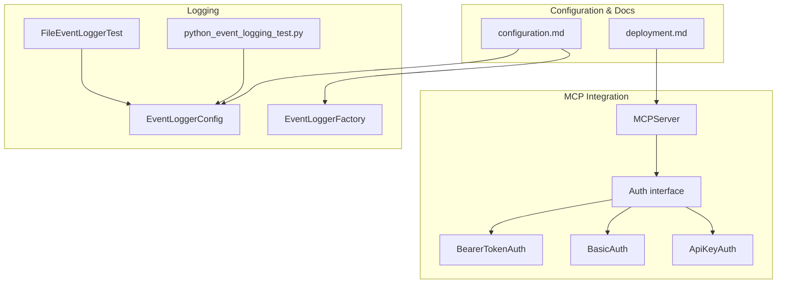
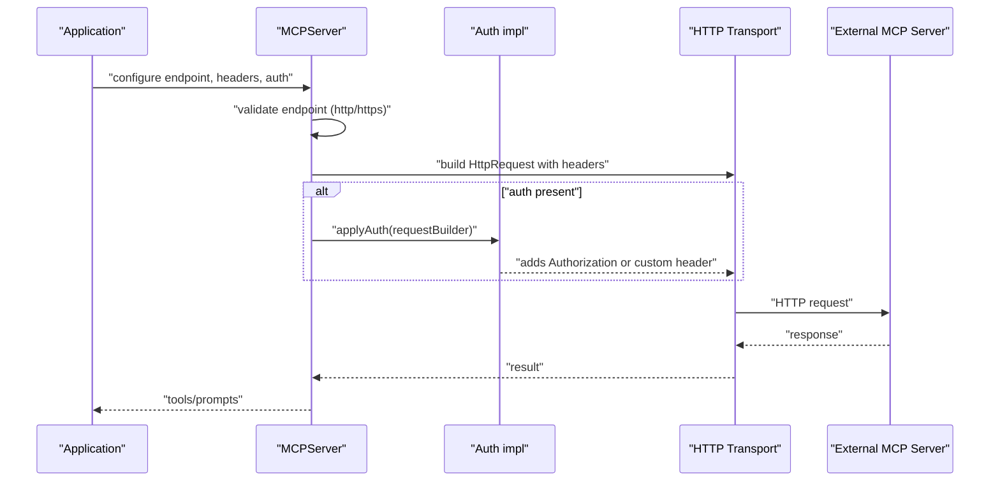
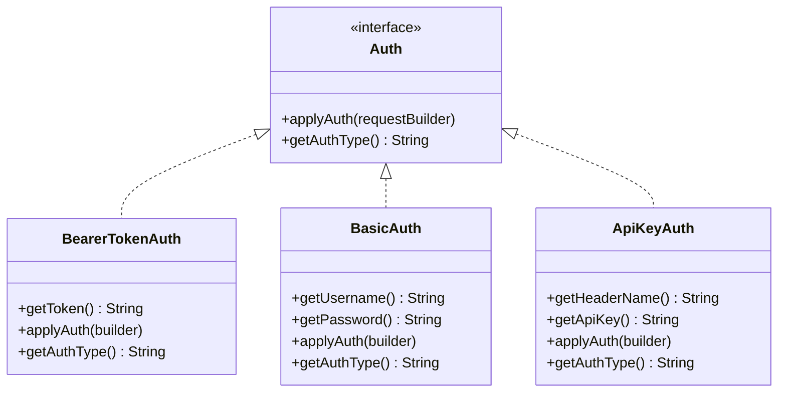
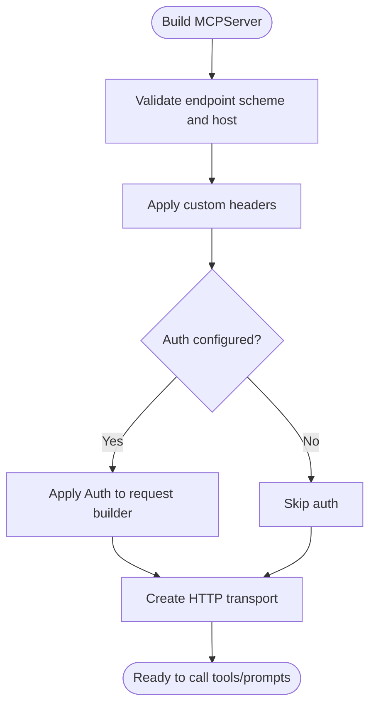
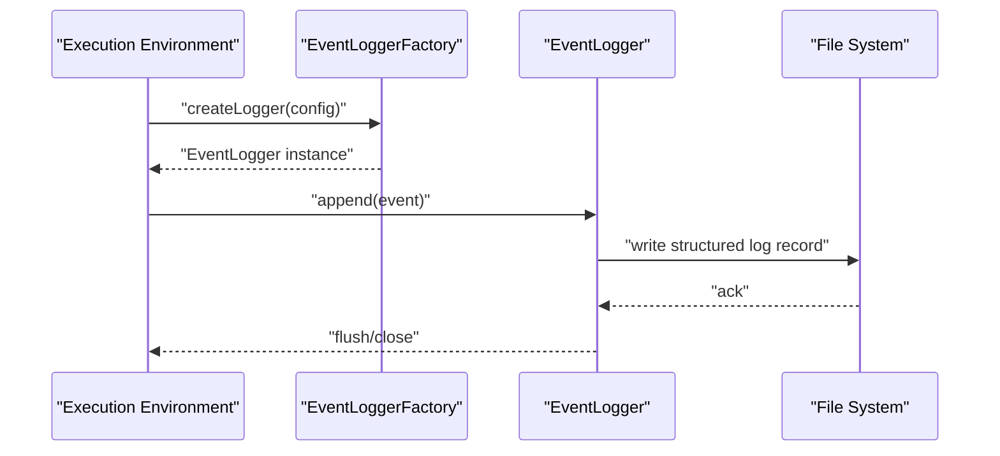
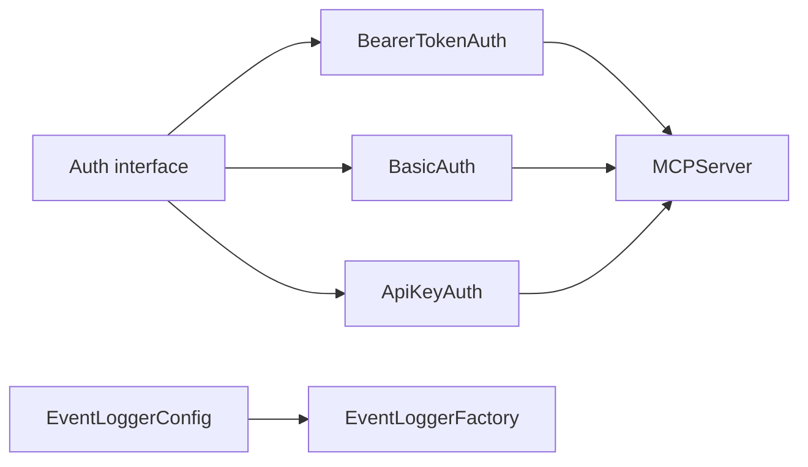

# Security and Authentication

<cite>
**Referenced Files in This Document**
- [Auth.java](file://integrations/mcp/src/main/java/org/apache/flink/agents/integrations/mcp/auth/Auth.java)
- [ApiKeyAuth.java](file://integrations/mcp/src/main/java/org/apache/flink/agents/integrations/mcp/auth/ApiKeyAuth.java)
- [BasicAuth.java](file://integrations/mcp/src/main/java/org/apache/flink/agents/integrations/mcp/auth/BasicAuth.java)
- [BearerTokenAuth.java](file://integrations/mcp/src/main/java/org/apache/flink/agents/integrations/mcp/auth/BearerTokenAuth.java)
- [MCPServer.java](file://integrations/mcp/src/main/java/org/apache/flink/agents/integrations/mcp/MCPServer.java)
- [configuration.md](file://docs/content/docs/operations/configuration.md)
- [deployment.md](file://docs/content/docs/operations/deployment.md)
- [EventLoggerConfig.java](file://api/src/main/java/org/apache/flink/agents/api/logger/EventLoggerConfig.java)
- [EventLoggerFactory.java](file://api/src/main/java/org/apache/flink/agents/api/logger/EventLoggerFactory.java)
- [FileEventLoggerTest.java](file://runtime/src/test/java/org/apache/flink/agents/runtime/eventlog/FileEventLoggerTest.java)
- [python_event_logging_test.py](file://python/flink_agents/e2e_tests/e2e_tests_integration/python_event_logging_test.py)
</cite>

## Table of Contents
1. [Introduction](#introduction)
2. [Project Structure](#project-structure)
3. [Core Components](#core-components)
4. [Architecture Overview](#architecture-overview)
5. [Detailed Component Analysis](#detailed-component-analysis)
6. [Dependency Analysis](#dependency-analysis)
7. [Performance Considerations](#performance-considerations)
8. [Troubleshooting Guide](#troubleshooting-guide)
9. [Conclusion](#conclusion)
10. [Appendices](#appendices)

## Introduction
This document provides comprehensive security guidance for deploying Flink Agents, focusing on authentication mechanisms for external integrations, secure resource configuration, credential management, access control patterns, MCP server security, network security considerations, encrypted communication, and production best practices. It also covers audit logging, common vulnerabilities, mitigation strategies, compliance considerations, and configuration examples for different deployment scenarios.

## Project Structure
Security-relevant components are primarily located in:
- MCP authentication implementations and server resource
- Configuration and deployment documentation
- Event logging configuration and factories
- Tests validating event logging behavior

**Diagram sources**
- [Auth.java](file://integrations/mcp/src/main/java/org/apache/flink/agents/integrations/mcp/auth/Auth.java#L37-L42)
- [MCPServer.java](file://integrations/mcp/src/main/java/org/apache/flink/agents/integrations/mcp/MCPServer.java#L56-L62)
- [configuration.md](file://docs/content/docs/operations/configuration.md#L122-L151)
- [deployment.md](file://docs/content/docs/operations/deployment.md#L25-L39)
- [EventLoggerConfig.java](file://api/src/main/java/org/apache/flink/agents/api/logger/EventLoggerConfig.java#L45-L149)
- [EventLoggerFactory.java](file://api/src/main/java/org/apache/flink/agents/api/logger/EventLoggerFactory.java#L70-L153)
- [FileEventLoggerTest.java](file://runtime/src/test/java/org/apache/flink/agents/runtime/eventlog/FileEventLoggerTest.java#L466-L495)
- [python_event_logging_test.py](file://python/flink_agents/e2e_tests/e2e_tests_integration/python_event_logging_test.py#L107-L142)

**Section sources**
- [Auth.java](file://integrations/mcp/src/main/java/org/apache/flink/agents/integrations/mcp/auth/Auth.java#L27-L42)
- [MCPServer.java](file://integrations/mcp/src/main/java/org/apache/flink/agents/integrations/mcp/MCPServer.java#L50-L77)
- [configuration.md](file://docs/content/docs/operations/configuration.md#L25-L36)
- [deployment.md](file://docs/content/docs/operations/deployment.md#L25-L39)

## Core Components
- Authentication interface and implementations:
  - Bearer token authentication for OAuth 2.0/JWT
  - Basic authentication (username/password)
  - API key authentication via custom headers
- MCP server resource supporting authentication, headers, timeouts, and HTTP(S) validation
- Configuration options for event logging and action state stores
- Deployment modes and consistency guarantees impacting security posture

**Section sources**
- [Auth.java](file://integrations/mcp/src/main/java/org/apache/flink/agents/integrations/mcp/auth/Auth.java#L37-L42)
- [MCPServer.java](file://integrations/mcp/src/main/java/org/apache/flink/agents/integrations/mcp/MCPServer.java#L56-L62)
- [configuration.md](file://docs/content/docs/operations/configuration.md#L122-L151)
- [deployment.md](file://docs/content/docs/operations/deployment.md#L25-L39)

## Architecture Overview
The MCP server integrates with external services using standardized authentication mechanisms. Requests are constructed with optional headers and authentication applied before transport creation. Configuration controls logging and action state stores, enabling audit trails and exactly-once semantics.

**Diagram sources**
- [MCPServer.java](file://integrations/mcp/src/main/java/org/apache/flink/agents/integrations/mcp/MCPServer.java#L213-L240)
- [Auth.java](file://integrations/mcp/src/main/java/org/apache/flink/agents/integrations/mcp/auth/Auth.java#L45-L58)
- [BearerTokenAuth.java](file://integrations/mcp/src/main/java/org/apache/flink/agents/integrations/mcp/auth/BearerTokenAuth.java#L58-L61)
- [BasicAuth.java](file://integrations/mcp/src/main/java/org/apache/flink/agents/integrations/mcp/auth/BasicAuth.java#L69-L75)
- [ApiKeyAuth.java](file://integrations/mcp/src/main/java/org/apache/flink/agents/integrations/mcp/auth/ApiKeyAuth.java#L67-L70)

## Detailed Component Analysis

### Authentication Mechanisms
Flink Agents supports three primary authentication types for MCP server connections:
- Bearer token authentication: Adds an Authorization header with a bearer token
- Basic authentication: Adds an Authorization header with base64-encoded credentials
- API key authentication: Adds a configurable custom header carrying an API key

**Diagram sources**
- [Auth.java](file://integrations/mcp/src/main/java/org/apache/flink/agents/integrations/mcp/auth/Auth.java#L37-L42)
- [BearerTokenAuth.java](file://integrations/mcp/src/main/java/org/apache/flink/agents/integrations/mcp/auth/BearerTokenAuth.java#L40-L66)
- [BasicAuth.java](file://integrations/mcp/src/main/java/org/apache/flink/agents/integrations/mcp/auth/BasicAuth.java#L43-L80)
- [ApiKeyAuth.java](file://integrations/mcp/src/main/java/org/apache/flink/agents/integrations/mcp/auth/ApiKeyAuth.java#L41-L83)

**Section sources**
- [BearerTokenAuth.java](file://integrations/mcp/src/main/java/org/apache/flink/agents/integrations/mcp/auth/BearerTokenAuth.java#L27-L39)
- [BasicAuth.java](file://integrations/mcp/src/main/java/org/apache/flink/agents/integrations/mcp/auth/BasicAuth.java#L29-L42)
- [ApiKeyAuth.java](file://integrations/mcp/src/main/java/org/apache/flink/agents/integrations/mcp/auth/ApiKeyAuth.java#L27-L40)

### MCP Server Security Configuration
- Endpoint validation enforces http or https scheme and a non-empty host
- Optional custom headers can be supplied
- Authentication is applied to outgoing requests
- Timeout is configurable and applied to the underlying transport

**Diagram sources**
- [MCPServer.java](file://integrations/mcp/src/main/java/org/apache/flink/agents/integrations/mcp/MCPServer.java#L242-L258)
- [MCPServer.java](file://integrations/mcp/src/main/java/org/apache/flink/agents/integrations/mcp/MCPServer.java#L213-L240)

**Section sources**
- [MCPServer.java](file://integrations/mcp/src/main/java/org/apache/flink/agents/integrations/mcp/MCPServer.java#L242-L258)
- [MCPServer.java](file://integrations/mcp/src/main/java/org/apache/flink/agents/integrations/mcp/MCPServer.java#L213-L240)

### Secure Resource Configuration and Credential Management
- MCP server resources accept endpoint, headers, timeout, and auth configuration
- Authentication types are serialized/deserialized with explicit type markers
- Credentials are encapsulated within auth implementations; sensitive fields are masked in toString

Best practices:
- Prefer bearer tokens for OAuth/JWT; rotate tokens regularly
- Use basic auth only over HTTPS; avoid embedding credentials in code
- Store API keys in secure secret stores; restrict access to least-privileged accounts
- Avoid logging sensitive fields; rely on masked representations

**Section sources**
- [MCPServer.java](file://integrations/mcp/src/main/java/org/apache/flink/agents/integrations/mcp/MCPServer.java#L80-L96)
- [Auth.java](file://integrations/mcp/src/main/java/org/apache/flink/agents/integrations/mcp/auth/Auth.java#L37-L42)
- [BearerTokenAuth.java](file://integrations/mcp/src/main/java/org/apache/flink/agents/integrations/mcp/auth/BearerTokenAuth.java#L85-L88)
- [BasicAuth.java](file://integrations/mcp/src/main/java/org/apache/flink/agents/integrations/mcp/auth/BasicAuth.java#L104-L107)
- [ApiKeyAuth.java](file://integrations/mcp/src/main/java/org/apache/flink/agents/integrations/mcp/auth/ApiKeyAuth.java#L98-L101)

### Access Control Patterns
- Least privilege: grant minimal permissions required by external services
- Principle of least exposure: avoid sending unnecessary headers or credentials
- Network segmentation: place MCP servers behind firewalls and TLS termination points
- Role-based access: use distinct tokens/API keys per service or environment

[No sources needed since this section provides general guidance]

### Audit Logging and Compliance
- Event logging can be configured via EventLoggerConfig and factories
- Default filter accepts all events; customize filters for compliance needs
- Tests demonstrate structured event logging with timestamps and event types
- Configure base log directory for file-based logging

**Diagram sources**
- [EventLoggerFactory.java](file://api/src/main/java/org/apache/flink/agents/api/logger/EventLoggerFactory.java#L92-L101)
- [EventLoggerConfig.java](file://api/src/main/java/org/apache/flink/agents/api/logger/EventLoggerConfig.java#L144-L147)
- [FileEventLoggerTest.java](file://runtime/src/test/java/org/apache/flink/agents/runtime/eventlog/FileEventLoggerTest.java#L476-L483)
- [python_event_logging_test.py](file://python/flink_agents/e2e_tests/e2e_tests_integration/python_event_logging_test.py#L112-L142)

**Section sources**
- [EventLoggerConfig.java](file://api/src/main/java/org/apache/flink/agents/api/logger/EventLoggerConfig.java#L45-L149)
- [EventLoggerFactory.java](file://api/src/main/java/org/apache/flink/agents/api/logger/EventLoggerFactory.java#L70-L153)
- [FileEventLoggerTest.java](file://runtime/src/test/java/org/apache/flink/agents/runtime/eventlog/FileEventLoggerTest.java#L466-L495)
- [python_event_logging_test.py](file://python/flink_agents/e2e_tests/e2e_tests_integration/python_event_logging_test.py#L107-L142)

### Network Security and Encrypted Communication
- MCP server endpoint validation requires http or https
- Always use HTTPS for production to enforce encrypted transport
- Restrict outbound traffic to trusted MCP endpoints via firewall policies
- Consider mutual TLS or certificate pinning where supported by external services

**Section sources**
- [MCPServer.java](file://integrations/mcp/src/main/java/org/apache/flink/agents/integrations/mcp/MCPServer.java#L242-L258)

### Production Deployment Security
- Choose production mode with Flink for exactly-once guarantees and state stores
- Configure action state store (e.g., Kafka) to ensure idempotent actions
- Use separate credentials per environment and rotate regularly
- Enforce strict secrets management and environment variable injection

**Section sources**
- [deployment.md](file://docs/content/docs/operations/deployment.md#L25-L39)
- [deployment.md](file://docs/content/docs/operations/deployment.md#L155-L179)
- [configuration.md](file://docs/content/docs/operations/configuration.md#L138-L151)

## Dependency Analysis
Authentication implementations depend on the Auth interface and are integrated into MCPServer. Logging configuration depends on EventLoggerConfig and EventLoggerFactory.

**Diagram sources**
- [Auth.java](file://integrations/mcp/src/main/java/org/apache/flink/agents/integrations/mcp/auth/Auth.java#L37-L42)
- [MCPServer.java](file://integrations/mcp/src/main/java/org/apache/flink/agents/integrations/mcp/MCPServer.java#L56-L62)
- [EventLoggerConfig.java](file://api/src/main/java/org/apache/flink/agents/api/logger/EventLoggerConfig.java#L45-L149)
- [EventLoggerFactory.java](file://api/src/main/java/org/apache/flink/agents/api/logger/EventLoggerFactory.java#L70-L153)

**Section sources**
- [Auth.java](file://integrations/mcp/src/main/java/org/apache/flink/agents/integrations/mcp/auth/Auth.java#L37-L42)
- [MCPServer.java](file://integrations/mcp/src/main/java/org/apache/flink/agents/integrations/mcp/MCPServer.java#L56-L62)
- [EventLoggerConfig.java](file://api/src/main/java/org/apache/flink/agents/api/logger/EventLoggerConfig.java#L45-L149)
- [EventLoggerFactory.java](file://api/src/main/java/org/apache/flink/agents/api/logger/EventLoggerFactory.java#L70-L153)

## Performance Considerations
- Authentication overhead is minimal; ensure efficient header and token handling
- Use appropriate timeouts to prevent resource leaks
- Batch logging writes and tune flush intervals for throughput vs. durability trade-offs

[No sources needed since this section provides general guidance]

## Troubleshooting Guide
Common issues and mitigations:
- Invalid endpoint: ensure http or https scheme and non-empty host
- Missing or incorrect credentials: verify token/API key/header name
- Excessive retries: adjust error handling strategy and max retries
- Audit logging gaps: confirm base log directory and filter configuration

**Section sources**
- [MCPServer.java](file://integrations/mcp/src/main/java/org/apache/flink/agents/integrations/mcp/MCPServer.java#L242-L258)
- [configuration.md](file://docs/content/docs/operations/configuration.md#L122-L151)
- [FileEventLoggerTest.java](file://runtime/src/test/java/org/apache/flink/agents/runtime/eventlog/FileEventLoggerTest.java#L466-L495)

## Conclusion
Flink Agents provides robust, extensible authentication for MCP integrations and supports secure configuration and logging. By enforcing HTTPS, applying least-privilege credentials, leveraging action state stores for idempotency, and maintaining comprehensive audit logs, teams can achieve strong security posture in production environments.

[No sources needed since this section summarizes without analyzing specific files]

## Appendices

### Security Configuration Examples
- Bearer token authentication:
  - Configure an MCP server with a bearer token; ensure HTTPS endpoint
  - Rotate tokens regularly and restrict scopes to least privilege
- Basic authentication:
  - Use only over HTTPS; avoid embedding credentials in code
  - Store credentials in environment variables or secret managers
- API key authentication:
  - Use a dedicated header (e.g., X-API-Key) with rotating keys
  - Limit key scope and revoke on compromise

**Section sources**
- [MCPServer.java](file://integrations/mcp/src/main/java/org/apache/flink/agents/integrations/mcp/MCPServer.java#L56-L62)
- [BearerTokenAuth.java](file://integrations/mcp/src/main/java/org/apache/flink/agents/integrations/mcp/auth/BearerTokenAuth.java#L27-L39)
- [BasicAuth.java](file://integrations/mcp/src/main/java/org/apache/flink/agents/integrations/mcp/auth/BasicAuth.java#L29-L42)
- [ApiKeyAuth.java](file://integrations/mcp/src/main/java/org/apache/flink/agents/integrations/mcp/auth/ApiKeyAuth.java#L27-L40)

### Threat Modeling Guidance
- Man-in-the-middle attacks: enforce HTTPS and certificate pinning where feasible
- Credential exposure: avoid logging sensitive fields; mask in toString
- Replay attacks: use short-lived tokens and revocation lists
- Denial-of-service: rate-limit external calls and monitor timeouts

[No sources needed since this section provides general guidance]