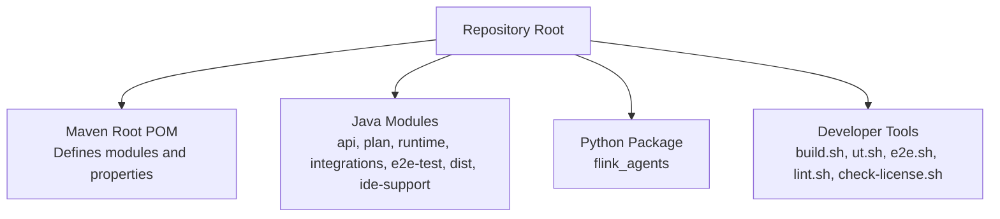
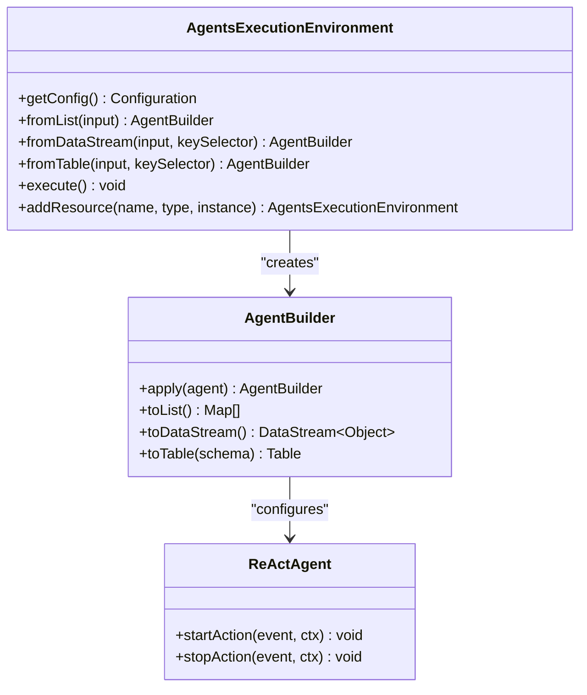
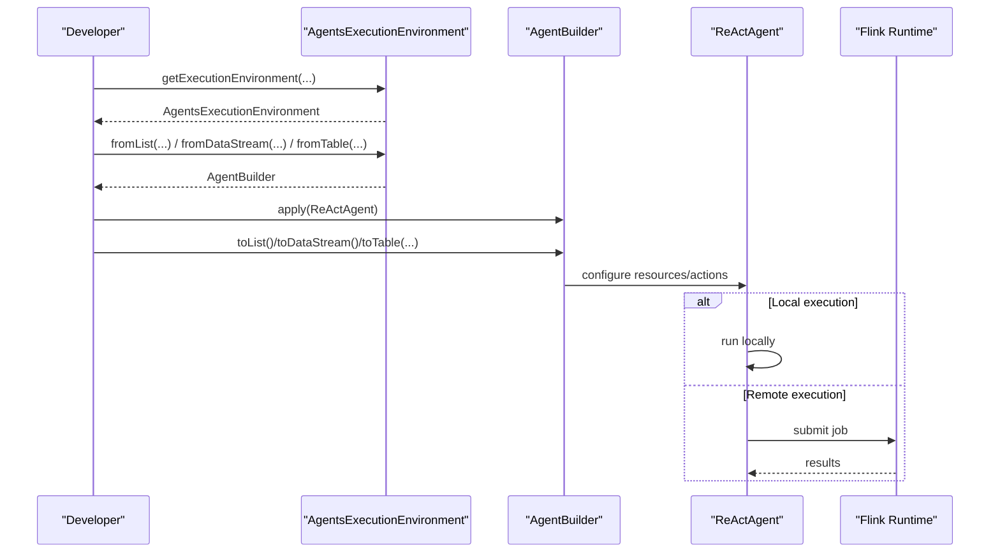
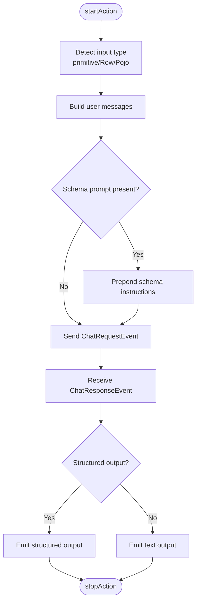
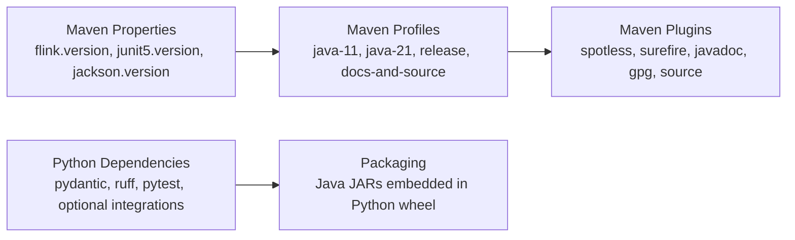
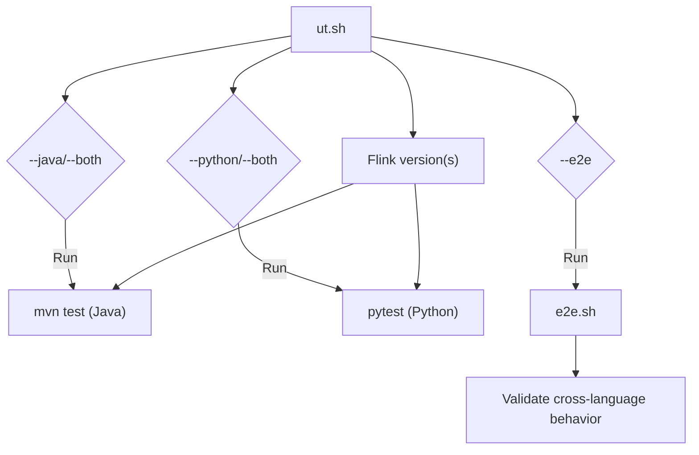

# Contributing and Development

<cite>
**Referenced Files in This Document**
- [README.md](file://README.md)
- [pom.xml](file://pom.xml)
- [pyproject.toml](file://python/pyproject.toml)
- [build.sh](file://tools/build.sh)
- [ut.sh](file://tools/ut.sh)
- [e2e.sh](file://tools/e2e.sh)
- [lint.sh](file://tools/lint.sh)
- [check-license.sh](file://tools/check-license.sh)
- [.rat-excludes](file://tools/.rat-excludes)
- [AgentBuilder.java](file://api/src/main/java/org/apache/flink/agents/api/AgentBuilder.java)
- [AgentsExecutionEnvironment.java](file://api/src/main/java/org/apache/flink/agents/api/AgentsExecutionEnvironment.java)
- [ReActAgent.java](file://api/src/main/java/org/apache/flink/agents/api/agents/ReActAgent.java)
</cite>

## Table of Contents
1. [Introduction](#introduction)
2. [Project Structure](#project-structure)
3. [Core Components](#core-components)
4. [Architecture Overview](#architecture-overview)
5. [Detailed Component Analysis](#detailed-component-analysis)
6. [Dependency Analysis](#dependency-analysis)
7. [Performance Considerations](#performance-considerations)
8. [Troubleshooting Guide](#troubleshooting-guide)
9. [Contribution Guidelines](#contribution-guidelines)
10. [Development Workflows](#development-workflows)
11. [Build System Configuration](#build-system-configuration)
12. [Testing Requirements and Validation](#testing-requirements-and-validation)
13. [Code Quality and Pre-commit Checks](#code-quality-and-pre-commit-checks)
14. [Release Processes and Versioning](#release-processes-and-versioning)
15. [Community Engagement](#community-engagement)
16. [Development Environment Setup](#development-environment-setup)
17. [Debugging Techniques](#debugging-techniques)
18. [Conclusion](#conclusion)

## Introduction
This document provides comprehensive guidance for contributing to and developing Apache Flink Agents. It covers prerequisites, build system configuration, development workflows, testing, code quality, release processes, and community practices. The project supports both Java and Python ecosystems with cross-language integration points and end-to-end validation.

## Project Structure
The repository is organized as a multi-module Maven project with a dedicated Python package and supporting tooling for building, testing, linting, and licensing checks. Key modules include the API surface, plan and runtime implementations, integrations, examples, and end-to-end tests. The Python package mirrors the Java artifacts and provides a native Python API.

**Diagram sources**
- [pom.xml](file://pom.xml#L58-L67)
- [pyproject.toml](file://python/pyproject.toml#L64-L70)

**Section sources**
- [pom.xml](file://pom.xml#L58-L67)
- [pyproject.toml](file://python/pyproject.toml#L64-L70)

## Core Components
- Execution Environment: Provides factory methods to obtain local or remote execution environments and exposes input sources (list, DataStream, Table) and resource registration.
- Agent Builder: Fluent API to configure agents and produce outputs as lists, DataStreams, or Tables.
- ReAct Agent: Built-in agent implementing reasoning-acting loop with structured output support.

**Diagram sources**
- [AgentsExecutionEnvironment.java](file://api/src/main/java/org/apache/flink/agents/api/AgentsExecutionEnvironment.java#L43-L222)
- [AgentBuilder.java](file://api/src/main/java/org/apache/flink/agents/api/AgentBuilder.java#L35-L76)
- [ReActAgent.java](file://api/src/main/java/org/apache/flink/agents/api/agents/ReActAgent.java#L51-L182)

**Section sources**
- [AgentsExecutionEnvironment.java](file://api/src/main/java/org/apache/flink/agents/api/AgentsExecutionEnvironment.java#L43-L222)
- [AgentBuilder.java](file://api/src/main/java/org/apache/flink/agents/api/AgentBuilder.java#L35-L76)
- [ReActAgent.java](file://api/src/main/java/org/apache/flink/agents/api/agents/ReActAgent.java#L51-L182)

## Architecture Overview
The system integrates Flink’s DataStream/Table APIs with an agent-centric execution model. Users define agents, register resources, and connect inputs to outputs via the execution environment. The Python package embeds Java artifacts and enables cross-language resource usage.

**Diagram sources**
- [AgentsExecutionEnvironment.java](file://api/src/main/java/org/apache/flink/agents/api/AgentsExecutionEnvironment.java#L68-L121)
- [AgentBuilder.java](file://api/src/main/java/org/apache/flink/agents/api/AgentBuilder.java#L43-L75)
- [ReActAgent.java](file://api/src/main/java/org/apache/flink/agents/api/agents/ReActAgent.java#L59-L101)

## Detailed Component Analysis

### Execution Environment
- Factory-based selection between local and remote environments.
- Input sources: list, DataStream (with optional keying), Table (converted to DataStream).
- Resource registration supports serializable resources and descriptors.

**Section sources**
- [AgentsExecutionEnvironment.java](file://api/src/main/java/org/apache/flink/agents/api/AgentsExecutionEnvironment.java#L68-L222)

### Agent Builder
- Fluent configuration of agents.
- Output modes: list, DataStream, Table with schema binding.

**Section sources**
- [AgentBuilder.java](file://api/src/main/java/org/apache/flink/agents/api/AgentBuilder.java#L35-L76)

### ReAct Agent
- Default chat model and prompt resources.
- Structured output schema support via JSON schema injection.
- Action lifecycle: startAction emits chat requests; stopAction emits final output.

**Diagram sources**
- [ReActAgent.java](file://api/src/main/java/org/apache/flink/agents/api/agents/ReActAgent.java#L103-L181)

**Section sources**
- [ReActAgent.java](file://api/src/main/java/org/apache/flink/agents/api/agents/ReActAgent.java#L51-L182)

## Dependency Analysis
- Maven central dependencies are managed via property blocks and profiles.
- Python dependencies are declared in pyproject.toml with optional groups for dev, build, test, and lint.
- Cross-language packaging ensures Java JARs are embedded into the Python wheel.

**Diagram sources**
- [pom.xml](file://pom.xml#L37-L56)
- [pom.xml](file://pom.xml#L109-L251)
- [pyproject.toml](file://python/pyproject.toml#L44-L59)
- [pyproject.toml](file://python/pyproject.toml#L74-L93)

**Section sources**
- [pom.xml](file://pom.xml#L37-L56)
- [pom.xml](file://pom.xml#L109-L251)
- [pyproject.toml](file://python/pyproject.toml#L44-L59)
- [pyproject.toml](file://python/pyproject.toml#L74-L93)

## Performance Considerations
- Prefer keyed DataStream processing for stateful agents to leverage Flink’s state backend efficiently.
- Minimize serialization overhead by using compact input/output schemas and avoiding unnecessary object wrapping.
- Use batch-friendly configurations for local execution and tune parallelism according to resource availability.

## Troubleshooting Guide
Common issues and remedies:
- License header checks failing: Ensure all new files include the standard ASL 2.0 header; run the license checker to identify missing headers.
- Spotless formatting failures: Apply formatting via the lint tool or Maven spotless plugin.
- Python dependency resolution: Use uv when available; otherwise fall back to pip with pyproject extras.
- E2E test prerequisites: Ensure Java JARs are built and Python dependencies are installed; the e2e harness coordinates these steps.

**Section sources**
- [check-license.sh](file://tools/check-license.sh#L82-L87)
- [lint.sh](file://tools/lint.sh#L115-L167)
- [e2e.sh](file://tools/e2e.sh#L95-L111)

## Contribution Guidelines
- Fork and clone the repository.
- Follow the build and test workflows described below.
- Submit pull requests with clear descriptions and passing validations.

**Section sources**
- [README.md](file://README.md#L32-L44)

## Development Workflows
- Local development cycle:
  - Build Java and Python parts using the build script.
  - Run unit tests for both Java and Python.
  - Perform end-to-end tests for cross-language scenarios.
  - Apply formatting and license checks before committing.

**Section sources**
- [build.sh](file://tools/build.sh#L21-L86)
- [ut.sh](file://tools/ut.sh#L67-L108)
- [e2e.sh](file://tools/e2e.sh#L18-L166)

## Build System Configuration
- Maven:
  - Modules: api, examples, plan, runtime, e2e-test, integrations, dist, ide-support.
  - Profiles: java-11, java-21, release, docs-and-source.
  - Plugins: spotless (Google Java Format), surefire, javadoc, GPG signing for release.
- Python:
  - setuptools build backend with pyproject.toml.
  - Optional dependency groups for dev, build, test, and lint.
  - cibuildwheel configuration for cross-platform wheels.

**Section sources**
- [pom.xml](file://pom.xml#L58-L67)
- [pom.xml](file://pom.xml#L109-L251)
- [pyproject.toml](file://python/pyproject.toml#L18-L24)
- [pyproject.toml](file://python/pyproject.toml#L72-L93)
- [pyproject.toml](file://python/pyproject.toml#L95-L107)

## Testing Requirements and Validation
- Unit tests:
  - Java: Maven Surefire executes JUnit 5 tests; includes test-jar installation for integration.
  - Python: pytest with uv or pip; excludes E2E tests by default.
- End-to-end tests:
  - Bash harness orchestrates cross-language scenarios and validates agent plan compatibility and resource interoperability.
- Version targeting:
  - Test matrices support multiple Flink versions (e.g., 2.2, 1.20).

**Diagram sources**
- [ut.sh](file://tools/ut.sh#L67-L120)
- [e2e.sh](file://tools/e2e.sh#L18-L86)

**Section sources**
- [ut.sh](file://tools/ut.sh#L67-L120)
- [ut.sh](file://tools/ut.sh#L122-L196)
- [ut.sh](file://tools/ut.sh#L198-L284)
- [e2e.sh](file://tools/e2e.sh#L18-L86)

## Code Quality and Pre-commit Checks
- Formatting:
  - Python: ruff with Google-style conventions and selected rule sets.
  - Java: spotless with Google Java Format AOSP style.
- License headers:
  - Apache RAT scan with project-specific exclusions.

**Section sources**
- [lint.sh](file://tools/lint.sh#L85-L113)
- [lint.sh](file://tools/lint.sh#L115-L167)
- [check-license.sh](file://tools/check-license.sh#L23-L51)
- [check-license.sh](file://tools/check-license.sh#L72-L87)
- [.rat-excludes](file://tools/.rat-excludes#L1-L19)

## Release Processes and Versioning
- Versioning:
  - Maven parent versioning aligns with Apache conventions; snapshot and release versions are managed in the root POM.
- Profiles:
  - release profile activates GPG signing and javadoc packaging.
  - docs-and-source profile attaches sources and javadoc.
- Tooling:
  - Releasing scripts automate branch creation, snapshot/sourced releases, staging deployment, and contributor listing.

**Section sources**
- [pom.xml](file://pom.xml#L34-L35)
- [pom.xml](file://pom.xml#L133-L208)
- [pom.xml](file://pom.xml#L210-L251)

## Community Engagement
- Join the Apache Flink Slack channels for user and development discussions.
- Participate in the weekly community sync for updates and collaboration.

**Section sources**
- [README.md](file://README.md#L36-L44)

## Development Environment Setup
- Prerequisites:
  - Unix-like environment, Git, Maven, Java 11, Python 3.10–3.11.
- Initial setup:
  - Clone the repository.
  - Build using the provided script to compile Java and package Python wheels.
  - Install Python dependencies via uv or pip.

**Section sources**
- [README.md](file://README.md#L9-L28)
- [build.sh](file://tools/build.sh#L44-L86)

## Debugging Techniques
- Local vs remote execution:
  - Use local execution environment for rapid iteration; switch to remote for Flink cluster validation.
- Logging and events:
  - Inspect emitted events (chat, tool, retrieval) to trace agent behavior.
- Cross-language debugging:
  - Ensure Python virtual environment paths are correctly set when invoking Java components.
- JVM tuning:
  - Add exports/opens as needed for unnamed modules during local runs.

**Section sources**
- [AgentsExecutionEnvironment.java](file://api/src/main/java/org/apache/flink/agents/api/AgentsExecutionEnvironment.java#L68-L121)
- [e2e.sh](file://tools/e2e.sh#L66-L75)

## Conclusion
This guide consolidates the essential practices for contributing to Apache Flink Agents. By following the build, testing, and quality workflows outlined here, contributors can efficiently develop features, maintain backward compatibility, and deliver robust integrations across Java and Python.