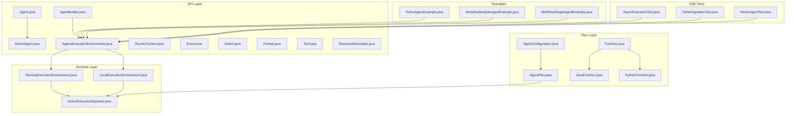
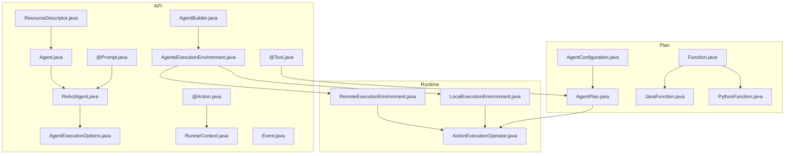
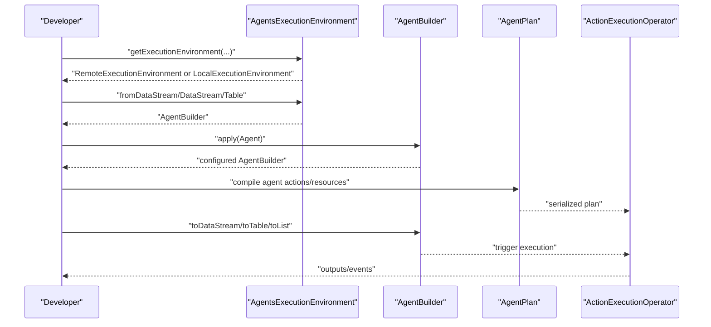
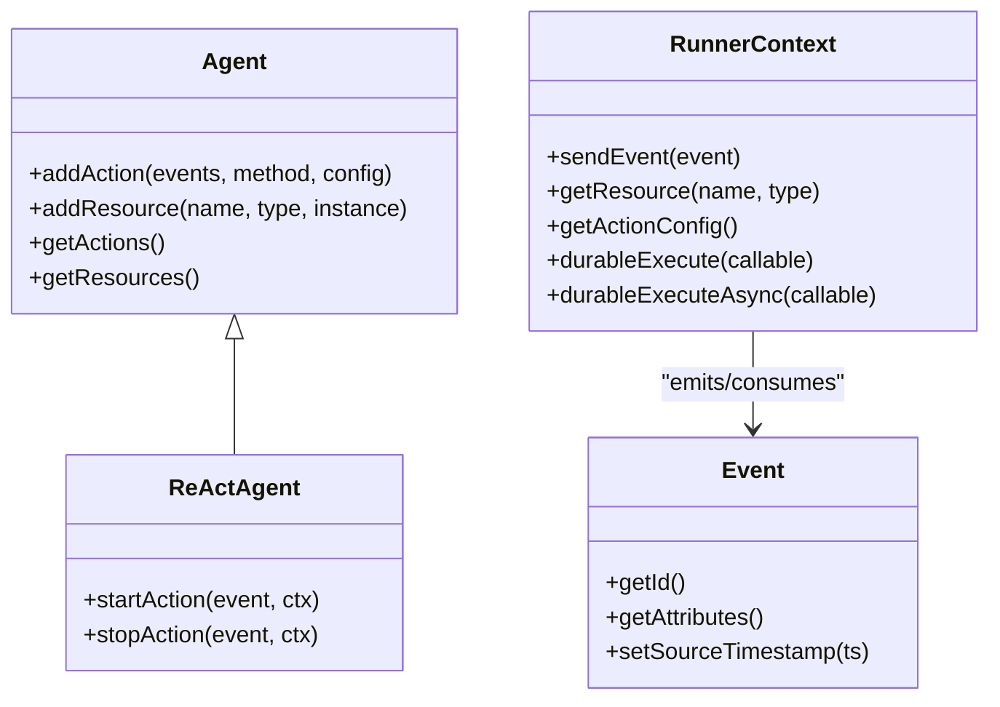
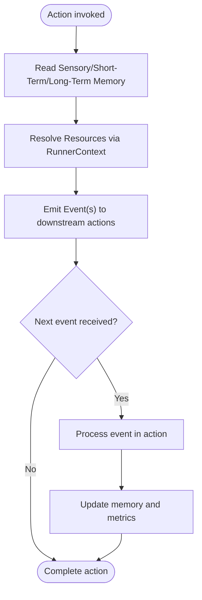
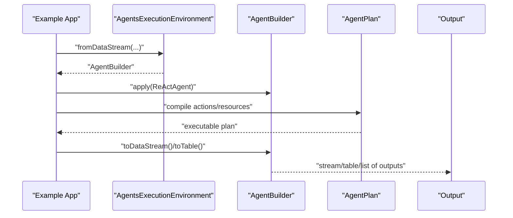
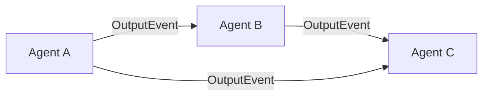
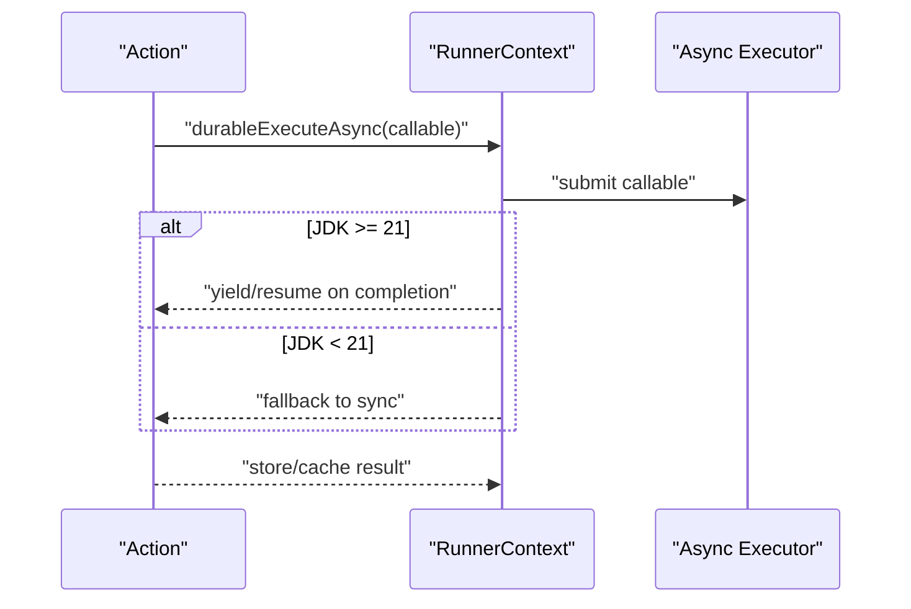
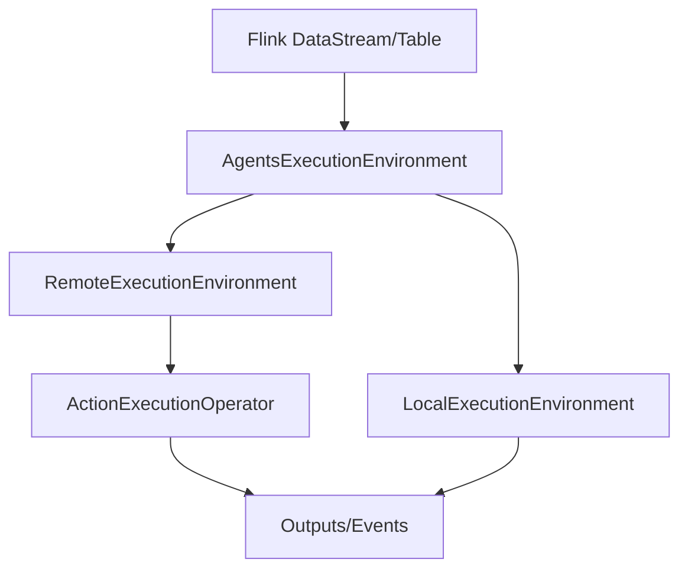
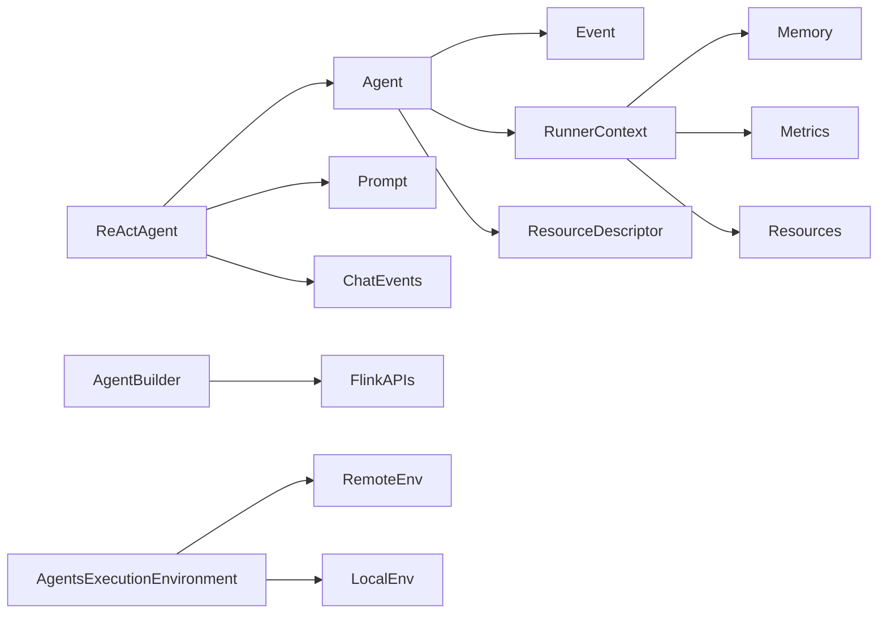

# Agent-Based Programming

<cite>
**Referenced Files in This Document**
- [Agent.java](file://api/src/main/java/org/apache/flink/agents/api/agents/Agent.java)
- [ReActAgent.java](file://api/src/main/java/org/apache/flink/agents/api/agents/ReActAgent.java)
- [AgentExecutionOptions.java](file://api/src/main/java/org/apache/flink/agents/api/agents/AgentExecutionOptions.java)
- [AgentBuilder.java](file://api/src/main/java/org/apache/flink/agents/api/AgentBuilder.java)
- [AgentsExecutionEnvironment.java](file://api/src/main/java/org/apache/flink/agents/api/AgentsExecutionEnvironment.java)
- [RunnerContext.java](file://api/src/main/java/org/apache/flink/agents/api/context/RunnerContext.java)
- [Event.java](file://api/src/main/java/org/apache/flink/agents/api/Event.java)
- [Action.java](file://api/src/main/java/org/apache/flink/agents/api/annotation/Action.java)
- [Prompt.java](file://api/src/main/java/org/apache/flink/agents/api/annotation/Prompt.java)
- [Tool.java](file://api/src/main/java/org/apache/flink/agents/api/annotation/Tool.java)
- [ResourceDescriptor.java](file://api/src/main/java/org/apache/flink/agents/api/resource/ResourceDescriptor.java)
- [ReActAgentExample.java](file://examples/src/main/java/org/apache/flink/agents/examples/ReActAgentExample.java)
- [WorkflowMultipleAgentExample.java](file://examples/src/main/java/org/apache/flink/agents/examples/WorkflowMultipleAgentExample.java)
- [WorkflowSingleAgentExample.java](file://examples/src/main/java/org/apache/flink/agents/examples/WorkflowSingleAgentExample.java)
- [AsyncExecutionAgent.java](file://e2e-test/flink-agents-end-to-end-tests-integration/src/test/java/org/apache/flink/agents/integration/test/AsyncExecutionAgent.java)
- [AsyncExecutionTest.java](file://e2e-test/flink-agents-end-to-end-tests-integration/src/test/java/org/apache/flink/agents/integration/test/AsyncExecutionTest.java)
- [FlinkIntegrationTest.java](file://e2e-test/flink-agents-end-to-end-tests-integration/src/test/java/org/apache/flink/agents/integration/test/FlinkIntegrationTest.java)
- [ReActAgentTest.java](file://e2e-test/flink-agents-end-to-end-tests-integration/src/test/java/org/apache/flink/agents/integration/test/ReActAgentTest.java)
- [RemoteExecutionEnvironment.java](file://runtime/src/main/java/org/apache/flink/agents/runtime/env/RemoteExecutionEnvironment.java)
- [LocalExecutionEnvironment.java](file://runtime/src/main/java/org/apache/flink/agents/runtime/env/LocalExecutionEnvironment.java)
- [ActionExecutionOperator.java](file://runtime/src/main/java/org/apache/flink/agents/runtime/operator/ActionExecutionOperator.java)
- [AgentPlan.java](file://plan/src/main/java/org/apache/flink/agents/plan/AgentPlan.java)
- [AgentConfiguration.java](file://plan/src/main/java/org/apache/flink/agents/plan/AgentConfiguration.java)
- [Function.java](file://plan/src/main/java/org/apache/flink/agents/plan/Function.java)
- [JavaFunction.java](file://plan/src/main/java/org/apache/flink/agents/plan/JavaFunction.java)
- [PythonFunction.java](file://plan/src/main/java/org/apache/flink/agents/plan/PythonFunction.java)
</cite>

## Table of Contents
1. [Introduction](#introduction)
2. [Project Structure](#project-structure)
3. [Core Components](#core-components)
4. [Architecture Overview](#architecture-overview)
5. [Detailed Component Analysis](#detailed-component-analysis)
6. [Dependency Analysis](#dependency-analysis)
7. [Performance Considerations](#performance-considerations)
8. [Troubleshooting Guide](#troubleshooting-guide)
9. [Conclusion](#conclusion)
10. [Appendices](#appendices)

## Introduction
This document explains agent-based programming in Flink Agents. It contrasts the agent paradigm with traditional programming models, documents the Agent interface and its built-in ReAct implementation, and describes the agent lifecycle from creation to execution. It also covers event processing, state management, resource binding, plan-based execution, agent composition, multi-agent workflows, asynchronous execution, and the relationship between agents and Flink operators for streaming real-time intelligence.

## Project Structure
At a high level, the project is organized into:
- api: Public API for agents, events, annotations, configuration, memory, tools, prompts, and execution environments
- plan: Plan generation and serialization for agents, including function wrappers and resource providers
- runtime: Execution environments (local and remote) and operators that execute agent plans on Flink
- examples: Usage examples for ReAct agents and multi-agent workflows
- e2e-test: End-to-end tests covering async execution, Flink integration, and ReAct agent behavior
- integrations: Optional connectors for chat models, embeddings, MCP, and vector stores
- python: Python-side API and runtime bridge for cross-language resource interoperability

**Diagram sources**
- [Agent.java](file://api/src/main/java/org/apache/flink/agents/api/agents/Agent.java#L34-L131)
- [ReActAgent.java](file://api/src/main/java/org/apache/flink/agents/api/agents/ReActAgent.java#L51-L183)
- [AgentBuilder.java](file://api/src/main/java/org/apache/flink/agents/api/AgentBuilder.java#L35-L77)
- [AgentsExecutionEnvironment.java](file://api/src/main/java/org/apache/flink/agents/api/AgentsExecutionEnvironment.java#L43-L223)
- [RunnerContext.java](file://api/src/main/java/org/apache/flink/agents/api/context/RunnerContext.java#L33-L138)
- [Event.java](file://api/src/main/java/org/apache/flink/agents/api/Event.java#L30-L90)
- [Action.java](file://api/src/main/java/org/apache/flink/agents/api/annotation/Action.java#L28-L54)
- [Prompt.java](file://api/src/main/java/org/apache/flink/agents/api/annotation/Prompt.java#L26-L35)
- [Tool.java](file://api/src/main/java/org/apache/flink/agents/api/annotation/Tool.java#L26-L43)
- [ResourceDescriptor.java](file://api/src/main/java/org/apache/flink/agents/api/resource/ResourceDescriptor.java#L28-L144)
- [AgentPlan.java](file://plan/src/main/java/org/apache/flink/agents/plan/AgentPlan.java)
- [AgentConfiguration.java](file://plan/src/main/java/org/apache/flink/agents/plan/AgentConfiguration.java)
- [Function.java](file://plan/src/main/java/org/apache/flink/agents/plan/Function.java)
- [JavaFunction.java](file://plan/src/main/java/org/apache/flink/agents/plan/JavaFunction.java)
- [PythonFunction.java](file://plan/src/main/java/org/apache/flink/agents/plan/PythonFunction.java)
- [RemoteExecutionEnvironment.java](file://runtime/src/main/java/org/apache/flink/agents/runtime/env/RemoteExecutionEnvironment.java)
- [LocalExecutionEnvironment.java](file://runtime/src/main/java/org/apache/flink/agents/runtime/env/LocalExecutionEnvironment.java)
- [ActionExecutionOperator.java](file://runtime/src/main/java/org/apache/flink/agents/runtime/operator/ActionExecutionOperator.java)
- [ReActAgentExample.java](file://examples/src/main/java/org/apache/flink/agents/examples/ReActAgentExample.java)
- [WorkflowMultipleAgentExample.java](file://examples/src/main/java/org/apache/flink/agents/examples/WorkflowMultipleAgentExample.java)
- [WorkflowSingleAgentExample.java](file://examples/src/main/java/org/apache/flink/agents/examples/WorkflowSingleAgentExample.java)
- [AsyncExecutionTest.java](file://e2e-test/flink-agents-end-to-end-tests-integration/src/test/java/org/apache/flink/agents/integration/test/AsyncExecutionTest.java)
- [FlinkIntegrationTest.java](file://e2e-test/flink-agents-end-to-end-tests-integration/src/test/java/org/apache/flink/agents/integration/test/FlinkIntegrationTest.java)
- [ReActAgentTest.java](file://e2e-test/flink-agents-end-to-end-tests-integration/src/test/java/org/apache/flink/agents/integration/test/ReActAgentTest.java)

**Section sources**
- [Agent.java](file://api/src/main/java/org/apache/flink/agents/api/agents/Agent.java#L34-L131)
- [AgentsExecutionEnvironment.java](file://api/src/main/java/org/apache/flink/agents/api/AgentsExecutionEnvironment.java#L43-L223)

## Core Components
- Agent: Base class defining actions and resources. Actions are static methods annotated to respond to specific event types. Resources are typed and registered via descriptors or serializable instances.
- ReActAgent: Built-in agent implementing the ReAct pattern. It binds a chat model, optional user and schema prompts, and emits structured outputs.
- RunnerContext: Provides access to memory, metrics, resources, configuration, and event emission during action execution. Supports synchronous and asynchronous durable execution.
- AgentBuilder: Fluent builder to configure agents and produce outputs as lists, DataStream, or Table.
- AgentsExecutionEnvironment: Factory and base for execution environments (local vs remote). Integrates with Flink DataStream/Table and manages resource registration.
- Annotations: @Action, @Prompt, @Tool define actions, prompt resources, and tool resources respectively.
- Events: Base Event class with attributes and optional source timestamps; specialized events model chat, tool calls, and retrieval.
- ResourceDescriptor: Describes cross-language resources (Java/Python) with class/module and initial arguments.

**Section sources**
- [Agent.java](file://api/src/main/java/org/apache/flink/agents/api/agents/Agent.java#L34-L131)
- [ReActAgent.java](file://api/src/main/java/org/apache/flink/agents/api/agents/ReActAgent.java#L51-L183)
- [RunnerContext.java](file://api/src/main/java/org/apache/flink/agents/api/context/RunnerContext.java#L33-L138)
- [AgentBuilder.java](file://api/src/main/java/org/apache/flink/agents/api/AgentBuilder.java#L35-L77)
- [AgentsExecutionEnvironment.java](file://api/src/main/java/org/apache/flink/agents/api/AgentsExecutionEnvironment.java#L43-L223)
- [Action.java](file://api/src/main/java/org/apache/flink/agents/api/annotation/Action.java#L28-L54)
- [Prompt.java](file://api/src/main/java/org/apache/flink/agents/api/annotation/Prompt.java#L26-L35)
- [Tool.java](file://api/src/main/java/org/apache/flink/agents/api/annotation/Tool.java#L26-L43)
- [Event.java](file://api/src/main/java/org/apache/flink/agents/api/Event.java#L30-L90)
- [ResourceDescriptor.java](file://api/src/main/java/org/apache/flink/agents/api/resource/ResourceDescriptor.java#L28-L144)

## Architecture Overview
The agent architecture separates concerns across API, plan, and runtime layers:
- API: Declares agents, actions, events, and execution environments
- Plan: Serializes agent logic and resources into an executable plan
- Runtime: Executes the plan on Flink via operators and environments

**Diagram sources**
- [Agent.java](file://api/src/main/java/org/apache/flink/agents/api/agents/Agent.java#L34-L131)
- [ReActAgent.java](file://api/src/main/java/org/apache/flink/agents/api/agents/ReActAgent.java#L51-L183)
- [AgentExecutionOptions.java](file://api/src/main/java/org/apache/flink/agents/api/agents/AgentExecutionOptions.java#L23-L48)
- [AgentBuilder.java](file://api/src/main/java/org/apache/flink/agents/api/AgentBuilder.java#L35-L77)
- [AgentsExecutionEnvironment.java](file://api/src/main/java/org/apache/flink/agents/api/AgentsExecutionEnvironment.java#L43-L223)
- [RunnerContext.java](file://api/src/main/java/org/apache/flink/agents/api/context/RunnerContext.java#L33-L138)
- [Event.java](file://api/src/main/java/org/apache/flink/agents/api/Event.java#L30-L90)
- [Action.java](file://api/src/main/java/org/apache/flink/agents/api/annotation/Action.java#L28-L54)
- [Prompt.java](file://api/src/main/java/org/apache/flink/agents/api/annotation/Prompt.java#L26-L35)
- [Tool.java](file://api/src/main/java/org/apache/flink/agents/api/annotation/Tool.java#L26-L43)
- [ResourceDescriptor.java](file://api/src/main/java/org/apache/flink/agents/api/resource/ResourceDescriptor.java#L28-L144)
- [AgentPlan.java](file://plan/src/main/java/org/apache/flink/agents/plan/AgentPlan.java)
- [AgentConfiguration.java](file://plan/src/main/java/org/apache/flink/agents/plan/AgentConfiguration.java)
- [Function.java](file://plan/src/main/java/org/apache/flink/agents/plan/Function.java)
- [JavaFunction.java](file://plan/src/main/java/org/apache/flink/agents/plan/JavaFunction.java)
- [PythonFunction.java](file://plan/src/main/java/org/apache/flink/agents/plan/PythonFunction.java)
- [RemoteExecutionEnvironment.java](file://runtime/src/main/java/org/apache/flink/agents/runtime/env/RemoteExecutionEnvironment.java)
- [LocalExecutionEnvironment.java](file://runtime/src/main/java/org/apache/flink/agents/runtime/env/LocalExecutionEnvironment.java)
- [ActionExecutionOperator.java](file://runtime/src/main/java/org/apache/flink/agents/runtime/operator/ActionExecutionOperator.java)

## Detailed Component Analysis

### Agent Lifecycle: Creation to Execution
- Creation
  - Define actions using @Action and register them via Agent.addAction
  - Bind resources with Agent.addResource or ResourceDescriptor
  - Optionally annotate fields with @Prompt and @Tool for plan-driven resource management
- Plan Compilation
  - AgentPlan serializes agent actions and resources into a portable plan
  - AgentConfiguration captures runtime options and bindings
- Resource Binding
  - AgentsExecutionEnvironment.addResource registers resources by type and name
  - RemoteExecutionEnvironment wires resources into the runtime
- Execution
  - AgentsExecutionEnvironment.fromList/fromDataStream/fromTable produce AgentBuilder
  - AgentBuilder.toList/toDataStream/toTable materialize outputs
  - ActionExecutionOperator executes actions on Flink operators with state and metrics

**Diagram sources**
- [AgentsExecutionEnvironment.java](file://api/src/main/java/org/apache/flink/agents/api/AgentsExecutionEnvironment.java#L68-L121)
- [AgentBuilder.java](file://api/src/main/java/org/apache/flink/agents/api/AgentBuilder.java#L35-L77)
- [AgentPlan.java](file://plan/src/main/java/org/apache/flink/agents/plan/AgentPlan.java)
- [ActionExecutionOperator.java](file://runtime/src/main/java/org/apache/flink/agents/runtime/operator/ActionExecutionOperator.java)
- [RemoteExecutionEnvironment.java](file://runtime/src/main/java/org/apache/flink/agents/runtime/env/RemoteExecutionEnvironment.java)

**Section sources**
- [Agent.java](file://api/src/main/java/org/apache/flink/agents/api/agents/Agent.java#L34-L131)
- [AgentsExecutionEnvironment.java](file://api/src/main/java/org/apache/flink/agents/api/AgentsExecutionEnvironment.java#L207-L221)
- [AgentBuilder.java](file://api/src/main/java/org/apache/flink/agents/api/AgentBuilder.java#L35-L77)
- [AgentPlan.java](file://plan/src/main/java/org/apache/flink/agents/plan/AgentPlan.java)
- [ActionExecutionOperator.java](file://runtime/src/main/java/org/apache/flink/agents/runtime/operator/ActionExecutionOperator.java)

### Agent Interface and ReAct Pattern
- Agent defines actions and resources. Each action is a static method annotated with @Action and listens to specific Event subclasses.
- ReActAgent binds a chat model resource and optional prompts. It emits a ChatRequestEvent in startAction and consumes ChatResponseEvent in stopAction to produce OutputEvent.
- Output schema can be enforced via JSON schema injection for structured outputs.

**Diagram sources**
- [Agent.java](file://api/src/main/java/org/apache/flink/agents/api/agents/Agent.java#L34-L131)
- [ReActAgent.java](file://api/src/main/java/org/apache/flink/agents/api/agents/ReActAgent.java#L51-L183)
- [RunnerContext.java](file://api/src/main/java/org/apache/flink/agents/api/context/RunnerContext.java#L33-L138)
- [Event.java](file://api/src/main/java/org/apache/flink/agents/api/Event.java#L30-L90)

**Section sources**
- [Agent.java](file://api/src/main/java/org/apache/flink/agents/api/agents/Agent.java#L34-L131)
- [ReActAgent.java](file://api/src/main/java/org/apache/flink/agents/api/agents/ReActAgent.java#L51-L183)
- [Action.java](file://api/src/main/java/org/apache/flink/agents/api/annotation/Action.java#L28-L54)

### Event Processing, State, and External Resources
- Events: Base Event carries metadata and optional source timestamps. Specialized events model chat, tool calls, and retrieval.
- State: RunnerContext exposes sensory, short-term, and long-term memory roots. Memory objects encapsulate stateful data for durable runs.
- Metrics: Access to shared and per-action metric groups for observability.
- Resources: RunnerContext.getResource(name, type) resolves registered resources. ResourceDescriptor enables cross-language resource provisioning.

**Diagram sources**
- [RunnerContext.java](file://api/src/main/java/org/apache/flink/agents/api/context/RunnerContext.java#L33-L138)
- [Event.java](file://api/src/main/java/org/apache/flink/agents/api/Event.java#L30-L90)
- [ResourceDescriptor.java](file://api/src/main/java/org/apache/flink/agents/api/resource/ResourceDescriptor.java#L28-L144)

**Section sources**
- [RunnerContext.java](file://api/src/main/java/org/apache/flink/agents/api/context/RunnerContext.java#L33-L138)
- [Event.java](file://api/src/main/java/org/apache/flink/agents/api/Event.java#L30-L90)
- [ResourceDescriptor.java](file://api/src/main/java/org/apache/flink/agents/api/resource/ResourceDescriptor.java#L28-L144)

### Practical Examples: AgentBuilder and Plan-Based Execution
- ReActAgentExample demonstrates constructing a ReAct agent, registering resources, and executing against a DataStream/Table or list.
- Workflow examples show multi-agent orchestration and single-agent pipelines.
- Plan-based execution is driven by AgentPlan and AgentConfiguration, enabling serialization and cross-language interoperability.

**Diagram sources**
- [ReActAgentExample.java](file://examples/src/main/java/org/apache/flink/agents/examples/ReActAgentExample.java)
- [WorkflowMultipleAgentExample.java](file://examples/src/main/java/org/apache/flink/agents/examples/WorkflowMultipleAgentExample.java)
- [WorkflowSingleAgentExample.java](file://examples/src/main/java/org/apache/flink/agents/examples/WorkflowSingleAgentExample.java)
- [AgentPlan.java](file://plan/src/main/java/org/apache/flink/agents/plan/AgentPlan.java)
- [AgentConfiguration.java](file://plan/src/main/java/org/apache/flink/agents/plan/AgentConfiguration.java)

**Section sources**
- [AgentBuilder.java](file://api/src/main/java/org/apache/flink/agents/api/AgentBuilder.java#L35-L77)
- [ReActAgentExample.java](file://examples/src/main/java/org/apache/flink/agents/examples/ReActAgentExample.java)
- [WorkflowMultipleAgentExample.java](file://examples/src/main/java/org/apache/flink/agents/examples/WorkflowMultipleAgentExample.java)
- [WorkflowSingleAgentExample.java](file://examples/src/main/java/org/apache/flink/agents/examples/WorkflowSingleAgentExample.java)

### Agent Composition Patterns and Multi-Agent Workflows
- Multi-agent workflows route outputs from one agent’s events to another’s inputs, forming pipelines.
- End-to-end tests demonstrate coordinated agent execution across streams and tables.

**Diagram sources**
- [WorkflowMultipleAgentExample.java](file://examples/src/main/java/org/apache/flink/agents/examples/WorkflowMultipleAgentExample.java)
- [WorkflowSingleAgentExample.java](file://examples/src/main/java/org/apache/flink/agents/examples/WorkflowSingleAgentExample.java)

**Section sources**
- [WorkflowMultipleAgentExample.java](file://examples/src/main/java/org/apache/flink/agents/examples/WorkflowMultipleAgentExample.java)
- [WorkflowSingleAgentExample.java](file://examples/src/main/java/org/apache/flink/agents/examples/WorkflowSingleAgentExample.java)

### Asynchronous Execution Model
- RunnerContext supports durableExecute and durableExecuteAsync for asynchronous, recoverable computation.
- AgentExecutionOptions exposes async toggles for chat, tool calls, and retrieval-augmented generation.
- E2E tests validate parallelism and high-load scenarios.

**Diagram sources**
- [RunnerContext.java](file://api/src/main/java/org/apache/flink/agents/api/context/RunnerContext.java#L113-L133)
- [AgentExecutionOptions.java](file://api/src/main/java/org/apache/flink/agents/api/agents/AgentExecutionOptions.java#L23-L48)
- [AsyncExecutionAgent.java](file://e2e-test/flink-agents-end-to-end-tests-integration/src/test/java/org/apache/flink/agents/integration/test/AsyncExecutionAgent.java)
- [AsyncExecutionTest.java](file://e2e-test/flink-agents-end-to-end-tests-integration/src/test/java/org/apache/flink/agents/integration/test/AsyncExecutionTest.java)

**Section sources**
- [RunnerContext.java](file://api/src/main/java/org/apache/flink/agents/api/context/RunnerContext.java#L113-L133)
- [AgentExecutionOptions.java](file://api/src/main/java/org/apache/flink/agents/api/agents/AgentExecutionOptions.java#L23-L48)
- [AsyncExecutionTest.java](file://e2e-test/flink-agents-end-to-end-tests-integration/src/test/java/org/apache/flink/agents/integration/test/AsyncExecutionTest.java)

### Relationship Between Agents and Flink Operators
- Agents integrate with Flink via AgentsExecutionEnvironment.fromDataStream/fromTable and produce DataStream/Table outputs.
- RemoteExecutionEnvironment bridges to Flink runtime and ActionExecutionOperator executes actions as streaming operators.
- LocalExecutionEnvironment supports local runs for development/testing.

**Diagram sources**
- [AgentsExecutionEnvironment.java](file://api/src/main/java/org/apache/flink/agents/api/AgentsExecutionEnvironment.java#L140-L189)
- [RemoteExecutionEnvironment.java](file://runtime/src/main/java/org/apache/flink/agents/runtime/env/RemoteExecutionEnvironment.java)
- [LocalExecutionEnvironment.java](file://runtime/src/main/java/org/apache/flink/agents/runtime/env/LocalExecutionEnvironment.java)
- [ActionExecutionOperator.java](file://runtime/src/main/java/org/apache/flink/agents/runtime/operator/ActionExecutionOperator.java)

**Section sources**
- [AgentsExecutionEnvironment.java](file://api/src/main/java/org/apache/flink/agents/api/AgentsExecutionEnvironment.java#L140-L189)
- [RemoteExecutionEnvironment.java](file://runtime/src/main/java/org/apache/flink/agents/runtime/env/RemoteExecutionEnvironment.java)
- [LocalExecutionEnvironment.java](file://runtime/src/main/java/org/apache/flink/agents/runtime/env/LocalExecutionEnvironment.java)
- [ActionExecutionOperator.java](file://runtime/src/main/java/org/apache/flink/agents/runtime/operator/ActionExecutionOperator.java)

## Dependency Analysis
- Coupling
  - Agent depends on Event, RunnerContext, and Resource types
  - ReActAgent depends on Prompt and Chat-related events
  - AgentBuilder depends on Flink DataStream/Table abstractions
  - AgentsExecutionEnvironment depends on Remote/Local environments and resource registries
- Cohesion
  - RunnerContext centralizes memory, metrics, and resource access
  - Annotations decouple resource discovery from agent logic
- External Dependencies
  - Flink Streaming/Table APIs
  - Jackson for JSON schema and serialization
  - SLF4J for logging

**Diagram sources**
- [Agent.java](file://api/src/main/java/org/apache/flink/agents/api/agents/Agent.java#L34-L131)
- [ReActAgent.java](file://api/src/main/java/org/apache/flink/agents/api/agents/ReActAgent.java#L51-L183)
- [AgentBuilder.java](file://api/src/main/java/org/apache/flink/agents/api/AgentBuilder.java#L35-L77)
- [AgentsExecutionEnvironment.java](file://api/src/main/java/org/apache/flink/agents/api/AgentsExecutionEnvironment.java#L43-L223)
- [RunnerContext.java](file://api/src/main/java/org/apache/flink/agents/api/context/RunnerContext.java#L33-L138)
- [ResourceDescriptor.java](file://api/src/main/java/org/apache/flink/agents/api/resource/ResourceDescriptor.java#L28-L144)

**Section sources**
- [Agent.java](file://api/src/main/java/org/apache/flink/agents/api/agents/Agent.java#L34-L131)
- [ReActAgent.java](file://api/src/main/java/org/apache/flink/agents/api/agents/ReActAgent.java#L51-L183)
- [AgentBuilder.java](file://api/src/main/java/org/apache/flink/agents/api/AgentBuilder.java#L35-L77)
- [AgentsExecutionEnvironment.java](file://api/src/main/java/org/apache/flink/agents/api/AgentsExecutionEnvironment.java#L43-L223)
- [RunnerContext.java](file://api/src/main/java/org/apache/flink/agents/api/context/RunnerContext.java#L33-L138)
- [ResourceDescriptor.java](file://api/src/main/java/org/apache/flink/agents/api/resource/ResourceDescriptor.java#L28-L144)

## Performance Considerations
- Asynchronous execution reduces blocking and improves throughput; tune async threads and strategies via AgentExecutionOptions
- Prefer keyed streams for stateful agents to enable efficient checkpointing and recovery
- Minimize heavy synchronous operations inside actions; use durableExecuteAsync for IO-bound tasks
- Use structured outputs to reduce parsing overhead and improve downstream processing

[No sources needed since this section provides general guidance]

## Troubleshooting Guide
- Resource conflicts: Adding duplicate resource names/type raises an error; ensure unique names
- Unsupported resource types: Only SerializableResource or ResourceDescriptor are accepted
- Missing prompts for complex inputs: ReActAgent requires a user prompt for non-primitive inputs
- Async execution fallback: On JDK < 21, durableExecuteAsync falls back to synchronous behavior
- End-to-end validation: Use provided tests to verify integration with Flink and ReAct agent behavior

**Section sources**
- [AgentsExecutionEnvironment.java](file://api/src/main/java/org/apache/flink/agents/api/AgentsExecutionEnvironment.java#L207-L221)
- [ReActAgent.java](file://api/src/main/java/org/apache/flink/agents/api/agents/ReActAgent.java#L123-L129)
- [RunnerContext.java](file://api/src/main/java/org/apache/flink/agents/api/context/RunnerContext.java#L113-L133)
- [ReActAgentTest.java](file://e2e-test/flink-agents-end-to-end-tests-integration/src/test/java/org/apache/flink/agents/integration/test/ReActAgentTest.java)
- [FlinkIntegrationTest.java](file://e2e-test/flink-agents-end-to-end-tests-integration/src/test/java/org/apache/flink/agents/integration/test/FlinkIntegrationTest.java)
- [AsyncExecutionTest.java](file://e2e-test/flink-agents-end-to-end-tests-integration/src/test/java/org/apache/flink/agents/integration/test/AsyncExecutionTest.java)

## Conclusion
Flink Agents introduces a powerful agent-based paradigm built on Flink’s streaming model. Agents declare actions and resources, plan-based execution ensures portability and cross-language interoperability, and runtime environments integrate seamlessly with DataStream/Table APIs. With robust state, metrics, and asynchronous execution, agents deliver real-time intelligence across diverse workflows.

[No sources needed since this section summarizes without analyzing specific files]

## Appendices
- Quick references
  - Agent lifecycle: Creation → Plan compilation → Resource binding → Execution
  - Outputs: toList, toDataStream, toTable
  - Annotations: @Action, @Prompt, @Tool
  - Execution modes: Local vs Remote, async vs sync

[No sources needed since this section provides general guidance]