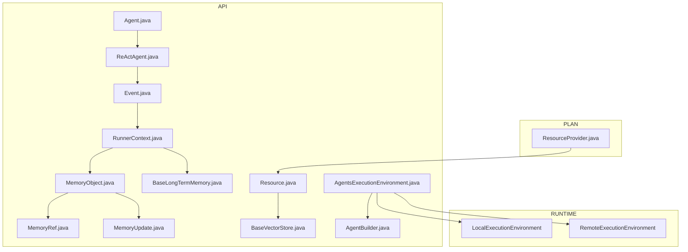
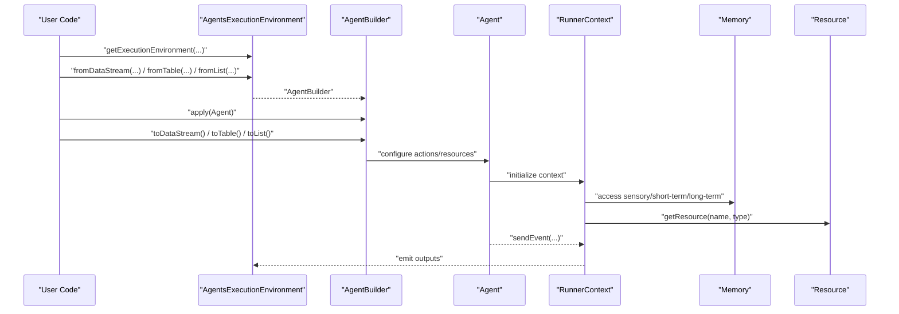
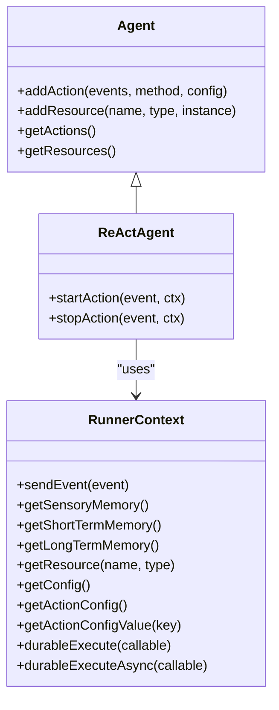
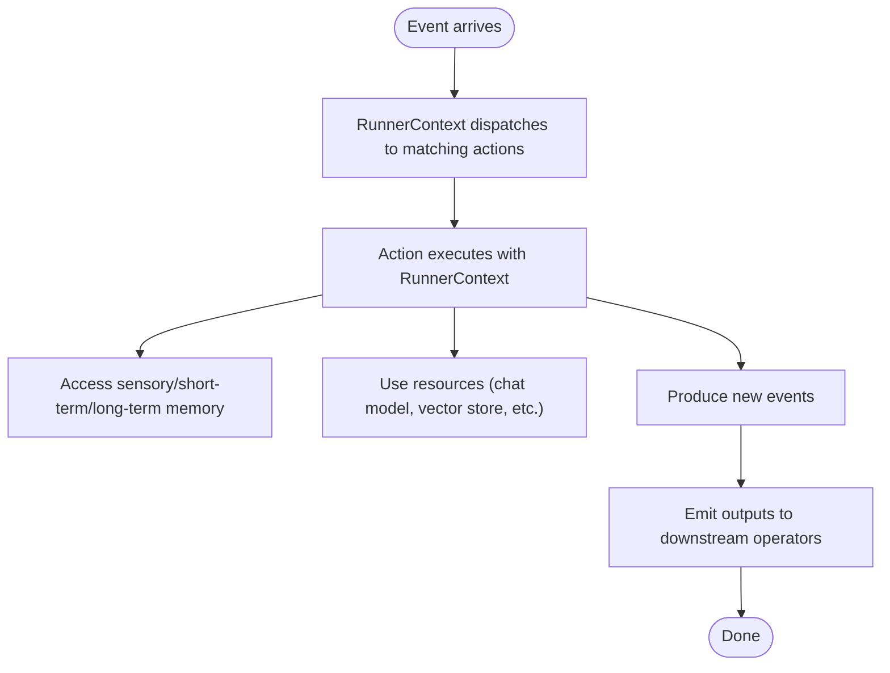
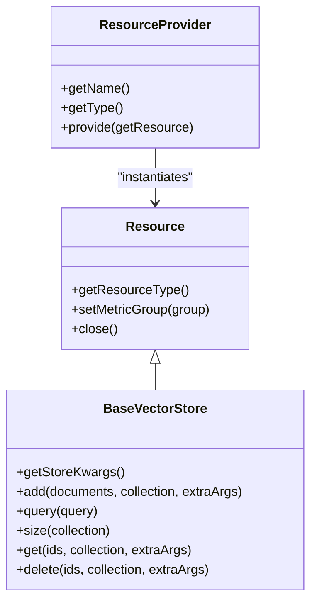
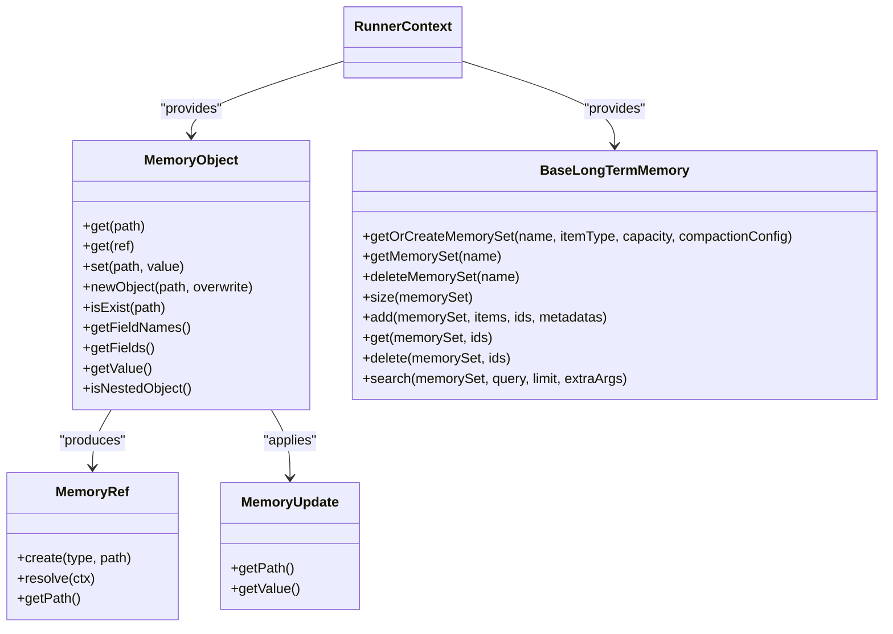
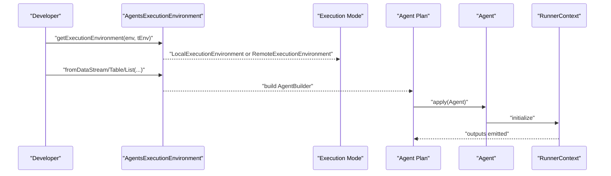
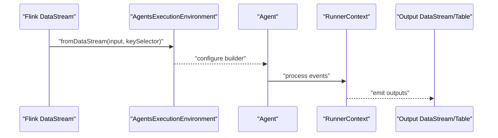
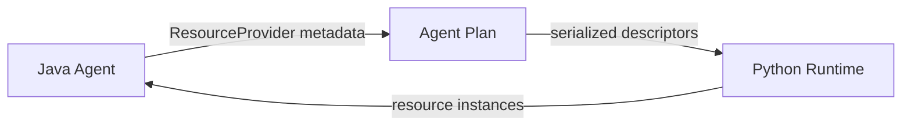
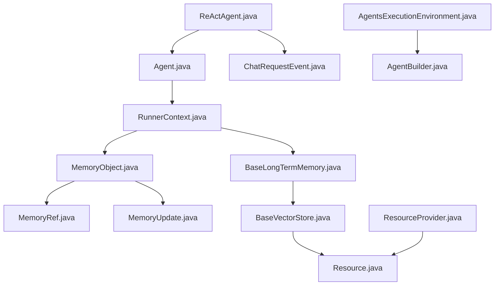

# Core Concepts

<cite>
**Referenced Files in This Document**
- [Agent.java](file://api/src/main/java/org/apache/flink/agents/api/agents/Agent.java)
- [ReActAgent.java](file://api/src/main/java/org/apache/flink/agents/api/agents/ReActAgent.java)
- [AgentBuilder.java](file://api/src/main/java/org/apache/flink/agents/api/AgentBuilder.java)
- [AgentsExecutionEnvironment.java](file://api/src/main/java/org/apache/flink/agents/api/AgentsExecutionEnvironment.java)
- [Event.java](file://api/src/main/java/org/apache/flink/agents/api/Event.java)
- [ChatRequestEvent.java](file://api/src/main/java/org/apache/flink/agents/api/event/ChatRequestEvent.java)
- [RunnerContext.java](file://api/src/main/java/org/apache/flink/agents/api/context/RunnerContext.java)
- [MemoryObject.java](file://api/src/main/java/org/apache/flink/agents/api/context/MemoryObject.java)
- [MemoryRef.java](file://api/src/main/java/org/apache/flink/agents/api/context/MemoryRef.java)
- [MemoryUpdate.java](file://api/src/main/java/org/apache/flink/agents/api/context/MemoryUpdate.java)
- [BaseLongTermMemory.java](file://api/src/main/java/org/apache/flink/agents/api/memory/BaseLongTermMemory.java)
- [BaseVectorStore.java](file://api/src/main/java/org/apache/flink/agents/api/vectorstores/BaseVectorStore.java)
- [Resource.java](file://api/src/main/java/org/apache/flink/agents/api/resource/Resource.java)
- [ResourceProvider.java](file://plan/src/main/java/org/apache/flink/agents/plan/resourceprovider/ResourceProvider.java)
</cite>

## Table of Contents
1. [Introduction](#introduction)
2. [Project Structure](#project-structure)
3. [Core Components](#core-components)
4. [Architecture Overview](#architecture-overview)
5. [Detailed Component Analysis](#detailed-component-analysis)
6. [Dependency Analysis](#dependency-analysis)
7. [Performance Considerations](#performance-considerations)
8. [Troubleshooting Guide](#troubleshooting-guide)
9. [Conclusion](#conclusion)

## Introduction
This document explains the core concepts of Flink Agents with a focus on architectural patterns and runtime mechanics:
- Agent-based programming: agents encapsulate behavior as actions that react to events.
- Event-driven architecture: the system is built around typed events and asynchronous processing.
- Resource provider pattern: resources (chat models, prompts, vector stores) are declared and instantiated via providers.
- Memory hierarchy: sensory memory, short-term memory, and long-term memory backed by vector stores.
- Execution environment and plan compilation: agents are integrated into Flink streams and executed remotely or locally.
- Cross-language integration: Java and Python resources and execution environments communicate seamlessly.

## Project Structure
Flink Agents is organized into modules that separate API contracts, plan serialization, runtime execution, integrations, and Python bindings. The core API defines agents, events, memory, resources, and execution environments. The plan module serializes agent configurations and resource providers. The runtime bridges Java and Python execution.

**Diagram sources**
- [Agent.java](file://api/src/main/java/org/apache/flink/agents/api/agents/Agent.java#L34-L131)
- [ReActAgent.java](file://api/src/main/java/org/apache/flink/agents/api/agents/ReActAgent.java#L51-L183)
- [Event.java](file://api/src/main/java/org/apache/flink/agents/api/Event.java#L30-L90)
- [RunnerContext.java](file://api/src/main/java/org/apache/flink/agents/api/context/RunnerContext.java#L33-L138)
- [MemoryObject.java](file://api/src/main/java/org/apache/flink/agents/api/context/MemoryObject.java#L29-L132)
- [MemoryRef.java](file://api/src/main/java/org/apache/flink/agents/api/context/MemoryRef.java#L28-L88)
- [MemoryUpdate.java](file://api/src/main/java/org/apache/flink/agents/api/context/MemoryUpdate.java#L30-L84)
- [BaseLongTermMemory.java](file://api/src/main/java/org/apache/flink/agents/api/memory/BaseLongTermMemory.java#L33-L134)
- [BaseVectorStore.java](file://api/src/main/java/org/apache/flink/agents/api/vectorstores/BaseVectorStore.java#L38-L174)
- [Resource.java](file://api/src/main/java/org/apache/flink/agents/api/resource/Resource.java#L30-L71)
- [AgentsExecutionEnvironment.java](file://api/src/main/java/org/apache/flink/agents/api/AgentsExecutionEnvironment.java#L43-L223)
- [AgentBuilder.java](file://api/src/main/java/org/apache/flink/agents/api/AgentBuilder.java#L35-L77)
- [ResourceProvider.java](file://plan/src/main/java/org/apache/flink/agents/plan/resourceprovider/ResourceProvider.java#L38-L76)

**Section sources**
- [Agent.java](file://api/src/main/java/org/apache/flink/agents/api/agents/Agent.java#L34-L131)
- [AgentsExecutionEnvironment.java](file://api/src/main/java/org/apache/flink/agents/api/AgentsExecutionEnvironment.java#L43-L223)

## Core Components
- Agent: Encapsulates actions and resources. Actions are methods annotated to listen to specific events and optionally carry per-action configuration.
- ReActAgent: A built-in agent that orchestrates reasoning and acting via chat models and structured outputs.
- Events: Typed event abstractions enabling decoupled communication between actions.
- RunnerContext: Provides access to memory, resources, configuration, metrics, and durable execution helpers.
- Memory: Sensory memory (temporary), short-term memory (structured state), and long-term memory (persistent via vector stores).
- Resources: Pluggable components (chat models, prompts, vector stores) with lifecycle and metrics.
- Execution Environment: Bridges local and Flink remote execution, exposing builder APIs to produce DataStream/Table outputs.

**Section sources**
- [Agent.java](file://api/src/main/java/org/apache/flink/agents/api/agents/Agent.java#L34-L131)
- [ReActAgent.java](file://api/src/main/java/org/apache/flink/agents/api/agents/ReActAgent.java#L51-L183)
- [Event.java](file://api/src/main/java/org/apache/flink/agents/api/Event.java#L30-L90)
- [RunnerContext.java](file://api/src/main/java/org/apache/flink/agents/api/context/RunnerContext.java#L33-L138)
- [MemoryObject.java](file://api/src/main/java/org/apache/flink/agents/api/context/MemoryObject.java#L29-L132)
- [MemoryRef.java](file://api/src/main/java/org/apache/flink/agents/api/context/MemoryRef.java#L28-L88)
- [MemoryUpdate.java](file://api/src/main/java/org/apache/flink/agents/api/context/MemoryUpdate.java#L30-L84)
- [BaseLongTermMemory.java](file://api/src/main/java/org/apache/flink/agents/api/memory/BaseLongTermMemory.java#L33-L134)
- [BaseVectorStore.java](file://api/src/main/java/org/apache/flink/agents/api/vectorstores/BaseVectorStore.java#L38-L174)
- [Resource.java](file://api/src/main/java/org/apache/flink/agents/api/resource/Resource.java#L30-L71)
- [AgentsExecutionEnvironment.java](file://api/src/main/java/org/apache/flink/agents/api/AgentsExecutionEnvironment.java#L43-L223)
- [AgentBuilder.java](file://api/src/main/java/org/apache/flink/agents/api/AgentBuilder.java#L35-L77)

## Architecture Overview
Flink Agents adopts an agent-centric, event-driven design with a resource provider pattern and a layered memory system. Agents declare actions and resources; the runtime resolves resources, manages memory, and routes events. Execution environments integrate with Flink DataStream/Table APIs for scalable, stateful processing.

**Diagram sources**
- [AgentsExecutionEnvironment.java](file://api/src/main/java/org/apache/flink/agents/api/AgentsExecutionEnvironment.java#L68-L121)
- [AgentBuilder.java](file://api/src/main/java/org/apache/flink/agents/api/AgentBuilder.java#L35-L77)
- [Agent.java](file://api/src/main/java/org/apache/flink/agents/api/agents/Agent.java#L34-L131)
- [RunnerContext.java](file://api/src/main/java/org/apache/flink/agents/api/context/RunnerContext.java#L33-L138)
- [MemoryObject.java](file://api/src/main/java/org/apache/flink/agents/api/context/MemoryObject.java#L29-L132)
- [Resource.java](file://api/src/main/java/org/apache/flink/agents/api/resource/Resource.java#L30-L71)

## Detailed Component Analysis

### Agent-Based Programming
Agents define behavior as actions that listen to specific event types. Actions can carry per-action configuration and interact with resources and memory via RunnerContext.

**Diagram sources**
- [Agent.java](file://api/src/main/java/org/apache/flink/agents/api/agents/Agent.java#L34-L131)
- [ReActAgent.java](file://api/src/main/java/org/apache/flink/agents/api/agents/ReActAgent.java#L51-L183)
- [RunnerContext.java](file://api/src/main/java/org/apache/flink/agents/api/context/RunnerContext.java#L33-L138)

**Section sources**
- [Agent.java](file://api/src/main/java/org/apache/flink/agents/api/agents/Agent.java#L34-L131)
- [ReActAgent.java](file://api/src/main/java/org/apache/flink/agents/api/agents/ReActAgent.java#L51-L183)
- [RunnerContext.java](file://api/src/main/java/org/apache/flink/agents/api/context/RunnerContext.java#L33-L138)

### Event-Driven Architecture
Events are typed abstractions carrying identifiers and attributes. Actions consume events and produce new events asynchronously. The system supports durable execution to ensure correctness across restarts.

**Diagram sources**
- [Event.java](file://api/src/main/java/org/apache/flink/agents/api/Event.java#L30-L90)
- [RunnerContext.java](file://api/src/main/java/org/apache/flink/agents/api/context/RunnerContext.java#L33-L138)

**Section sources**
- [Event.java](file://api/src/main/java/org/apache/flink/agents/api/Event.java#L30-L90)
- [RunnerContext.java](file://api/src/main/java/org/apache/flink/agents/api/context/RunnerContext.java#L33-L138)

### Resource Provider Pattern
Resources are pluggable components (e.g., chat models, prompts, vector stores). Resource providers carry metadata to instantiate resources at runtime. The plan module serializes and deserializes providers for agent configuration.

**Diagram sources**
- [Resource.java](file://api/src/main/java/org/apache/flink/agents/api/resource/Resource.java#L30-L71)
- [BaseVectorStore.java](file://api/src/main/java/org/apache/flink/agents/api/vectorstores/BaseVectorStore.java#L38-L174)
- [ResourceProvider.java](file://plan/src/main/java/org/apache/flink/agents/plan/resourceprovider/ResourceProvider.java#L38-L76)

**Section sources**
- [Resource.java](file://api/src/main/java/org/apache/flink/agents/api/resource/Resource.java#L30-L71)
- [BaseVectorStore.java](file://api/src/main/java/org/apache/flink/agents/api/vectorstores/BaseVectorStore.java#L38-L174)
- [ResourceProvider.java](file://plan/src/main/java/org/apache/flink/agents/plan/resourceprovider/ResourceProvider.java#L38-L76)

### Memory Hierarchy System
The memory system separates concerns:
- Sensory memory: temporary, cleared after each run.
- Short-term memory: structured state with path-based access, references, and updates.
- Long-term memory: persistent storage backed by vector stores, supporting semantic search and compaction.

**Diagram sources**
- [MemoryObject.java](file://api/src/main/java/org/apache/flink/agents/api/context/MemoryObject.java#L29-L132)
- [MemoryRef.java](file://api/src/main/java/org/apache/flink/agents/api/context/MemoryRef.java#L28-L88)
- [MemoryUpdate.java](file://api/src/main/java/org/apache/flink/agents/api/context/MemoryUpdate.java#L30-L84)
- [BaseLongTermMemory.java](file://api/src/main/java/org/apache/flink/agents/api/memory/BaseLongTermMemory.java#L33-L134)
- [RunnerContext.java](file://api/src/main/java/org/apache/flink/agents/api/context/RunnerContext.java#L33-L138)

**Section sources**
- [MemoryObject.java](file://api/src/main/java/org/apache/flink/agents/api/context/MemoryObject.java#L29-L132)
- [MemoryRef.java](file://api/src/main/java/org/apache/flink/agents/api/context/MemoryRef.java#L28-L88)
- [MemoryUpdate.java](file://api/src/main/java/org/apache/flink/agents/api/context/MemoryUpdate.java#L30-L84)
- [BaseLongTermMemory.java](file://api/src/main/java/org/apache/flink/agents/api/memory/BaseLongTermMemory.java#L33-L134)
- [RunnerContext.java](file://api/src/main/java/org/apache/flink/agents/api/context/RunnerContext.java#L33-L138)

### Agent Lifecycle, Execution Environment, and Plan Compilation
- Lifecycle: An agent is configured with actions and resources, then executed within an environment. Actions receive events, mutate memory, and emit outputs.
- Execution environment: Supports local and remote (Flink) modes. Remote mode integrates with DataStream/Table APIs and keying for stateful processing.
- Plan compilation: Resource providers and agent configuration are serialized/deserialized to form the execution plan.

**Diagram sources**
- [AgentsExecutionEnvironment.java](file://api/src/main/java/org/apache/flink/agents/api/AgentsExecutionEnvironment.java#L68-L121)
- [AgentBuilder.java](file://api/src/main/java/org/apache/flink/agents/api/AgentBuilder.java#L35-L77)
- [Agent.java](file://api/src/main/java/org/apache/flink/agents/api/agents/Agent.java#L34-L131)
- [RunnerContext.java](file://api/src/main/java/org/apache/flink/agents/api/context/RunnerContext.java#L33-L138)

**Section sources**
- [AgentsExecutionEnvironment.java](file://api/src/main/java/org/apache/flink/agents/api/AgentsExecutionEnvironment.java#L68-L121)
- [AgentBuilder.java](file://api/src/main/java/org/apache/flink/agents/api/AgentBuilder.java#L35-L77)
- [Agent.java](file://api/src/main/java/org/apache/flink/agents/api/agents/Agent.java#L34-L131)
- [RunnerContext.java](file://api/src/main/java/org/apache/flink/agents/api/context/RunnerContext.java#L33-L138)

### Event Processing Model and Flink Streaming Interaction
Agents process events in a streaming context. Inputs can come from DataStream or Table APIs, optionally keyed for stateful operations. Outputs are emitted as DataStream or Table.

**Diagram sources**
- [AgentsExecutionEnvironment.java](file://api/src/main/java/org/apache/flink/agents/api/AgentsExecutionEnvironment.java#L154-L189)
- [AgentBuilder.java](file://api/src/main/java/org/apache/flink/agents/api/AgentBuilder.java#L54-L75)
- [RunnerContext.java](file://api/src/main/java/org/apache/flink/agents/api/context/RunnerContext.java#L33-L138)

**Section sources**
- [AgentsExecutionEnvironment.java](file://api/src/main/java/org/apache/flink/agents/api/AgentsExecutionEnvironment.java#L154-L189)
- [AgentBuilder.java](file://api/src/main/java/org/apache/flink/agents/api/AgentBuilder.java#L54-L75)
- [RunnerContext.java](file://api/src/main/java/org/apache/flink/agents/api/context/RunnerContext.java#L33-L138)

### Cross-Language Execution Environments and Communication
- Java and Python resources are supported. Resource providers serialize metadata to enable cross-language instantiation.
- Vector stores and embedding models can be provided by Python implementations, bridged via the plan and runtime layers.

**Diagram sources**
- [ResourceProvider.java](file://plan/src/main/java/org/apache/flink/agents/plan/resourceprovider/ResourceProvider.java#L38-L76)
- [BaseVectorStore.java](file://api/src/main/java/org/apache/flink/agents/api/vectorstores/BaseVectorStore.java#L38-L174)
- [Resource.java](file://api/src/main/java/org/apache/flink/agents/api/resource/Resource.java#L30-L71)

**Section sources**
- [ResourceProvider.java](file://plan/src/main/java/org/apache/flink/agents/plan/resourceprovider/ResourceProvider.java#L38-L76)
- [BaseVectorStore.java](file://api/src/main/java/org/apache/flink/agents/api/vectorstores/BaseVectorStore.java#L38-L174)
- [Resource.java](file://api/src/main/java/org/apache/flink/agents/api/resource/Resource.java#L30-L71)

## Dependency Analysis
The following diagram highlights key dependencies among core components:

**Diagram sources**
- [Agent.java](file://api/src/main/java/org/apache/flink/agents/api/agents/Agent.java#L34-L131)
- [ReActAgent.java](file://api/src/main/java/org/apache/flink/agents/api/agents/ReActAgent.java#L51-L183)
- [ChatRequestEvent.java](file://api/src/main/java/org/apache/flink/agents/api/event/ChatRequestEvent.java#L29-L58)
- [RunnerContext.java](file://api/src/main/java/org/apache/flink/agents/api/context/RunnerContext.java#L33-L138)
- [MemoryObject.java](file://api/src/main/java/org/apache/flink/agents/api/context/MemoryObject.java#L29-L132)
- [MemoryRef.java](file://api/src/main/java/org/apache/flink/agents/api/context/MemoryRef.java#L28-L88)
- [MemoryUpdate.java](file://api/src/main/java/org/apache/flink/agents/api/context/MemoryUpdate.java#L30-L84)
- [BaseLongTermMemory.java](file://api/src/main/java/org/apache/flink/agents/api/memory/BaseLongTermMemory.java#L33-L134)
- [BaseVectorStore.java](file://api/src/main/java/org/apache/flink/agents/api/vectorstores/BaseVectorStore.java#L38-L174)
- [Resource.java](file://api/src/main/java/org/apache/flink/agents/api/resource/Resource.java#L30-L71)
- [AgentsExecutionEnvironment.java](file://api/src/main/java/org/apache/flink/agents/api/AgentsExecutionEnvironment.java#L43-L223)
- [AgentBuilder.java](file://api/src/main/java/org/apache/flink/agents/api/AgentBuilder.java#L35-L77)
- [ResourceProvider.java](file://plan/src/main/java/org/apache/flink/agents/plan/resourceprovider/ResourceProvider.java#L38-L76)

**Section sources**
- [Agent.java](file://api/src/main/java/org/apache/flink/agents/api/agents/Agent.java#L34-L131)
- [ReActAgent.java](file://api/src/main/java/org/apache/flink/agents/api/agents/ReActAgent.java#L51-L183)
- [RunnerContext.java](file://api/src/main/java/org/apache/flink/agents/api/context/RunnerContext.java#L33-L138)
- [MemoryObject.java](file://api/src/main/java/org/apache/flink/agents/api/context/MemoryObject.java#L29-L132)
- [MemoryRef.java](file://api/src/main/java/org/apache/flink/agents/api/context/MemoryRef.java#L28-L88)
- [MemoryUpdate.java](file://api/src/main/java/org/apache/flink/agents/api/context/MemoryUpdate.java#L30-L84)
- [BaseLongTermMemory.java](file://api/src/main/java/org/apache/flink/agents/api/memory/BaseLongTermMemory.java#L33-L134)
- [BaseVectorStore.java](file://api/src/main/java/org/apache/flink/agents/api/vectorstores/BaseVectorStore.java#L38-L174)
- [Resource.java](file://api/src/main/java/org/apache/flink/agents/api/resource/Resource.java#L30-L71)
- [AgentsExecutionEnvironment.java](file://api/src/main/java/org/apache/flink/agents/api/AgentsExecutionEnvironment.java#L43-L223)
- [AgentBuilder.java](file://api/src/main/java/org/apache/flink/agents/api/AgentBuilder.java#L35-L77)
- [ResourceProvider.java](file://plan/src/main/java/org/apache/flink/agents/plan/resourceprovider/ResourceProvider.java#L38-L76)

## Performance Considerations
- Use keying in DataStream/Table inputs to enable stateful operations and efficient checkpointing.
- Prefer compact memory sets and controlled compaction policies for long-term memory to balance retrieval quality and storage cost.
- Minimize large object transfers by storing only references (MemoryRef) in actions and resolving lazily.
- Batch embedding and vector store operations to reduce overhead.
- Monitor resource metrics via the bound metric groups for latency and throughput tuning.

## Troubleshooting Guide
- Resource conflicts: Adding a resource with an existing name/type will raise an error. Ensure unique names per type.
- Unsupported resource types: Only serializable resources or resource descriptors are accepted.
- Unknown memory type: Resolving a MemoryRef with an unsupported type raises an error.
- Action configuration: Use getActionConfig and getActionConfigValue to access per-action configuration safely.
- Durable execution: Avoid memory and event operations inside durable callables; they run synchronously and are cached on recovery.

**Section sources**
- [Agent.java](file://api/src/main/java/org/apache/flink/agents/api/agents/Agent.java#L97-L111)
- [MemoryRef.java](file://api/src/main/java/org/apache/flink/agents/api/context/MemoryRef.java#L56-L64)
- [RunnerContext.java](file://api/src/main/java/org/apache/flink/agents/api/context/RunnerContext.java#L109-L133)

## Conclusion
Flink Agents provides a cohesive framework for building intelligent, event-driven agents that operate over streaming data. Its agent-based programming model, event-driven architecture, and resource provider pattern enable flexible composition of AI capabilities. The layered memory system and execution environment integrate seamlessly with Flink, while cross-language support broadens the ecosystem of available resources.