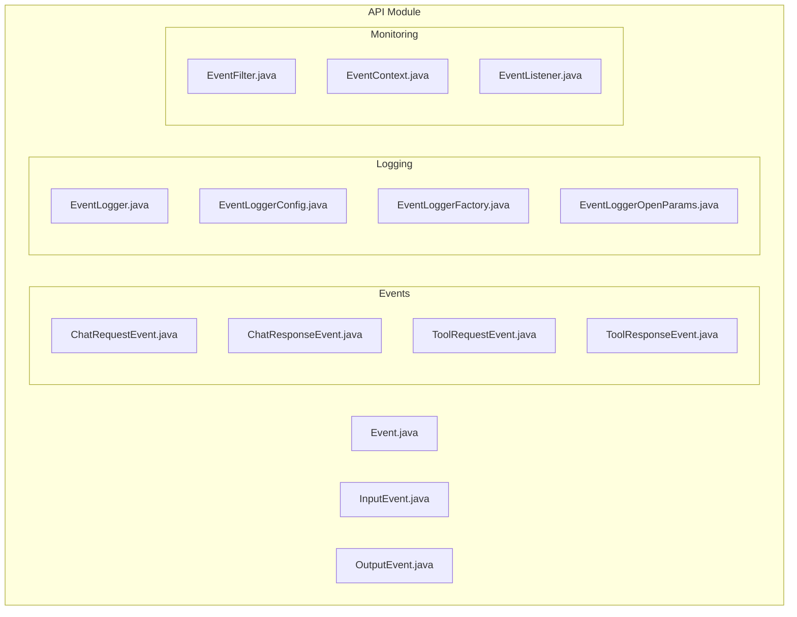
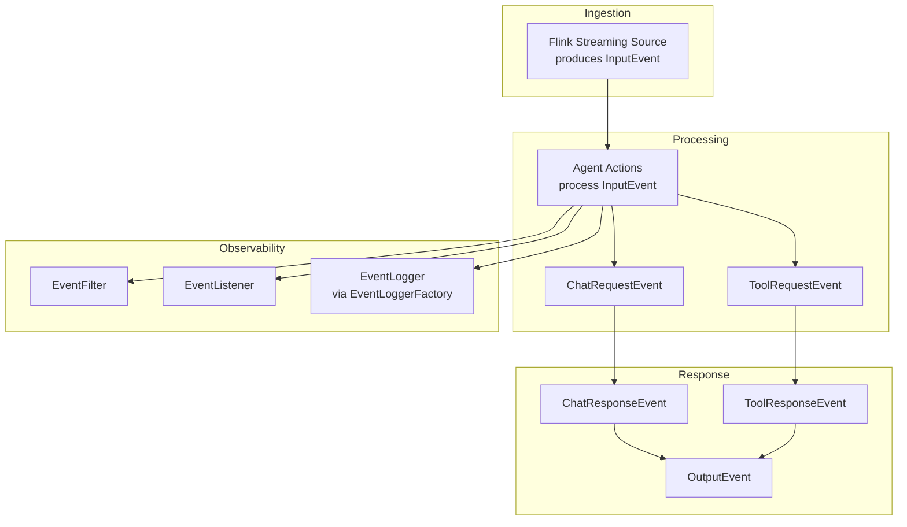
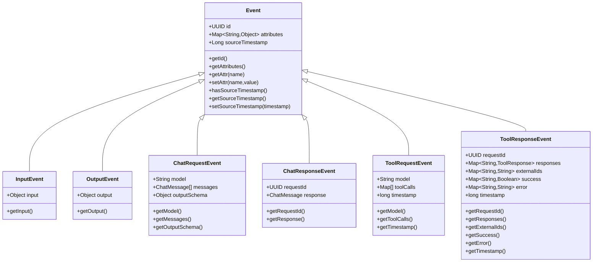
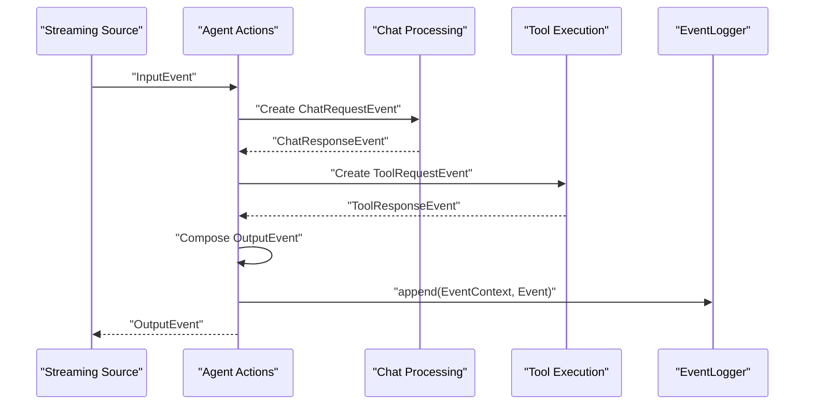
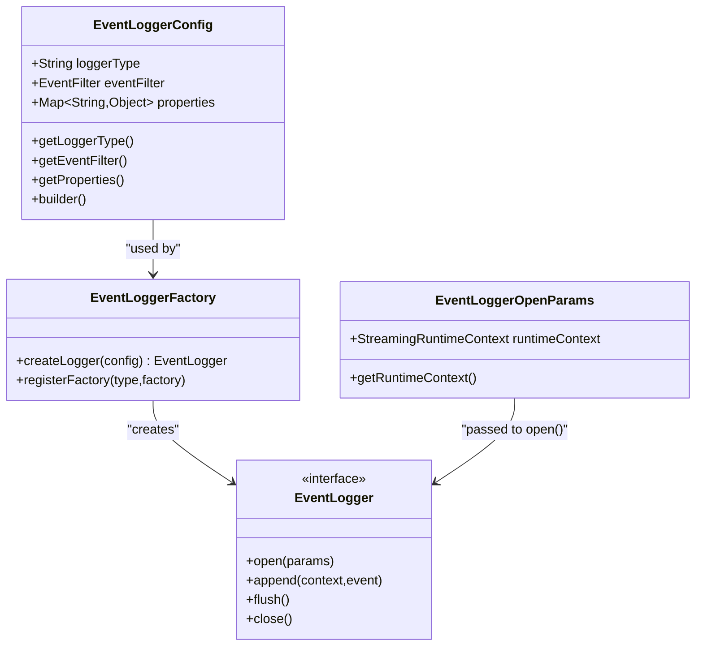
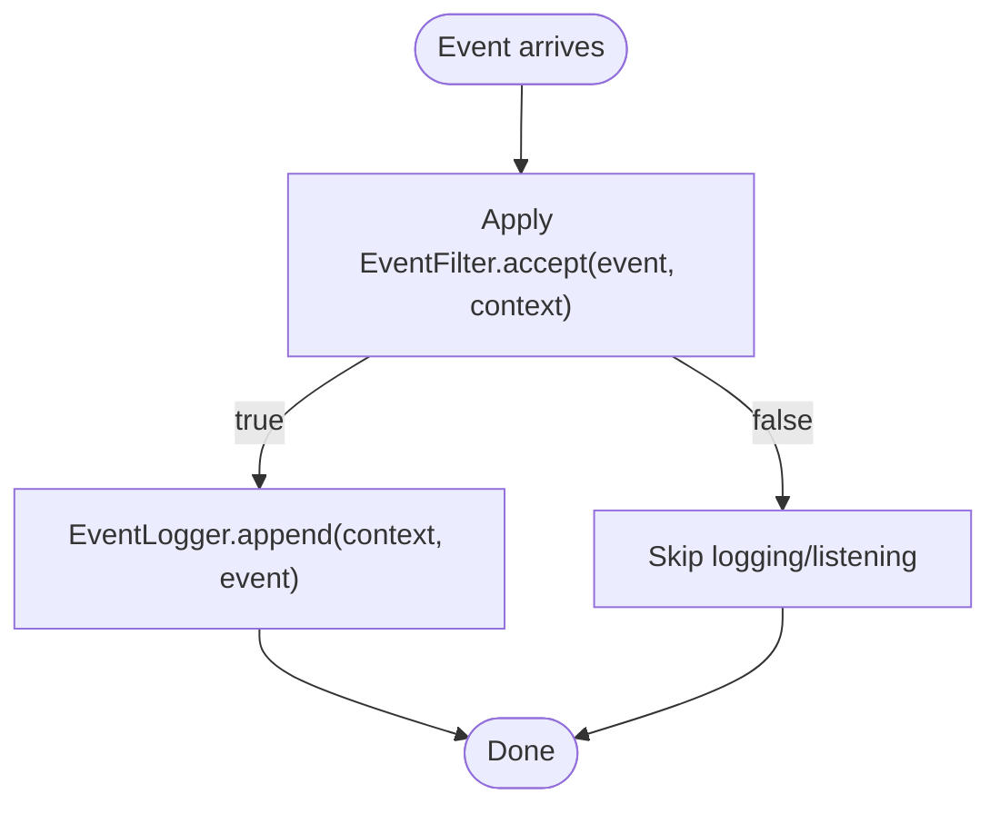
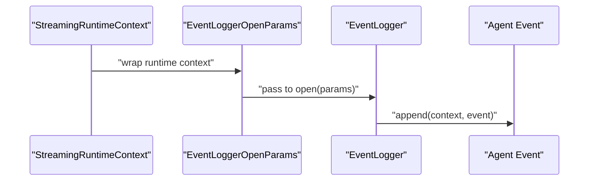
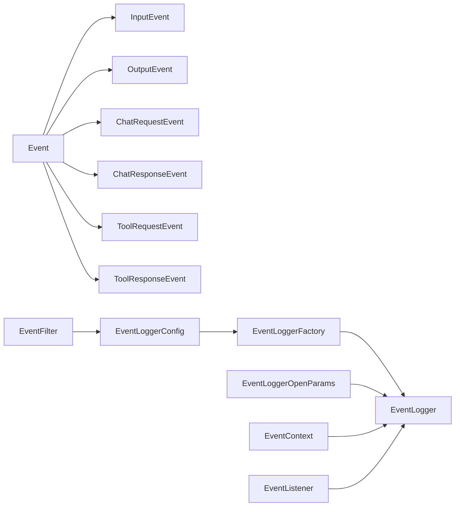

# Event-Driven Architecture

<cite>
**Referenced Files in This Document**
- [Event.java](file://api/src/main/java/org/apache/flink/agents/api/Event.java)
- [InputEvent.java](file://api/src/main/java/org/apache/flink/agents/api/InputEvent.java)
- [OutputEvent.java](file://api/src/main/java/org/apache/flink/agents/api/OutputEvent.java)
- [ChatRequestEvent.java](file://api/src/main/java/org/apache/flink/agents/api/event/ChatRequestEvent.java)
- [ChatResponseEvent.java](file://api/src/main/java/org/apache/flink/agents/api/event/ChatResponseEvent.java)
- [ToolRequestEvent.java](file://api/src/main/java/org/apache/flink/agents/api/event/ToolRequestEvent.java)
- [ToolResponseEvent.java](file://api/src/main/java/org/apache/flink/agents/api/event/ToolResponseEvent.java)
- [EventFilter.java](file://api/src/main/java/org/apache/flink/agents/api/EventFilter.java)
- [EventContext.java](file://api/src/main/java/org/apache/flink/agents/api/EventContext.java)
- [EventListener.java](file://api/src/main/java/org/apache/flink/agents/api/listener/EventListener.java)
- [EventLogger.java](file://api/src/main/java/org/apache/flink/agents/api/logger/EventLogger.java)
- [EventLoggerConfig.java](file://api/src/main/java/org/apache/flink/agents/api/logger/EventLoggerConfig.java)
- [EventLoggerFactory.java](file://api/src/main/java/org/apache/flink/agents/api/logger/EventLoggerFactory.java)
- [EventLoggerOpenParams.java](file://api/src/main/java/org/apache/flink/agents/api/logger/EventLoggerOpenParams.java)
</cite>

## Table of Contents
1. [Introduction](#introduction)
2. [Project Structure](#project-structure)
3. [Core Components](#core-components)
4. [Architecture Overview](#architecture-overview)
5. [Detailed Component Analysis](#detailed-component-analysis)
6. [Dependency Analysis](#dependency-analysis)
7. [Performance Considerations](#performance-considerations)
8. [Troubleshooting Guide](#troubleshooting-guide)
9. [Conclusion](#conclusion)

## Introduction
This document explains the event-driven architecture of Flink Agents. It covers the event model (base Event, InputEvent, OutputEvent, and specialized events), the event processing pipeline from ingestion to execution and response generation, logging and tracking of events across the agent lifecycle, filtering, routing, and transformation mechanisms, and how Flink’s streaming events complement the agent event model for real-time processing. It also addresses loose coupling between components, ordering guarantees, fault tolerance, and recovery.

## Project Structure
The event model and infrastructure live primarily in the API module under the package org.apache.flink.agents.api. Specialized events reside under org.apache.flink.agents.api.event. Logging and listener abstractions are under org.apache.flink.agents.api.logger and org.apache.flink.agents.api.listener.

**Diagram sources**
- [Event.java](file://api/src/main/java/org/apache/flink/agents/api/Event.java#L29-L90)
- [InputEvent.java](file://api/src/main/java/org/apache/flink/agents/api/InputEvent.java#L27-L49)
- [OutputEvent.java](file://api/src/main/java/org/apache/flink/agents/api/OutputEvent.java#L27-L52)
- [ChatRequestEvent.java](file://api/src/main/java/org/apache/flink/agents/api/event/ChatRequestEvent.java#L28-L58)
- [ChatResponseEvent.java](file://api/src/main/java/org/apache/flink/agents/api/event/ChatResponseEvent.java#L26-L43)
- [ToolRequestEvent.java](file://api/src/main/java/org/apache/flink/agents/api/event/ToolRequestEvent.java#L26-L63)
- [ToolResponseEvent.java](file://api/src/main/java/org/apache/flink/agents/api/event/ToolResponseEvent.java#L27-L95)
- [EventLogger.java](file://api/src/main/java/org/apache/flink/agents/api/logger/EventLogger.java#L24-L79)
- [EventLoggerConfig.java](file://api/src/main/java/org/apache/flink/agents/api/logger/EventLoggerConfig.java#L28-L220)
- [EventLoggerFactory.java](file://api/src/main/java/org/apache/flink/agents/api/logger/EventLoggerFactory.java#L26-L186)
- [EventLoggerOpenParams.java](file://api/src/main/java/org/apache/flink/agents/api/logger/EventLoggerOpenParams.java#L23-L34)
- [EventFilter.java](file://api/src/main/java/org/apache/flink/agents/api/EventFilter.java#L21-L62)
- [EventContext.java](file://api/src/main/java/org/apache/flink/agents/api/EventContext.java#L26-L53)
- [EventListener.java](file://api/src/main/java/org/apache/flink/agents/api/listener/EventListener.java#L24-L52)

**Section sources**
- [Event.java](file://api/src/main/java/org/apache/flink/agents/api/Event.java#L29-L90)
- [InputEvent.java](file://api/src/main/java/org/apache/flink/agents/api/InputEvent.java#L27-L49)
- [OutputEvent.java](file://api/src/main/java/org/apache/flink/agents/api/OutputEvent.java#L27-L52)
- [EventFilter.java](file://api/src/main/java/org/apache/flink/agents/api/EventFilter.java#L21-L62)
- [EventContext.java](file://api/src/main/java/org/apache/flink/agents/api/EventContext.java#L26-L53)
- [EventListener.java](file://api/src/main/java/org/apache/flink/agents/api/listener/EventListener.java#L24-L52)
- [EventLogger.java](file://api/src/main/java/org/apache/flink/agents/api/logger/EventLogger.java#L24-L79)
- [EventLoggerConfig.java](file://api/src/main/java/org/apache/flink/agents/api/logger/EventLoggerConfig.java#L28-L220)
- [EventLoggerFactory.java](file://api/src/main/java/org/apache/flink/agents/api/logger/EventLoggerFactory.java#L26-L186)
- [EventLoggerOpenParams.java](file://api/src/main/java/org/apache/flink/agents/api/logger/EventLoggerOpenParams.java#L23-L34)

## Core Components
- Base Event: Provides identity, attributes, and optional source timestamp for all events.
- InputEvent: Wraps incoming data for agent consumption.
- OutputEvent: Carries agent-generated output for downstream consumers.
- Specialized Events:
  - ChatRequestEvent and ChatResponseEvent: Encapsulate chat requests/responses with optional output schema and request correlation.
  - ToolRequestEvent and ToolResponseEvent: Encapsulate tool invocation requests and responses with per-call metadata and timestamps.
- EventFilter: Functional interface to selectively process events by type or custom logic.
- EventContext: Lightweight metadata for logged events (type, timestamp).
- EventListener: Callback hook invoked after event processing completes.
- EventLogger: Abstraction for appending, flushing, and closing event logs; paired with EventLoggerConfig and EventLoggerFactory.
- EventLoggerOpenParams: Bridges logging with Flink StreamingRuntimeContext.

Key capabilities:
- Loose coupling via event types and functional filters/listeners.
- Extensible logging via factory and configuration.
- Correlation via request IDs and timestamps.

**Section sources**
- [Event.java](file://api/src/main/java/org/apache/flink/agents/api/Event.java#L29-L90)
- [InputEvent.java](file://api/src/main/java/org/apache/flink/agents/api/InputEvent.java#L27-L49)
- [OutputEvent.java](file://api/src/main/java/org/apache/flink/agents/api/OutputEvent.java#L27-L52)
- [ChatRequestEvent.java](file://api/src/main/java/org/apache/flink/agents/api/event/ChatRequestEvent.java#L28-L58)
- [ChatResponseEvent.java](file://api/src/main/java/org/apache/flink/agents/api/event/ChatResponseEvent.java#L26-L43)
- [ToolRequestEvent.java](file://api/src/main/java/org/apache/flink/agents/api/event/ToolRequestEvent.java#L26-L63)
- [ToolResponseEvent.java](file://api/src/main/java/org/apache/flink/agents/api/event/ToolResponseEvent.java#L27-L95)
- [EventFilter.java](file://api/src/main/java/org/apache/flink/agents/api/EventFilter.java#L21-L62)
- [EventContext.java](file://api/src/main/java/org/apache/flink/agents/api/EventContext.java#L26-L53)
- [EventListener.java](file://api/src/main/java/org/apache/flink/agents/api/listener/EventListener.java#L24-L52)
- [EventLogger.java](file://api/src/main/java/org/apache/flink/agents/api/logger/EventLogger.java#L24-L79)
- [EventLoggerConfig.java](file://api/src/main/java/org/apache/flink/agents/api/logger/EventLoggerConfig.java#L28-L220)
- [EventLoggerFactory.java](file://api/src/main/java/org/apache/flink/agents/api/logger/EventLoggerFactory.java#L26-L186)
- [EventLoggerOpenParams.java](file://api/src/main/java/org/apache/flink/agents/api/logger/EventLoggerOpenParams.java#L23-L34)

## Architecture Overview
The event-driven pipeline connects ingestion, processing, and response generation through typed events. Flink’s streaming context supplies runtime context to loggers, enabling durable, real-time event tracking.

**Diagram sources**
- [InputEvent.java](file://api/src/main/java/org/apache/flink/agents/api/InputEvent.java#L27-L49)
- [ChatRequestEvent.java](file://api/src/main/java/org/apache/flink/agents/api/event/ChatRequestEvent.java#L28-L58)
- [ToolRequestEvent.java](file://api/src/main/java/org/apache/flink/agents/api/event/ToolRequestEvent.java#L26-L63)
- [ChatResponseEvent.java](file://api/src/main/java/org/apache/flink/agents/api/event/ChatResponseEvent.java#L26-L43)
- [ToolResponseEvent.java](file://api/src/main/java/org/apache/flink/agents/api/event/ToolResponseEvent.java#L27-L95)
- [OutputEvent.java](file://api/src/main/java/org/apache/flink/agents/api/OutputEvent.java#L27-L52)
- [EventFilter.java](file://api/src/main/java/org/apache/flink/agents/api/EventFilter.java#L21-L62)
- [EventListener.java](file://api/src/main/java/org/apache/flink/agents/api/listener/EventListener.java#L24-L52)
- [EventLogger.java](file://api/src/main/java/org/apache/flink/agents/api/logger/EventLogger.java#L24-L79)
- [EventLoggerFactory.java](file://api/src/main/java/org/apache/flink/agents/api/logger/EventLoggerFactory.java#L26-L186)

## Detailed Component Analysis

### Event Model
The base Event class centralizes identity, attributes, and optional source timestamp. InputEvent and OutputEvent wrap arbitrary payload objects. Specialized events encapsulate domain semantics:
- ChatRequestEvent: carries model, messages, and optional output schema.
- ChatResponseEvent: correlates responses to requests via request ID.
- ToolRequestEvent: carries model and tool call descriptors with a timestamp.
- ToolResponseEvent: aggregates per-tool responses, success flags, errors, external IDs, and a timestamp.

**Diagram sources**
- [Event.java](file://api/src/main/java/org/apache/flink/agents/api/Event.java#L29-L90)
- [InputEvent.java](file://api/src/main/java/org/apache/flink/agents/api/InputEvent.java#L27-L49)
- [OutputEvent.java](file://api/src/main/java/org/apache/flink/agents/api/OutputEvent.java#L27-L52)
- [ChatRequestEvent.java](file://api/src/main/java/org/apache/flink/agents/api/event/ChatRequestEvent.java#L28-L58)
- [ChatResponseEvent.java](file://api/src/main/java/org/apache/flink/agents/api/event/ChatResponseEvent.java#L26-L43)
- [ToolRequestEvent.java](file://api/src/main/java/org/apache/flink/agents/api/event/ToolRequestEvent.java#L26-L63)
- [ToolResponseEvent.java](file://api/src/main/java/org/apache/flink/agents/api/event/ToolResponseEvent.java#L27-L95)

**Section sources**
- [Event.java](file://api/src/main/java/org/apache/flink/agents/api/Event.java#L29-L90)
- [InputEvent.java](file://api/src/main/java/org/apache/flink/agents/api/InputEvent.java#L27-L49)
- [OutputEvent.java](file://api/src/main/java/org/apache/flink/agents/api/OutputEvent.java#L27-L52)
- [ChatRequestEvent.java](file://api/src/main/java/org/apache/flink/agents/api/event/ChatRequestEvent.java#L28-L58)
- [ChatResponseEvent.java](file://api/src/main/java/org/apache/flink/agents/api/event/ChatResponseEvent.java#L26-L43)
- [ToolRequestEvent.java](file://api/src/main/java/org/apache/flink/agents/api/event/ToolRequestEvent.java#L26-L63)
- [ToolResponseEvent.java](file://api/src/main/java/org/apache/flink/agents/api/event/ToolResponseEvent.java#L27-L95)

### Event Processing Pipeline
End-to-end flow from ingestion to response and output emission:

**Diagram sources**
- [InputEvent.java](file://api/src/main/java/org/apache/flink/agents/api/InputEvent.java#L27-L49)
- [ChatRequestEvent.java](file://api/src/main/java/org/apache/flink/agents/api/event/ChatRequestEvent.java#L28-L58)
- [ChatResponseEvent.java](file://api/src/main/java/org/apache/flink/agents/api/event/ChatResponseEvent.java#L26-L43)
- [ToolRequestEvent.java](file://api/src/main/java/org/apache/flink/agents/api/event/ToolRequestEvent.java#L26-L63)
- [ToolResponseEvent.java](file://api/src/main/java/org/apache/flink/agents/api/event/ToolResponseEvent.java#L27-L95)
- [OutputEvent.java](file://api/src/main/java/org/apache/flink/agents/api/OutputEvent.java#L27-L52)
- [EventLogger.java](file://api/src/main/java/org/apache/flink/agents/api/logger/EventLogger.java#L46-L56)

**Section sources**
- [InputEvent.java](file://api/src/main/java/org/apache/flink/agents/api/InputEvent.java#L27-L49)
- [OutputEvent.java](file://api/src/main/java/org/apache/flink/agents/api/OutputEvent.java#L27-L52)
- [EventLogger.java](file://api/src/main/java/org/apache/flink/agents/api/logger/EventLogger.java#L46-L56)

### Event Logging System and Lifecycle Tracking
EventLogger defines the contract for logging, flushing, and closing. EventLoggerConfig provides a fluent builder for logger type and properties, with an integrated EventFilter. EventLoggerFactory resolves logger implementations by type and supports registration of custom loggers. EventLoggerOpenParams bridges logging with Flink’s StreamingRuntimeContext.

**Diagram sources**
- [EventLogger.java](file://api/src/main/java/org/apache/flink/agents/api/logger/EventLogger.java#L24-L79)
- [EventLoggerConfig.java](file://api/src/main/java/org/apache/flink/agents/api/logger/EventLoggerConfig.java#L28-L220)
- [EventLoggerFactory.java](file://api/src/main/java/org/apache/flink/agents/api/logger/EventLoggerFactory.java#L26-L186)
- [EventLoggerOpenParams.java](file://api/src/main/java/org/apache/flink/agents/api/logger/EventLoggerOpenParams.java#L23-L34)

**Section sources**
- [EventLogger.java](file://api/src/main/java/org/apache/flink/agents/api/logger/EventLogger.java#L24-L79)
- [EventLoggerConfig.java](file://api/src/main/java/org/apache/flink/agents/api/logger/EventLoggerConfig.java#L28-L220)
- [EventLoggerFactory.java](file://api/src/main/java/org/apache/flink/agents/api/logger/EventLoggerFactory.java#L26-L186)
- [EventLoggerOpenParams.java](file://api/src/main/java/org/apache/flink/agents/api/logger/EventLoggerOpenParams.java#L23-L34)

### Filtering, Routing, and Transformation
- Filtering: EventFilter.accept determines whether an event is processed by loggers and listeners. Predefined filters include accepting all or rejecting all; a convenience method selects by event types.
- Routing: EventFilter can be supplied via EventLoggerConfig to route subsets of events to specific loggers.
- Transformation: EventContext captures event type and timestamp for downstream processing. Listeners can transform or enrich events post-processing.

**Diagram sources**
- [EventFilter.java](file://api/src/main/java/org/apache/flink/agents/api/EventFilter.java#L27-L62)
- [EventLogger.java](file://api/src/main/java/org/apache/flink/agents/api/logger/EventLogger.java#L46-L56)
- [EventContext.java](file://api/src/main/java/org/apache/flink/agents/api/EventContext.java#L26-L53)

**Section sources**
- [EventFilter.java](file://api/src/main/java/org/apache/flink/agents/api/EventFilter.java#L27-L62)
- [EventLogger.java](file://api/src/main/java/org/apache/flink/agents/api/logger/EventLogger.java#L46-L56)
- [EventContext.java](file://api/src/main/java/org/apache/flink/agents/api/EventContext.java#L26-L53)

### Relationship Between Flink Streaming Events and Agent Events
- Flink Streaming Runtime Context: Provided via EventLoggerOpenParams to support durable logging and integration with Flink’s runtime.
- Agent Events: Typed events (InputEvent, OutputEvent, ChatRequestEvent, ToolRequestEvent, etc.) represent agent-centric processing units.
- Complementarity:
  - Flink handles stream partitioning, watermarking, and runtime lifecycle.
  - Agent events model domain actions and responses, enabling loose coupling and observability.

**Diagram sources**
- [EventLoggerOpenParams.java](file://api/src/main/java/org/apache/flink/agents/api/logger/EventLoggerOpenParams.java#L23-L34)
- [EventLogger.java](file://api/src/main/java/org/apache/flink/agents/api/logger/EventLogger.java#L43-L43)
- [EventContext.java](file://api/src/main/java/org/apache/flink/agents/api/EventContext.java#L26-L53)

**Section sources**
- [EventLoggerOpenParams.java](file://api/src/main/java/org/apache/flink/agents/api/logger/EventLoggerOpenParams.java#L23-L34)
- [EventLogger.java](file://api/src/main/java/org/apache/flink/agents/api/logger/EventLogger.java#L43-L43)
- [EventContext.java](file://api/src/main/java/org/apache/flink/agents/api/EventContext.java#L26-L53)

## Dependency Analysis
High-level dependencies among event and logging components:

**Diagram sources**
- [Event.java](file://api/src/main/java/org/apache/flink/agents/api/Event.java#L29-L90)
- [InputEvent.java](file://api/src/main/java/org/apache/flink/agents/api/InputEvent.java#L27-L49)
- [OutputEvent.java](file://api/src/main/java/org/apache/flink/agents/api/OutputEvent.java#L27-L52)
- [ChatRequestEvent.java](file://api/src/main/java/org/apache/flink/agents/api/event/ChatRequestEvent.java#L28-L58)
- [ChatResponseEvent.java](file://api/src/main/java/org/apache/flink/agents/api/event/ChatResponseEvent.java#L26-L43)
- [ToolRequestEvent.java](file://api/src/main/java/org/apache/flink/agents/api/event/ToolRequestEvent.java#L26-L63)
- [ToolResponseEvent.java](file://api/src/main/java/org/apache/flink/agents/api/event/ToolResponseEvent.java#L27-L95)
- [EventFilter.java](file://api/src/main/java/org/apache/flink/agents/api/EventFilter.java#L27-L62)
- [EventLoggerConfig.java](file://api/src/main/java/org/apache/flink/agents/api/logger/EventLoggerConfig.java#L28-L220)
- [EventLoggerFactory.java](file://api/src/main/java/org/apache/flink/agents/api/logger/EventLoggerFactory.java#L26-L186)
- [EventLogger.java](file://api/src/main/java/org/apache/flink/agents/api/logger/EventLogger.java#L24-L79)
- [EventLoggerOpenParams.java](file://api/src/main/java/org/apache/flink/agents/api/logger/EventLoggerOpenParams.java#L23-L34)
- [EventContext.java](file://api/src/main/java/org/apache/flink/agents/api/EventContext.java#L26-L53)
- [EventListener.java](file://api/src/main/java/org/apache/flink/agents/api/listener/EventListener.java#L24-L52)

**Section sources**
- [Event.java](file://api/src/main/java/org/apache/flink/agents/api/Event.java#L29-L90)
- [EventFilter.java](file://api/src/main/java/org/apache/flink/agents/api/EventFilter.java#L27-L62)
- [EventLoggerConfig.java](file://api/src/main/java/org/apache/flink/agents/api/logger/EventLoggerConfig.java#L28-L220)
- [EventLoggerFactory.java](file://api/src/main/java/org/apache/flink/agents/api/logger/EventLoggerFactory.java#L26-L186)
- [EventLogger.java](file://api/src/main/java/org/apache/flink/agents/api/logger/EventLogger.java#L24-L79)
- [EventLoggerOpenParams.java](file://api/src/main/java/org/apache/flink/agents/api/logger/EventLoggerOpenParams.java#L23-L34)
- [EventContext.java](file://api/src/main/java/org/apache/flink/agents/api/EventContext.java#L26-L53)
- [EventListener.java](file://api/src/main/java/org/apache/flink/agents/api/listener/EventListener.java#L24-L52)

## Performance Considerations
- EventFilter reduces logging overhead by limiting which events are recorded.
- EventLogger.flush ensures timely persistence; batching strategies can be implemented in concrete logger implementations.
- EventListener callbacks should remain lightweight to avoid blocking the processing pipeline.
- Event attributes and context metadata are stored in maps; keep attribute keys concise and values serializable.

[No sources needed since this section provides general guidance]

## Troubleshooting Guide
- Logger creation failures: EventLoggerFactory throws descriptive exceptions when no factory is registered for a logger type or when construction fails.
- Open/append/flush/close errors: EventLogger methods declare exceptions; ensure implementations handle transient failures and retry where appropriate.
- Listener safety: EventListener.onEventProcessed should not throw; internal errors are logged but do not disrupt the main processing flow.
- Filtering issues: Verify EventFilter.accept logic and EventLoggerConfig eventFilter selection.

**Section sources**
- [EventLoggerFactory.java](file://api/src/main/java/org/apache/flink/agents/api/logger/EventLoggerFactory.java#L80-L119)
- [EventLogger.java](file://api/src/main/java/org/apache/flink/agents/api/logger/EventLogger.java#L43-L77)
- [EventListener.java](file://api/src/main/java/org/apache/flink/agents/api/listener/EventListener.java#L35-L50)

## Conclusion
Flink Agents’ event-driven architecture separates concerns through typed events, functional filtering, and pluggable logging. Agent events model chat and tool interactions, while Flink’s streaming context enables durable, real-time processing. The combination delivers loose coupling, observability, and extensibility suitable for production-grade, real-time AI agent pipelines.