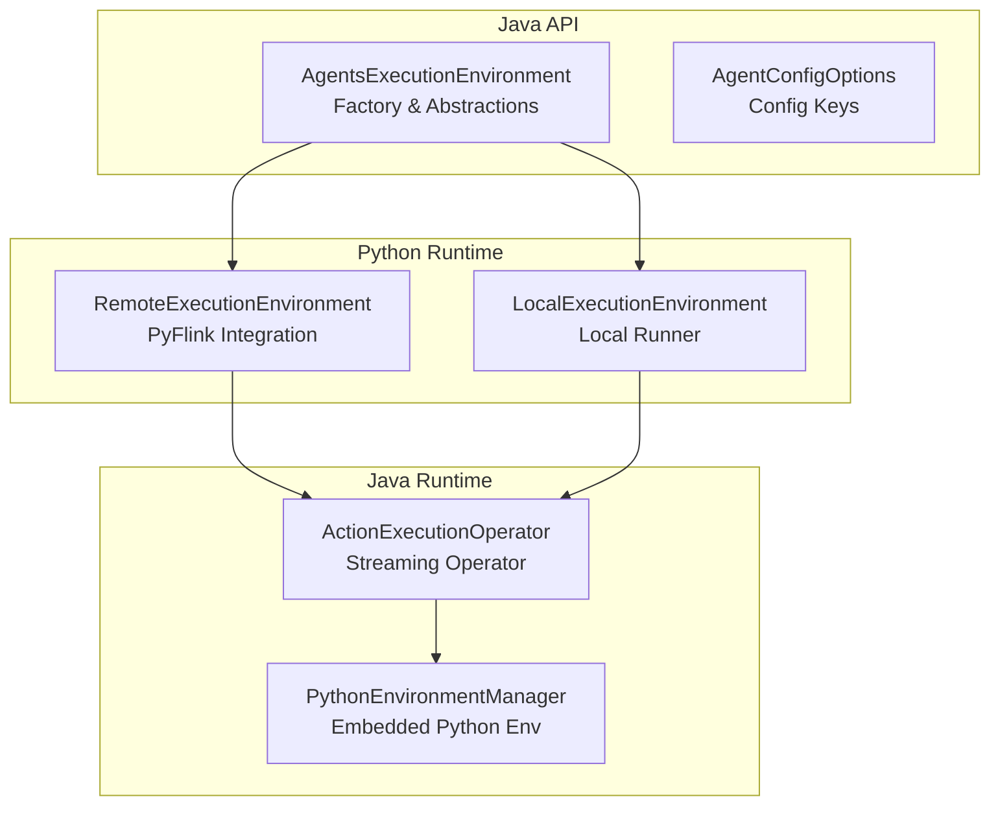
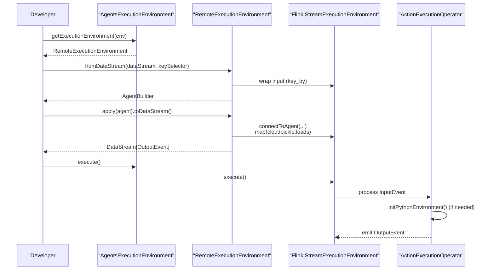
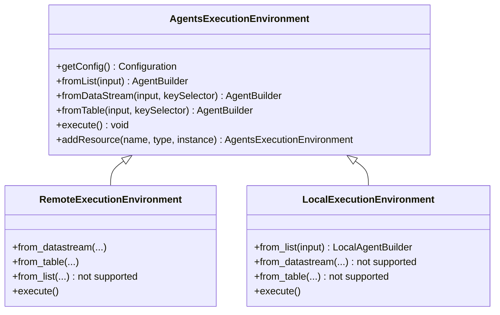
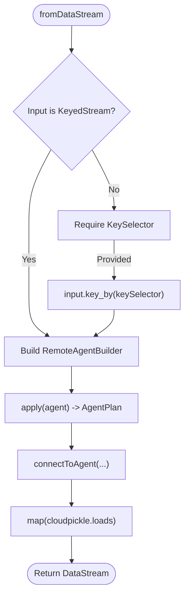
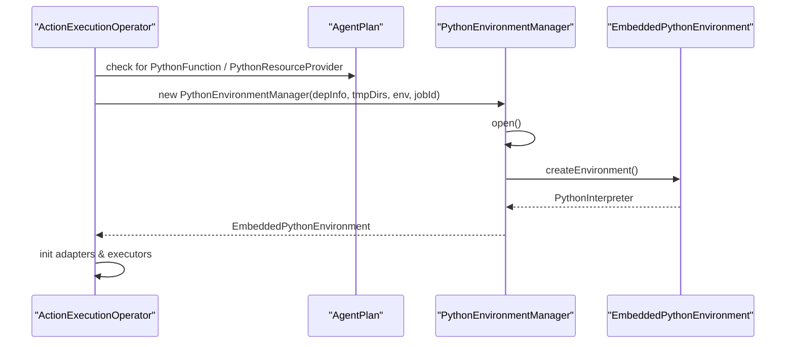
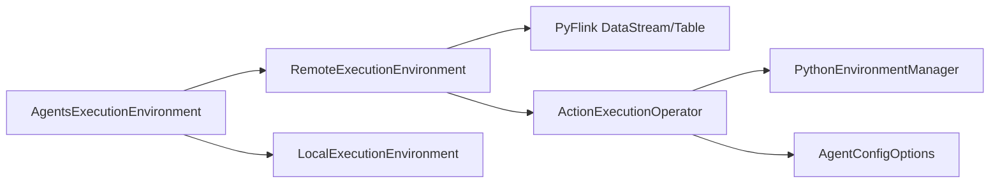

# Execution Environment

<cite>
**Referenced Files in This Document**
- [AgentsExecutionEnvironment.java](file://api/src/main/java/org/apache/flink/agents/api/AgentsExecutionEnvironment.java)
- [remote_execution_environment.py](file://python/flink_agents/runtime/remote_execution_environment.py)
- [local_execution_environment.py](file://python/flink_agents/runtime/local_execution_environment.py)
- [PythonEnvironmentManager.java](file://runtime/src/main/java/org/apache/flink/agents/runtime/env/PythonEnvironmentManager.java)
- [ActionExecutionOperator.java](file://runtime/src/main/java/org/apache/flink/agents/runtime/operator/ActionExecutionOperator.java)
- [AgentConfigOptions.java](file://api/src/main/java/org/apache/flink/agents/api/configuration/AgentConfigOptions.java)
- [WorkflowSingleAgentExample.java](file://examples/src/main/java/org/apache/flink/agents/examples/WorkflowSingleAgentExample.java)
</cite>

## Table of Contents
1. [Introduction](#introduction)
2. [Project Structure](#project-structure)
3. [Core Components](#core-components)
4. [Architecture Overview](#architecture-overview)
5. [Detailed Component Analysis](#detailed-component-analysis)
6. [Dependency Analysis](#dependency-analysis)
7. [Performance Considerations](#performance-considerations)
8. [Troubleshooting Guide](#troubleshooting-guide)
9. [Conclusion](#conclusion)
10. [Appendices](#appendices)

## Introduction
This document explains the execution environment in Flink Agents and how it serves as the entry point for agent development while integrating with Apache Flink streaming. It covers:
- How AgentsExecutionEnvironment selects and configures local versus remote environments
- The remote execution environment for distributed agent execution
- The embedded Python environment for cross-language support
- The Python environment manager and its role in runtime initialization and resource management
- The relationship between execution environments and Flink’s streaming operators
- Environment configuration, resource allocation, and scaling considerations
- Examples for development, testing, and production setups
- Environment isolation, security considerations, and performance optimization strategies

## Project Structure
Flink Agents separates the Java API surface from Python runtime implementations and integrates with Flink’s Java/PyFlink APIs. The execution environment is exposed via a Java API and implemented in both Java and Python layers.

**Diagram sources**
- [AgentsExecutionEnvironment.java](file://api/src/main/java/org/apache/flink/agents/api/AgentsExecutionEnvironment.java#L68-L121)
- [remote_execution_environment.py](file://python/flink_agents/runtime/remote_execution_environment.py#L160-L177)
- [local_execution_environment.py](file://python/flink_agents/runtime/local_execution_environment.py#L92-L100)
- [ActionExecutionOperator.java](file://runtime/src/main/java/org/apache/flink/agents/runtime/operator/ActionExecutionOperator.java#L118-L119)
- [PythonEnvironmentManager.java](file://runtime/src/main/java/org/apache/flink/agents/runtime/env/PythonEnvironmentManager.java#L35-L42)

**Section sources**
- [AgentsExecutionEnvironment.java](file://api/src/main/java/org/apache/flink/agents/api/AgentsExecutionEnvironment.java#L43-L121)
- [remote_execution_environment.py](file://python/flink_agents/runtime/remote_execution_environment.py#L160-L177)
- [local_execution_environment.py](file://python/flink_agents/runtime/local_execution_environment.py#L92-L100)

## Core Components
- AgentsExecutionEnvironment: Factory and abstraction for selecting local vs. remote execution environments. Provides input sources (fromList, fromDataStream, fromTable) and execution orchestration.
- RemoteExecutionEnvironment: PyFlink-backed environment that integrates with Flink DataStream/Table APIs, enabling distributed execution and stateful processing.
- LocalExecutionEnvironment: Pure-Python environment for local development and testing, executing agents synchronously against in-memory lists.
- PythonEnvironmentManager: Manages the embedded Python interpreter lifecycle, environment variables, and working directories for Python actions/resources.
- ActionExecutionOperator: Flink streaming operator that executes agent actions, initializes Python environments when needed, and coordinates Java/Python interoperability.

**Section sources**
- [AgentsExecutionEnvironment.java](file://api/src/main/java/org/apache/flink/agents/api/AgentsExecutionEnvironment.java#L128-L221)
- [remote_execution_environment.py](file://python/flink_agents/runtime/remote_execution_environment.py#L160-L270)
- [local_execution_environment.py](file://python/flink_agents/runtime/local_execution_environment.py#L92-L156)
- [PythonEnvironmentManager.java](file://runtime/src/main/java/org/apache/flink/agents/runtime/env/PythonEnvironmentManager.java#L35-L83)
- [ActionExecutionOperator.java](file://runtime/src/main/java/org/apache/flink/agents/runtime/operator/ActionExecutionOperator.java#L118-L119)

## Architecture Overview
The execution environment bridges Java APIs and Python runtime, enabling agents to run in Flink’s distributed streaming engine. The diagram below maps the Java API factory to Python environments and the Flink streaming operator that executes agent logic.

**Diagram sources**
- [AgentsExecutionEnvironment.java](file://api/src/main/java/org/apache/flink/agents/api/AgentsExecutionEnvironment.java#L68-L121)
- [remote_execution_environment.py](file://python/flink_agents/runtime/remote_execution_environment.py#L211-L257)
- [ActionExecutionOperator.java](file://runtime/src/main/java/org/apache/flink/agents/runtime/operator/ActionExecutionOperator.java#L612-L661)

## Detailed Component Analysis

### AgentsExecutionEnvironment: Entry Point and Factory
- Factory selection:
  - If no StreamExecutionEnvironment is provided, returns a local environment for development/testing.
  - If a StreamExecutionEnvironment is provided, returns a remote environment for distributed Flink execution.
- Input sources:
  - fromList: local-only input from a list of objects.
  - fromDataStream: integrates with Flink DataStream; supports keyed streams and optional key selectors.
  - fromTable: converts Table to DataStream and processes via agents.
- Configuration:
  - getConfig returns a writable configuration object for agent settings.
- Resource registration:
  - addResource registers serializable resources or descriptors by type/name.

**Diagram sources**
- [AgentsExecutionEnvironment.java](file://api/src/main/java/org/apache/flink/agents/api/AgentsExecutionEnvironment.java#L43-L221)
- [remote_execution_environment.py](file://python/flink_agents/runtime/remote_execution_environment.py#L160-L177)
- [local_execution_environment.py](file://python/flink_agents/runtime/local_execution_environment.py#L92-L100)

**Section sources**
- [AgentsExecutionEnvironment.java](file://api/src/main/java/org/apache/flink/agents/api/AgentsExecutionEnvironment.java#L68-L121)
- [AgentsExecutionEnvironment.java](file://api/src/main/java/org/apache/flink/agents/api/AgentsExecutionEnvironment.java#L128-L221)

### RemoteExecutionEnvironment: Distributed Agent Execution
- Integrates with PyFlink:
  - Accepts StreamExecutionEnvironment and optional StreamTableEnvironment.
  - Converts Table to DataStream and applies key_by when needed.
- Builder pattern:
  - RemoteAgentBuilder connects the input DataStream to the compiled agent plan and returns a typed DataStream of OutputEvent.
- Configuration:
  - Loads agent configuration from FLINK_CONF_DIR if present, supporting both new and legacy config filenames.
- Limitations:
  - Does not support from_list or to_list for remote environments.

**Diagram sources**
- [remote_execution_environment.py](file://python/flink_agents/runtime/remote_execution_environment.py#L211-L257)
- [remote_execution_environment.py](file://python/flink_agents/runtime/remote_execution_environment.py#L101-L132)

**Section sources**
- [remote_execution_environment.py](file://python/flink_agents/runtime/remote_execution_environment.py#L160-L270)
- [remote_execution_environment.py](file://python/flink_agents/runtime/remote_execution_environment.py#L272-L313)

### LocalExecutionEnvironment: Embedded Python for Development
- Designed for local development and testing:
  - from_list builds a LocalAgentBuilder that executes agents synchronously against an in-memory list.
  - execute iterates over inputs and collects outputs.
- Not supported:
  - from_datastream/from_table/to_datastream/to_table are not supported in local mode.

**Section sources**
- [local_execution_environment.py](file://python/flink_agents/runtime/local_execution_environment.py#L92-L156)

### Python Environment Manager and Embedded Python
- Purpose:
  - Initializes and manages an embedded Python interpreter for Python actions and resources.
- Lifecycle:
  - ActionExecutionOperator detects Python actions/resources and initializes PythonEnvironmentManager.
  - Creates EmbeddedPythonEnvironment with proper environment variables, working directory, and Python executable.
- Environment variables and paths:
  - Supports PYTHONPATH, PYTHON_HOME, and working directory derived from archives or configuration.
- Resource adapters:
  - Initializes adapters to bridge Java and Python resources/actions.

**Diagram sources**
- [ActionExecutionOperator.java](file://runtime/src/main/java/org/apache/flink/agents/runtime/operator/ActionExecutionOperator.java#L612-L661)
- [PythonEnvironmentManager.java](file://runtime/src/main/java/org/apache/flink/agents/runtime/env/PythonEnvironmentManager.java#L44-L83)

**Section sources**
- [ActionExecutionOperator.java](file://runtime/src/main/java/org/apache/flink/agents/runtime/operator/ActionExecutionOperator.java#L612-L661)
- [PythonEnvironmentManager.java](file://runtime/src/main/java/org/apache/flink/agents/runtime/env/PythonEnvironmentManager.java#L35-L83)

### Relationship Between Execution Environments and Streaming Operators
- Remote environments:
  - The RemoteAgentBuilder connects the Flink DataStream to the compiled agent plan and deserializes outputs.
- Local environments:
  - The LocalAgentBuilder executes agents locally and produces in-memory outputs.
- Operator-level integration:
  - ActionExecutionOperator orchestrates agent execution, manages state, and initializes Python environments when required.

**Section sources**
- [remote_execution_environment.py](file://python/flink_agents/runtime/remote_execution_environment.py#L101-L132)
- [local_execution_environment.py](file://python/flink_agents/runtime/local_execution_environment.py#L55-L74)
- [ActionExecutionOperator.java](file://runtime/src/main/java/org/apache/flink/agents/runtime/operator/ActionExecutionOperator.java#L118-L119)

## Dependency Analysis
- Java API depends on Flink’s StreamExecutionEnvironment and StreamTableEnvironment for remote execution.
- RemoteExecutionEnvironment depends on PyFlink’s DataStream/Table APIs and invokes Java-side compilation/connect utilities.
- ActionExecutionOperator depends on PythonEnvironmentManager to initialize the embedded Python environment when Python actions/resources are present.
- Configuration keys are defined in AgentConfigOptions and consumed by environments and operators.

**Diagram sources**
- [AgentsExecutionEnvironment.java](file://api/src/main/java/org/apache/flink/agents/api/AgentsExecutionEnvironment.java#L68-L121)
- [remote_execution_environment.py](file://python/flink_agents/runtime/remote_execution_environment.py#L160-L177)
- [local_execution_environment.py](file://python/flink_agents/runtime/local_execution_environment.py#L92-L100)
- [ActionExecutionOperator.java](file://runtime/src/main/java/org/apache/flink/agents/runtime/operator/ActionExecutionOperator.java#L118-L119)
- [AgentConfigOptions.java](file://api/src/main/java/org/apache/flink/agents/api/configuration/AgentConfigOptions.java#L21-L50)

**Section sources**
- [AgentConfigOptions.java](file://api/src/main/java/org/apache/flink/agents/api/configuration/AgentConfigOptions.java#L21-L50)

## Performance Considerations
- Parallelism and throughput:
  - Configure Flink environment parallelism appropriately for the workload.
  - Use key_by on DataStreams to enable keyed state and parallelism per key.
- Async execution:
  - Control concurrency for async operations via environment configuration to avoid overwhelming external services.
- Serialization:
  - Outputs are serialized/deserialized using cloudpickle; ensure lightweight output types for performance.
- Python interpreter overhead:
  - Initialize the embedded Python environment lazily and reuse where possible within the operator lifecycle.
- Checkpointing and state:
  - Operator-level state management ensures fault tolerance; tune checkpoint intervals and state backends for your environment.

[No sources needed since this section provides general guidance]

## Troubleshooting Guide
- Remote environment not selected:
  - Ensure a non-null StreamExecutionEnvironment is passed to the factory to enable remote execution.
- KeySelector missing:
  - When using DataStream input, provide a KeySelector or ensure the stream is already keyed.
- Unsupported operation:
  - from_list/to_list are not supported in remote environments; use DataStream/Table instead.
  - from_datastream/from_table are not supported in local environments; use from_list instead.
- Python environment initialization:
  - Verify that Python actions/resources are detected; the operator will initialize PythonEnvironmentManager automatically when needed.
- Configuration loading:
  - Ensure FLINK_CONF_DIR points to a directory containing the expected configuration file name.

**Section sources**
- [remote_execution_environment.py](file://python/flink_agents/runtime/remote_execution_environment.py#L259-L265)
- [remote_execution_environment.py](file://python/flink_agents/runtime/remote_execution_environment.py#L198-L210)
- [local_execution_environment.py](file://python/flink_agents/runtime/local_execution_environment.py#L136-L156)
- [local_execution_environment.py](file://python/flink_agents/runtime/local_execution_environment.py#L107-L114)

## Conclusion
Flink Agents provides a unified execution environment abstraction that seamlessly integrates with Apache Flink streaming. Developers can use a local environment for rapid iteration and switch to a remote environment for distributed execution. The embedded Python environment enables cross-language agent execution, while the ActionExecutionOperator orchestrates Java and Python interoperability. Proper configuration, resource management, and environment selection are key to achieving reliable, scalable, and secure deployments.

[No sources needed since this section summarizes without analyzing specific files]

## Appendices

### Environment Setup Examples
- Development and Testing:
  - Use the factory without arguments to obtain a local environment for unit testing and local runs.
  - Example usage demonstrates adding resources and executing a pipeline locally.
- Production:
  - Pass a configured StreamExecutionEnvironment to the factory to enable remote execution.
  - Configure parallelism and resource limits according to cluster capacity.
  - Use configuration files loaded from FLINK_CONF_DIR for agent-specific settings.

**Section sources**
- [AgentsExecutionEnvironment.java](file://api/src/main/java/org/apache/flink/agents/api/AgentsExecutionEnvironment.java#L119-L121)
- [WorkflowSingleAgentExample.java](file://examples/src/main/java/org/apache/flink/agents/examples/WorkflowSingleAgentExample.java#L52-L92)

### Environment Configuration and Scaling
- Configuration keys:
  - Base log directory, action state store backend, Kafka bootstrap servers/topic/partitions, and job identifier are configurable.
- Scaling:
  - Adjust Flink parallelism and operator chaining.
  - Tune async thread counts and external service quotas to prevent overload.

**Section sources**
- [AgentConfigOptions.java](file://api/src/main/java/org/apache/flink/agents/api/configuration/AgentConfigOptions.java#L21-L50)

### Security and Isolation
- Isolation:
  - Local vs. remote environments isolate execution contexts; remote execution leverages Flink’s sandboxing and state backends.
- Python isolation:
  - Embedded Python environment is initialized with controlled environment variables and working directories.
- Resource isolation:
  - Registered resources are scoped to the environment and applied to agents during execution.

**Section sources**
- [PythonEnvironmentManager.java](file://runtime/src/main/java/org/apache/flink/agents/runtime/env/PythonEnvironmentManager.java#L44-L83)
- [remote_execution_environment.py](file://python/flink_agents/runtime/remote_execution_environment.py#L272-L313)