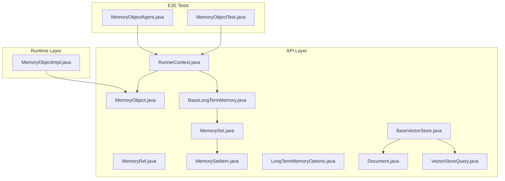
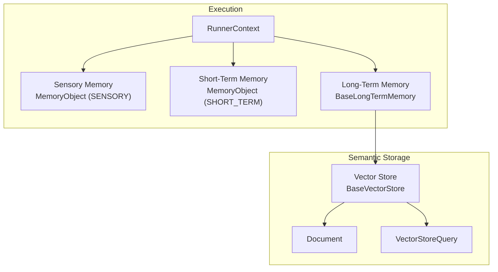
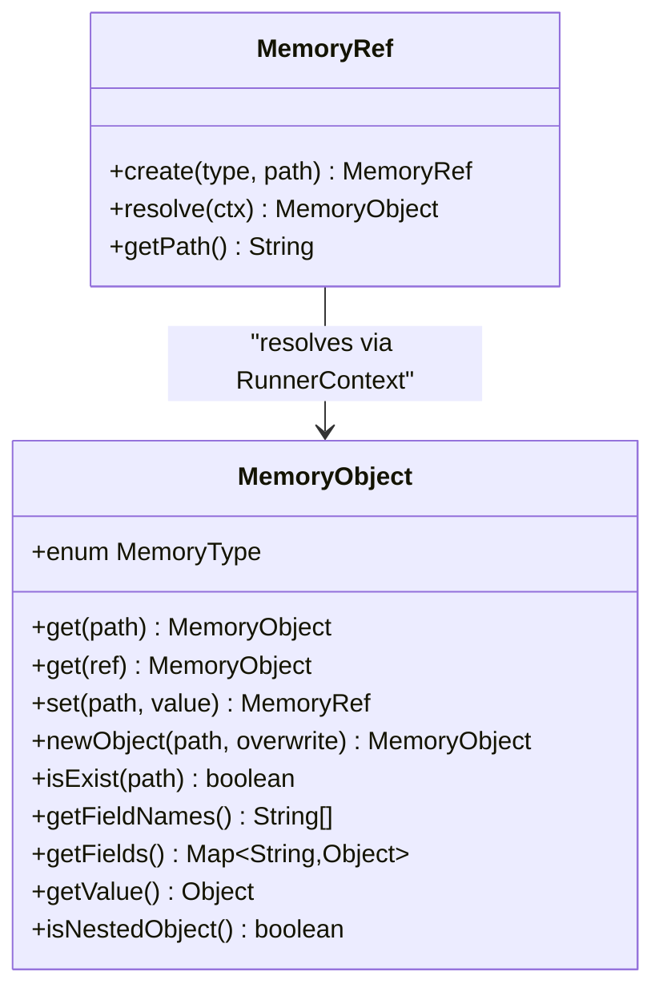
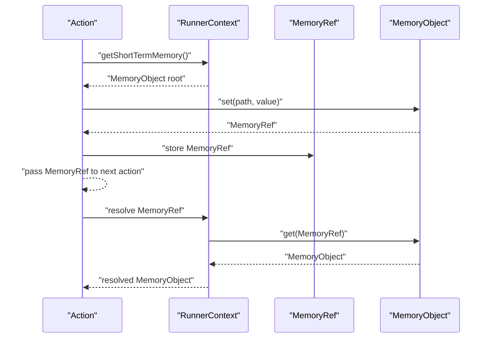
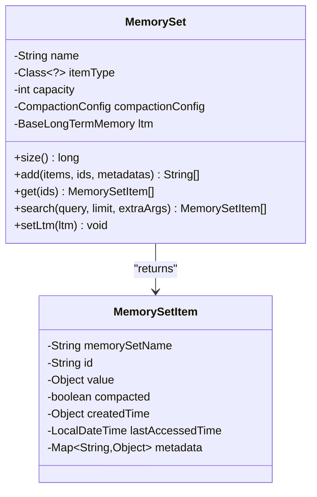
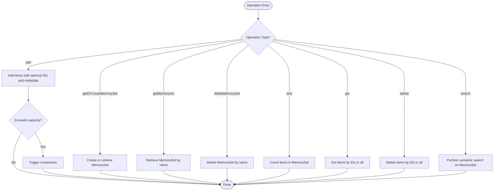
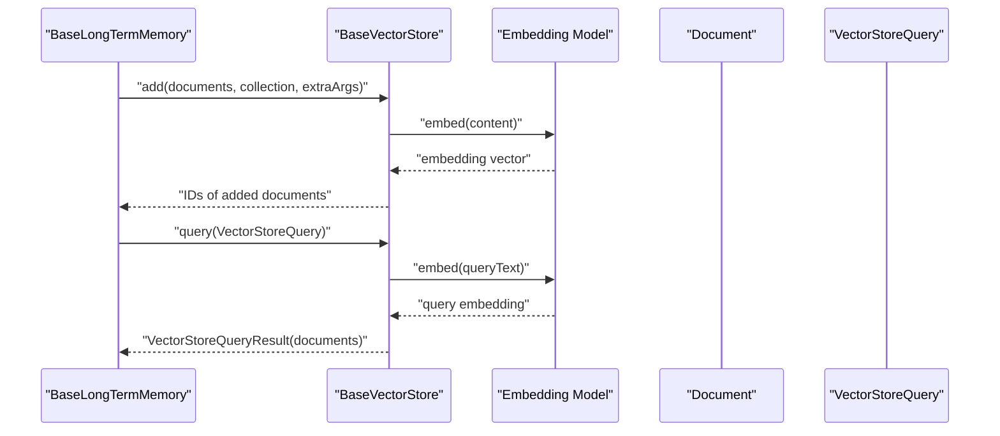
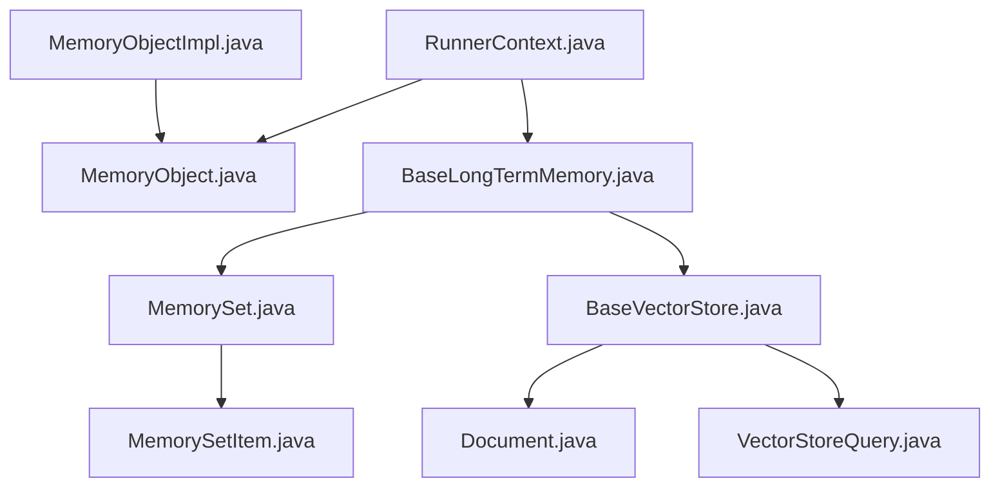

# Memory System Overview

<cite>
**Referenced Files in This Document**
- [MemoryObject.java](file://api/src/main/java/org/apache/flink/agents/api/context/MemoryObject.java)
- [MemoryRef.java](file://api/src/main/java/org/apache/flink/agents/api/context/MemoryRef.java)
- [RunnerContext.java](file://api/src/main/java/org/apache/flink/agents/api/context/RunnerContext.java)
- [MemorySet.java](file://api/src/main/java/org/apache/flink/agents/api/memory/MemorySet.java)
- [MemorySetItem.java](file://api/src/main/java/org/apache/flink/agents/api/memory/MemorySetItem.java)
- [BaseLongTermMemory.java](file://api/src/main/java/org/apache/flink/agents/api/memory/BaseLongTermMemory.java)
- [LongTermMemoryOptions.java](file://api/src/main/java/org/apache/flink/agents/api/memory/LongTermMemoryOptions.java)
- [BaseVectorStore.java](file://api/src/main/java/org/apache/flink/agents/api/vectorstores/BaseVectorStore.java)
- [Document.java](file://api/src/main/java/org/apache/flink/agents/api/vectorstores/Document.java)
- [VectorStoreQuery.java](file://api/src/main/java/org/apache/flink/agents/api/vectorstores/VectorStoreQuery.java)
- [MemoryObjectImpl.java](file://runtime/src/main/java/org/apache/flink/agents/runtime/memory/MemoryObjectImpl.java)
- [MemoryObjectAgent.java](file://e2e-test/flink-agents-end-to-end-tests-integration/src/test/java/org/apache/flink/agents/integration/test/MemoryObjectAgent.java)
- [MemoryObjectTest.java](file://e2e-test/flink-agents-end-to-end-tests-integration/src/test/java/org/apache/flink/agents/integration/test/MemoryObjectTest.java)
</cite>

## Table of Contents
1. [Introduction](#introduction)
2. [Project Structure](#project-structure)
3. [Core Components](#core-components)
4. [Architecture Overview](#architecture-overview)
5. [Detailed Component Analysis](#detailed-component-analysis)
6. [Dependency Analysis](#dependency-analysis)
7. [Performance Considerations](#performance-considerations)
8. [Troubleshooting Guide](#troubleshooting-guide)
9. [Conclusion](#conclusion)

## Introduction
This document explains the memory system in Flink Agents, focusing on the three-tier memory hierarchy and the abstractions that enable hierarchical key-value storage, cross-execution references, and semantic memory powered by vector stores. It covers:
- Sensory memory for temporary data
- Short-term memory for persistent state
- Long-term memory for semantic storage backed by vector stores
- MemoryObject as the core abstraction for hierarchical key-value storage
- MemoryRef for referencing shared memory objects across agent executions
- MemorySet for managing collections of memory items and their relationships
- Transition from short-term to long-term memory and the role of vector stores
- Practical usage patterns, persistence strategies, recovery mechanisms, lifecycle management, and performance optimization

## Project Structure
The memory system spans API interfaces and runtime implementations:
- API layer defines the contracts for memory access, long-term memory management, and vector store integration
- Runtime layer provides concrete implementations for memory operations
- E2E tests demonstrate usage patterns and validate behavior

**Diagram sources**
- [MemoryObject.java](file://api/src/main/java/org/apache/flink/agents/api/context/MemoryObject.java#L29-L131)
- [MemoryRef.java](file://api/src/main/java/org/apache/flink/agents/api/context/MemoryRef.java#L28-L87)
- [RunnerContext.java](file://api/src/main/java/org/apache/flink/agents/api/context/RunnerContext.java#L33-L137)
- [MemorySet.java](file://api/src/main/java/org/apache/flink/agents/api/memory/MemorySet.java#L32-L159)
- [MemorySetItem.java](file://api/src/main/java/org/apache/flink/agents/api/memory/MemorySetItem.java#L23-L94)
- [BaseLongTermMemory.java](file://api/src/main/java/org/apache/flink/agents/api/memory/BaseLongTermMemory.java#L33-L133)
- [LongTermMemoryOptions.java](file://api/src/main/java/org/apache/flink/agents/api/memory/LongTermMemoryOptions.java#L22-L52)
- [BaseVectorStore.java](file://api/src/main/java/org/apache/flink/agents/api/vectorstores/BaseVectorStore.java#L38-L173)
- [Document.java](file://api/src/main/java/org/apache/flink/agents/api/vectorstores/Document.java#L34-L110)
- [VectorStoreQuery.java](file://api/src/main/java/org/apache/flink/agents/api/vectorstores/VectorStoreQuery.java#L33-L109)
- [MemoryObjectImpl.java](file://runtime/src/main/java/org/apache/flink/agents/runtime/memory/MemoryObjectImpl.java)
- [MemoryObjectAgent.java](file://e2e-test/flink-agents-end-to-end-tests-integration/src/test/java/org/apache/flink/agents/integration/test/MemoryObjectAgent.java)
- [MemoryObjectTest.java](file://e2e-test/flink-agents-end-to-end-tests-integration/src/test/java/org/apache/flink/agents/integration/test/MemoryObjectTest.java)

**Section sources**
- [MemoryObject.java](file://api/src/main/java/org/apache/flink/agents/api/context/MemoryObject.java#L29-L131)
- [RunnerContext.java](file://api/src/main/java/org/apache/flink/agents/api/context/RunnerContext.java#L33-L137)
- [BaseLongTermMemory.java](file://api/src/main/java/org/apache/flink/agents/api/memory/BaseLongTermMemory.java#L33-L133)
- [BaseVectorStore.java](file://api/src/main/java/org/apache/flink/agents/api/vectorstores/BaseVectorStore.java#L38-L173)

## Core Components
- MemoryObject: Hierarchical key-value abstraction for short-term memory with support for nested objects, primitive values, and path-based access. It defines memory types (sensory and short-term) and exposes operations to get/set fields, create nested objects, and inspect existence and structure.
- MemoryRef: Serializable, persistent reference to a specific data item in short-term memory, enabling efficient passing of large objects between actions without duplicating data.
- RunnerContext: Execution context exposing sensory memory, short-term memory, long-term memory, metrics, resources, configuration, and durable execution capabilities.
- MemorySet: Collection abstraction for long-term memory, representing named sets of typed items with capacity limits and compaction configuration.
- MemorySetItem: Item wrapper for long-term memory entries, including identity, value, compaction status, timestamps, and metadata.
- BaseLongTermMemory: Interface for long-term memory operations including creation/retrieval/deletion of memory sets, adding/getting/deleting items, and semantic search.
- LongTermMemoryOptions: Configuration options for long-term memory backend selection, external vector store binding, and compaction behavior.
- BaseVectorStore: Abstraction for vector stores integrating embedding models for semantic search, including add/query operations and collection management.
- Document and VectorStoreQuery: Data carriers for vector store operations, encapsulating content, metadata, embeddings, and query parameters.

**Section sources**
- [MemoryObject.java](file://api/src/main/java/org/apache/flink/agents/api/context/MemoryObject.java#L29-L131)
- [MemoryRef.java](file://api/src/main/java/org/apache/flink/agents/api/context/MemoryRef.java#L28-L87)
- [RunnerContext.java](file://api/src/main/java/org/apache/flink/agents/api/context/RunnerContext.java#L33-L137)
- [MemorySet.java](file://api/src/main/java/org/apache/flink/agents/api/memory/MemorySet.java#L32-L159)
- [MemorySetItem.java](file://api/src/main/java/org/apache/flink/agents/api/memory/MemorySetItem.java#L23-L94)
- [BaseLongTermMemory.java](file://api/src/main/java/org/apache/flink/agents/api/memory/BaseLongTermMemory.java#L33-L133)
- [LongTermMemoryOptions.java](file://api/src/main/java/org/apache/flink/agents/api/memory/LongTermMemoryOptions.java#L22-L52)
- [BaseVectorStore.java](file://api/src/main/java/org/apache/flink/agents/api/vectorstores/BaseVectorStore.java#L38-L173)
- [Document.java](file://api/src/main/java/org/apache/flink/agents/api/vectorstores/Document.java#L34-L110)
- [VectorStoreQuery.java](file://api/src/main/java/org/apache/flink/agents/api/vectorstores/VectorStoreQuery.java#L33-L109)

## Architecture Overview
The memory system separates concerns across three tiers:
- Sensory memory: Temporary, auto-cleared after a run; suitable for transient data not intended to persist across runs.
- Short-term memory: Persistent state within a run; supports hierarchical key-value access and references.
- Long-term memory: Persistent semantic storage backed by vector stores; manages collections (MemorySet) with capacity and compaction.

**Diagram sources**
- [RunnerContext.java](file://api/src/main/java/org/apache/flink/agents/api/context/RunnerContext.java#L33-L137)
- [MemoryObject.java](file://api/src/main/java/org/apache/flink/agents/api/context/MemoryObject.java#L30-L33)
- [BaseLongTermMemory.java](file://api/src/main/java/org/apache/flink/agents/api/memory/BaseLongTermMemory.java#L33-L133)
- [BaseVectorStore.java](file://api/src/main/java/org/apache/flink/agents/api/vectorstores/BaseVectorStore.java#L38-L173)
- [Document.java](file://api/src/main/java/org/apache/flink/agents/api/vectorstores/Document.java#L34-L110)
- [VectorStoreQuery.java](file://api/src/main/java/org/apache/flink/agents/api/vectorstores/VectorStoreQuery.java#L33-L109)

## Detailed Component Analysis

### MemoryObject: Hierarchical Key-Value Storage
MemoryObject defines the contract for accessing and manipulating nested state in short-term memory. It supports:
- Path-based navigation to nested fields (absolute or relative)
- Direct field access for primitive values
- Nested object creation and inspection
- Existence checks and field enumeration

**Diagram sources**
- [MemoryObject.java](file://api/src/main/java/org/apache/flink/agents/api/context/MemoryObject.java#L29-L131)
- [MemoryRef.java](file://api/src/main/java/org/apache/flink/agents/api/context/MemoryRef.java#L28-L87)

**Section sources**
- [MemoryObject.java](file://api/src/main/java/org/apache/flink/agents/api/context/MemoryObject.java#L29-L131)
- [MemoryRef.java](file://api/src/main/java/org/apache/flink/agents/api/context/MemoryRef.java#L28-L87)

### MemoryRef: Cross-Run References
MemoryRef is a serializable pointer to a specific data item in short-term memory. It enables:
- Efficient sharing of large objects across actions
- Persistence across agent runs via path-based resolution
- Resolution against RunnerContext to obtain the actual MemoryObject

**Diagram sources**
- [MemoryRef.java](file://api/src/main/java/org/apache/flink/agents/api/context/MemoryRef.java#L56-L64)
- [RunnerContext.java](file://api/src/main/java/org/apache/flink/agents/api/context/RunnerContext.java#L58-L58)
- [MemoryObject.java](file://api/src/main/java/org/apache/flink/agents/api/context/MemoryObject.java#L44-L54)

**Section sources**
- [MemoryRef.java](file://api/src/main/java/org/apache/flink/agents/api/context/MemoryRef.java#L28-L87)
- [RunnerContext.java](file://api/src/main/java/org/apache/flink/agents/api/context/RunnerContext.java#L33-L137)

### MemorySet and MemorySetItem: Collections and Items
MemorySet represents a named, typed collection in long-term memory with capacity and compaction configuration. It delegates operations to BaseLongTermMemory. MemorySetItem wraps stored values with metadata and timestamps.

**Diagram sources**
- [MemorySet.java](file://api/src/main/java/org/apache/flink/agents/api/memory/MemorySet.java#L32-L159)
- [MemorySetItem.java](file://api/src/main/java/org/apache/flink/agents/api/memory/MemorySetItem.java#L23-L94)

**Section sources**
- [MemorySet.java](file://api/src/main/java/org/apache/flink/agents/api/memory/MemorySet.java#L32-L159)
- [MemorySetItem.java](file://api/src/main/java/org/apache/flink/agents/api/memory/MemorySetItem.java#L23-L94)

### BaseLongTermMemory and LongTermMemoryOptions
BaseLongTermMemory defines the contract for managing memory sets, including creation, retrieval, deletion, size, add/get/delete, and semantic search. LongTermMemoryOptions configures backend selection, external vector store binding, and compaction behavior.

**Diagram sources**
- [BaseLongTermMemory.java](file://api/src/main/java/org/apache/flink/agents/api/memory/BaseLongTermMemory.java#L33-L133)
- [LongTermMemoryOptions.java](file://api/src/main/java/org/apache/flink/agents/api/memory/LongTermMemoryOptions.java#L22-L52)

**Section sources**
- [BaseLongTermMemory.java](file://api/src/main/java/org/apache/flink/agents/api/memory/BaseLongTermMemory.java#L33-L133)
- [LongTermMemoryOptions.java](file://api/src/main/java/org/apache/flink/agents/api/memory/LongTermMemoryOptions.java#L22-L52)

### Vector Stores and Semantic Memory
Vector stores integrate embedding models to enable semantic search over long-term memory. BaseVectorStore handles embedding generation and query execution, while Document and VectorStoreQuery define the data and query structures.

**Diagram sources**
- [BaseVectorStore.java](file://api/src/main/java/org/apache/flink/agents/api/vectorstores/BaseVectorStore.java#L71-L112)
- [Document.java](file://api/src/main/java/org/apache/flink/agents/api/vectorstores/Document.java#L34-L110)
- [VectorStoreQuery.java](file://api/src/main/java/org/apache/flink/agents/api/vectorstores/VectorStoreQuery.java#L33-L109)

**Section sources**
- [BaseVectorStore.java](file://api/src/main/java/org/apache/flink/agents/api/vectorstores/BaseVectorStore.java#L38-L173)
- [Document.java](file://api/src/main/java/org/apache/flink/agents/api/vectorstores/Document.java#L34-L110)
- [VectorStoreQuery.java](file://api/src/main/java/org/apache/flink/agents/api/vectorstores/VectorStoreQuery.java#L33-L109)

### Practical Usage Patterns and Examples
- Sensory memory usage: Store transient data that should not persist across runs. Access via RunnerContext’s sensory memory accessor.
- Short-term memory usage: Set and retrieve hierarchical state using MemoryObject paths; use MemoryRef to pass references efficiently.
- Long-term memory usage: Create or retrieve a MemorySet, add items with optional IDs and metadata, and perform semantic search using BaseLongTermMemory.
- Vector store integration: Configure embedding model and vector store; add documents and query them semantically.

References to end-to-end tests demonstrate these patterns in practice.

**Section sources**
- [RunnerContext.java](file://api/src/main/java/org/apache/flink/agents/api/context/RunnerContext.java#L42-L65)
- [MemoryObject.java](file://api/src/main/java/org/apache/flink/agents/api/context/MemoryObject.java#L44-L121)
- [MemoryRef.java](file://api/src/main/java/org/apache/flink/agents/api/context/MemoryRef.java#L56-L64)
- [MemorySet.java](file://api/src/main/java/org/apache/flink/agents/api/memory/MemorySet.java#L73-L108)
- [MemoryObjectAgent.java](file://e2e-test/flink-agents-end-to-end-tests-integration/src/test/java/org/apache/flink/agents/integration/test/MemoryObjectAgent.java)
- [MemoryObjectTest.java](file://e2e-test/flink-agents-end-to-end-tests-integration/src/test/java/org/apache/flink/agents/integration/test/MemoryObjectTest.java)

## Dependency Analysis
The following diagram shows key dependencies among memory components:

**Diagram sources**
- [RunnerContext.java](file://api/src/main/java/org/apache/flink/agents/api/context/RunnerContext.java#L33-L137)
- [MemoryObject.java](file://api/src/main/java/org/apache/flink/agents/api/context/MemoryObject.java#L29-L131)
- [BaseLongTermMemory.java](file://api/src/main/java/org/apache/flink/agents/api/memory/BaseLongTermMemory.java#L33-L133)
- [MemorySet.java](file://api/src/main/java/org/apache/flink/agents/api/memory/MemorySet.java#L32-L159)
- [MemorySetItem.java](file://api/src/main/java/org/apache/flink/agents/api/memory/MemorySetItem.java#L23-L94)
- [BaseVectorStore.java](file://api/src/main/java/org/apache/flink/agents/api/vectorstores/BaseVectorStore.java#L38-L173)
- [Document.java](file://api/src/main/java/org/apache/flink/agents/api/vectorstores/Document.java#L34-L110)
- [VectorStoreQuery.java](file://api/src/main/java/org/apache/flink/agents/api/vectorstores/VectorStoreQuery.java#L33-L109)
- [MemoryObjectImpl.java](file://runtime/src/main/java/org/apache/flink/agents/runtime/memory/MemoryObjectImpl.java)

**Section sources**
- [RunnerContext.java](file://api/src/main/java/org/apache/flink/agents/api/context/RunnerContext.java#L33-L137)
- [MemoryObject.java](file://api/src/main/java/org/apache/flink/agents/api/context/MemoryObject.java#L29-L131)
- [BaseLongTermMemory.java](file://api/src/main/java/org/apache/flink/agents/api/memory/BaseLongTermMemory.java#L33-L133)
- [MemorySet.java](file://api/src/main/java/org/apache/flink/agents/api/memory/MemorySet.java#L32-L159)
- [MemorySetItem.java](file://api/src/main/java/org/apache/flink/agents/api/memory/MemorySetItem.java#L23-L94)
- [BaseVectorStore.java](file://api/src/main/java/org/apache/flink/agents/api/vectorstores/BaseVectorStore.java#L38-L173)
- [Document.java](file://api/src/main/java/org/apache/flink/agents/api/vectorstores/Document.java#L34-L110)
- [VectorStoreQuery.java](file://api/src/main/java/org/apache/flink/agents/api/vectorstores/VectorStoreQuery.java#L33-L109)
- [MemoryObjectImpl.java](file://runtime/src/main/java/org/apache/flink/agents/runtime/memory/MemoryObjectImpl.java)

## Performance Considerations
- Use MemoryRef to avoid duplicating large objects across actions; pass references instead of values.
- Prefer batch operations (add/get/search) on MemorySet to reduce overhead.
- Tune compaction configuration and thread counts for asynchronous compaction to balance throughput and latency.
- Optimize vector store queries by limiting results (limit) and providing collection-specific parameters.
- Minimize deep nesting in short-term memory to keep path traversal efficient.

[No sources needed since this section provides general guidance]

## Troubleshooting Guide
Common issues and remedies:
- Memory access failures: Verify RunnerContext availability and state backend accessibility when invoking MemoryObject operations.
- Reference resolution errors: Ensure MemoryRef paths are valid and correspond to existing short-term memory locations.
- Long-term memory operations failing: Check MemorySet existence, capacity limits, and compaction status; confirm vector store connectivity and embedding model availability.
- Semantic search not returning expected results: Validate query text, collection name, and extra arguments; ensure embeddings are computed and stored.

**Section sources**
- [RunnerContext.java](file://api/src/main/java/org/apache/flink/agents/api/context/RunnerContext.java#L42-L65)
- [MemoryRef.java](file://api/src/main/java/org/apache/flink/agents/api/context/MemoryRef.java#L56-L64)
- [BaseLongTermMemory.java](file://api/src/main/java/org/apache/flink/agents/api/memory/BaseLongTermMemory.java#L33-L133)
- [BaseVectorStore.java](file://api/src/main/java/org/apache/flink/agents/api/vectorstores/BaseVectorStore.java#L71-L112)

## Conclusion
Flink Agents’ memory system provides a robust, layered approach to handling transient, persistent, and semantic knowledge. MemoryObject offers flexible hierarchical key-value access, MemoryRef enables efficient cross-run references, and MemorySet with BaseLongTermMemory and vector stores delivers scalable semantic storage. By following the recommended usage patterns, persistence strategies, and performance optimizations, developers can build reliable, maintainable agent behaviors that leverage all three memory tiers effectively.