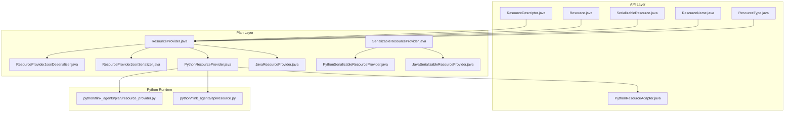
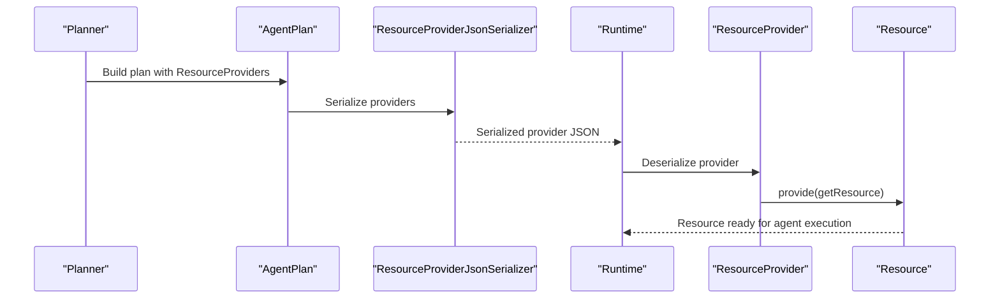
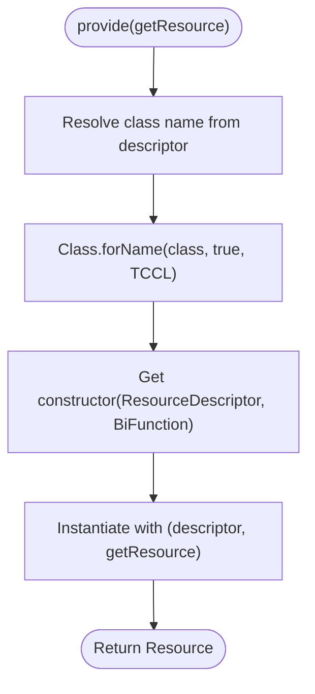
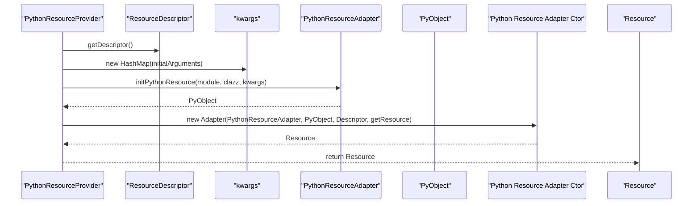
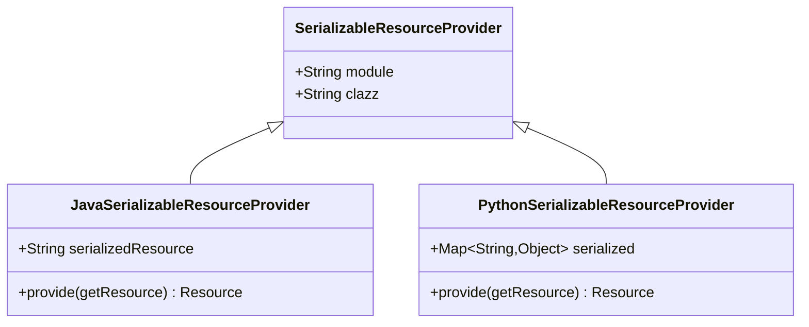
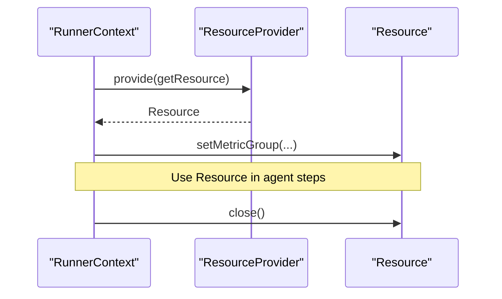
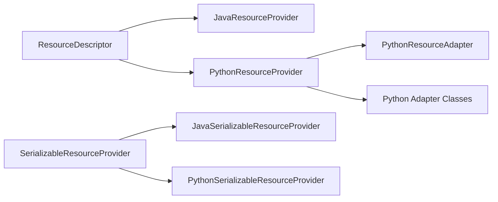

# Resource Provider Pattern

<cite>
**Referenced Files in This Document**
- [ResourceDescriptor.java](file://api/src/main/java/org/apache/flink/agents/api/resource/ResourceDescriptor.java)
- [Resource.java](file://api/src/main/java/org/apache/flink/agents/api/resource/Resource.java)
- [SerializableResource.java](file://api/src/main/java/org/apache/flink/agents/api/resource/SerializableResource.java)
- [ResourceName.java](file://api/src/main/java/org/apache/flink/agents/api/resource/ResourceName.java)
- [ResourceType.java](file://api/src/main/java/org/apache/flink/agents/api/resource/ResourceType.java)
- [ResourceProvider.java](file://plan/src/main/java/org/apache/flink/agents/plan/resourceprovider/ResourceProvider.java)
- [JavaResourceProvider.java](file://plan/src/main/java/org/apache/flink/agents/plan/resourceprovider/JavaResourceProvider.java)
- [PythonResourceProvider.java](file://plan/src/main/java/org/apache/flink/agents/plan/resourceprovider/PythonResourceProvider.java)
- [SerializableResourceProvider.java](file://plan/src/main/java/org/apache/flink/agents/plan/resourceprovider/SerializableResourceProvider.java)
- [JavaSerializableResourceProvider.java](file://plan/src/main/java/org/apache/flink/agents/plan/resourceprovider/JavaSerializableResourceProvider.java)
- [PythonSerializableResourceProvider.java](file://plan/src/main/java/org/apache/flink/agents/plan/resourceprovider/PythonSerializableResourceProvider.java)
- [ResourceProviderJsonSerializer.java](file://plan/src/main/java/org/apache/flink/agents/plan/serializer/ResourceProviderJsonSerializer.java)
- [ResourceProviderJsonDeserializer.java](file://plan/src/main/java/org/apache/flink/agents/plan/serializer/ResourceProviderJsonDeserializer.java)
- [PythonResourceAdapter.java](file://api/src/main/java/org/apache/flink/agents/api/resource/python/PythonResourceAdapter.java)
- [PythonMCPServer.java](file://plan/src/main/java/org/apache/flink/agents/plan/resource/python/PythonMCPServer.java)
- [PythonChatModelConnection.java](file://api/src/main/java/org/apache/flink/agents/api/chat/model/python/PythonChatModelConnection.java)
- [PythonChatModelSetup.java](file://api/src/main/java/org/apache/flink/agents/api/chat/model/python/PythonChatModelSetup.java)
- [PythonEmbeddingModelConnection.java](file://api/src/main/java/org/apache/flink/agents/api/embedding/model/python/PythonEmbeddingModelConnection.java)
- [PythonEmbeddingModelSetup.java](file://api/src/main/java/org/apache/flink/agents/api/embedding/model/python/PythonEmbeddingModelSetup.java)
- [PythonCollectionManageableVectorStore.java](file://api/src/main/java/org/apache/flink/agents/api/vectorstores/python/PythonCollectionManageableVectorStore.java)
- [PythonResource.java](file://python/flink_agents/api/resource.py)
- [resource_provider.py](file://python/flink_agents/plan/resource_provider.py)
- [AgentPlan.java](file://plan/src/main/java/org/apache/flink/agents/plan/AgentPlan.java)
- [RunnerContext.java](file://api/src/main/java/org/apache/flink/agents/api/context/RunnerContext.java)
</cite>

## Table of Contents
1. [Introduction](#introduction)
2. [Project Structure](#project-structure)
3. [Core Components](#core-components)
4. [Architecture Overview](#architecture-overview)
5. [Detailed Component Analysis](#detailed-component-analysis)
6. [Dependency Analysis](#dependency-analysis)
7. [Performance Considerations](#performance-considerations)
8. [Troubleshooting Guide](#troubleshooting-guide)
9. [Conclusion](#conclusion)
10. [Appendices](#appendices)

## Introduction
This document explains the resource provider pattern in Flink Agents. It focuses on how the resource provider abstraction integrates external services such as chat models, embedding models, tools, prompts, and vector stores. It documents ResourceDescriptor for defining resource metadata and configuration, describes JavaResourceProvider and PythonResourceProvider implementations, and clarifies resource registration, discovery, lifecycle management, and cross-language serialization. It also covers resource pooling, connection management, error handling, and how resources are bound during agent execution via agent plans.

## Project Structure
The resource provider pattern spans two layers:
- API layer: defines resource abstractions, descriptors, and resource names/types.
- Plan layer: implements resource providers and serializers/deserializers for plan persistence and transport.

**Diagram sources**
- [ResourceDescriptor.java](file://api/src/main/java/org/apache/flink/agents/api/resource/ResourceDescriptor.java#L28-L144)
- [Resource.java](file://api/src/main/java/org/apache/flink/agents/api/resource/Resource.java#L25-L71)
- [SerializableResource.java](file://api/src/main/java/org/apache/flink/agents/api/resource/SerializableResource.java#L25-L50)
- [ResourceName.java](file://api/src/main/java/org/apache/flink/agents/api/resource/ResourceName.java#L21-L185)
- [ResourceType.java](file://api/src/main/java/org/apache/flink/agents/api/resource/ResourceType.java#L21-L62)
- [ResourceProvider.java](file://plan/src/main/java/org/apache/flink/agents/plan/resourceprovider/ResourceProvider.java#L30-L76)
- [JavaResourceProvider.java](file://plan/src/main/java/org/apache/flink/agents/plan/resourceprovider/JavaResourceProvider.java#L28-L57)
- [PythonResourceProvider.java](file://plan/src/main/java/org/apache/flink/agents/plan/resourceprovider/PythonResourceProvider.java#L41-L149)
- [SerializableResourceProvider.java](file://plan/src/main/java/org/apache/flink/agents/plan/resourceprovider/SerializableResourceProvider.java#L23-L60)
- [JavaSerializableResourceProvider.java](file://plan/src/main/java/org/apache/flink/agents/plan/resourceprovider/JavaSerializableResourceProvider.java#L30-L96)
- [PythonSerializableResourceProvider.java](file://plan/src/main/java/org/apache/flink/agents/plan/resourceprovider/PythonSerializableResourceProvider.java#L31-L110)
- [ResourceProviderJsonSerializer.java](file://plan/src/main/java/org/apache/flink/agents/plan/serializer/ResourceProviderJsonSerializer.java)
- [ResourceProviderJsonDeserializer.java](file://plan/src/main/java/org/apache/flink/agents/plan/serializer/ResourceProviderJsonDeserializer.java)
- [PythonResourceAdapter.java](file://api/src/main/java/org/apache/flink/agents/api/resource/python/PythonResourceAdapter.java)
- [PythonResource.java](file://python/flink_agents/api/resource.py)
- [resource_provider.py](file://python/flink_agents/plan/resource_provider.py)

**Section sources**
- [ResourceDescriptor.java](file://api/src/main/java/org/apache/flink/agents/api/resource/ResourceDescriptor.java#L28-L144)
- [ResourceProvider.java](file://plan/src/main/java/org/apache/flink/agents/plan/resourceprovider/ResourceProvider.java#L30-L76)

## Core Components
- ResourceDescriptor: Encapsulates the target class, module path, and initial arguments for resource instantiation. Supports cross-language compatibility by allowing module specification for Python resources while preserving Java class names.
- Resource: Base abstract class for all resources. Provides lifecycle hooks (close), metric binding, and a callback to fetch other resources by name/type.
- SerializableResource: Extends Resource to ensure resources are JSON serializable for distribution and persistence.
- ResourceName: Centralized constants mapping logical resource kinds to concrete Java or Python implementation classes.
- ResourceType: Enumerates supported resource categories (e.g., chat model, embedding model, vector store, tool, prompt, MCP server).
- ResourceProvider: Abstract provider that carries metadata to instantiate a Resource at runtime. Supports JSON serialization/deserialization via dedicated serializers.
- JavaResourceProvider: Instantiates Java resources using reflection with the current thread’s context class loader.
- PythonResourceProvider: Creates Python-backed resources by initializing a Python object via a PythonResourceAdapter and wrapping it in a Resource adapter class.
- SerializableResourceProvider and its Java/Python variants: Providers that carry serialized forms of resources for cross-language distribution and lazy deserialization.

**Section sources**
- [ResourceDescriptor.java](file://api/src/main/java/org/apache/flink/agents/api/resource/ResourceDescriptor.java#L28-L144)
- [Resource.java](file://api/src/main/java/org/apache/flink/agents/api/resource/Resource.java#L25-L71)
- [SerializableResource.java](file://api/src/main/java/org/apache/flink/agents/api/resource/SerializableResource.java#L25-L50)
- [ResourceName.java](file://api/src/main/java/org/apache/flink/agents/api/resource/ResourceName.java#L21-L185)
- [ResourceType.java](file://api/src/main/java/org/apache/flink/agents/api/resource/ResourceType.java#L21-L62)
- [ResourceProvider.java](file://plan/src/main/java/org/apache/flink/agents/plan/resourceprovider/ResourceProvider.java#L30-L76)
- [JavaResourceProvider.java](file://plan/src/main/java/org/apache/flink/agents/plan/resourceprovider/JavaResourceProvider.java#L28-L57)
- [PythonResourceProvider.java](file://plan/src/main/java/org/apache/flink/agents/plan/resourceprovider/PythonResourceProvider.java#L41-L149)
- [SerializableResourceProvider.java](file://plan/src/main/java/org/apache/flink/agents/plan/resourceprovider/SerializableResourceProvider.java#L23-L60)
- [JavaSerializableResourceProvider.java](file://plan/src/main/java/org/apache/flink/agents/plan/resourceprovider/JavaSerializableResourceProvider.java#L30-L96)
- [PythonSerializableResourceProvider.java](file://plan/src/main/java/org/apache/flink/agents/plan/resourceprovider/PythonSerializableResourceProvider.java#L31-L110)

## Architecture Overview
The resource provider pattern separates resource definition (descriptors/providers) from runtime instantiation. Providers are serialized into the AgentPlan and deserialized at runtime to create Resource instances. For Python resources, a PythonResourceAdapter bridges Java and Python worlds.

**Diagram sources**
- [ResourceProvider.java](file://plan/src/main/java/org/apache/flink/agents/plan/resourceprovider/ResourceProvider.java#L30-L76)
- [ResourceProviderJsonSerializer.java](file://plan/src/main/java/org/apache/flink/agents/plan/serializer/ResourceProviderJsonSerializer.java)
- [ResourceProviderJsonDeserializer.java](file://plan/src/main/java/org/apache/flink/agents/plan/serializer/ResourceProviderJsonDeserializer.java)
- [AgentPlan.java](file://plan/src/main/java/org/apache/flink/agents/plan/AgentPlan.java)

## Detailed Component Analysis

### ResourceDescriptor
- Purpose: Define resource identity and initialization parameters.
- Fields:
  - target_clazz: Fully qualified Java class or simple Python class name.
  - target_module: Python module path for cross-language compatibility.
  - arguments: Initial arguments map for construction.
- Cross-language note: For Python resources declared from Java, module is provided separately; for Java resources, module is empty.

**Section sources**
- [ResourceDescriptor.java](file://api/src/main/java/org/apache/flink/agents/api/resource/ResourceDescriptor.java#L28-L144)

### Resource and SerializableResource
- Resource: Base contract for lifecycle and metrics. Provides close() hook and a getResource callback to fetch other resources by name/type.
- SerializableResource: Ensures resources can be serialized to JSON; validates serialization at runtime.

**Section sources**
- [Resource.java](file://api/src/main/java/org/apache/flink/agents/api/resource/Resource.java#L25-L71)
- [SerializableResource.java](file://api/src/main/java/org/apache/flink/agents/api/resource/SerializableResource.java#L25-L50)

### ResourceName and ResourceType
- ResourceType: Enumerates supported categories (chat_model, embedding_model, vector_store, tool, prompt, mcp_server).
- ResourceName: Provides canonical class names for Java and Python implementations. Includes nested Python inner classes for Python-specific resources.

**Section sources**
- [ResourceType.java](file://api/src/main/java/org/apache/flink/agents/api/resource/ResourceType.java#L21-L62)
- [ResourceName.java](file://api/src/main/java/org/apache/flink/agents/api/resource/ResourceName.java#L21-L185)

### ResourceProvider Abstraction
- Role: Carries metadata to instantiate a Resource at runtime. Supports JSON serialization via Jackson annotations.
- provide(getResource): Factory method receiving a helper to fetch other resources by name/type.

**Section sources**
- [ResourceProvider.java](file://plan/src/main/java/org/apache/flink/agents/plan/resourceprovider/ResourceProvider.java#L30-L76)

### JavaResourceProvider
- Behavior: Uses Class.forName with the current thread’s context class loader to load the target class. Invokes a constructor accepting ResourceDescriptor and a BiFunction getResource.
- Cross-language note: For Python resources declared from Java, initialArguments may contain a java_clazz override.

**Diagram sources**
- [JavaResourceProvider.java](file://plan/src/main/java/org/apache/flink/agents/plan/resourceprovider/JavaResourceProvider.java#L37-L51)

**Section sources**
- [JavaResourceProvider.java](file://plan/src/main/java/org/apache/flink/agents/plan/resourceprovider/JavaResourceProvider.java#L28-L57)

### PythonResourceProvider
- Behavior: Maps ResourceType to a Python-backed Resource adapter class. Requires a PythonResourceAdapter to initialize a PyObject from module and class. Builds kwargs from descriptor initialArguments and resolves module/class fallbacks.
- Special case: ResourceType.MCP_SERVER uses a fixed module/class mapping.
- Adapter classes include PythonChatModelConnection, PythonChatModelSetup, PythonEmbeddingModelConnection, PythonEmbeddingModelSetup, PythonCollectionManageableVectorStore, and PythonMCPServer.

**Diagram sources**
- [PythonResourceProvider.java](file://plan/src/main/java/org/apache/flink/agents/plan/resourceprovider/PythonResourceProvider.java#L76-L126)
- [PythonResourceAdapter.java](file://api/src/main/java/org/apache/flink/agents/api/resource/python/PythonResourceAdapter.java)
- [PythonChatModelConnection.java](file://api/src/main/java/org/apache/flink/agents/api/chat/model/python/PythonChatModelConnection.java)
- [PythonChatModelSetup.java](file://api/src/main/java/org/apache/flink/agents/api/chat/model/python/PythonChatModelSetup.java)
- [PythonEmbeddingModelConnection.java](file://api/src/main/java/org/apache/flink/agents/api/embedding/model/python/PythonEmbeddingModelConnection.java)
- [PythonEmbeddingModelSetup.java](file://api/src/main/java/org/apache/flink/agents/api/embedding/model/python/PythonEmbeddingModelSetup.java)
- [PythonCollectionManageableVectorStore.java](file://api/src/main/java/org/apache/flink/agents/api/vectorstores/python/PythonCollectionManageableVectorStore.java)
- [PythonMCPServer.java](file://plan/src/main/java/org/apache/flink/agents/plan/resource/python/PythonMCPServer.java)

**Section sources**
- [PythonResourceProvider.java](file://plan/src/main/java/org/apache/flink/agents/plan/resourceprovider/PythonResourceProvider.java#L41-L149)

### SerializableResourceProvider and Variants
- Purpose: Enable distribution of resources across processes by carrying serialized forms.
- JavaSerializableResourceProvider:
  - Stores serialized JSON of a SerializableResource.
  - Deserializes lazily on first provide() using the class loader.
- PythonSerializableResourceProvider:
  - Carries a serialized map for Python resources (e.g., Prompt, Tool).
  - Reconstructs resources on demand.

**Diagram sources**
- [SerializableResourceProvider.java](file://plan/src/main/java/org/apache/flink/agents/plan/resourceprovider/SerializableResourceProvider.java#L23-L60)
- [JavaSerializableResourceProvider.java](file://plan/src/main/java/org/apache/flink/agents/plan/resourceprovider/JavaSerializableResourceProvider.java#L30-L96)
- [PythonSerializableResourceProvider.java](file://plan/src/main/java/org/apache/flink/agents/plan/resourceprovider/PythonSerializableResourceProvider.java#L31-L110)

**Section sources**
- [JavaSerializableResourceProvider.java](file://plan/src/main/java/org/apache/flink/agents/plan/resourceprovider/JavaSerializableResourceProvider.java#L30-L96)
- [PythonSerializableResourceProvider.java](file://plan/src/main/java/org/apache/flink/agents/plan/resourceprovider/PythonSerializableResourceProvider.java#L31-L110)

### Serialization and Deserialization
- ResourceProvider is annotated for JSON serialization/deserialization. The plan layer provides dedicated serializers/deserializers to handle provider polymorphism.
- JavaSerializableResourceProvider and PythonSerializableResourceProvider encapsulate serialized forms for cross-language distribution.

**Section sources**
- [ResourceProvider.java](file://plan/src/main/java/org/apache/flink/agents/plan/resourceprovider/ResourceProvider.java#L36-L37)
- [ResourceProviderJsonSerializer.java](file://plan/src/main/java/org/apache/flink/agents/plan/serializer/ResourceProviderJsonSerializer.java)
- [ResourceProviderJsonDeserializer.java](file://plan/src/main/java/org/apache/flink/agents/plan/serializer/ResourceProviderJsonDeserializer.java)

### Resource Registration, Discovery, and Lifecycle
- Registration: Resources are registered as ResourceProvider entries in the AgentPlan. Each provider holds a name and type.
- Discovery: During execution, RunnerContext.getResource(name, type) invokes the provider’s provide(getResource) to obtain a Resource instance.
- Lifecycle: Resource.close() is the standard teardown hook. Metrics can be bound via Resource.setMetricGroup.

**Diagram sources**
- [RunnerContext.java](file://api/src/main/java/org/apache/flink/agents/api/context/RunnerContext.java)
- [Resource.java](file://api/src/main/java/org/apache/flink/agents/api/resource/Resource.java#L68-L70)

**Section sources**
- [Resource.java](file://api/src/main/java/org/apache/flink/agents/api/resource/Resource.java#L25-L71)
- [RunnerContext.java](file://api/src/main/java/org/apache/flink/agents/api/context/RunnerContext.java)

### Relationship Between Resource Providers and Agent Plans
- AgentPlan holds a collection of ResourceProvider instances. These are serialized into the plan and reconstructed at runtime.
- Execution binds resources by name/type using RunnerContext, enabling cross-resource references during agent execution.

**Section sources**
- [AgentPlan.java](file://plan/src/main/java/org/apache/flink/agents/plan/AgentPlan.java)
- [ResourceProvider.java](file://plan/src/main/java/org/apache/flink/agents/plan/resourceprovider/ResourceProvider.java#L30-L76)

## Dependency Analysis
- JavaResourceProvider depends on:
  - ResourceDescriptor for class/module resolution.
  - Current thread’s context class loader for dynamic class loading.
- PythonResourceProvider depends on:
  - PythonResourceAdapter to initialize Python objects.
  - ResourceType-to-adapter-class mapping for Python-backed resources.
- SerializableResourceProvider variants depend on:
  - ObjectMapper for Java serialization/deserialization.
  - Python-specific reconstruction utilities for Python resources.

**Diagram sources**
- [JavaResourceProvider.java](file://plan/src/main/java/org/apache/flink/agents/plan/resourceprovider/JavaResourceProvider.java#L37-L51)
- [PythonResourceProvider.java](file://plan/src/main/java/org/apache/flink/agents/plan/resourceprovider/PythonResourceProvider.java#L76-L126)
- [PythonResourceAdapter.java](file://api/src/main/java/org/apache/flink/agents/api/resource/python/PythonResourceAdapter.java)
- [SerializableResourceProvider.java](file://plan/src/main/java/org/apache/flink/agents/plan/resourceprovider/SerializableResourceProvider.java#L23-L60)
- [JavaSerializableResourceProvider.java](file://plan/src/main/java/org/apache/flink/agents/plan/resourceprovider/JavaSerializableResourceProvider.java#L80-L94)
- [PythonSerializableResourceProvider.java](file://plan/src/main/java/org/apache/flink/agents/plan/resourceprovider/PythonSerializableResourceProvider.java#L70-L84)

**Section sources**
- [JavaResourceProvider.java](file://plan/src/main/java/org/apache/flink/agents/plan/resourceprovider/JavaResourceProvider.java#L28-L57)
- [PythonResourceProvider.java](file://plan/src/main/java/org/apache/flink/agents/plan/resourceprovider/PythonResourceProvider.java#L41-L149)
- [SerializableResourceProvider.java](file://plan/src/main/java/org/apache/flink/agents/plan/resourceprovider/SerializableResourceProvider.java#L23-L60)

## Performance Considerations
- Reflection overhead: JavaResourceProvider uses reflection to load classes and construct resources. Consider caching Class and Constructor references if repeated instantiation occurs frequently.
- Lazy deserialization: JavaSerializableResourceProvider and PythonSerializableResourceProvider delay deserialization until first use, reducing startup cost.
- Python bridge costs: PythonResourceProvider relies on PythonResourceAdapter to initialize PyObject. Minimize repeated initialization and reuse adapters where possible.
- Connection pooling: For chat and embedding models, implement pooling at the adapter level to reduce connection churn. Manage pool lifecycle via Resource.close().
- Serialization size: Prefer compact serialized forms for resources. Validate and trim unnecessary fields in initialArguments.

## Troubleshooting Guide
- Unsupported resource type:
  - PythonResourceProvider throws an exception for unsupported types. Verify ResourceType matches supported values and adapter mapping.
- Missing PythonResourceAdapter:
  - PythonResourceProvider requires a configured adapter. Ensure setPythonResourceAdapter(...) is called before provide().
- Invalid Python class specification:
  - When module is not provided, pythonClazz must be present and formatted as "module.ClassName". Validate the format and ensure both parts are non-empty.
- Serialization errors:
  - SerializableResource.validateSerializable() checks JSON serializability. Fix non-serializable fields or make them transient.
- Class loading failures:
  - JavaResourceProvider uses the context class loader. Ensure the target class is on the classpath and visible to the current thread.
- Lifecycle cleanup:
  - Always call Resource.close() to release connections and pools. Implement robust teardown in custom resources.

**Section sources**
- [PythonResourceProvider.java](file://plan/src/main/java/org/apache/flink/agents/plan/resourceprovider/PythonResourceProvider.java#L76-L126)
- [JavaResourceProvider.java](file://plan/src/main/java/org/apache/flink/agents/plan/resourceprovider/JavaResourceProvider.java#L37-L51)
- [SerializableResource.java](file://api/src/main/java/org/apache/flink/agents/api/resource/SerializableResource.java#L34-L48)
- [Resource.java](file://api/src/main/java/org/apache/flink/agents/api/resource/Resource.java#L68-L70)

## Conclusion
The resource provider pattern in Flink Agents cleanly separates resource definition from runtime instantiation, supports both Java and Python implementations, and enables cross-language serialization. ResourceDescriptor and ResourceName define resource identity and mapping, while ResourceProvider implementations materialize resources at runtime. Serializable variants facilitate distribution and lazy initialization. Proper lifecycle management, connection pooling, and error handling ensure reliable integration with external services.

## Appendices

### Implementing a Custom Resource Provider
- For Java:
  - Extend ResourceProvider and implement provide(getResource) using reflection to instantiate your Resource subclass.
  - Use ResourceDescriptor to pass initialization parameters.
- For Python:
  - Extend ResourceProvider and implement provide(getResource) using PythonResourceAdapter to create a PyObject.
  - Map ResourceType to your Python adapter class and ensure module/class resolution is correct.
- Serialization:
  - For Java resources, prefer JavaSerializableResourceProvider to carry serialized forms.
  - For Python resources, use PythonSerializableResourceProvider with a serialized map.

**Section sources**
- [ResourceProvider.java](file://plan/src/main/java/org/apache/flink/agents/plan/resourceprovider/ResourceProvider.java#L30-L76)
- [JavaResourceProvider.java](file://plan/src/main/java/org/apache/flink/agents/plan/resourceprovider/JavaResourceProvider.java#L28-L57)
- [PythonResourceProvider.java](file://plan/src/main/java/org/apache/flink/agents/plan/resourceprovider/PythonResourceProvider.java#L41-L149)
- [JavaSerializableResourceProvider.java](file://plan/src/main/java/org/apache/flink/agents/plan/resourceprovider/JavaSerializableResourceProvider.java#L30-L96)
- [PythonSerializableResourceProvider.java](file://plan/src/main/java/org/apache/flink/agents/plan/resourceprovider/PythonSerializableResourceProvider.java#L31-L110)