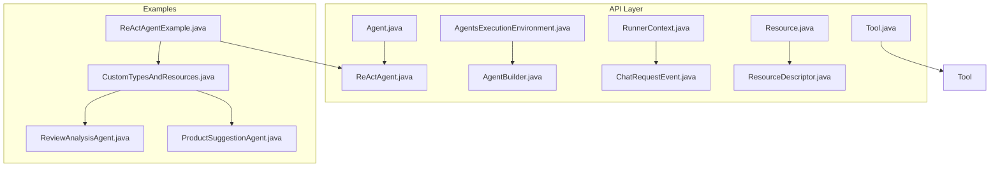
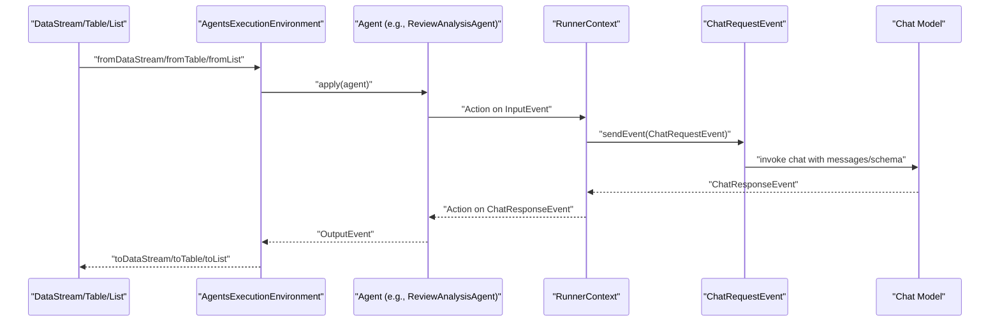
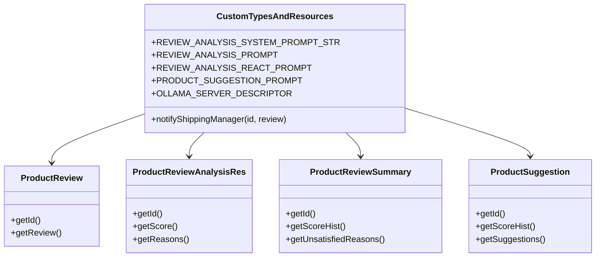
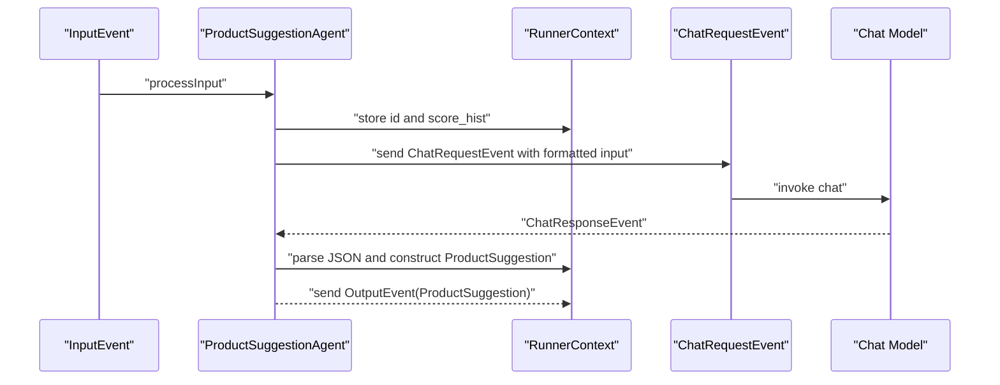
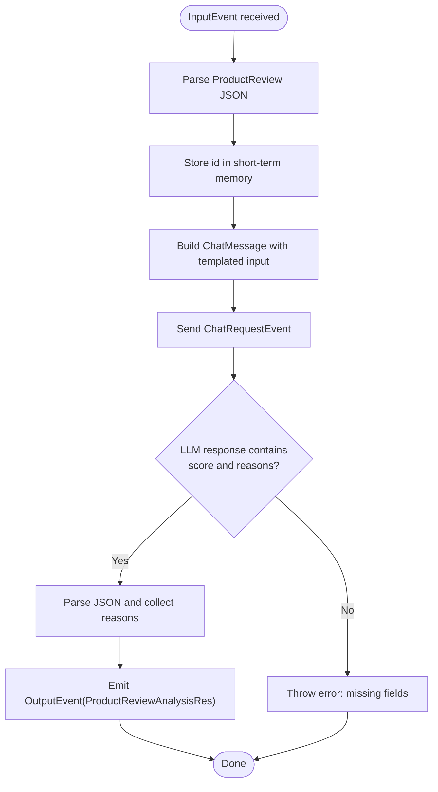
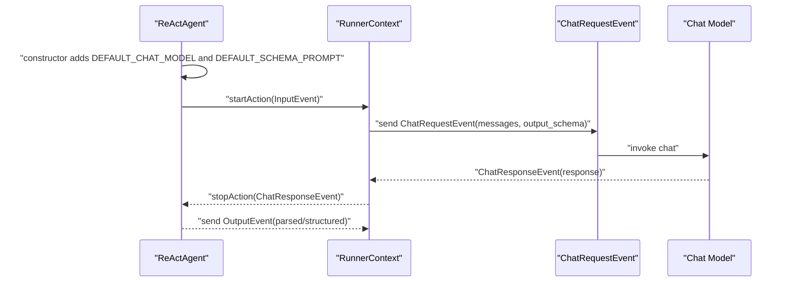
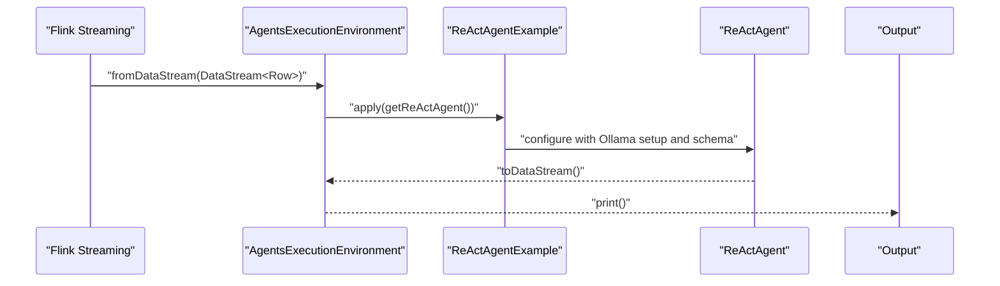
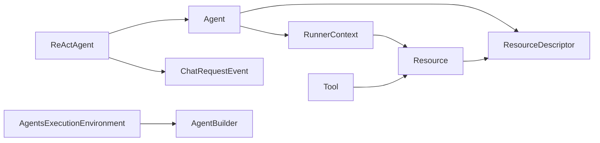

# Advanced Use Cases

<cite>
**Referenced Files in This Document**
- [Agent.java](file://api/src/main/java/org/apache/flink/agents/api/agents/Agent.java)
- [ReActAgent.java](file://api/src/main/java/org/apache/flink/agents/api/agents/ReActAgent.java)
- [AgentBuilder.java](file://api/src/main/java/org/apache/flink/agents/api/AgentBuilder.java)
- [AgentsExecutionEnvironment.java](file://api/src/main/java/org/apache/flink/agents/api/AgentsExecutionEnvironment.java)
- [RunnerContext.java](file://api/src/main/java/org/apache/flink/agents/api/context/RunnerContext.java)
- [ChatRequestEvent.java](file://api/src/main/java/org/apache/flink/agents/api/event/ChatRequestEvent.java)
- [Resource.java](file://api/src/main/java/org/apache/flink/agents/api/resource/Resource.java)
- [ResourceDescriptor.java](file://api/src/main/java/org/apache/flink/agents/api/resource/ResourceDescriptor.java)
- [Tool.java](file://api/src/main/java/org/apache/flink/agents/api/tools/Tool.java)
- [CustomTypesAndResources.java](file://examples/src/main/java/org/apache/flink/agents/examples/agents/CustomTypesAndResources.java)
- [ProductSuggestionAgent.java](file://examples/src/main/java/org/apache/flink/agents/examples/agents/ProductSuggestionAgent.java)
- [ReviewAnalysisAgent.java](file://examples/src/main/java/org/apache/flink/agents/examples/agents/ReviewAnalysisAgent.java)
- [ReActAgentExample.java](file://examples/src/main/java/org/apache/flink/agents/examples/ReActAgentExample.java)
</cite>

## Table of Contents
1. [Introduction](#introduction)
2. [Project Structure](#project-structure)
3. [Core Components](#core-components)
4. [Architecture Overview](#architecture-overview)
5. [Detailed Component Analysis](#detailed-component-analysis)
6. [Dependency Analysis](#dependency-analysis)
7. [Performance Considerations](#performance-considerations)
8. [Troubleshooting Guide](#troubleshooting-guide)
9. [Conclusion](#conclusion)
10. [Appendices](#appendices)

## Introduction
This document presents advanced use cases for Flink Agents, focusing on sophisticated agent configurations and integrations. It covers:
- CustomTypesAndResources for complex data modeling with POJOs and structured outputs
- ProductSuggestionAgent for recommendation systems using aggregated review analytics
- ReviewAnalysisAgent for sentiment analysis pipelines with tool invocation
- Advanced agent configurations, custom resource types, complex tool implementations, and integration patterns
- Detailed code-level analysis, performance considerations, scalability patterns, best practices, and production readiness guidance

## Project Structure
Flink Agents separates core APIs (agents, events, resources, tools, execution environments) from example agents and integrations. The examples demonstrate real-world scenarios such as review analysis and product suggestions, leveraging prompts, tools, and structured outputs.

**Diagram sources**
- [Agent.java](file://api/src/main/java/org/apache/flink/agents/api/agents/Agent.java#L34-L131)
- [ReActAgent.java](file://api/src/main/java/org/apache/flink/agents/api/agents/ReActAgent.java#L51-L183)
- [AgentBuilder.java](file://api/src/main/java/org/apache/flink/agents/api/AgentBuilder.java#L35-L77)
- [AgentsExecutionEnvironment.java](file://api/src/main/java/org/apache/flink/agents/api/AgentsExecutionEnvironment.java#L43-L223)
- [RunnerContext.java](file://api/src/main/java/org/apache/flink/agents/api/context/RunnerContext.java#L33-L138)
- [ChatRequestEvent.java](file://api/src/main/java/org/apache/flink/agents/api/event/ChatRequestEvent.java#L29-L58)
- [Resource.java](file://api/src/main/java/org/apache/flink/agents/api/resource/Resource.java#L30-L71)
- [ResourceDescriptor.java](file://api/src/main/java/org/apache/flink/agents/api/resource/ResourceDescriptor.java#L29-L144)
- [Tool.java](file://api/src/main/java/org/apache/flink/agents/api/tools/Tool.java#L30-L70)
- [CustomTypesAndResources.java](file://examples/src/main/java/org/apache/flink/agents/examples/agents/CustomTypesAndResources.java#L34-L265)
- [ProductSuggestionAgent.java](file://examples/src/main/java/org/apache/flink/agents/examples/agents/ProductSuggestionAgent.java#L52-L114)
- [ReviewAnalysisAgent.java](file://examples/src/main/java/org/apache/flink/agents/examples/agents/ReviewAnalysisAgent.java#L53-L132)
- [ReActAgentExample.java](file://examples/src/main/java/org/apache/flink/agents/examples/ReActAgentExample.java#L55-L161)

**Section sources**
- [Agent.java](file://api/src/main/java/org/apache/flink/agents/api/agents/Agent.java#L34-L131)
- [AgentsExecutionEnvironment.java](file://api/src/main/java/org/apache/flink/agents/api/AgentsExecutionEnvironment.java#L43-L223)
- [CustomTypesAndResources.java](file://examples/src/main/java/org/apache/flink/agents/examples/agents/CustomTypesAndResources.java#L34-L265)

## Core Components
- Agent: Base class for defining actions and resources. Supports adding actions and resources, and exposes error-handling strategy constants.
- ReActAgent: Built-in ReAct agent that orchestrates prompt formatting, structured output schema enforcement, and chat model requests.
- AgentsExecutionEnvironment: Factory and environment for integrating agents with Flink DataStream/Table/list inputs and remote/local execution.
- AgentBuilder: Fluent builder for converting agent outputs to DataStream, Table, or list.
- RunnerContext: Action-time context providing memory, metrics, resource access, configuration, and durable execution helpers.
- Resource and ResourceDescriptor: Abstractions for serializable resources and descriptors enabling cross-language and cross-platform compatibility.
- Tool: Base class for tools with metadata, type, and call semantics.
- Events: ChatRequestEvent and others drive inter-agent communication and model interactions.

**Section sources**
- [Agent.java](file://api/src/main/java/org/apache/flink/agents/api/agents/Agent.java#L34-L131)
- [ReActAgent.java](file://api/src/main/java/org/apache/flink/agents/api/agents/ReActAgent.java#L51-L183)
- [AgentsExecutionEnvironment.java](file://api/src/main/java/org/apache/flink/agents/api/AgentsExecutionEnvironment.java#L43-L223)
- [AgentBuilder.java](file://api/src/main/java/org/apache/flink/agents/api/AgentBuilder.java#L35-L77)
- [RunnerContext.java](file://api/src/main/java/org/apache/flink/agents/api/context/RunnerContext.java#L33-L138)
- [Resource.java](file://api/src/main/java/org/apache/flink/agents/api/resource/Resource.java#L30-L71)
- [ResourceDescriptor.java](file://api/src/main/java/org/apache/flink/agents/api/resource/ResourceDescriptor.java#L29-L144)
- [Tool.java](file://api/src/main/java/org/apache/flink/agents/api/tools/Tool.java#L30-L70)
- [ChatRequestEvent.java](file://api/src/main/java/org/apache/flink/agents/api/event/ChatRequestEvent.java#L29-L58)

## Architecture Overview
The system follows an event-driven architecture:
- Agents define actions listening to specific events (e.g., InputEvent, ChatResponseEvent).
- Actions use RunnerContext to send downstream events (e.g., ChatRequestEvent).
- Resources (chat models, tools, prompts) are registered via ResourceDescriptor and retrieved by name/type.
- Execution environments bridge agents with Flink pipelines (DataStream/Table/list).

**Diagram sources**
- [AgentsExecutionEnvironment.java](file://api/src/main/java/org/apache/flink/agents/api/AgentsExecutionEnvironment.java#L139-L198)
- [Agent.java](file://api/src/main/java/org/apache/flink/agents/api/agents/Agent.java#L34-L131)
- [RunnerContext.java](file://api/src/main/java/org/apache/flink/agents/api/context/RunnerContext.java#L39-L133)
- [ChatRequestEvent.java](file://api/src/main/java/org/apache/flink/agents/api/event/ChatRequestEvent.java#L29-L58)
- [ReviewAnalysisAgent.java](file://examples/src/main/java/org/apache/flink/agents/examples/agents/ReviewAnalysisAgent.java#L89-L131)

## Detailed Component Analysis

### CustomTypesAndResources: Complex Data Modeling
This example defines:
- POJOs for ProductReview, ProductReviewAnalysisRes, ProductReviewSummary, and ProductSuggestion
- Prompts for review analysis and product suggestion
- A tool for notifying shipping managers
- ResourceDescriptor for Ollama chat model connection

Key patterns:
- Jackson annotations enable serialization/deserialization for cross-language compatibility
- Structured POJOs enforce schema contracts for downstream agents
- Prompts encapsulate system/user roles and templated inputs
- ResourceDescriptor centralizes configuration for chat model connections

**Diagram sources**
- [CustomTypesAndResources.java](file://examples/src/main/java/org/apache/flink/agents/examples/agents/CustomTypesAndResources.java#L34-L265)

**Section sources**
- [CustomTypesAndResources.java](file://examples/src/main/java/org/apache/flink/agents/examples/agents/CustomTypesAndResources.java#L34-L265)

### ProductSuggestionAgent: Recommendation Systems
This agent:
- Receives aggregated review summaries (score histogram and dissatisfaction reasons)
- Builds a structured prompt and sends a chat request
- Parses the LLM response into ProductSuggestion POJO
- Emits OutputEvent with structured suggestion data

Advanced configurations:
- Uses @ChatModelSetup to register a chat model resource with extraction of reasoning and a named prompt
- Uses @Prompt to register a reusable prompt resource
- Stores transient state in short-term memory for downstream parsing

**Diagram sources**
- [ProductSuggestionAgent.java](file://examples/src/main/java/org/apache/flink/agents/examples/agents/ProductSuggestionAgent.java#L52-L114)
- [RunnerContext.java](file://api/src/main/java/org/apache/flink/agents/api/context/RunnerContext.java#L39-L133)
- [ChatRequestEvent.java](file://api/src/main/java/org/apache/flink/agents/api/event/ChatRequestEvent.java#L29-L58)

**Section sources**
- [ProductSuggestionAgent.java](file://examples/src/main/java/org/apache/flink/agents/examples/agents/ProductSuggestionAgent.java#L52-L114)

### ReviewAnalysisAgent: Sentiment Analysis Pipelines with Tools
This agent:
- Accepts ProductReview input and constructs a user message
- Optionally invokes a tool (notifyShippingManager) when shipping-related dissatisfaction is detected
- Enforces structured output parsing and emits ProductReviewAnalysisRes

Complex tool implementation:
- Declares a tool via @Tool with @ToolParam annotations
- Integrates tools into the chat model setup via the tools argument
- Uses extract_reasoning to guide the model to produce structured reasoning and results

**Diagram sources**
- [ReviewAnalysisAgent.java](file://examples/src/main/java/org/apache/flink/agents/examples/agents/ReviewAnalysisAgent.java#L89-L131)

**Section sources**
- [ReviewAnalysisAgent.java](file://examples/src/main/java/org/apache/flink/agents/examples/agents/ReviewAnalysisAgent.java#L53-L132)

### ReActAgent: Structured Outputs and Schema Enforcement
ReActAgent:
- Adds a default chat model resource and optional schema/prompt resources
- Converts diverse input types (primitive, Row, POJO) to ChatMessage via prompts
- Enforces JSON schema for structured outputs and forwards structured results to downstream actions

**Diagram sources**
- [ReActAgent.java](file://api/src/main/java/org/apache/flink/agents/api/agents/ReActAgent.java#L59-L183)
- [ChatRequestEvent.java](file://api/src/main/java/org/apache/flink/agents/api/event/ChatRequestEvent.java#L29-L58)

**Section sources**
- [ReActAgent.java](file://api/src/main/java/org/apache/flink/agents/api/agents/ReActAgent.java#L51-L183)

### End-to-End Example: ReActAgentExample
This example:
- Registers Ollama chat model connection and a tool
- Reads streaming data, maps to Row, applies ReActAgent, and prints results
- Demonstrates NUM_ASYNC_THREADS tuning for throughput control

**Diagram sources**
- [ReActAgentExample.java](file://examples/src/main/java/org/apache/flink/agents/examples/ReActAgentExample.java#L81-L161)
- [ReActAgent.java](file://api/src/main/java/org/apache/flink/agents/api/agents/ReActAgent.java#L59-L101)

**Section sources**
- [ReActAgentExample.java](file://examples/src/main/java/org/apache/flink/agents/examples/ReActAgentExample.java#L55-L161)

## Dependency Analysis
- Agent depends on RunnerContext for event emission and memory access; actions are registered statically and mapped to methods.
- ReActAgent composes prompts and chat model resources, forwarding structured outputs to downstream actions.
- AgentsExecutionEnvironment provides factory methods to select local vs remote execution environments and registers resources globally.
- RunnerContext exposes memory, metrics, configuration, and durable execution primitives.
- ResourceDescriptor enables cross-language resource provisioning and tool registration.

**Diagram sources**
- [Agent.java](file://api/src/main/java/org/apache/flink/agents/api/agents/Agent.java#L34-L131)
- [ReActAgent.java](file://api/src/main/java/org/apache/flink/agents/api/agents/ReActAgent.java#L51-L183)
- [AgentsExecutionEnvironment.java](file://api/src/main/java/org/apache/flink/agents/api/AgentsExecutionEnvironment.java#L43-L223)
- [RunnerContext.java](file://api/src/main/java/org/apache/flink/agents/api/context/RunnerContext.java#L33-L138)
- [ResourceDescriptor.java](file://api/src/main/java/org/apache/flink/agents/api/resource/ResourceDescriptor.java#L29-L144)
- [Tool.java](file://api/src/main/java/org/apache/flink/agents/api/tools/Tool.java#L30-L70)

**Section sources**
- [Agent.java](file://api/src/main/java/org/apache/flink/agents/api/agents/Agent.java#L34-L131)
- [AgentsExecutionEnvironment.java](file://api/src/main/java/org/apache/flink/agents/api/AgentsExecutionEnvironment.java#L207-L221)

## Performance Considerations
- Concurrency control: Limit asynchronous threads to prevent overload on external models (e.g., Ollama). See NUM_ASYNC_THREADS usage in the example.
- Throughput tuning: Adjust batch sizes and watermark strategies for streaming sources to balance latency and throughput.
- Memory usage: Prefer short-term memory for transient state and avoid storing large objects unnecessarily.
- Metrics: Use action and agent metric groups to monitor latency, failures, and token usage.
- Serialization overhead: Keep POJO schemas compact and aligned with output schemas to reduce parsing costs.

[No sources needed since this section provides general guidance]

## Troubleshooting Guide
Common issues and strategies:
- Missing fields in structured outputs: Validate JSON schema and ensure prompts require explicit fields (e.g., score and reasons).
- Tool invocation failures: Verify tool registration via ResourceDescriptor and ensure tool names match those referenced in chat model setup.
- Resource conflicts: Avoid duplicate resource names per type; the environment and agent builders throw errors on duplicates.
- Prompt mismatches: Ensure user/system prompts align with input types (primitive, Row, POJO) and provide adequate templates.
- Async limits: If external services throttle or timeout, reduce NUM_ASYNC_THREADS and add retry/backoff logic at the RunnerContext level.

**Section sources**
- [ReviewAnalysisAgent.java](file://examples/src/main/java/org/apache/flink/agents/examples/agents/ReviewAnalysisAgent.java#L113-L116)
- [AgentsExecutionEnvironment.java](file://api/src/main/java/org/apache/flink/agents/api/AgentsExecutionEnvironment.java#L207-L221)
- [Agent.java](file://api/src/main/java/org/apache/flink/agents/api/agents/Agent.java#L97-L111)

## Conclusion
Flink Agents enables robust, scalable AI pipelines by combining:
- Strongly-typed data models and structured outputs
- Flexible prompt/tool/resource composition
- Seamless integration with Flink DataStream/Table/list
- Event-driven orchestration with durable execution support

The advanced use cases demonstrated here provide a blueprint for building production-grade recommendation systems and sentiment analysis pipelines with extensible tooling and resilient execution.

[No sources needed since this section summarizes without analyzing specific files]

## Appendices

### Best Practices for Production Use
- Define clear POJO schemas and enforce them via output schemas to ensure downstream consumers remain stable.
- Centralize resource configuration using ResourceDescriptor and environment-level registration.
- Use short-term memory sparingly; persist long-lived state in long-term memory or external stores.
- Instrument metrics and logs around tool invocations and model calls for observability.
- Implement retry and circuit breaker patterns for external model calls; leverage durableExecute for idempotent operations.
- Validate prompts and tool descriptions regularly to maintain accuracy and safety.

[No sources needed since this section provides general guidance]