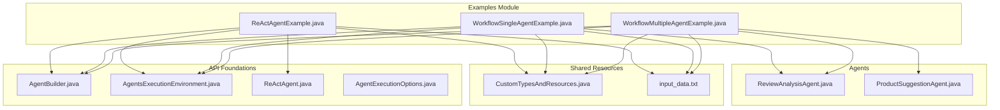
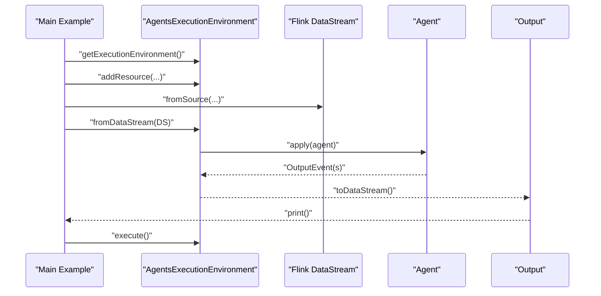
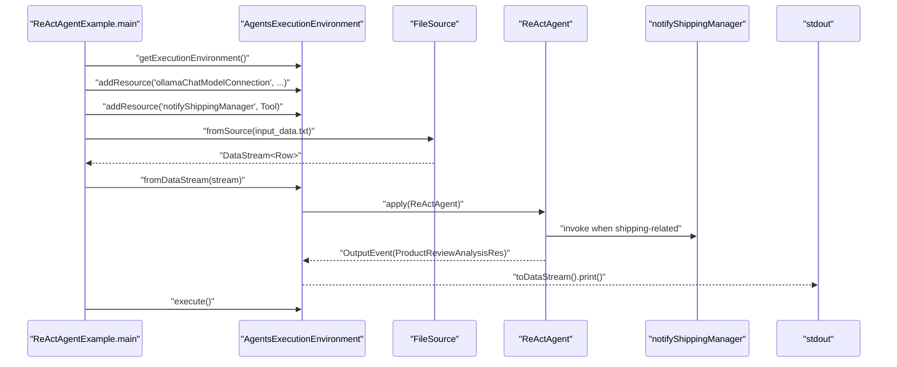
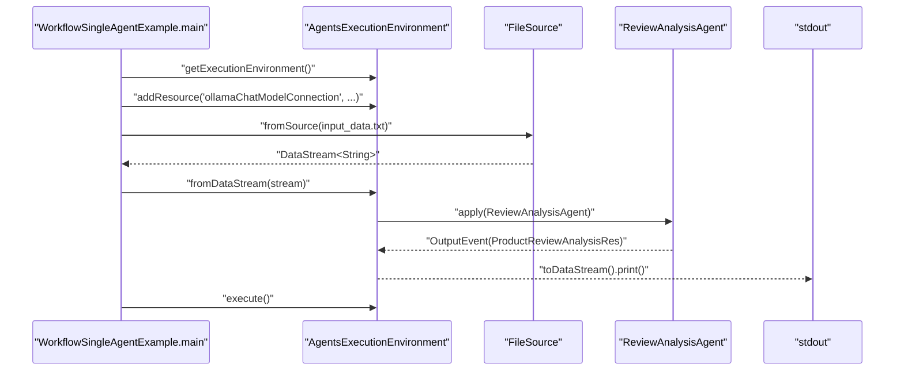
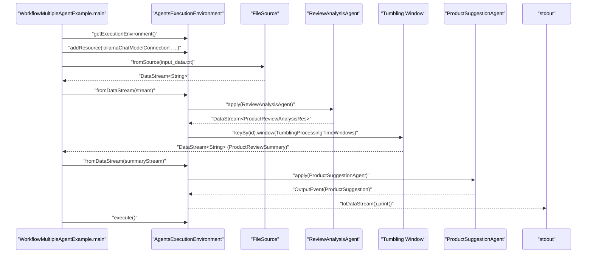
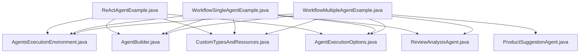

# Basic Examples

<cite>
**Referenced Files in This Document**
- [ReActAgentExample.java](file://examples/src/main/java/org/apache/flink/agents/examples/ReActAgentExample.java)
- [WorkflowSingleAgentExample.java](file://examples/src/main/java/org/apache/flink/agents/examples/WorkflowSingleAgentExample.java)
- [WorkflowMultipleAgentExample.java](file://examples/src/main/java/org/apache/flink/agents/examples/WorkflowMultipleAgentExample.java)
- [ReviewAnalysisAgent.java](file://examples/src/main/java/org/apache/flink/agents/examples/agents/ReviewAnalysisAgent.java)
- [ProductSuggestionAgent.java](file://examples/src/main/java/org/apache/flink/agents/examples/agents/ProductSuggestionAgent.java)
- [CustomTypesAndResources.java](file://examples/src/main/java/org/apache/flink/agents/examples/agents/CustomTypesAndResources.java)
- [input_data.txt](file://examples/src/main/resources/input_data.txt)
- [AgentBuilder.java](file://api/src/main/java/org/apache/flink/agents/api/AgentBuilder.java)
- [AgentsExecutionEnvironment.java](file://api/src/main/java/org/apache/flink/agents/api/AgentsExecutionEnvironment.java)
- [ReActAgent.java](file://api/src/main/java/org/apache/flink/agents/api/agents/ReActAgent.java)
- [AgentExecutionOptions.java](file://api/src/main/java/org/apache/flink/agents/api/agents/AgentExecutionOptions.java)
</cite>

## Table of Contents
1. [Introduction](#introduction)
2. [Project Structure](#project-structure)
3. [Core Components](#core-components)
4. [Architecture Overview](#architecture-overview)
5. [Detailed Component Analysis](#detailed-component-analysis)
6. [Dependency Analysis](#dependency-analysis)
7. [Performance Considerations](#performance-considerations)
8. [Troubleshooting Guide](#troubleshooting-guide)
9. [Conclusion](#conclusion)

## Introduction
This document provides comprehensive basic examples for Flink Agents, focusing on three fundamental scenarios:
- ReActAgentExample: Demonstrates a ReAct agent performing product review analysis and shipping notifications.
- WorkflowSingleAgentExample: Demonstrates a single workflow agent analyzing product reviews in a streaming pipeline.
- WorkflowMultipleAgentExample: Demonstrates multi-agent orchestration with windowed aggregation and product improvement suggestions.

The examples showcase streaming data ingestion, agent configuration, tool integration, and output processing. They are designed to be runnable with minimal prerequisites and serve as practical starting points for building agentic AI applications on Apache Flink.

## Project Structure
The examples are organized under the examples module, with the following key elements:
- Example entry points: ReActAgentExample, WorkflowSingleAgentExample, WorkflowMultipleAgentExample
- Agent implementations: ReviewAnalysisAgent, ProductSuggestionAgent
- Shared resources and types: CustomTypesAndResources
- Streaming input data: input_data.txt
- API foundations: AgentBuilder, AgentsExecutionEnvironment, ReActAgent, AgentExecutionOptions

**Diagram sources**
- [ReActAgentExample.java](file://examples/src/main/java/org/apache/flink/agents/examples/ReActAgentExample.java#L1-L161)
- [WorkflowSingleAgentExample.java](file://examples/src/main/java/org/apache/flink/agents/examples/WorkflowSingleAgentExample.java#L1-L123)
- [WorkflowMultipleAgentExample.java](file://examples/src/main/java/org/apache/flink/agents/examples/WorkflowMultipleAgentExample.java#L1-L190)
- [ReviewAnalysisAgent.java](file://examples/src/main/java/org/apache/flink/agents/examples/agents/ReviewAnalysisAgent.java#L1-L132)
- [ProductSuggestionAgent.java](file://examples/src/main/java/org/apache/flink/agents/examples/agents/ProductSuggestionAgent.java#L1-L114)
- [CustomTypesAndResources.java](file://examples/src/main/java/org/apache/flink/agents/examples/agents/CustomTypesAndResources.java#L1-L265)
- [AgentBuilder.java](file://api/src/main/java/org/apache/flink/agents/api/AgentBuilder.java#L1-L77)
- [AgentsExecutionEnvironment.java](file://api/src/main/java/org/apache/flink/agents/api/AgentsExecutionEnvironment.java#L1-L223)
- [ReActAgent.java](file://api/src/main/java/org/apache/flink/agents/api/agents/ReActAgent.java#L54-L61)
- [AgentExecutionOptions.java](file://api/src/main/java/org/apache/flink/agents/api/agents/AgentExecutionOptions.java#L30-L47)

**Section sources**
- [ReActAgentExample.java](file://examples/src/main/java/org/apache/flink/agents/examples/ReActAgentExample.java#L1-L161)
- [WorkflowSingleAgentExample.java](file://examples/src/main/java/org/apache/flink/agents/examples/WorkflowSingleAgentExample.java#L1-L123)
- [WorkflowMultipleAgentExample.java](file://examples/src/main/java/org/apache/flink/agents/examples/WorkflowMultipleAgentExample.java#L1-L190)
- [AgentBuilder.java](file://api/src/main/java/org/apache/flink/agents/api/AgentBuilder.java#L1-L77)
- [AgentsExecutionEnvironment.java](file://api/src/main/java/org/apache/flink/agents/api/AgentsExecutionEnvironment.java#L1-L223)

## Core Components
This section outlines the foundational components used across the basic examples.

- AgentsExecutionEnvironment: The primary integration point for Flink Agents with Flink’s streaming environment. It manages resources, configuration, and pipeline execution.
- AgentBuilder: Provides a fluent API to configure agent inputs and outputs, supporting DataStream, Table, and list-based execution modes.
- ReActAgent: A specialized agent that performs reasoning and acting steps, configured with a chat model and optional tools.
- AgentExecutionOptions: Configuration options controlling asynchronous execution behavior, including thread limits and retry policies.

Key responsibilities:
- Resource registration: Adding chat model connections and tools to the execution environment.
- Pipeline orchestration: Integrating agents with Flink DataStreams and managing execution lifecycle.
- Output handling: Converting agent outputs to DataStream, Table, or list formats.

**Section sources**
- [AgentsExecutionEnvironment.java](file://api/src/main/java/org/apache/flink/agents/api/AgentsExecutionEnvironment.java#L43-L223)
- [AgentBuilder.java](file://api/src/main/java/org/apache/flink/agents/api/AgentBuilder.java#L29-L77)
- [ReActAgent.java](file://api/src/main/java/org/apache/flink/agents/api/agents/ReActAgent.java#L54-L61)
- [AgentExecutionOptions.java](file://api/src/main/java/org/apache/flink/agents/api/agents/AgentExecutionOptions.java#L30-L47)

## Architecture Overview
The examples follow a consistent architecture:
- Streaming ingestion: Data is ingested from a file source into a Flink DataStream.
- Agent integration: Agents are integrated via AgentsExecutionEnvironment and AgentBuilder.
- Execution: The pipeline is executed through AgentsExecutionEnvironment.execute().
- Output: Results are printed to stdout for demonstration.

**Diagram sources**
- [WorkflowSingleAgentExample.java](file://examples/src/main/java/org/apache/flink/agents/examples/WorkflowSingleAgentExample.java#L52-L92)
- [WorkflowMultipleAgentExample.java](file://examples/src/main/java/org/apache/flink/agents/examples/WorkflowMultipleAgentExample.java#L126-L188)
- [ReActAgentExample.java](file://examples/src/main/java/org/apache/flink/agents/examples/ReActAgentExample.java#L81-L146)
- [AgentsExecutionEnvironment.java](file://api/src/main/java/org/apache/flink/agents/api/AgentsExecutionEnvironment.java#L109-L198)
- [AgentBuilder.java](file://api/src/main/java/org/apache/flink/agents/api/AgentBuilder.java#L43-L76)

## Detailed Component Analysis

### ReActAgentExample
This example demonstrates a ReAct agent that analyzes product reviews and can trigger a shipping notification tool when negative reviews mention shipping issues.

- Streaming data source: Reads input_data.txt as a file source and maps each line to a Row with fields id and review.
- Agent configuration: Uses ReActAgent with a chat model connection and a tool named notifyShippingManager.
- Tool integration: The notifyShippingManager tool is registered and invoked by the agent when appropriate.
- Output processing: Results are printed to stdout.

**Diagram sources**
- [ReActAgentExample.java](file://examples/src/main/java/org/apache/flink/agents/examples/ReActAgentExample.java#L81-L146)
- [CustomTypesAndResources.java](file://examples/src/main/java/org/apache/flink/agents/examples/agents/CustomTypesAndResources.java#L112-L117)
- [CustomTypesAndResources.java](file://examples/src/main/java/org/apache/flink/agents/examples/agents/CustomTypesAndResources.java#L103-L110)

Step-by-step walkthrough:
1. Environment setup: Create StreamExecutionEnvironment and AgentsExecutionEnvironment.
2. Resource registration: Register the Ollama chat model connection and the notifyShippingManager tool.
3. Data ingestion: Configure FileSource to read input_data.txt and map to Row.
4. Agent creation: Instantiate ReActAgent with a chat model descriptor and a prompt.
5. Pipeline execution: Apply the agent to the DataStream and convert outputs to DataStream.
6. Output: Print results to stdout.
7. Execution: Call agentsEnv.execute() to start the pipeline.

Prerequisites and setup:
- Java 11+ and Maven for building.
- Ollama server running locally at http://localhost:11434.
- Model qwen3:8b pulled locally.
- input_data.txt present in resources.

Expected outputs:
- For each review, the agent prints a ProductReviewAnalysisRes object containing id, score, and reasons.
- If the review mentions shipping issues, the agent invokes notifyShippingManager and prints a shipping notification message.

**Section sources**
- [ReActAgentExample.java](file://examples/src/main/java/org/apache/flink/agents/examples/ReActAgentExample.java#L55-L161)
- [CustomTypesAndResources.java](file://examples/src/main/java/org/apache/flink/agents/examples/agents/CustomTypesAndResources.java#L36-L71)
- [input_data.txt](file://examples/src/main/resources/input_data.txt#L1-L3163)

### WorkflowSingleAgentExample
This example showcases a single workflow agent that analyzes product reviews and prints results to stdout.

- Streaming data source: Reads input_data.txt as a file source and passes raw strings to the agent.
- Agent configuration: Uses ReviewAnalysisAgent with a chat model setup and a prompt.
- Tool integration: The agent can invoke notifyShippingManager via the chat model setup.
- Output processing: Converts agent outputs to DataStream and prints to stdout.

**Diagram sources**
- [WorkflowSingleAgentExample.java](file://examples/src/main/java/org/apache/flink/agents/examples/WorkflowSingleAgentExample.java#L52-L92)
- [ReviewAnalysisAgent.java](file://examples/src/main/java/org/apache/flink/agents/examples/agents/ReviewAnalysisAgent.java#L53-L132)
- [CustomTypesAndResources.java](file://examples/src/main/java/org/apache/flink/agents/examples/agents/CustomTypesAndResources.java#L112-L117)

Step-by-step walkthrough:
1. Environment setup: Create StreamExecutionEnvironment and AgentsExecutionEnvironment.
2. Resource registration: Register the Ollama chat model connection.
3. Data ingestion: Configure FileSource to read input_data.txt as a DataStream<String>.
4. Agent application: Apply ReviewAnalysisAgent to the DataStream.
5. Output: Convert outputs to DataStream and print to stdout.
6. Execution: Call agentsEnv.execute() to start the pipeline.

Prerequisites and setup:
- Java 11+ and Maven for building.
- Ollama server running locally at http://localhost:11434.
- Model qwen3:8b pulled locally.
- input_data.txt present in resources.

Expected outputs:
- For each review, the agent prints a ProductReviewAnalysisRes object containing id, score, and reasons.

**Section sources**
- [WorkflowSingleAgentExample.java](file://examples/src/main/java/org/apache/flink/agents/examples/WorkflowSingleAgentExample.java#L51-L92)
- [ReviewAnalysisAgent.java](file://examples/src/main/java/org/apache/flink/agents/examples/agents/ReviewAnalysisAgent.java#L53-L132)

### WorkflowMultipleAgentExample
This example demonstrates multi-agent orchestration with windowed aggregation and product improvement suggestions.

- Streaming data source: Reads input_data.txt as a file source and passes raw strings to the first agent.
- First agent: ReviewAnalysisAgent extracts scores and reasons from each review.
- Windowed aggregation: Tumbling processing-time windows aggregate results by product id, computing score distributions and collecting reasons.
- Second agent: ProductSuggestionAgent generates actionable product improvement suggestions based on aggregated data.
- Output processing: Prints final suggestions to stdout.

**Diagram sources**
- [WorkflowMultipleAgentExample.java](file://examples/src/main/java/org/apache/flink/agents/examples/WorkflowMultipleAgentExample.java#L126-L188)
- [ReviewAnalysisAgent.java](file://examples/src/main/java/org/apache/flink/agents/examples/agents/ReviewAnalysisAgent.java#L53-L132)
- [ProductSuggestionAgent.java](file://examples/src/main/java/org/apache/flink/agents/examples/agents/ProductSuggestionAgent.java#L52-L114)
- [CustomTypesAndResources.java](file://examples/src/main/java/org/apache/flink/agents/examples/agents/CustomTypesAndResources.java#L112-L117)

Step-by-step walkthrough:
1. Environment setup: Create StreamExecutionEnvironment and AgentsExecutionEnvironment.
2. Resource registration: Register the Ollama chat model connection.
3. Data ingestion: Configure FileSource to read input_data.txt as a DataStream<String>.
4. First agent: Apply ReviewAnalysisAgent to extract scores and reasons.
5. Windowed aggregation: Use a ProcessWindowFunction to compute score distributions and collect reasons per product id.
6. Second agent: Apply ProductSuggestionAgent to generate improvement suggestions based on aggregated summaries.
7. Output: Print final suggestions to stdout.
8. Execution: Call agentsEnv.execute() to start the pipeline.

Prerequisites and setup:
- Java 11+ and Maven for building.
- Ollama server running locally at http://localhost:11434.
- Model qwen3:8b pulled locally.
- input_data.txt present in resources.

Expected outputs:
- Intermediate: Per-product score distributions and collected reasons.
- Final: ProductSuggestion objects containing actionable improvement suggestions.

**Section sources**
- [WorkflowMultipleAgentExample.java](file://examples/src/main/java/org/apache/flink/agents/examples/WorkflowMultipleAgentExample.java#L64-L190)
- [ProductSuggestionAgent.java](file://examples/src/main/java/org/apache/flink/agents/examples/agents/ProductSuggestionAgent.java#L52-L114)

## Dependency Analysis
The examples share common dependencies and patterns:
- AgentsExecutionEnvironment is used to integrate with Flink and manage resources.
- AgentBuilder provides a unified interface for applying agents to DataStreams.
- CustomTypesAndResources centralizes prompts, tools, and data models.
- AgentExecutionOptions controls asynchronous execution behavior.

**Diagram sources**
- [AgentsExecutionEnvironment.java](file://api/src/main/java/org/apache/flink/agents/api/AgentsExecutionEnvironment.java#L43-L223)
- [AgentBuilder.java](file://api/src/main/java/org/apache/flink/agents/api/AgentBuilder.java#L29-L77)
- [ReActAgentExample.java](file://examples/src/main/java/org/apache/flink/agents/examples/ReActAgentExample.java#L81-L146)
- [WorkflowSingleAgentExample.java](file://examples/src/main/java/org/apache/flink/agents/examples/WorkflowSingleAgentExample.java#L52-L92)
- [WorkflowMultipleAgentExample.java](file://examples/src/main/java/org/apache/flink/agents/examples/WorkflowMultipleAgentExample.java#L126-L188)
- [ReviewAnalysisAgent.java](file://examples/src/main/java/org/apache/flink/agents/examples/agents/ReviewAnalysisAgent.java#L53-L132)
- [ProductSuggestionAgent.java](file://examples/src/main/java/org/apache/flink/agents/examples/agents/ProductSuggestionAgent.java#L52-L114)
- [CustomTypesAndResources.java](file://examples/src/main/java/org/apache/flink/agents/examples/agents/CustomTypesAndResources.java#L112-L117)
- [AgentExecutionOptions.java](file://api/src/main/java/org/apache/flink/agents/api/agents/AgentExecutionOptions.java#L30-L47)

**Section sources**
- [AgentsExecutionEnvironment.java](file://api/src/main/java/org/apache/flink/agents/api/AgentsExecutionEnvironment.java#L43-L223)
- [AgentBuilder.java](file://api/src/main/java/org/apache/flink/agents/api/AgentBuilder.java#L29-L77)
- [AgentExecutionOptions.java](file://api/src/main/java/org/apache/flink/agents/api/agents/AgentExecutionOptions.java#L30-L47)

## Performance Considerations
- Asynchronous execution: NUM_ASYNC_THREADS controls concurrency for agent operations. Limiting threads prevents overwhelming external services like Ollama.
- Windowing strategy: In multi-agent examples, tumbling windows aggregate data efficiently but should be sized appropriately for throughput.
- Resource limits: Chat model connections and tool calls are rate-limited by configuration options to maintain stability.

[No sources needed since this section provides general guidance]

## Troubleshooting Guide
Common issues and resolutions:
- Ollama server connectivity: Ensure the Ollama server is running locally at http://localhost:11434 and the model qwen3:8b is available.
- Model availability: Pull the required model locally if it is not present.
- Resource conflicts: Avoid registering duplicate resources with the same name and type.
- Output not visible: Verify that print() is called on the resulting DataStream and that the pipeline is executed.

**Section sources**
- [AgentExecutionOptions.java](file://api/src/main/java/org/apache/flink/agents/api/agents/AgentExecutionOptions.java#L30-L47)
- [CustomTypesAndResources.java](file://examples/src/main/java/org/apache/flink/agents/examples/agents/CustomTypesAndResources.java#L112-L117)

## Conclusion
The basic examples demonstrate how to integrate Flink Agents into streaming pipelines using three distinct patterns:
- ReActAgentExample: Demonstrates reasoning and tool invocation within a ReAct agent.
- WorkflowSingleAgentExample: Shows a single agent processing reviews with a chat model setup.
- WorkflowMultipleAgentExample: Illustrates multi-agent orchestration with windowed aggregation and suggestion generation.

These examples provide a foundation for building more complex agentic AI applications on Apache Flink, highlighting resource configuration, streaming ingestion, agent execution, and output handling.