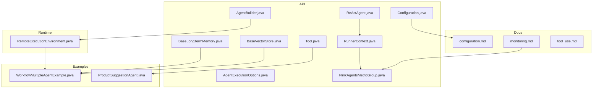
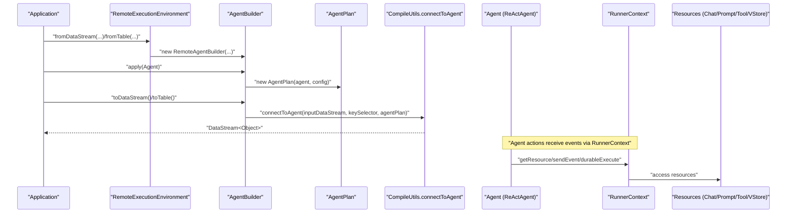
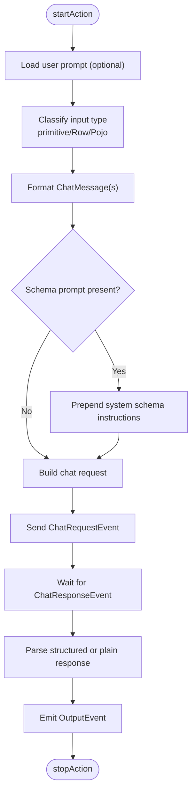
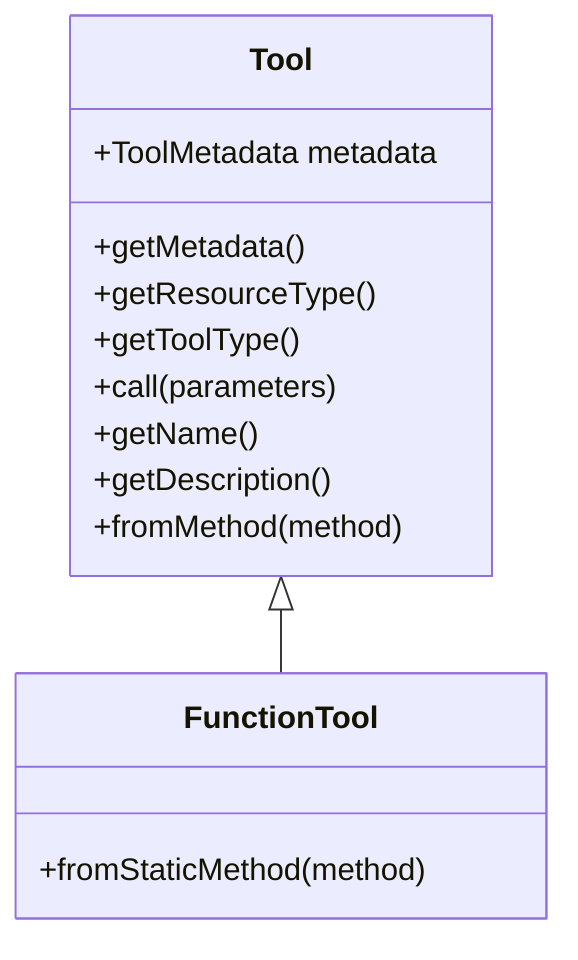
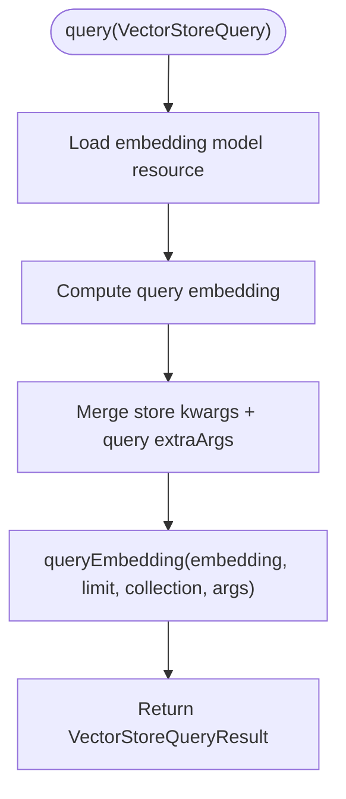
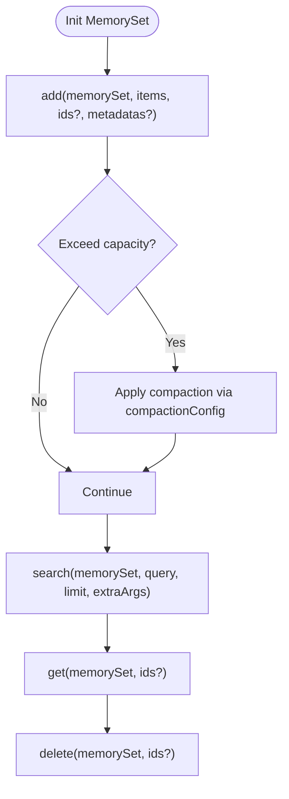
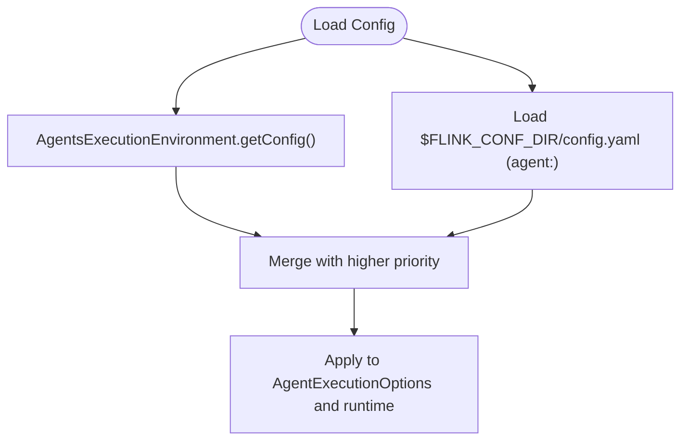
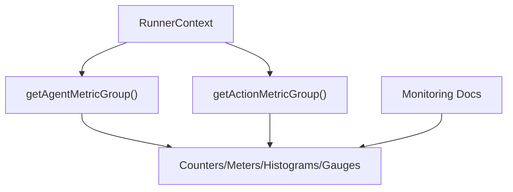
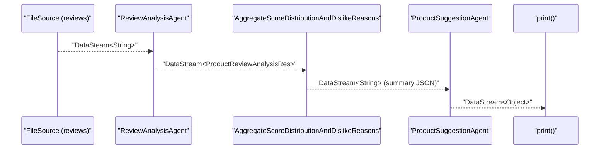
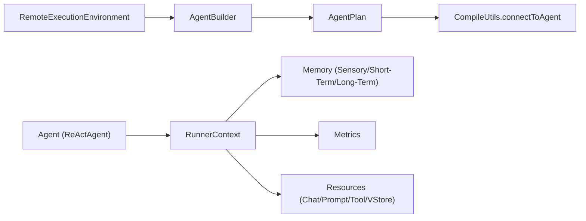

# Best Practices and Patterns

<cite>
**Referenced Files in This Document**
- [AgentBuilder.java](file://api/src/main/java/org/apache/flink/agents/api/AgentBuilder.java)
- [ReActAgent.java](file://api/src/main/java/org/apache/flink/agents/api/agents/ReActAgent.java)
- [RunnerContext.java](file://api/src/main/java/org/apache/flink/agents/api/context/RunnerContext.java)
- [Configuration.java](file://api/src/main/java/org/apache/flink/agents/api/configuration/Configuration.java)
- [BaseLongTermMemory.java](file://api/src/main/java/org/apache/flink/agents/api/memory/BaseLongTermMemory.java)
- [Tool.java](file://api/src/main/java/org/apache/flink/agents/api/tools/Tool.java)
- [BaseVectorStore.java](file://api/src/main/java/org/apache/flink/agents/api/vectorstores/BaseVectorStore.java)
- [RemoteExecutionEnvironment.java](file://runtime/src/main/java/org/apache/flink/agents/runtime/env/RemoteExecutionEnvironment.java)
- [AgentExecutionOptions.java](file://api/src/main/java/org/apache/flink/agents/api/agents/AgentExecutionOptions.java)
- [FlinkAgentsMetricGroup.java](file://api/src/main/java/org/apache/flink/agents/api/metrics/FlinkAgentsMetricGroup.java)
- [configuration.md](file://docs/content/docs/operations/configuration.md)
- [monitoring.md](file://docs/content/docs/operations/monitoring.md)
- [tool_use.md](file://docs/content/docs/development/tool_use.md)
- [WorkflowMultipleAgentExample.java](file://examples/src/main/java/org/apache/flink/agents/examples/WorkflowMultipleAgentExample.java)
- [ProductSuggestionAgent.java](file://examples/src/main/java/org/apache/flink/agents/examples/agents/ProductSuggestionAgent.java)
</cite>

## Table of Contents
1. [Introduction](#introduction)
2. [Project Structure](#project-structure)
3. [Core Components](#core-components)
4. [Architecture Overview](#architecture-overview)
5. [Detailed Component Analysis](#detailed-component-analysis)
6. [Dependency Analysis](#dependency-analysis)
7. [Performance Considerations](#performance-considerations)
8. [Troubleshooting Guide](#troubleshooting-guide)
9. [Conclusion](#conclusion)
10. [Appendices](#appendices)

## Introduction
This document consolidates best practices and proven patterns for developing Flink Agents applications. It synthesizes design patterns, configuration strategies, resource management, error handling, performance tuning, observability, and production readiness from the example suite and core APIs. It also highlights anti-patterns, debugging strategies, testing approaches, and maintenance guidelines to ensure robust, scalable, and maintainable agent systems.

## Project Structure
Flink Agents is organized around a modular API surface, runtime integration, integrations with external systems (chat models, embeddings, vector stores, MCP), and comprehensive examples and documentation. The structure supports:
- API abstractions for agents, resources, memory, tools, and metrics
- Runtime environments for local and remote Flink execution
- Integrations for chat models, embeddings, vector stores, and MCP
- Examples demonstrating multi-agent workflows and cross-language resource usage
- Extensive documentation for configuration, monitoring, and development

**Diagram sources**
- [AgentBuilder.java](file://api/src/main/java/org/apache/flink/agents/api/AgentBuilder.java#L29-L76)
- [ReActAgent.java](file://api/src/main/java/org/apache/flink/agents/api/agents/ReActAgent.java#L50-L183)
- [RunnerContext.java](file://api/src/main/java/org/apache/flink/agents/api/context/RunnerContext.java#L29-L138)
- [Configuration.java](file://api/src/main/java/org/apache/flink/agents/api/configuration/Configuration.java#L20-L24)
- [BaseLongTermMemory.java](file://api/src/main/java/org/apache/flink/agents/api/memory/BaseLongTermMemory.java#L27-L134)
- [Tool.java](file://api/src/main/java/org/apache/flink/agents/api/tools/Tool.java#L26-L70)
- [BaseVectorStore.java](file://api/src/main/java/org/apache/flink/agents/api/vectorstores/BaseVectorStore.java#L33-L174)
- [RemoteExecutionEnvironment.java](file://runtime/src/main/java/org/apache/flink/agents/runtime/env/RemoteExecutionEnvironment.java#L44-L217)
- [AgentExecutionOptions.java](file://api/src/main/java/org/apache/flink/agents/api/agents/AgentExecutionOptions.java#L23-L47)
- [FlinkAgentsMetricGroup.java](file://api/src/main/java/org/apache/flink/agents/api/metrics/FlinkAgentsMetricGroup.java#L26-L93)
- [configuration.md](file://docs/content/docs/operations/configuration.md#L25-L151)
- [monitoring.md](file://docs/content/docs/operations/monitoring.md#L25-L162)
- [tool_use.md](file://docs/content/docs/development/tool_use.md#L25-L185)
- [WorkflowMultipleAgentExample.java](file://examples/src/main/java/org/apache/flink/agents/examples/WorkflowMultipleAgentExample.java#L49-L190)
- [ProductSuggestionAgent.java](file://examples/src/main/java/org/apache/flink/agents/examples/agents/ProductSuggestionAgent.java#L44-L114)

**Section sources**
- [AgentBuilder.java](file://api/src/main/java/org/apache/flink/agents/api/AgentBuilder.java#L29-L76)
- [RemoteExecutionEnvironment.java](file://runtime/src/main/java/org/apache/flink/agents/runtime/env/RemoteExecutionEnvironment.java#L44-L217)
- [WorkflowMultipleAgentExample.java](file://examples/src/main/java/org/apache/flink/agents/examples/WorkflowMultipleAgentExample.java#L49-L190)

## Core Components
- AgentBuilder: Fluent builder for integrating agents with DataStream/Table/List outputs and orchestrating agent execution within Flink.
- ReActAgent: Built-in agent implementing reasoning-action loops with configurable prompts, output schema enforcement, and chat model orchestration.
- RunnerContext: Execution context for actions, exposing memory, metrics, resources, configuration, and durable execution helpers.
- Configuration: Unified interface for readable/writable configuration, used across environments and plans.
- BaseLongTermMemory: Abstraction for persistent memory sets with add/get/search/delete and compaction support.
- Tool: Standardized base for tools with metadata, serialization, and invocation semantics.
- BaseVectorStore: Abstraction for vector stores integrating embedding models, with query/add/get/delete operations.
- RemoteExecutionEnvironment: Bridges agents to Flink’s streaming/table environments, building agent plans and wiring operators.
- AgentExecutionOptions: Predefined configuration options for error handling, retries, async behavior, and thread pools.
- FlinkAgentsMetricGroup: Metrics facade for counters, gauges, meters, and histograms across agents and actions.

**Section sources**
- [AgentBuilder.java](file://api/src/main/java/org/apache/flink/agents/api/AgentBuilder.java#L29-L76)
- [ReActAgent.java](file://api/src/main/java/org/apache/flink/agents/api/agents/ReActAgent.java#L50-L183)
- [RunnerContext.java](file://api/src/main/java/org/apache/flink/agents/api/context/RunnerContext.java#L29-L138)
- [Configuration.java](file://api/src/main/java/org/apache/flink/agents/api/configuration/Configuration.java#L20-L24)
- [BaseLongTermMemory.java](file://api/src/main/java/org/apache/flink/agents/api/memory/BaseLongTermMemory.java#L27-L134)
- [Tool.java](file://api/src/main/java/org/apache/flink/agents/api/tools/Tool.java#L26-L70)
- [BaseVectorStore.java](file://api/src/main/java/org/apache/flink/agents/api/vectorstores/BaseVectorStore.java#L33-L174)
- [RemoteExecutionEnvironment.java](file://runtime/src/main/java/org/apache/flink/agents/runtime/env/RemoteExecutionEnvironment.java#L44-L217)
- [AgentExecutionOptions.java](file://api/src/main/java/org/apache/flink/agents/api/agents/AgentExecutionOptions.java#L23-L47)
- [FlinkAgentsMetricGroup.java](file://api/src/main/java/org/apache/flink/agents/api/metrics/FlinkAgentsMetricGroup.java#L26-L93)

## Architecture Overview
The system composes agents with Flink streams and tables through a remote execution environment. Agents declare resources (chat models, prompts, tools, vector stores), and actions consume events, interact with resources, and produce outputs. Observability is integrated via metrics and event logging.

**Diagram sources**
- [RemoteExecutionEnvironment.java](file://runtime/src/main/java/org/apache/flink/agents/runtime/env/RemoteExecutionEnvironment.java#L85-L94)
- [RemoteExecutionEnvironment.java](file://runtime/src/main/java/org/apache/flink/agents/runtime/env/RemoteExecutionEnvironment.java#L172-L182)
- [RemoteExecutionEnvironment.java](file://runtime/src/main/java/org/apache/flink/agents/runtime/env/RemoteExecutionEnvironment.java#L190-L208)
- [ReActAgent.java](file://api/src/main/java/org/apache/flink/agents/api/agents/ReActAgent.java#L103-L181)
- [RunnerContext.java](file://api/src/main/java/org/apache/flink/agents/api/context/RunnerContext.java#L33-L138)

## Detailed Component Analysis

### ReAct Agent Pattern
The ReActAgent demonstrates a standardized loop:
- Input ingestion and prompt formatting
- Optional schema-enforced structured output
- Chat model invocation
- Response handling and output emission

**Diagram sources**
- [ReActAgent.java](file://api/src/main/java/org/apache/flink/agents/api/agents/ReActAgent.java#L103-L181)

**Section sources**
- [ReActAgent.java](file://api/src/main/java/org/apache/flink/agents/api/agents/ReActAgent.java#L50-L183)

### Agent Composition and Tool Implementation Standards
- Tools are defined with metadata and invoked via Tool.call(parameters). Use FunctionTool.fromMethod(...) to bridge static methods.
- Tools can be registered per-agent or globally via AgentsExecutionEnvironment and referenced by name in chat model descriptors.
- Tool definitions should include clear descriptions and parameter schemas to aid LLM understanding.

**Diagram sources**
- [Tool.java](file://api/src/main/java/org/apache/flink/agents/api/tools/Tool.java#L26-L70)

**Section sources**
- [tool_use.md](file://docs/content/docs/development/tool_use.md#L29-L185)
- [Tool.java](file://api/src/main/java/org/apache/flink/agents/api/tools/Tool.java#L26-L70)

### Vector Store Integration and Embeddings
Vector stores encapsulate embedding model usage and expose add/query/get/delete operations. They compute embeddings when absent and merge store kwargs with query-specific parameters.

**Diagram sources**
- [BaseVectorStore.java](file://api/src/main/java/org/apache/flink/agents/api/vectorstores/BaseVectorStore.java#L96-L112)

**Section sources**
- [BaseVectorStore.java](file://api/src/main/java/org/apache/flink/agents/api/vectorstores/BaseVectorStore.java#L33-L174)

### Memory Management Best Practices
- Use RunnerContext.getShortTermMemory()/getSensoryMemory() for transient state within runs.
- Use BaseLongTermMemory for persistent memory sets with capacity and compaction controls.
- Manage memory sets via getOrCreateMemorySet, add with optional IDs/metadatas, and search with semantic queries.

**Diagram sources**
- [BaseLongTermMemory.java](file://api/src/main/java/org/apache/flink/agents/api/memory/BaseLongTermMemory.java#L45-L132)

**Section sources**
- [BaseLongTermMemory.java](file://api/src/main/java/org/apache/flink/agents/api/memory/BaseLongTermMemory.java#L27-L134)
- [RunnerContext.java](file://api/src/main/java/org/apache/flink/agents/api/context/RunnerContext.java#L40-L58)

### Configuration and Production Readiness
- Priority: AgentsExecutionEnvironment overrides > YAML config file (agent section).
- Configure error handling strategy, retries, async toggles, thread pool sizes, and job identifiers.
- For MiniCluster/local mode, ensure FLINK_CONF_DIR is set or load YAML explicitly.

**Diagram sources**
- [configuration.md](file://docs/content/docs/operations/configuration.md#L27-L151)
- [AgentExecutionOptions.java](file://api/src/main/java/org/apache/flink/agents/api/agents/AgentExecutionOptions.java#L23-L47)

**Section sources**
- [configuration.md](file://docs/content/docs/operations/configuration.md#L25-L151)
- [AgentExecutionOptions.java](file://api/src/main/java/org/apache/flink/agents/api/agents/AgentExecutionOptions.java#L23-L47)

### Observability and Metrics
- Built-in metrics include event/action counters/meters and token usage per model/action.
- Use RunnerContext.getAgentMetricGroup()/getActionMetricGroup() to record custom metrics.
- Event logs are file-based by default and stored under a base directory.

**Diagram sources**
- [monitoring.md](file://docs/content/docs/operations/monitoring.md#L25-L162)
- [RunnerContext.java](file://api/src/main/java/org/apache/flink/agents/api/context/RunnerContext.java#L67-L79)
- [FlinkAgentsMetricGroup.java](file://api/src/main/java/org/apache/flink/agents/api/metrics/FlinkAgentsMetricGroup.java#L30-L93)

**Section sources**
- [monitoring.md](file://docs/content/docs/operations/monitoring.md#L25-L162)
- [FlinkAgentsMetricGroup.java](file://api/src/main/java/org/apache/flink/agents/api/metrics/FlinkAgentsMetricGroup.java#L26-L93)

### Example: Multi-Agent Streaming Pipeline
The example composes a two-stage pipeline:
- Stage 1: ReviewAnalysisAgent processes raw reviews and emits structured analysis.
- Stage 2: ProductSuggestionAgent aggregates per-product distributions and reasons, then suggests improvements.
- Parallelism and async threads are tuned to balance throughput and resource limits.

**Diagram sources**
- [WorkflowMultipleAgentExample.java](file://examples/src/main/java/org/apache/flink/agents/examples/WorkflowMultipleAgentExample.java#L126-L188)
- [ProductSuggestionAgent.java](file://examples/src/main/java/org/apache/flink/agents/examples/agents/ProductSuggestionAgent.java#L74-L113)

**Section sources**
- [WorkflowMultipleAgentExample.java](file://examples/src/main/java/org/apache/flink/agents/examples/WorkflowMultipleAgentExample.java#L49-L190)
- [ProductSuggestionAgent.java](file://examples/src/main/java/org/apache/flink/agents/examples/agents/ProductSuggestionAgent.java#L44-L114)

## Dependency Analysis
- RemoteExecutionEnvironment constructs AgentPlan and wires operators via CompileUtils.connectToAgent.
- AgentBuilder enforces lifecycle ordering: apply(agent) before toDataStream/toTable.
- RunnerContext coordinates memory, metrics, resources, and durable execution.
- ReActAgent depends on prompt formatting, chat model resources, and output schema enforcement.
- Tools and vector stores depend on resource descriptors and embedding models.

**Diagram sources**
- [RemoteExecutionEnvironment.java](file://runtime/src/main/java/org/apache/flink/agents/runtime/env/RemoteExecutionEnvironment.java#L172-L208)
- [ReActAgent.java](file://api/src/main/java/org/apache/flink/agents/api/agents/ReActAgent.java#L103-L181)
- [RunnerContext.java](file://api/src/main/java/org/apache/flink/agents/api/context/RunnerContext.java#L33-L138)

**Section sources**
- [RemoteExecutionEnvironment.java](file://runtime/src/main/java/org/apache/flink/agents/runtime/env/RemoteExecutionEnvironment.java#L85-L94)
- [AgentBuilder.java](file://api/src/main/java/org/apache/flink/agents/api/AgentBuilder.java#L35-L76)

## Performance Considerations
- Control concurrency:
  - Tune AgentExecutionOptions.NUM_ASYNC_THREADS to match downstream service capacity.
  - Prefer asynchronous chat/tool/RAG when supported to overlap I/O.
- Limit bursty loads:
  - Cap async threads and batch embeddings/vector operations.
- Optimize memory:
  - Use BaseLongTermMemory compaction configs to manage growth.
  - Prefer streaming windows and incremental aggregation (as in the example).
- Reduce overhead:
  - Minimize prompt formatting and JSON conversions inside tight loops.
  - Reuse resources (connections, embeddings) via resource descriptors.

[No sources needed since this section provides general guidance]

## Troubleshooting Guide
Common issues and remedies:
- Configuration precedence confusion:
  - Verify AgentsExecutionEnvironment vs YAML precedence and override behavior.
- Missing configuration file:
  - For MiniCluster/local mode, set FLINK_CONF_DIR or load YAML explicitly.
- Excessive async requests:
  - Lower NUM_ASYNC_THREADS to prevent downstream throttling or resource exhaustion.
- Schema mismatches:
  - Ensure output schema alignment in ReActAgent and prompt instructions.
- Metrics visibility:
  - Confirm metric prefixes and reporters; inspect Flink WebUI for subtask/operator metrics.
- Logging:
  - Use standard logging frameworks; verify logs in Flink Job WebUI.

**Section sources**
- [configuration.md](file://docs/content/docs/operations/configuration.md#L82-L121)
- [monitoring.md](file://docs/content/docs/operations/monitoring.md#L112-L141)
- [AgentExecutionOptions.java](file://api/src/main/java/org/apache/flink/agents/api/agents/AgentExecutionOptions.java#L33-L37)

## Conclusion
Flink Agents enables robust, observable, and scalable agent-driven streaming pipelines. By adhering to the patterns documented—resource-first design, explicit configuration, disciplined memory management, thoughtful metrics, and careful performance tuning—you can build production-grade systems that are maintainable, debuggable, and efficient.

[No sources needed since this section summarizes without analyzing specific files]

## Appendices

### Anti-Patterns to Avoid
- Hard-coding resource parameters; always use ResourceDescriptor and configuration.
- Performing heavy computation inside actions without durableExecute boundaries.
- Ignoring async toggles and thread pools; always tune NUM_ASYNC_THREADS.
- Overlooking output schema enforcement; ensure prompts and models align with expected structures.
- Storing transient state in long-term memory; use Sensory/Short-Term memory for run-local data.

[No sources needed since this section provides general guidance]

### Testing Approaches
- Unit tests for actions and tools using isolated RunnerContext mocks.
- Integration tests validating end-to-end flows with real resources (e.g., chat models, vector stores).
- End-to-end tests covering cross-language scenarios and plan compatibility.

[No sources needed since this section provides general guidance]

### Code Organization and Maintenance
- Keep agents focused and composable; delegate heavy logic to tools and resources.
- Centralize configuration via AgentsExecutionEnvironment and YAML.
- Document tool metadata and prompts; keep them close to their consumers.
- Use examples as living specifications; mirror production patterns in tests.

[No sources needed since this section provides general guidance]