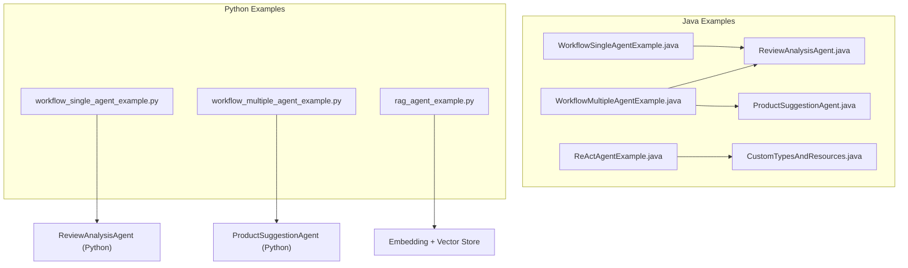
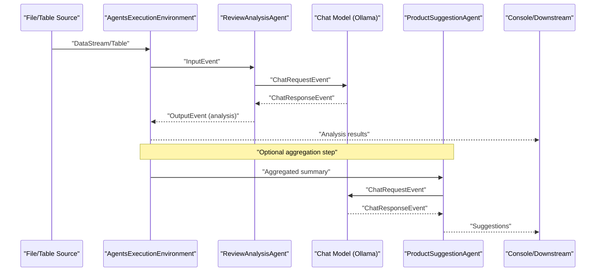
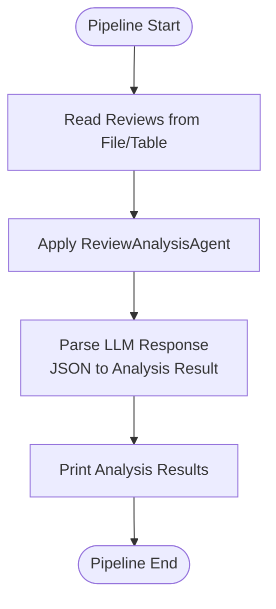
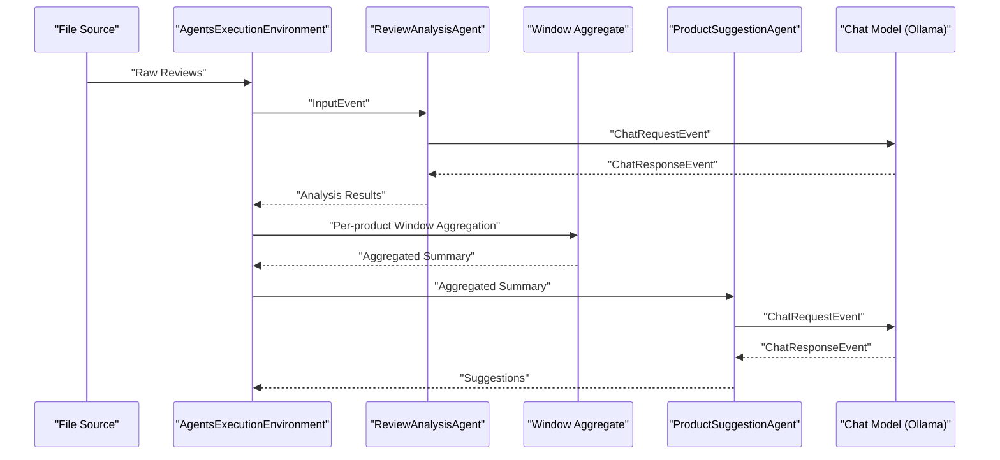
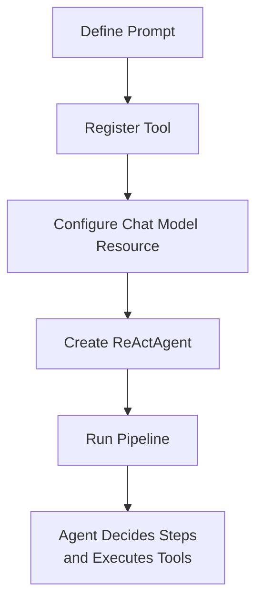
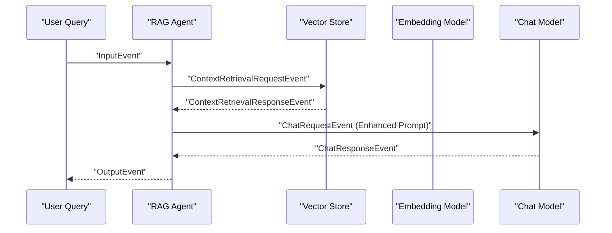
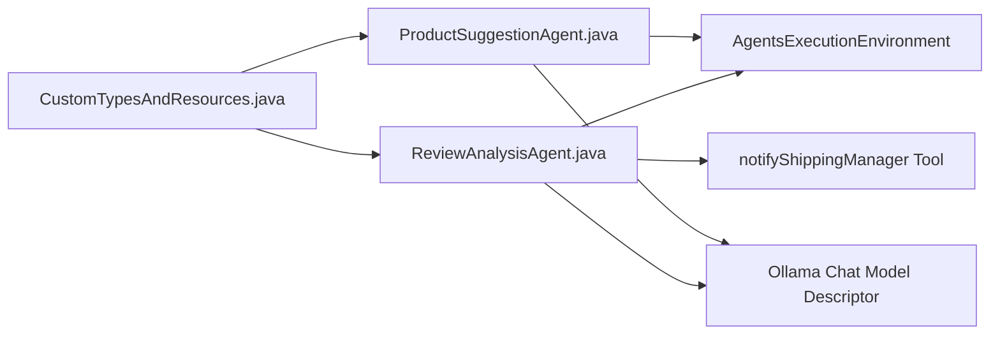

# Examples and Tutorials

<cite>
**Referenced Files in This Document**
- [ProductSuggestionAgent.java](file://examples/src/main/java/org/apache/flink/agents/examples/agents/ProductSuggestionAgent.java)
- [ReviewAnalysisAgent.java](file://examples/src/main/java/org/apache/flink/agents/examples/agents/ReviewAnalysisAgent.java)
- [CustomTypesAndResources.java](file://examples/src/main/java/org/apache/flink/agents/examples/agents/CustomTypesAndResources.java)
- [ReActAgentExample.java](file://examples/src/main/java/org/apache/flink/agents/examples/ReActAgentExample.java)
- [WorkflowSingleAgentExample.java](file://examples/src/main/java/org/apache/flink/agents/examples/WorkflowSingleAgentExample.java)
- [WorkflowMultipleAgentExample.java](file://examples/src/main/java/org/apache/flink/agents/examples/WorkflowMultipleAgentExample.java)
- [rag_agent_example.py](file://python/flink_agents/examples/rag/rag_agent_example.py)
- [workflow_single_agent_example.py](file://python/flink_agents/examples/quickstart/workflow_single_agent_example.py)
- [workflow_multiple_agent_example.py](file://python/flink_agents/examples/quickstart/workflow_multiple_agent_example.py)
- [overview.md](file://docs/content/docs/get-started/overview.md)
- [react_agent.md](file://docs/content/docs/development/react_agent.md)
</cite>

## Table of Contents
1. [Introduction](#introduction)
2. [Project Structure](#project-structure)
3. [Core Components](#core-components)
4. [Architecture Overview](#architecture-overview)
5. [Detailed Component Analysis](#detailed-component-analysis)
6. [Dependency Analysis](#dependency-analysis)
7. [Performance Considerations](#performance-considerations)
8. [Troubleshooting Guide](#troubleshooting-guide)
9. [Conclusion](#conclusion)
10. [Appendices](#appendices)

## Introduction
This document provides comprehensive examples and tutorials for Apache Flink Agents. It covers:
- Basic agent examples (single-agent workflows)
- Multi-agent workflows (two-stage pipelines)
- Advanced use cases (ReAct agent and Retrieval-Augmented Generation)
- Python-specific examples and cross-language integration patterns
- Best practices, pitfalls, and optimization techniques
- Production-ready patterns and scalability guidance

The examples demonstrate end-to-end streaming pipelines that ingest structured data, apply LLM-powered agents, and produce actionable outputs. They are available in both Java and Python for flexible adoption.

## Project Structure
The example suite is organized by language and scenario:
- Java examples:
  - Single-agent workflow for review analysis
  - Multi-agent workflow for review analysis and product suggestions
  - ReAct agent example for autonomous tool use
- Python examples:
  - Single-agent workflow
  - Multi-agent workflow with Table API
  - RAG example with embedding models and vector stores

**Diagram sources**
- [WorkflowSingleAgentExample.java](file://examples/src/main/java/org/apache/flink/agents/examples/WorkflowSingleAgentExample.java#L50-L92)
- [WorkflowMultipleAgentExample.java](file://examples/src/main/java/org/apache/flink/agents/examples/WorkflowMultipleAgentExample.java#L125-L188)
- [ReActAgentExample.java](file://examples/src/main/java/org/apache/flink/agents/examples/ReActAgentExample.java#L80-L160)
- [ReviewAnalysisAgent.java](file://examples/src/main/java/org/apache/flink/agents/examples/agents/ReviewAnalysisAgent.java#L53-L132)
- [ProductSuggestionAgent.java](file://examples/src/main/java/org/apache/flink/agents/examples/agents/ProductSuggestionAgent.java#L52-L114)
- [CustomTypesAndResources.java](file://examples/src/main/java/org/apache/flink/agents/examples/agents/CustomTypesAndResources.java#L34-L265)
- [workflow_single_agent_example.py](file://python/flink_agents/examples/quickstart/workflow_single_agent_example.py#L38-L95)
- [workflow_multiple_agent_example.py](file://python/flink_agents/examples/quickstart/workflow_multiple_agent_example.py#L80-L181)
- [rag_agent_example.py](file://python/flink_agents/examples/rag/rag_agent_example.py#L49-L192)

**Section sources**
- [overview.md](file://docs/content/docs/get-started/overview.md#L25-L48)

## Core Components
This section highlights the reusable building blocks used across examples.

- Prompts and Tools
  - Review analysis prompt defines system instructions and expected JSON schema.
  - Product suggestion prompt instructs generation of actionable improvement ideas.
  - A shipping notification tool is exposed to agents for side effects.

- Data Models
  - ProductReview: input record with id and review text.
  - ProductReviewAnalysisRes: per-record analysis result (score and reasons).
  - ProductReviewSummary: aggregated per-product statistics and reasons.
  - ProductSuggestion: final improvement suggestions derived from aggregated data.

- Resource Descriptors
  - Ollama chat model connection descriptor encapsulates endpoint and timeouts.
  - ReAct agent configuration demonstrates tool binding and model selection.

**Section sources**
- [CustomTypesAndResources.java](file://examples/src/main/java/org/apache/flink/agents/examples/agents/CustomTypesAndResources.java#L36-L117)
- [CustomTypesAndResources.java](file://examples/src/main/java/org/apache/flink/agents/examples/agents/CustomTypesAndResources.java#L119-L263)
- [ReActAgentExample.java](file://examples/src/main/java/org/apache/flink/agents/examples/ReActAgentExample.java#L75-L78)

## Architecture Overview
The examples implement streaming pipelines that:
- Ingest structured records (files or tables)
- Apply LLM agents for analysis and synthesis
- Aggregate intermediate results (when needed)
- Produce final outputs to console or downstream sinks

**Diagram sources**
- [WorkflowSingleAgentExample.java](file://examples/src/main/java/org/apache/flink/agents/examples/WorkflowSingleAgentExample.java#L70-L91)
- [WorkflowMultipleAgentExample.java](file://examples/src/main/java/org/apache/flink/agents/examples/WorkflowMultipleAgentExample.java#L155-L187)
- [ReviewAnalysisAgent.java](file://examples/src/main/java/org/apache/flink/agents/examples/agents/ReviewAnalysisAgent.java#L88-L105)
- [ProductSuggestionAgent.java](file://examples/src/main/java/org/apache/flink/agents/examples/agents/ProductSuggestionAgent.java#L73-L91)

## Detailed Component Analysis

### Basic Agent Examples (Single-Agent Workflows)
These examples show how to integrate a single LLM-powered agent into a streaming pipeline.

- Java: WorkflowSingleAgentExample
  - Reads product reviews from a file source.
  - Applies ReviewAnalysisAgent to extract satisfaction scores and reasons.
  - Prints results to stdout.

- Python: workflow_single_agent_example.py
  - Similar pipeline using PyFlink’s FileSource and Flink Table API.
  - Demonstrates deserialization and agent application.

**Diagram sources**
- [WorkflowSingleAgentExample.java](file://examples/src/main/java/org/apache/flink/agents/examples/WorkflowSingleAgentExample.java#L68-L91)
- [workflow_single_agent_example.py](file://python/flink_agents/examples/quickstart/workflow_single_agent_example.py#L61-L90)

**Section sources**
- [WorkflowSingleAgentExample.java](file://examples/src/main/java/org/apache/flink/agents/examples/WorkflowSingleAgentExample.java#L50-L92)
- [workflow_single_agent_example.py](file://python/flink_agents/examples/quickstart/workflow_single_agent_example.py#L38-L95)

### Multi-Agent Workflows (Two-Stage Pipelines)
This example demonstrates a two-stage pipeline:
- Stage 1: ReviewAnalysisAgent extracts per-review insights.
- Stage 2: ProductSuggestionAgent generates improvement suggestions using aggregated statistics.

**Diagram sources**
- [WorkflowMultipleAgentExample.java](file://examples/src/main/java/org/apache/flink/agents/examples/WorkflowMultipleAgentExample.java#L155-L187)
- [ReviewAnalysisAgent.java](file://examples/src/main/java/org/apache/flink/agents/examples/agents/ReviewAnalysisAgent.java#L88-L105)
- [ProductSuggestionAgent.java](file://examples/src/main/java/org/apache/flink/agents/examples/agents/ProductSuggestionAgent.java#L73-L91)

**Section sources**
- [WorkflowMultipleAgentExample.java](file://examples/src/main/java/org/apache/flink/agents/examples/WorkflowMultipleAgentExample.java#L49-L190)

### ReAct Agent Tutorial
The ReAct agent enables autonomous tool use guided by a prompt. This tutorial shows how to:
- Define a ReAct prompt with system and user messages.
- Register a tool (shipping notification) with the agent.
- Configure a chat model resource and run the pipeline.

**Diagram sources**
- [ReActAgentExample.java](file://examples/src/main/java/org/apache/flink/agents/examples/ReActAgentExample.java#L75-L102)
- [ReActAgentExample.java](file://examples/src/main/java/org/apache/flink/agents/examples/ReActAgentExample.java#L148-L159)
- [react_agent.md](file://docs/content/docs/development/react_agent.md#L33-L178)

**Section sources**
- [ReActAgentExample.java](file://examples/src/main/java/org/apache/flink/agents/examples/ReActAgentExample.java#L55-L161)
- [react_agent.md](file://docs/content/docs/development/react_agent.md#L25-L258)

### RAG (Retrieval-Augmented Generation) Tutorial
This tutorial demonstrates a basic RAG agent that:
- Retrieves relevant context from a vector store using an embedding model.
- Enhances the user query with retrieved context.
- Generates an improved response using a chat model.

**Diagram sources**
- [rag_agent_example.py](file://python/flink_agents/examples/rag/rag_agent_example.py#L106-L154)

**Section sources**
- [rag_agent_example.py](file://python/flink_agents/examples/rag/rag_agent_example.py#L49-L192)

### Python-Specific Examples and Cross-Language Patterns
- Python single-agent workflow
  - Uses PyFlink FileSource and deserializes JSON to typed records.
  - Applies ReviewAnalysisAgent and prints results.

- Python multi-agent workflow with Table API
  - Uses Flink Table API to define a source with rowtime and watermark.
  - Applies a table-aware agent variant and performs window aggregation.

- Cross-language integration patterns
  - Both Java and Python share the same agent abstractions and prompts.
  - Resources (chat model, embedding model, vector store) are configured similarly in both languages.

**Section sources**
- [workflow_single_agent_example.py](file://python/flink_agents/examples/quickstart/workflow_single_agent_example.py#L38-L95)
- [workflow_multiple_agent_example.py](file://python/flink_agents/examples/quickstart/workflow_multiple_agent_example.py#L80-L181)

## Dependency Analysis
The examples rely on shared components and resources:
- Shared prompts and data models
- Ollama chat model connection
- Optional tools for side effects
- Windowing and aggregation for multi-stage pipelines

**Diagram sources**
- [CustomTypesAndResources.java](file://examples/src/main/java/org/apache/flink/agents/examples/agents/CustomTypesAndResources.java#L112-L117)
- [ReviewAnalysisAgent.java](file://examples/src/main/java/org/apache/flink/agents/examples/agents/ReviewAnalysisAgent.java#L80-L86)
- [ProductSuggestionAgent.java](file://examples/src/main/java/org/apache/flink/agents/examples/agents/ProductSuggestionAgent.java#L58-L66)

**Section sources**
- [CustomTypesAndResources.java](file://examples/src/main/java/org/apache/flink/agents/examples/agents/CustomTypesAndResources.java#L34-L117)
- [ReviewAnalysisAgent.java](file://examples/src/main/java/org/apache/flink/agents/examples/agents/ReviewAnalysisAgent.java#L73-L86)
- [ProductSuggestionAgent.java](file://examples/src/main/java/org/apache/flink/agents/examples/agents/ProductSuggestionAgent.java#L58-L66)

## Performance Considerations
- Concurrency and throughput
  - Limit asynchronous threads to avoid overwhelming local LLM servers.
  - Adjust NUM_ASYNC_THREADS according to model server capacity.

- Windowing and batching
  - Use tumbling windows to aggregate per-product insights efficiently.
  - Tune window size and parallelism for latency vs throughput trade-offs.

- Resource configuration
  - Configure chat model and embedding model descriptors with appropriate timeouts and endpoints.
  - Ensure vector store and embedding model alignment for RAG.

- Monitoring and observability
  - Leverage event-centric orchestration to observe agent decisions and side effects.
  - Use built-in metrics and logging to track performance and errors.

**Section sources**
- [WorkflowSingleAgentExample.java](file://examples/src/main/java/org/apache/flink/agents/examples/WorkflowSingleAgentExample.java#L59-L60)
- [WorkflowMultipleAgentExample.java](file://examples/src/main/java/org/apache/flink/agents/examples/WorkflowMultipleAgentExample.java#L133-L134)
- [ReActAgentExample.java](file://examples/src/main/java/org/apache/flink/agents/examples/ReActAgentExample.java#L87-L88)

## Troubleshooting Guide
Common issues and resolutions:
- Invalid LLM response schema
  - Ensure prompts enforce strict JSON schemas and handle missing fields gracefully.
  - Throw explicit exceptions when required fields are absent.

- Resource misconfiguration
  - Verify chat model and embedding model descriptors match installed servers.
  - Confirm endpoint URLs and model names are correct.

- Window aggregation anomalies
  - Validate key selectors and window definitions.
  - Ensure watermark strategy aligns with event time semantics.

- Tool invocation failures
  - Log tool execution outcomes and surface errors to the agent.
  - Keep tool logic idempotent and safe for repeated execution.

**Section sources**
- [ReviewAnalysisAgent.java](file://examples/src/main/java/org/apache/flink/agents/examples/agents/ReviewAnalysisAgent.java#L113-L116)
- [CustomTypesAndResources.java](file://examples/src/main/java/org/apache/flink/agents/examples/agents/CustomTypesAndResources.java#L112-L117)

## Conclusion
The Flink Agents example suite demonstrates practical patterns for building event-driven, streaming AI agents:
- Start with simple single-agent workflows
- Scale to multi-agent pipelines with windowed aggregation
- Adopt ReAct agents for autonomous tool use
- Implement RAG for context-aware responses
- Choose between Java and Python based on team preferences
- Apply best practices for performance, reliability, and observability

## Appendices
- Downloadable example projects
  - Java examples: located under examples/src/main/java/org/apache/flink/agents/examples
  - Python examples: located under python/flink_agents/examples
- Runnable commands
  - Java: compile and run the main classes in the examples package
  - Python: execute the scripts under python/flink_agents/examples
- Additional documentation
  - Overview and getting started guide
  - ReAct agent configuration and usage