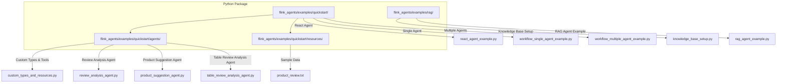
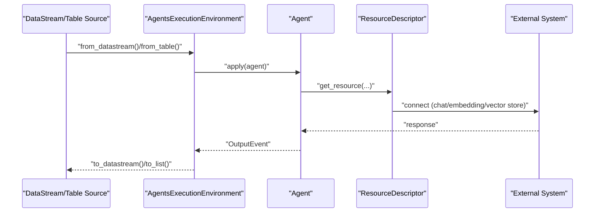
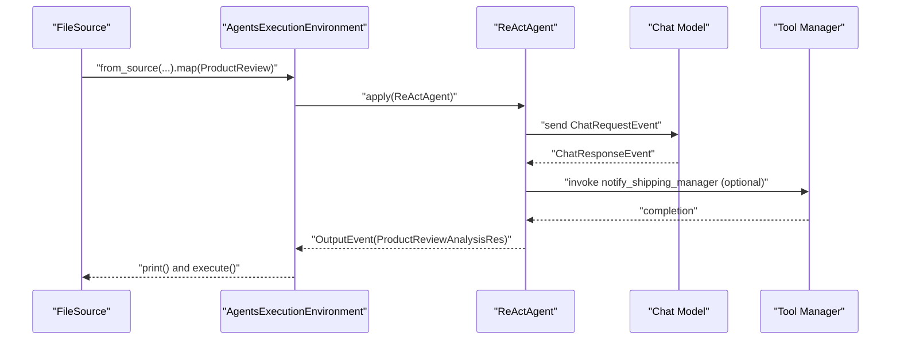
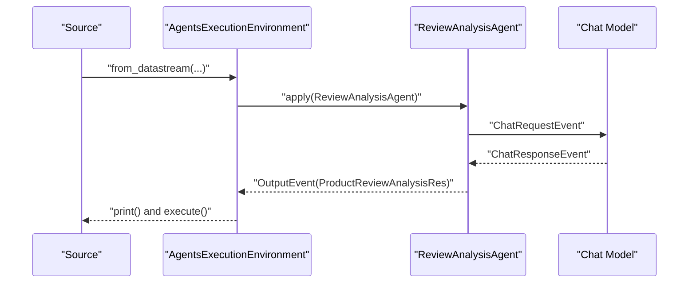
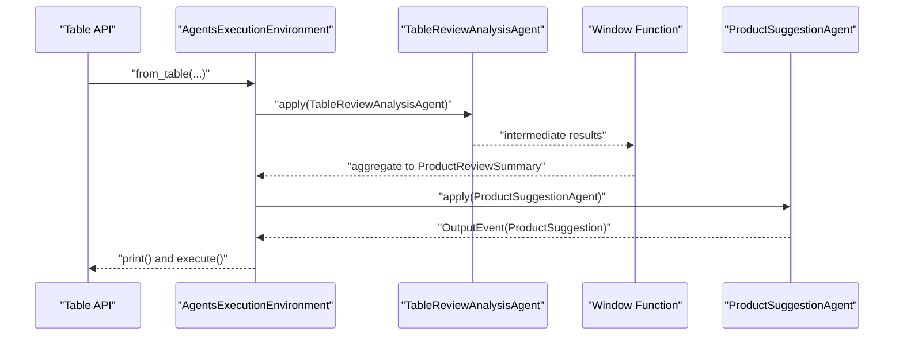
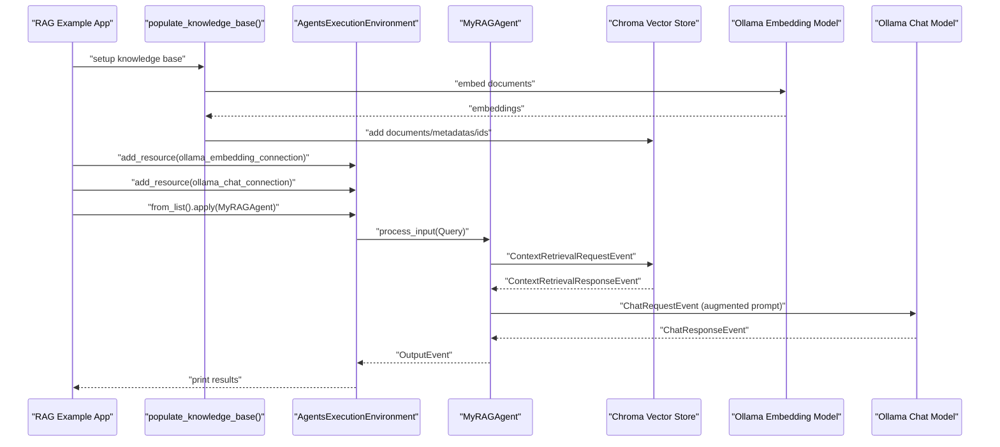
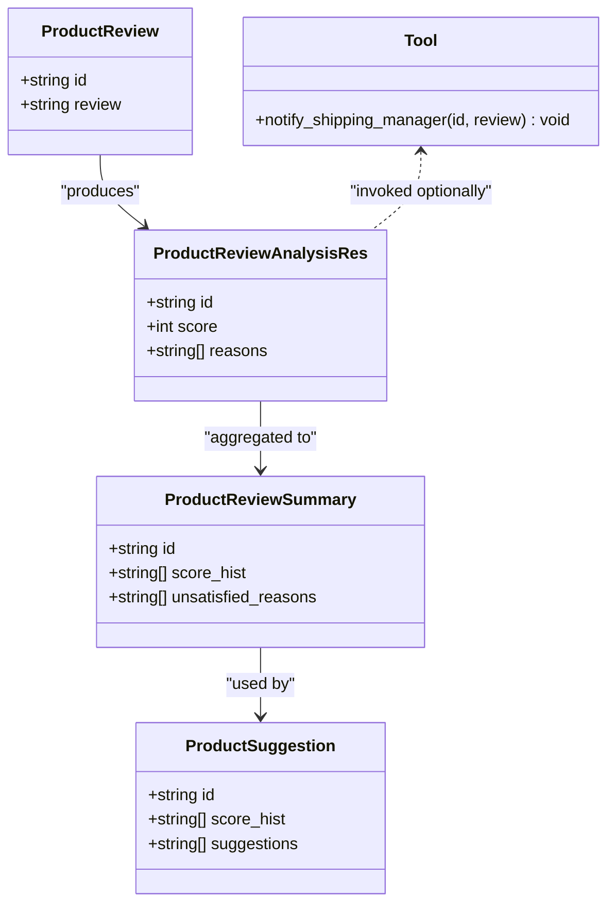
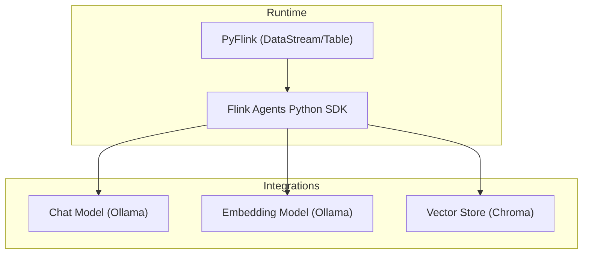

# Python Examples

<cite>
**Referenced Files in This Document**
- [react_agent_example.py](file://python/flink_agents/examples/quickstart/react_agent_example.py)
- [workflow_single_agent_example.py](file://python/flink_agents/examples/quickstart/workflow_single_agent_example.py)
- [workflow_multiple_agent_example.py](file://python/flink_agents/examples/quickstart/workflow_multiple_agent_example.py)
- [custom_types_and_resources.py](file://python/flink_agents/examples/quickstart/agents/custom_types_and_resources.py)
- [review_analysis_agent.py](file://python/flink_agents/examples/quickstart/agents/review_analysis_agent.py)
- [product_suggestion_agent.py](file://python/flink_agents/examples/quickstart/agents/product_suggestion_agent.py)
- [table_review_analysis_agent.py](file://python/flink_agents/examples/quickstart/agents/table_review_analysis_agent.py)
- [knowledge_base_setup.py](file://python/flink_agents/examples/rag/knowledge_base_setup.py)
- [rag_agent_example.py](file://python/flink_agents/examples/rag/rag_agent_example.py)
- [product_review.txt](file://python/flink_agents/examples/quickstart/resources/product_review.txt)
- [pyproject.toml](file://python/pyproject.toml)
- [README.md](file://python/README.md)
</cite>

## Table of Contents
1. [Introduction](#introduction)
2. [Project Structure](#project-structure)
3. [Core Components](#core-components)
4. [Architecture Overview](#architecture-overview)
5. [Detailed Component Analysis](#detailed-component-analysis)
6. [Dependency Analysis](#dependency-analysis)
7. [Performance Considerations](#performance-considerations)
8. [Troubleshooting Guide](#troubleshooting-guide)
9. [Conclusion](#conclusion)
10. [Appendices](#appendices)

## Introduction
This document provides comprehensive Python examples for Flink Agents, focusing on practical, end-to-end workflows. It covers:
- Quickstart examples for React agent and single/multiple agent workflows
- Advanced Retrieval-Augmented Generation (RAG) implementations
- Python-specific syntax, cross-language communication patterns, and Python resource provider usage
- Environment setup, dependency management, and integration with Java components
- Best practices, performance optimization, and debugging techniques

## Project Structure
The Python examples are organized under the Python package flink_agents, with runnable examples in the examples directory and reusable agent implementations in the agents subdirectory. The RAG examples demonstrate knowledge base setup, vector store integration, and retrieval mechanisms.

**Diagram sources**
- [react_agent_example.py](file://python/flink_agents/examples/quickstart/react_agent_example.py#L1-L118)
- [workflow_single_agent_example.py](file://python/flink_agents/examples/quickstart/workflow_single_agent_example.py#L1-L95)
- [workflow_multiple_agent_example.py](file://python/flink_agents/examples/quickstart/workflow_multiple_agent_example.py#L1-L181)
- [custom_types_and_resources.py](file://python/flink_agents/examples/quickstart/agents/custom_types_and_resources.py#L1-L203)
- [review_analysis_agent.py](file://python/flink_agents/examples/quickstart/agents/review_analysis_agent.py#L1-L127)
- [product_suggestion_agent.py](file://python/flink_agents/examples/quickstart/agents/product_suggestion_agent.py#L1-L118)
- [table_review_analysis_agent.py](file://python/flink_agents/examples/quickstart/agents/table_review_analysis_agent.py#L1-L154)
- [knowledge_base_setup.py](file://python/flink_agents/examples/rag/knowledge_base_setup.py#L1-L82)
- [rag_agent_example.py](file://python/flink_agents/examples/rag/rag_agent_example.py#L1-L192)
- [product_review.txt](file://python/flink_agents/examples/quickstart/resources/product_review.txt#L1-L568)

**Section sources**
- [react_agent_example.py](file://python/flink_agents/examples/quickstart/react_agent_example.py#L1-L118)
- [workflow_single_agent_example.py](file://python/flink_agents/examples/quickstart/workflow_single_agent_example.py#L1-L95)
- [workflow_multiple_agent_example.py](file://python/flink_agents/examples/quickstart/workflow_multiple_agent_example.py#L1-L181)
- [custom_types_and_resources.py](file://python/flink_agents/examples/quickstart/agents/custom_types_and_resources.py#L1-L203)
- [review_analysis_agent.py](file://python/flink_agents/examples/quickstart/agents/review_analysis_agent.py#L1-L127)
- [product_suggestion_agent.py](file://python/flink_agents/examples/quickstart/agents/product_suggestion_agent.py#L1-L118)
- [table_review_analysis_agent.py](file://python/flink_agents/examples/quickstart/agents/table_review_analysis_agent.py#L1-L154)
- [knowledge_base_setup.py](file://python/flink_agents/examples/rag/knowledge_base_setup.py#L1-L82)
- [rag_agent_example.py](file://python/flink_agents/examples/rag/rag_agent_example.py#L1-L192)
- [product_review.txt](file://python/flink_agents/examples/quickstart/resources/product_review.txt#L1-L568)

## Core Components
This section highlights the essential building blocks used across the examples:
- Agents: Implementations of LLM-driven reasoning and tool use
- Prompts: Structured templates guiding agent behavior
- Tools: Callable functions integrated into agents
- Resources: Descriptors for connecting to external systems (chat models, embedding models, vector stores)
- Execution Environments: Bridges between Python and Java components for distributed execution

Key example files:
- React Agent example: Demonstrates streaming ingestion, agent orchestration, and tool invocation
- Single Agent example: Shows a streamlined workflow using a dedicated agent class
- Multiple Agent example: Illustrates multi-stage processing with windowed aggregation and downstream agent
- RAG example: Shows knowledge base population, vector store integration, and retrieval-augmented prompting

**Section sources**
- [react_agent_example.py](file://python/flink_agents/examples/quickstart/react_agent_example.py#L43-L118)
- [workflow_single_agent_example.py](file://python/flink_agents/examples/quickstart/workflow_single_agent_example.py#L38-L95)
- [workflow_multiple_agent_example.py](file://python/flink_agents/examples/quickstart/workflow_multiple_agent_example.py#L80-L181)
- [custom_types_and_resources.py](file://python/flink_agents/examples/quickstart/agents/custom_types_and_resources.py#L26-L203)
- [review_analysis_agent.py](file://python/flink_agents/examples/quickstart/agents/review_analysis_agent.py#L47-L127)
- [product_suggestion_agent.py](file://python/flink_agents/examples/quickstart/agents/product_suggestion_agent.py#L45-L118)
- [table_review_analysis_agent.py](file://python/flink_agents/examples/quickstart/agents/table_review_analysis_agent.py#L67-L154)
- [knowledge_base_setup.py](file://python/flink_agents/examples/rag/knowledge_base_setup.py#L32-L82)
- [rag_agent_example.py](file://python/flink_agents/examples/rag/rag_agent_example.py#L49-L154)

## Architecture Overview
The examples demonstrate a layered architecture:
- Data ingestion via Flink DataStream/Table APIs
- Agent orchestration using Flink Agents execution environments
- External integrations via resource descriptors (chat models, embedding models, vector stores)
- Cross-language interoperability between Python and Java components

**Diagram sources**
- [react_agent_example.py](file://python/flink_agents/examples/quickstart/react_agent_example.py#L101-L113)
- [workflow_multiple_agent_example.py](file://python/flink_agents/examples/quickstart/workflow_multiple_agent_example.py#L146-L176)
- [custom_types_and_resources.py](file://python/flink_agents/examples/quickstart/agents/custom_types_and_resources.py#L200-L203)
- [review_analysis_agent.py](file://python/flink_agents/examples/quickstart/agents/review_analysis_agent.py#L79-L90)
- [product_suggestion_agent.py](file://python/flink_agents/examples/quickstart/agents/product_suggestion_agent.py#L63-L73)
- [table_review_analysis_agent.py](file://python/flink_agents/examples/quickstart/agents/table_review_analysis_agent.py#L99-L110)
- [rag_agent_example.py](file://python/flink_agents/examples/rag/rag_agent_example.py#L176-L182)

## Detailed Component Analysis

### React Agent Quickstart
This example showcases a streaming pipeline that:
- Reads product reviews from a file source
- Deserializes JSON records into typed objects
- Applies a ReAct agent configured with a chat model and tools
- Outputs structured analysis results

**Diagram sources**
- [react_agent_example.py](file://python/flink_agents/examples/quickstart/react_agent_example.py#L70-L113)
- [custom_types_and_resources.py](file://python/flink_agents/examples/quickstart/agents/custom_types_and_resources.py#L117-L132)
- [review_analysis_agent.py](file://python/flink_agents/examples/quickstart/agents/review_analysis_agent.py#L92-L127)

**Section sources**
- [react_agent_example.py](file://python/flink_agents/examples/quickstart/react_agent_example.py#L43-L118)
- [custom_types_and_resources.py](file://python/flink_agents/examples/quickstart/agents/custom_types_and_resources.py#L117-L132)

### Single Agent Workflow
This example focuses on a single agent that:
- Connects to a chat model via a resource descriptor
- Processes input events and sends chat requests
- Parses responses into structured outputs

**Diagram sources**
- [workflow_single_agent_example.py](file://python/flink_agents/examples/quickstart/workflow_single_agent_example.py#L77-L90)
- [review_analysis_agent.py](file://python/flink_agents/examples/quickstart/agents/review_analysis_agent.py#L92-L127)

**Section sources**
- [workflow_single_agent_example.py](file://python/flink_agents/examples/quickstart/workflow_single_agent_example.py#L38-L95)
- [review_analysis_agent.py](file://python/flink_agents/examples/quickstart/agents/review_analysis_agent.py#L47-L127)

### Multiple Agent Workflow
This example demonstrates a multi-stage pipeline:
- Reads structured data via Flink Table API
- Applies a review analysis agent to produce intermediate results
- Aggregates results in tumbling windows
- Applies a product suggestion agent to generate improvement suggestions

**Diagram sources**
- [workflow_multiple_agent_example.py](file://python/flink_agents/examples/quickstart/workflow_multiple_agent_example.py#L120-L176)
- [table_review_analysis_agent.py](file://python/flink_agents/examples/quickstart/agents/table_review_analysis_agent.py#L112-L154)
- [product_suggestion_agent.py](file://python/flink_agents/examples/quickstart/agents/product_suggestion_agent.py#L75-L118)

**Section sources**
- [workflow_multiple_agent_example.py](file://python/flink_agents/examples/quickstart/workflow_multiple_agent_example.py#L80-L181)
- [table_review_analysis_agent.py](file://python/flink_agents/examples/quickstart/agents/table_review_analysis_agent.py#L67-L154)
- [product_suggestion_agent.py](file://python/flink_agents/examples/quickstart/agents/product_suggestion_agent.py#L45-L118)

### RAG Implementation
The RAG example illustrates:
- Knowledge base setup using ChromaDB and Ollama embeddings
- Vector store resource configuration
- Context retrieval triggered by user queries
- Prompt augmentation with retrieved context
- Chat model response handling

**Diagram sources**
- [rag_agent_example.py](file://python/flink_agents/examples/rag/rag_agent_example.py#L156-L192)
- [knowledge_base_setup.py](file://python/flink_agents/examples/rag/knowledge_base_setup.py#L32-L82)

**Section sources**
- [rag_agent_example.py](file://python/flink_agents/examples/rag/rag_agent_example.py#L49-L154)
- [knowledge_base_setup.py](file://python/flink_agents/examples/rag/knowledge_base_setup.py#L32-L82)

### Data Models and Tools
Reusable data models and tools are defined to support the examples:
- ProductReview, ProductReviewAnalysisRes, ProductReviewSummary, ProductSuggestion
- notify_shipping_manager tool
- Resource descriptors for chat model connections

**Diagram sources**
- [custom_types_and_resources.py](file://python/flink_agents/examples/quickstart/agents/custom_types_and_resources.py#L135-L197)
- [custom_types_and_resources.py](file://python/flink_agents/examples/quickstart/agents/custom_types_and_resources.py#L117-L132)

**Section sources**
- [custom_types_and_resources.py](file://python/flink_agents/examples/quickstart/agents/custom_types_and_resources.py#L135-L197)
- [custom_types_and_resources.py](file://python/flink_agents/examples/quickstart/agents/custom_types_and_resources.py#L117-L132)

## Dependency Analysis
The examples rely on:
- Flink Python API for streaming/table operations
- Flink Agents Python SDK for agent orchestration and resource management
- External integrations via resource descriptors (chat models, embedding models, vector stores)
- Local embedding and vector store implementations for RAG

**Diagram sources**
- [react_agent_example.py](file://python/flink_agents/examples/quickstart/react_agent_example.py#L20-L32)
- [workflow_multiple_agent_example.py](file://python/flink_agents/examples/quickstart/workflow_multiple_agent_example.py#L21-L28)
- [rag_agent_example.py](file://python/flink_agents/examples/rag/rag_agent_example.py#L35-L43)
- [knowledge_base_setup.py](file://python/flink_agents/examples/rag/knowledge_base_setup.py#L23-L25)

**Section sources**
- [react_agent_example.py](file://python/flink_agents/examples/quickstart/react_agent_example.py#L20-L32)
- [workflow_multiple_agent_example.py](file://python/flink_agents/examples/quickstart/workflow_multiple_agent_example.py#L21-L28)
- [rag_agent_example.py](file://python/flink_agents/examples/rag/rag_agent_example.py#L35-L43)
- [knowledge_base_setup.py](file://python/flink_agents/examples/rag/knowledge_base_setup.py#L23-L25)

## Performance Considerations
- Concurrency control: Limit asynchronous threads to prevent overwhelming external services
- Windowing and batching: Use tumbling windows and process functions to aggregate results efficiently
- Resource pooling: Reuse resource descriptors and connections across agents
- Memory management: Prefer streaming transformations and avoid large in-memory collections
- I/O optimization: Monitor file sources and configure watermark strategies appropriately

[No sources needed since this section provides general guidance]

## Troubleshooting Guide
Common issues and resolutions:
- External service timeouts: Adjust request timeout settings in resource descriptors
- Serialization errors: Ensure input data matches expected schemas and use Pydantic models
- Resource resolution failures: Verify resource names and types when registering with the execution environment
- Debugging: Enable logging and inspect event flow using input/output event handlers

**Section sources**
- [custom_types_and_resources.py](file://python/flink_agents/examples/quickstart/agents/custom_types_and_resources.py#L200-L203)
- [review_analysis_agent.py](file://python/flink_agents/examples/quickstart/agents/review_analysis_agent.py#L110-L127)
- [product_suggestion_agent.py](file://python/flink_agents/examples/quickstart/agents/product_suggestion_agent.py#L100-L118)

## Conclusion
The Python examples demonstrate practical, scalable patterns for building LLM-powered agents with Flink. They cover foundational workflows (single and multi-agent), advanced RAG scenarios, and cross-language integration. By following the outlined best practices and leveraging the provided components, developers can implement robust, production-ready agent pipelines.

[No sources needed since this section summarizes without analyzing specific files]

## Appendices

### Setup and Environment
- Install Python dependencies using the project’s package configuration
- Ensure external services (e.g., Ollama) are available and properly configured
- Configure environment variables for model names and timeouts as needed

**Section sources**
- [pyproject.toml](file://python/pyproject.toml)
- [README.md](file://python/README.md)
- [rag_agent_example.py](file://python/flink_agents/examples/rag/rag_agent_example.py#L45-L46)

### Data Preparation
- Use the provided sample dataset for quickstart examples
- Structure input data to match expected schemas for agents

**Section sources**
- [product_review.txt](file://python/flink_agents/examples/quickstart/resources/product_review.txt#L1-L568)