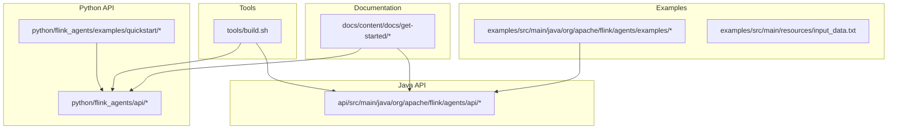
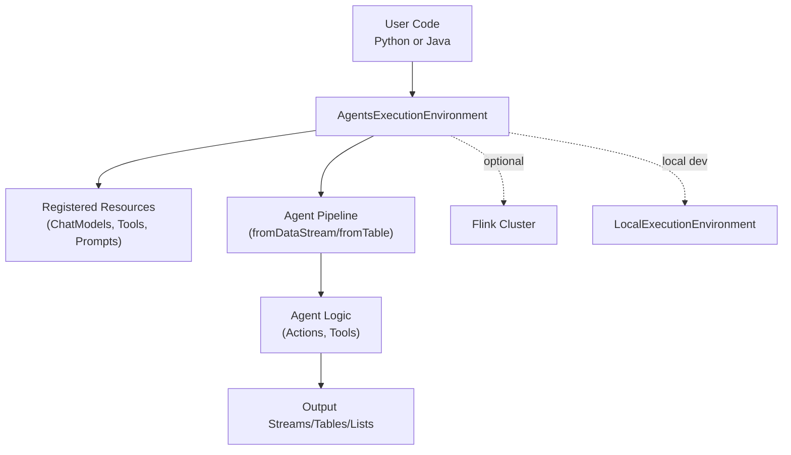
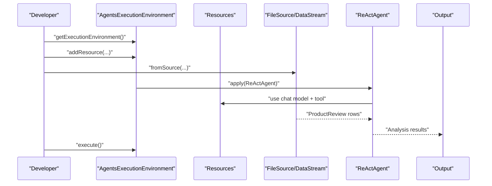
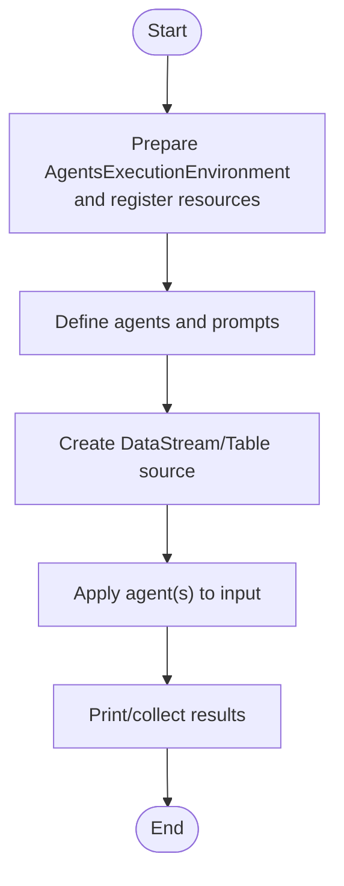
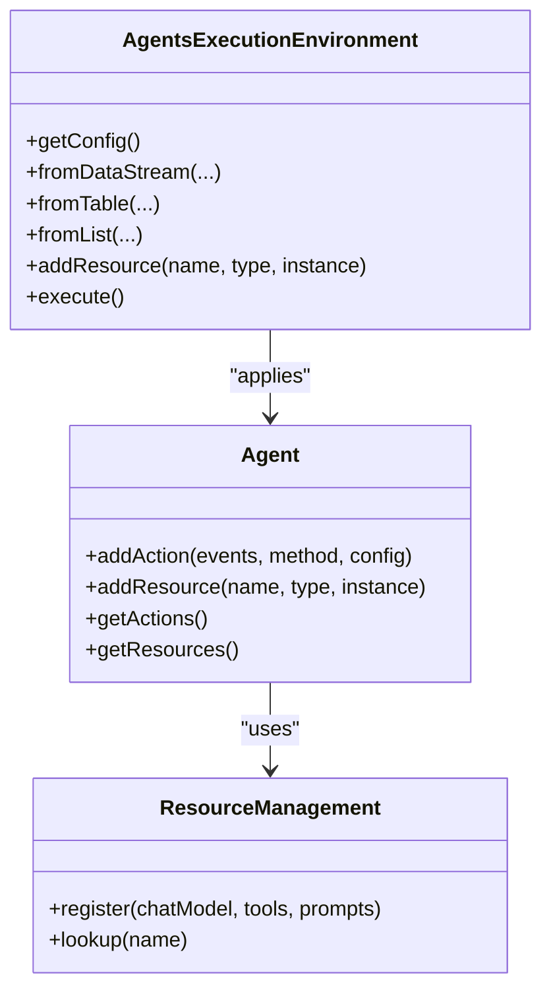
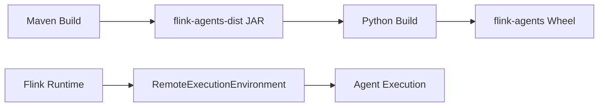

# Getting Started

<cite>
**Referenced Files in This Document**
- [README.md](file://README.md)
- [installation.md](file://docs/content/docs/get-started/installation.md)
- [overview.md](file://docs/content/docs/get-started/overview.md)
- [react_agent.md](file://docs/content/docs/get-started/quickstart/react_agent.md)
- [workflow_agent.md](file://docs/content/docs/get-started/quickstart/workflow_agent.md)
- [build.sh](file://tools/build.sh)
- [ReActAgentExample.java](file://examples/src/main/java/org/apache/flink/agents/examples/ReActAgentExample.java)
- [WorkflowSingleAgentExample.java](file://examples/src/main/java/org/apache/flink/agents/examples/WorkflowSingleAgentExample.java)
- [CustomTypesAndResources.java](file://examples/src/main/java/org/apache/flink/agents/examples/agents/CustomTypesAndResources.java)
- [input_data.txt](file://examples/src/main/resources/input_data.txt)
- [react_agent_example.py](file://python/flink_agents/examples/quickstart/react_agent_example.py)
- [workflow_single_agent_example.py](file://python/flink_agents/examples/quickstart/workflow_single_agent_example.py)
- [AgentsExecutionEnvironment.java](file://api/src/main/java/org/apache/flink/agents/api/AgentsExecutionEnvironment.java)
- [Agent.java](file://api/src/main/java/org/apache/flink/agents/api/agents/Agent.java)
- [execution_environment.py](file://python/flink_agents/api/execution_environment.py)
- [faq.md](file://docs/content/docs/faq/faq.md)
</cite>

## Table of Contents
1. [Introduction](#introduction)
2. [Project Structure](#project-structure)
3. [Core Components](#core-components)
4. [Architecture Overview](#architecture-overview)
5. [Detailed Component Analysis](#detailed-component-analysis)
6. [Dependency Analysis](#dependency-analysis)
7. [Performance Considerations](#performance-considerations)
8. [Troubleshooting Guide](#troubleshooting-guide)
9. [Conclusion](#conclusion)
10. [Appendices](#appendices)

## Introduction
Apache Flink Agents is an Agentic AI framework built on Apache Flink. It enables building event-driven streaming agents that combine large language models (LLMs), prompts, tools, memory, and observability with Flink’s distributed, fault-tolerant streaming engine. This guide helps you install, configure, and run your first ReAct and Workflow agent examples, and explains the core concepts of agents, execution environments, and resource management.

## Project Structure
At a high level, the repository provides:
- Java and Python APIs for defining agents and integrating with Flink
- Examples for ReAct and Workflow agents
- Documentation for installation, quickstarts, and operations
- Tools for building from source and packaging

**Diagram sources**
- [installation.md](file://docs/content/docs/get-started/installation.md#L1-L316)
- [overview.md](file://docs/content/docs/get-started/overview.md#L1-L48)
- [AgentsExecutionEnvironment.java](file://api/src/main/java/org/apache/flink/agents/api/AgentsExecutionEnvironment.java#L1-L223)
- [Agent.java](file://api/src/main/java/org/apache/flink/agents/api/agents/Agent.java#L1-L131)
- [ReActAgentExample.java](file://examples/src/main/java/org/apache/flink/agents/examples/ReActAgentExample.java#L1-L161)
- [WorkflowSingleAgentExample.java](file://examples/src/main/java/org/apache/flink/agents/examples/WorkflowSingleAgentExample.java#L1-L123)
- [input_data.txt](file://examples/src/main/resources/input_data.txt#L1-L3163)
- [execution_environment.py](file://python/flink_agents/api/execution_environment.py#L1-L253)
- [build.sh](file://tools/build.sh#L1-L86)

**Section sources**
- [overview.md](file://docs/content/docs/get-started/overview.md#L25-L48)
- [installation.md](file://docs/content/docs/get-started/installation.md#L25-L316)

## Core Components
- AgentsExecutionEnvironment: The primary entry point to integrate agents with Flink DataStream/Table APIs or run locally. It manages configuration, resources, and pipeline construction.
- Agent: Base class for defining agent logic with actions and resources.
- Resource management: Centralized registration of chat models, tools, prompts, and other resources used by agents.
- Execution modes: Local (for development) and remote (for Flink cluster).

Key responsibilities:
- AgentsExecutionEnvironment.getExecutionEnvironment(...) selects the correct environment (local vs remote) and wires Flink integration.
- addResource registers resources (e.g., chat model connections, tools) that agents can reference by name.
- fromDataStream/fromTable/fromList construct pipelines and apply agents to transform input streams into outputs.

**Section sources**
- [AgentsExecutionEnvironment.java](file://api/src/main/java/org/apache/flink/agents/api/AgentsExecutionEnvironment.java#L43-L222)
- [Agent.java](file://api/src/main/java/org/apache/flink/agents/api/agents/Agent.java#L34-L131)
- [execution_environment.py](file://python/flink_agents/api/execution_environment.py#L91-L253)

## Architecture Overview
The framework orchestrates agents within Flink’s streaming runtime. Users define agents and resources, connect them to Flink DataStream/Table sources, and execute on a Flink cluster or locally.

**Diagram sources**
- [AgentsExecutionEnvironment.java](file://api/src/main/java/org/apache/flink/agents/api/AgentsExecutionEnvironment.java#L68-L121)
- [execution_environment.py](file://python/flink_agents/api/execution_environment.py#L109-L154)
- [Agent.java](file://api/src/main/java/org/apache/flink/agents/api/agents/Agent.java#L34-L111)

## Detailed Component Analysis

### Installation and Setup
- Prerequisites: Unix-like environment, Git, Maven, Java 11, Python 3.10–3.11.
- Build from source: The build script compiles Java modules, builds the Python package, installs the wheel, and packages the distribution JAR into the Python lib directory.
- Install Flink and Flink Agents: Follow the installation guide to prepare Flink, configure PYTHONPATH, and deploy the Java library to the Flink lib directory.

Verification steps:
- Confirm Flink installation and version.
- Verify PYTHONPATH points to the installed Python site-packages.
- Confirm the distribution JAR is present in the Flink lib directory.

**Section sources**
- [README.md](file://README.md#L9-L28)
- [installation.md](file://docs/content/docs/get-started/installation.md#L34-L316)
- [build.sh](file://tools/build.sh#L42-L86)

### Quickstart: ReAct Agent
A ReAct agent combines reasoning and action to analyze product reviews and optionally notify a shipping manager when shipping-related dissatisfaction is detected.

Step-by-step walkthrough:
1. Prepare the execution environment and register resources (chat model connection and tool).
2. Create the ReAct agent with a prompt and output schema.
3. Connect to a streaming source (e.g., a file source), apply the agent, and print results.
4. Execute the pipeline locally or submit to a Flink cluster.

Practical example paths:
- Java example: [ReActAgentExample.java](file://examples/src/main/java/org/apache/flink/agents/examples/ReActAgentExample.java#L81-L146)
- Python example: [react_agent_example.py](file://python/flink_agents/examples/quickstart/react_agent_example.py#L43-L117)
- Shared resources and prompts: [CustomTypesAndResources.java](file://examples/src/main/java/org/apache/flink/agents/examples/agents/CustomTypesAndResources.java#L36-L117)
- Sample input data: [input_data.txt](file://examples/src/main/resources/input_data.txt#L1-L3163)

**Diagram sources**
- [ReActAgentExample.java](file://examples/src/main/java/org/apache/flink/agents/examples/ReActAgentExample.java#L81-L146)
- [react_agent_example.py](file://python/flink_agents/examples/quickstart/react_agent_example.py#L43-L117)
- [CustomTypesAndResources.java](file://examples/src/main/java/org/apache/flink/agents/examples/agents/CustomTypesAndResources.java#L36-L117)

**Section sources**
- [react_agent.md](file://docs/content/docs/get-started/quickstart/react_agent.md#L25-L308)
- [ReActAgentExample.java](file://examples/src/main/java/org/apache/flink/agents/examples/ReActAgentExample.java#L55-L160)
- [react_agent_example.py](file://python/flink_agents/examples/quickstart/react_agent_example.py#L43-L117)
- [CustomTypesAndResources.java](file://examples/src/main/java/org/apache/flink/agents/examples/agents/CustomTypesAndResources.java#L36-L117)
- [input_data.txt](file://examples/src/main/resources/input_data.txt#L1-L3163)

### Quickstart: Workflow Agent
A workflow agent organizes reasoning and actions as a directed workflow of modular steps connected by events. The example includes:
- ReviewAnalysisAgent: extracts satisfaction scores and reasons from reviews.
- Optional second agent: aggregates per-review analysis to generate product improvement suggestions.

Step-by-step walkthrough:
1. Prepare the execution environment and register the chat model connection.
2. Define agents with prompts, tools, and actions.
3. Connect to a streaming source, apply the agent(s), and print results.
4. Execute locally or submit to a Flink cluster.

Practical example paths:
- Java example: [WorkflowSingleAgentExample.java](file://examples/src/main/java/org/apache/flink/agents/examples/WorkflowSingleAgentExample.java#L52-L92)
- Python example: [workflow_single_agent_example.py](file://python/flink_agents/examples/quickstart/workflow_single_agent_example.py#L38-L94)
- Agent definition and prompts: [CustomTypesAndResources.java](file://examples/src/main/java/org/apache/flink/agents/examples/agents/CustomTypesAndResources.java#L36-L94)

**Diagram sources**
- [WorkflowSingleAgentExample.java](file://examples/src/main/java/org/apache/flink/agents/examples/WorkflowSingleAgentExample.java#L52-L92)
- [workflow_single_agent_example.py](file://python/flink_agents/examples/quickstart/workflow_single_agent_example.py#L38-L94)
- [CustomTypesAndResources.java](file://examples/src/main/java/org/apache/flink/agents/examples/agents/CustomTypesAndResources.java#L36-L94)

**Section sources**
- [workflow_agent.md](file://docs/content/docs/get-started/quickstart/workflow_agent.md#L25-L445)
- [WorkflowSingleAgentExample.java](file://examples/src/main/java/org/apache/flink/agents/examples/WorkflowSingleAgentExample.java#L49-L92)
- [workflow_single_agent_example.py](file://python/flink_agents/examples/quickstart/workflow_single_agent_example.py#L38-L94)
- [CustomTypesAndResources.java](file://examples/src/main/java/org/apache/flink/agents/examples/agents/CustomTypesAndResources.java#L36-L94)

### Basic Concepts: Agents, Execution Environments, and Resource Management
- Agents: Encapsulate behavior via actions and resources. Actions listen to specific events and implement logic (e.g., processing input, invoking tools).
- Execution Environments: Bridge between user-defined agents and Flink. They support local execution for development and remote execution for clusters.
- Resource Management: Central registry for chat model connections, tools, prompts, and other resources. Agents reference resources by name.

**Diagram sources**
- [AgentsExecutionEnvironment.java](file://api/src/main/java/org/apache/flink/agents/api/AgentsExecutionEnvironment.java#L43-L222)
- [Agent.java](file://api/src/main/java/org/apache/flink/agents/api/agents/Agent.java#L34-L131)
- [execution_environment.py](file://python/flink_agents/api/execution_environment.py#L91-L253)

**Section sources**
- [AgentsExecutionEnvironment.java](file://api/src/main/java/org/apache/flink/agents/api/AgentsExecutionEnvironment.java#L43-L222)
- [Agent.java](file://api/src/main/java/org/apache/flink/agents/api/agents/Agent.java#L34-L131)
- [execution_environment.py](file://python/flink_agents/api/execution_environment.py#L91-L253)

## Dependency Analysis
- Java API depends on Flink Streaming/Table APIs and the runtime environment.
- Python API depends on PyFlink and dynamically loads the appropriate Flink Agents JAR based on the detected Flink major version.
- Build script coordinates Maven and Python packaging, ensuring the distribution JAR is available for Python execution.

**Diagram sources**
- [build.sh](file://tools/build.sh#L42-L86)
- [execution_environment.py](file://python/flink_agents/api/execution_environment.py#L126-L154)

**Section sources**
- [build.sh](file://tools/build.sh#L42-L86)
- [execution_environment.py](file://python/flink_agents/api/execution_environment.py#L126-L154)

## Performance Considerations
- Async execution: Available in Python and Java (JDK 21+) for improved throughput. Cross-language calls are synchronous.
- Threading limits: Control concurrency to avoid overwhelming external services (e.g., Ollama) by limiting async threads.
- Resource locality: Keep chat model endpoints close to the cluster for lower latency.

[No sources needed since this section provides general guidance]

## Troubleshooting Guide
Common issues and resolutions:
- Python environment: Prefer Python 3.10 or 3.11; avoid interpreters installed via uv to prevent gRPC-related errors.
- Cross-language resources: Not supported in local development mode; deploy to a Flink standalone cluster for cross-language scenarios.
- Async execution: Not available on JDK < 21; on JDK 21+, native integrations benefit more than cross-language calls.
- Running in IDE: Enable “add dependencies with provided scope to classpath” in Run/Debug configurations.

**Section sources**
- [faq.md](file://docs/content/docs/faq/faq.md#L28-L130)

## Conclusion
You are now equipped to install Flink Agents, run the ReAct and Workflow agent quickstarts, and understand the core concepts of agents, execution environments, and resource management. Start with the ReAct example to get familiar with LLM-powered streaming agents, then progress to the Workflow example to explore multi-step orchestration. For production, deploy to a Flink cluster and tune performance using the guidance above.

## Appendices

### Verification Checklist
- Flink is installed and running locally.
- PYTHONPATH is set to the Python site-packages directory.
- Distribution JAR is copied to $FLINK_HOME/lib/.
- Ollama server is reachable at the configured endpoint.
- At least one of the quickstart examples runs successfully (Java or Python).

**Section sources**
- [installation.md](file://docs/content/docs/get-started/installation.md#L233-L316)
- [react_agent.md](file://docs/content/docs/get-started/quickstart/react_agent.md#L264-L308)
- [workflow_agent.md](file://docs/content/docs/get-started/quickstart/workflow_agent.md#L393-L445)