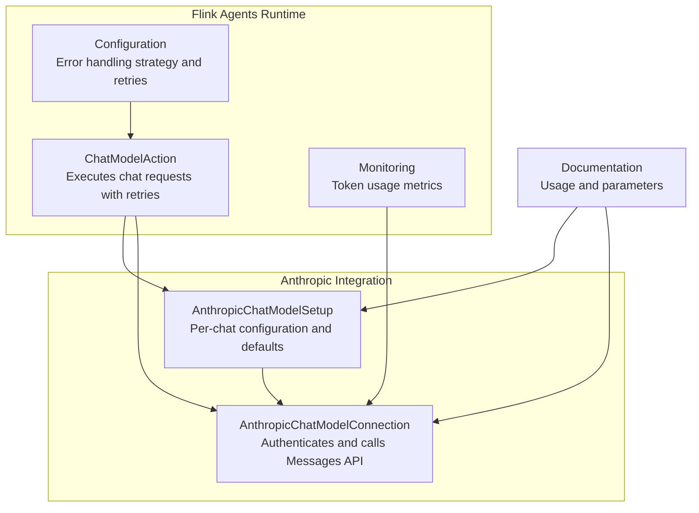
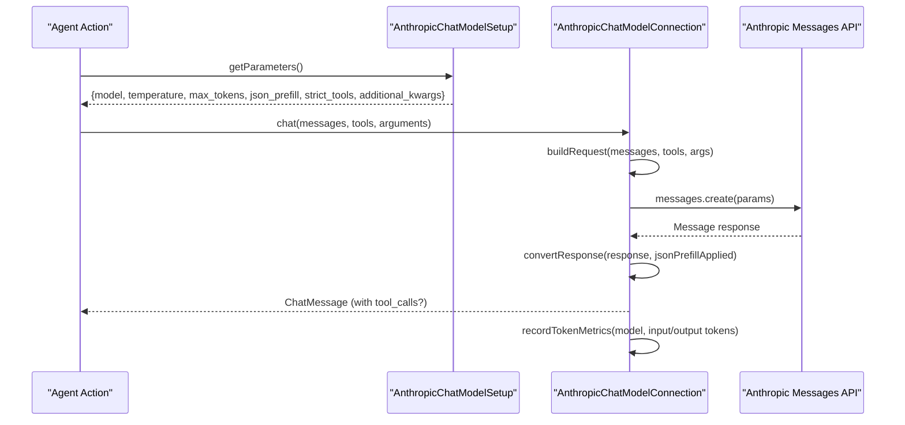
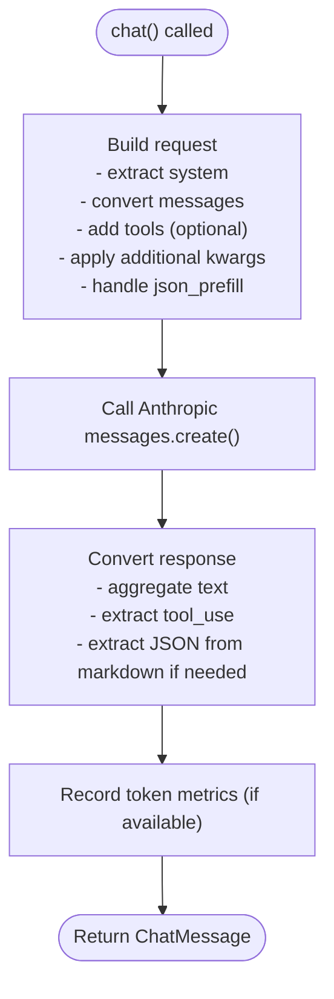
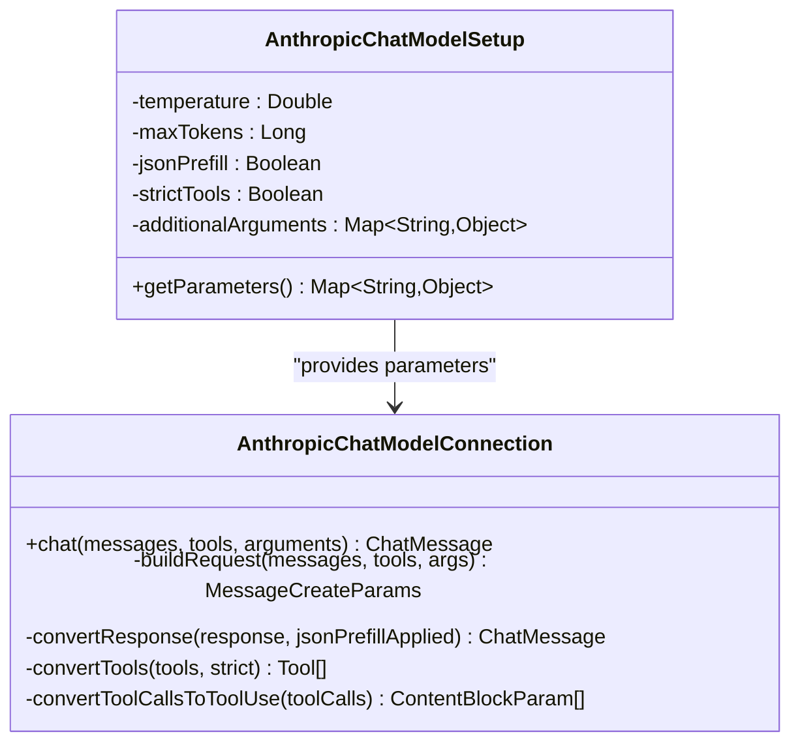
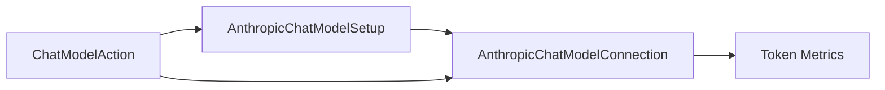

# Anthropic Integration

<cite>
**Referenced Files in This Document**
- [AnthropicChatModelConnection.java](file://integrations/chat-models/anthropic/src/main/java/org/apache/flink/agents/integrations/chatmodels/anthropic/AnthropicChatModelConnection.java)
- [AnthropicChatModelSetup.java](file://integrations/chat-models/anthropic/src/main/java/org/apache/flink/agents/integrations/chatmodels/anthropic/AnthropicChatModelSetup.java)
- [chat_models.md](file://docs/content/docs/development/chat_models.md)
- [configuration.md](file://docs/content/docs/operations/configuration.md)
- [monitoring.md](file://docs/content/docs/operations/monitoring.md)
- [ChatModelAction.java](file://plan/src/main/java/org/apache/flink/agents/plan/actions/ChatModelAction.java)
- [BaseChatModelConnectionTokenMetricsTest.java](file://api/src/test/java/org/apache/flink/agents/api/chat/model/BaseChatModelConnectionTokenMetricsTest.java)
</cite>

## Table of Contents
1. [Introduction](#introduction)
2. [Project Structure](#project-structure)
3. [Core Components](#core-components)
4. [Architecture Overview](#architecture-overview)
5. [Detailed Component Analysis](#detailed-component-analysis)
6. [Dependency Analysis](#dependency-analysis)
7. [Performance Considerations](#performance-considerations)
8. [Troubleshooting Guide](#troubleshooting-guide)
9. [Conclusion](#conclusion)

## Introduction
This document explains how to integrate Anthropic’s Claude chat models into Flink Agents. It focuses on the AnthropicChatModelConnection class and AnthropicChatModelSetup, covering authentication, model selection, configuration (including system prompts, temperature, and safety-related parameters), tool-use and function-calling patterns, prompt engineering best practices, safety considerations, rate limiting and error handling, and production performance and cost optimization strategies.

## Project Structure
The Anthropic integration consists of:
- A connection component that authenticates with the Anthropic API and performs chat requests.
- A setup component that encapsulates per-chat configuration and passes parameters to the connection.
- Documentation and examples for configuration and usage.
- Operational guidance for monitoring and cost tracking.

**Diagram sources**
- [AnthropicChatModelConnection.java](file://integrations/chat-models/anthropic/src/main/java/org/apache/flink/agents/integrations/chatmodels/anthropic/AnthropicChatModelConnection.java#L81-L112)
- [AnthropicChatModelSetup.java](file://integrations/chat-models/anthropic/src/main/java/org/apache/flink/agents/integrations/chatmodels/anthropic/AnthropicChatModelSetup.java#L74-L124)
- [ChatModelAction.java](file://plan/src/main/java/org/apache/flink/agents/plan/actions/ChatModelAction.java#L206-L270)
- [configuration.md](file://docs/content/docs/operations/configuration.md#L122-L135)
- [monitoring.md](file://docs/content/docs/operations/monitoring.md#L42-L50)

**Section sources**
- [AnthropicChatModelConnection.java](file://integrations/chat-models/anthropic/src/main/java/org/apache/flink/agents/integrations/chatmodels/anthropic/AnthropicChatModelConnection.java#L1-L112)
- [AnthropicChatModelSetup.java](file://integrations/chat-models/anthropic/src/main/java/org/apache/flink/agents/integrations/chatmodels/anthropic/AnthropicChatModelSetup.java#L31-L81)
- [chat_models.md](file://docs/content/docs/development/chat_models.md#L145-L290)

## Core Components
- AnthropicChatModelConnection
  - Handles authentication via API key, optional timeouts, and retry limits.
  - Builds Anthropic Messages API requests from Flink chat messages and tools.
  - Converts Anthropic responses to Flink ChatMessage, including tool calls.
  - Records token usage metrics when available.
- AnthropicChatModelSetup
  - Provides default configuration (model, temperature, max_tokens, JSON prefill, strict tools).
  - Aggregates per-chat parameters and forwards them to the connection.

Key configuration parameters:
- Connection: api_key (required), timeout (optional), max_retries (optional).
- Setup: model (default: a Claude Sonnet variant), temperature (0.0–1.0), max_tokens (>0), json_prefill (boolean), strict_tools (boolean), additional_kwargs (top_k, top_p, stop_sequences).

**Section sources**
- [AnthropicChatModelConnection.java](file://integrations/chat-models/anthropic/src/main/java/org/apache/flink/agents/integrations/chatmodels/anthropic/AnthropicChatModelConnection.java#L81-L112)
- [AnthropicChatModelSetup.java](file://integrations/chat-models/anthropic/src/main/java/org/apache/flink/agents/integrations/chatmodels/anthropic/AnthropicChatModelSetup.java#L74-L124)
- [chat_models.md](file://docs/content/docs/development/chat_models.md#L154-L214)

## Architecture Overview
The Anthropic integration follows a layered pattern:
- Setup defines chat parameters and references a connection.
- Connection translates Flink messages and tools into Anthropic API requests.
- Runtime executes chat requests with configurable error handling and retries.
- Metrics capture token usage for cost visibility.

**Diagram sources**
- [AnthropicChatModelSetup.java](file://integrations/chat-models/anthropic/src/main/java/org/apache/flink/agents/integrations/chatmodels/anthropic/AnthropicChatModelSetup.java#L138-L152)
- [AnthropicChatModelConnection.java](file://integrations/chat-models/anthropic/src/main/java/org/apache/flink/agents/integrations/chatmodels/anthropic/AnthropicChatModelConnection.java#L120-L155)
- [ChatModelAction.java](file://plan/src/main/java/org/apache/flink/agents/plan/actions/ChatModelAction.java#L218-L270)

## Detailed Component Analysis

### AnthropicChatModelConnection
Responsibilities:
- Authentication and client initialization using api_key, optional timeout, and max_retries.
- Request construction:
  - Extracts system messages and converts user/assistant/tool messages to Anthropic MessageParam(s).
  - Applies tools with optional strict schema enforcement.
  - Supports additional kwargs (top_k, top_p, stop_sequences).
  - JSON prefill mode to encourage JSON output (automatically disabled when tools are present).
- Response conversion:
  - Aggregates text content and extracts tool_use blocks into tool_calls.
  - Extracts JSON from markdown code blocks when no tool calls are present.
- Metrics:
  - Records promptTokens and completionTokens when model name and usage are available.

Important behaviors:
- Strict tools require a beta header and propagate a strict flag to tool schemas.
- JSON prefill appends an assistant message with “{” to bias JSON output; disabled if tools are provided.
- Tool calls require original_id mapping to Anthropic tool_use blocks.

**Diagram sources**
- [AnthropicChatModelConnection.java](file://integrations/chat-models/anthropic/src/main/java/org/apache/flink/agents/integrations/chatmodels/anthropic/AnthropicChatModelConnection.java#L157-L233)
- [AnthropicChatModelConnection.java](file://integrations/chat-models/anthropic/src/main/java/org/apache/flink/agents/integrations/chatmodels/anthropic/AnthropicChatModelConnection.java#L366-L421)

**Section sources**
- [AnthropicChatModelConnection.java](file://integrations/chat-models/anthropic/src/main/java/org/apache/flink/agents/integrations/chatmodels/anthropic/AnthropicChatModelConnection.java#L81-L112)
- [AnthropicChatModelConnection.java](file://integrations/chat-models/anthropic/src/main/java/org/apache/flink/agents/integrations/chatmodels/anthropic/AnthropicChatModelConnection.java#L157-L233)
- [AnthropicChatModelConnection.java](file://integrations/chat-models/anthropic/src/main/java/org/apache/flink/agents/integrations/chatmodels/anthropic/AnthropicChatModelConnection.java#L366-L421)

### AnthropicChatModelSetup
Responsibilities:
- Enforces parameter bounds (temperature 0.0–1.0, max_tokens > 0).
- Supplies defaults for model, temperature, max_tokens, json_prefill, strict_tools.
- Aggregates parameters into a map passed to the connection.

Usage:
- Configure model selection, temperature, max_tokens, tools, and additional kwargs.
- Reference the connection resource by name.

**Section sources**
- [AnthropicChatModelSetup.java](file://integrations/chat-models/anthropic/src/main/java/org/apache/flink/agents/integrations/chatmodels/anthropic/AnthropicChatModelSetup.java#L74-L124)
- [AnthropicChatModelSetup.java](file://integrations/chat-models/anthropic/src/main/java/org/apache/flink/agents/integrations/chatmodels/anthropic/AnthropicChatModelSetup.java#L138-L152)

### Authentication and Account Setup
- Create an Anthropic Console account and generate an API key.
- Provide the api_key to the connection resource.
- Configure optional timeout and max_retries for resilience.

**Section sources**
- [chat_models.md](file://docs/content/docs/development/chat_models.md#L149-L153)
- [chat_models.md](file://docs/content/docs/development/chat_models.md#L154-L178)

### Model Selection and Pricing
Supported models include Claude Sonnet 4.5, Sonnet 4, Sonnet 3.7, and Opus 4.1. Availability varies; consult the official Anthropic documentation for the latest list and pricing details.

**Section sources**
- [chat_models.md](file://docs/content/docs/development/chat_models.md#L278-L290)

### Configuration Examples
- Connection parameters: api_key (required), timeout (seconds), max_retries (count).
- Setup parameters: model (default provided), temperature (0.0–1.0), max_tokens (>0), json_prefill (boolean), strict_tools (boolean), tools (list), additional_kwargs (top_k, top_p, stop_sequences).

Examples are provided in the documentation for both Python and Java styles.

**Section sources**
- [chat_models.md](file://docs/content/docs/development/chat_models.md#L154-L214)

### System Prompts, Temperature, and Safety Filters
- System prompts are extracted from messages and sent as system text blocks.
- Temperature controls randomness (0.0–1.0).
- Additional kwargs include top_k, top_p, and stop_sequences for advanced control.
- Strict tools enable structured outputs aligned to JSON schemas.

Note: Safety filters are managed by Anthropic; configure model selection and content policies at the provider level.

**Section sources**
- [AnthropicChatModelConnection.java](file://integrations/chat-models/anthropic/src/main/java/org/apache/flink/agents/integrations/chatmodels/anthropic/AnthropicChatModelConnection.java#L170-L185)
- [AnthropicChatModelConnection.java](file://integrations/chat-models/anthropic/src/main/java/org/apache/flink/agents/integrations/chatmodels/anthropic/AnthropicChatModelConnection.java#L465-L494)
- [AnthropicChatModelSetup.java](file://integrations/chat-models/anthropic/src/main/java/org/apache/flink/agents/integrations/chatmodels/anthropic/AnthropicChatModelSetup.java#L95-L104)

### Tool-Use and Function Calling Patterns
- Tools are converted to Anthropic Tool definitions with optional strict schema.
- Tool calls from previous assistant messages are transformed into tool_use content blocks.
- Responses may include tool_use content blocks; these are mapped to tool_calls with ids and function signatures.
- JSON prefill is disabled when tools are provided to avoid interference with native tool_use.

**Diagram sources**
- [AnthropicChatModelConnection.java](file://integrations/chat-models/anthropic/src/main/java/org/apache/flink/agents/integrations/chatmodels/anthropic/AnthropicChatModelConnection.java#L120-L155)
- [AnthropicChatModelConnection.java](file://integrations/chat-models/anthropic/src/main/java/org/apache/flink/agents/integrations/chatmodels/anthropic/AnthropicChatModelConnection.java#L323-L343)
- [AnthropicChatModelSetup.java](file://integrations/chat-models/anthropic/src/main/java/org/apache/flink/agents/integrations/chatmodels/anthropic/AnthropicChatModelSetup.java#L138-L152)

**Section sources**
- [AnthropicChatModelConnection.java](file://integrations/chat-models/anthropic/src/main/java/org/apache/flink/agents/integrations/chatmodels/anthropic/AnthropicChatModelConnection.java#L242-L290)
- [AnthropicChatModelConnection.java](file://integrations/chat-models/anthropic/src/main/java/org/apache/flink/agents/integrations/chatmodels/anthropic/AnthropicChatModelConnection.java#L292-L321)
- [AnthropicChatModelConnection.java](file://integrations/chat-models/anthropic/src/main/java/org/apache/flink/agents/integrations/chatmodels/anthropic/AnthropicChatModelConnection.java#L366-L421)

### Best Practices for Prompt Engineering with Claude
- Use clear, concise system prompts for role and behavior.
- Structure user prompts to minimize ambiguity.
- Prefer explicit JSON schemas for tool inputs when using strict tools.
- Leverage temperature tuning for creativity vs determinism trade-offs.

[No sources needed since this section provides general guidance]

### Safety Considerations and Content Filtering
- Anthropic manages content filtering and safety at the provider level.
- Choose appropriate models and configure system prompts to align with safety goals.
- Monitor usage and adjust model selection and prompts accordingly.

[No sources needed since this section provides general guidance]

## Dependency Analysis
- AnthropicChatModelSetup depends on AnthropicChatModelConnection via resource references.
- ChatModelAction orchestrates chat execution and applies global error handling and retry policies.
- Monitoring integrates token metrics collection for cost tracking.

**Diagram sources**
- [AnthropicChatModelSetup.java](file://integrations/chat-models/anthropic/src/main/java/org/apache/flink/agents/integrations/chatmodels/anthropic/AnthropicChatModelSetup.java#L138-L152)
- [AnthropicChatModelConnection.java](file://integrations/chat-models/anthropic/src/main/java/org/apache/flink/agents/integrations/chatmodels/anthropic/AnthropicChatModelConnection.java#L138-L150)
- [ChatModelAction.java](file://plan/src/main/java/org/apache/flink/agents/plan/actions/ChatModelAction.java#L206-L270)

**Section sources**
- [ChatModelAction.java](file://plan/src/main/java/org/apache/flink/agents/plan/actions/ChatModelAction.java#L206-L270)
- [monitoring.md](file://docs/content/docs/operations/monitoring.md#L42-L50)

## Performance Considerations
- Tune temperature and max_tokens to balance quality and latency.
- Use strict tools to reduce retries caused by malformed outputs.
- Prefer smaller, focused system prompts to reduce context overhead.
- Adjust timeouts and max_retries based on SLAs and cost targets.

[No sources needed since this section provides general guidance]

## Troubleshooting Guide
Common issues and resolutions:
- Missing or invalid API key: Ensure api_key is provided and valid.
- Unexpected output format: Enable strict_tools and refine tool schemas.
- Excessive retries: Increase timeout or reduce max_retries; review error handling strategy.
- No tool calls detected: Verify tool definitions and ensure tool_use blocks are present in responses.

Operational controls:
- Global error handling strategy and retry count are configurable.
- Chat requests are retried according to the configured strategy and number of retries.

**Section sources**
- [configuration.md](file://docs/content/docs/operations/configuration.md#L122-L135)
- [ChatModelAction.java](file://plan/src/main/java/org/apache/flink/agents/plan/actions/ChatModelAction.java#L206-L270)

## Cost Management Strategies
- Track token usage via built-in metrics (promptTokens and completionTokens).
- Select appropriate models for cost/performance balance.
- Limit max_tokens and refine prompts to reduce consumption.
- Monitor and alert on token usage trends.

**Section sources**
- [monitoring.md](file://docs/content/docs/operations/monitoring.md#L42-L50)
- [AnthropicChatModelConnection.java](file://integrations/chat-models/anthropic/src/main/java/org/apache/flink/agents/integrations/chatmodels/anthropic/AnthropicChatModelConnection.java#L138-L150)

## Conclusion
The Anthropic integration in Flink Agents provides a robust, configurable pathway to Claude models. By combining AnthropicChatModelSetup for per-chat configuration and AnthropicChatModelConnection for API interactions, teams can implement reliable, cost-aware, and safe chat-enabled agents. Use the provided parameters, monitor token usage, and tune configurations for optimal performance and cost outcomes.