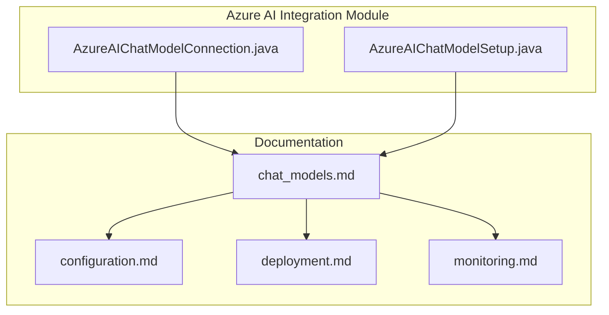
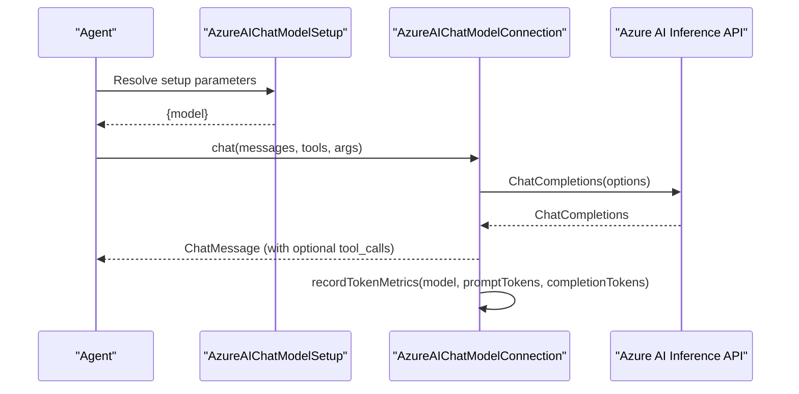
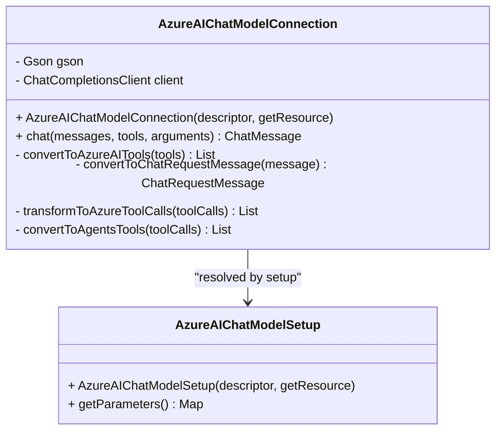
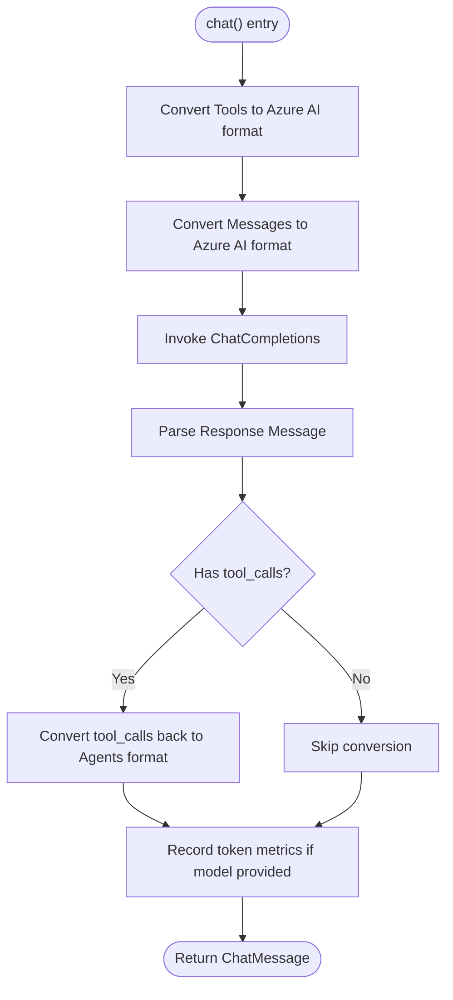
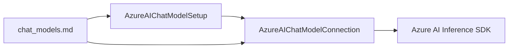

# Azure AI Integration

<cite>
**Referenced Files in This Document**
- [AzureAIChatModelConnection.java](file://integrations/chat-models/azureai/src/main/java/org/apache/flink/agents/integrations/chatmodels/azureai/AzureAIChatModelConnection.java)
- [AzureAIChatModelSetup.java](file://integrations/chat-models/azureai/src/main/java/org/apache/flink/agents/integrations/chatmodels/azureai/AzureAIChatModelSetup.java)
- [chat_models.md](file://docs/content/docs/development/chat_models.md)
- [configuration.md](file://docs/content/docs/operations/configuration.md)
- [deployment.md](file://docs/content/docs/operations/deployment.md)
- [monitoring.md](file://docs/content/docs/operations/monitoring.md)
</cite>

## Table of Contents
1. [Introduction](#introduction)
2. [Project Structure](#project-structure)
3. [Core Components](#core-components)
4. [Architecture Overview](#architecture-overview)
5. [Detailed Component Analysis](#detailed-component-analysis)
6. [Dependency Analysis](#dependency-analysis)
7. [Performance Considerations](#performance-considerations)
8. [Troubleshooting Guide](#troubleshooting-guide)
9. [Conclusion](#conclusion)
10. [Appendices](#appendices)

## Introduction
This document explains how Flink Agents integrates with Azure AI Chat Completions via the Azure AI Inference API. It focuses on the AzureAIChatModelConnection class, its configuration, authentication, endpoint handling, and operational guidance. It also covers model selection, token metrics, monitoring, and best practices for enterprise deployments.

## Project Structure
The Azure AI integration is implemented as a dedicated module with two primary classes:
- AzureAIChatModelConnection: Implements the chat model connection using Azure AI Inference SDK.
- AzureAIChatModelSetup: Provides chat model setup parameters and defaults.

Documentation for providers and configuration is maintained in the repository’s documentation pages.

**Diagram sources**
- [AzureAIChatModelConnection.java](file://integrations/chat-models/azureai/src/main/java/org/apache/flink/agents/integrations/chatmodels/azureai/AzureAIChatModelConnection.java#L1-L234)
- [AzureAIChatModelSetup.java](file://integrations/chat-models/azureai/src/main/java/org/apache/flink/agents/integrations/chatmodels/azureai/AzureAIChatModelSetup.java#L1-L67)
- [chat_models.md](file://docs/content/docs/development/chat_models.md#L291-L384)
- [configuration.md](file://docs/content/docs/operations/configuration.md#L25-L151)
- [deployment.md](file://docs/content/docs/operations/deployment.md#L25-L179)
- [monitoring.md](file://docs/content/docs/operations/monitoring.md#L25-L162)

**Section sources**
- [AzureAIChatModelConnection.java](file://integrations/chat-models/azureai/src/main/java/org/apache/flink/agents/integrations/chatmodels/azureai/AzureAIChatModelConnection.java#L1-L234)
- [AzureAIChatModelSetup.java](file://integrations/chat-models/azureai/src/main/java/org/apache/flink/agents/integrations/chatmodels/azureai/AzureAIChatModelSetup.java#L1-L67)
- [chat_models.md](file://docs/content/docs/development/chat_models.md#L291-L384)

## Core Components
- AzureAIChatModelConnection
  - Initializes an Azure AI ChatCompletionsClient using an API key credential and endpoint.
  - Converts Flink Agents’ ChatMessage and Tool structures to Azure AI’s request/response types.
  - Records token usage metrics when model name is available.
- AzureAIChatModelSetup
  - Supplies the model name and other chat-specific parameters to the runtime.

Key configuration parameters:
- endpoint: Azure AI service endpoint URL.
- apiKey: API key for authentication.

Usage guidance and examples are documented in the provider guide.

**Section sources**
- [AzureAIChatModelConnection.java](file://integrations/chat-models/azureai/src/main/java/org/apache/flink/agents/integrations/chatmodels/azureai/AzureAIChatModelConnection.java#L63-L90)
- [AzureAIChatModelConnection.java](file://integrations/chat-models/azureai/src/main/java/org/apache/flink/agents/integrations/chatmodels/azureai/AzureAIChatModelConnection.java#L164-L205)
- [AzureAIChatModelSetup.java](file://integrations/chat-models/azureai/src/main/java/org/apache/flink/agents/integrations/chatmodels/azureai/AzureAIChatModelSetup.java#L51-L66)
- [chat_models.md](file://docs/content/docs/development/chat_models.md#L291-L384)

## Architecture Overview
The integration follows a standard pattern:
- ResourceDeclaration: Define a connection and a setup resource.
- Runtime Execution: The setup resolves the connection and invokes the Azure AI Chat Completions API.
- Metrics: Token usage is recorded when model metadata is present.

**Diagram sources**
- [AzureAIChatModelConnection.java](file://integrations/chat-models/azureai/src/main/java/org/apache/flink/agents/integrations/chatmodels/azureai/AzureAIChatModelConnection.java#L164-L205)
- [AzureAIChatModelSetup.java](file://integrations/chat-models/azureai/src/main/java/org/apache/flink/agents/integrations/chatmodels/azureai/AzureAIChatModelSetup.java#L51-L66)

## Detailed Component Analysis

### AzureAIChatModelConnection
Responsibilities:
- Validate endpoint presence.
- Construct ChatCompletionsClient with AzureKeyCredential and endpoint.
- Convert incoming ChatMessage instances to Azure AI request messages.
- Convert outgoing Azure AI response messages to Flink Agents’ ChatMessage.
- Transform tool calls between Flink Agents and Azure AI formats.
- Record token usage metrics when model name is provided.

Implementation highlights:
- Endpoint validation and client initialization.
- Role mapping for system/user/assistant/tool messages.
- Tool call conversion for function-type calls.
- Metrics recording using model name and usage fields.

**Diagram sources**
- [AzureAIChatModelConnection.java](file://integrations/chat-models/azureai/src/main/java/org/apache/flink/agents/integrations/chatmodels/azureai/AzureAIChatModelConnection.java#L63-L234)
- [AzureAIChatModelSetup.java](file://integrations/chat-models/azureai/src/main/java/org/apache/flink/agents/integrations/chatmodels/azureai/AzureAIChatModelSetup.java#L51-L66)

**Section sources**
- [AzureAIChatModelConnection.java](file://integrations/chat-models/azureai/src/main/java/org/apache/flink/agents/integrations/chatmodels/azureai/AzureAIChatModelConnection.java#L63-L90)
- [AzureAIChatModelConnection.java](file://integrations/chat-models/azureai/src/main/java/org/apache/flink/agents/integrations/chatmodels/azureai/AzureAIChatModelConnection.java#L114-L162)
- [AzureAIChatModelConnection.java](file://integrations/chat-models/azureai/src/main/java/org/apache/flink/agents/integrations/chatmodels/azureai/AzureAIChatModelConnection.java#L164-L205)
- [AzureAIChatModelConnection.java](file://integrations/chat-models/azureai/src/main/java/org/apache/flink/agents/integrations/chatmodels/azureai/AzureAIChatModelConnection.java#L207-L232)

### AzureAIChatModelSetup
Responsibilities:
- Provide model name and other chat parameters to the runtime.
- Defer advanced options to ChatCompletionsOptions at invocation time.

Behavior:
- Exposes model as a parameter for the setup.

**Section sources**
- [AzureAIChatModelSetup.java](file://integrations/chat-models/azureai/src/main/java/org/apache/flink/agents/integrations/chatmodels/azureai/AzureAIChatModelSetup.java#L51-L66)

### Authentication and Configuration
- Authentication: API key-based using AzureKeyCredential.
- Configuration keys:
  - endpoint: Azure AI service endpoint URL.
  - apiKey: API key for authentication.
- Provider documentation includes prerequisites and usage examples.

Note: The current integration uses API key authentication. For Azure Active Directory or managed identity scenarios, consult Azure AI Inference SDK capabilities and adjust client initialization accordingly.

**Section sources**
- [AzureAIChatModelConnection.java](file://integrations/chat-models/azureai/src/main/java/org/apache/flink/agents/integrations/chatmodels/azureai/AzureAIChatModelConnection.java#L80-L90)
- [chat_models.md](file://docs/content/docs/development/chat_models.md#L291-L384)

### Endpoint Configuration and Regional Availability
- Endpoint: Provided via the endpoint argument.
- Model names: Select from Azure AI Inference catalog (e.g., gpt-4o, gpt-4, gpt-4-turbo, gpt-3.5-turbo).
- Availability: Consult Azure AI documentation for model availability and updates.

**Section sources**
- [chat_models.md](file://docs/content/docs/development/chat_models.md#L371-L383)

### Tool Calling and Message Conversion
- Incoming messages are mapped to Azure AI request roles.
- Tool calls are transformed for function-type invocations.
- Outgoing tool_calls are converted back to a normalized structure.

**Diagram sources**
- [AzureAIChatModelConnection.java](file://integrations/chat-models/azureai/src/main/java/org/apache/flink/agents/integrations/chatmodels/azureai/AzureAIChatModelConnection.java#L164-L205)
- [AzureAIChatModelConnection.java](file://integrations/chat-models/azureai/src/main/java/org/apache/flink/agents/integrations/chatmodels/azureai/AzureAIChatModelConnection.java#L207-L232)

**Section sources**
- [AzureAIChatModelConnection.java](file://integrations/chat-models/azureai/src/main/java/org/apache/flink/agents/integrations/chatmodels/azureai/AzureAIChatModelConnection.java#L114-L162)
- [AzureAIChatModelConnection.java](file://integrations/chat-models/azureai/src/main/java/org/apache/flink/agents/integrations/chatmodels/azureai/AzureAIChatModelConnection.java#L164-L205)

## Dependency Analysis
- Internal dependencies:
  - AzureAIChatModelConnection extends BaseChatModelConnection and uses Azure AI Inference SDK types.
  - AzureAIChatModelSetup extends BaseChatModelSetup and supplies model parameters.
- External dependencies:
  - Azure AI Inference SDK (ChatCompletionsClient, credentials, message types).
- Documentation dependencies:
  - Provider parameters and examples are defined in chat_models.md.

**Diagram sources**
- [AzureAIChatModelConnection.java](file://integrations/chat-models/azureai/src/main/java/org/apache/flink/agents/integrations/chatmodels/azureai/AzureAIChatModelConnection.java#L20-L38)
- [AzureAIChatModelSetup.java](file://integrations/chat-models/azureai/src/main/java/org/apache/flink/agents/integrations/chatmodels/azureai/AzureAIChatModelSetup.java#L20-L24)
- [chat_models.md](file://docs/content/docs/development/chat_models.md#L291-L384)

**Section sources**
- [AzureAIChatModelConnection.java](file://integrations/chat-models/azureai/src/main/java/org/apache/flink/agents/integrations/chatmodels/azureai/AzureAIChatModelConnection.java#L20-L38)
- [AzureAIChatModelSetup.java](file://integrations/chat-models/azureai/src/main/java/org/apache/flink/agents/integrations/chatmodels/azureai/AzureAIChatModelSetup.java#L20-L24)
- [chat_models.md](file://docs/content/docs/development/chat_models.md#L291-L384)

## Performance Considerations
- Token metrics: The integration records prompt and completion tokens when model name is available, enabling cost tracking and optimization.
- Async execution: Chat operations can be configured to run asynchronously via framework options.
- Retries and timeouts: Configure error handling strategy and retry counts to improve resilience under transient network conditions.

Practical tips:
- Monitor token usage per model to identify cost drivers.
- Tune async settings and thread pools according to workload characteristics.
- Use appropriate error handling strategies to balance reliability and latency.

**Section sources**
- [AzureAIChatModelConnection.java](file://integrations/chat-models/azureai/src/main/java/org/apache/flink/agents/integrations/chatmodels/azureai/AzureAIChatModelConnection.java#L192-L200)
- [monitoring.md](file://docs/content/docs/operations/monitoring.md#L42-L50)
- [configuration.md](file://docs/content/docs/operations/configuration.md#L122-L136)

## Troubleshooting Guide
Common issues and resolutions:
- Authentication failures
  - Verify endpoint and apiKey are correctly set.
  - Confirm the API key has access to the target Azure AI resource.
- Empty or invalid endpoint
  - Ensure endpoint is non-null and properly formatted.
- Tool call mismatches
  - Validate tool schemas and function names align with expectations.
- Token metrics missing
  - Provide a model name so usage fields can be recorded.
- Network connectivity
  - Check regional availability and firewall rules for the endpoint.
- Quota or rate limits
  - Review Azure AI resource quotas and consider scaling or throttling adjustments.

Operational references:
- Configuration loading and priorities.
- Deployment modes and environment setup.
- Monitoring metrics and logs.

**Section sources**
- [AzureAIChatModelConnection.java](file://integrations/chat-models/azureai/src/main/java/org/apache/flink/agents/integrations/chatmodels/azureai/AzureAIChatModelConnection.java#L80-L90)
- [AzureAIChatModelConnection.java](file://integrations/chat-models/azureai/src/main/java/org/apache/flink/agents/integrations/chatmodels/azureai/AzureAIChatModelConnection.java#L192-L200)
- [configuration.md](file://docs/content/docs/operations/configuration.md#L25-L151)
- [deployment.md](file://docs/content/docs/operations/deployment.md#L25-L179)
- [monitoring.md](file://docs/content/docs/operations/monitoring.md#L25-L162)

## Conclusion
The Azure AI integration in Flink Agents provides a straightforward path to use Azure AI Inference models for chat completions. By configuring endpoint and API key, defining a setup with a model name, and leveraging tool calling and token metrics, teams can build robust, observable agents. For enterprise-grade deployments, combine proper configuration, monitoring, and best practices around retries and async execution to achieve reliability and cost efficiency.

## Appendices

### Configuration Examples and References
- Provider parameters and usage examples are documented in the provider guide.
- Model names and availability are linked from the documentation.

**Section sources**
- [chat_models.md](file://docs/content/docs/development/chat_models.md#L291-L384)