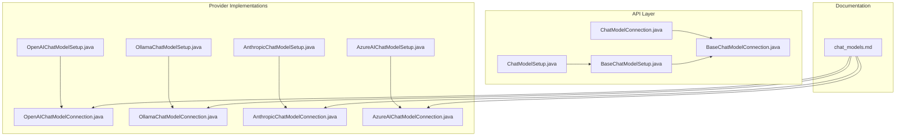
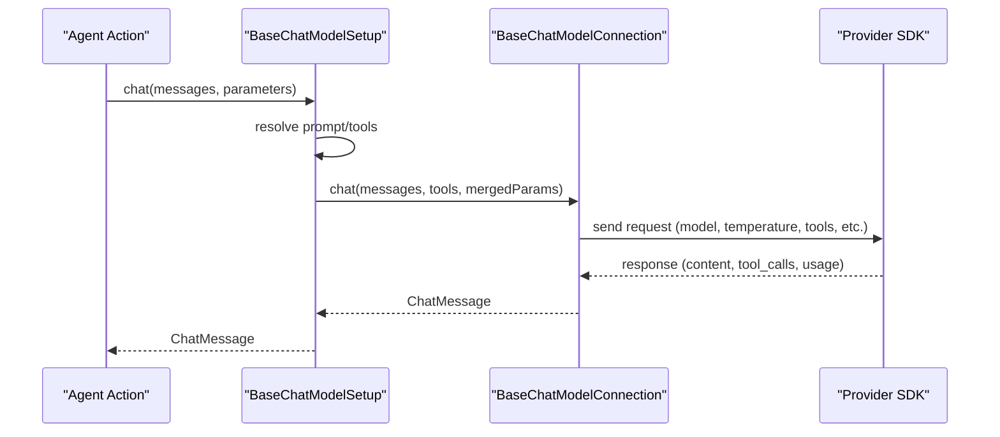
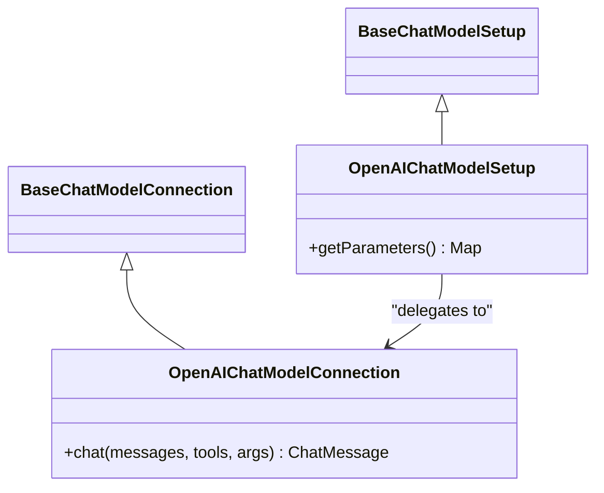
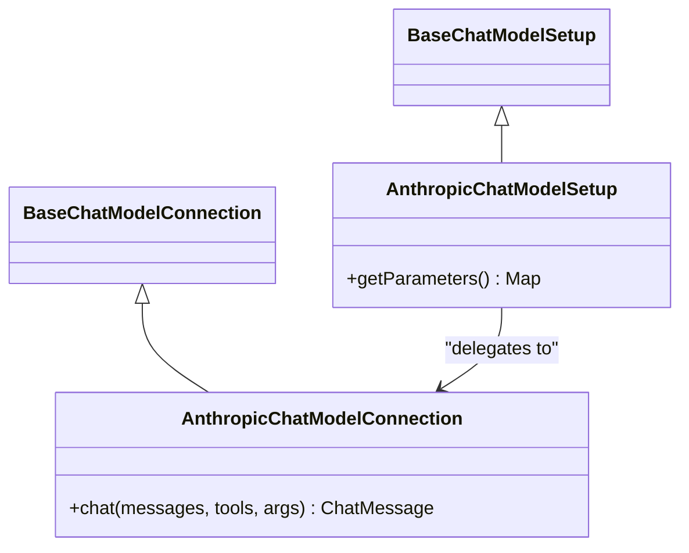
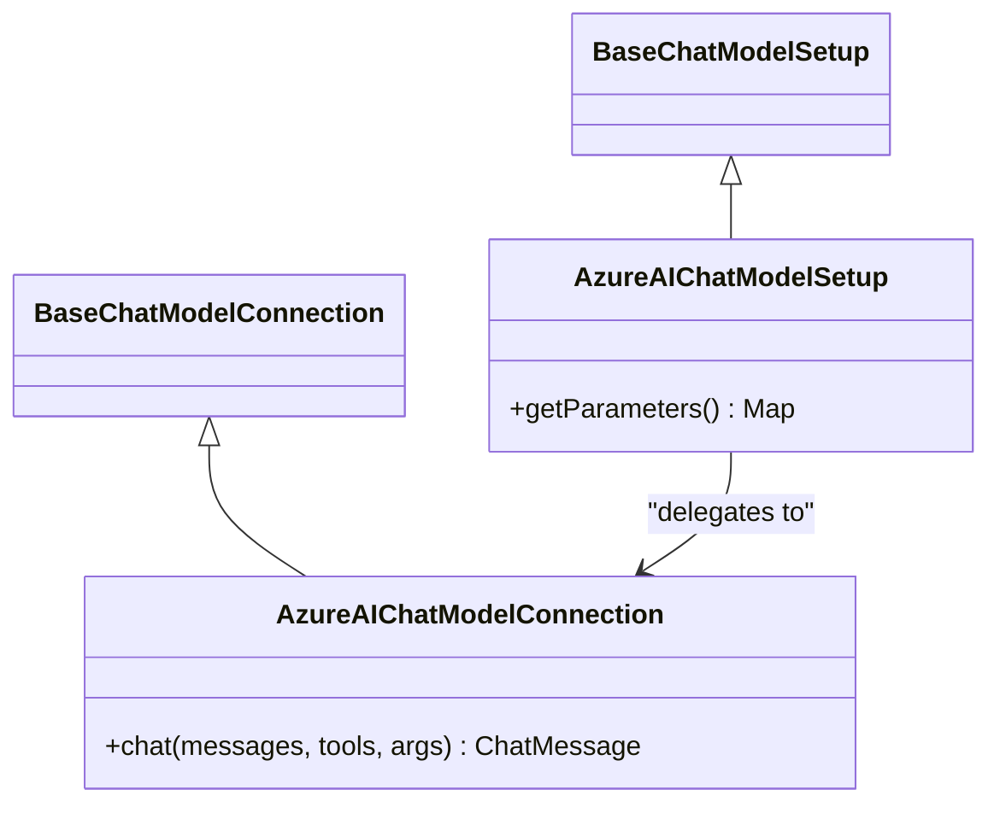
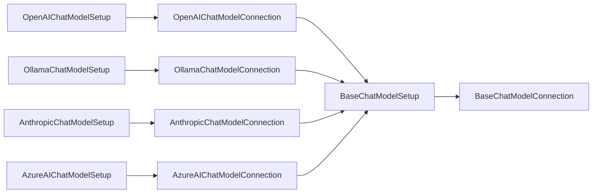

# Chat Model Integrations

<cite>
**Referenced Files in This Document**
- [chat_models.md](file://docs/content/docs/development/chat_models.md)
- [BaseChatModelConnection.java](file://api/src/main/java/org/apache/flink/agents/api/chat/model/BaseChatModelConnection.java)
- [BaseChatModelSetup.java](file://api/src/main/java/org/apache/flink/agents/api/chat/model/BaseChatModelSetup.java)
- [ChatModelConnection.java](file://api/src/main/java/org/apache/flink/agents/api/annotation/ChatModelConnection.java)
- [ChatModelSetup.java](file://api/src/main/java/org/apache/flink/agents/api/annotation/ChatModelSetup.java)
- [OpenAIChatModelConnection.java](file://integrations/chat-models/openai/src/main/java/org/apache/flink/agents/integrations/chatmodels/openai/OpenAIChatModelConnection.java)
- [OpenAIChatModelSetup.java](file://integrations/chat-models/openai/src/main/java/org/apache/flink/agents/integrations/chatmodels/openai/OpenAIChatModelSetup.java)
- [OllamaChatModelConnection.java](file://integrations/chat-models/ollama/src/main/java/org/apache/flink/agents/integrations/chatmodels/ollama/OllamaChatModelConnection.java)
- [OllamaChatModelSetup.java](file://integrations/chat-models/ollama/src/main/java/org/apache/flink/agents/integrations/chatmodels/ollama/OllamaChatModelSetup.java)
- [AnthropicChatModelConnection.java](file://integrations/chat-models/anthropic/src/main/java/org/apache/flink/agents/integrations/chatmodels/anthropic/AnthropicChatModelConnection.java)
- [AnthropicChatModelSetup.java](file://integrations/chat-models/anthropic/src/main/java/org/apache/flink/agents/integrations/chatmodels/anthropic/AnthropicChatModelSetup.java)
- [AzureAIChatModelConnection.java](file://integrations/chat-models/azureai/src/main/java/org/apache/flink/agents/integrations/chatmodels/azureai/AzureAIChatModelConnection.java)
- [AzureAIChatModelSetup.java](file://integrations/chat-models/azureai/src/main/java/org/apache/flink/agents/integrations/chatmodels/azureai/AzureAIChatModelSetup.java)
</cite>

## Table of Contents
1. [Introduction](#introduction)
2. [Project Structure](#project-structure)
3. [Core Components](#core-components)
4. [Architecture Overview](#architecture-overview)
5. [Detailed Component Analysis](#detailed-component-analysis)
6. [Dependency Analysis](#dependency-analysis)
7. [Performance Considerations](#performance-considerations)
8. [Troubleshooting Guide](#troubleshooting-guide)
9. [Conclusion](#conclusion)

## Introduction
This document explains how Flink Agents integrates with major chat model providers (OpenAI, Ollama, Anthropic, Azure AI). It covers setup patterns, configuration options, authentication, connection parameters, error handling, rate limiting, and production best practices. The goal is to help you confidently configure and operate chat models in agent workflows.

## Project Structure
Flink Agents separates concerns into:
- API abstractions: Base classes for connections and setups
- Provider implementations: Concrete integrations for each vendor
- Documentation: Guides and parameter tables for each provider

**Diagram sources**
- [BaseChatModelConnection.java](file://api/src/main/java/org/apache/flink/agents/api/chat/model/BaseChatModelConnection.java#L32-L79)
- [BaseChatModelSetup.java](file://api/src/main/java/org/apache/flink/agents/api/chat/model/BaseChatModelSetup.java#L37-L128)
- [ChatModelConnection.java](file://api/src/main/java/org/apache/flink/agents/api/annotation/ChatModelConnection.java#L26-L35)
- [ChatModelSetup.java](file://api/src/main/java/org/apache/flink/agents/api/annotation/ChatModelSetup.java#L26-L35)
- [OpenAIChatModelConnection.java](file://integrations/chat-models/openai/src/main/java/org/apache/flink/agents/integrations/chatmodels/openai/OpenAIChatModelConnection.java#L62-L137)
- [OpenAIChatModelSetup.java](file://integrations/chat-models/openai/src/main/java/org/apache/flink/agents/integrations/chatmodels/openai/OpenAIChatModelSetup.java#L32-L127)
- [OllamaChatModelConnection.java](file://integrations/chat-models/ollama/src/main/java/org/apache/flink/agents/integrations/chatmodels/ollama/OllamaChatModelConnection.java#L40-L100)
- [OllamaChatModelSetup.java](file://integrations/chat-models/ollama/src/main/java/org/apache/flink/agents/integrations/chatmodels/ollama/OllamaChatModelSetup.java#L31-L98)
- [AnthropicChatModelConnection.java](file://integrations/chat-models/anthropic/src/main/java/org/apache/flink/agents/integrations/chatmodels/anthropic/AnthropicChatModelConnection.java#L55-L112)
- [AnthropicChatModelSetup.java](file://integrations/chat-models/anthropic/src/main/java/org/apache/flink/agents/integrations/chatmodels/anthropic/AnthropicChatModelSetup.java#L31-L124)
- [AzureAIChatModelConnection.java](file://integrations/chat-models/azureai/src/main/java/org/apache/flink/agents/integrations/chatmodels/azureai/AzureAIChatModelConnection.java#L40-L90)
- [AzureAIChatModelSetup.java](file://integrations/chat-models/azureai/src/main/java/org/apache/flink/agents/integrations/chatmodels/azureai/AzureAIChatModelSetup.java#L25-L66)

**Section sources**
- [chat_models.md](file://docs/content/docs/development/chat_models.md#L25-L141)

## Core Components
- BaseChatModelConnection: Defines the contract for connecting to a provider, including authentication, timeouts, retries, and the chat method that returns a ChatMessage.
- BaseChatModelSetup: Encapsulates per-chat configuration (model, temperature, tools, prompt), resolves tools and prompts, merges parameters, and delegates to the connection.
- Annotations: @ChatModelConnection and @ChatModelSetup mark methods that produce ResourceDescriptor entries for the agent plan.

Key behaviors:
- Token metrics recording: BaseChatModelConnection records prompt/completion tokens when available.
- Prompt formatting: BaseChatModelSetup optionally formats input messages using a Prompt resource.
- Tool resolution: BaseChatModelSetup resolves tool names into Tool resources for the connection.

**Section sources**
- [BaseChatModelConnection.java](file://api/src/main/java/org/apache/flink/agents/api/chat/model/BaseChatModelConnection.java#L32-L79)
- [BaseChatModelSetup.java](file://api/src/main/java/org/apache/flink/agents/api/chat/model/BaseChatModelSetup.java#L37-L128)
- [ChatModelConnection.java](file://api/src/main/java/org/apache/flink/agents/api/annotation/ChatModelConnection.java#L26-L35)
- [ChatModelSetup.java](file://api/src/main/java/org/apache/flink/agents/api/annotation/ChatModelSetup.java#L26-L35)

## Architecture Overview
The system uses a two-tier pattern:
- Setup resources bind a connection resource to model parameters and tools.
- Connection resources implement provider-specific logic and return standardized ChatMessage objects.

**Diagram sources**
- [BaseChatModelSetup.java](file://api/src/main/java/org/apache/flink/agents/api/chat/model/BaseChatModelSetup.java#L54-L101)
- [BaseChatModelConnection.java](file://api/src/main/java/org/apache/flink/agents/api/chat/model/BaseChatModelConnection.java#L58-L79)
- [OpenAIChatModelConnection.java](file://integrations/chat-models/openai/src/main/java/org/apache/flink/agents/integrations/chatmodels/openai/OpenAIChatModelConnection.java#L139-L165)
- [AnthropicChatModelConnection.java](file://integrations/chat-models/anthropic/src/main/java/org/apache/flink/agents/integrations/chatmodels/anthropic/AnthropicChatModelConnection.java#L119-L155)
- [OllamaChatModelConnection.java](file://integrations/chat-models/ollama/src/main/java/org/apache/flink/agents/integrations/chatmodels/ollama/OllamaChatModelConnection.java#L179-L244)
- [AzureAIChatModelConnection.java](file://integrations/chat-models/azureai/src/main/java/org/apache/flink/agents/integrations/chatmodels/azureai/AzureAIChatModelConnection.java#L164-L205)

## Detailed Component Analysis

### OpenAI Integration
- Connection parameters:
  - api_key (required)
  - api_base_url (optional, defaults to the OpenAI API base)
  - timeout (optional)
  - max_retries (optional)
  - default_headers (optional)
  - model (optional, default model for the client)
- Setup parameters:
  - model (defaults to a sensible default if not provided)
  - temperature (0.0–2.0)
  - max_tokens (optional)
  - logprobs/top_logprobs (optional)
  - strict (boolean for strict tool schemas)
  - reasoning_effort ("low"|"medium"|"high" for reasoning models)
  - additional_kwargs (provider-specific parameters)

Implementation highlights:
- Validates temperature and token bounds.
- Supports tool definitions with strict schemas.
- Records token usage when present in the response.

**Diagram sources**
- [OpenAIChatModelConnection.java](file://integrations/chat-models/openai/src/main/java/org/apache/flink/agents/integrations/chatmodels/openai/OpenAIChatModelConnection.java#L62-L137)
- [OpenAIChatModelSetup.java](file://integrations/chat-models/openai/src/main/java/org/apache/flink/agents/integrations/chatmodels/openai/OpenAIChatModelSetup.java#L32-L127)

**Section sources**
- [OpenAIChatModelConnection.java](file://integrations/chat-models/openai/src/main/java/org/apache/flink/agents/integrations/chatmodels/openai/OpenAIChatModelConnection.java#L62-L137)
- [OpenAIChatModelSetup.java](file://integrations/chat-models/openai/src/main/java/org/apache/flink/agents/integrations/chatmodels/openai/OpenAIChatModelSetup.java#L32-L127)
- [chat_models.md](file://docs/content/docs/development/chat_models.md#L642-L800)

### Ollama Integration
- Connection parameters:
  - endpoint (required, e.g., http://localhost:11434)
  - requestTimeout (optional)
- Setup parameters:
  - model (required)
  - think (boolean or predefined levels)
  - extract_reasoning (boolean)
  - tools (optional)
  - prompt (optional)
  - temperature/num_ctx/keep_alive/additional_kwargs (provider-specific)

Implementation highlights:
- Converts Flink Tools to Ollama-compatible tool specs.
- Handles tool calls and reasoning extraction.
- Records token metrics using prompt_eval_count and eval_count.

**Diagram sources**
- [OllamaChatModelConnection.java](file://integrations/chat-models/ollama/src/main/java/org/apache/flink/agents/integrations/chatmodels/ollama/OllamaChatModelConnection.java#L40-L100)
- [OllamaChatModelSetup.java](file://integrations/chat-models/ollama/src/main/java/org/apache/flink/agents/integrations/chatmodels/ollama/OllamaChatModelSetup.java#L31-L98)

**Section sources**
- [OllamaChatModelConnection.java](file://integrations/chat-models/ollama/src/main/java/org/apache/flink/agents/integrations/chatmodels/ollama/OllamaChatModelConnection.java#L40-L100)
- [OllamaChatModelSetup.java](file://integrations/chat-models/ollama/src/main/java/org/apache/flink/agents/integrations/chatmodels/ollama/OllamaChatModelSetup.java#L31-L98)
- [chat_models.md](file://docs/content/docs/development/chat_models.md#L492-L641)

### Anthropic Integration
- Connection parameters:
  - api_key (required)
  - timeout (optional)
  - max_retries (optional)
- Setup parameters:
  - model (defaults to a specific Claude model if not provided)
  - temperature (0.0–1.0)
  - max_tokens (positive)
  - json_prefill (boolean, disabled when tools are used)
  - strict_tools (boolean for structured outputs)
  - additional_kwargs (top_k, top_p, stop_sequences)

Implementation highlights:
- Supports JSON prefill to enforce JSON output (automatically disabled with tools).
- Applies structured outputs beta header when strict_tools is enabled.
- Extracts JSON from markdown code blocks when no tool calls are present.

**Diagram sources**
- [AnthropicChatModelConnection.java](file://integrations/chat-models/anthropic/src/main/java/org/apache/flink/agents/integrations/chatmodels/anthropic/AnthropicChatModelConnection.java#L55-L112)
- [AnthropicChatModelSetup.java](file://integrations/chat-models/anthropic/src/main/java/org/apache/flink/agents/integrations/chatmodels/anthropic/AnthropicChatModelSetup.java#L31-L124)

**Section sources**
- [AnthropicChatModelConnection.java](file://integrations/chat-models/anthropic/src/main/java/org/apache/flink/agents/integrations/chatmodels/anthropic/AnthropicChatModelConnection.java#L55-L112)
- [AnthropicChatModelSetup.java](file://integrations/chat-models/anthropic/src/main/java/org/apache/flink/agents/integrations/chatmodels/anthropic/AnthropicChatModelSetup.java#L31-L124)
- [chat_models.md](file://docs/content/docs/development/chat_models.md#L143-L291)

### Azure AI Integration
- Connection parameters:
  - endpoint (required)
  - apiKey (required)
- Setup parameters:
  - model (required)
  - prompt (optional)
  - tools (optional)

Implementation highlights:
- Uses Azure AI Inference Chat Completions client.
- Converts tool schemas to Azure function tool definitions.
- Records token metrics using usage fields.

**Diagram sources**
- [AzureAIChatModelConnection.java](file://integrations/chat-models/azureai/src/main/java/org/apache/flink/agents/integrations/chatmodels/azureai/AzureAIChatModelConnection.java#L40-L90)
- [AzureAIChatModelSetup.java](file://integrations/chat-models/azureai/src/main/java/org/apache/flink/agents/integrations/chatmodels/azureai/AzureAIChatModelSetup.java#L25-L66)

**Section sources**
- [AzureAIChatModelConnection.java](file://integrations/chat-models/azureai/src/main/java/org/apache/flink/agents/integrations/chatmodels/azureai/AzureAIChatModelConnection.java#L40-L90)
- [AzureAIChatModelSetup.java](file://integrations/chat-models/azureai/src/main/java/org/apache/flink/agents/integrations/chatmodels/azureai/AzureAIChatModelSetup.java#L25-L66)
- [chat_models.md](file://docs/content/docs/development/chat_models.md#L292-L384)

### Cross-Language Notes
- Some providers are documented as supported in one language first; cross-language usage is possible via documented patterns.

**Section sources**
- [chat_models.md](file://docs/content/docs/development/chat_models.md#L296-L298)

## Dependency Analysis
- Base classes decouple agent logic from provider specifics.
- Each provider’s Setup depends on its Connection; the Setup resolves tools and prompts and forwards parameters.
- Token metrics are recorded centrally in BaseChatModelConnection.

**Diagram sources**
- [BaseChatModelConnection.java](file://api/src/main/java/org/apache/flink/agents/api/chat/model/BaseChatModelConnection.java#L32-L79)
- [BaseChatModelSetup.java](file://api/src/main/java/org/apache/flink/agents/api/chat/model/BaseChatModelSetup.java#L37-L128)
- [OpenAIChatModelConnection.java](file://integrations/chat-models/openai/src/main/java/org/apache/flink/agents/integrations/chatmodels/openai/OpenAIChatModelConnection.java#L62-L137)
- [OllamaChatModelConnection.java](file://integrations/chat-models/ollama/src/main/java/org/apache/flink/agents/integrations/chatmodels/ollama/OllamaChatModelConnection.java#L40-L100)
- [AnthropicChatModelConnection.java](file://integrations/chat-models/anthropic/src/main/java/org/apache/flink/agents/integrations/chatmodels/anthropic/AnthropicChatModelConnection.java#L55-L112)
- [AzureAIChatModelConnection.java](file://integrations/chat-models/azureai/src/main/java/org/apache/flink/agents/integrations/chatmodels/azureai/AzureAIChatModelConnection.java#L40-L90)

**Section sources**
- [BaseChatModelConnection.java](file://api/src/main/java/org/apache/flink/agents/api/chat/model/BaseChatModelConnection.java#L32-L79)
- [BaseChatModelSetup.java](file://api/src/main/java/org/apache/flink/agents/api/chat/model/BaseChatModelSetup.java#L37-L128)

## Performance Considerations
- Connection pooling and reuse:
  - OpenAI: default_headers and reuse_client options influence throughput and latency.
  - Azure AI: client is constructed once per connection.
- Timeouts and retries:
  - Configure timeout and max_retries per provider to balance responsiveness and reliability.
- Token efficiency:
  - Use appropriate max_tokens and temperature to reduce unnecessary generations.
  - Prefer structured outputs (strict tools/json prefill) to minimize post-processing.
- Local inference:
  - Ollama keeps models loaded; tune keep_alive and num_ctx to match workload patterns.

[No sources needed since this section provides general guidance]

## Troubleshooting Guide
Common issues and remedies:
- Authentication failures:
  - Verify api_key/apiKey values and endpoint URLs for each provider.
- Invalid parameters:
  - Temperature and token limits are validated; adjust within supported ranges.
- Tool schema mismatches:
  - Ensure tool input schemas are valid JSON Schemas; strict modes require precise schemas.
- Rate limiting and quotas:
  - Implement backoff and retry strategies; monitor provider quotas and usage.
- Token metrics missing:
  - Some responses may not include usage; fallback to manual accounting or provider dashboards.

**Section sources**
- [OpenAIChatModelConnection.java](file://integrations/chat-models/openai/src/main/java/org/apache/flink/agents/integrations/chatmodels/openai/OpenAIChatModelConnection.java#L106-L137)
- [AnthropicChatModelConnection.java](file://integrations/chat-models/anthropic/src/main/java/org/apache/flink/agents/integrations/chatmodels/anthropic/AnthropicChatModelConnection.java#L93-L112)
- [AzureAIChatModelConnection.java](file://integrations/chat-models/azureai/src/main/java/org/apache/flink/agents/integrations/chatmodels/azureai/AzureAIChatModelConnection.java#L80-L90)
- [OllamaChatModelConnection.java](file://integrations/chat-models/ollama/src/main/java/org/apache/flink/agents/integrations/chatmodels/ollama/OllamaChatModelConnection.java#L76-L84)

## Conclusion
Flink Agents provides a consistent abstraction for integrating multiple chat model providers. By separating connection configuration from per-chat setup, you can easily swap providers, manage tools and prompts, and track token usage. Follow the provider-specific parameter tables, apply robust error handling and retries, and leverage token metrics for cost and performance monitoring in production.