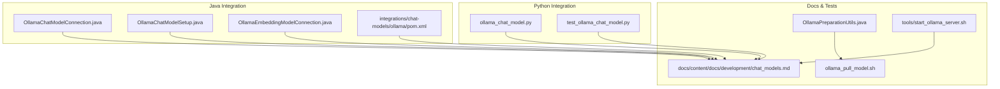
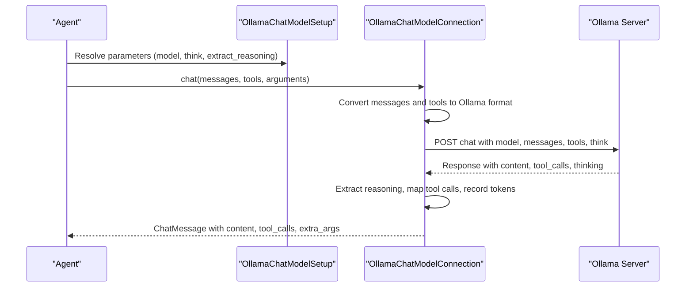
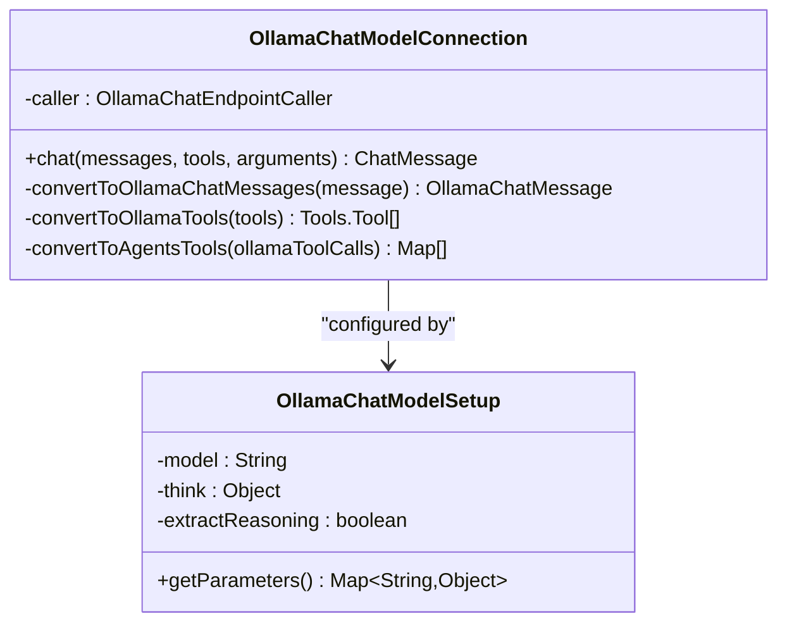
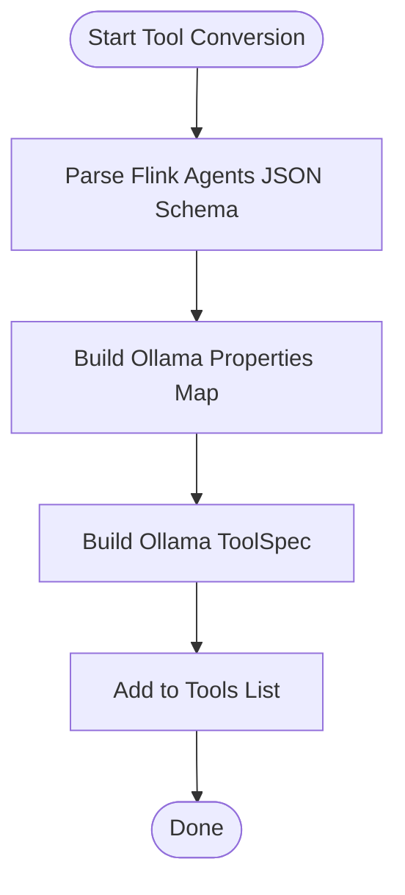
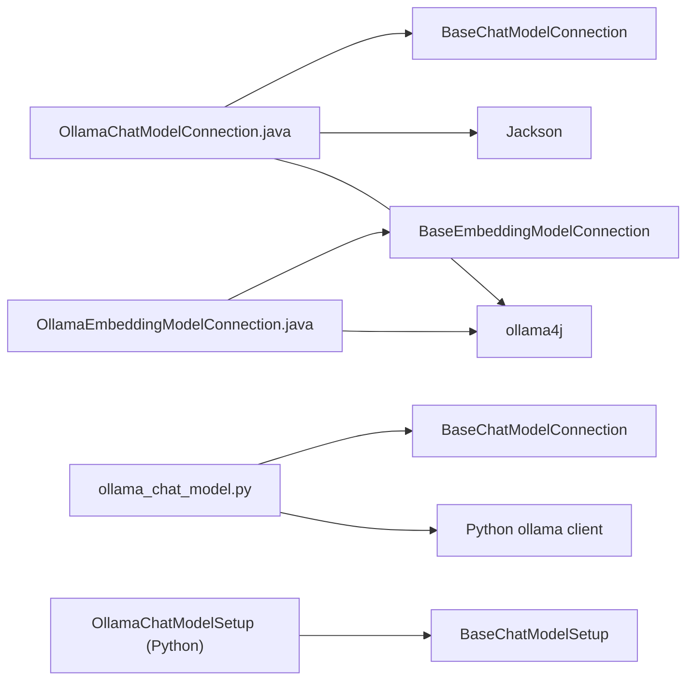

# Ollama Integration

<cite>
**Referenced Files in This Document**
- [OllamaChatModelConnection.java](file://integrations/chat-models/ollama/src/main/java/org/apache/flink/agents/integrations/chatmodels/ollama/OllamaChatModelConnection.java)
- [OllamaChatModelSetup.java](file://integrations/chat-models/ollama/src/main/java/org/apache/flink/agents/integrations/chatmodels/ollama/OllamaChatModelSetup.java)
- [OllamaEmbeddingModelConnection.java](file://integrations/embedding-models/ollama/src/main/java/org/apache/flink/agents/integrations/embeddingmodels/ollama/OllamaEmbeddingModelConnection.java)
- [chat_models.md](file://docs/content/docs/development/chat_models.md)
- [ollama_pull_model.sh](file://e2e-test/flink-agents-end-to-end-tests-integration/src/test/resources/ollama_pull_model.sh)
- [OllamaPreparationUtils.java](file://e2e-test/flink-agents-end-to-end-tests-integration/src/test/java/org/apache/flink/agents/integration/test/OllamaPreparationUtils.java)
- [start_ollama_server.sh](file://tools/start_ollama_server.sh)
- [ollama_chat_model.py](file://python/flink_agents/integrations/chat_models/ollama_chat_model.py)
- [test_ollama_chat_model.py](file://python/flink_agents/integrations/chat_models/tests/test_ollama_chat_model.py)
- [pom.xml](file://integrations/chat-models/ollama/pom.xml)
</cite>

## Table of Contents
1. [Introduction](#introduction)
2. [Project Structure](#project-structure)
3. [Core Components](#core-components)
4. [Architecture Overview](#architecture-overview)
5. [Detailed Component Analysis](#detailed-component-analysis)
6. [Dependency Analysis](#dependency-analysis)
7. [Performance Considerations](#performance-considerations)
8. [Troubleshooting Guide](#troubleshooting-guide)
9. [Conclusion](#conclusion)
10. [Appendices](#appendices)

## Introduction
This document explains how Flink Agents integrates with Ollama for local Large Language Model (LLM) inference. It covers the OllamaChatModelConnection and OllamaChatModelSetup classes, configuration for local server deployment, model loading, tool integration (including function calling and schema conversion), think mode and reasoning extraction, and operational guidance for performance and troubleshooting.

## Project Structure
The Ollama integration spans Java and Python layers:
- Java integration: chat model connection and setup, embedding model connection, and Maven module definition
- Python integration: chat model connection and setup, plus tests and utilities
- Documentation: developer guide for chat models including Ollama
- E2E and tooling: scripts to pull models and start the Ollama server



**Diagram sources**
- [OllamaChatModelConnection.java](file://integrations/chat-models/ollama/src/main/java/org/apache/flink/agents/integrations/chatmodels/ollama/OllamaChatModelConnection.java#L62-L84)
- [OllamaChatModelSetup.java](file://integrations/chat-models/ollama/src/main/java/org/apache/flink/agents/integrations/chatmodels/ollama/OllamaChatModelSetup.java#L56-L68)
- [OllamaEmbeddingModelConnection.java](file://integrations/embedding-models/ollama/src/main/java/org/apache/flink/agents/integrations/embeddingmodels/ollama/OllamaEmbeddingModelConnection.java#L35-L53)
- [chat_models.md](file://docs/content/docs/development/chat_models.md#L492-L641)
- [ollama_pull_model.sh](file://e2e-test/flink-agents-end-to-end-tests-integration/src/test/resources/ollama_pull_model.sh#L1-L20)
- [OllamaPreparationUtils.java](file://e2e-test/flink-agents-end-to-end-tests-integration/src/test/java/org/apache/flink/agents/integration/test/OllamaPreparationUtils.java#L30-L46)
- [start_ollama_server.sh](file://tools/start_ollama_server.sh#L23-L28)
- [ollama_chat_model.py](file://python/flink_agents/integrations/chat_models/ollama_chat_model.py#L36-L82)
- [test_ollama_chat_model.py](file://python/flink_agents/integrations/chat_models/tests/test_ollama_chat_model.py#L61-L71)

**Section sources**
- [chat_models.md](file://docs/content/docs/development/chat_models.md#L492-L641)
- [pom.xml](file://integrations/chat-models/ollama/pom.xml#L34-L46)

## Core Components
- OllamaChatModelConnection: wraps the Ollama chat API via ollama4j, converting Flink Agents messages and tools to Ollama-compatible requests and responses. Supports think mode and reasoning extraction.
- OllamaChatModelSetup: encapsulates model selection and chat parameters (think, extract_reasoning, model name) and exposes them to the runtime.
- OllamaEmbeddingModelConnection: handles embedding generation against Ollama’s embedding API, pulling models as needed.
- Python counterpart: OllamaChatModelConnection and OllamaChatModelSetup mirror the Java behavior for Python agents.

Key responsibilities:
- Endpoint configuration and timeouts
- Tool schema conversion from Flink Agents format to Ollama-compatible function specs
- Function calling: mapping Ollama tool calls to Flink Agents’ internal tool call format
- Token metrics recording when available
- Think mode and reasoning extraction

**Section sources**
- [OllamaChatModelConnection.java](file://integrations/chat-models/ollama/src/main/java/org/apache/flink/agents/integrations/chatmodels/ollama/OllamaChatModelConnection.java#L62-L84)
- [OllamaChatModelConnection.java](file://integrations/chat-models/ollama/src/main/java/org/apache/flink/agents/integrations/chatmodels/ollama/OllamaChatModelConnection.java#L101-L159)
- [OllamaChatModelConnection.java](file://integrations/chat-models/ollama/src/main/java/org/apache/flink/agents/integrations/chatmodels/ollama/OllamaChatModelConnection.java#L179-L244)
- [OllamaChatModelConnection.java](file://integrations/chat-models/ollama/src/main/java/org/apache/flink/agents/integrations/chatmodels/ollama/OllamaChatModelConnection.java#L246-L277)
- [OllamaChatModelSetup.java](file://integrations/chat-models/ollama/src/main/java/org/apache/flink/agents/integrations/chatmodels/ollama/OllamaChatModelSetup.java#L56-L68)
- [OllamaChatModelSetup.java](file://integrations/chat-models/ollama/src/main/java/org/apache/flink/agents/integrations/chatmodels/ollama/OllamaChatModelSetup.java#L91-L98)
- [OllamaEmbeddingModelConnection.java](file://integrations/embedding-models/ollama/src/main/java/org/apache/flink/agents/integrations/embeddingmodels/ollama/OllamaEmbeddingModelConnection.java#L35-L53)
- [OllamaEmbeddingModelConnection.java](file://integrations/embedding-models/ollama/src/main/java/org/apache/flink/agents/integrations/embeddingmodels/ollama/OllamaEmbeddingModelConnection.java#L55-L83)
- [OllamaEmbeddingModelConnection.java](file://integrations/embedding-models/ollama/src/main/java/org/apache/flink/agents/integrations/embeddingmodels/ollama/OllamaEmbeddingModelConnection.java#L85-L117)
- [ollama_chat_model.py](file://python/flink_agents/integrations/chat_models/ollama_chat_model.py#L36-L82)
- [ollama_chat_model.py](file://python/flink_agents/integrations/chat_models/ollama_chat_model.py#L84-L148)
- [ollama_chat_model.py](file://python/flink_agents/integrations/chat_models/ollama_chat_model.py#L171-L276)

## Architecture Overview
The integration follows a layered design:
- Application agents define connections and setups using annotations/decorators
- Connections handle transport and protocol specifics (HTTP to Ollama)
- Setups provide model parameters and orchestrate tool registration
- Tool schema conversion ensures compatibility between Flink Agents and Ollama
- Optional embedding model connection supports retrieval workflows



**Diagram sources**
- [OllamaChatModelConnection.java](file://integrations/chat-models/ollama/src/main/java/org/apache/flink/agents/integrations/chatmodels/ollama/OllamaChatModelConnection.java#L179-L244)
- [OllamaChatModelSetup.java](file://integrations/chat-models/ollama/src/main/java/org/apache/flink/agents/integrations/chatmodels/ollama/OllamaChatModelSetup.java#L91-L98)
- [ollama_chat_model.py](file://python/flink_agents/integrations/chat_models/ollama_chat_model.py#L84-L148)

## Detailed Component Analysis

### OllamaChatModelConnection
Responsibilities:
- Endpoint initialization with configurable timeout
- Message role mapping from Flink Agents to Ollama roles
- Tool schema conversion from Flink Agents JSON schema to Ollama function specs
- Function calling: mapping Ollama tool calls to Flink Agents’ internal format
- Think mode handling and reasoning extraction
- Token metrics recording when available

Implementation highlights:
- Endpoint validation and caller construction
- Role mapping with explicit exception handling
- Tool schema parsing and property mapping
- Tool call conversion with random IDs
- Think mode resolution and reasoning extraction into extra args



**Diagram sources**
- [OllamaChatModelConnection.java](file://integrations/chat-models/ollama/src/main/java/org/apache/flink/agents/integrations/chatmodels/ollama/OllamaChatModelConnection.java#L62-L84)
- [OllamaChatModelConnection.java](file://integrations/chat-models/ollama/src/main/java/org/apache/flink/agents/integrations/chatmodels/ollama/OllamaChatModelConnection.java#L101-L159)
- [OllamaChatModelConnection.java](file://integrations/chat-models/ollama/src/main/java/org/apache/flink/agents/integrations/chatmodels/ollama/OllamaChatModelConnection.java#L179-L244)
- [OllamaChatModelConnection.java](file://integrations/chat-models/ollama/src/main/java/org/apache/flink/agents/integrations/chatmodels/ollama/OllamaChatModelConnection.java#L246-L277)
- [OllamaChatModelSetup.java](file://integrations/chat-models/ollama/src/main/java/org/apache/flink/agents/integrations/chatmodels/ollama/OllamaChatModelSetup.java#L56-L68)
- [OllamaChatModelSetup.java](file://integrations/chat-models/ollama/src/main/java/org/apache/flink/agents/integrations/chatmodels/ollama/OllamaChatModelSetup.java#L91-L98)

**Section sources**
- [OllamaChatModelConnection.java](file://integrations/chat-models/ollama/src/main/java/org/apache/flink/agents/integrations/chatmodels/ollama/OllamaChatModelConnection.java#L62-L84)
- [OllamaChatModelConnection.java](file://integrations/chat-models/ollama/src/main/java/org/apache/flink/agents/integrations/chatmodels/ollama/OllamaChatModelConnection.java#L101-L159)
- [OllamaChatModelConnection.java](file://integrations/chat-models/ollama/src/main/java/org/apache/flink/agents/integrations/chatmodels/ollama/OllamaChatModelConnection.java#L168-L177)
- [OllamaChatModelConnection.java](file://integrations/chat-models/ollama/src/main/java/org/apache/flink/agents/integrations/chatmodels/ollama/OllamaChatModelConnection.java#L179-L244)
- [OllamaChatModelConnection.java](file://integrations/chat-models/ollama/src/main/java/org/apache/flink/agents/integrations/chatmodels/ollama/OllamaChatModelConnection.java#L246-L277)

### OllamaChatModelSetup
Responsibilities:
- Encapsulate model name and chat parameters
- Expose parameters to the runtime for chat invocations
- Default values for think and extract_reasoning

Behavior:
- Reads model, think, and extract_reasoning from resource descriptor
- Provides a parameters map consumed by the runtime

**Section sources**
- [OllamaChatModelSetup.java](file://integrations/chat-models/ollama/src/main/java/org/apache/flink/agents/integrations/chatmodels/ollama/OllamaChatModelSetup.java#L56-L68)
- [OllamaChatModelSetup.java](file://integrations/chat-models/ollama/src/main/java/org/apache/flink/agents/integrations/chatmodels/ollama/OllamaChatModelSetup.java#L91-L98)

### Tool Schema Conversion and Function Calling
- Conversion process parses Flink Agents JSON schema to Ollama function specs, mapping properties and required fields
- Tool calls returned by Ollama are transformed into Flink Agents’ internal representation with randomized IDs
- The Java and Python implementations share the same conceptual flow



**Diagram sources**
- [OllamaChatModelConnection.java](file://integrations/chat-models/ollama/src/main/java/org/apache/flink/agents/integrations/chatmodels/ollama/OllamaChatModelConnection.java#L112-L159)
- [ollama_chat_model.py](file://python/flink_agents/integrations/chat_models/ollama_chat_model.py#L94-L96)

**Section sources**
- [OllamaChatModelConnection.java](file://integrations/chat-models/ollama/src/main/java/org/apache/flink/agents/integrations/chatmodels/ollama/OllamaChatModelConnection.java#L112-L159)
- [ollama_chat_model.py](file://python/flink_agents/integrations/chat_models/ollama_chat_model.py#L94-L96)

### Think Mode and Reasoning Extraction
- Think mode is resolved from arguments and mapped to Ollama’s ThinkMode enumeration
- Reasoning extraction can be enabled to capture internal reasoning content from the response
- Extra arguments include reasoning content when available

```mermaid
flowchart TD
A(["Receive Arguments"]) --> B{"think value"}
B --> |Boolean| C["Resolve ThinkMode"]
B --> |"low"|"C2["Resolve ThinkMode 'low'"]
B --> |"medium"|"C3["Resolve ThinkMode 'medium'"]
B --> |"high"|"C4["Resolve ThinkMode 'high'"]
C --> D["Set request thinking"]
C2 --> D
C3 --> D
C4 --> D
D --> E{"extract_reasoning?"}
E --> |Yes| F["Extract reasoning from response"]
E --> |No| G["Skip reasoning extraction"]
F --> H(["Attach reasoning to extra_args"])
G --> I(["Proceed without reasoning"])
```

**Diagram sources**
- [OllamaChatModelConnection.java](file://integrations/chat-models/ollama/src/main/java/org/apache/flink/agents/integrations/chatmodels/ollama/OllamaChatModelConnection.java#L183-L194)
- [OllamaChatModelConnection.java](file://integrations/chat-models/ollama/src/main/java/org/apache/flink/agents/integrations/chatmodels/ollama/OllamaChatModelConnection.java#L216-L219)

**Section sources**
- [OllamaChatModelConnection.java](file://integrations/chat-models/ollama/src/main/java/org/apache/flink/agents/integrations/chatmodels/ollama/OllamaChatModelConnection.java#L183-L194)
- [OllamaChatModelConnection.java](file://integrations/chat-models/ollama/src/main/java/org/apache/flink/agents/integrations/chatmodels/ollama/OllamaChatModelConnection.java#L216-L219)
- [test_ollama_chat_model.py](file://python/flink_agents/integrations/chat_models/tests/test_ollama_chat_model.py#L129-L149)

### Local Server Setup and Model Loading
- Endpoint defaults to localhost:11434; configure via endpoint argument
- Request timeout is configurable
- Models are managed by Ollama; ensure the model exists locally before invoking chat
- E2E utilities demonstrate model pulling and server startup

Operational steps:
- Install Ollama and start the server
- Pull a model using the provided script or command
- Configure the connection endpoint and model name in your agent setup

**Section sources**
- [chat_models.md](file://docs/content/docs/development/chat_models.md#L496-L505)
- [chat_models.md](file://docs/content/docs/development/chat_models.md#L506-L528)
- [chat_models.md](file://docs/content/docs/development/chat_models.md#L530-L563)
- [start_ollama_server.sh](file://tools/start_ollama_server.sh#L23-L28)
- [ollama_pull_model.sh](file://e2e-test/flink-agents-end-to-end-tests-integration/src/test/resources/ollama_pull_model.sh#L19-L20)
- [OllamaPreparationUtils.java](file://e2e-test/flink-agents-end-to-end-tests-integration/src/test/java/org/apache/flink/agents/integration/test/OllamaPreparationUtils.java#L30-L46)

## Dependency Analysis
External dependencies:
- ollama4j for Java chat model integration
- Python ollama client for Python chat model integration
- Jackson for JSON schema parsing in Java

Internal dependencies:
- Base classes for chat and embedding models
- Resource abstractions for connection and setup
- Tool and message types from the Flink Agents API



**Diagram sources**
- [pom.xml](file://integrations/chat-models/ollama/pom.xml#L42-L45)
- [OllamaChatModelConnection.java](file://integrations/chat-models/ollama/src/main/java/org/apache/flink/agents/integrations/chatmodels/ollama/OllamaChatModelConnection.java#L21-L38)
- [OllamaEmbeddingModelConnection.java](file://integrations/embedding-models/ollama/src/main/java/org/apache/flink/agents/integrations/embeddingmodels/ollama/OllamaEmbeddingModelConnection.java#L21-L32)
- [ollama_chat_model.py](file://python/flink_agents/integrations/chat_models/ollama_chat_model.py#L21-L30)

**Section sources**
- [pom.xml](file://integrations/chat-models/ollama/pom.xml#L34-L46)
- [OllamaChatModelConnection.java](file://integrations/chat-models/ollama/src/main/java/org/apache/flink/agents/integrations/chatmodels/ollama/OllamaChatModelConnection.java#L21-L38)
- [OllamaEmbeddingModelConnection.java](file://integrations/embedding-models/ollama/src/main/java/org/apache/flink/agents/integrations/embeddingmodels/ollama/OllamaEmbeddingModelConnection.java#L21-L32)
- [ollama_chat_model.py](file://python/flink_agents/integrations/chat_models/ollama_chat_model.py#L21-L30)

## Performance Considerations
- Keep-alive: set keep_alive to keep models loaded in memory between requests to avoid cold starts
- Context window: tune num_ctx to balance memory usage and context length
- Batch processing: leverage embedding batch APIs for vectorization workloads
- Token metrics: monitor prompt and completion tokens for cost and performance insights
- Timeout tuning: adjust request timeouts based on model size and local hardware

[No sources needed since this section provides general guidance]

## Troubleshooting Guide
Common issues and resolutions:
- Model not found: ensure the model is pulled locally before invoking chat
- Network connectivity: verify the endpoint is reachable and the server is running
- Tool schema validation: confirm the tool input schema matches expected JSON schema with properties and required fields
- Reasoning extraction: ensure extract_reasoning is enabled and the model supports thinking output

Validation references:
- Model pulling and server startup utilities
- Endpoint and timeout configuration
- Tool schema conversion and function calling mapping

**Section sources**
- [chat_models.md](file://docs/content/docs/development/chat_models.md#L496-L505)
- [OllamaPreparationUtils.java](file://e2e-test/flink-agents-end-to-end-tests-integration/src/test/java/org/apache/flink/agents/integration/test/OllamaPreparationUtils.java#L30-L46)
- [OllamaChatModelConnection.java](file://integrations/chat-models/ollama/src/main/java/org/apache/flink/agents/integrations/chatmodels/ollama/OllamaChatModelConnection.java#L76-L84)
- [OllamaChatModelConnection.java](file://integrations/chat-models/ollama/src/main/java/org/apache/flink/agents/integrations/chatmodels/ollama/OllamaChatModelConnection.java#L112-L159)

## Conclusion
The Ollama integration in Flink Agents provides a robust, local-first solution for chat and embedding tasks. By configuring endpoints, models, and tools, agents can leverage Ollama’s capabilities with consistent function calling and reasoning extraction. The Java and Python implementations share a common design, enabling cross-language usage. Proper local server setup, model management, and parameter tuning are essential for reliable performance.

[No sources needed since this section summarizes without analyzing specific files]

## Appendices

### Step-by-Step Setup Instructions
- Install Ollama and start the server
- Pull a model using the provided script or command
- Configure the Ollama connection endpoint and model name in your agent setup
- Define tools with proper JSON schema for function calling
- Enable think mode and reasoning extraction as needed

**Section sources**
- [chat_models.md](file://docs/content/docs/development/chat_models.md#L496-L505)
- [ollama_pull_model.sh](file://e2e-test/flink-agents-end-to-end-tests-integration/src/test/resources/ollama_pull_model.sh#L19-L20)
- [OllamaPreparationUtils.java](file://e2e-test/flink-agents-end-to-end-tests-integration/src/test/java/org/apache/flink/agents/integration/test/OllamaPreparationUtils.java#L30-L46)