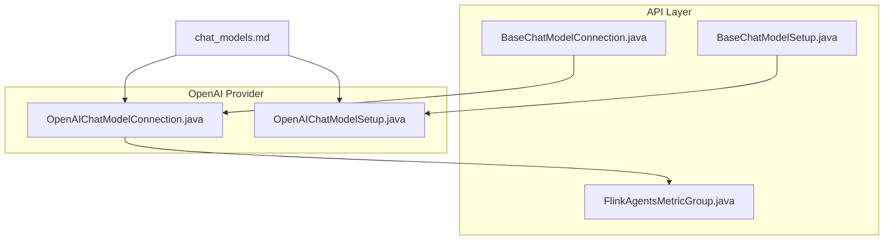
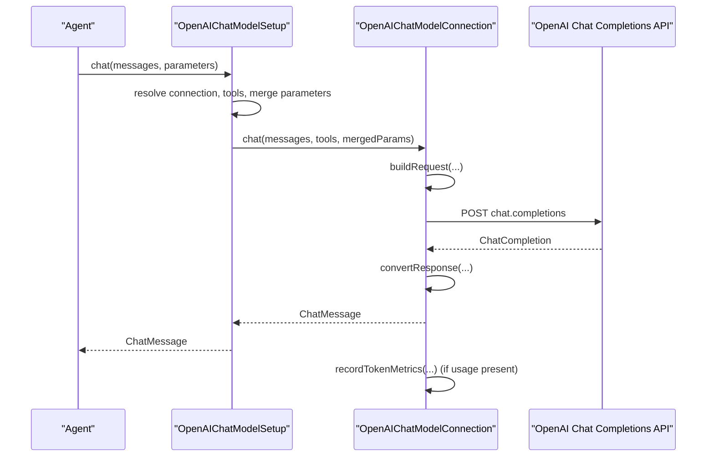
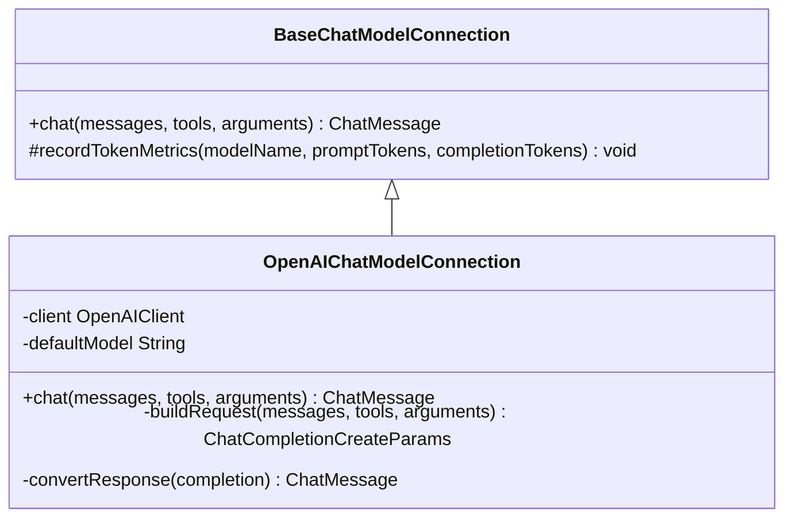
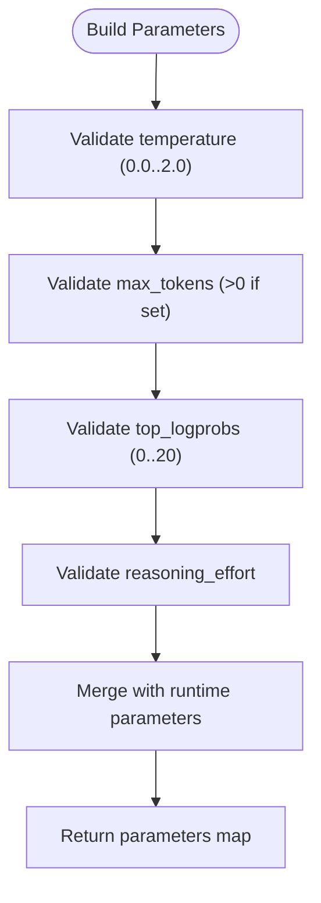
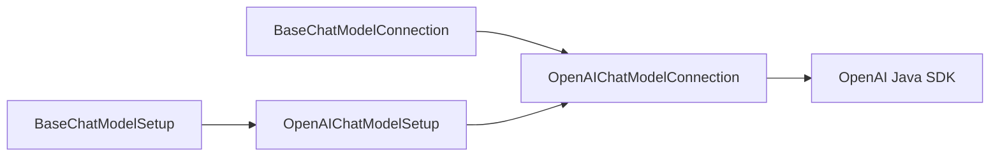

# OpenAI Integration

<cite>
**Referenced Files in This Document**
- [OpenAIChatModelConnection.java](file://integrations/chat-models/openai/src/main/java/org/apache/flink/agents/integrations/chatmodels/openai/OpenAIChatModelConnection.java)
- [OpenAIChatModelSetup.java](file://integrations/chat-models/openai/src/main/java/org/apache/flink/agents/integrations/chatmodels/openai/OpenAIChatModelSetup.java)
- [BaseChatModelConnection.java](file://api/src/main/java/org/apache/flink/agents/api/chat/model/BaseChatModelConnection.java)
- [BaseChatModelSetup.java](file://api/src/main/java/org/apache/flink/agents/api/chat/model/BaseChatModelSetup.java)
- [chat_models.md](file://docs/content/docs/development/chat_models.md)
- [FlinkAgentsMetricGroup.java](file://api/src/main/java/org/apache/flink/agents/api/metrics/FlinkAgentsMetricGroup.java)
- [BaseChatModelConnectionTokenMetricsTest.java](file://api/src/test/java/org/apache/flink/agents/api/chat/model/BaseChatModelConnectionTokenMetricsTest.java)
- [test_token_metrics.py](file://python/flink_agents/api/chat_models/tests/test_token_metrics.py)
</cite>

## Table of Contents
1. [Introduction](#introduction)
2. [Project Structure](#project-structure)
3. [Core Components](#core-components)
4. [Architecture Overview](#architecture-overview)
5. [Detailed Component Analysis](#detailed-component-analysis)
6. [Dependency Analysis](#dependency-analysis)
7. [Performance Considerations](#performance-considerations)
8. [Troubleshooting Guide](#troubleshooting-guide)
9. [Conclusion](#conclusion)
10. [Appendices](#appendices)

## Introduction
This document explains how to integrate OpenAI chat models into Flink Agents using the Java OpenAI integration. It focuses on the OpenAIChatModelConnection class for connecting to the OpenAI Chat Completions API and the OpenAIChatModelSetup class for configuring per-request parameters such as model, temperature, max tokens, tool bindings, and advanced options like strict tool schemas and reasoning effort. It also covers authentication, endpoint configuration, environment variable usage, error handling, performance optimization, cost management, and monitoring.

## Project Structure
The OpenAI integration is implemented as a dedicated provider within the integrations/chat-models/openai module. It builds on the generic BaseChatModelConnection and BaseChatModelSetup abstractions defined in the API module. Documentation for providers and parameters is maintained in the docs/content/docs/development/chat_models.md file.

**Diagram sources**
- [BaseChatModelConnection.java](file://api/src/main/java/org/apache/flink/agents/api/chat/model/BaseChatModelConnection.java#L32-L79)
- [BaseChatModelSetup.java](file://api/src/main/java/org/apache/flink/agents/api/chat/model/BaseChatModelSetup.java#L37-L128)
- [OpenAIChatModelConnection.java](file://integrations/chat-models/openai/src/main/java/org/apache/flink/agents/integrations/chatmodels/openai/OpenAIChatModelConnection.java#L94-L137)
- [OpenAIChatModelSetup.java](file://integrations/chat-models/openai/src/main/java/org/apache/flink/agents/integrations/chatmodels/openai/OpenAIChatModelSetup.java#L61-L127)
- [chat_models.md](file://docs/content/docs/development/chat_models.md#L642-L787)

**Section sources**
- [OpenAIChatModelConnection.java](file://integrations/chat-models/openai/src/main/java/org/apache/flink/agents/integrations/chatmodels/openai/OpenAIChatModelConnection.java#L62-L93)
- [OpenAIChatModelSetup.java](file://integrations/chat-models/openai/src/main/java/org/apache/flink/agents/integrations/chatmodels/openai/OpenAIChatModelSetup.java#L32-L60)
- [chat_models.md](file://docs/content/docs/development/chat_models.md#L642-L787)

## Core Components
- OpenAIChatModelConnection: Manages the OpenAI client, validates API key, constructs requests, converts messages and tools, handles responses, and records token usage metrics.
- OpenAIChatModelSetup: Provides per-chat configuration defaults and merges runtime parameters, including temperature, max tokens, logprobs, strict tool schemas, reasoning effort, and additional kwargs.
- BaseChatModelConnection: Defines the contract for chat connections and provides token metrics recording.
- BaseChatModelSetup: Orchestrates chat execution by resolving the connection, applying prompt formatting, binding tools, and merging parameters.

Key configuration options exposed by the provider:
- Connection-level: api_key, api_base_url, timeout, max_retries, default_headers, model (default fallback).
- Setup-level: model, temperature, max_tokens, logprobs, top_logprobs, strict, reasoning_effort, additional_kwargs, tools.

**Section sources**
- [OpenAIChatModelConnection.java](file://integrations/chat-models/openai/src/main/java/org/apache/flink/agents/integrations/chatmodels/openai/OpenAIChatModelConnection.java#L65-L75)
- [OpenAIChatModelSetup.java](file://integrations/chat-models/openai/src/main/java/org/apache/flink/agents/integrations/chatmodels/openai/OpenAIChatModelSetup.java#L63-L76)
- [BaseChatModelConnection.java](file://api/src/main/java/org/apache/flink/agents/api/chat/model/BaseChatModelConnection.java#L50-L77)
- [BaseChatModelSetup.java](file://api/src/main/java/org/apache/flink/agents/api/chat/model/BaseChatModelSetup.java#L54-L101)

## Architecture Overview
The OpenAI integration follows a layered design:
- BaseChatModelSetup resolves a BaseChatModelConnection resource by name, applies optional prompt formatting, binds tools, and merges parameters.
- OpenAIChatModelConnection initializes an OpenAI client with validated configuration, builds ChatCompletionCreateParams from messages and tools, invokes the API, converts the response, and records token usage.

**Diagram sources**
- [BaseChatModelSetup.java](file://api/src/main/java/org/apache/flink/agents/api/chat/model/BaseChatModelSetup.java#L54-L101)
- [OpenAIChatModelSetup.java](file://integrations/chat-models/openai/src/main/java/org/apache/flink/agents/integrations/chatmodels/openai/OpenAIChatModelSetup.java#L154-L178)
- [OpenAIChatModelConnection.java](file://integrations/chat-models/openai/src/main/java/org/apache/flink/agents/integrations/chatmodels/openai/OpenAIChatModelConnection.java#L139-L165)

## Detailed Component Analysis

### OpenAIChatModelConnection
Responsibilities:
- Validates presence of api_key during construction.
- Builds an OpenAI client with optional api_base_url, timeout, max_retries, default_headers, and model.
- Translates Flink Agents ChatMessage roles and tool calls to OpenAI’s message and tool schemas.
- Supports strict tool schemas and reasoning effort for compatible models.
- Records prompt and completion token counts when usage is returned.

Configuration options:
- api_key (required): OpenAI API key.
- api_base_url (optional): Base URL for OpenAI API (default documented in provider docs).
- timeout (optional): Request timeout in seconds.
- max_retries (optional): Maximum retry attempts.
- default_headers (optional): Headers applied to all requests.
- model (optional): Default model used when not overridden per-call.

Runtime parameters consumed:
- model, temperature, max_tokens, logprobs, top_logprobs, strict, reasoning_effort, additional_kwargs.

Error handling:
- Throws exceptions on invalid inputs (e.g., missing api_key) and wraps API errors in RuntimeException with a contextual message.

Token metrics:
- Uses BaseChatModelConnection.recordTokenMetrics to increment counters grouped by model name.

**Diagram sources**
- [BaseChatModelConnection.java](file://api/src/main/java/org/apache/flink/agents/api/chat/model/BaseChatModelConnection.java#L38-L79)
- [OpenAIChatModelConnection.java](file://integrations/chat-models/openai/src/main/java/org/apache/flink/agents/integrations/chatmodels/openai/OpenAIChatModelConnection.java#L94-L137)

**Section sources**
- [OpenAIChatModelConnection.java](file://integrations/chat-models/openai/src/main/java/org/apache/flink/agents/integrations/chatmodels/openai/OpenAIChatModelConnection.java#L102-L137)
- [OpenAIChatModelConnection.java](file://integrations/chat-models/openai/src/main/java/org/apache/flink/agents/integrations/chatmodels/openai/OpenAIChatModelConnection.java#L167-L226)
- [OpenAIChatModelConnection.java](file://integrations/chat-models/openai/src/main/java/org/apache/flink/agents/integrations/chatmodels/openai/OpenAIChatModelConnection.java#L356-L374)
- [BaseChatModelConnection.java](file://api/src/main/java/org/apache/flink/agents/api/chat/model/BaseChatModelConnection.java#L68-L77)

### OpenAIChatModelSetup
Responsibilities:
- Provides default configuration (e.g., default model, temperature bounds, top_logprobs bounds).
- Validates and normalizes parameters such as temperature, max_tokens, reasoning_effort, and strict mode.
- Merges setup parameters with runtime overrides when invoking chat.

Configuration options:
- connection (required): Name of the OpenAIChatModelConnection resource.
- model (optional): Default model name.
- temperature (0.0–2.0).
- max_tokens (> 0 if set).
- logprobs (boolean).
- top_logprobs (0–20).
- strict (boolean).
- reasoning_effort ("low" | "medium" | "high").
- additional_kwargs (map).
- tools (list of tool names).

**Diagram sources**
- [OpenAIChatModelSetup.java](file://integrations/chat-models/openai/src/main/java/org/apache/flink/agents/integrations/chatmodels/openai/OpenAIChatModelSetup.java#L77-L127)
- [OpenAIChatModelSetup.java](file://integrations/chat-models/openai/src/main/java/org/apache/flink/agents/integrations/chatmodels/openai/OpenAIChatModelSetup.java#L154-L178)

**Section sources**
- [OpenAIChatModelSetup.java](file://integrations/chat-models/openai/src/main/java/org/apache/flink/agents/integrations/chatmodels/openai/OpenAIChatModelSetup.java#L63-L127)
- [OpenAIChatModelSetup.java](file://integrations/chat-models/openai/src/main/java/org/apache/flink/agents/integrations/chatmodels/openai/OpenAIChatModelSetup.java#L154-L178)

### Authentication and Endpoint Configuration
- API key: Provided via api_key argument; required and validated during connection construction.
- Endpoint/base URL: api_base_url sets the OpenAI base URL; defaults are documented in provider docs.
- Timeout and retries: Configure request timeouts and retry attempts for resilience.
- Default headers: Attach custom headers to all requests.

Environment variable usage:
- Provider docs describe environment variable precedence for credentials and base URLs. While the Java provider reads explicit arguments, environment variables are commonly used in other runtimes and can be injected into the agent configuration.

**Section sources**
- [OpenAIChatModelConnection.java](file://integrations/chat-models/openai/src/main/java/org/apache/flink/agents/integrations/chatmodels/openai/OpenAIChatModelConnection.java#L106-L136)
- [chat_models.md](file://docs/content/docs/development/chat_models.md#L651-L681)

### Integrating OpenAI Models into Agent Workflows
Typical steps:
1. Define a connection resource with api_key, api_base_url, timeout, max_retries, and optional default_headers.
2. Define a setup resource referencing the connection, specifying model, temperature, max_tokens, tools, strict, reasoning_effort, and additional_kwargs.
3. Invoke chat from actions or prompts; the setup merges runtime parameters with configured defaults.

Example parameters:
- Model selection: gpt-3.5-turbo, gpt-4, gpt-4o, and others as documented.
- Temperature: typical small values for deterministic outputs; higher for creativity.
- Max tokens: cap generation length to control latency and cost.
- Strict tool schemas: enforce precise function signatures for reliable tool calling.
- Reasoning effort: for models that support structured reasoning.

**Section sources**
- [chat_models.md](file://docs/content/docs/development/chat_models.md#L683-L723)
- [OpenAIChatModelSetup.java](file://integrations/chat-models/openai/src/main/java/org/apache/flink/agents/integrations/chatmodels/openai/OpenAIChatModelSetup.java#L154-L178)

## Dependency Analysis
The OpenAI provider depends on:
- BaseChatModelConnection for the connection contract and token metrics.
- BaseChatModelSetup for orchestration and parameter merging.
- OpenAI Java SDK for API interactions.

**Diagram sources**
- [BaseChatModelConnection.java](file://api/src/main/java/org/apache/flink/agents/api/chat/model/BaseChatModelConnection.java#L38-L79)
- [BaseChatModelSetup.java](file://api/src/main/java/org/apache/flink/agents/api/chat/model/BaseChatModelSetup.java#L37-L128)
- [OpenAIChatModelConnection.java](file://integrations/chat-models/openai/src/main/java/org/apache/flink/agents/integrations/chatmodels/openai/OpenAIChatModelConnection.java#L94-L137)
- [OpenAIChatModelSetup.java](file://integrations/chat-models/openai/src/main/java/org/apache/flink/agents/integrations/chatmodels/openai/OpenAIChatModelSetup.java#L61-L127)

**Section sources**
- [OpenAIChatModelConnection.java](file://integrations/chat-models/openai/src/main/java/org/apache/flink/agents/integrations/chatmodels/openai/OpenAIChatModelConnection.java#L20-L49)
- [OpenAIChatModelSetup.java](file://integrations/chat-models/openai/src/main/java/org/apache/flink/agents/integrations/chatmodels/openai/OpenAIChatModelSetup.java#L20-L31)

## Performance Considerations
- Constrain max_tokens to reduce latency and cost.
- Tune temperature for desired balance between determinism and creativity.
- Use strict tool schemas to minimize retries from malformed tool calls.
- Leverage default_headers for caching or routing policies when supported by the endpoint.
- Monitor token usage via built-in metrics to identify hotspots and optimize prompts.

[No sources needed since this section provides general guidance]

## Troubleshooting Guide
Common issues and strategies:
- Invalid API key or authentication failure: Ensure api_key is provided and valid; verify api_base_url correctness.
- Rate limits or throttling: Increase max_retries and tune timeout; consider exponential backoff at the application level if needed.
- Network failures: Set appropriate timeout and max_retries; validate connectivity to the base URL.
- Invalid parameters: Respect temperature and max_tokens bounds enforced by the setup component.
- Token metrics not appearing: Ensure the metric group is attached to the setup so the connection can record usage.

Validation and tests:
- Unit tests demonstrate token metrics recording behavior and hierarchy across models.
- Tests verify that metrics are not recorded when the metric group is absent.

**Section sources**
- [OpenAIChatModelConnection.java](file://integrations/chat-models/openai/src/main/java/org/apache/flink/agents/integrations/chatmodels/openai/OpenAIChatModelConnection.java#L162-L164)
- [OpenAIChatModelSetup.java](file://integrations/chat-models/openai/src/main/java/org/apache/flink/agents/integrations/chatmodels/openai/OpenAIChatModelSetup.java#L84-L86)
- [OpenAIChatModelSetup.java](file://integrations/chat-models/openai/src/main/java/org/apache/flink/agents/integrations/chatmodels/openai/OpenAIChatModelSetup.java#L92-L94)
- [OpenAIChatModelSetup.java](file://integrations/chat-models/openai/src/main/java/org/apache/flink/agents/integrations/chatmodels/openai/OpenAIChatModelSetup.java#L102-L104)
- [BaseChatModelConnectionTokenMetricsTest.java](file://api/src/test/java/org/apache/flink/agents/api/chat/model/BaseChatModelConnectionTokenMetricsTest.java#L93-L150)
- [test_token_metrics.py](file://python/flink_agents/api/chat_models/tests/test_token_metrics.py#L101-L164)

## Conclusion
The OpenAI integration in Flink Agents provides a robust, configurable pathway to OpenAI’s Chat Completions API. By separating connection configuration from per-chat setup, it enables flexible model selection, precise parameter tuning, and reliable observability through token metrics. Following the configuration patterns and best practices outlined here will help you build efficient, secure, and maintainable agent workflows.

[No sources needed since this section summarizes without analyzing specific files]

## Appendices

### Configuration Options Summary
- Connection (OpenAIChatModelConnection)
  - api_key (required)
  - api_base_url (optional)
  - timeout (optional)
  - max_retries (optional)
  - default_headers (optional)
  - model (optional, default fallback)

- Setup (OpenAIChatModelSetup)
  - connection (required)
  - model (optional)
  - temperature (0.0–2.0)
  - max_tokens (> 0 if set)
  - logprobs (boolean)
  - top_logprobs (0–20)
  - strict (boolean)
  - reasoning_effort ("low" | "medium" | "high")
  - additional_kwargs (map)
  - tools (list)

**Section sources**
- [OpenAIChatModelConnection.java](file://integrations/chat-models/openai/src/main/java/org/apache/flink/agents/integrations/chatmodels/openai/OpenAIChatModelConnection.java#L65-L75)
- [OpenAIChatModelSetup.java](file://integrations/chat-models/openai/src/main/java/org/apache/flink/agents/integrations/chatmodels/openai/OpenAIChatModelSetup.java#L63-L76)
- [chat_models.md](file://docs/content/docs/development/chat_models.md#L651-L723)

### Monitoring Best Practices
- Attach a metric group to the setup so token usage is recorded automatically.
- Group metrics by model name to compare costs and throughput across models.
- Track promptTokens and completionTokens counters to estimate consumption trends.

**Section sources**
- [BaseChatModelConnection.java](file://api/src/main/java/org/apache/flink/agents/api/chat/model/BaseChatModelConnection.java#L68-L77)
- [BaseChatModelConnectionTokenMetricsTest.java](file://api/src/test/java/org/apache/flink/agents/api/chat/model/BaseChatModelConnectionTokenMetricsTest.java#L122-L150)
- [test_token_metrics.py](file://python/flink_agents/api/chat_models/tests/test_token_metrics.py#L126-L164)