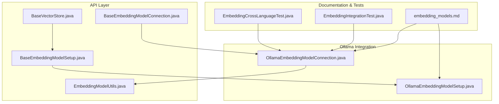
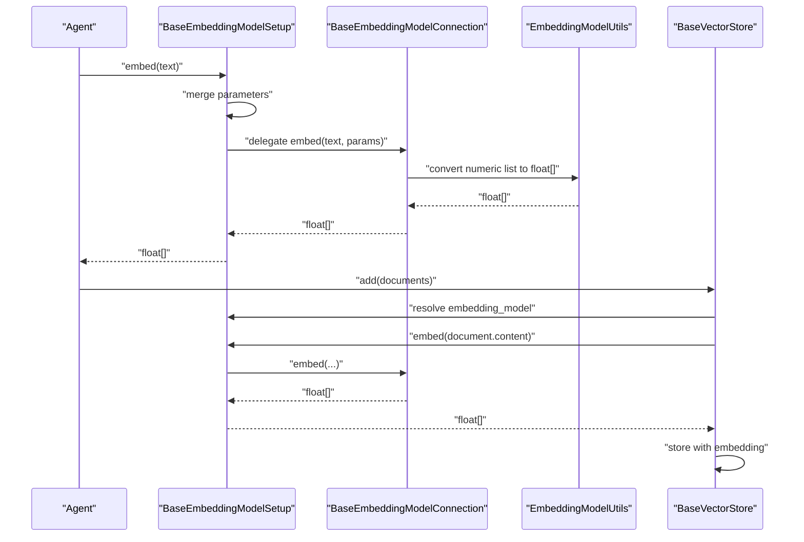
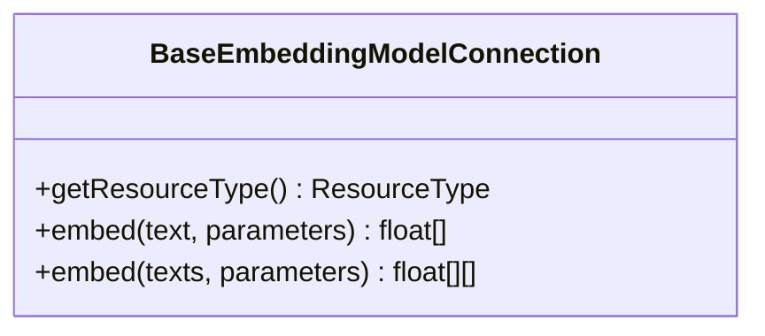
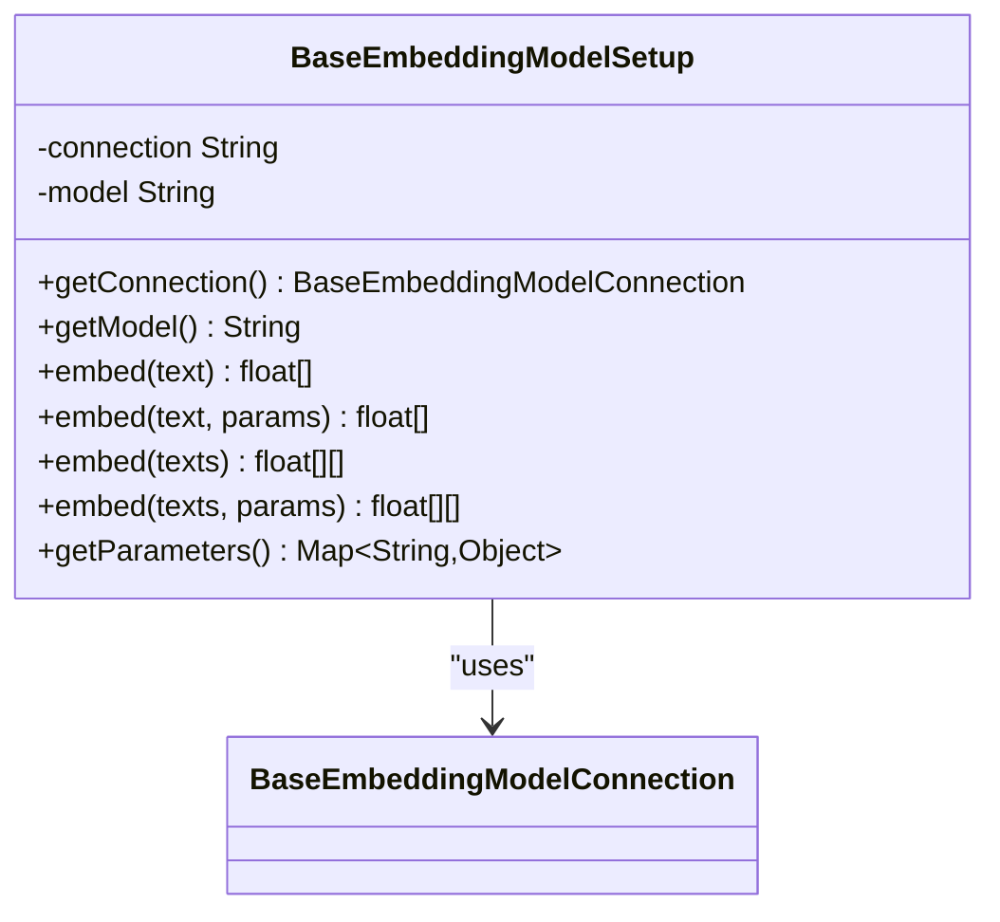
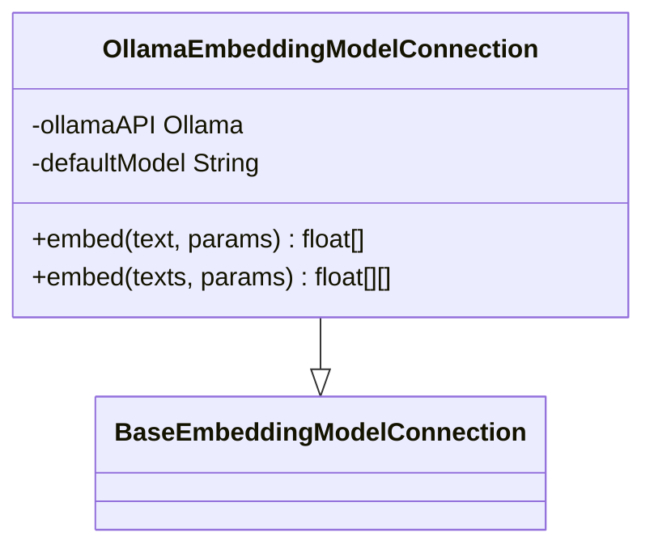
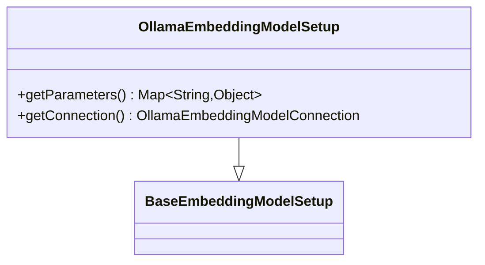
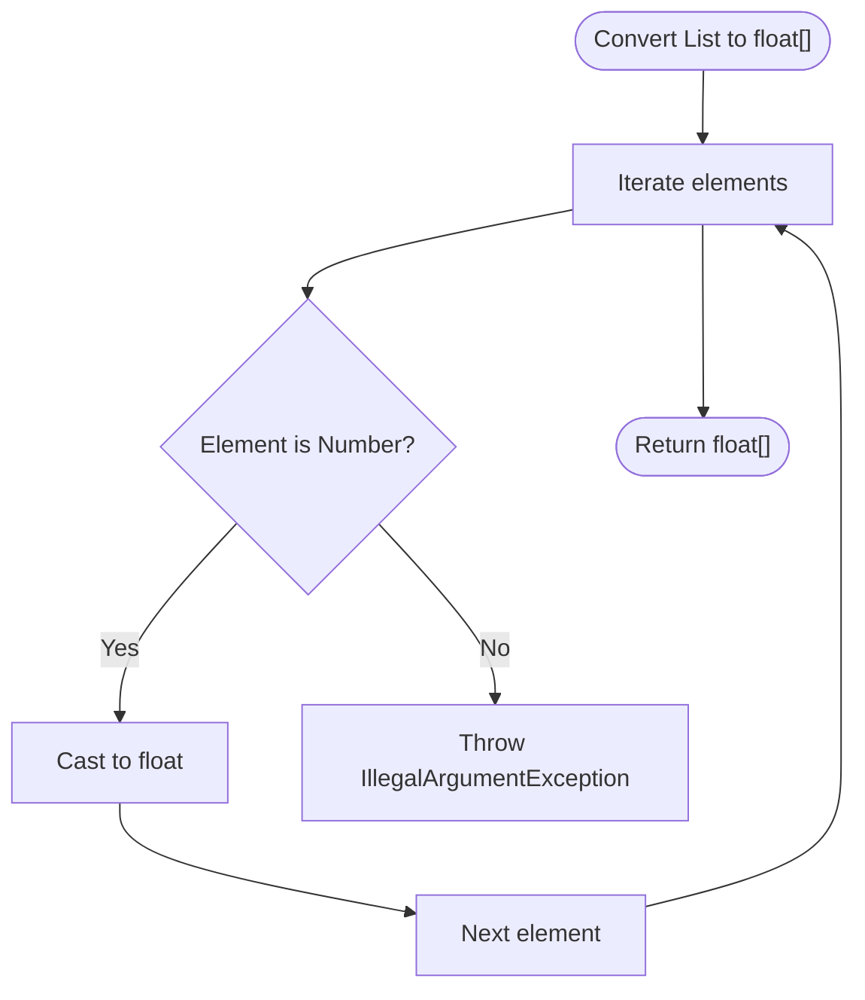
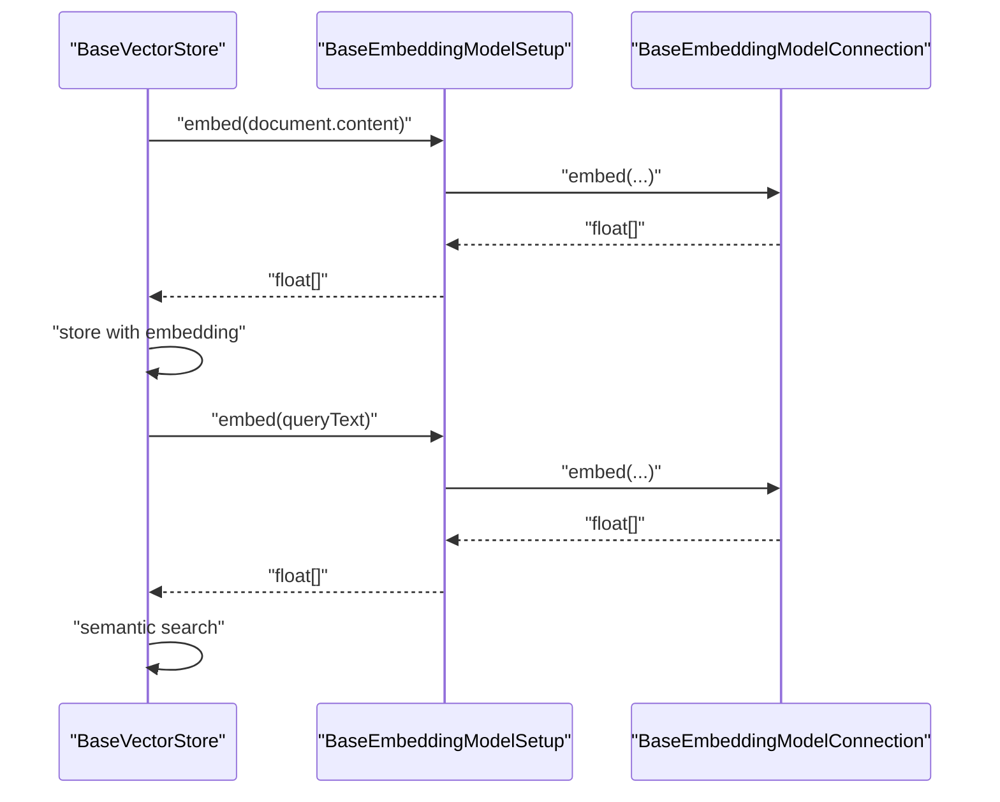
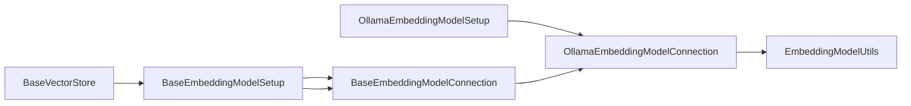

# Embedding Model Integrations

<cite>
**Referenced Files in This Document**
- [BaseEmbeddingModelConnection.java](file://api/src/main/java/org/apache/flink/agents/api/embedding/model/BaseEmbeddingModelConnection.java)
- [BaseEmbeddingModelSetup.java](file://api/src/main/java/org/apache/flink/agents/api/embedding/model/BaseEmbeddingModelSetup.java)
- [EmbeddingModelUtils.java](file://api/src/main/java/org/apache/flink/agents/api/embedding/model/EmbeddingModelUtils.java)
- [OllamaEmbeddingModelConnection.java](file://integrations/embedding-models/ollama/src/main/java/org/apache/flink/agents/integrations/embeddingmodels/ollama/OllamaEmbeddingModelConnection.java)
- [OllamaEmbeddingModelSetup.java](file://integrations/embedding-models/ollama/src/main/java/org/apache/flink/agents/integrations/embeddingmodels/ollama/OllamaEmbeddingModelSetup.java)
- [BaseVectorStore.java](file://api/src/main/java/org/apache/flink/agents/api/vectorstores/BaseVectorStore.java)
- [embedding_models.md](file://docs/content/docs/development/embedding_models.md)
- [EmbeddingIntegrationTest.java](file://e2e-test/flink-agents-end-to-end-tests-integration/src/test/java/org/apache/flink/agents/integration/test/EmbeddingIntegrationTest.java)
- [EmbeddingCrossLanguageTest.java](file://e2e-test/flink-agents-end-to-end-tests-resource-cross-language/src/test/java/org/apache/flink/agents/resource/test/EmbeddingCrossLanguageTest.java)
</cite>

## Table of Contents
1. [Introduction](#introduction)
2. [Project Structure](#project-structure)
3. [Core Components](#core-components)
4. [Architecture Overview](#architecture-overview)
5. [Detailed Component Analysis](#detailed-component-analysis)
6. [Dependency Analysis](#dependency-analysis)
7. [Performance Considerations](#performance-considerations)
8. [Troubleshooting Guide](#troubleshooting-guide)
9. [Conclusion](#conclusion)
10. [Appendices](#appendices)

## Introduction
This document explains how embedding model integrations work in Flink Agents, with a focus on local embedding generation via Ollama. It covers setup and configuration of embedding model providers, connection patterns, dimension configuration, normalization strategies, and the BaseEmbeddingModelConnection interface and implementation requirements for custom providers. It also details how embedding models relate to vector store operations for semantic search, and provides guidance on batch processing, memory optimization, performance tuning, and troubleshooting.

## Project Structure
The embedding model system is composed of:
- API abstractions for embedding connections and setups
- A built-in Ollama integration
- Vector store abstractions that consume embeddings for semantic search
- Documentation and end-to-end tests validating the integration

**Diagram sources**
- [BaseEmbeddingModelConnection.java](file://api/src/main/java/org/apache/flink/agents/api/embedding/model/BaseEmbeddingModelConnection.java#L45-L83)
- [BaseEmbeddingModelSetup.java](file://api/src/main/java/org/apache/flink/agents/api/embedding/model/BaseEmbeddingModelSetup.java#L36-L113)
- [EmbeddingModelUtils.java](file://api/src/main/java/org/apache/flink/agents/api/embedding/model/EmbeddingModelUtils.java#L22-L37)
- [BaseVectorStore.java](file://api/src/main/java/org/apache/flink/agents/api/vectorstores/BaseVectorStore.java#L38-L173)
- [OllamaEmbeddingModelConnection.java](file://integrations/embedding-models/ollama/src/main/java/org/apache/flink/agents/integrations/embeddingmodels/ollama/OllamaEmbeddingModelConnection.java#L35-L118)
- [OllamaEmbeddingModelSetup.java](file://integrations/embedding-models/ollama/src/main/java/org/apache/flink/agents/integrations/embeddingmodels/ollama/OllamaEmbeddingModelSetup.java#L31-L54)
- [embedding_models.md](file://docs/content/docs/development/embedding_models.md#L25-L613)
- [EmbeddingIntegrationTest.java](file://e2e-test/flink-agents-end-to-end-tests-integration/src/test/java/org/apache/flink/agents/integration/test/EmbeddingIntegrationTest.java#L40-L109)
- [EmbeddingCrossLanguageTest.java](file://e2e-test/flink-agents-end-to-end-tests-resource-cross-language/src/test/java/org/apache/flink/agents/resource/test/EmbeddingCrossLanguageTest.java#L37-L97)

**Section sources**
- [BaseEmbeddingModelConnection.java](file://api/src/main/java/org/apache/flink/agents/api/embedding/model/BaseEmbeddingModelConnection.java#L29-L83)
- [BaseEmbeddingModelSetup.java](file://api/src/main/java/org/apache/flink/agents/api/embedding/model/BaseEmbeddingModelSetup.java#L30-L113)
- [OllamaEmbeddingModelConnection.java](file://integrations/embedding-models/ollama/src/main/java/org/apache/flink/agents/integrations/embeddingmodels/ollama/OllamaEmbeddingModelConnection.java#L34-L118)
- [OllamaEmbeddingModelSetup.java](file://integrations/embedding-models/ollama/src/main/java/org/apache/flink/agents/integrations/embeddingmodels/ollama/OllamaEmbeddingModelSetup.java#L30-L54)
- [BaseVectorStore.java](file://api/src/main/java/org/apache/flink/agents/api/vectorstores/BaseVectorStore.java#L33-L173)
- [embedding_models.md](file://docs/content/docs/development/embedding_models.md#L25-L613)

## Core Components
- BaseEmbeddingModelConnection: Defines the contract for embedding generation (single and batch), parameter propagation, and resource typing.
- BaseEmbeddingModelSetup: Encapsulates model configuration, merges parameters, and delegates embedding calls to the connection.
- OllamaEmbeddingModelConnection: Implements a local embedding provider using the Ollama client, pulling models and returning float arrays.
- OllamaEmbeddingModelSetup: Supplies model-specific parameters to the connection.
- EmbeddingModelUtils: Utility to convert numeric lists to float arrays.
- BaseVectorStore: Integrates embedding generation into vector store operations (add/query), using a configured embedding model resource.

**Section sources**
- [BaseEmbeddingModelConnection.java](file://api/src/main/java/org/apache/flink/agents/api/embedding/model/BaseEmbeddingModelConnection.java#L45-L83)
- [BaseEmbeddingModelSetup.java](file://api/src/main/java/org/apache/flink/agents/api/embedding/model/BaseEmbeddingModelSetup.java#L36-L113)
- [OllamaEmbeddingModelConnection.java](file://integrations/embedding-models/ollama/src/main/java/org/apache/flink/agents/integrations/embeddingmodels/ollama/OllamaEmbeddingModelConnection.java#L35-L118)
- [OllamaEmbeddingModelSetup.java](file://integrations/embedding-models/ollama/src/main/java/org/apache/flink/agents/integrations/embeddingmodels/ollama/OllamaEmbeddingModelSetup.java#L31-L54)
- [EmbeddingModelUtils.java](file://api/src/main/java/org/apache/flink/agents/api/embedding/model/EmbeddingModelUtils.java#L22-L37)
- [BaseVectorStore.java](file://api/src/main/java/org/apache/flink/agents/api/vectorstores/BaseVectorStore.java#L38-L173)

## Architecture Overview
The embedding subsystem follows a layered design:
- Agents declare embedding model connections and setups.
- BaseEmbeddingModelSetup resolves the connection and merges parameters.
- BaseEmbeddingModelConnection performs the actual embedding generation.
- BaseVectorStore consumes embeddings for indexing and querying.

**Diagram sources**
- [BaseEmbeddingModelSetup.java](file://api/src/main/java/org/apache/flink/agents/api/embedding/model/BaseEmbeddingModelSetup.java#L79-L112)
- [BaseEmbeddingModelConnection.java](file://api/src/main/java/org/apache/flink/agents/api/embedding/model/BaseEmbeddingModelConnection.java#L68-L82)
- [EmbeddingModelUtils.java](file://api/src/main/java/org/apache/flink/agents/api/embedding/model/EmbeddingModelUtils.java#L23-L36)
- [BaseVectorStore.java](file://api/src/main/java/org/apache/flink/agents/api/vectorstores/BaseVectorStore.java#L71-L112)

## Detailed Component Analysis

### BaseEmbeddingModelConnection
- Purpose: Abstract connection contract for embedding generation.
- Responsibilities:
  - Define resource type for embedding model connections.
  - Provide single-text and batch embedding methods.
  - Accept a parameter map for model selection, encoding format, timeouts, and batch sizes.
- Implementation requirements for custom providers:
  - Implement both single and batch embedding methods.
  - Respect the parameters map (e.g., model name, encoding format, timeouts).
  - Normalize outputs to float arrays consistently.

**Diagram sources**
- [BaseEmbeddingModelConnection.java](file://api/src/main/java/org/apache/flink/agents/api/embedding/model/BaseEmbeddingModelConnection.java#L45-L83)

**Section sources**
- [BaseEmbeddingModelConnection.java](file://api/src/main/java/org/apache/flink/agents/api/embedding/model/BaseEmbeddingModelConnection.java#L29-L83)

### BaseEmbeddingModelSetup
- Purpose: High-level configuration that references a connection and supplies model parameters.
- Responsibilities:
  - Resolve the connection resource by name.
  - Merge setup-level parameters with per-call overrides.
  - Delegate embedding calls to the connection.
- Usage patterns:
  - Single and batch embedding wrappers that merge parameters transparently.

**Diagram sources**
- [BaseEmbeddingModelSetup.java](file://api/src/main/java/org/apache/flink/agents/api/embedding/model/BaseEmbeddingModelSetup.java#L36-L113)

**Section sources**
- [BaseEmbeddingModelSetup.java](file://api/src/main/java/org/apache/flink/agents/api/embedding/model/BaseEmbeddingModelSetup.java#L36-L113)

### OllamaEmbeddingModelConnection
- Purpose: Local embedding provider using the Ollama client.
- Capabilities:
  - Default host and model configuration.
  - Pulls models automatically if missing.
  - Converts Double embeddings to float arrays.
  - Supports single and batch embedding requests.
- Parameters:
  - Model name resolution via parameters or defaults.
  - Automatic model pulling prior to embedding.

**Diagram sources**
- [OllamaEmbeddingModelConnection.java](file://integrations/embedding-models/ollama/src/main/java/org/apache/flink/agents/integrations/embeddingmodels/ollama/OllamaEmbeddingModelConnection.java#L35-L118)
- [BaseEmbeddingModelConnection.java](file://api/src/main/java/org/apache/flink/agents/api/embedding/model/BaseEmbeddingModelConnection.java#L45-L83)

**Section sources**
- [OllamaEmbeddingModelConnection.java](file://integrations/embedding-models/ollama/src/main/java/org/apache/flink/agents/integrations/embeddingmodels/ollama/OllamaEmbeddingModelConnection.java#L34-L118)

### OllamaEmbeddingModelSetup
- Purpose: Supplies model-level parameters to the Ollama connection.
- Behavior:
  - Reads model name from setup arguments.
  - Emits a parameters map containing the model name.

**Diagram sources**
- [OllamaEmbeddingModelSetup.java](file://integrations/embedding-models/ollama/src/main/java/org/apache/flink/agents/integrations/embeddingmodels/ollama/OllamaEmbeddingModelSetup.java#L31-L54)
- [BaseEmbeddingModelSetup.java](file://api/src/main/java/org/apache/flink/agents/api/embedding/model/BaseEmbeddingModelSetup.java#L36-L113)

**Section sources**
- [OllamaEmbeddingModelSetup.java](file://integrations/embedding-models/ollama/src/main/java/org/apache/flink/agents/integrations/embeddingmodels/ollama/OllamaEmbeddingModelSetup.java#L30-L54)

### EmbeddingModelUtils
- Purpose: Ensures embeddings are represented as float arrays.
- Behavior:
  - Validates numeric types and converts to float.
  - Throws an error if non-numeric values are encountered.

**Diagram sources**
- [EmbeddingModelUtils.java](file://api/src/main/java/org/apache/flink/agents/api/embedding/model/EmbeddingModelUtils.java#L23-L36)

**Section sources**
- [EmbeddingModelUtils.java](file://api/src/main/java/org/apache/flink/agents/api/embedding/model/EmbeddingModelUtils.java#L22-L37)

### BaseVectorStore Integration
- Purpose: Bridges embedding generation with vector store operations.
- Behavior:
  - Resolves the embedding model resource by name.
  - Generates embeddings for documents during add operations.
  - Converts query text to embeddings for semantic queries.
- Parameters:
  - Merges store-level kwargs with query-specific arguments.

**Diagram sources**
- [BaseVectorStore.java](file://api/src/main/java/org/apache/flink/agents/api/vectorstores/BaseVectorStore.java#L71-L112)
- [BaseEmbeddingModelSetup.java](file://api/src/main/java/org/apache/flink/agents/api/embedding/model/BaseEmbeddingModelSetup.java#L79-L112)
- [BaseEmbeddingModelConnection.java](file://api/src/main/java/org/apache/flink/agents/api/embedding/model/BaseEmbeddingModelConnection.java#L68-L82)

**Section sources**
- [BaseVectorStore.java](file://api/src/main/java/org/apache/flink/agents/api/vectorstores/BaseVectorStore.java#L38-L173)

## Dependency Analysis
- BaseEmbeddingModelSetup depends on BaseEmbeddingModelConnection via resource resolution.
- OllamaEmbeddingModelSetup specializes BaseEmbeddingModelSetup and produces parameters for OllamaEmbeddingModelConnection.
- BaseVectorStore depends on BaseEmbeddingModelSetup to generate embeddings for indexing and querying.
- EmbeddingModelUtils is used by OllamaEmbeddingModelConnection to normalize outputs.

**Diagram sources**
- [BaseEmbeddingModelSetup.java](file://api/src/main/java/org/apache/flink/agents/api/embedding/model/BaseEmbeddingModelSetup.java#L59-L112)
- [BaseEmbeddingModelConnection.java](file://api/src/main/java/org/apache/flink/agents/api/embedding/model/BaseEmbeddingModelConnection.java#L45-L83)
- [OllamaEmbeddingModelSetup.java](file://integrations/embedding-models/ollama/src/main/java/org/apache/flink/agents/integrations/embeddingmodels/ollama/OllamaEmbeddingModelSetup.java#L31-L54)
- [OllamaEmbeddingModelConnection.java](file://integrations/embedding-models/ollama/src/main/java/org/apache/flink/agents/integrations/embeddingmodels/ollama/OllamaEmbeddingModelConnection.java#L35-L118)
- [EmbeddingModelUtils.java](file://api/src/main/java/org/apache/flink/agents/api/embedding/model/EmbeddingModelUtils.java#L22-L37)
- [BaseVectorStore.java](file://api/src/main/java/org/apache/flink/agents/api/vectorstores/BaseVectorStore.java#L71-L112)

**Section sources**
- [BaseEmbeddingModelSetup.java](file://api/src/main/java/org/apache/flink/agents/api/embedding/model/BaseEmbeddingModelSetup.java#L59-L112)
- [OllamaEmbeddingModelSetup.java](file://integrations/embedding-models/ollama/src/main/java/org/apache/flink/agents/integrations/embeddingmodels/ollama/OllamaEmbeddingModelSetup.java#L31-L54)
- [BaseVectorStore.java](file://api/src/main/java/org/apache/flink/agents/api/vectorstores/BaseVectorStore.java#L71-L112)

## Performance Considerations
- Batch processing:
  - Prefer batch embedding for throughput improvements when the provider supports it.
  - Use the batch overload of the embedding methods to reduce overhead.
- Dimension configuration:
  - Some providers allow specifying output dimensions; consult provider documentation for supported parameters.
- Normalization:
  - Ensure embeddings are normalized consistently if downstream similarity metrics require unit vectors.
- GPU utilization:
  - For local providers, ensure the underlying engine utilizes GPU acceleration where available.
- Timeout and retries:
  - Configure request timeouts and retry policies appropriately to avoid backpressure in streaming pipelines.
- Memory optimization:
  - Avoid retaining large intermediate embeddings unnecessarily.
  - Stream embeddings through the pipeline rather than materializing them in memory.

[No sources needed since this section provides general guidance]

## Troubleshooting Guide
- Dimension mismatches:
  - Verify the model’s expected output dimensionality and ensure downstream components align with it.
  - If using vector stores, confirm collection schemas match the embedding dimension.
- Provider connectivity:
  - Confirm the embedding provider is reachable and credentials are set correctly.
  - For Ollama, ensure the server is running and the model is pulled.
- Parameter conflicts:
  - Ensure model name and encoding format parameters are compatible with the provider.
  - Validate that batch size parameters are supported by the provider.
- Error propagation:
  - Inspect exceptions thrown during embedding generation; they often indicate misconfiguration or transient failures.
- End-to-end validation:
  - Use the provided integration tests to validate embedding generation and vector store operations.

**Section sources**
- [OllamaEmbeddingModelConnection.java](file://integrations/embedding-models/ollama/src/main/java/org/apache/flink/agents/integrations/embeddingmodels/ollama/OllamaEmbeddingModelConnection.java#L56-L117)
- [EmbeddingIntegrationTest.java](file://e2e-test/flink-agents-end-to-end-tests-integration/src/test/java/org/apache/flink/agents/integration/test/EmbeddingIntegrationTest.java#L50-L97)
- [EmbeddingCrossLanguageTest.java](file://e2e-test/flink-agents-end-to-end-tests-resource-cross-language/src/test/java/org/apache/flink/agents/resource/test/EmbeddingCrossLanguageTest.java#L45-L85)

## Conclusion
Flink Agents provides a clean abstraction for embedding model integrations with a clear separation between setup/configuration and connection logic. The Ollama integration demonstrates a practical local embedding provider that pulls models and returns normalized float arrays. Vector store operations seamlessly consume embeddings generated by the setup/connection layer, enabling robust semantic search workflows. By following the documented patterns and leveraging the provided abstractions, teams can implement custom providers and optimize performance for their use cases.

[No sources needed since this section summarizes without analyzing specific files]

## Appendices

### Configuration Examples and Best Practices
- Selecting an embedding model:
  - Use the setup resource to reference a connection and specify the model name.
- Batch processing:
  - Prefer the batch embedding method to improve throughput.
- Memory optimization:
  - Keep embeddings transient and stream them through the pipeline.
- Vector store integration:
  - Configure the vector store to use the embedding model resource; it will generate embeddings on demand for add and query operations.

**Section sources**
- [embedding_models.md](file://docs/content/docs/development/embedding_models.md#L41-L186)
- [BaseVectorStore.java](file://api/src/main/java/org/apache/flink/agents/api/vectorstores/BaseVectorStore.java#L71-L112)