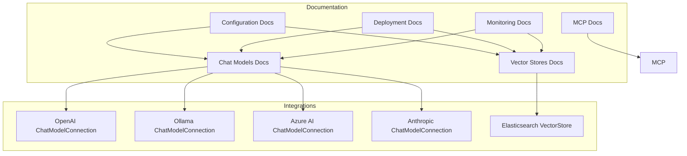
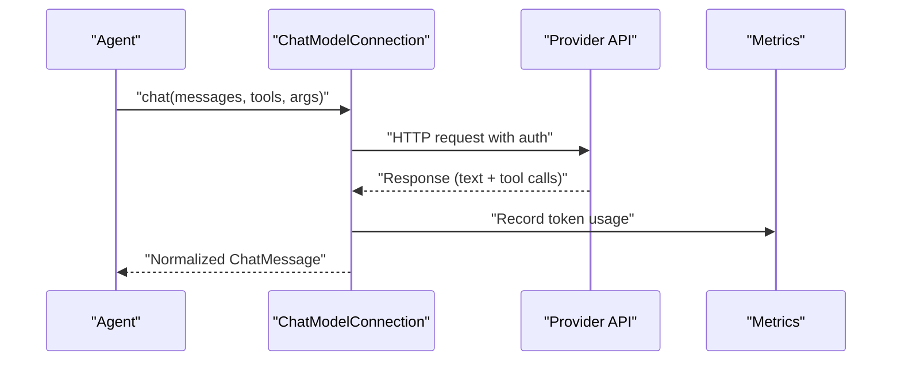
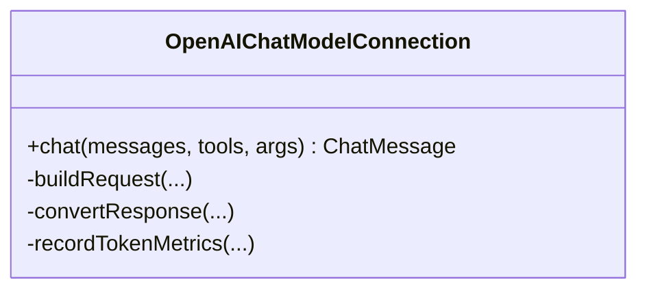
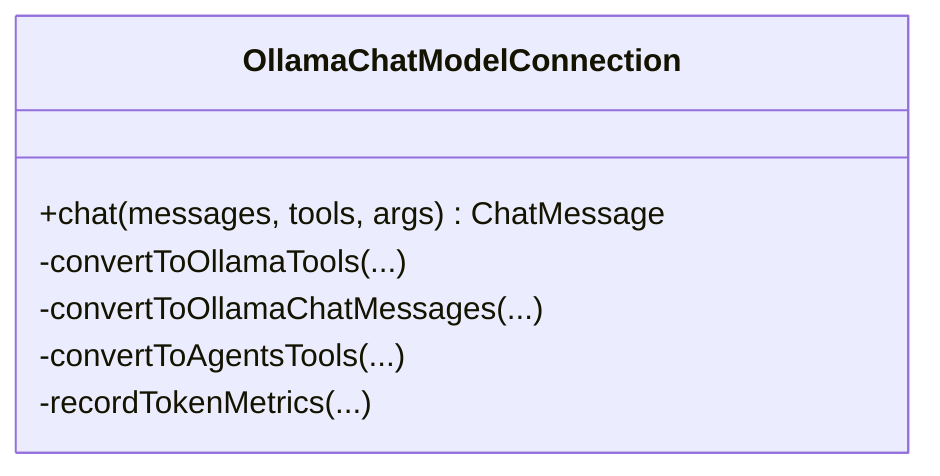
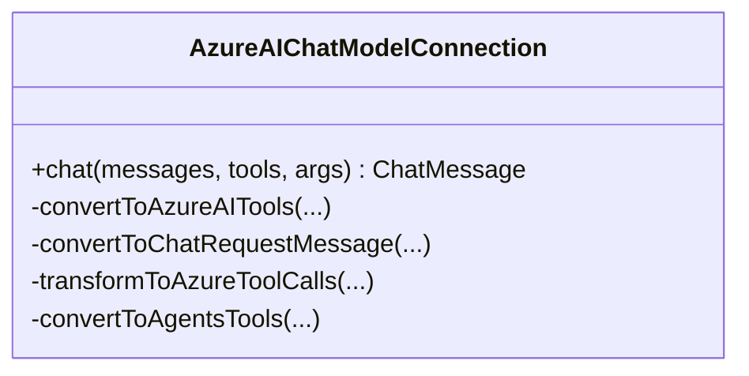
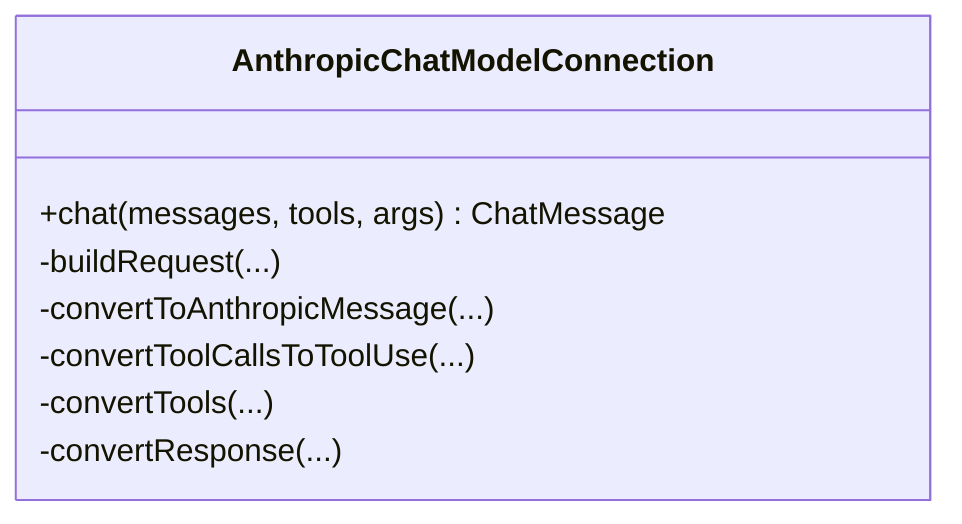
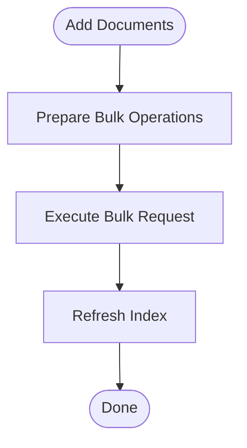
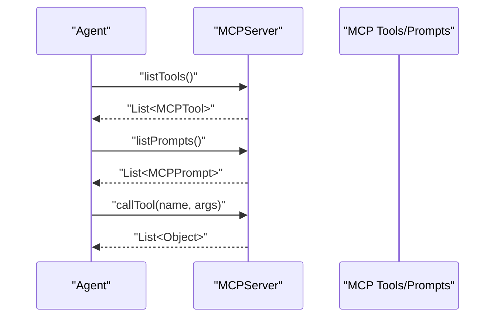
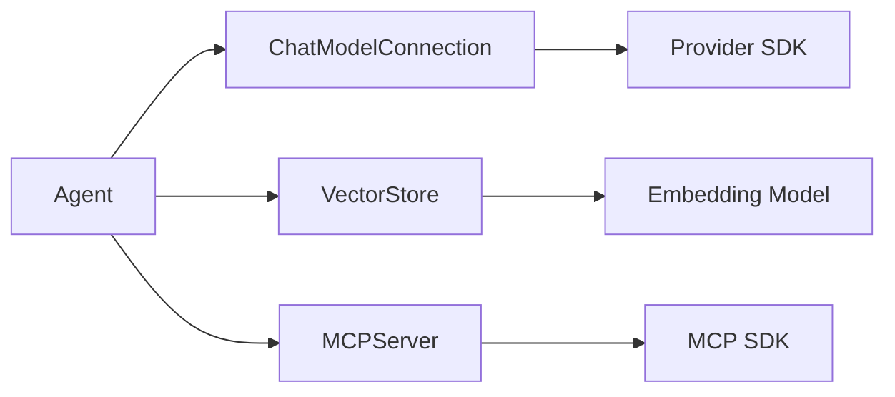

# Integration Guides

<cite>
**Referenced Files in This Document**
- [chat_models.md](file://docs/content/docs/development/chat_models.md)
- [vector_stores.md](file://docs/content/docs/development/vector_stores.md)
- [mcp.md](file://docs/content/docs/development/mcp.md)
- [configuration.md](file://docs/content/docs/operations/configuration.md)
- [deployment.md](file://docs/content/docs/operations/deployment.md)
- [monitoring.md](file://docs/content/docs/operations/monitoring.md)
- [OpenAIChatModelConnection.java](file://integrations/chat-models/openai/src/main/java/org/apache/flink/agents/integrations/chatmodels/openai/OpenAIChatModelConnection.java)
- [OllamaChatModelConnection.java](file://integrations/chat-models/ollama/src/main/java/org/apache/flink/agents/integrations/chatmodels/ollama/OllamaChatModelConnection.java)
- [AzureAIChatModelConnection.java](file://integrations/chat-models/azureai/src/main/java/org/apache/flink/agents/integrations/chatmodels/azureai/AzureAIChatModelConnection.java)
- [AnthropicChatModelConnection.java](file://integrations/chat-models/anthropic/src/main/java/org/apache/flink/agents/integrations/chatmodels/anthropic/AnthropicChatModelConnection.java)
- [ElasticsearchVectorStore.java](file://integrations/vector-stores/elasticsearch/src/main/java/org/apache/flink/agents/integrations/vectorstores/elasticsearch/ElasticsearchVectorStore.java)
- [MCPServer.java](file://integrations/mcp/src/main/java/org/apache/flink/agents/integrations/mcp/MCPServer.java)
</cite>

## Table of Contents
1. [Introduction](#introduction)
2. [Project Structure](#project-structure)
3. [Core Components](#core-components)
4. [Architecture Overview](#architecture-overview)
5. [Detailed Component Analysis](#detailed-component-analysis)
6. [Dependency Analysis](#dependency-analysis)
7. [Performance Considerations](#performance-considerations)
8. [Troubleshooting Guide](#troubleshooting-guide)
9. [Conclusion](#conclusion)
10. [Appendices](#appendices)

## Introduction
This guide provides comprehensive integration instructions for external services in Flink Agents. It covers chat model integrations (OpenAI, Ollama, Azure AI, Anthropic), vector store integrations (Elasticsearch, ChromaDB), and MCP (Model Context Protocol) integration for tool discovery and execution. It includes step-by-step setup, configuration parameters, authentication strategies, rate limiting, error handling, and production best practices for performance, monitoring, and reliability.

## Project Structure
Flink Agents organizes integrations by domain:
- Chat models: integrations/chat-models/<provider>
- Vector stores: integrations/vector-stores/<store>
- MCP: integrations/mcp
- Documentation: docs/content/docs/development/* and docs/content/docs/operations/*

**Diagram sources**
- [chat_models.md](file://docs/content/docs/development/chat_models.md#L1-L800)
- [vector_stores.md](file://docs/content/docs/development/vector_stores.md#L1-L800)
- [mcp.md](file://docs/content/docs/development/mcp.md#L1-L207)
- [configuration.md](file://docs/content/docs/operations/configuration.md#L1-L151)
- [deployment.md](file://docs/content/docs/operations/deployment.md#L1-L179)
- [monitoring.md](file://docs/content/docs/operations/monitoring.md#L1-L162)
- [OpenAIChatModelConnection.java](file://integrations/chat-models/openai/src/main/java/org/apache/flink/agents/integrations/chatmodels/openai/OpenAIChatModelConnection.java#L1-L460)
- [OllamaChatModelConnection.java](file://integrations/chat-models/ollama/src/main/java/org/apache/flink/agents/integrations/chatmodels/ollama/OllamaChatModelConnection.java#L1-L279)
- [AzureAIChatModelConnection.java](file://integrations/chat-models/azureai/src/main/java/org/apache/flink/agents/integrations/chatmodels/azureai/AzureAIChatModelConnection.java#L1-L234)
- [AnthropicChatModelConnection.java](file://integrations/chat-models/anthropic/src/main/java/org/apache/flink/agents/integrations/chatmodels/anthropic/AnthropicChatModelConnection.java#L1-L530)
- [ElasticsearchVectorStore.java](file://integrations/vector-stores/elasticsearch/src/main/java/org/apache/flink/agents/integrations/vectorstores/elasticsearch/ElasticsearchVectorStore.java#L1-L864)

**Section sources**
- [chat_models.md](file://docs/content/docs/development/chat_models.md#L1-L800)
- [vector_stores.md](file://docs/content/docs/development/vector_stores.md#L1-L800)
- [mcp.md](file://docs/content/docs/development/mcp.md#L1-L207)
- [configuration.md](file://docs/content/docs/operations/configuration.md#L1-L151)
- [deployment.md](file://docs/content/docs/operations/deployment.md#L1-L179)
- [monitoring.md](file://docs/content/docs/operations/monitoring.md#L1-L162)

## Core Components
- Chat model integrations: Provider-specific connections and setups that translate Flink Agents’ chat requests into provider APIs, handle tool calling, and record token usage.
- Vector store integrations: Embedding-aware stores that index and retrieve documents using dense vectors, with collection-level management for supported stores.
- MCP integration: A standardized way to discover and execute tools and prompts from external MCP servers with authentication support.

Key configuration surfaces:
- Resource descriptors and arguments for each integration
- Global configuration options for error handling, async behavior, and action state store
- Metrics and logging for observability

**Section sources**
- [chat_models.md](file://docs/content/docs/development/chat_models.md#L1-L800)
- [vector_stores.md](file://docs/content/docs/development/vector_stores.md#L1-L800)
- [mcp.md](file://docs/content/docs/development/mcp.md#L1-L207)
- [configuration.md](file://docs/content/docs/operations/configuration.md#L122-L151)

## Architecture Overview
The integrations follow a consistent pattern:
- Agent defines resources (connections, setups, vector stores, MCP servers) via decorators/annotations.
- Resources are resolved and used to send/receive events (chat, context retrieval, tool execution).
- Provider clients encapsulate network calls, authentication, and response normalization.
- Metrics and logging are integrated for monitoring and diagnostics.

**Diagram sources**
- [OpenAIChatModelConnection.java](file://integrations/chat-models/openai/src/main/java/org/apache/flink/agents/integrations/chatmodels/openai/OpenAIChatModelConnection.java#L139-L165)
- [AnthropicChatModelConnection.java](file://integrations/chat-models/anthropic/src/main/java/org/apache/flink/agents/integrations/chatmodels/anthropic/AnthropicChatModelConnection.java#L114-L155)
- [AzureAIChatModelConnection.java](file://integrations/chat-models/azureai/src/main/java/org/apache/flink/agents/integrations/chatmodels/azureai/AzureAIChatModelConnection.java#L164-L205)
- [OllamaChatModelConnection.java](file://integrations/chat-models/ollama/src/main/java/org/apache/flink/agents/integrations/chatmodels/ollama/OllamaChatModelConnection.java#L179-L244)

## Detailed Component Analysis

### Chat Model Integrations

#### OpenAI
- Connection parameters: api_key, api_base_url, timeout, max_retries, default_headers, model
- Setup parameters: connection, model, prompt, tools, temperature, max_tokens, logprobs, top_logprobs, strict, reasoning_effort, additional_kwargs
- Authentication: API key via environment or configuration
- Rate limiting and retries: configurable via max_retries and timeout
- Error handling: exceptions wrapped and rethrown with context
- Token metrics: automatically recorded when usage is present

**Diagram sources**
- [OpenAIChatModelConnection.java](file://integrations/chat-models/openai/src/main/java/org/apache/flink/agents/integrations/chatmodels/openai/OpenAIChatModelConnection.java#L94-L165)

**Section sources**
- [chat_models.md](file://docs/content/docs/development/chat_models.md#L642-L800)
- [OpenAIChatModelConnection.java](file://integrations/chat-models/openai/src/main/java/org/apache/flink/agents/integrations/chatmodels/openai/OpenAIChatModelConnection.java#L62-L137)

#### Ollama
- Connection parameters: endpoint, requestTimeout
- Setup parameters: connection, model, prompt, tools, temperature, num_ctx, keep_alive, think, extract_reasoning, additional_kwargs
- Authentication: local server (no API key)
- Rate limiting and retries: controlled by requestTimeout and provider behavior
- Error handling: exceptions wrapped and rethrown
- Token metrics: recorded from provider response when available

**Diagram sources**
- [OllamaChatModelConnection.java](file://integrations/chat-models/ollama/src/main/java/org/apache/flink/agents/integrations/chatmodels/ollama/OllamaChatModelConnection.java#L62-L244)

**Section sources**
- [chat_models.md](file://docs/content/docs/development/chat_models.md#L492-L641)
- [OllamaChatModelConnection.java](file://integrations/chat-models/ollama/src/main/java/org/apache/flink/agents/integrations/chatmodels/ollama/OllamaChatModelConnection.java#L40-L84)

#### Azure AI (Inference API)
- Connection parameters: endpoint, apiKey
- Setup parameters: connection, model, prompt, tools
- Authentication: AzureKeyCredential
- Rate limiting and retries: governed by provider and client configuration
- Error handling: exceptions wrapped and rethrown
- Token metrics: recorded from provider usage when available

**Diagram sources**
- [AzureAIChatModelConnection.java](file://integrations/chat-models/azureai/src/main/java/org/apache/flink/agents/integrations/chatmodels/azureai/AzureAIChatModelConnection.java#L63-L205)

**Section sources**
- [chat_models.md](file://docs/content/docs/development/chat_models.md#L292-L384)
- [AzureAIChatModelConnection.java](file://integrations/chat-models/azureai/src/main/java/org/apache/flink/agents/integrations/chatmodels/azureai/AzureAIChatModelConnection.java#L69-L90)

#### Anthropic
- Connection parameters: api_key, timeout, max_retries
- Setup parameters: connection, model, prompt, tools, max_tokens, temperature, json_prefill, strict_tools, additional_kwargs
- Authentication: API key via environment or configuration
- Rate limiting and retries: configurable via max_retries and timeout
- Error handling: exceptions wrapped and rethrown
- Token metrics: recorded from provider usage when available
- Notes: json_prefill disabled when tools are present; structured outputs supported via strict_tools

**Diagram sources**
- [AnthropicChatModelConnection.java](file://integrations/chat-models/anthropic/src/main/java/org/apache/flink/agents/integrations/chatmodels/anthropic/AnthropicChatModelConnection.java#L81-L155)

**Section sources**
- [chat_models.md](file://docs/content/docs/development/chat_models.md#L145-L291)
- [AnthropicChatModelConnection.java](file://integrations/chat-models/anthropic/src/main/java/org/apache/flink/agents/integrations/chatmodels/anthropic/AnthropicChatModelConnection.java#L55-L112)

### Vector Store Integrations

#### Elasticsearch
- Configuration: embedding_model, index, vector_field, dims, k, num_candidates, filter_query, host(s), username/password, api_key_base64 or api_key_id/api_key_secret
- Capabilities: collection-level management (create/get/delete), document-level operations (add/get/delete), KNN vector search
- Authentication: API key (preferred) or basic auth
- Limitations: index-level metadata not supported natively; metadata stored separately

**Diagram sources**
- [ElasticsearchVectorStore.java](file://integrations/vector-stores/elasticsearch/src/main/java/org/apache/flink/agents/integrations/vectorstores/elasticsearch/ElasticsearchVectorStore.java#L748-L800)

**Section sources**
- [vector_stores.md](file://docs/content/docs/development/vector_stores.md#L541-L603)
- [ElasticsearchVectorStore.java](file://integrations/vector-stores/elasticsearch/src/main/java/org/apache/flink/agents/integrations/vectorstores/elasticsearch/ElasticsearchVectorStore.java#L74-L250)

#### ChromaDB (Python)
- Configuration: embedding_model, persist_directory, host/port, api_key, client_settings, tenant, database, collection, collection_metadata, create_collection_if_not_exists
- Modes: in-memory, persistent, server, cloud
- Usage: define embedding model and vector store resources; perform semantic queries

**Section sources**
- [vector_stores.md](file://docs/content/docs/development/vector_stores.md#L405-L540)

### MCP Integration (Model Context Protocol)
- Declare MCP server via decorator/annotation with endpoint, timeout, headers, and auth
- Authentication options: BearerTokenAuth, BasicAuth, ApiKeyAuth
- Discover prompts/tools and reference them by name in chat model setups
- SDK selection: automatic detection based on agent language and JDK version

**Diagram sources**
- [MCPServer.java](file://integrations/mcp/src/main/java/org/apache/flink/agents/integrations/mcp/MCPServer.java#L264-L335)

**Section sources**
- [mcp.md](file://docs/content/docs/development/mcp.md#L1-L207)
- [MCPServer.java](file://integrations/mcp/src/main/java/org/apache/flink/agents/integrations/mcp/MCPServer.java#L50-L194)

## Dependency Analysis
- Chat model integrations depend on provider SDKs and Flink Agents’ BaseChatModelConnection for resource lifecycle and tool/schema handling.
- Vector store integrations depend on embedding models and provider-specific clients for indexing and querying.
- MCP integration depends on the MCP Java SDK and authentication interfaces.

**Diagram sources**
- [OpenAIChatModelConnection.java](file://integrations/chat-models/openai/src/main/java/org/apache/flink/agents/integrations/chatmodels/openai/OpenAIChatModelConnection.java#L20-L50)
- [ElasticsearchVectorStore.java](file://integrations/vector-stores/elasticsearch/src/main/java/org/apache/flink/agents/integrations/vectorstores/elasticsearch/ElasticsearchVectorStore.java#L21-L50)
- [MCPServer.java](file://integrations/mcp/src/main/java/org/apache/flink/agents/integrations/mcp/MCPServer.java#L25-L39)

**Section sources**
- [OpenAIChatModelConnection.java](file://integrations/chat-models/openai/src/main/java/org/apache/flink/agents/integrations/chatmodels/openai/OpenAIChatModelConnection.java#L1-L137)
- [ElasticsearchVectorStore.java](file://integrations/vector-stores/elasticsearch/src/main/java/org/apache/flink/agents/integrations/vectorstores/elasticsearch/ElasticsearchVectorStore.java#L1-L170)
- [MCPServer.java](file://integrations/mcp/src/main/java/org/apache/flink/agents/integrations/mcp/MCPServer.java#L1-L100)

## Performance Considerations
- Async execution: enable async for chat, tool calls, and RAG to improve throughput.
- Thread pool sizing: tune num-async-threads for workload characteristics.
- Vector search tuning: adjust k and num_candidates for recall/latency trade-offs; use filter_query to reduce candidate sets.
- Embedding model efficiency: batch operations where possible; cache embeddings for repeated queries.
- Network timeouts and retries: balance responsiveness with provider limits.
- Monitoring: track token usage, event/action rates, and latency histograms.

[No sources needed since this section provides general guidance]

## Troubleshooting Guide
Common issues and resolutions:
- Authentication failures: verify API keys, endpoint URLs, and headers; ensure correct auth type (API key vs basic).
- Rate limiting: reduce concurrency, increase timeouts, or implement backoff; monitor provider quotas.
- Schema mismatches: validate tool input schemas; use strict mode for structured outputs.
- Vector search accuracy: adjust k and num_candidates; ensure vector dimensions match embedding model output.
- MCP connectivity: confirm endpoint scheme (http/https), headers, and authentication; validate tool/prompt names.
- Observability: check built-in metrics and logs; use Flink UI to inspect metrics and logs.

**Section sources**
- [configuration.md](file://docs/content/docs/operations/configuration.md#L122-L151)
- [monitoring.md](file://docs/content/docs/operations/monitoring.md#L25-L162)
- [OpenAIChatModelConnection.java](file://integrations/chat-models/openai/src/main/java/org/apache/flink/agents/integrations/chatmodels/openai/OpenAIChatModelConnection.java#L162-L165)
- [AnthropicChatModelConnection.java](file://integrations/chat-models/anthropic/src/main/java/org/apache/flink/agents/integrations/chatmodels/anthropic/AnthropicChatModelConnection.java#L152-L155)
- [AzureAIChatModelConnection.java](file://integrations/chat-models/azureai/src/main/java/org/apache/flink/agents/integrations/chatmodels/azureai/AzureAIChatModelConnection.java#L202-L205)
- [ElasticsearchVectorStore.java](file://integrations/vector-stores/elasticsearch/src/main/java/org/apache/flink/agents/integrations/vectorstores/elasticsearch/ElasticsearchVectorStore.java#L738-L741)
- [MCPServer.java](file://integrations/mcp/src/main/java/org/apache/flink/agents/integrations/mcp/MCPServer.java#L242-L258)

## Conclusion
Flink Agents provides robust, extensible integrations for chat models, vector stores, and MCP servers. By following the configuration patterns, authentication strategies, and operational guidance in this document, you can reliably deploy and monitor multi-provider, multi-store agent pipelines in production.

[No sources needed since this section summarizes without analyzing specific files]

## Appendices

### Step-by-Step Setup Examples

- OpenAI
  - Connection: set api_key, api_base_url, timeout, max_retries
  - Setup: set connection, model, temperature, max_tokens
  - Reference in agent: use @chat_model_connection and @chat_model_setup decorators/annotations
  - Metrics: token usage recorded automatically

- Ollama
  - Connection: set endpoint, requestTimeout
  - Setup: set connection, model, temperature, num_ctx, keep_alive, think, extract_reasoning
  - Reference in agent: use @chat_model_connection and @chat_model_setup decorators/annotations

- Azure AI
  - Connection: set endpoint, apiKey
  - Setup: set connection, model
  - Reference in agent: use @ChatModelConnection and @ChatModelSetup annotations

- Anthropic
  - Connection: set api_key, timeout, max_retries
  - Setup: set connection, model, max_tokens, temperature, json_prefill, strict_tools
  - Reference in agent: use @chat_model_connection and @chat_model_setup decorators/annotations

- Elasticsearch
  - Vector store: set embedding_model, index, vector_field, dims, k, num_candidates, filter_query, host(s), auth
  - Operations: get_or_create_collection, get, add, delete
  - Reference in agent: use @VectorStore annotation

- ChromaDB (Python)
  - Vector store: set embedding_model, persist_directory/host/port/api_key, collection, create_collection_if_not_exists
  - Reference in agent: use @vector_store decorator

- MCP
  - MCP server: set endpoint, timeout, headers, auth (BearerTokenAuth/BasicAuth/ApiKeyAuth)
  - Reference in agent: use @mcp_server/@MCPServer; reference prompts/tools by name in chat model setup

**Section sources**
- [chat_models.md](file://docs/content/docs/development/chat_models.md#L145-L800)
- [vector_stores.md](file://docs/content/docs/development/vector_stores.md#L405-L603)
- [mcp.md](file://docs/content/docs/development/mcp.md#L1-L207)

### Configuration and Deployment References
- Configuration: AgentsExecutionEnvironment and YAML configuration, built-in options for error handling, async behavior, and action state store
- Deployment: run without Flink (Python) and run in Flink (Python/Java), consistency guarantees, action state store
- Monitoring: built-in metrics (events/actions/token usage), custom metrics via RunnerContext, logs and event logs

**Section sources**
- [configuration.md](file://docs/content/docs/operations/configuration.md#L1-L151)
- [deployment.md](file://docs/content/docs/operations/deployment.md#L1-L179)
- [monitoring.md](file://docs/content/docs/operations/monitoring.md#L1-L162)