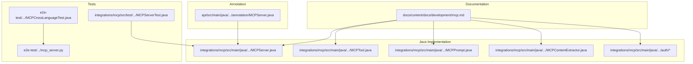
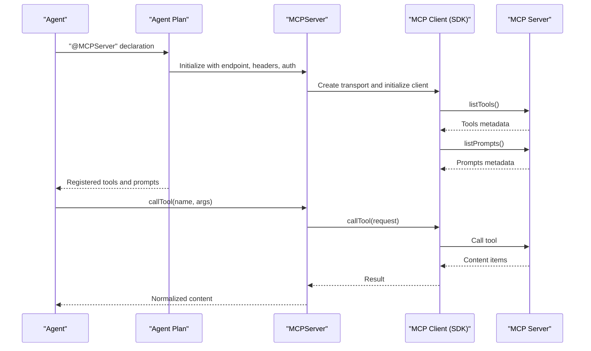
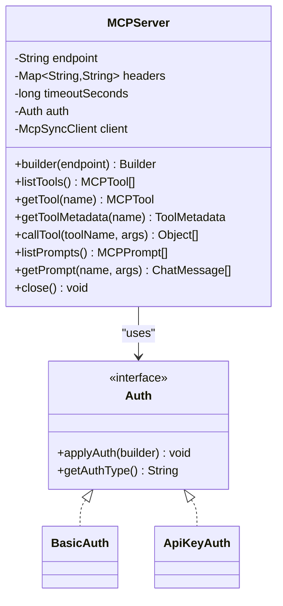
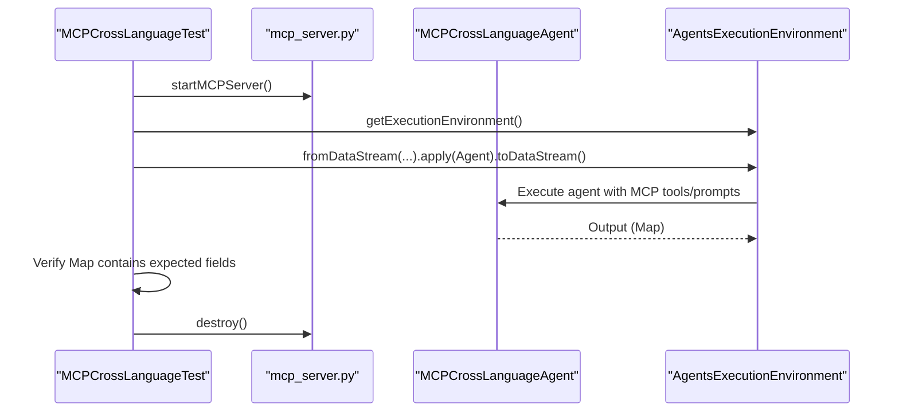
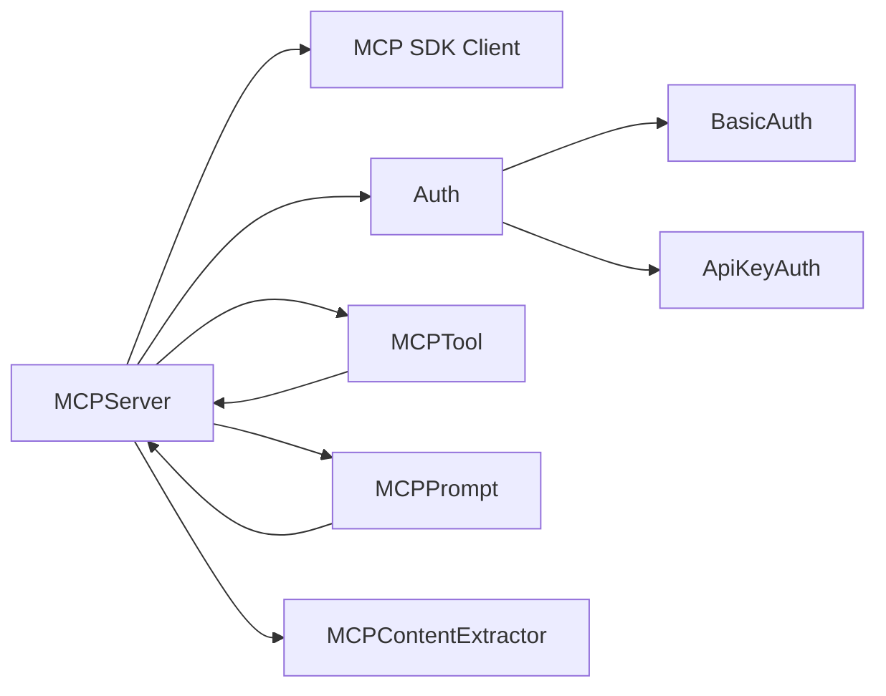

# MCP Integration

<cite>
**Referenced Files in This Document**
- [mcp.md](file://docs/content/docs/development/mcp.md)
- [MCPServer.java](file://integrations/mcp/src/main/java/org/apache/flink/agents/integrations/mcp/MCPServer.java)
- [MCPTool.java](file://integrations/mcp/src/main/java/org/apache/flink/agents/integrations/mcp/MCPTool.java)
- [MCPPrompt.java](file://integrations/mcp/src/main/java/org/apache/flink/agents/integrations/mcp/MCPPrompt.java)
- [MCPContentExtractor.java](file://integrations/mcp/src/main/java/org/apache/flink/agents/integrations/mcp/MCPContentExtractor.java)
- [Auth.java](file://integrations/mcp/src/main/java/org/apache/flink/agents/integrations/mcp/auth/Auth.java)
- [BasicAuth.java](file://integrations/mcp/src/main/java/org/apache/flink/agents/integrations/mcp/auth/BasicAuth.java)
- [ApiKeyAuth.java](file://integrations/mcp/src/main/java/org/apache/flink/agents/integrations/mcp/auth/ApiKeyAuth.java)
- [MCPServerTest.java](file://integrations/mcp/src/test/java/org/apache/flink/agents/integrations/mcp/MCPServerTest.java)
- [MCPCrossLanguageTest.java](file://e2e-test/flink-agents-end-to-end-tests-resource-cross-language/src/test/java/org/apache/flink/agents/resource/test/MCPCrossLanguageTest.java)
- [mcp_server.py](file://e2e-test/flink-agents-end-to-end-tests-resource-cross-language/src/test/resources/mcp_server.py)
- [MCPServer.java (annotation)](file://api/src/main/java/org/apache/flink/agents/api/annotation/MCPServer.java)
</cite>

## Table of Contents
1. [Introduction](#introduction)
2. [Project Structure](#project-structure)
3. [Core Components](#core-components)
4. [Architecture Overview](#architecture-overview)
5. [Detailed Component Analysis](#detailed-component-analysis)
6. [Dependency Analysis](#dependency-analysis)
7. [Performance Considerations](#performance-considerations)
8. [Troubleshooting Guide](#troubleshooting-guide)
9. [Conclusion](#conclusion)
10. [Appendices](#appendices)

## Introduction
This document explains how Flink Agents integrates with the Model Context Protocol (MCP) to discover and execute tools and prompts from external MCP servers. It covers setup, configuration, authentication, tool registration patterns, prompt handling, and operational guidance for secure and reliable deployments.

## Project Structure
MCP integration spans documentation, Java and Python implementations, and end-to-end tests:
- Documentation describes MCP usage and authentication patterns.
- Java implementation provides the MCP server resource, tool wrapper, prompt wrapper, content extraction, and authentication abstractions.
- Python-based MCP server is used in cross-language end-to-end tests.
- Annotation enables declaring MCP servers in agents.

**Diagram sources**
- [mcp.md](file://docs/content/docs/development/mcp.md#L1-L207)
- [MCPServer.java](file://integrations/mcp/src/main/java/org/apache/flink/agents/integrations/mcp/MCPServer.java#L1-L438)
- [MCPTool.java](file://integrations/mcp/src/main/java/org/apache/flink/agents/integrations/mcp/MCPTool.java#L1-L134)
- [MCPPrompt.java](file://integrations/mcp/src/main/java/org/apache/flink/agents/integrations/mcp/MCPPrompt.java#L1-L236)
- [MCPContentExtractor.java](file://integrations/mcp/src/main/java/org/apache/flink/agents/integrations/mcp/MCPContentExtractor.java#L1-L107)
- [Auth.java](file://integrations/mcp/src/main/java/org/apache/flink/agents/integrations/mcp/auth/Auth.java#L1-L60)
- [MCPServer.java (annotation)](file://api/src/main/java/org/apache/flink/agents/api/annotation/MCPServer.java#L1-L84)
- [MCPServerTest.java](file://integrations/mcp/src/test/java/org/apache/flink/agents/integrations/mcp/MCPServerTest.java#L1-L247)
- [MCPCrossLanguageTest.java](file://e2e-test/flink-agents-end-to-end-tests-resource-cross-language/src/test/java/org/apache/flink/agents/resource/test/MCPCrossLanguageTest.java#L1-L86)
- [mcp_server.py](file://e2e-test/flink-agents-end-to-end-tests-resource-cross-language/src/test/resources/mcp_server.py#L1-L51)

**Section sources**
- [mcp.md](file://docs/content/docs/development/mcp.md#L1-L207)
- [MCPServer.java](file://integrations/mcp/src/main/java/org/apache/flink/agents/integrations/mcp/MCPServer.java#L1-L438)
- [MCPTool.java](file://integrations/mcp/src/main/java/org/apache/flink/agents/integrations/mcp/MCPTool.java#L1-L134)
- [MCPPrompt.java](file://integrations/mcp/src/main/java/org/apache/flink/agents/integrations/mcp/MCPPrompt.java#L1-L236)
- [MCPContentExtractor.java](file://integrations/mcp/src/main/java/org/apache/flink/agents/integrations/mcp/MCPContentExtractor.java#L1-L107)
- [Auth.java](file://integrations/mcp/src/main/java/org/apache/flink/agents/integrations/mcp/auth/Auth.java#L1-L60)
- [MCPServer.java (annotation)](file://api/src/main/java/org/apache/flink/agents/api/annotation/MCPServer.java#L1-L84)
- [MCPServerTest.java](file://integrations/mcp/src/test/java/org/apache/flink/agents/integrations/mcp/MCPServerTest.java#L1-L247)
- [MCPCrossLanguageTest.java](file://e2e-test/flink-agents-end-to-end-tests-resource-cross-language/src/test/java/org/apache/flink/agents/resource/test/MCPCrossLanguageTest.java#L1-L86)
- [mcp_server.py](file://e2e-test/flink-agents-end-to-end-tests-resource-cross-language/src/test/resources/mcp_server.py#L1-L51)

## Core Components
- MCPServer: A resource that connects to an MCP server, discovers tools and prompts, and executes tool calls. Supports configurable endpoint, headers, timeout, and authentication.
- MCPTool: Wraps an MCP tool and exposes it as a Tool for agent execution.
- MCPPrompt: Wraps an MCP prompt and exposes it as a Prompt for dynamic message formatting.
- MCPContentExtractor: Normalizes MCP content items (text, images, embedded resources) into Java-friendly structures.
- Auth hierarchy: Pluggable authentication implementations (BearerTokenAuth, BasicAuth, ApiKeyAuth) applied to HTTP requests.

Key capabilities:
- Automatic tool and prompt discovery via MCP listTools and listPrompts.
- Dynamic prompt retrieval with argument validation.
- Robust content normalization for varied MCP content types.
- Graceful client lifecycle management and resource cleanup.

**Section sources**
- [MCPServer.java](file://integrations/mcp/src/main/java/org/apache/flink/agents/integrations/mcp/MCPServer.java#L50-L77)
- [MCPTool.java](file://integrations/mcp/src/main/java/org/apache/flink/agents/integrations/mcp/MCPTool.java#L35-L41)
- [MCPPrompt.java](file://integrations/mcp/src/main/java/org/apache/flink/agents/integrations/mcp/MCPPrompt.java#L34-L40)
- [MCPContentExtractor.java](file://integrations/mcp/src/main/java/org/apache/flink/agents/integrations/mcp/MCPContentExtractor.java#L26-L32)
- [Auth.java](file://integrations/mcp/src/main/java/org/apache/flink/agents/integrations/mcp/auth/Auth.java#L27-L43)

## Architecture Overview
The MCP integration follows a layered design:
- Agent layer declares MCP servers via annotations.
- Agent plan discovers tools and prompts from the MCP server and registers them as resources.
- Execution layer invokes MCP tools and resolves MCP prompts at runtime.

**Diagram sources**
- [MCPServer.java](file://integrations/mcp/src/main/java/org/apache/flink/agents/integrations/mcp/MCPServer.java#L265-L335)
- [MCPTool.java](file://integrations/mcp/src/main/java/org/apache/flink/agents/integrations/mcp/MCPTool.java#L74-L97)
- [MCPPrompt.java](file://integrations/mcp/src/main/java/org/apache/flink/agents/integrations/mcp/MCPPrompt.java#L181-L183)
- [MCPServer.java (annotation)](file://api/src/main/java/org/apache/flink/agents/api/annotation/MCPServer.java#L26-L61)

## Detailed Component Analysis

### MCPServer: MCP Server Resource
Responsibilities:
- Validate and configure HTTP endpoint.
- Build and reuse a synchronized MCP client with custom headers and authentication.
- Discover tools and prompts, returning typed wrappers.
- Execute tool calls and normalize results.

Design highlights:
- Builder pattern for endpoint, headers, timeout, and auth.
- Lazy initialization of the MCP client with graceful shutdown.
- Input schema serialization fallback for robustness.

**Diagram sources**
- [MCPServer.java](file://integrations/mcp/src/main/java/org/apache/flink/agents/integrations/mcp/MCPServer.java#L78-L438)
- [Auth.java](file://integrations/mcp/src/main/java/org/apache/flink/agents/integrations/mcp/auth/Auth.java#L27-L60)
- [BasicAuth.java](file://integrations/mcp/src/main/java/org/apache/flink/agents/integrations/mcp/auth/BasicAuth.java#L29-L109)
- [ApiKeyAuth.java](file://integrations/mcp/src/main/java/org/apache/flink/agents/integrations/mcp/auth/ApiKeyAuth.java#L27-L103)

**Section sources**
- [MCPServer.java](file://integrations/mcp/src/main/java/org/apache/flink/agents/integrations/mcp/MCPServer.java#L136-L194)
- [MCPServer.java](file://integrations/mcp/src/main/java/org/apache/flink/agents/integrations/mcp/MCPServer.java#L213-L240)
- [MCPServer.java](file://integrations/mcp/src/main/java/org/apache/flink/agents/integrations/mcp/MCPServer.java#L265-L335)
- [MCPServer.java](file://integrations/mcp/src/main/java/org/apache/flink/agents/integrations/mcp/MCPServer.java#L342-L390)
- [MCPServer.java](file://integrations/mcp/src/main/java/org/apache/flink/agents/integrations/mcp/MCPServer.java#L392-L403)

### MCPTool: Tool Wrapper
Responsibilities:
- Expose an MCP tool as a Tool for agent execution.
- Convert ToolParameters to MCP arguments and return normalized ToolResponse.

Behavior:
- Delegates execution to MCPServer.callTool.
- Captures execution time and propagates errors as ToolResponse.error.

**Section sources**
- [MCPTool.java](file://integrations/mcp/src/main/java/org/apache/flink/agents/integrations/mcp/MCPTool.java#L41-L97)

### MCPPrompt: Prompt Wrapper
Responsibilities:
- Wrap an MCP prompt and expose it as a Prompt.
- Validate required arguments and fetch formatted messages from the MCP server.

Behavior:
- Validates presence of required arguments and prepares argument map.
- Converts MCP messages to ChatMessage list for downstream use.

**Section sources**
- [MCPPrompt.java](file://integrations/mcp/src/main/java/org/apache/flink/agents/integrations/mcp/MCPPrompt.java#L40-L183)
- [MCPPrompt.java](file://integrations/mcp/src/main/java/org/apache/flink/agents/integrations/mcp/MCPPrompt.java#L192-L208)

### MCPContentExtractor: Content Normalization
Responsibilities:
- Normalize MCP content items into Java-friendly structures:
  - TextContent to String.
  - ImageContent to a map with data and MIME type.
  - EmbeddedResource to a map with resource details.

**Section sources**
- [MCPContentExtractor.java](file://integrations/mcp/src/main/java/org/apache/flink/agents/integrations/mcp/MCPContentExtractor.java#L26-L107)

### Authentication Mechanisms
Supported authentication types:
- BearerTokenAuth: Adds Authorization: Bearer header.
- BasicAuth: Adds Authorization: Basic header with base64-encoded credentials.
- ApiKeyAuth: Adds a custom header (e.g., X-API-Key) with the provided key.

Implementation:
- Auth interface defines applyAuth and getAuthType.
- Jackson polymorphic serialization supports "bearer", "basic", "api_key".

**Section sources**
- [Auth.java](file://integrations/mcp/src/main/java/org/apache/flink/agents/integrations/mcp/auth/Auth.java#L27-L60)
- [BasicAuth.java](file://integrations/mcp/src/main/java/org/apache/flink/agents/integrations/mcp/auth/BasicAuth.java#L29-L109)
- [ApiKeyAuth.java](file://integrations/mcp/src/main/java/org/apache/flink/agents/integrations/mcp/auth/ApiKeyAuth.java#L27-L103)

### Agent Integration and Tool Registration
- The @MCPServer annotation marks a method that returns a ResourceDescriptor for an MCP server.
- During agent plan creation, the framework:
  - Discovers tools and prompts via listTools and listPrompts.
  - Registers each tool/prompt as a separate resource.
  - Closes the MCP server connection after discovery.

Usage patterns:
- Declare MCP server with endpoint, headers, timeout, and auth.
- Reference MCP tools and prompts by name in chat model setup.

**Section sources**
- [MCPServer.java (annotation)](file://api/src/main/java/org/apache/flink/agents/api/annotation/MCPServer.java#L26-L61)
- [mcp.md](file://docs/content/docs/development/mcp.md#L29-L121)
- [mcp.md](file://docs/content/docs/development/mcp.md#L122-L182)

### End-to-End Example: Cross-Language MCP
The cross-language test demonstrates:
- Starting a Python-based MCP server.
- Running an agent that consumes MCP tools and prompts.
- Verifying the output map contains expected fields.

**Diagram sources**
- [MCPCrossLanguageTest.java](file://e2e-test/flink-agents-end-to-end-tests-resource-cross-language/src/test/java/org/apache/flink/agents/resource/test/MCPCrossLanguageTest.java#L34-L85)
- [mcp_server.py](file://e2e-test/flink-agents-end-to-end-tests-resource-cross-language/src/test/resources/mcp_server.py#L26-L51)

**Section sources**
- [MCPCrossLanguageTest.java](file://e2e-test/flink-agents-end-to-end-tests-resource-cross-language/src/test/java/org/apache/flink/agents/resource/test/MCPCrossLanguageTest.java#L41-L85)
- [mcp_server.py](file://e2e-test/flink-agents-end-to-end-tests-resource-cross-language/src/test/resources/mcp_server.py#L26-L51)

## Dependency Analysis
- MCPServer depends on:
  - MCP SDK client for HTTP/SSE transport.
  - Auth implementations for request augmentation.
  - ToolMetadata and ToolResponse for tool wrapping.
  - MCPContentExtractor for result normalization.
- MCPTool depends on MCPServer for execution.
- MCPPrompt depends on MCPServer for prompt retrieval.
- Tests validate builder configuration, auth types, endpoint validation, and JSON serialization/deserialization.

**Diagram sources**
- [MCPServer.java](file://integrations/mcp/src/main/java/org/apache/flink/agents/integrations/mcp/MCPServer.java#L25-L48)
- [MCPTool.java](file://integrations/mcp/src/main/java/org/apache/flink/agents/integrations/mcp/MCPTool.java#L24-L33)
- [MCPPrompt.java](file://integrations/mcp/src/main/java/org/apache/flink/agents/integrations/mcp/MCPPrompt.java#L24-L27)
- [MCPContentExtractor.java](file://integrations/mcp/src/main/java/org/apache/flink/agents/integrations/mcp/MCPContentExtractor.java#L21-L25)
- [Auth.java](file://integrations/mcp/src/main/java/org/apache/flink/agents/integrations/mcp/auth/Auth.java#L37-L42)

**Section sources**
- [MCPServerTest.java](file://integrations/mcp/src/test/java/org/apache/flink/agents/integrations/mcp/MCPServerTest.java#L39-L247)

## Performance Considerations
- Client reuse: MCPServer lazily creates and reuses a synchronized MCP client to avoid repeated initialization overhead.
- Timeout configuration: Tune timeoutSeconds per environment to balance responsiveness and reliability.
- Content normalization: Extraction avoids heavy transformations and returns primitive structures for downstream processing.
- Tool execution timing: MCPTool captures execution time for observability.

[No sources needed since this section provides general guidance]

## Troubleshooting Guide
Common issues and resolutions:
- Invalid HTTP endpoint
  - Symptom: IllegalArgumentException indicating invalid scheme or host.
  - Resolution: Ensure endpoint uses http or https and includes a valid host.
  - Evidence: Endpoint validation logic.
- Tool not found
  - Symptom: IllegalArgumentException when retrieving a tool by name.
  - Resolution: Confirm tool name matches server-side registration and that discovery succeeded.
- Missing required prompt arguments
  - Symptom: IllegalArgumentException for missing required argument.
  - Resolution: Provide all required arguments when formatting or invoking the prompt.
- Authentication failures
  - Symptom: 401/403 responses from MCP server.
  - Resolution: Verify auth type and credentials; ensure headers are correctly applied.
- JSON serialization/deserialization
  - Symptom: Unexpected fields or deserialization errors.
  - Resolution: Use configured mapper settings and ensure authType is present for polymorphic auth.

**Section sources**
- [MCPServer.java](file://integrations/mcp/src/main/java/org/apache/flink/agents/integrations/mcp/MCPServer.java#L242-L258)
- [MCPServer.java](file://integrations/mcp/src/main/java/org/apache/flink/agents/integrations/mcp/MCPServer.java#L291-L303)
- [MCPPrompt.java](file://integrations/mcp/src/main/java/org/apache/flink/agents/integrations/mcp/MCPPrompt.java#L192-L208)
- [MCPServerTest.java](file://integrations/mcp/src/test/java/org/apache/flink/agents/integrations/mcp/MCPServerTest.java#L112-L122)
- [MCPServerTest.java](file://integrations/mcp/src/test/java/org/apache/flink/agents/integrations/mcp/MCPServerTest.java#L184-L210)

## Conclusion
Flink Agents provides a robust MCP integration enabling agents to dynamically discover and use tools and prompts from external MCP servers. The Java implementation offers a clean abstraction for authentication, tool execution, and prompt resolution, while the annotation-driven agent plan simplifies registration and lifecycle management. The included tests and documentation demonstrate practical usage and help ensure secure, observable deployments.

[No sources needed since this section summarizes without analyzing specific files]

## Appendices

### Step-by-Step: Configure an MCP Server in an Agent
- Define an MCP server resource using the @MCPServer annotation (Java) or @mcp_server decorator (Python).
- Set endpoint, headers, timeout, and authentication as needed.
- Reference MCP tools and prompts by name in chat model setup.

**Section sources**
- [mcp.md](file://docs/content/docs/development/mcp.md#L29-L121)
- [mcp.md](file://docs/content/docs/development/mcp.md#L122-L182)
- [MCPServer.java (annotation)](file://api/src/main/java/org/apache/flink/agents/api/annotation/MCPServer.java#L26-L61)

### Authentication Options
- BearerTokenAuth: OAuth 2.0/JWT tokens.
- BasicAuth: Username/password pairs.
- ApiKeyAuth: Custom header-based API keys.

**Section sources**
- [mcp.md](file://docs/content/docs/development/mcp.md#L71-L121)
- [Auth.java](file://integrations/mcp/src/main/java/org/apache/flink/agents/integrations/mcp/auth/Auth.java#L37-L42)
- [BasicAuth.java](file://integrations/mcp/src/main/java/org/apache/flink/agents/integrations/mcp/auth/BasicAuth.java#L69-L75)
- [ApiKeyAuth.java](file://integrations/mcp/src/main/java/org/apache/flink/agents/integrations/mcp/auth/ApiKeyAuth.java#L67-L70)

### Tool Registration Patterns
- Discovery: MCPServer.listTools and listPrompts populate the agent plan.
- Registration: Each tool/prompt becomes a separate resource for the agent.
- Cleanup: MCPServer.close ensures proper resource release after discovery.

**Section sources**
- [MCPServer.java](file://integrations/mcp/src/main/java/org/apache/flink/agents/integrations/mcp/MCPServer.java#L265-L335)
- [MCPServer.java](file://integrations/mcp/src/main/java/org/apache/flink/agents/integrations/mcp/MCPServer.java#L342-L390)
- [MCPServer.java](file://integrations/mcp/src/main/java/org/apache/flink/agents/integrations/mcp/MCPServer.java#L392-L403)
- [MCPServer.java (annotation)](file://api/src/main/java/org/apache/flink/agents/api/annotation/MCPServer.java#L26-L61)

### Prompt Handling Strategies
- Dynamic retrieval: MCPPrompt.getPrompt fetches messages from the server.
- Argument validation: Required arguments are enforced before invocation.
- Message formatting: Converted to ChatMessage list for downstream use.

**Section sources**
- [MCPPrompt.java](file://integrations/mcp/src/main/java/org/apache/flink/agents/integrations/mcp/MCPPrompt.java#L181-L183)
- [MCPPrompt.java](file://integrations/mcp/src/main/java/org/apache/flink/agents/integrations/mcp/MCPPrompt.java#L192-L208)

### Security Considerations
- Prefer HTTPS endpoints to protect traffic.
- Use BearerTokenAuth for OAuth/JWT; BasicAuth for simple credentials; ApiKeyAuth for API key-based systems.
- Limit exposure of sensitive headers and tokens; rotate tokens regularly.
- Validate and sanitize prompt arguments to prevent injection.

**Section sources**
- [MCPServer.java](file://integrations/mcp/src/main/java/org/apache/flink/agents/integrations/mcp/MCPServer.java#L242-L258)
- [mcp.md](file://docs/content/docs/development/mcp.md#L71-L121)

### Monitoring Approaches
- Capture tool execution time from MCPTool.
- Log prompt argument validation outcomes.
- Track MCP server availability and response latency.

[No sources needed since this section provides general guidance]