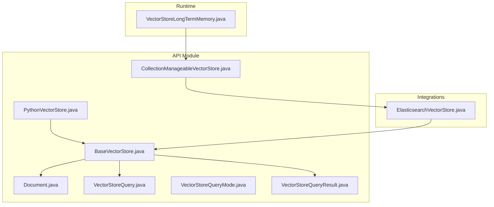
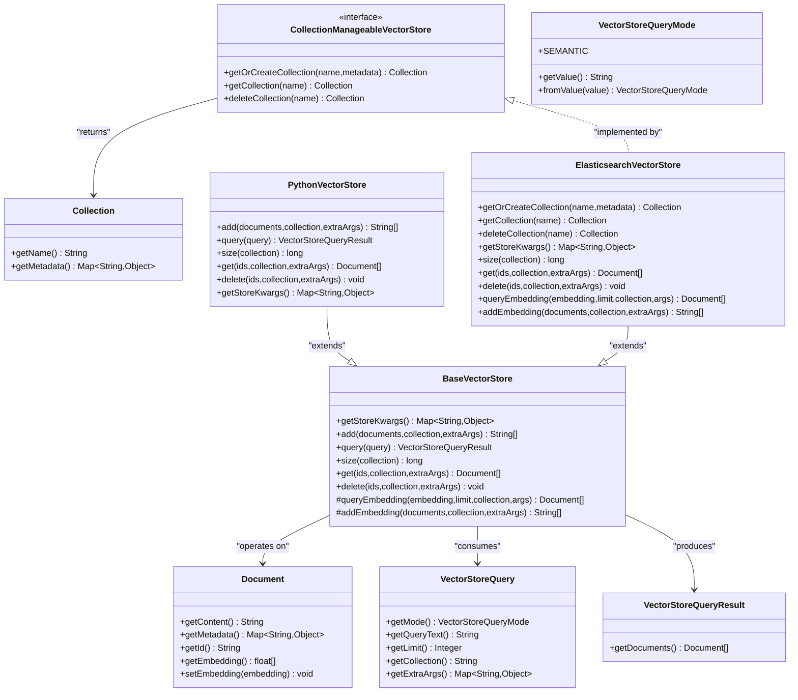
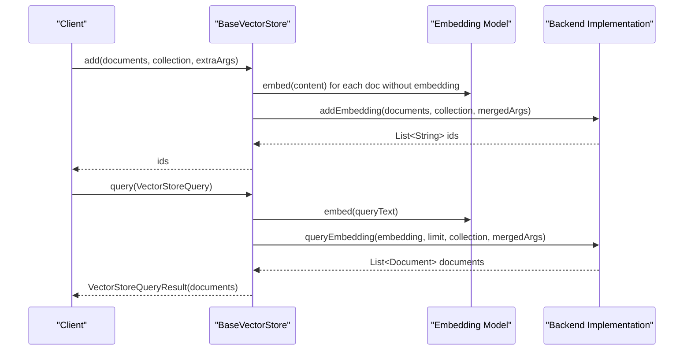
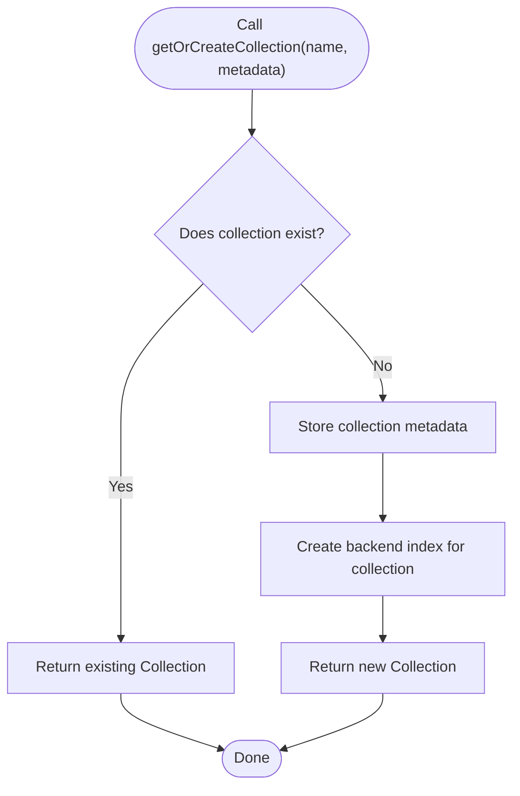
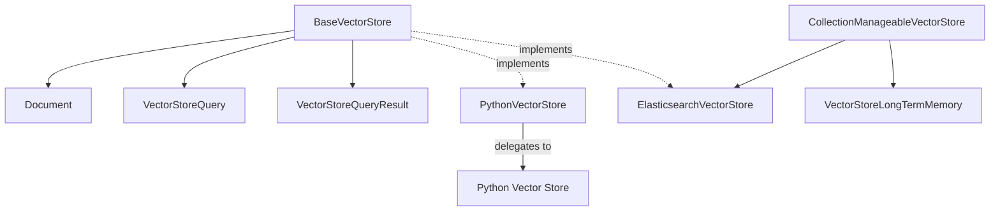

# Base VectorStore Interface

<cite>
**Referenced Files in This Document**
- [BaseVectorStore.java](file://api/src/main/java/org/apache/flink/agents/api/vectorstores/BaseVectorStore.java)
- [CollectionManageableVectorStore.java](file://api/src/main/java/org/apache/flink/agents/api/vectorstores/CollectionManageableVectorStore.java)
- [Document.java](file://api/src/main/java/org/apache/flink/agents/api/vectorstores/Document.java)
- [VectorStoreQuery.java](file://api/src/main/java/org/apache/flink/agents/api/vectorstores/VectorStoreQuery.java)
- [VectorStoreQueryMode.java](file://api/src/main/java/org/apache/flink/agents/api/vectorstores/VectorStoreQueryMode.java)
- [VectorStoreQueryResult.java](file://api/src/main/java/org/apache/flink/agents/api/vectorstores/VectorStoreQueryResult.java)
- [PythonVectorStore.java](file://api/src/main/java/org/apache/flink/agents/api/vectorstores/python/PythonVectorStore.java)
- [ElasticsearchVectorStore.java](file://integrations/vector-stores/elasticsearch/src/main/java/org/apache/flink/agents/integrations/vectorstores/elasticsearch/ElasticsearchVectorStore.java)
- [VectorStoreLongTermMemory.java](file://runtime/src/main/java/org/apache/flink/agents/runtime/memory/VectorStoreLongTermMemory.java)
</cite>

## Table of Contents
1. [Introduction](#introduction)
2. [Project Structure](#project-structure)
3. [Core Components](#core-components)
4. [Architecture Overview](#architecture-overview)
5. [Detailed Component Analysis](#detailed-component-analysis)
6. [Dependency Analysis](#dependency-analysis)
7. [Performance Considerations](#performance-considerations)
8. [Troubleshooting Guide](#troubleshooting-guide)
9. [Conclusion](#conclusion)

## Introduction
This document provides comprehensive documentation for the BaseVectorStore interface and related abstractions in Flink Agents. It explains the interface contract, method signatures, and implementation requirements for custom vector store integrations. It covers the CollectionManageableVectorStore interface for collection-based vector stores, the Document data model, and the VectorStoreQuery structure. The guide details the abstract methods for add, get, delete, and query operations, embedding handling, metadata management, and query parameter specifications. It includes guidelines for implementing custom vector store providers, error handling patterns, performance considerations, thread safety, resource management, and lifecycle considerations.

## Project Structure
The vector store abstraction resides in the API module under the vectorstores package. It defines the foundational abstractions and is extended by integration implementations and Python bridge components.

**Diagram sources**
- [BaseVectorStore.java](file://api/src/main/java/org/apache/flink/agents/api/vectorstores/BaseVectorStore.java#L38-L173)
- [CollectionManageableVectorStore.java](file://api/src/main/java/org/apache/flink/agents/api/vectorstores/CollectionManageableVectorStore.java#L23-L67)
- [Document.java](file://api/src/main/java/org/apache/flink/agents/api/vectorstores/Document.java#L34-L110)
- [VectorStoreQuery.java](file://api/src/main/java/org/apache/flink/agents/api/vectorstores/VectorStoreQuery.java#L33-L109)
- [VectorStoreQueryMode.java](file://api/src/main/java/org/apache/flink/agents/api/vectorstores/VectorStoreQueryMode.java#L28-L61)
- [VectorStoreQueryResult.java](file://api/src/main/java/org/apache/flink/agents/api/vectorstores/VectorStoreQueryResult.java#L29-L46)
- [PythonVectorStore.java](file://api/src/main/java/org/apache/flink/agents/api/vectorstores/python/PythonVectorStore.java#L49-L156)
- [ElasticsearchVectorStore.java](file://integrations/vector-stores/elasticsearch/src/main/java/org/apache/flink/agents/integrations/vectorstores/elasticsearch/ElasticsearchVectorStore.java#L118-L250)
- [VectorStoreLongTermMemory.java](file://runtime/src/main/java/org/apache/flink/agents/runtime/memory/VectorStoreLongTermMemory.java#L57-L135)

**Section sources**
- [BaseVectorStore.java](file://api/src/main/java/org/apache/flink/agents/api/vectorstores/BaseVectorStore.java#L38-L173)
- [CollectionManageableVectorStore.java](file://api/src/main/java/org/apache/flink/agents/api/vectorstores/CollectionManageableVectorStore.java#L23-L67)
- [Document.java](file://api/src/main/java/org/apache/flink/agents/api/vectorstores/Document.java#L34-L110)
- [VectorStoreQuery.java](file://api/src/main/java/org/apache/flink/agents/api/vectorstores/VectorStoreQuery.java#L33-L109)
- [VectorStoreQueryMode.java](file://api/src/main/java/org/apache/flink/agents/api/vectorstores/VectorStoreQueryMode.java#L28-L61)
- [VectorStoreQueryResult.java](file://api/src/main/java/org/apache/flink/agents/api/vectorstores/VectorStoreQueryResult.java#L29-L46)
- [PythonVectorStore.java](file://api/src/main/java/org/apache/flink/agents/api/vectorstores/python/PythonVectorStore.java#L49-L156)
- [ElasticsearchVectorStore.java](file://integrations/vector-stores/elasticsearch/src/main/java/org/apache/flink/agents/integrations/vectorstores/elasticsearch/ElasticsearchVectorStore.java#L118-L250)
- [VectorStoreLongTermMemory.java](file://runtime/src/main/java/org/apache/flink/agents/runtime/memory/VectorStoreLongTermMemory.java#L57-L135)

## Core Components
This section outlines the primary abstractions and their roles in the vector store ecosystem.

- BaseVectorStore: Abstract class that integrates embedding model resources and provides high-level operations for adding, retrieving, deleting, and querying documents. It manages embedding generation and exposes protected abstract methods for backend-specific implementations.
- CollectionManageableVectorStore: Interface that enables collection management operations (get/create/delete) for vector stores that support collections.
- Document: Data model representing a single piece of content with associated metadata and optional embedding vectors.
- VectorStoreQuery: Encapsulates query parameters including mode, text, limit, collection, and extra arguments.
- VectorStoreQueryMode: Enum defining query execution modes (currently SEMANTIC).
- VectorStoreQueryResult: Wrapper for query results containing matched documents.
- PythonVectorStore: Bridge implementation that delegates operations to a Python-side vector store object.
- ElasticsearchVectorStore: Concrete implementation backed by Elasticsearch, supporting collection management and approximate nearest neighbor search.

Key responsibilities:
- Embedding handling: BaseVectorStore automatically embeds content when not provided.
- Metadata management: Document carries metadata; implementations may persist and retrieve it.
- Query parameterization: VectorStoreQuery supports flexible parameter passing via extraArgs.
- Collection management: Implementations may support named collections with metadata.

**Section sources**
- [BaseVectorStore.java](file://api/src/main/java/org/apache/flink/agents/api/vectorstores/BaseVectorStore.java#L38-L173)
- [CollectionManageableVectorStore.java](file://api/src/main/java/org/apache/flink/agents/api/vectorstores/CollectionManageableVectorStore.java#L23-L67)
- [Document.java](file://api/src/main/java/org/apache/flink/agents/api/vectorstores/Document.java#L34-L110)
- [VectorStoreQuery.java](file://api/src/main/java/org/apache/flink/agents/api/vectorstores/VectorStoreQuery.java#L33-L109)
- [VectorStoreQueryMode.java](file://api/src/main/java/org/apache/flink/agents/api/vectorstores/VectorStoreQueryMode.java#L28-L61)
- [VectorStoreQueryResult.java](file://api/src/main/java/org/apache/flink/agents/api/vectorstores/VectorStoreQueryResult.java#L29-L46)
- [PythonVectorStore.java](file://api/src/main/java/org/apache/flink/agents/api/vectorstores/python/PythonVectorStore.java#L49-L156)
- [ElasticsearchVectorStore.java](file://integrations/vector-stores/elasticsearch/src/main/java/org/apache/flink/agents/integrations/vectorstores/elasticsearch/ElasticsearchVectorStore.java#L118-L250)

## Architecture Overview
The vector store architecture centers around BaseVectorStore, which orchestrates embedding generation and delegates storage and retrieval to backend-specific implementations. CollectionManageableVectorStore augments capabilities for stores that support collections. PythonVectorStore provides cross-language interoperability, while ElasticsearchVectorStore demonstrates a production-ready implementation.

**Diagram sources**
- [BaseVectorStore.java](file://api/src/main/java/org/apache/flink/agents/api/vectorstores/BaseVectorStore.java#L38-L173)
- [CollectionManageableVectorStore.java](file://api/src/main/java/org/apache/flink/agents/api/vectorstores/CollectionManageableVectorStore.java#L23-L67)
- [Document.java](file://api/src/main/java/org/apache/flink/agents/api/vectorstores/Document.java#L34-L110)
- [VectorStoreQuery.java](file://api/src/main/java/org/apache/flink/agents/api/vectorstores/VectorStoreQuery.java#L33-L109)
- [VectorStoreQueryMode.java](file://api/src/main/java/org/apache/flink/agents/api/vectorstores/VectorStoreQueryMode.java#L28-L61)
- [VectorStoreQueryResult.java](file://api/src/main/java/org/apache/flink/agents/api/vectorstores/VectorStoreQueryResult.java#L29-L46)
- [PythonVectorStore.java](file://api/src/main/java/org/apache/flink/agents/api/vectorstores/python/PythonVectorStore.java#L49-L156)
- [ElasticsearchVectorStore.java](file://integrations/vector-stores/elasticsearch/src/main/java/org/apache/flink/agents/integrations/vectorstores/elasticsearch/ElasticsearchVectorStore.java#L118-L250)

## Detailed Component Analysis

### BaseVectorStore Contract
BaseVectorStore defines the core contract for vector store implementations:
- Embedding integration: Automatically embeds content when not provided during add operations.
- High-level operations:
  - add: Accepts a list of documents, optional collection, and extra arguments; returns generated IDs.
  - query: Accepts a VectorStoreQuery; converts query text to embedding and returns VectorStoreQueryResult.
  - size: Returns the number of documents in a collection.
  - get: Retrieves documents by IDs or all documents depending on parameters.
  - delete: Removes documents by IDs or applies filters when IDs are absent.
- Backend-specific hooks:
  - queryEmbedding: Performs vector search using a precomputed embedding.
  - addEmbedding: Adds documents with precomputed embeddings.

Implementation requirements:
- Implement getStoreKwargs to supply default store-level arguments merged with per-query parameters.
- Implement protected addEmbedding and queryEmbedding for backend-specific logic.
- Ensure thread safety for concurrent operations if the backend is not inherently thread-safe.
- Manage resource lifecycle (open/close) appropriately.

**Diagram sources**
- [BaseVectorStore.java](file://api/src/main/java/org/apache/flink/agents/api/vectorstores/BaseVectorStore.java#L71-L112)
- [VectorStoreQuery.java](file://api/src/main/java/org/apache/flink/agents/api/vectorstores/VectorStoreQuery.java#L33-L109)

**Section sources**
- [BaseVectorStore.java](file://api/src/main/java/org/apache/flink/agents/api/vectorstores/BaseVectorStore.java#L43-L173)

### CollectionManageableVectorStore
This interface adds collection management capabilities:
- getOrCreateCollection: Retrieves an existing collection or creates it with metadata.
- getCollection: Fetches a collection by name.
- deleteCollection: Removes a collection and returns its metadata.

Collections encapsulate metadata and provide logical separation of indexed content.

**Diagram sources**
- [CollectionManageableVectorStore.java](file://api/src/main/java/org/apache/flink/agents/api/vectorstores/CollectionManageableVectorStore.java#L23-L67)
- [ElasticsearchVectorStore.java](file://integrations/vector-stores/elasticsearch/src/main/java/org/apache/flink/agents/integrations/vectorstores/elasticsearch/ElasticsearchVectorStore.java#L258-L275)

**Section sources**
- [CollectionManageableVectorStore.java](file://api/src/main/java/org/apache/flink/agents/api/vectorstores/CollectionManageableVectorStore.java#L23-L67)
- [ElasticsearchVectorStore.java](file://integrations/vector-stores/elasticsearch/src/main/java/org/apache/flink/agents/integrations/vectorstores/elasticsearch/ElasticsearchVectorStore.java#L258-L448)

### Document Data Model
Document represents a single unit of content with:
- Content: The textual content.
- Metadata: Arbitrary key-value pairs for provenance, categorization, etc.
- Id: Unique identifier (optional).
- Embedding: Optional dense vector representation.

Behavior:
- Embedding can be set after construction.
- Equality and hashing consider id, content, metadata, and embedding.

**Section sources**
- [Document.java](file://api/src/main/java/org/apache/flink/agents/api/vectorstores/Document.java#L34-L110)

### VectorStoreQuery Structure
VectorStoreQuery encapsulates:
- Mode: Execution mode (SEMANTIC).
- QueryText: Text to embed or use for search.
- Limit: Maximum number of results.
- Collection: Target collection name (nullable).
- ExtraArgs: Backend-specific parameters.

Usage:
- Defaults to SEMANTIC mode with optional collection and extra arguments.
- Merged with store-level arguments during query execution.

**Section sources**
- [VectorStoreQuery.java](file://api/src/main/java/org/apache/flink/agents/api/vectorstores/VectorStoreQuery.java#L33-L109)
- [VectorStoreQueryMode.java](file://api/src/main/java/org/apache/flink/agents/api/vectorstores/VectorStoreQueryMode.java#L28-L61)

### VectorStoreQueryResult
Encapsulates the result of a query:
- Documents: Ordered list of matched documents.

**Section sources**
- [VectorStoreQueryResult.java](file://api/src/main/java/org/apache/flink/agents/api/vectorstores/VectorStoreQueryResult.java#L29-L46)

### PythonVectorStore Bridge
PythonVectorStore provides a bridge to Python-based vector stores:
- Delegates add, query, size, get, delete to Python implementation.
- Converts Java objects to Python equivalents and vice versa.
- Exposes getStoreKwargs as an empty map (no default store args).

Implementation notes:
- Relies on PythonResourceAdapter for serialization/deserialization.
- Requires a Python-side vector store object compatible with the expected interface.

**Section sources**
- [PythonVectorStore.java](file://api/src/main/java/org/apache/flink/agents/api/vectorstores/python/PythonVectorStore.java#L49-L156)

### ElasticsearchVectorStore Implementation
ElasticsearchVectorStore demonstrates a production-ready implementation:
- Supports collection management via indices and metadata storage.
- Approximate nearest neighbor (ANN) KNN search using dense vector fields.
- Bulk indexing and retrieval for performance.
- Optional filter queries and configurable parameters (k, num_candidates, dims).
- Resource lifecycle management via close().

Key behaviors:
- getStoreKwargs returns default configuration (index, vector_field, dims, k, num_candidates, filter_query).
- queryEmbedding constructs KNN search requests and applies optional post-filters.
- addEmbedding performs bulk indexing with vector, content, and metadata fields.
- get and delete handle both ID-based and filtered operations.

**Section sources**
- [ElasticsearchVectorStore.java](file://integrations/vector-stores/elasticsearch/src/main/java/org/apache/flink/agents/integrations/vectorstores/elasticsearch/ElasticsearchVectorStore.java#L118-L864)

### VectorStoreLongTermMemory Integration
VectorStoreLongTermMemory integrates vector stores into long-term memory:
- Uses CollectionManageableVectorStore to manage memory sets as collections.
- Namespacing via name mangling to isolate memory sets.
- Asynchronous compaction support and metadata propagation.

**Section sources**
- [VectorStoreLongTermMemory.java](file://runtime/src/main/java/org/apache/flink/agents/runtime/memory/VectorStoreLongTermMemory.java#L57-L200)

## Dependency Analysis
The following diagram illustrates dependencies among core components and their relationships to integrations and runtime:

**Diagram sources**
- [BaseVectorStore.java](file://api/src/main/java/org/apache/flink/agents/api/vectorstores/BaseVectorStore.java#L38-L173)
- [PythonVectorStore.java](file://api/src/main/java/org/apache/flink/agents/api/vectorstores/python/PythonVectorStore.java#L49-L156)
- [ElasticsearchVectorStore.java](file://integrations/vector-stores/elasticsearch/src/main/java/org/apache/flink/agents/integrations/vectorstores/elasticsearch/ElasticsearchVectorStore.java#L118-L250)
- [CollectionManageableVectorStore.java](file://api/src/main/java/org/apache/flink/agents/api/vectorstores/CollectionManageableVectorStore.java#L23-L67)
- [VectorStoreLongTermMemory.java](file://runtime/src/main/java/org/apache/flink/agents/runtime/memory/VectorStoreLongTermMemory.java#L57-L135)

**Section sources**
- [BaseVectorStore.java](file://api/src/main/java/org/apache/flink/agents/api/vectorstores/BaseVectorStore.java#L38-L173)
- [PythonVectorStore.java](file://api/src/main/java/org/apache/flink/agents/api/vectorstores/python/PythonVectorStore.java#L49-L156)
- [ElasticsearchVectorStore.java](file://integrations/vector-stores/elasticsearch/src/main/java/org/apache/flink/agents/integrations/vectorstores/elasticsearch/ElasticsearchVectorStore.java#L118-L250)
- [CollectionManageableVectorStore.java](file://api/src/main/java/org/apache/flink/agents/api/vectorstores/CollectionManageableVectorStore.java#L23-L67)
- [VectorStoreLongTermMemory.java](file://runtime/src/main/java/org/apache/flink/agents/runtime/memory/VectorStoreLongTermMemory.java#L57-L135)

## Performance Considerations
- Embedding computation: Offload embedding to dedicated models and cache results when feasible to avoid recomputation.
- Batch operations: Prefer bulk indexing and retrieval for large datasets to minimize network overhead.
- ANN parameters: Tune k and num_candidates for accuracy/performance trade-offs; ensure backend supports the chosen configuration.
- Filter queries: Use efficient filter queries to reduce candidate sets before scoring.
- Resource pooling: Reuse clients and connections; implement proper lifecycle management (open/close).
- Concurrency: Ensure thread safety for shared resources; consider synchronization or immutable data structures.
- Memory management: Avoid retaining large intermediate results; stream or process in chunks.

[No sources needed since this section provides general guidance]

## Troubleshooting Guide
Common issues and resolutions:
- Missing embedding model resource: Ensure the embedding_model argument is configured and resolvable.
- Invalid store arguments: Validate required parameters (e.g., index, vector_field, dims) and their types.
- Collection not found: Verify collection existence or use getOrCreateCollection to create it.
- Bulk operation failures: Inspect error details from bulk responses and address individual failures.
- Authentication problems: Confirm credentials or API key configuration for external backends.
- Query parameter conflicts: Merge store-level and query-level arguments carefully; avoid conflicting keys.

**Section sources**
- [BaseVectorStore.java](file://api/src/main/java/org/apache/flink/agents/api/vectorstores/BaseVectorStore.java#L74-L87)
- [ElasticsearchVectorStore.java](file://integrations/vector-stores/elasticsearch/src/main/java/org/apache/flink/agents/integrations/vectorstores/elasticsearch/ElasticsearchVectorStore.java#L460-L479)
- [ElasticsearchVectorStore.java](file://integrations/vector-stores/elasticsearch/src/main/java/org/apache/flink/agents/integrations/vectorstores/elasticsearch/ElasticsearchVectorStore.java#L636-L647)
- [ElasticsearchVectorStore.java](file://integrations/vector-stores/elasticsearch/src/main/java/org/apache/flink/agents/integrations/vectorstores/elasticsearch/ElasticsearchVectorStore.java#L738-L740)

## Conclusion
The BaseVectorStore abstraction provides a robust foundation for building vector store integrations in Flink Agents. By leveraging embedding-aware operations, flexible query parameters, and collection management, developers can implement custom backends that integrate seamlessly with the broader system. The provided abstractions, combined with concrete implementations like ElasticsearchVectorStore and PythonVectorStore, enable scalable and maintainable vector storage solutions tailored to diverse use cases.