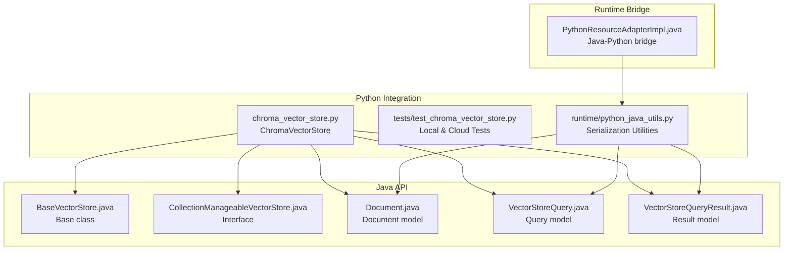
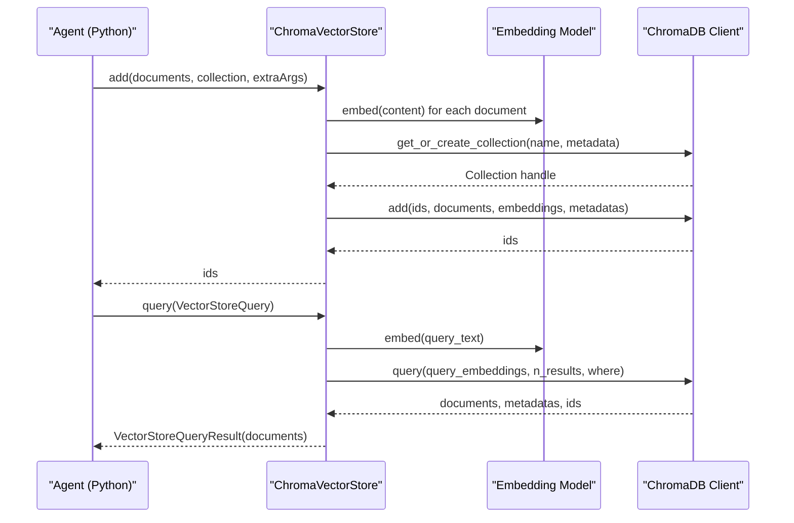
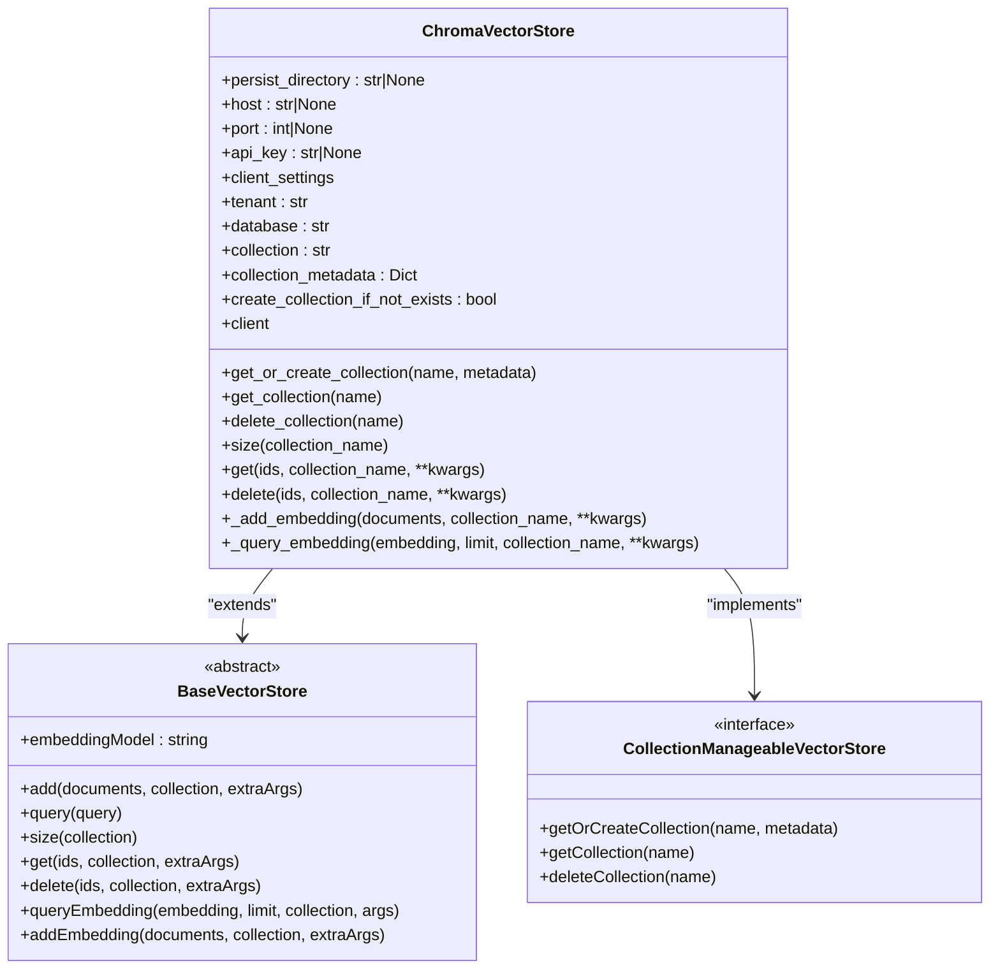
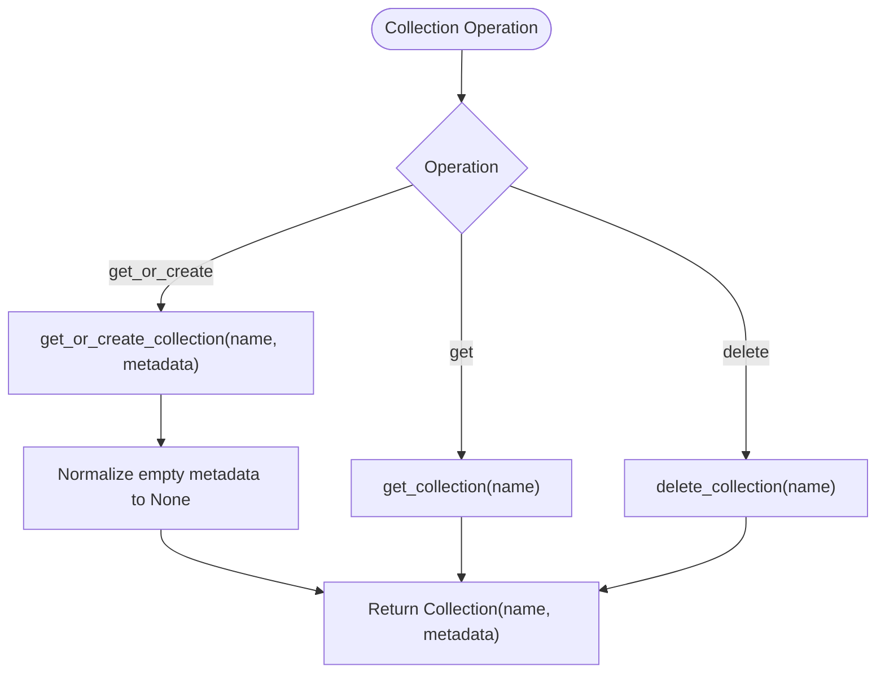
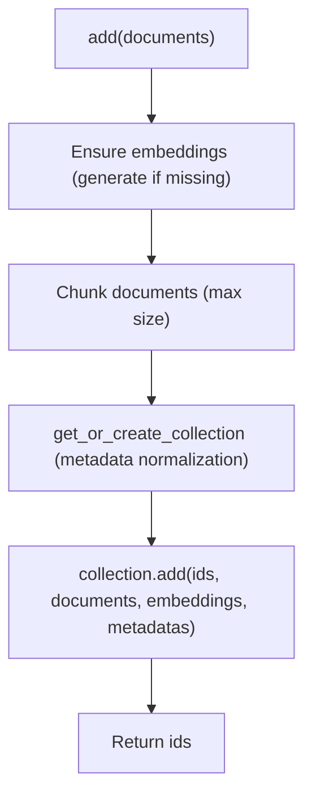
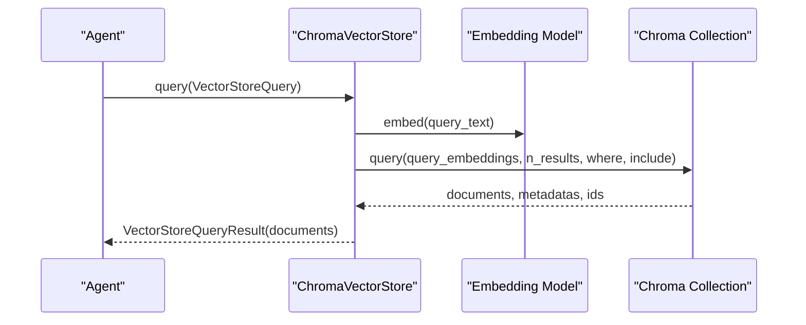
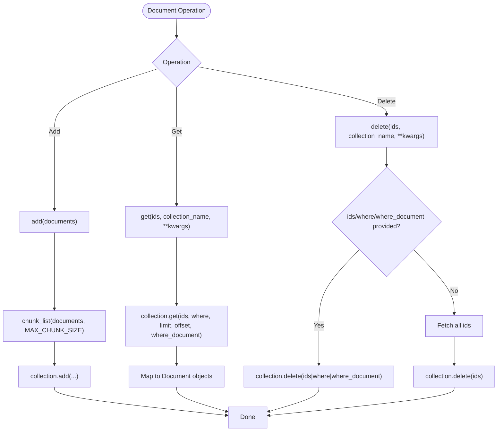
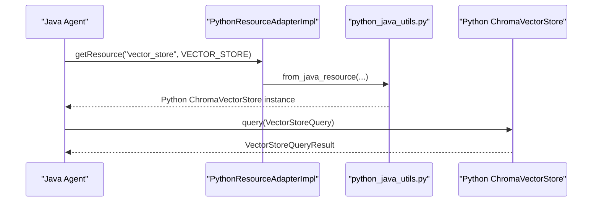
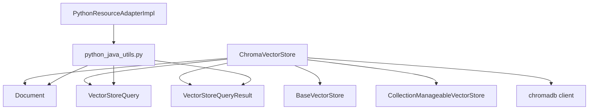

# ChromaDB Integration

<cite>
**Referenced Files in This Document**
- [chroma_vector_store.py](file://python/flink_agents/integrations/vector_stores/chroma/chroma_vector_store.py)
- [test_chroma_vector_store.py](file://python/flink_agents/integrations/vector_stores/chroma/tests/test_chroma_vector_store.py)
- [vector_stores.md](file://docs/content/docs/development/vector_stores.md)
- [Document.java](file://api/src/main/java/org/apache/flink/agents/api/vectorstores/Document.java)
- [BaseVectorStore.java](file://api/src/main/java/org/apache/flink/agents/api/vectorstores/BaseVectorStore.java)
- [CollectionManageableVectorStore.java](file://api/src/main/java/org/apache/flink/agents/api/vectorstores/CollectionManageableVectorStore.java)
- [VectorStoreQuery.java](file://api/src/main/java/org/apache/flink/agents/api/vectorstores/VectorStoreQuery.java)
- [VectorStoreQueryResult.java](file://api/src/main/java/org/apache/flink/agents/api/vectorstores/VectorStoreQueryResult.java)
- [python_java_utils.py](file://python/flink_agents/runtime/python_java_utils.py)
- [PythonResourceAdapterImpl.java](file://runtime/src/main/java/org/apache/flink/agents/runtime/python/utils/PythonResourceAdapterImpl.java)
</cite>

## Table of Contents
1. [Introduction](#introduction)
2. [Project Structure](#project-structure)
3. [Core Components](#core-components)
4. [Architecture Overview](#architecture-overview)
5. [Detailed Component Analysis](#detailed-component-analysis)
6. [Dependency Analysis](#dependency-analysis)
7. [Performance Considerations](#performance-considerations)
8. [Troubleshooting Guide](#troubleshooting-guide)
9. [Conclusion](#conclusion)
10. [Appendices](#appendices)

## Introduction
This document explains the ChromaDB vector store integration in Flink Agents with a focus on the Python implementation. It covers client setup, connection management, configuration options, collection-based organization, metadata handling, embedding storage, query operations, similarity search, performance optimization, and document management (add, get, delete, update). It also includes configuration examples for local and remote ChromaDB instances, authentication, cross-language communication patterns between Java and Python, and troubleshooting guidance.

## Project Structure
The ChromaDB integration lives in the Python package under the vector stores integration area. The primary implementation is a ChromaVectorStore class that implements the collection-manageable vector store interface and delegates to the ChromaDB client library. Tests exercise local and cloud modes, and documentation pages describe usage and configuration.

**Diagram sources**
- [chroma_vector_store.py](file://python/flink_agents/integrations/vector_stores/chroma/chroma_vector_store.py#L58-L406)
- [test_chroma_vector_store.py](file://python/flink_agents/integrations/vector_stores/chroma/tests/test_chroma_vector_store.py#L84-L232)
- [BaseVectorStore.java](file://api/src/main/java/org/apache/flink/agents/api/vectorstores/BaseVectorStore.java#L38-L174)
- [CollectionManageableVectorStore.java](file://api/src/main/java/org/apache/flink/agents/api/vectorstores/CollectionManageableVectorStore.java#L23-L68)
- [Document.java](file://api/src/main/java/org/apache/flink/agents/api/vectorstores/Document.java#L34-L111)
- [VectorStoreQuery.java](file://api/src/main/java/org/apache/flink/agents/api/vectorstores/VectorStoreQuery.java#L33-L110)
- [VectorStoreQueryResult.java](file://api/src/main/java/org/apache/flink/agents/api/vectorstores/VectorStoreQueryResult.java#L29-L47)
- [python_java_utils.py](file://python/flink_agents/runtime/python_java_utils.py#L209-L243)
- [PythonResourceAdapterImpl.java](file://runtime/src/main/java/org/apache/flink/agents/runtime/python/utils/PythonResourceAdapterImpl.java#L41-L204)

**Section sources**
- [chroma_vector_store.py](file://python/flink_agents/integrations/vector_stores/chroma/chroma_vector_store.py#L1-L406)
- [test_chroma_vector_store.py](file://python/flink_agents/integrations/vector_stores/chroma/tests/test_chroma_vector_store.py#L1-L232)
- [vector_stores.md](file://docs/content/docs/development/vector_stores.md#L403-L540)

## Core Components
- ChromaVectorStore: Implements collection-manageable vector store operations and delegates to ChromaDB clients (in-memory, persistent, server, cloud).
- BaseVectorStore: Provides the high-level add/query pipeline, embedding generation, and merges store and query arguments.
- CollectionManageableVectorStore: Defines collection lifecycle operations (get/create/delete).
- Document, VectorStoreQuery, VectorStoreQueryResult: Shared data models for documents, queries, and results.
- Cross-language utilities: Serialization helpers and Java-Python bridge for interoperability.

Key responsibilities:
- Client selection and connection management based on configuration (in-memory, persistent, server, cloud).
- Collection creation/get/delete and document CRUD operations.
- Query orchestration: embedding generation, similarity search, and result conversion.
- Cross-language marshalling for Java agents using Python Chroma store and vice versa.

**Section sources**
- [chroma_vector_store.py](file://python/flink_agents/integrations/vector_stores/chroma/chroma_vector_store.py#L58-L406)
- [BaseVectorStore.java](file://api/src/main/java/org/apache/flink/agents/api/vectorstores/BaseVectorStore.java#L38-L174)
- [CollectionManageableVectorStore.java](file://api/src/main/java/org/apache/flink/agents/api/vectorstores/CollectionManageableVectorStore.java#L23-L68)
- [Document.java](file://api/src/main/java/org/apache/flink/agents/api/vectorstores/Document.java#L34-L111)
- [VectorStoreQuery.java](file://api/src/main/java/org/apache/flink/agents/api/vectorstores/VectorStoreQuery.java#L33-L110)
- [VectorStoreQueryResult.java](file://api/src/main/java/org/apache/flink/agents/api/vectorstores/VectorStoreQueryResult.java#L29-L47)

## Architecture Overview
The ChromaDB integration follows a layered design:
- Application layer (agents) uses BaseVectorStore APIs.
- ChromaVectorStore implements collection management and document operations.
- Underlying ChromaDB client is selected dynamically based on configuration.
- Cross-language bridge enables Java agents to use Python Chroma store and vice versa.

**Diagram sources**
- [chroma_vector_store.py](file://python/flink_agents/integrations/vector_stores/chroma/chroma_vector_store.py#L298-L406)
- [BaseVectorStore.java](file://api/src/main/java/org/apache/flink/agents/api/vectorstores/BaseVectorStore.java#L71-L112)
- [VectorStoreQuery.java](file://api/src/main/java/org/apache/flink/agents/api/vectorstores/VectorStoreQuery.java#L33-L110)
- [VectorStoreQueryResult.java](file://api/src/main/java/org/apache/flink/agents/api/vectorstores/VectorStoreQueryResult.java#L29-L47)

## Detailed Component Analysis

### ChromaVectorStore Implementation
- Client selection logic chooses among ephemeral, persistent, HTTP client, or cloud client based on configuration fields.
- Collection management: get_or_create_collection, get_collection, delete_collection.
- Document operations: add (with chunking), get, delete, size.
- Query pipeline: converts text to embedding via embedding model, performs vector similarity search, and maps results to Document objects.

**Diagram sources**
- [chroma_vector_store.py](file://python/flink_agents/integrations/vector_stores/chroma/chroma_vector_store.py#L58-L406)
- [BaseVectorStore.java](file://api/src/main/java/org/apache/flink/agents/api/vectorstores/BaseVectorStore.java#L38-L174)
- [CollectionManageableVectorStore.java](file://api/src/main/java/org/apache/flink/agents/api/vectorstores/CollectionManageableVectorStore.java#L23-L68)

**Section sources**
- [chroma_vector_store.py](file://python/flink_agents/integrations/vector_stores/chroma/chroma_vector_store.py#L58-L406)

### Client Setup and Connection Management
- In-memory mode: no configuration required; uses ephemeral client.
- Persistent mode: requires persist_directory; uses persistent client.
- Server mode: requires host and port; uses HTTP client.
- Cloud mode: requires api_key; uses cloud client with tenant and database.
- Multi-tenancy and database scoping are supported via tenant and database parameters.

Configuration fields and defaults:
- persist_directory: directory for persistent storage; None for in-memory.
- host: ChromaDB server host.
- port: ChromaDB server port (default 8000).
- api_key: Chroma Cloud API key.
- client_settings: advanced client settings.
- tenant: default "default_tenant".
- database: default "default_database".

**Section sources**
- [chroma_vector_store.py](file://python/flink_agents/integrations/vector_stores/chroma/chroma_vector_store.py#L94-L121)
- [chroma_vector_store.py](file://python/flink_agents/integrations/vector_stores/chroma/chroma_vector_store.py#L173-L210)

### Collection-Based Organization and Metadata Handling
- Collections correspond to named groups of documents.
- get_or_create_collection supports optional metadata; empty metadata is normalized to None for ChromaDB compatibility.
- get_collection retrieves collection metadata; delete_collection removes the collection.
- size returns the number of documents in a collection.

**Diagram sources**
- [chroma_vector_store.py](file://python/flink_agents/integrations/vector_stores/chroma/chroma_vector_store.py#L222-L237)
- [chroma_vector_store.py](file://python/flink_agents/integrations/vector_stores/chroma/chroma_vector_store.py#L314-L322)

**Section sources**
- [chroma_vector_store.py](file://python/flink_agents/integrations/vector_stores/chroma/chroma_vector_store.py#L222-L237)
- [chroma_vector_store.py](file://python/flink_agents/integrations/vector_stores/chroma/chroma_vector_store.py#L314-L322)

### Embedding Storage Mechanisms
- Documents are stored with content, id, metadata, and embeddings.
- Embeddings are generated automatically during add if not present.
- ChromaVectorStore adds documents in chunks sized to avoid exceeding internal limits.

**Diagram sources**
- [BaseVectorStore.java](file://api/src/main/java/org/apache/flink/agents/api/vectorstores/BaseVectorStore.java#L71-L88)
- [chroma_vector_store.py](file://python/flink_agents/integrations/vector_stores/chroma/chroma_vector_store.py#L298-L337)

**Section sources**
- [BaseVectorStore.java](file://api/src/main/java/org/apache/flink/agents/api/vectorstores/BaseVectorStore.java#L71-L88)
- [chroma_vector_store.py](file://python/flink_agents/integrations/vector_stores/chroma/chroma_vector_store.py#L324-L337)

### Query Operations and Similarity Search
- Queries are processed by generating embeddings from query text.
- Similarity search uses ChromaDB’s query API with configurable filters and limits.
- Results are mapped to Document objects, preserving ids and metadata.

**Diagram sources**
- [BaseVectorStore.java](file://api/src/main/java/org/apache/flink/agents/api/vectorstores/BaseVectorStore.java#L97-L112)
- [chroma_vector_store.py](file://python/flink_agents/integrations/vector_stores/chroma/chroma_vector_store.py#L339-L406)

**Section sources**
- [BaseVectorStore.java](file://api/src/main/java/org/apache/flink/agents/api/vectorstores/BaseVectorStore.java#L97-L112)
- [chroma_vector_store.py](file://python/flink_agents/integrations/vector_stores/chroma/chroma_vector_store.py#L339-L406)

### Document Management Operations
- Add: Automatically generates ids if not provided; supports batch addition.
- Get: Retrieves by ids or all documents; supports filtering and pagination via extra arguments.
- Delete: Deletes by ids or all documents; handles empty collections gracefully.
- Update: Not exposed as a separate operation; updates occur via re-add with new content/metadata.

**Diagram sources**
- [chroma_vector_store.py](file://python/flink_agents/integrations/vector_stores/chroma/chroma_vector_store.py#L39-L56)
- [chroma_vector_store.py](file://python/flink_agents/integrations/vector_stores/chroma/chroma_vector_store.py#L246-L296)

**Section sources**
- [chroma_vector_store.py](file://python/flink_agents/integrations/vector_stores/chroma/chroma_vector_store.py#L246-L296)

### Configuration Examples
- In-memory mode: minimal configuration; suitable for testing or ephemeral use.
- Persistent mode: set persist_directory for durable storage.
- Server mode: set host and port for remote Chroma server.
- Cloud mode: set api_key for Chroma Cloud; tenant and database can be customized.

Examples are provided in the documentation with practical snippets for each mode.

**Section sources**
- [vector_stores.md](file://docs/content/docs/development/vector_stores.md#L484-L540)

### Cross-Language Communication Patterns
- Python to Java: Java agents can use Python Chroma store via a cross-language wrapper; JavaResourceAdapter invokes Python utilities to serialize/deserialize Documents, queries, and collections.
- Java to Python: Python agents can use Java-backed vector stores similarly through wrappers.
- Serialization utilities convert between Java and Python representations for Documents, queries, and results.

**Diagram sources**
- [PythonResourceAdapterImpl.java](file://runtime/src/main/java/org/apache/flink/agents/runtime/python/utils/PythonResourceAdapterImpl.java#L95-L117)
- [python_java_utils.py](file://python/flink_agents/runtime/python_java_utils.py#L209-L243)
- [chroma_vector_store.py](file://python/flink_agents/integrations/vector_stores/chroma/chroma_vector_store.py#L298-L406)

**Section sources**
- [python_java_utils.py](file://python/flink_agents/runtime/python_java_utils.py#L209-L243)
- [PythonResourceAdapterImpl.java](file://runtime/src/main/java/org/apache/flink/agents/runtime/python/utils/PythonResourceAdapterImpl.java#L41-L204)

## Dependency Analysis
- Internal dependencies:
  - ChromaVectorStore depends on BaseVectorStore for high-level add/query orchestration.
  - Uses shared Document, VectorStoreQuery, and VectorStoreQueryResult models.
  - Implements CollectionManageableVectorStore for collection operations.
- External dependencies:
  - chromadb client library for connectivity and operations.
  - pydantic for configuration modeling.
- Cross-language dependencies:
  - pemja-based Python interpreter bridge for invoking Python utilities from Java.
  - cloudpickle for robust serialization of complex objects.

**Diagram sources**
- [chroma_vector_store.py](file://python/flink_agents/integrations/vector_stores/chroma/chroma_vector_store.py#L28-L32)
- [BaseVectorStore.java](file://api/src/main/java/org/apache/flink/agents/api/vectorstores/BaseVectorStore.java#L38-L174)
- [CollectionManageableVectorStore.java](file://api/src/main/java/org/apache/flink/agents/api/vectorstores/CollectionManageableVectorStore.java#L23-L68)
- [Document.java](file://api/src/main/java/org/apache/flink/agents/api/vectorstores/Document.java#L34-L111)
- [VectorStoreQuery.java](file://api/src/main/java/org/apache/flink/agents/api/vectorstores/VectorStoreQuery.java#L33-L110)
- [VectorStoreQueryResult.java](file://api/src/main/java/org/apache/flink/agents/api/vectorstores/VectorStoreQueryResult.java#L29-L47)
- [PythonResourceAdapterImpl.java](file://runtime/src/main/java/org/apache/flink/agents/runtime/python/utils/PythonResourceAdapterImpl.java#L41-L204)
- [python_java_utils.py](file://python/flink_agents/runtime/python_java_utils.py#L209-L243)

**Section sources**
- [chroma_vector_store.py](file://python/flink_agents/integrations/vector_stores/chroma/chroma_vector_store.py#L18-L32)
- [PythonResourceAdapterImpl.java](file://runtime/src/main/java/org/apache/flink/agents/runtime/python/utils/PythonResourceAdapterImpl.java#L41-L204)

## Performance Considerations
- Chunking: Documents are added in chunks to avoid exceeding internal limits; tune chunk size for throughput vs. latency.
- Embedding generation: Offload embedding computation to external models; ensure batching and caching where possible.
- Query limits: Use appropriate limit values to balance recall and speed.
- Collection metadata: Avoid unnecessary metadata to reduce overhead.
- Connection mode: Prefer persistent or server/cloud modes for production to avoid in-memory limitations.
- Network and cloud latency: Account for network hops and API rate limits in cloud mode.

[No sources needed since this section provides general guidance]

## Troubleshooting Guide
Common issues and resolutions:
- Missing chromadb dependency: Ensure chromadb is installed; tests conditionally skip when unavailable.
- Authentication failures (cloud mode): Verify api_key and tenant/database settings.
- Empty collections: Deletion without specifying ids fetches all ids; ensure ids/where filters are set when deleting subsets.
- Cross-language serialization: Limitations may apply; run in Flink deployment for full support.
- Metadata compatibility: Empty metadata is normalized to None for ChromaDB; ensure metadata is provided when needed.

**Section sources**
- [test_chroma_vector_store.py](file://python/flink_agents/integrations/vector_stores/chroma/tests/test_chroma_vector_store.py#L24-L29)
- [test_chroma_vector_store.py](file://python/flink_agents/integrations/vector_stores/chroma/tests/test_chroma_vector_store.py#L202-L232)
- [chroma_vector_store.py](file://python/flink_agents/integrations/vector_stores/chroma/chroma_vector_store.py#L314-L322)
- [vector_stores.md](file://docs/content/docs/development/vector_stores.md#L609-L613)

## Conclusion
The ChromaDB integration in Flink Agents provides a robust, collection-managed vector store with flexible client configurations, efficient embedding storage, and powerful similarity search. Its design cleanly separates concerns between embedding orchestration, collection management, and low-level ChromaDB operations, while enabling seamless cross-language usage between Java and Python agents.

## Appendices

### Configuration Options Summary
- persist_directory: Persistent storage path.
- host/port: Remote server endpoint.
- api_key: Cloud authentication.
- tenant/database: Multi-tenancy and database scoping.
- collection/collection_metadata: Target collection and optional metadata.
- create_collection_if_not_exists: Auto-create behavior.

**Section sources**
- [chroma_vector_store.py](file://python/flink_agents/integrations/vector_stores/chroma/chroma_vector_store.py#L94-L135)