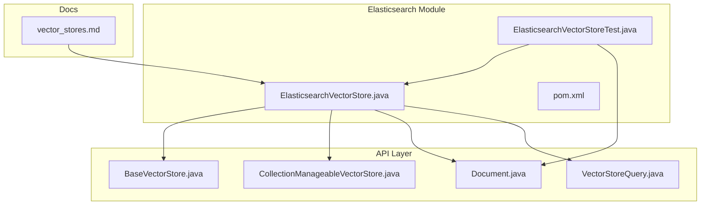
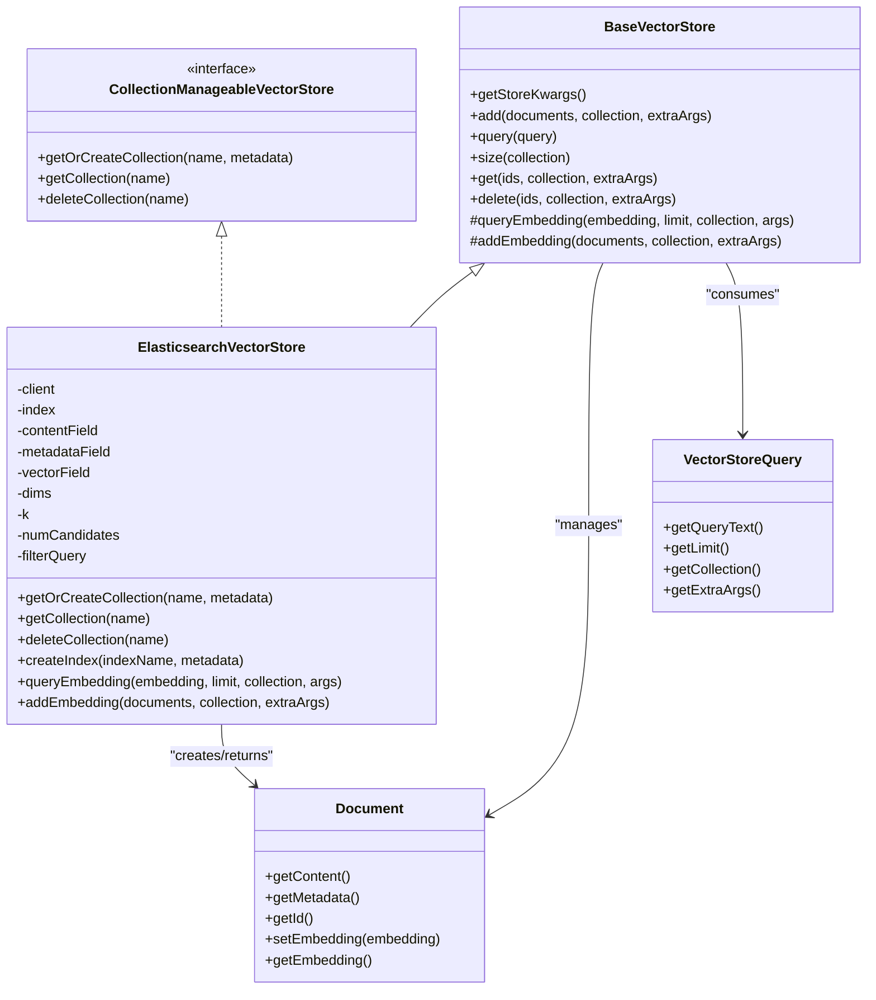
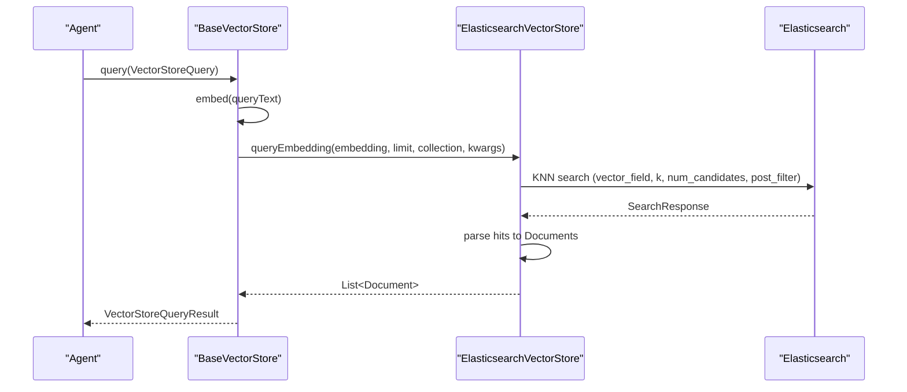

# Elasticsearch Integration

<cite>
**Referenced Files in This Document**
- [ElasticsearchVectorStore.java](file://integrations/vector-stores/elasticsearch/src/main/java/org/apache/flink/agents/integrations/vectorstores/elasticsearch/ElasticsearchVectorStore.java)
- [ElasticsearchVectorStoreTest.java](file://integrations/vector-stores/elasticsearch/src/test/java/org/apache/flink/agents/integrations/vectorstores/elasticsearch/ElasticsearchVectorStoreTest.java)
- [pom.xml](file://integrations/vector-stores/elasticsearch/pom.xml)
- [vector_stores.md](file://docs/content/docs/development/vector_stores.md)
- [BaseVectorStore.java](file://api/src/main/java/org/apache/flink/agents/api/vectorstores/BaseVectorStore.java)
- [CollectionManageableVectorStore.java](file://api/src/main/java/org/apache/flink/agents/api/vectorstores/CollectionManageableVectorStore.java)
- [Document.java](file://api/src/main/java/org/apache/flink/agents/api/vectorstores/Document.java)
- [VectorStoreQuery.java](file://api/src/main/java/org/apache/flink/agents/api/vectorstores/VectorStoreQuery.java)
</cite>

## Table of Contents
1. [Introduction](#introduction)
2. [Project Structure](#project-structure)
3. [Core Components](#core-components)
4. [Architecture Overview](#architecture-overview)
5. [Detailed Component Analysis](#detailed-component-analysis)
6. [Dependency Analysis](#dependency-analysis)
7. [Performance Considerations](#performance-considerations)
8. [Troubleshooting Guide](#troubleshooting-guide)
9. [Security and Production Considerations](#security-and-production-considerations)
10. [Conclusion](#conclusion)

## Introduction
This document explains the Elasticsearch vector store integration in Flink Agents. It focuses on the ElasticsearchVectorStore implementation, covering connection setup, authentication (API key and basic auth), configuration parameters, vector field mapping, index creation, collection management, KNN search, embedding storage, query optimization, document indexing strategies, metadata handling, content field management, deployment configurations, performance tuning, troubleshooting, security, backups, and monitoring.

## Project Structure
The Elasticsearch integration is implemented as a dedicated module that depends on the Flink Agents API. The module provides:
- A concrete vector store implementation backed by Elasticsearch
- Tests demonstrating collection and document lifecycle operations
- Documentation describing parameters, usage, and deployment modes

**Diagram sources**
- [ElasticsearchVectorStore.java](file://integrations/vector-stores/elasticsearch/src/main/java/org/apache/flink/agents/integrations/vectorstores/elasticsearch/ElasticsearchVectorStore.java#L118-L250)
- [BaseVectorStore.java](file://api/src/main/java/org/apache/flink/agents/api/vectorstores/BaseVectorStore.java#L38-L173)
- [CollectionManageableVectorStore.java](file://api/src/main/java/org/apache/flink/agents/api/vectorstores/CollectionManageableVectorStore.java#L22-L67)
- [Document.java](file://api/src/main/java/org/apache/flink/agents/api/vectorstores/Document.java#L34-L110)
- [VectorStoreQuery.java](file://api/src/main/java/org/apache/flink/agents/api/vectorstores/VectorStoreQuery.java#L33-L109)
- [ElasticsearchVectorStoreTest.java](file://integrations/vector-stores/elasticsearch/src/test/java/org/apache/flink/agents/integrations/vectorstores/elasticsearch/ElasticsearchVectorStoreTest.java#L50-L151)
- [pom.xml](file://integrations/vector-stores/elasticsearch/pom.xml#L34-L45)
- [vector_stores.md](file://docs/content/docs/development/vector_stores.md#L541-L603)

**Section sources**
- [ElasticsearchVectorStore.java](file://integrations/vector-stores/elasticsearch/src/main/java/org/apache/flink/agents/integrations/vectorstores/elasticsearch/ElasticsearchVectorStore.java#L118-L250)
- [pom.xml](file://integrations/vector-stores/elasticsearch/pom.xml#L34-L45)
- [vector_stores.md](file://docs/content/docs/development/vector_stores.md#L541-L603)

## Core Components
- ElasticsearchVectorStore: Implements BaseVectorStore and CollectionManageableVectorStore to provide:
  - Connection and authentication setup
  - Index creation with vector field mapping
  - Collection management (create/get/delete)
  - Document add/get/delete
  - KNN vector search with configurable k and num_candidates
  - Content and metadata field handling
- BaseVectorStore: Provides embedding integration and high-level query/add interfaces.
- CollectionManageableVectorStore: Defines collection-level operations contract.
- Document: Represents a retrievable unit with content, metadata, and optional embedding.
- VectorStoreQuery: Encapsulates query parameters for semantic search.

Key implementation references:
- Constructor and authentication: [ElasticsearchVectorStore.java](file://integrations/vector-stores/elasticsearch/src/main/java/org/apache/flink/agents/integrations/vectorstores/elasticsearch/ElasticsearchVectorStore.java#L169-L250)
- Collection management: [ElasticsearchVectorStore.java](file://integrations/vector-stores/elasticsearch/src/main/java/org/apache/flink/agents/integrations/vectorstores/elasticsearch/ElasticsearchVectorStore.java#L257-L448)
- Index creation and mappings: [ElasticsearchVectorStore.java](file://integrations/vector-stores/elasticsearch/src/main/java/org/apache/flink/agents/integrations/vectorstores/elasticsearch/ElasticsearchVectorStore.java#L284-L312)
- KNN search: [ElasticsearchVectorStore.java](file://integrations/vector-stores/elasticsearch/src/main/java/org/apache/flink/agents/integrations/vectorstores/elasticsearch/ElasticsearchVectorStore.java#L702-L741)
- Document add and parsing: [ElasticsearchVectorStore.java](file://integrations/vector-stores/elasticsearch/src/main/java/org/apache/flink/agents/integrations/vectorstores/elasticsearch/ElasticsearchVectorStore.java#L748-L816), [ElasticsearchVectorStore.java](file://integrations/vector-stores/elasticsearch/src/main/java/org/apache/flink/agents/integrations/vectorstores/elasticsearch/ElasticsearchVectorStore.java#L825-L862)
- BaseVectorStore query/add flow: [BaseVectorStore.java](file://api/src/main/java/org/apache/flink/agents/api/vectorstores/BaseVectorStore.java#L97-L112), [BaseVectorStore.java](file://api/src/main/java/org/apache/flink/agents/api/vectorstores/BaseVectorStore.java#L71-L88)

**Section sources**
- [ElasticsearchVectorStore.java](file://integrations/vector-stores/elasticsearch/src/main/java/org/apache/flink/agents/integrations/vectorstores/elasticsearch/ElasticsearchVectorStore.java#L169-L250)
- [ElasticsearchVectorStore.java](file://integrations/vector-stores/elasticsearch/src/main/java/org/apache/flink/agents/integrations/vectorstores/elasticsearch/ElasticsearchVectorStore.java#L257-L448)
- [ElasticsearchVectorStore.java](file://integrations/vector-stores/elasticsearch/src/main/java/org/apache/flink/agents/integrations/vectorstores/elasticsearch/ElasticsearchVectorStore.java#L284-L312)
- [ElasticsearchVectorStore.java](file://integrations/vector-stores/elasticsearch/src/main/java/org/apache/flink/agents/integrations/vectorstores/elasticsearch/ElasticsearchVectorStore.java#L702-L741)
- [ElasticsearchVectorStore.java](file://integrations/vector-stores/elasticsearch/src/main/java/org/apache/flink/agents/integrations/vectorstores/elasticsearch/ElasticsearchVectorStore.java#L748-L816)
- [ElasticsearchVectorStore.java](file://integrations/vector-stores/elasticsearch/src/main/java/org/apache/flink/agents/integrations/vectorstores/elasticsearch/ElasticsearchVectorStore.java#L825-L862)
- [BaseVectorStore.java](file://api/src/main/java/org/apache/flink/agents/api/vectorstores/BaseVectorStore.java#L97-L112)
- [BaseVectorStore.java](file://api/src/main/java/org/apache/flink/agents/api/vectorstores/BaseVectorStore.java#L71-L88)

## Architecture Overview
The Elasticsearch integration follows a layered design:
- API layer defines contracts for vector stores, collections, documents, and queries.
- ElasticsearchVectorStore implements the contracts, integrating with the Elasticsearch Java client.
- Tests exercise collection and document operations against a live cluster.

**Diagram sources**
- [BaseVectorStore.java](file://api/src/main/java/org/apache/flink/agents/api/vectorstores/BaseVectorStore.java#L38-L173)
- [CollectionManageableVectorStore.java](file://api/src/main/java/org/apache/flink/agents/api/vectorstores/CollectionManageableVectorStore.java#L22-L67)
- [ElasticsearchVectorStore.java](file://integrations/vector-stores/elasticsearch/src/main/java/org/apache/flink/agents/integrations/vectorstores/elasticsearch/ElasticsearchVectorStore.java#L118-L250)
- [Document.java](file://api/src/main/java/org/apache/flink/agents/api/vectorstores/Document.java#L34-L110)
- [VectorStoreQuery.java](file://api/src/main/java/org/apache/flink/agents/api/vectorstores/VectorStoreQuery.java#L33-L109)

## Detailed Component Analysis

### Connection Setup and Authentication
- Host resolution supports a single host or a comma-separated hosts list; defaults to localhost:9200.
- Authentication supports:
  - API key: either a base64-encoded token or an id/secret pair (converted to base64).
  - Basic auth: username/password.
- The Elasticsearch client is initialized with a Jackson JSONP mapper and a REST transport.

Implementation highlights:
- Host selection and builder setup: [ElasticsearchVectorStore.java](file://integrations/vector-stores/elasticsearch/src/main/java/org/apache/flink/agents/integrations/vectorstores/elasticsearch/ElasticsearchVectorStore.java#L201-L216)
- API key and basic auth configuration: [ElasticsearchVectorStore.java](file://integrations/vector-stores/elasticsearch/src/main/java/org/apache/flink/agents/integrations/vectorstores/elasticsearch/ElasticsearchVectorStore.java#L218-L243)

**Section sources**
- [ElasticsearchVectorStore.java](file://integrations/vector-stores/elasticsearch/src/main/java/org/apache/flink/agents/integrations/vectorstores/elasticsearch/ElasticsearchVectorStore.java#L201-L243)

### Configuration Parameters
Core parameters exposed by the Elasticsearch vector store:
- embedding_model: Reference to an embedding model resource.
- index: Target index name (required).
- vector_field: Dense vector field name (default "_vector").
- content_field: Field storing document content (default "_content").
- metadata_field: Field storing metadata (default "_metadata").
- dims: Vector dimensionality (default 768).
- k: Default number of nearest neighbors (optional).
- num_candidates: Default candidate set size for ANN (optional).
- filter_query: Raw JSON Elasticsearch filter query (DSL) applied as a post-filter (optional).
- host: Single endpoint URL (optional).
- hosts: Comma-separated endpoints (optional).
- username/password: Basic authentication (optional).
- api_key_base64: API key token (optional).
- api_key_id/api_key_secret: API key credentials (optional).
- store_in_content_field: Boolean controlling whether content is stored in a dedicated content field or serialized from the entire source (default true).

Defaults and validations:
- Defaults and constants: [ElasticsearchVectorStore.java](file://integrations/vector-stores/elasticsearch/src/main/java/org/apache/flink/agents/integrations/vectorstores/elasticsearch/ElasticsearchVectorStore.java#L121-L129)
- Parameter extraction and validation (k vs num_candidates): [ElasticsearchVectorStore.java](file://integrations/vector-stores/elasticsearch/src/main/java/org/apache/flink/agents/integrations/vectorstores/elasticsearch/ElasticsearchVectorStore.java#L176-L199)

**Section sources**
- [ElasticsearchVectorStore.java](file://integrations/vector-stores/elasticsearch/src/main/java/org/apache/flink/agents/integrations/vectorstores/elasticsearch/ElasticsearchVectorStore.java#L121-L199)

### Vector Field Mapping and Index Creation
- On collection creation, the implementation checks for index existence and creates it with:
  - A dense_vector field mapped to the configured vector_field with index=true and configured dims.
  - A text field mapped to content_field for full-text capabilities.
  - An object field mapped to metadata_field for structured metadata.
- A separate metadata index is maintained to store collection metadata keyed by index name.

Index creation flow:
- Existence check and creation: [ElasticsearchVectorStore.java](file://integrations/vector-stores/elasticsearch/src/main/java/org/apache/flink/agents/integrations/vectorstores/elasticsearch/ElasticsearchVectorStore.java#L260-L272)
- Mappings and dynamic settings: [ElasticsearchVectorStore.java](file://integrations/vector-stores/elasticsearch/src/main/java/org/apache/flink/agents/integrations/vectorstores/elasticsearch/ElasticsearchVectorStore.java#L284-L312)
- Metadata index creation and storage: [ElasticsearchVectorStore.java](file://integrations/vector-stores/elasticsearch/src/main/java/org/apache/flink/agents/integrations/vectorstores/elasticsearch/ElasticsearchVectorStore.java#L324-L365)

**Section sources**
- [ElasticsearchVectorStore.java](file://integrations/vector-stores/elasticsearch/src/main/java/org/apache/flink/agents/integrations/vectorstores/elasticsearch/ElasticsearchVectorStore.java#L260-L365)

### Collection Management Features
- getOrCreateCollection(name, metadata): Creates the index and stores metadata if not present; returns a Collection with name and metadata.
- getCollection(name): Retrieves metadata from the metadata index using the index name as the document ID.
- deleteCollection(name): Deletes both the index and its metadata document; returns the deleted collection.

Operational flow:
- Existence check and creation: [ElasticsearchVectorStore.java](file://integrations/vector-stores/elasticsearch/src/main/java/org/apache/flink/agents/integrations/vectorstores/elasticsearch/ElasticsearchVectorStore.java#L257-L275)
- Metadata retrieval: [ElasticsearchVectorStore.java](file://integrations/vector-stores/elasticsearch/src/main/java/org/apache/flink/agents/integrations/vectorstores/elasticsearch/ElasticsearchVectorStore.java#L377-L412)
- Deletion of index and metadata: [ElasticsearchVectorStore.java](file://integrations/vector-stores/elasticsearch/src/main/java/org/apache/flink/agents/integrations/vectorstores/elasticsearch/ElasticsearchVectorStore.java#L425-L448)

**Section sources**
- [ElasticsearchVectorStore.java](file://integrations/vector-stores/elasticsearch/src/main/java/org/apache/flink/agents/integrations/vectorstores/elasticsearch/ElasticsearchVectorStore.java#L257-L448)

### KNN Search Implementation
- queryEmbedding(embedding, limit, collection, args): Executes a KNN search against the configured vector_field.
- Parameters:
  - k: Number of nearest neighbors (fallback to limit if not provided).
  - num_candidates: Candidate set size for ANN (fallback if not provided).
  - filter_query: Optional JSON DSL post-filter.
- The implementation converts the float[] embedding to a List<Float> and builds a KNN search request.

KNN search flow:
- Parameter resolution and request building: [ElasticsearchVectorStore.java](file://integrations/vector-stores/elasticsearch/src/main/java/org/apache/flink/agents/integrations/vectorstores/elasticsearch/ElasticsearchVectorStore.java#L704-L741)
- Result parsing into Document list: [ElasticsearchVectorStore.java](file://integrations/vector-stores/elasticsearch/src/main/java/org/apache/flink/agents/integrations/vectorstores/elasticsearch/ElasticsearchVectorStore.java#L825-L836)

**Section sources**
- [ElasticsearchVectorStore.java](file://integrations/vector-stores/elasticsearch/src/main/java/org/apache/flink/agents/integrations/vectorstores/elasticsearch/ElasticsearchVectorStore.java#L704-L741)
- [ElasticsearchVectorStore.java](file://integrations/vector-stores/elasticsearch/src/main/java/org/apache/flink/agents/integrations/vectorstores/elasticsearch/ElasticsearchVectorStore.java#L825-L836)

### Embedding Storage and Query Optimization
- Embedding storage: When adding documents, the vector field is populated from the Document’s embedding if present.
- Query optimization levers:
  - k and num_candidates defaults are configurable at the store level and can be overridden per query.
  - filter_query allows applying a post-filter to narrow results.
  - size() and from() controls for paginated retrieval in getDocuments().

Storage and retrieval:
- Embedding population during add: [ElasticsearchVectorStore.java](file://integrations/vector-stores/elasticsearch/src/main/java/org/apache/flink/agents/integrations/vectorstores/elasticsearch/ElasticsearchVectorStore.java#L772-L780)
- KNN parameters and post-filter: [ElasticsearchVectorStore.java](file://integrations/vector-stores/elasticsearch/src/main/java/org/apache/flink/agents/integrations/vectorstores/elasticsearch/ElasticsearchVectorStore.java#L716-L728)
- Pagination and filtering in getDocuments(): [ElasticsearchVectorStore.java](file://integrations/vector-stores/elasticsearch/src/main/java/org/apache/flink/agents/integrations/vectorstores/elasticsearch/ElasticsearchVectorStore.java#L584-L615)

**Section sources**
- [ElasticsearchVectorStore.java](file://integrations/vector-stores/elasticsearch/src/main/java/org/apache/flink/agents/integrations/vectorstores/elasticsearch/ElasticsearchVectorStore.java#L716-L728)
- [ElasticsearchVectorStore.java](file://integrations/vector-stores/elasticsearch/src/main/java/org/apache/flink/agents/integrations/vectorstores/elasticsearch/ElasticsearchVectorStore.java#L584-L615)

### Document Indexing Strategies, Metadata Handling, and Content Field Management
- Content storage:
  - If store_in_content_field is true, content is stored in content_field; otherwise, content is serialized from the entire source map.
- Metadata:
  - Stored in metadata_field as an object; extracted and merged into Document metadata during retrieval.
- Multi-get and bulk operations:
  - getDocumentsByIds uses multi-get for targeted retrieval.
  - addEmbedding uses bulk index operations with refresh set to WaitFor.

Content and metadata handling:
- Content extraction and metadata merging: [ElasticsearchVectorStore.java](file://integrations/vector-stores/elasticsearch/src/main/java/org/apache/flink/agents/integrations/vectorstores/elasticsearch/ElasticsearchVectorStore.java#L838-L862)
- Multi-get retrieval: [ElasticsearchVectorStore.java](file://integrations/vector-stores/elasticsearch/src/main/java/org/apache/flink/agents/integrations/vectorstores/elasticsearch/ElasticsearchVectorStore.java#L554-L573)
- Bulk indexing and error handling: [ElasticsearchVectorStore.java](file://integrations/vector-stores/elasticsearch/src/main/java/org/apache/flink/agents/integrations/vectorstores/elasticsearch/ElasticsearchVectorStore.java#L796-L816)

**Section sources**
- [ElasticsearchVectorStore.java](file://integrations/vector-stores/elasticsearch/src/main/java/org/apache/flink/agents/integrations/vectorstores/elasticsearch/ElasticsearchVectorStore.java#L838-L862)
- [ElasticsearchVectorStore.java](file://integrations/vector-stores/elasticsearch/src/main/java/org/apache/flink/agents/integrations/vectorstores/elasticsearch/ElasticsearchVectorStore.java#L554-L573)
- [ElasticsearchVectorStore.java](file://integrations/vector-stores/elasticsearch/src/main/java/org/apache/flink/agents/integrations/vectorstores/elasticsearch/ElasticsearchVectorStore.java#L796-L816)

### API Usage and Query Flow
- BaseVectorStore orchestrates embedding generation and delegates to the concrete implementation.
- VectorStoreQuery encapsulates query text, limit, collection, and extra arguments.

Sequence of a typical query:

**Diagram sources**
- [BaseVectorStore.java](file://api/src/main/java/org/apache/flink/agents/api/vectorstores/BaseVectorStore.java#L97-L112)
- [ElasticsearchVectorStore.java](file://integrations/vector-stores/elasticsearch/src/main/java/org/apache/flink/agents/integrations/vectorstores/elasticsearch/ElasticsearchVectorStore.java#L704-L741)
- [VectorStoreQuery.java](file://api/src/main/java/org/apache/flink/agents/api/vectorstores/VectorStoreQuery.java#L33-L109)

**Section sources**
- [BaseVectorStore.java](file://api/src/main/java/org/apache/flink/agents/api/vectorstores/BaseVectorStore.java#L97-L112)
- [VectorStoreQuery.java](file://api/src/main/java/org/apache/flink/agents/api/vectorstores/VectorStoreQuery.java#L33-L109)

## Dependency Analysis
- ElasticsearchVectorStore depends on:
  - BaseVectorStore for embedding integration and high-level APIs.
  - Elasticsearch Java client for low-level operations.
- The module declares a dependency on the Elasticsearch Java client.

Dependency mapping:
- Elasticsearch client dependency: [pom.xml](file://integrations/vector-stores/elasticsearch/pom.xml#L40-L44)
- Runtime dependency injection and resource resolution: [ElasticsearchVectorStore.java](file://integrations/vector-stores/elasticsearch/src/main/java/org/apache/flink/agents/integrations/vectorstores/elasticsearch/ElasticsearchVectorStore.java#L169-L171)

**Section sources**
- [pom.xml](file://integrations/vector-stores/elasticsearch/pom.xml#L40-L44)
- [ElasticsearchVectorStore.java](file://integrations/vector-stores/elasticsearch/src/main/java/org/apache/flink/agents/integrations/vectorstores/elasticsearch/ElasticsearchVectorStore.java#L169-L171)

## Performance Considerations
- KNN parameters:
  - Increase num_candidates for higher recall at the cost of latency.
  - Tune k to balance relevance and result size.
- Filter queries:
  - Apply lightweight post-filters to reduce the candidate set before scoring.
- Bulk operations:
  - Use bulk indexing for batch ingestion to improve throughput.
- Content storage:
  - Storing content in a dedicated field can reduce parsing overhead compared to serializing the entire source map.

[No sources needed since this section provides general guidance]

## Troubleshooting Guide
Common issues and remedies:
- Authentication failures:
  - Verify API key format and credentials; ensure either api_key_base64 or api_key_id/api_key_secret is provided.
  - Confirm basic auth username/password correctness.
- Index mapping mismatches:
  - Ensure the index has a dense_vector field named as configured by vector_field and dims match the embedding dimension.
- Missing collection metadata:
  - For indices not created by the integration, metadata retrieval is not supported; collection-level operations require indices created by the integration.
- Bulk indexing errors:
  - Inspect error reasons from bulk responses and retry failed items.

References:
- Authentication configuration: [ElasticsearchVectorStore.java](file://integrations/vector-stores/elasticsearch/src/main/java/org/apache/flink/agents/integrations/vectorstores/elasticsearch/ElasticsearchVectorStore.java#L218-L243)
- Collection metadata constraints: [vector_stores.md](file://docs/content/docs/development/vector_stores.md#L572-L576)
- Bulk error handling: [ElasticsearchVectorStore.java](file://integrations/vector-stores/elasticsearch/src/main/java/org/apache/flink/agents/integrations/vectorstores/elasticsearch/ElasticsearchVectorStore.java#L801-L813)

**Section sources**
- [ElasticsearchVectorStore.java](file://integrations/vector-stores/elasticsearch/src/main/java/org/apache/flink/agents/integrations/vectorstores/elasticsearch/ElasticsearchVectorStore.java#L218-L243)
- [vector_stores.md](file://docs/content/docs/development/vector_stores.md#L572-L576)
- [ElasticsearchVectorStore.java](file://integrations/vector-stores/elasticsearch/src/main/java/org/apache/flink/agents/integrations/vectorstores/elasticsearch/ElasticsearchVectorStore.java#L801-L813)

## Security and Production Considerations
- Authentication:
  - Prefer API key authentication for enhanced security and revocation flexibility.
  - Ensure TLS is enabled in production clusters and restrict network access to Elasticsearch nodes.
- Index lifecycle:
  - Use collection-level operations to manage indices and metadata consistently.
  - For existing indices not managed by the integration, avoid relying on collection metadata features.
- Backups:
  - Use Elasticsearch snapshot and restore mechanisms for production-grade durability.
- Monitoring:
  - Track cluster health, shard allocation, indexing and search latency, and resource utilization.
  - Monitor vector field growth and storage capacity.

[No sources needed since this section provides general guidance]

## Conclusion
The Elasticsearch vector store integration provides a robust, configurable implementation for semantic search in Flink Agents. It supports secure connections, flexible index mapping, collection management, and optimized KNN retrieval. By tuning KNN parameters, leveraging filter queries, and adopting bulk operations, teams can achieve scalable and performant RAG pipelines on top of Elasticsearch.