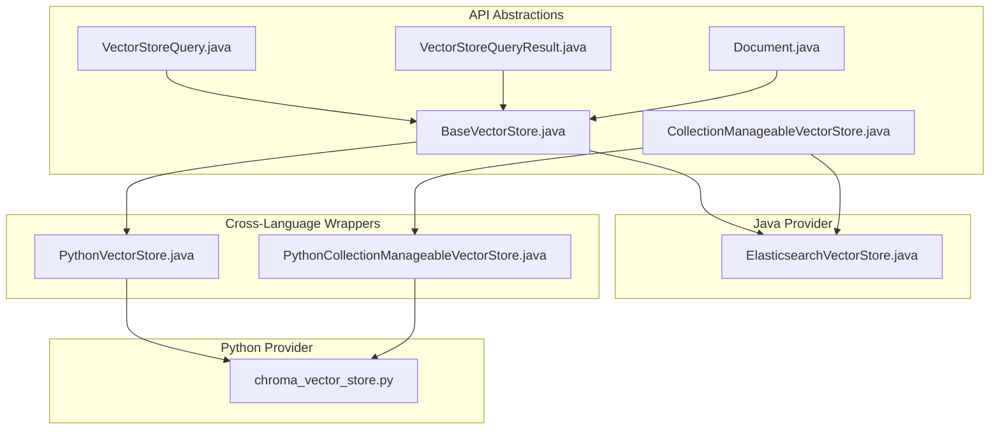
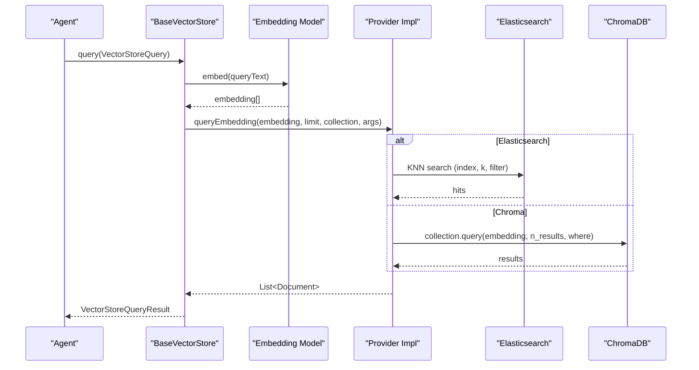
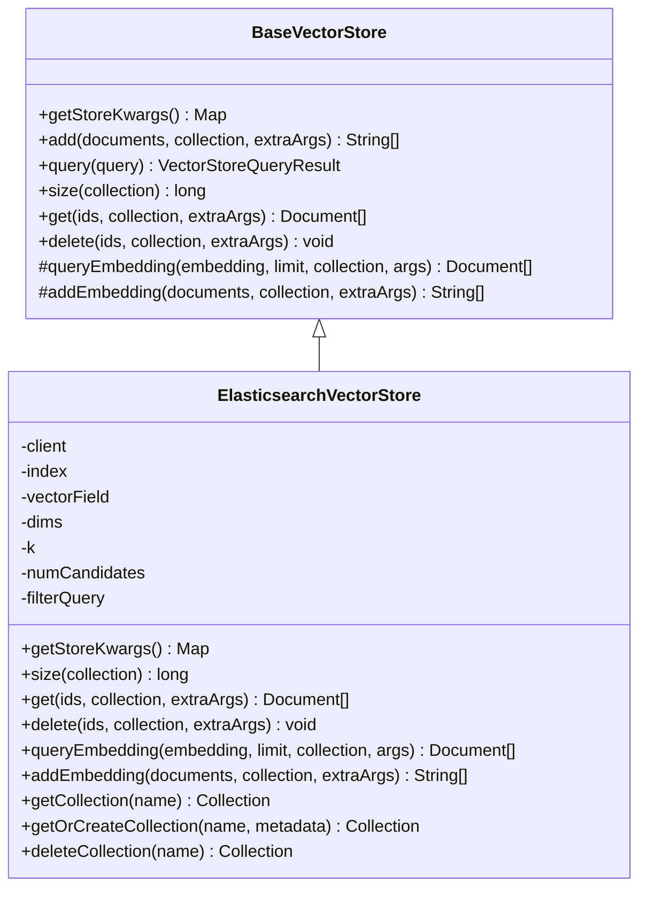
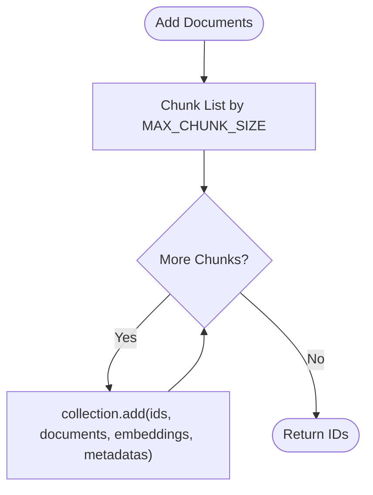
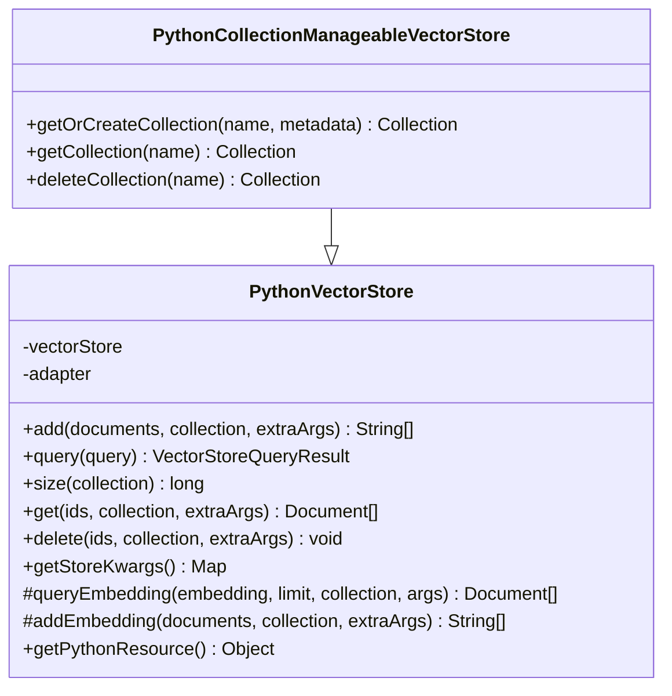
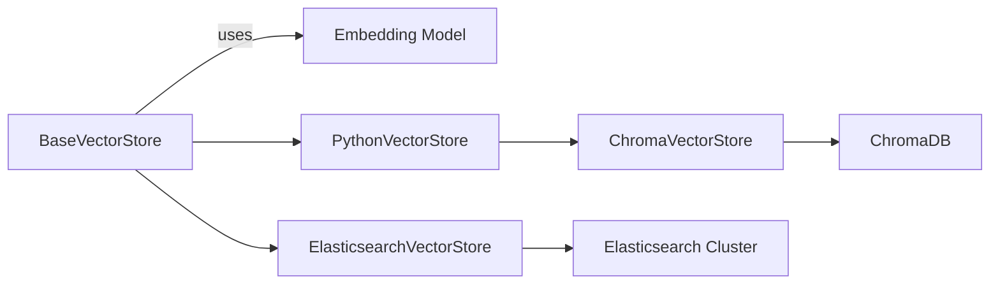

# Vector Store Integrations

<cite>
**Referenced Files in This Document**
- [BaseVectorStore.java](file://api/src/main/java/org/apache/flink/agents/api/vectorstores/BaseVectorStore.java)
- [CollectionManageableVectorStore.java](file://api/src/main/java/org/apache/flink/agents/api/vectorstores/CollectionManageableVectorStore.java)
- [Document.java](file://api/src/main/java/org/apache/flink/agents/api/vectorstores/Document.java)
- [VectorStoreQuery.java](file://api/src/main/java/org/apache/flink/agents/api/vectorstores/VectorStoreQuery.java)
- [VectorStoreQueryMode.java](file://api/src/main/java/org/apache/flink/agents/api/vectorstores/VectorStoreQueryMode.java)
- [VectorStoreQueryResult.java](file://api/src/main/java/org/apache/flink/agents/api/vectorstores/VectorStoreQueryResult.java)
- [ElasticsearchVectorStore.java](file://integrations/vector-stores/elasticsearch/src/main/java/org/apache/flink/agents/integrations/vectorstores/elasticsearch/ElasticsearchVectorStore.java)
- [chroma_vector_store.py](file://python/flink_agents/integrations/vector_stores/chroma/chroma_vector_store.py)
- [PythonVectorStore.java](file://api/src/main/java/org/apache/flink/agents/api/vectorstores/python/PythonVectorStore.java)
- [PythonCollectionManageableVectorStore.java](file://api/src/main/java/org/apache/flink/agents/api/vectorstores/python/PythonCollectionManageableVectorStore.java)
- [vector_stores.md](file://docs/content/docs/development/vector_stores.md)
- [VectorStoreIntegrationTest.java](file://e2e-test/flink-agents-end-to-end-tests-integration/src/test/java/org/apache/flink/agents/integration/test/VectorStoreIntegrationTest.java)
- [VectorStoreIntegrationAgent.java](file://e2e-test/flink-agents-end-to-end-tests-integration/src/test/java/org/apache/flink/agents/integration/test/VectorStoreIntegrationAgent.java)
- [test_chroma_vector_store.py](file://python/flink_agents/integrations/vector_stores/chroma/tests/test_chroma_vector_store.py)
</cite>

## Table of Contents
1. [Introduction](#introduction)
2. [Project Structure](#project-structure)
3. [Core Components](#core-components)
4. [Architecture Overview](#architecture-overview)
5. [Detailed Component Analysis](#detailed-component-analysis)
6. [Dependency Analysis](#dependency-analysis)
7. [Performance Considerations](#performance-considerations)
8. [Troubleshooting Guide](#troubleshooting-guide)
9. [Conclusion](#conclusion)
10. [Appendices](#appendices)

## Introduction
This document explains vector store integrations in Flink Agents, focusing on Elasticsearch and ChromaDB for semantic memory and context retrieval. It covers setup and configuration, connection parameters, indexing strategies, query optimization, the BaseVectorStore interface and implementation patterns for custom integrations, configuration examples for document embedding, similarity search, and metadata filtering, plus performance tuning, troubleshooting, security, backup, and monitoring guidance for production deployments.

## Project Structure
Flink Agents provides a unified vector store abstraction with two built-in providers:
- Java: ElasticsearchVectorStore backed by Elasticsearch KNN vector fields
- Python: ChromaVectorStore backed by ChromaDB collections

Cross-language wrappers enable using Java vector stores from Python and vice versa.

**Diagram sources**
- [BaseVectorStore.java](file://api/src/main/java/org/apache/flink/agents/api/vectorstores/BaseVectorStore.java#L38-L173)
- [CollectionManageableVectorStore.java](file://api/src/main/java/org/apache/flink/agents/api/vectorstores/CollectionManageableVectorStore.java#L23-L67)
- [Document.java](file://api/src/main/java/org/apache/flink/agents/api/vectorstores/Document.java#L34-L110)
- [VectorStoreQuery.java](file://api/src/main/java/org/apache/flink/agents/api/vectorstores/VectorStoreQuery.java#L33-L109)
- [VectorStoreQueryResult.java](file://api/src/main/java/org/apache/flink/agents/api/vectorstores/VectorStoreQueryResult.java#L29-L46)
- [ElasticsearchVectorStore.java](file://integrations/vector-stores/elasticsearch/src/main/java/org/apache/flink/agents/integrations/vectorstores/elasticsearch/ElasticsearchVectorStore.java#L118-L800)
- [chroma_vector_store.py](file://python/flink_agents/integrations/vector_stores/chroma/chroma_vector_store.py#L58-L406)
- [PythonVectorStore.java](file://api/src/main/java/org/apache/flink/agents/api/vectorstores/python/PythonVectorStore.java#L49-L156)
- [PythonCollectionManageableVectorStore.java](file://api/src/main/java/org/apache/flink/agents/api/vectorstores/python/PythonCollectionManageableVectorStore.java#L42-L85)

**Section sources**
- [vector_stores.md](file://docs/content/docs/development/vector_stores.md#L403-L728)

## Core Components
- BaseVectorStore: Abstract base class that integrates embedding models and exposes add/query/get/delete operations. It converts text to embeddings automatically when needed and delegates store-specific logic to subclasses.
- CollectionManageableVectorStore: Interface for providers that support collection lifecycle operations (get/create/delete).
- Document: Encapsulates content, metadata, and optional embedding for retrieval and storage.
- VectorStoreQuery: Structured query object with mode, text, limit, collection, and extra arguments.
- VectorStoreQueryResult: Container for retrieved documents ordered by relevance.

Key responsibilities:
- Embedding integration: BaseVectorStore resolves an embedding model resource and embeds text when documents lack embeddings.
- Query orchestration: BaseVectorStore merges store-level and query-level arguments before invoking provider-specific search.
- Cross-language bridging: PythonVectorStore and PythonCollectionManageableVectorStore adapt Python implementations to Java interfaces.

**Section sources**
- [BaseVectorStore.java](file://api/src/main/java/org/apache/flink/agents/api/vectorstores/BaseVectorStore.java#L38-L173)
- [CollectionManageableVectorStore.java](file://api/src/main/java/org/apache/flink/agents/api/vectorstores/CollectionManageableVectorStore.java#L23-L67)
- [Document.java](file://api/src/main/java/org/apache/flink/agents/api/vectorstores/Document.java#L34-L110)
- [VectorStoreQuery.java](file://api/src/main/java/org/apache/flink/agents/api/vectorstores/VectorStoreQuery.java#L33-L109)
- [VectorStoreQueryResult.java](file://api/src/main/java/org/apache/flink/agents/api/vectorstores/VectorStoreQueryResult.java#L29-L46)

## Architecture Overview
The vector store architecture separates concerns between:
- Abstraction layer (BaseVectorStore, interfaces)
- Provider implementations (Elasticsearch, Chroma)
- Cross-language adapters (PythonVectorStore, PythonCollectionManageableVectorStore)
- Query and document models

**Diagram sources**
- [BaseVectorStore.java](file://api/src/main/java/org/apache/flink/agents/api/vectorstores/BaseVectorStore.java#L97-L112)
- [ElasticsearchVectorStore.java](file://integrations/vector-stores/elasticsearch/src/main/java/org/apache/flink/agents/integrations/vectorstores/elasticsearch/ElasticsearchVectorStore.java#L702-L741)
- [chroma_vector_store.py](file://python/flink_agents/integrations/vector_stores/chroma/chroma_vector_store.py#L339-L405)

## Detailed Component Analysis

### Elasticsearch Vector Store
ElasticsearchVectorStore implements BaseVectorStore and CollectionManageableVectorStore. It:
- Uses Elasticsearch’s KNN search on dense vector fields
- Supports authentication via API key or basic auth
- Manages collections by creating indices and storing collection metadata in a dedicated index
- Provides batch indexing via bulk operations and supports filtering via JSON DSL

Key configuration parameters:
- index: target index name
- vector_field: dense vector field name
- dims: vector dimensionality
- k, num_candidates: ANN search parameters
- filter_query: JSON DSL post-filter
- host or hosts: endpoints
- username/password or api_key_*: authentication

Indexing and retrieval strategies:
- addEmbedding: bulk index with optional generated IDs
- queryEmbedding: KNN search with configurable k and num_candidates
- get/delete: multi-get by IDs or delete-by-query with optional filters
- Collection management: create index and metadata index; store/retrieve collection metadata

**Diagram sources**
- [BaseVectorStore.java](file://api/src/main/java/org/apache/flink/agents/api/vectorstores/BaseVectorStore.java#L38-L173)
- [ElasticsearchVectorStore.java](file://integrations/vector-stores/elasticsearch/src/main/java/org/apache/flink/agents/integrations/vectorstores/elasticsearch/ElasticsearchVectorStore.java#L118-L800)

**Section sources**
- [ElasticsearchVectorStore.java](file://integrations/vector-stores/elasticsearch/src/main/java/org/apache/flink/agents/integrations/vectorstores/elasticsearch/ElasticsearchVectorStore.java#L118-L800)
- [vector_stores.md](file://docs/content/docs/development/vector_stores.md#L541-L603)

### ChromaDB Vector Store (Python)
ChromaVectorStore implements CollectionManageableVectorStore and supports multiple client modes:
- In-memory
- Persistent
- Client-server
- Cloud

It:
- Supports collection lifecycle operations
- Adds documents in chunks with configurable chunk size
- Performs vector similarity search with metadata filtering
- Handles collection metadata and optional automatic creation

**Diagram sources**
- [chroma_vector_store.py](file://python/flink_agents/integrations/vector_stores/chroma/chroma_vector_store.py#L39-L56)
- [chroma_vector_store.py](file://python/flink_agents/integrations/vector_stores/chroma/chroma_vector_store.py#L298-L337)

**Section sources**
- [chroma_vector_store.py](file://python/flink_agents/integrations/vector_stores/chroma/chroma_vector_store.py#L58-L406)
- [vector_stores.md](file://docs/content/docs/development/vector_stores.md#L405-L540)

### Cross-Language Integration
PythonVectorStore and PythonCollectionManageableVectorStore wrap Python implementations and expose Java-compatible interfaces. They translate between Java and Python representations for documents, queries, and results.

**Diagram sources**
- [PythonVectorStore.java](file://api/src/main/java/org/apache/flink/agents/api/vectorstores/python/PythonVectorStore.java#L49-L156)
- [PythonCollectionManageableVectorStore.java](file://api/src/main/java/org/apache/flink/agents/api/vectorstores/python/PythonCollectionManageableVectorStore.java#L42-L85)

**Section sources**
- [PythonVectorStore.java](file://api/src/main/java/org/apache/flink/agents/api/vectorstores/python/PythonVectorStore.java#L49-L156)
- [PythonCollectionManageableVectorStore.java](file://api/src/main/java/org/apache/flink/agents/api/vectorstores/python/PythonCollectionManageableVectorStore.java#L42-L85)
- [vector_stores.md](file://docs/content/docs/development/vector_stores.md#L605-L728)

## Dependency Analysis
- BaseVectorStore depends on an embedding model resource resolved via a resource function and delegates to provider-specific implementations.
- ElasticsearchVectorStore depends on the Elasticsearch client and uses JSON DSL for filters and KNN search.
- ChromaVectorStore depends on the Chroma client and supports multiple connection modes.
- Cross-language wrappers depend on Python resource adapters for serialization/deserialization.

**Diagram sources**
- [BaseVectorStore.java](file://api/src/main/java/org/apache/flink/agents/api/vectorstores/BaseVectorStore.java#L74-L100)
- [ElasticsearchVectorStore.java](file://integrations/vector-stores/elasticsearch/src/main/java/org/apache/flink/agents/integrations/vectorstores/elasticsearch/ElasticsearchVectorStore.java#L169-L249)
- [chroma_vector_store.py](file://python/flink_agents/integrations/vector_stores/chroma/chroma_vector_store.py#L174-L210)
- [PythonVectorStore.java](file://api/src/main/java/org/apache/flink/agents/api/vectorstores/python/PythonVectorStore.java#L62-L70)

**Section sources**
- [BaseVectorStore.java](file://api/src/main/java/org/apache/flink/agents/api/vectorstores/BaseVectorStore.java#L43-L47)
- [ElasticsearchVectorStore.java](file://integrations/vector-stores/elasticsearch/src/main/java/org/apache/flink/agents/integrations/vectorstores/elasticsearch/ElasticsearchVectorStore.java#L169-L249)
- [chroma_vector_store.py](file://python/flink_agents/integrations/vector_stores/chroma/chroma_vector_store.py#L174-L210)
- [PythonVectorStore.java](file://api/src/main/java/org/apache/flink/agents/api/vectorstores/python/PythonVectorStore.java#L62-L70)

## Performance Considerations
- Elasticsearch
  - Tune k and num_candidates for recall/latency trade-offs; ensure k <= num_candidates.
  - Use filter_query (JSON DSL) to narrow candidate sets before KNN.
  - Batch indexing with bulk operations; refresh strategy impacts durability vs throughput.
  - Limit result windows and pagination offsets carefully due to internal limits.
- ChromaDB
  - Use chunked adds to avoid payload limits; adjust chunk size based on provider constraints.
  - Leverage metadata filters (where) to reduce result sets.
  - Prefer collection-level operations when available; manage collection sizes proactively.
- General
  - Precompute embeddings when documents are static to avoid repeated embedding calls.
  - Cache frequently accessed metadata and reuse query arguments.
  - Monitor embedding model latency and throughput; consider batching at the embedding layer.

[No sources needed since this section provides general guidance]

## Troubleshooting Guide
Common issues and resolutions:
- Connection failures
  - Verify host/hosts and credentials; ensure network connectivity to the cluster.
  - For Elasticsearch, confirm API key or basic auth configuration matches cluster settings.
- Authentication errors
  - Use API key (preferred) or basic auth consistently; ensure proper encoding for API key.
- Query performance
  - Adjust k and num_candidates; add filter_query to reduce candidate sets.
  - Validate vector field name and dimension match the embedding model output.
- Index/collection not found
  - Ensure the index exists or allow automatic creation; for Elasticsearch, confirm collection metadata index exists.
  - For Chroma, verify collection name and creation flags.
- Batch operations
  - For Elasticsearch, inspect bulk response errors and handle partial failures.
  - For Chroma, ensure chunk boundaries and metadata are valid.

**Section sources**
- [ElasticsearchVectorStore.java](file://integrations/vector-stores/elasticsearch/src/main/java/org/apache/flink/agents/integrations/vectorstores/elasticsearch/ElasticsearchVectorStore.java#L218-L243)
- [ElasticsearchVectorStore.java](file://integrations/vector-stores/elasticsearch/src/main/java/org/apache/flink/agents/integrations/vectorstores/elasticsearch/ElasticsearchVectorStore.java#L624-L648)
- [chroma_vector_store.py](file://python/flink_agents/integrations/vector_stores/chroma/chroma_vector_store.py#L314-L337)

## Conclusion
Flink Agents offers a flexible, extensible vector store abstraction with robust Java and Python implementations. Elasticsearch enables scalable KNN search with rich filtering, while ChromaDB provides a versatile, easy-to-deploy option supporting multiple connection modes. Cross-language wrappers facilitate mixed-language deployments. Proper configuration of embedding models, indexing strategies, and query parameters, combined with performance tuning and operational safeguards, ensures reliable semantic search and retrieval for agents.

[No sources needed since this section summarizes without analyzing specific files]

## Appendices

### Setup and Configuration Examples
- Elasticsearch (Java)
  - Configure embedding model reference, index, vector field, dims, optional k/num_candidates/filter_query, and endpoints/authentication.
- ChromaDB (Python)
  - Choose client mode (in-memory, persistent, server, cloud) and configure collection settings; use collection metadata and automatic creation flags.

**Section sources**
- [vector_stores.md](file://docs/content/docs/development/vector_stores.md#L541-L603)
- [vector_stores.md](file://docs/content/docs/development/vector_stores.md#L405-L540)

### Query and Filtering Patterns
- Semantic search: Provide query text and limit; the system embeds text and runs similarity search.
- Metadata filtering: Use provider-specific filters (JSON DSL for Elasticsearch; where clauses for Chroma).
- Collection-level operations: Create/get/delete collections when supported by the provider.

**Section sources**
- [VectorStoreQuery.java](file://api/src/main/java/org/apache/flink/agents/api/vectorstores/VectorStoreQuery.java#L33-L109)
- [ElasticsearchVectorStore.java](file://integrations/vector-stores/elasticsearch/src/main/java/org/apache/flink/agents/integrations/vectorstores/elasticsearch/ElasticsearchVectorStore.java#L584-L615)
- [chroma_vector_store.py](file://python/flink_agents/integrations/vector_stores/chroma/chroma_vector_store.py#L246-L273)

### End-to-End Validation
- Java integration tests validate Elasticsearch backend using environment variables for host, index, vector field, and optional dims.
- Python tests validate ChromaDB operations including collection management and document retrieval.

**Section sources**
- [VectorStoreIntegrationTest.java](file://e2e-test/flink-agents-end-to-end-tests-integration/src/test/java/org/apache/flink/agents/integration/test/VectorStoreIntegrationTest.java#L48-L121)
- [VectorStoreIntegrationAgent.java](file://e2e-test/flink-agents-end-to-end-tests-integration/src/test/java/org/apache/flink/agents/integration/test/VectorStoreIntegrationAgent.java#L69-L93)
- [test_chroma_vector_store.py](file://python/flink_agents/integrations/vector_stores/chroma/tests/test_chroma_vector_store.py#L84-L231)