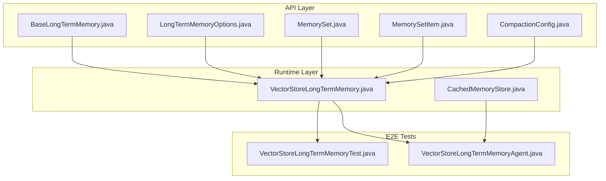
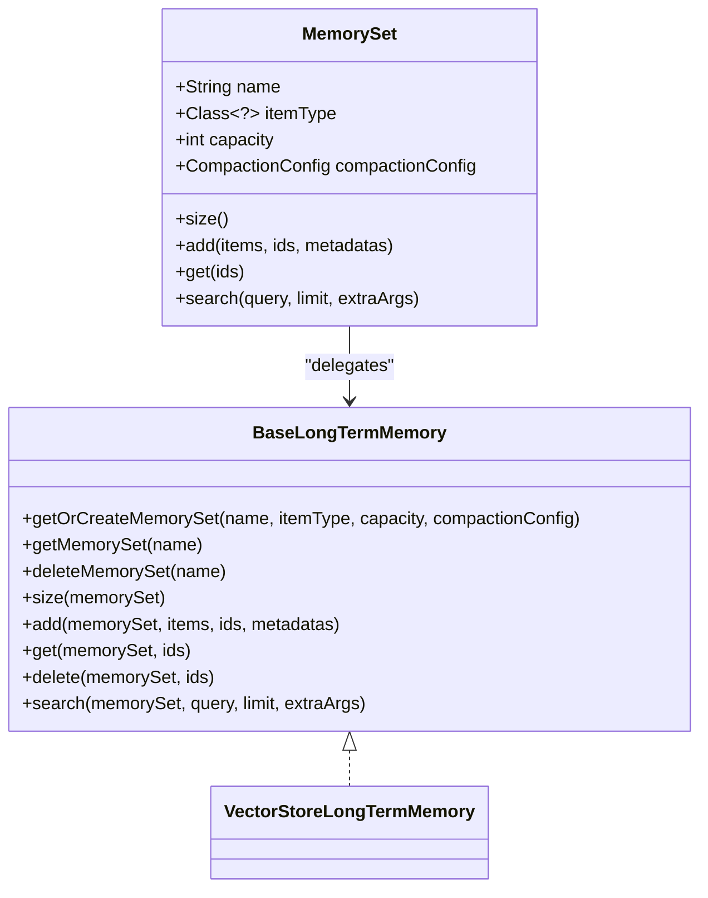
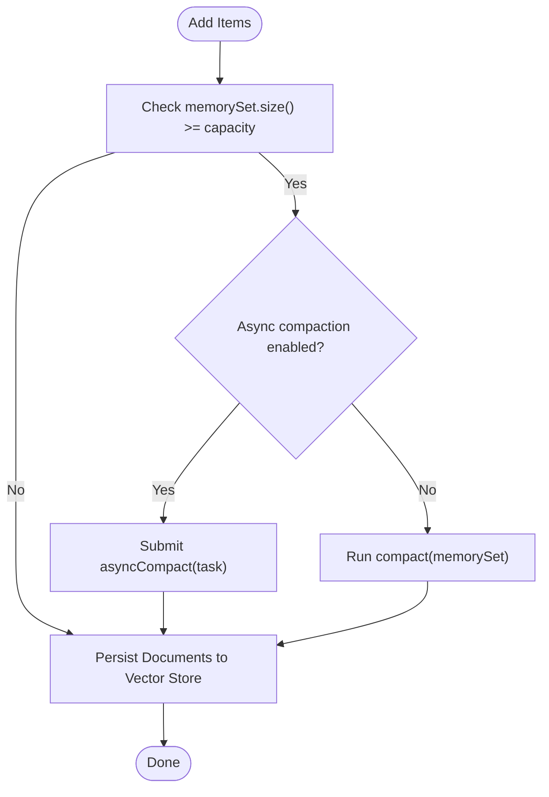
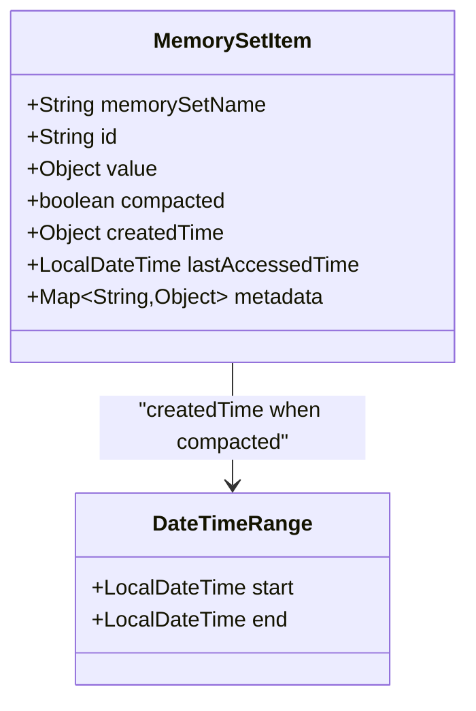
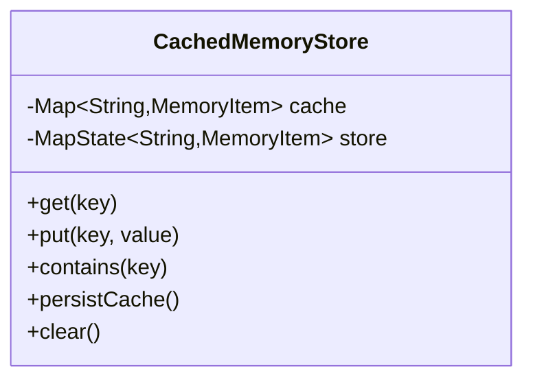
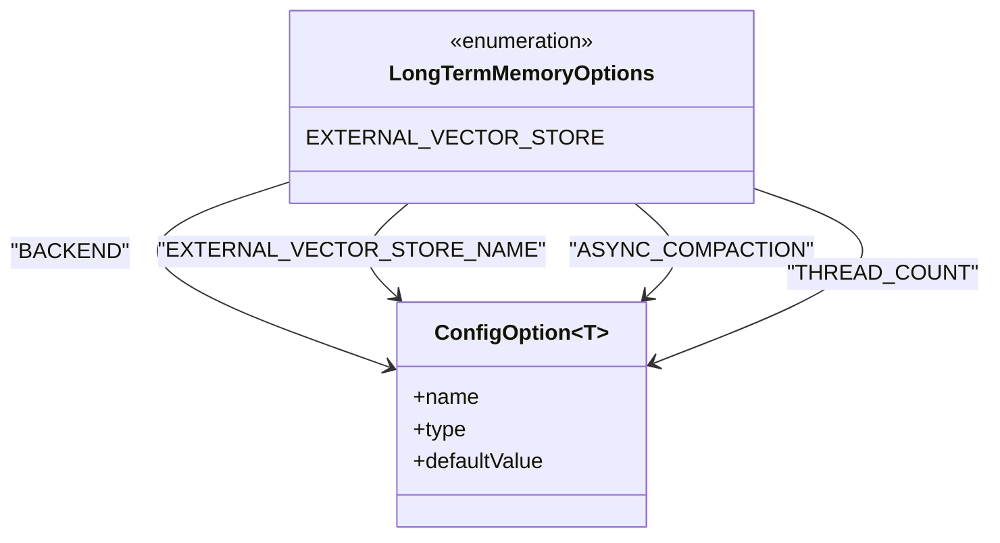
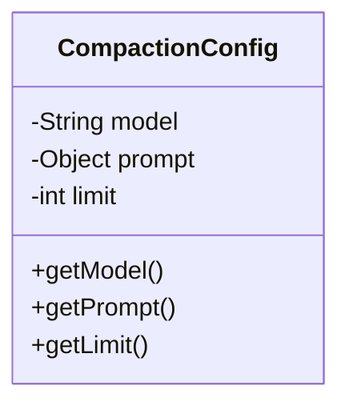
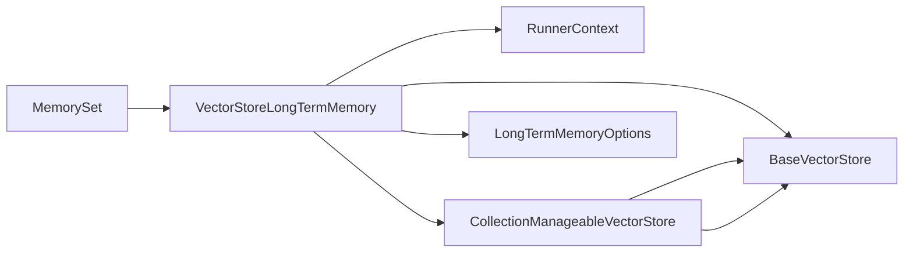

# Long-term Memory with Vector Stores

<cite>
**Referenced Files in This Document**
- [BaseLongTermMemory.java](file://api/src/main/java/org/apache/flink/agents/api/memory/BaseLongTermMemory.java)
- [VectorStoreLongTermMemory.java](file://runtime/src/main/java/org/apache/flink/agents/runtime/memory/VectorStoreLongTermMemory.java)
- [CachedMemoryStore.java](file://runtime/src/main/java/org/apache/flink/agents/runtime/memory/CachedMemoryStore.java)
- [LongTermMemoryOptions.java](file://api/src/main/java/org/apache/flink/agents/api/memory/LongTermMemoryOptions.java)
- [CompactionConfig.java](file://api/src/main/java/org/apache/flink/agents/api/memory/compaction/CompactionConfig.java)
- [MemorySet.java](file://api/src/main/java/org/apache/flink/agents/api/memory/MemorySet.java)
- [MemorySetItem.java](file://api/src/main/java/org/apache/flink/agents/api/memory/MemorySetItem.java)
- [VectorStoreLongTermMemoryTest.java](file://e2e-test/flink-agents-end-to-end-tests-integration/src/test/java/org/apache/flink/agents/integration/test/VectorStoreLongTermMemoryTest.java)
- [VectorStoreLongTermMemoryAgent.java](file://e2e-test/flink-agents-end-to-end-tests-integration/src/test/java/org/apache/flink/agents/integration/test/VectorStoreLongTermMemoryAgent.java)
</cite>

## Table of Contents
1. [Introduction](#introduction)
2. [Project Structure](#project-structure)
3. [Core Components](#core-components)
4. [Architecture Overview](#architecture-overview)
5. [Detailed Component Analysis](#detailed-component-analysis)
6. [Dependency Analysis](#dependency-analysis)
7. [Performance Considerations](#performance-considerations)
8. [Troubleshooting Guide](#troubleshooting-guide)
9. [Conclusion](#conclusion)
10. [Appendices](#appendices)

## Introduction
This document explains long-term memory with vector store integration in Flink Agents. It focuses on the BaseLongTermMemory abstraction and the VectorStoreLongTermMemory implementation that powers semantic memory storage backed by external vector databases. It also covers memory compaction, caching strategies via CachedMemoryStore, memory store abstractions, and LongTermMemoryOptions for configuration. Practical examples demonstrate setting up vector store-backed memory, configuring embedding models, and implementing semantic retrieval. Guidance is included for compaction functions, garbage collection strategies, and performance optimization for large-scale semantic memory, along with integration patterns and troubleshooting tips.

## Project Structure
The long-term memory subsystem spans API abstractions and runtime implementations:
- API layer defines memory interfaces, configuration, and data models
- Runtime layer implements vector store-backed memory and caching
- End-to-end tests demonstrate integration with external vector stores and embedding models



**Diagram sources**
- [BaseLongTermMemory.java](file://api/src/main/java/org/apache/flink/agents/api/memory/BaseLongTermMemory.java#L33-L134)
- [LongTermMemoryOptions.java](file://api/src/main/java/org/apache/flink/agents/api/memory/LongTermMemoryOptions.java#L22-L52)
- [MemorySet.java](file://api/src/main/java/org/apache/flink/agents/api/memory/MemorySet.java#L32-L160)
- [MemorySetItem.java](file://api/src/main/java/org/apache/flink/agents/api/memory/MemorySetItem.java#L23-L95)
- [CompactionConfig.java](file://api/src/main/java/org/apache/flink/agents/api/memory/compaction/CompactionConfig.java#L28-L93)
- [VectorStoreLongTermMemory.java](file://runtime/src/main/java/org/apache/flink/agents/runtime/memory/VectorStoreLongTermMemory.java#L57-L315)
- [CachedMemoryStore.java](file://runtime/src/main/java/org/apache/flink/agents/runtime/memory/CachedMemoryStore.java#L25-L66)
- [VectorStoreLongTermMemoryTest.java](file://e2e-test/flink-agents-end-to-end-tests-integration/src/test/java/org/apache/flink/agents/integration/test/VectorStoreLongTermMemoryTest.java#L178-L331)
- [VectorStoreLongTermMemoryAgent.java](file://e2e-test/flink-agents-end-to-end-tests-integration/src/test/java/org/apache/flink/agents/integration/test/VectorStoreLongTermMemoryAgent.java#L148-L183)

**Section sources**
- [BaseLongTermMemory.java](file://api/src/main/java/org/apache/flink/agents/api/memory/BaseLongTermMemory.java#L27-L134)
- [VectorStoreLongTermMemory.java](file://runtime/src/main/java/org/apache/flink/agents/runtime/memory/VectorStoreLongTermMemory.java#L57-L315)
- [LongTermMemoryOptions.java](file://api/src/main/java/org/apache/flink/agents/api/memory/LongTermMemoryOptions.java#L22-L52)

## Core Components
- BaseLongTermMemory: Defines the contract for memory sets, including creation, retrieval, deletion, size, adding items, retrieving items, deleting items, and semantic search.
- VectorStoreLongTermMemory: Implements BaseLongTermMemory using an external vector store. It manages memory sets as collections, persists metadata, handles compaction, and supports synchronous/asynchronous compaction.
- MemorySet: Encapsulates a named set of typed memory items with capacity and compaction configuration. It delegates operations to the underlying BaseLongTermMemory.
- MemorySetItem: Represents a single memory item with identity, value, compaction state, timestamps, and metadata.
- CompactionConfig: Holds compaction settings including the model identifier and limit.
- CachedMemoryStore: Provides a caching layer over a persistent store for short-term memory items.
- LongTermMemoryOptions: Centralizes configuration for backend selection, external vector store name, asynchronous compaction, and compaction thread pool size.

Key responsibilities:
- Memory lifecycle management (create/get/delete memory sets)
- Item persistence and retrieval with metadata
- Semantic search leveraging vector embeddings
- Automatic compaction when capacity thresholds are reached
- Context-aware collection naming for job and key scoping

**Section sources**
- [BaseLongTermMemory.java](file://api/src/main/java/org/apache/flink/agents/api/memory/BaseLongTermMemory.java#L33-L134)
- [VectorStoreLongTermMemory.java](file://runtime/src/main/java/org/apache/flink/agents/runtime/memory/VectorStoreLongTermMemory.java#L57-L315)
- [MemorySet.java](file://api/src/main/java/org/apache/flink/agents/api/memory/MemorySet.java#L32-L160)
- [MemorySetItem.java](file://api/src/main/java/org/apache/flink/agents/api/memory/MemorySetItem.java#L23-L95)
- [CompactionConfig.java](file://api/src/main/java/org/apache/flink/agents/api/memory/compaction/CompactionConfig.java#L28-L93)
- [CachedMemoryStore.java](file://runtime/src/main/java/org/apache/flink/agents/runtime/memory/CachedMemoryStore.java#L25-L66)
- [LongTermMemoryOptions.java](file://api/src/main/java/org/apache/flink/agents/api/memory/LongTermMemoryOptions.java#L22-L52)

## Architecture Overview
The system integrates Flink Agents with external vector stores for scalable semantic memory. Memory sets are mapped to collections in the vector store. Items are serialized with metadata and embedded for similarity search. Compaction reduces redundancy by summarizing older entries.

```mermaid
sequenceDiagram
participant Agent as "Agent Action"
participant LTM as "VectorStoreLongTermMemory"
participant VS as "Vector Store"
participant Exec as "Compaction Executor"
Agent->>LTM : getOrCreateMemorySet(name, type, capacity, compactionConfig)
LTM->>VS : getOrCreateCollection(nameMangled)
VS-->>LTM : Collection handle
Agent->>LTM : add(memorySet, items, ids, metadatas)
LTM->>VS : add(documents, collection, options)
VS-->>LTM : itemIds
alt capacity exceeded
opt async compaction enabled
LTM->>Exec : submit asyncCompact(collection)
Exec-->>LTM : compaction complete
else sync compaction
LTM->>LTM : compact(memorySet)
end
end
Agent->>LTM : search(memorySet, query, limit, extraArgs)
LTM->>VS : query(VectorStoreQuery)
VS-->>LTM : VectorStoreQueryResult
LTM-->>Agent : List<MemorySetItem>
```

**Diagram sources**
- [VectorStoreLongTermMemory.java](file://runtime/src/main/java/org/apache/flink/agents/runtime/memory/VectorStoreLongTermMemory.java#L99-L244)
- [LongTermMemoryOptions.java](file://api/src/main/java/org/apache/flink/agents/api/memory/LongTermMemoryOptions.java#L38-L52)

## Detailed Component Analysis

### BaseLongTermMemory and MemorySet
- BaseLongTermMemory defines the contract for memory operations and semantic search.
- MemorySet encapsulates metadata and delegates operations to the backing BaseLongTermMemory, ensuring type safety and capacity enforcement.



**Diagram sources**
- [BaseLongTermMemory.java](file://api/src/main/java/org/apache/flink/agents/api/memory/BaseLongTermMemory.java#L33-L134)
- [MemorySet.java](file://api/src/main/java/org/apache/flink/agents/api/memory/MemorySet.java#L32-L160)
- [VectorStoreLongTermMemory.java](file://runtime/src/main/java/org/apache/flink/agents/runtime/memory/VectorStoreLongTermMemory.java#L57-L315)

**Section sources**
- [BaseLongTermMemory.java](file://api/src/main/java/org/apache/flink/agents/api/memory/BaseLongTermMemory.java#L33-L134)
- [MemorySet.java](file://api/src/main/java/org/apache/flink/agents/api/memory/MemorySet.java#L32-L160)

### VectorStoreLongTermMemory Implementation
- Manages memory sets as collections in an external vector store.
- Serializes items and metadata; deserializes on retrieval.
- Supports synchronous and asynchronous compaction with configurable thread pool.
- Names collections using job ID and context key to isolate namespaces.



**Diagram sources**
- [VectorStoreLongTermMemory.java](file://runtime/src/main/java/org/apache/flink/agents/runtime/memory/VectorStoreLongTermMemory.java#L137-L218)

**Section sources**
- [VectorStoreLongTermMemory.java](file://runtime/src/main/java/org/apache/flink/agents/runtime/memory/VectorStoreLongTermMemory.java#L57-L315)

### MemorySetItem and Metadata Handling
- MemorySetItem carries identity, value, compaction state, timestamps, and arbitrary metadata.
- During retrieval, compaction metadata is parsed to reconstruct created time ranges for summarized entries.



**Diagram sources**
- [MemorySetItem.java](file://api/src/main/java/org/apache/flink/agents/api/memory/MemorySetItem.java#L23-L95)
- [VectorStoreLongTermMemory.java](file://runtime/src/main/java/org/apache/flink/agents/runtime/memory/VectorStoreLongTermMemory.java#L250-L283)

**Section sources**
- [MemorySetItem.java](file://api/src/main/java/org/apache/flink/agents/api/memory/MemorySetItem.java#L23-L95)
- [VectorStoreLongTermMemory.java](file://runtime/src/main/java/org/apache/flink/agents/runtime/memory/VectorStoreLongTermMemory.java#L250-L283)

### CachedMemoryStore
- Provides a fast in-memory cache layered over a persistent store.
- Supports batched persistence and clearing to reconcile cache with persisted state.



**Diagram sources**
- [CachedMemoryStore.java](file://runtime/src/main/java/org/apache/flink/agents/runtime/memory/CachedMemoryStore.java#L25-L66)

**Section sources**
- [CachedMemoryStore.java](file://runtime/src/main/java/org/apache/flink/agents/runtime/memory/CachedMemoryStore.java#L25-L66)

### LongTermMemoryOptions Configuration
- Backend selection: external vector store
- External vector store resource name
- Asynchronous compaction toggle
- Compaction thread count



**Diagram sources**
- [LongTermMemoryOptions.java](file://api/src/main/java/org/apache/flink/agents/api/memory/LongTermMemoryOptions.java#L22-L52)

**Section sources**
- [LongTermMemoryOptions.java](file://api/src/main/java/org/apache/flink/agents/api/memory/LongTermMemoryOptions.java#L22-L52)

### Compaction Configuration
- CompactionConfig holds the model identifier and limit for summarization.
- Optional prompt can be supplied for summarization instructions.



**Diagram sources**
- [CompactionConfig.java](file://api/src/main/java/org/apache/flink/agents/api/memory/compaction/CompactionConfig.java#L28-L93)

**Section sources**
- [CompactionConfig.java](file://api/src/main/java/org/apache/flink/agents/api/memory/compaction/CompactionConfig.java#L28-L93)

### Practical Examples

#### Setting up vector store-backed memory
- Configure the backend to use an external vector store and specify the vector store resource name.
- Create a memory set with a capacity and compaction configuration.
- Add items; when capacity is exceeded, compaction runs (sync or async).

References:
- [VectorStoreLongTermMemoryTest.java](file://e2e-test/flink-agents-end-to-end-tests-integration/src/test/java/org/apache/flink/agents/integration/test/VectorStoreLongTermMemoryTest.java#L279-L284)
- [VectorStoreLongTermMemoryTest.java](file://e2e-test/flink-agents-end-to-end-tests-integration/src/test/java/org/apache/flink/agents/integration/test/VectorStoreLongTermMemoryTest.java#L157-L167)

#### Configuring embedding models
- Define embedding model connection and setup resources.
- Reference the embedding model setup in the vector store configuration.

References:
- [VectorStoreLongTermMemoryTest.java](file://e2e-test/flink-agents-end-to-end-tests-integration/src/test/java/org/apache/flink/agents/integration/test/VectorStoreLongTermMemoryTest.java#L98-L122)
- [VectorStoreLongTermMemoryAgent.java](file://e2e-test/flink-agents-end-to-end-tests-integration/src/test/java/org/apache/flink/agents/integration/test/VectorStoreLongTermMemoryAgent.java#L123-L146)

#### Implementing semantic memory retrieval
- Perform semantic search on a memory set with a query and limit.
- Retrieve items and process results.

References:
- [VectorStoreLongTermMemoryTest.java](file://e2e-test/flink-agents-end-to-end-tests-integration/src/test/java/org/apache/flink/agents/integration/test/VectorStoreLongTermMemoryTest.java#L194-L202)
- [VectorStoreLongTermMemoryAgent.java](file://e2e-test/flink-agents-end-to-end-tests-integration/src/test/java/org/apache/flink/agents/integration/test/VectorStoreLongTermMemoryAgent.java#L169-L181)

## Dependency Analysis
- VectorStoreLongTermMemory depends on:
  - RunnerContext for configuration and resource resolution
  - BaseVectorStore and CollectionManageableVectorStore for persistence
  - CompactionFunctions for summarization
  - LongTermMemoryOptions for configuration
- MemorySet depends on BaseLongTermMemory for operations
- CachedMemoryStore depends on MapState for persistence



**Diagram sources**
- [VectorStoreLongTermMemory.java](file://runtime/src/main/java/org/apache/flink/agents/runtime/memory/VectorStoreLongTermMemory.java#L20-L97)
- [MemorySet.java](file://api/src/main/java/org/apache/flink/agents/api/memory/MemorySet.java#L32-L160)

**Section sources**
- [VectorStoreLongTermMemory.java](file://runtime/src/main/java/org/apache/flink/agents/runtime/memory/VectorStoreLongTermMemory.java#L20-L97)
- [MemorySet.java](file://api/src/main/java/org/apache/flink/agents/api/memory/MemorySet.java#L32-L160)

## Performance Considerations
- Asynchronous compaction: Enable async compaction and tune thread count to avoid blocking writes during heavy load.
- Batched retrieval: Retrieving entire sets may risk memory pressure; consider pagination or limits when fetching large sets.
- Embedding model throughput: Ensure embedding model resources are sized appropriately for concurrent requests.
- Vector store indexing: Choose appropriate vector database settings for similarity search latency and recall.
- Garbage collection: Periodically delete unused memory sets and prune old items to maintain performance.

[No sources needed since this section provides general guidance]

## Troubleshooting Guide
Common issues and remedies:
- Capacity not triggering compaction:
  - Verify async compaction setting and thread count configuration.
  - Confirm memory set size threshold and compaction limit.
- Search returns unexpected results:
  - Check embedding model configuration and vector store dimensions.
  - Validate query preprocessing and metadata filters.
- Out-of-memory errors on retrieval:
  - Limit retrieval sizes and use pagination.
  - Persist cache periodically to reduce in-memory footprint.
- Compaction failures:
  - Inspect compaction executor logs and thread pool sizing.
  - Ensure embedding model resources are available during summarization.

**Section sources**
- [LongTermMemoryOptions.java](file://api/src/main/java/org/apache/flink/agents/api/memory/LongTermMemoryOptions.java#L45-L52)
- [VectorStoreLongTermMemory.java](file://runtime/src/main/java/org/apache/flink/agents/runtime/memory/VectorStoreLongTermMemory.java#L289-L315)

## Conclusion
Flink Agents provides a robust, extensible long-term memory system backed by external vector stores. The BaseLongTermMemory abstraction and VectorStoreLongTermMemory implementation enable semantic memory with automatic compaction, flexible configuration, and efficient retrieval. By tuning compaction policies, embedding models, and vector store settings, teams can achieve scalable and performant semantic memory for streaming agents.

[No sources needed since this section summarizes without analyzing specific files]

## Appendices

### Example Workflows

#### End-to-end streaming with long-term memory
- Configure job identifiers and long-term memory options.
- Wire vector store and embedding model resources.
- Use memory sets to persist and retrieve conversational history.

References:
- [VectorStoreLongTermMemoryTest.java](file://e2e-test/flink-agents-end-to-end-tests-integration/src/test/java/org/apache/flink/agents/integration/test/VectorStoreLongTermMemoryTest.java#L270-L329)

#### Agent action using long-term memory
- Add items to a memory set from incoming events.
- Retrieve and process items on subsequent actions.

References:
- [VectorStoreLongTermMemoryAgent.java](file://e2e-test/flink-agents-end-to-end-tests-integration/src/test/java/org/apache/flink/agents/integration/test/VectorStoreLongTermMemoryAgent.java#L148-L181)