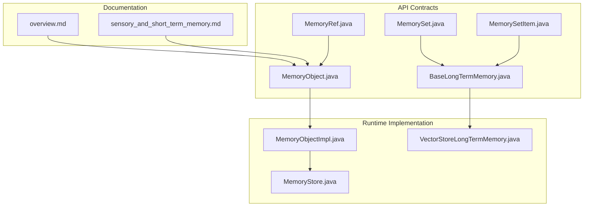
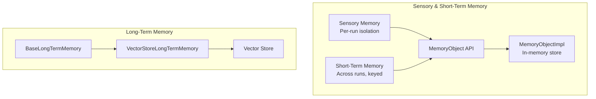
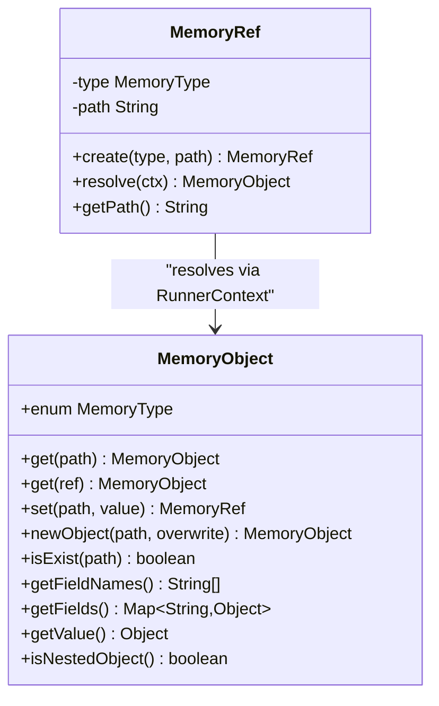
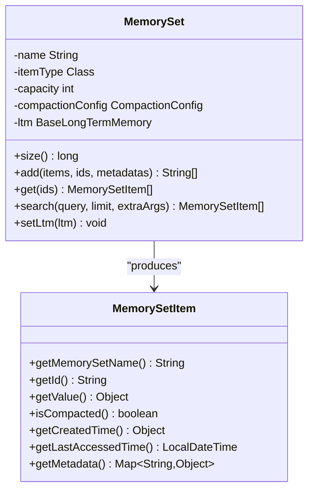
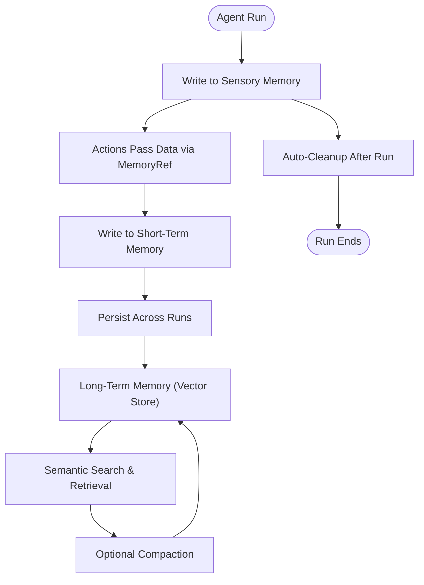
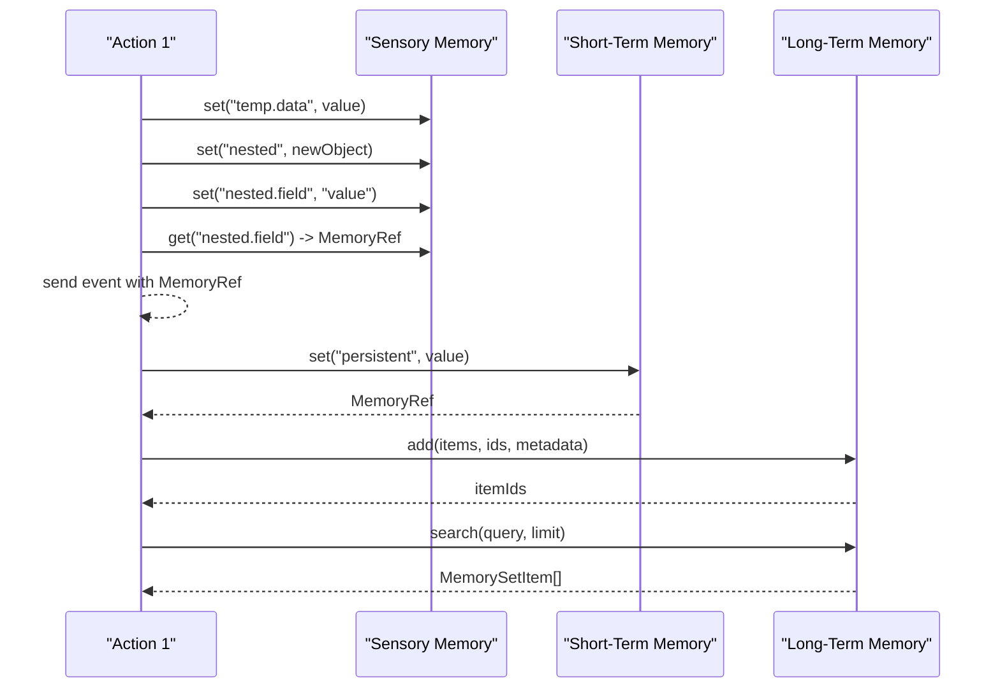
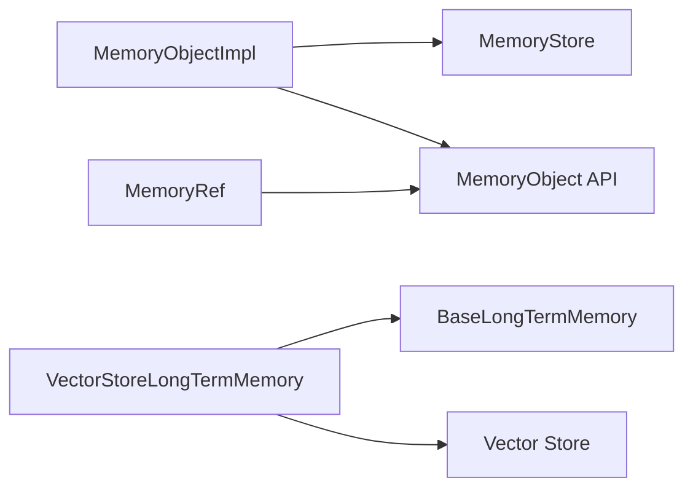

# Memory Hierarchy Overview

<cite>
**Referenced Files in This Document**
- [MemoryObject.java](file://api/src/main/java/org/apache/flink/agents/api/context/MemoryObject.java)
- [MemoryRef.java](file://api/src/main/java/org/apache/flink/agents/api/context/MemoryRef.java)
- [MemorySet.java](file://api/src/main/java/org/apache/flink/agents/api/memory/MemorySet.java)
- [MemorySetItem.java](file://api/src/main/java/org/apache/flink/agents/api/memory/MemorySetItem.java)
- [BaseLongTermMemory.java](file://api/src/main/java/org/apache/flink/agents/api/memory/BaseLongTermMemory.java)
- [overview.md](file://docs/content/docs/development/memory/overview.md)
- [sensory_and_short_term_memory.md](file://docs/content/docs/development/memory/sensory_and_short_term_memory.md)
- [MemoryObjectImpl.java](file://runtime/src/main/java/org/apache/flink/agents/runtime/memory/MemoryObjectImpl.java)
- [MemoryStore.java](file://runtime/src/main/java/org/apache/flink/agents/runtime/memory/MemoryStore.java)
- [VectorStoreLongTermMemory.java](file://runtime/src/main/java/org/apache/flink/agents/runtime/memory/VectorStoreLongTermMemory.java)
- [MemoryObjectTest.java](file://e2e-test/flink-agents-end-to-end-tests-integration/src/test/java/org/apache/flink/agents/integration/test/MemoryObjectTest.java)
- [MemorySetTest.java](file://api/src/test/java/org/apache/flink/agents/api/memory/MemorySetTest.java)
</cite>

## Table of Contents
1. [Introduction](#introduction)
2. [Project Structure](#project-structure)
3. [Core Components](#core-components)
4. [Architecture Overview](#architecture-overview)
5. [Detailed Component Analysis](#detailed-component-analysis)
6. [Dependency Analysis](#dependency-analysis)
7. [Performance Considerations](#performance-considerations)
8. [Troubleshooting Guide](#troubleshooting-guide)
9. [Conclusion](#conclusion)

## Introduction
This document explains the memory hierarchy in Flink Agents, focusing on the three-tier memory system:
- Sensory memory: temporary per-run data for intermediate results and cross-action passing.
- Short-term memory: persistent across multiple runs within a key partition, enabling exact retrieval.
- Long-term memory: externalized storage with compaction and semantic search for scalable, derived context.

It documents the MemoryObject and MemoryRef interfaces, MemorySet collection semantics, memory types, access patterns, hierarchical structure, lifecycle and scope management, and integration patterns with the broader agent system.

## Project Structure
The memory system spans API contracts and runtime implementations:
- API contracts define the memory interfaces and abstractions (MemoryObject, MemoryRef, MemorySet, BaseLongTermMemory).
- Runtime implementations provide concrete behavior for short-term memory (in-memory) and long-term memory (vector store-backed).
- Documentation describes memory types, access patterns, and lifecycle.

**Diagram sources**
- [MemoryObject.java](file://api/src/main/java/org/apache/flink/agents/api/context/MemoryObject.java#L29-L131)
- [MemoryRef.java](file://api/src/main/java/org/apache/flink/agents/api/context/MemoryRef.java#L28-L87)
- [MemorySet.java](file://api/src/main/java/org/apache/flink/agents/api/memory/MemorySet.java#L32-L159)
- [MemorySetItem.java](file://api/src/main/java/org/apache/flink/agents/api/memory/MemorySetItem.java#L23-L94)
- [BaseLongTermMemory.java](file://api/src/main/java/org/apache/flink/agents/api/memory/BaseLongTermMemory.java#L33-L133)
- [MemoryObjectImpl.java](file://runtime/src/main/java/org/apache/flink/agents/runtime/memory/MemoryObjectImpl.java#L33-L259)
- [MemoryStore.java](file://runtime/src/main/java/org/apache/flink/agents/runtime/memory/MemoryStore.java#L23-L51)
- [VectorStoreLongTermMemory.java](file://runtime/src/main/java/org/apache/flink/agents/runtime/memory/VectorStoreLongTermMemory.java#L57-L314)
- [overview.md](file://docs/content/docs/development/memory/overview.md#L31-L81)
- [sensory_and_short_term_memory.md](file://docs/content/docs/development/memory/sensory_and_short_term_memory.md#L26-L262)

**Section sources**
- [overview.md](file://docs/content/docs/development/memory/overview.md#L31-L81)
- [sensory_and_short_term_memory.md](file://docs/content/docs/development/memory/sensory_and_short_term_memory.md#L26-L262)

## Core Components
- MemoryObject: Hierarchical key-value abstraction supporting direct primitive values and nested objects. Provides path-based access, existence checks, field enumeration, and value extraction.
- MemoryRef: Serializable reference to a specific memory location in Sensory or Short-Term memory, enabling efficient cross-action passing.
- MemorySet: Typed collection container for long-term memory with capacity, compaction configuration, and operations for add/get/search.
- MemorySetItem: Represents an item stored in a MemorySet, including metadata, timestamps, and compacted state.
- BaseLongTermMemory: Interface for long-term memory operations (create/get/delete/set size/add/get/delete/search).

Practical usage patterns:
- Sensory memory: auto-cleaned per run; ideal for intermediate results and cross-action references.
- Short-term memory: keyed state across runs; exact retrieval semantics.
- Long-term memory: external vector store; semantic search and compaction.

**Section sources**
- [MemoryObject.java](file://api/src/main/java/org/apache/flink/agents/api/context/MemoryObject.java#L29-L131)
- [MemoryRef.java](file://api/src/main/java/org/apache/flink/agents/api/context/MemoryRef.java#L28-L87)
- [MemorySet.java](file://api/src/main/java/org/apache/flink/agents/api/memory/MemorySet.java#L32-L159)
- [MemorySetItem.java](file://api/src/main/java/org/apache/flink/agents/api/memory/MemorySetItem.java#L23-L94)
- [BaseLongTermMemory.java](file://api/src/main/java/org/apache/flink/agents/api/memory/BaseLongTermMemory.java#L33-L133)
- [overview.md](file://docs/content/docs/development/memory/overview.md#L47-L81)
- [sensory_and_short_term_memory.md](file://docs/content/docs/development/memory/sensory_and_short_term_memory.md#L26-L262)

## Architecture Overview
The memory hierarchy integrates three layers:
- Sensory and Short-Term Memory: In-memory, keyed by input key, with automatic cleanup for sensory memory after a run.
- Long-Term Memory: Backed by a vector store; supports semantic search and compaction to keep context concise and relevant.

**Diagram sources**
- [overview.md](file://docs/content/docs/development/memory/overview.md#L47-L81)
- [sensory_and_short_term_memory.md](file://docs/content/docs/development/memory/sensory_and_short_term_memory.md#L26-L262)
- [MemoryObject.java](file://api/src/main/java/org/apache/flink/agents/api/context/MemoryObject.java#L29-L131)
- [MemoryObjectImpl.java](file://runtime/src/main/java/org/apache/flink/agents/runtime/memory/MemoryObjectImpl.java#L33-L259)
- [BaseLongTermMemory.java](file://api/src/main/java/org/apache/flink/agents/api/memory/BaseLongTermMemory.java#L33-L133)
- [VectorStoreLongTermMemory.java](file://runtime/src/main/java/org/apache/flink/agents/runtime/memory/VectorStoreLongTermMemory.java#L57-L314)

## Detailed Component Analysis

### MemoryObject and MemoryRef: Hierarchical Access and References
- MemoryObject supports:
  - Direct field access for primitives and collections.
  - Indirect field access via nested objects.
  - Path-based navigation and reference-based retrieval.
  - Existence checks, field enumeration, and value extraction.
- MemoryRef encapsulates a path and memory type, resolving to the actual MemoryObject via RunnerContext.

**Diagram sources**
- [MemoryObject.java](file://api/src/main/java/org/apache/flink/agents/api/context/MemoryObject.java#L29-L131)
- [MemoryRef.java](file://api/src/main/java/org/apache/flink/agents/api/context/MemoryRef.java#L28-L87)

Implementation highlights:
- MemoryObjectImpl manages a hierarchical in-memory store, tracks updates, and supports parent chain creation for nested paths.
- MemoryRef is serializable and lightweight, enabling efficient cross-action passing.

**Section sources**
- [MemoryObject.java](file://api/src/main/java/org/apache/flink/agents/api/context/MemoryObject.java#L29-L131)
- [MemoryRef.java](file://api/src/main/java/org/apache/flink/agents/api/context/MemoryRef.java#L28-L87)
- [MemoryObjectImpl.java](file://runtime/src/main/java/org/apache/flink/agents/runtime/memory/MemoryObjectImpl.java#L33-L259)
- [MemoryStore.java](file://runtime/src/main/java/org/apache/flink/agents/runtime/memory/MemoryStore.java#L23-L51)

### MemorySet: Managing Collections of Memory Items
- MemorySet defines a typed collection with:
  - Name, item type, capacity, and compaction configuration.
  - Operations: size, add (with optional IDs and metadata), get, and semantic search.
- MemorySetItem carries the stored value, metadata, timestamps, and compacted state.

**Diagram sources**
- [MemorySet.java](file://api/src/main/java/org/apache/flink/agents/api/memory/MemorySet.java#L32-L159)
- [MemorySetItem.java](file://api/src/main/java/org/apache/flink/agents/api/memory/MemorySetItem.java#L23-L94)

Long-term memory integration:
- VectorStoreLongTermMemory implements BaseLongTermMemory, providing:
  - Collection creation and retrieval backed by a vector store.
  - Add with automatic compaction when capacity is exceeded.
  - Get, delete, and semantic search over collections.
  - Asynchronous compaction support.

**Section sources**
- [MemorySet.java](file://api/src/main/java/org/apache/flink/agents/api/memory/MemorySet.java#L32-L159)
- [MemorySetItem.java](file://api/src/main/java/org/apache/flink/agents/api/memory/MemorySetItem.java#L23-L94)
- [BaseLongTermMemory.java](file://api/src/main/java/org/apache/flink/agents/api/memory/BaseLongTermMemory.java#L33-L133)
- [VectorStoreLongTermMemory.java](file://runtime/src/main/java/org/apache/flink/agents/runtime/memory/VectorStoreLongTermMemory.java#L57-L314)

### Access Patterns and Hierarchical Structure
- Sensory memory: per-run, auto-cleanup; suitable for temporary data and references.
- Short-term memory: keyed state across runs; supports nested objects and path-based access.
- Long-term memory: semantic search and compaction; derived context for large-scale knowledge.

**Diagram sources**
- [overview.md](file://docs/content/docs/development/memory/overview.md#L47-L81)
- [sensory_and_short_term_memory.md](file://docs/content/docs/development/memory/sensory_and_short_term_memory.md#L26-L262)

**Section sources**
- [overview.md](file://docs/content/docs/development/memory/overview.md#L47-L81)
- [sensory_and_short_term_memory.md](file://docs/content/docs/development/memory/sensory_and_short_term_memory.md#L26-L262)

### Practical Examples and Lifecycle Management
- Creating and manipulating MemoryObject:
  - Store primitives, collections, POJOs, and nested objects.
  - Use newObject for nested structures; set returns MemoryRef for cross-action passing.
- Reference resolution:
  - Resolve MemoryRef via RunnerContext to access underlying data.
- Memory lifecycle:
  - Sensory memory is cleaned after a run; short-term memory persists across runs for the same key; long-term memory is managed externally with compaction and search.

**Diagram sources**
- [sensory_and_short_term_memory.md](file://docs/content/docs/development/memory/sensory_and_short_term_memory.md#L76-L262)
- [MemoryObject.java](file://api/src/main/java/org/apache/flink/agents/api/context/MemoryObject.java#L29-L131)
- [MemoryRef.java](file://api/src/main/java/org/apache/flink/agents/api/context/MemoryRef.java#L28-L87)
- [VectorStoreLongTermMemory.java](file://runtime/src/main/java/org/apache/flink/agents/runtime/memory/VectorStoreLongTermMemory.java#L137-L244)

**Section sources**
- [sensory_and_short_term_memory.md](file://docs/content/docs/development/memory/sensory_and_short_term_memory.md#L76-L262)
- [MemoryObjectTest.java](file://e2e-test/flink-agents-end-to-end-tests-integration/src/test/java/org/apache/flink/agents/integration/test/MemoryObjectTest.java#L34-L70)
- [MemorySetTest.java](file://api/src/test/java/org/apache/flink/agents/api/memory/MemorySetTest.java#L27-L42)

## Dependency Analysis
- MemoryObjectImpl depends on MemoryStore for in-memory persistence and tracks MemoryUpdate for change logging.
- VectorStoreLongTermMemory depends on BaseVectorStore for add/get/query/delete and on RunnerContext for resource resolution and configuration.
- MemoryRef resolves against either Sensory or Short-Term Memory via RunnerContext.

**Diagram sources**
- [MemoryObjectImpl.java](file://runtime/src/main/java/org/apache/flink/agents/runtime/memory/MemoryObjectImpl.java#L33-L259)
- [MemoryStore.java](file://runtime/src/main/java/org/apache/flink/agents/runtime/memory/MemoryStore.java#L23-L51)
- [VectorStoreLongTermMemory.java](file://runtime/src/main/java/org/apache/flink/agents/runtime/memory/VectorStoreLongTermMemory.java#L57-L314)
- [MemoryRef.java](file://api/src/main/java/org/apache/flink/agents/api/context/MemoryRef.java#L28-L87)

**Section sources**
- [MemoryObjectImpl.java](file://runtime/src/main/java/org/apache/flink/agents/runtime/memory/MemoryObjectImpl.java#L33-L259)
- [MemoryStore.java](file://runtime/src/main/java/org/apache/flink/agents/runtime/memory/MemoryStore.java#L23-L51)
- [VectorStoreLongTermMemory.java](file://runtime/src/main/java/org/apache/flink/agents/runtime/memory/VectorStoreLongTermMemory.java#L57-L314)
- [MemoryRef.java](file://api/src/main/java/org/apache/flink/agents/api/context/MemoryRef.java#L28-L87)

## Performance Considerations
- Sensory memory: minimal footprint; auto-cleaned to prevent accumulation across runs.
- Short-term memory: leverages keyed state; use MemoryRef to avoid large payload serialization.
- Long-term memory: compaction reduces storage and improves retrieval speed; asynchronous compaction can improve throughput.

[No sources needed since this section provides general guidance]

## Troubleshooting Guide
- Overwriting nested objects with primitive values:
  - Attempting to set a primitive over an existing nested object raises an error; use newObject with overwrite semantics when appropriate.
- Non-existent paths:
  - Accessing non-existent paths returns null or throws depending on the API variant; ensure parent nodes exist or rely on automatic parent creation for set operations.
- Reference resolution failures:
  - MemoryRef.resolve requires a valid RunnerContext and a matching memory type; ensure the path exists in the intended memory tier.

**Section sources**
- [MemoryObjectImpl.java](file://runtime/src/main/java/org/apache/flink/agents/runtime/memory/MemoryObjectImpl.java#L104-L106)
- [MemoryRef.java](file://api/src/main/java/org/apache/flink/agents/api/context/MemoryRef.java#L56-L64)

## Conclusion
Flink Agents’ memory hierarchy provides a structured, scalable approach to handling temporary, persistent, and long-term data. MemoryObject and MemoryRef enable flexible, hierarchical access and efficient cross-action passing. MemorySet and BaseLongTermMemory offer robust collection management with compaction and semantic search. Sensory memory ensures per-run isolation, short-term memory enables exact retrieval across runs, and long-term memory delivers derived, compacted context for large-scale scenarios.